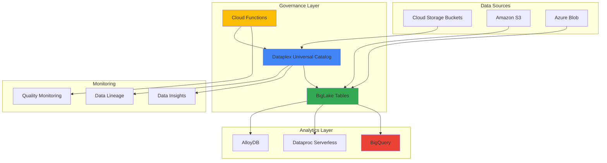

# Data Lake Governance with Dataplex and BigLake

## Problem

Organizations struggle with data sprawl across multi-cloud environments, lacking centralized governance for quality control, security policies, and metadata management. Traditional data catalogs require manual curation and fail to automatically discover, classify, and monitor data assets in real-time, leading to compliance risks and reduced analytics effectiveness.

## Solution

Implement an intelligent data governance system using Google Cloud Dataplex Universal Catalog for AI-powered metadata discovery and BigLake for unified analytics access control. This solution automatically catalogs data assets, enforces fine-grained security policies, and enables real-time quality monitoring across cloud storage while maintaining performance for analytics workloads.

## Architecture Diagram



## Prerequisites

1. Google Cloud project with billing enabled and appropriate IAM permissions:
   - Dataplex Admin (`roles/dataplex.admin`)
   - BigQuery Admin (`roles/bigquery.admin`)
   - Cloud Functions Developer (`roles/cloudfunctions.developer`)
   - Storage Admin (`roles/storage.admin`)
2. gcloud CLI installed and configured (version 450.0.0 or later)
3. Basic understanding of data governance concepts and SQL
4. Familiarity with Google Cloud IAM and resource management
5. Estimated cost: $50-100 for running this recipe (varies by data volume and query frequency)

> **Note**: This recipe creates billable resources including Dataplex discovery jobs, BigQuery queries, and Cloud Functions executions. Monitor usage through the [Google Cloud Billing console](https://cloud.google.com/billing/docs/how-to/budgets) to avoid unexpected charges.

## Preparation

```bash
# Set environment variables for GCP resources
export PROJECT_ID="data-governance-$(date +%s)"
export REGION="us-central1"
export ZONE="us-central1-a"
export LAKE_NAME="enterprise-data-lake"
export ZONE_NAME="raw-data-zone"

# Generate unique suffix for resource names
RANDOM_SUFFIX=$(openssl rand -hex 3)
export BUCKET_NAME="governance-demo-${RANDOM_SUFFIX}"
export DATASET_NAME="governance_analytics"
export CONNECTION_NAME="biglake-connection-${RANDOM_SUFFIX}"

# Set default project and region
gcloud config set project ${PROJECT_ID}
gcloud config set compute/region ${REGION}
gcloud config set compute/zone ${ZONE}

# Enable required APIs
gcloud services enable dataplex.googleapis.com
gcloud services enable bigquery.googleapis.com
gcloud services enable cloudfunctions.googleapis.com
gcloud services enable storage.googleapis.com
gcloud services enable bigqueryconnection.googleapis.com

echo "✅ Project configured: ${PROJECT_ID}"
echo "✅ Required APIs enabled"

# Create Cloud Storage bucket for sample data
gsutil mb -p ${PROJECT_ID} \
    -c STANDARD \
    -l ${REGION} \
    gs://${BUCKET_NAME}

echo "✅ Storage bucket created: gs://${BUCKET_NAME}"

# Create sample datasets for governance demonstration
cat > customer_data.csv << 'EOF'
customer_id,name,email,phone,registration_date,country
1001,John Smith,john.smith@email.com,555-0123,2024-01-15,USA
1002,Jane Doe,jane.doe@email.com,555-0124,2024-01-16,Canada
1003,Bob Johnson,bob.johnson@email.com,555-0125,2024-01-17,USA
1004,Alice Brown,alice.brown@email.com,555-0126,2024-01-18,UK
EOF

cat > transaction_data.csv << 'EOF'
transaction_id,customer_id,amount,currency,transaction_date,category
TXN001,1001,150.50,USD,2024-02-01,retail
TXN002,1002,89.99,CAD,2024-02-02,online
TXN003,1001,200.00,USD,2024-02-03,retail
TXN004,1003,75.25,USD,2024-02-04,dining
EOF

# Upload sample data to Cloud Storage
gsutil cp customer_data.csv gs://${BUCKET_NAME}/raw/customers/
gsutil cp transaction_data.csv gs://${BUCKET_NAME}/raw/transactions/

echo "✅ Sample data uploaded to Cloud Storage"
```

## Steps

1. **Create Dataplex Lake and Zone for Data Organization**:

   Dataplex organizes data assets into lakes and zones, providing a hierarchical structure for governance policies. A lake represents a logical collection of data assets, while zones define security and access boundaries within the lake. This organizational structure enables consistent policy enforcement across distributed data assets.

   ```bash
   # Create Dataplex lake for enterprise data governance
   gcloud dataplex lakes create ${LAKE_NAME} \
       --location=${REGION} \
       --display-name="Enterprise Data Lake" \
       --description="Centralized governance for enterprise data assets"
   
   # Create zone for raw data with discovery enabled
   gcloud dataplex zones create ${ZONE_NAME} \
       --location=${REGION} \
       --lake=${LAKE_NAME} \
       --type=RAW \
       --discovery-enabled \
       --resource-location-type=SINGLE_REGION
   
   echo "✅ Dataplex lake and zone created successfully"
   ```

   The Dataplex lake now provides a unified governance framework with automatic metadata discovery enabled. This foundation allows Dataplex to scan and catalog data assets automatically, applying AI-powered classification and quality profiling to understand your data landscape.

2. **Create BigQuery Dataset and External Connection for Multi-Cloud Access**:

   BigLake provides unified access to data across multiple cloud storage systems through external connections. These connections handle authentication and provide a secure pathway for BigQuery to access data in Cloud Storage, Amazon S3, or Azure Blob Storage while maintaining fine-grained access control.

   ```bash
   # Create BigQuery dataset for analytics
   bq mk --dataset \
       --location=${REGION} \
       --description="Analytics dataset with BigLake governance" \
       ${PROJECT_ID}:${DATASET_NAME}
   
   # Create external connection for BigLake tables
   bq mk --connection \
       --location=${REGION} \
       --connection_type=CLOUD_RESOURCE \
       ${CONNECTION_NAME}
   
   # Get connection service account for IAM setup
   CONNECTION_SA=$(bq show --connection \
       --location=${REGION} \
       ${CONNECTION_NAME} \
       --format="value(cloudResource.serviceAccountId)")
   
   echo "✅ BigQuery dataset and connection created"
   echo "Connection service account: ${CONNECTION_SA}"
   ```

   The external connection establishes a secure bridge between BigQuery and cloud storage, using a Google-managed service account. This architecture ensures data access is governed by BigLake policies rather than direct storage permissions, enabling consistent security across multi-cloud environments.

3. **Configure IAM Permissions for BigLake Service Account**:

   BigLake requires specific IAM permissions to access Cloud Storage data and integrate with Dataplex for metadata management. The service account needs storage access permissions and Dataplex integration capabilities to enable comprehensive governance features.

   ```bash
   # Grant Storage Object Viewer to BigLake connection
   gsutil iam ch \
       serviceAccount:${CONNECTION_SA}:objectViewer \
       gs://${BUCKET_NAME}
   
   # Grant Dataplex permissions for metadata integration
   gcloud projects add-iam-policy-binding ${PROJECT_ID} \
       --member="serviceAccount:${CONNECTION_SA}" \
       --role="roles/dataplex.viewer"
   
   # Grant BigQuery permissions for table creation
   gcloud projects add-iam-policy-binding ${PROJECT_ID} \
       --member="serviceAccount:${CONNECTION_SA}" \
       --role="roles/bigquery.dataEditor"
   
   echo "✅ IAM permissions configured for BigLake integration"
   ```

   These permissions enable the BigLake service account to access storage data, participate in Dataplex governance workflows, and maintain metadata consistency across the data platform. The least-privilege approach ensures security while enabling full governance capabilities.

4. **Create BigLake Tables with Governance Features**:

   BigLake tables provide secure, governed access to external data with features like fine-grained access control, data masking, and audit logging. Creating these tables establishes the foundation for analytics while maintaining enterprise-grade security and compliance requirements.

   ```bash
   # Create BigLake table for customer data
   bq mk --table \
       --external_table_definition=@/dev/stdin \
       ${DATASET_NAME}.customers_biglake << EOF
   {
     "sourceFormat": "CSV",
     "sourceUris": ["gs://${BUCKET_NAME}/raw/customers/*"],
     "schema": {
       "fields": [
         {"name": "customer_id", "type": "INTEGER", "mode": "REQUIRED"},
         {"name": "name", "type": "STRING", "mode": "REQUIRED"},
         {"name": "email", "type": "STRING", "mode": "REQUIRED"},
         {"name": "phone", "type": "STRING", "mode": "NULLABLE"},
         {"name": "registration_date", "type": "DATE", "mode": "REQUIRED"},
         {"name": "country", "type": "STRING", "mode": "REQUIRED"}
       ]
     },
     "connectionId": "${PROJECT_ID}.${REGION}.${CONNECTION_NAME}",
     "csvOptions": {
       "skipLeadingRows": 1
     }
   }
   EOF
   
   # Create BigLake table for transaction data
   bq mk --table \
       --external_table_definition=@/dev/stdin \
       ${DATASET_NAME}.transactions_biglake << EOF
   {
     "sourceFormat": "CSV",
     "sourceUris": ["gs://${BUCKET_NAME}/raw/transactions/*"],
     "schema": {
       "fields": [
         {"name": "transaction_id", "type": "STRING", "mode": "REQUIRED"},
         {"name": "customer_id", "type": "INTEGER", "mode": "REQUIRED"},
         {"name": "amount", "type": "NUMERIC", "mode": "REQUIRED"},
         {"name": "currency", "type": "STRING", "mode": "REQUIRED"},
         {"name": "transaction_date", "type": "DATE", "mode": "REQUIRED"},
         {"name": "category", "type": "STRING", "mode": "REQUIRED"}
       ]
     },
     "connectionId": "${PROJECT_ID}.${REGION}.${CONNECTION_NAME}",
     "csvOptions": {
       "skipLeadingRows": 1
     }
   }
   EOF
   
   echo "✅ BigLake tables created with governance controls"
   ```

   The BigLake tables now provide secure, governed access to external data while maintaining the flexibility to query across cloud storage systems. These tables automatically inherit Dataplex governance policies and enable advanced features like row-level security and dynamic data masking.

5. **Create Dataplex Asset for Automatic Discovery**:

   Dataplex assets represent collections of data that should be governed together. Creating assets triggers automatic discovery, profiling, and quality assessment processes that populate the Universal Catalog with rich metadata and business context.

   ```bash
   # Create Dataplex asset for Cloud Storage bucket
   gcloud dataplex assets create governance-bucket-asset \
       --location=${REGION} \
       --lake=${LAKE_NAME} \
       --zone=${ZONE_NAME} \
       --resource-type=STORAGE_BUCKET \
       --resource-name=projects/${PROJECT_ID}/buckets/${BUCKET_NAME} \
       --discovery-enabled \
       --discovery-include-patterns="gs://${BUCKET_NAME}/raw/*" \
       --discovery-csv-delimiter="," \
       --discovery-csv-header-rows=1
   
   echo "✅ Dataplex asset created for automatic discovery"
   echo "Discovery job will begin automatically and may take 5-10 minutes"
   ```

   The Dataplex asset enables continuous discovery and monitoring of data changes in Cloud Storage. The discovery process uses AI to understand data structure, identify sensitive information, and assess quality metrics, automatically updating the Universal Catalog as data evolves.

6. **Deploy Cloud Function for Quality Monitoring**:

   Cloud Functions provide serverless automation for data governance workflows, enabling real-time quality monitoring, policy enforcement, and remediation actions. This function monitors data quality metrics and triggers alerts when governance policies are violated.

   ```bash
   # Create directory for Cloud Function code
   mkdir -p governance-function
   cd governance-function
   
   # Create requirements.txt for dependencies
   cat > requirements.txt << 'EOF'
   google-cloud-dataplex==1.13.1
   google-cloud-bigquery==3.17.2
   google-cloud-logging==3.9.0
   functions-framework==3.5.0
   EOF
   
   # Create main function code for governance monitoring
   cat > main.py << 'EOF'
import functions_framework
from google.cloud import dataplex_v1
from google.cloud import bigquery
from google.cloud import logging
import json
import os

@functions_framework.http
def governance_monitor(request):
    """Monitor data quality and governance metrics"""
    
    # Initialize clients
    dataplex_client = dataplex_v1.DataplexServiceClient()
    bq_client = bigquery.Client()
    logging_client = logging.Client()
    logger = logging_client.logger("governance-monitor")
    
    project_id = os.environ.get('GCP_PROJECT')
    location = os.environ.get('REGION', 'us-central1')
    
    try:
        # Query data quality metrics from BigLake tables
        quality_query = f"""
        SELECT 
            'customers_biglake' as table_name,
            COUNT(*) as total_rows,
            COUNT(DISTINCT customer_id) as unique_customers,
            COUNTIF(email IS NULL OR email = '') as missing_emails,
            COUNTIF(REGEXP_CONTAINS(email, r'^[^@]+@[^@]+\.[^@]+$') = FALSE) as invalid_emails
        FROM `{project_id}.governance_analytics.customers_biglake`
        UNION ALL
        SELECT 
            'transactions_biglake' as table_name,
            COUNT(*) as total_rows,
            COUNT(DISTINCT transaction_id) as unique_transactions,
            COUNTIF(amount <= 0) as invalid_amounts,
            COUNTIF(currency NOT IN ('USD', 'CAD', 'EUR', 'GBP')) as invalid_currencies
        FROM `{project_id}.governance_analytics.transactions_biglake`
        """
        
        # Execute quality monitoring query
        query_job = bq_client.query(quality_query)
        results = query_job.result()
        
        # Process results and log quality metrics
        quality_metrics = []
        for row in results:
            metrics = dict(row)
            quality_metrics.append(metrics)
            
            # Log quality issues
            if 'missing_emails' in metrics and metrics['missing_emails'] > 0:
                logger.warning(f"Data quality issue: {metrics['missing_emails']} missing emails in {metrics['table_name']}")
            
            if 'invalid_amounts' in metrics and metrics['invalid_amounts'] > 0:
                logger.warning(f"Data quality issue: {metrics['invalid_amounts']} invalid amounts in {metrics['table_name']}")
        
        return {
            'status': 'success',
            'quality_metrics': quality_metrics,
            'message': 'Governance monitoring completed successfully'
        }
        
    except Exception as e:
        logger.error(f"Governance monitoring failed: {str(e)}")
        return {
            'status': 'error',
            'message': f'Monitoring failed: {str(e)}'
        }, 500
   EOF
   
   # Deploy Cloud Function
   gcloud functions deploy governance-monitor \
       --runtime=python311 \
       --trigger=http \
       --entry-point=governance_monitor \
       --memory=256MB \
       --timeout=300s \
       --set-env-vars="REGION=${REGION}" \
       --allow-unauthenticated
   
   cd ..
   
   echo "✅ Cloud Function deployed for governance monitoring"
   ```

   The Cloud Function provides automated governance monitoring capabilities, executing quality checks and policy validations on a schedule or in response to data changes. This serverless approach ensures continuous governance without infrastructure overhead while maintaining scalability and cost efficiency.

7. **Configure Data Lineage and Quality Profiling**:

   Dataplex provides comprehensive data lineage tracking and quality profiling that helps understand data flow, dependencies, and quality trends over time. These features are essential for impact analysis, compliance reporting, and maintaining data trust across the organization.

   ```bash
   # Wait for connection service account to be fully propagated
   sleep 30
   
   # Create data profile task for quality assessment
   gcloud dataplex tasks create quality-profile-task \
       --location=${REGION} \
       --lake=${LAKE_NAME} \
       --trigger-type=RECURRING \
       --trigger-schedule="0 2 * * *" \
       --execution-service-account="${CONNECTION_SA}" \
       --spark-main-class="com.google.cloud.dataplex.templates.dataquality.DataQualityMainClass" \
       --spark-file-uris="gs://dataplex-public-assets/data-quality-template.jar"
   
   echo "✅ Data quality profiling configured"
   echo "Tasks will execute automatically based on defined schedules"
   ```

   These automated tasks provide continuous insights into data quality trends and governance compliance. The recurring schedule ensures that quality metrics are updated regularly, enabling proactive identification and resolution of data issues.

## Validation & Testing

1. **Verify Dataplex Discovery and Catalog Population**:

   ```bash
   # Check Dataplex lake and zone status
   gcloud dataplex lakes describe ${LAKE_NAME} \
       --location=${REGION} \
       --format="table(name,state,createTime)"
   
   # List discovered entities in Dataplex catalog
   gcloud dataplex entities list \
       --location=${REGION} \
       --lake=${LAKE_NAME} \
       --zone=${ZONE_NAME} \
       --format="table(name,type,system)"
   ```

   Expected output: Lake in ACTIVE state with discovered entities representing your Cloud Storage data files.

2. **Test BigLake Table Queries and Governance**:

   ```bash
   # Query customer data through BigLake
   bq query --use_legacy_sql=false \
       "SELECT country, COUNT(*) as customer_count
        FROM \`${PROJECT_ID}.${DATASET_NAME}.customers_biglake\`
        GROUP BY country
        ORDER BY customer_count DESC"
   
   # Query transaction analytics with joins
   bq query --use_legacy_sql=false \
       "SELECT 
          c.country,
          COUNT(t.transaction_id) as transaction_count,
          SUM(t.amount) as total_amount
        FROM \`${PROJECT_ID}.${DATASET_NAME}.customers_biglake\` c
        JOIN \`${PROJECT_ID}.${DATASET_NAME}.transactions_biglake\` t
          ON c.customer_id = t.customer_id
        GROUP BY c.country
        ORDER BY total_amount DESC"
   ```

   Expected output: Query results showing data from Cloud Storage accessed through BigLake with consistent performance and security.

3. **Test Governance Monitoring Function**:

   ```bash
   # Get Cloud Function URL
   FUNCTION_URL=$(gcloud functions describe governance-monitor \
       --region=${REGION} \
       --format="value(httpsTrigger.url)")
   
   # Test governance monitoring
   curl -X POST "${FUNCTION_URL}" \
       -H "Content-Type: application/json" \
       -d '{"action": "monitor_quality"}'
   ```

   Expected output: JSON response with quality metrics and governance status for monitored tables.

4. **Verify Data Quality Profile Results**:

   ```bash
   # Check task execution status
   gcloud dataplex tasks list \
       --location=${REGION} \
       --lake=${LAKE_NAME} \
       --format="table(name,state,createTime,updateTime)"
   
   # View asset discovery status
   gcloud dataplex assets describe governance-bucket-asset \
       --location=${REGION} \
       --lake=${LAKE_NAME} \
       --zone=${ZONE_NAME} \
       --format="table(name,state,discoveryStatus)"
   ```

   Expected output: Completed tasks with asset in ACTIVE state showing successful discovery.

## Cleanup

1. **Remove Cloud Function and Associated Resources**:

   ```bash
   # Delete Cloud Function
   gcloud functions delete governance-monitor \
       --region=${REGION} \
       --quiet
   
   # Remove function source code
   rm -rf governance-function/
   
   echo "✅ Cloud Function and source code removed"
   ```

2. **Delete Dataplex Resources**:

   ```bash
   # Delete Dataplex tasks
   gcloud dataplex tasks delete quality-profile-task \
       --location=${REGION} \
       --lake=${LAKE_NAME} \
       --quiet
   
   # Delete Dataplex asset
   gcloud dataplex assets delete governance-bucket-asset \
       --location=${REGION} \
       --lake=${LAKE_NAME} \
       --zone=${ZONE_NAME} \
       --quiet
   
   # Delete Dataplex zone and lake
   gcloud dataplex zones delete ${ZONE_NAME} \
       --location=${REGION} \
       --lake=${LAKE_NAME} \
       --quiet
   
   gcloud dataplex lakes delete ${LAKE_NAME} \
       --location=${REGION} \
       --quiet
   
   echo "✅ Dataplex resources deleted"
   ```

3. **Remove BigQuery and Storage Resources**:

   ```bash
   # Delete BigQuery dataset and tables
   bq rm -r -f ${PROJECT_ID}:${DATASET_NAME}
   
   # Delete BigQuery connection
   bq rm --connection \
       --location=${REGION} \
       ${CONNECTION_NAME}
   
   # Delete Cloud Storage bucket and contents
   gsutil -m rm -r gs://${BUCKET_NAME}
   
   # Clean up local files
   rm -f customer_data.csv transaction_data.csv
   
   echo "✅ BigQuery and Storage resources cleaned up"
   ```

4. **Remove IAM Bindings and Project Resources**:

   ```bash
   # Note: Service account IAM bindings are automatically cleaned up
   # when the connection is deleted
   
   # Clear environment variables
   unset PROJECT_ID REGION ZONE LAKE_NAME ZONE_NAME
   unset BUCKET_NAME DATASET_NAME CONNECTION_NAME RANDOM_SUFFIX
   
   echo "✅ Environment variables cleared"
   echo "Note: Consider deleting the project if created specifically for this recipe"
   ```

## Discussion

This recipe demonstrates Google Cloud's comprehensive approach to data lake governance through the integration of Dataplex Universal Catalog and BigLake. Dataplex provides AI-powered automatic discovery and classification of data assets, while BigLake enables secure, unified access to multi-cloud storage with fine-grained access controls. This combination addresses the critical challenge of maintaining governance across distributed data environments without sacrificing analytical performance or flexibility.

The architecture leverages several key Google Cloud innovations. Dataplex Universal Catalog uses machine learning to automatically understand data structure, identify sensitive information, and assess quality metrics without manual intervention. This AI-driven approach significantly reduces the operational overhead traditionally associated with data governance while improving accuracy and consistency. BigLake's federated querying capabilities allow organizations to maintain data in place while applying consistent security policies, reducing data movement costs and compliance complexity.

The serverless governance monitoring component demonstrates how Cloud Functions can provide real-time policy enforcement and quality assessment. This event-driven architecture ensures that governance violations are detected and addressed immediately, rather than discovered during periodic audits. The integration with Cloud Logging provides comprehensive audit trails, essential for regulatory compliance and operational troubleshooting.

Performance considerations are critical when implementing data lake governance at scale. BigLake's caching mechanisms and query optimization features help maintain analytical performance even with extensive governance controls enabled. For high-volume environments, consider implementing [BigQuery slot reservations](https://cloud.google.com/bigquery/docs/reservations-intro) and [Dataplex autoscaling configurations](https://cloud.google.com/dataplex/docs/manage-discover#autoscaling) to ensure consistent performance. Additionally, [Cloud Monitoring integration](https://cloud.google.com/dataplex/docs/monitor-dataplex) provides real-time visibility into governance workloads and helps optimize resource allocation.

> **Tip**: Implement governance policies incrementally, starting with critical datasets and expanding coverage gradually. Use Dataplex's policy inheritance features to minimize configuration overhead while maintaining consistent security across your data estate.

## Challenge

Extend this intelligent data governance solution with these advanced capabilities:

1. **Multi-Cloud Integration**: Configure BigLake tables for Amazon S3 and Azure Blob Storage data sources, implementing cross-cloud governance policies and demonstrating unified analytics across cloud providers using [BigQuery Omni](https://cloud.google.com/bigquery/docs/omni-introduction).

2. **Advanced Security Controls**: Implement column-level security, row-level security, and dynamic data masking on BigLake tables based on user roles and data classification tags from Dataplex discovery, following [BigQuery fine-grained access control patterns](https://cloud.google.com/bigquery/docs/column-level-security-intro).

3. **Real-Time Governance Streaming**: Deploy Pub/Sub and Dataflow pipelines to process streaming data with real-time governance validation, quality scoring, and automatic remediation using [Cloud Data Loss Prevention API](https://cloud.google.com/dlp/docs) integration.

4. **Machine Learning-Driven Quality**: Build custom Vertex AI models for data quality prediction and anomaly detection, integrating with Dataplex workflows to provide proactive governance insights and automated quality improvement recommendations.

5. **Enterprise Integration**: Implement Apache Atlas compatibility and third-party governance tool integration using Dataplex APIs, enabling hybrid governance across on-premises and cloud environments while maintaining centralized policy management.

## Infrastructure Code

*Infrastructure code will be generated after recipe approval.*