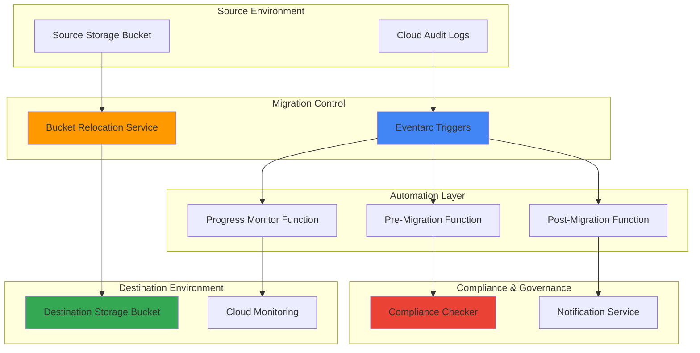

# Data Migration Workflows with Cloud Storage Bucket Relocation and Eventarc

## Problem

Organizations frequently need to relocate data across regions to optimize performance, reduce costs, or meet compliance requirements. Traditional data migration approaches require complex manual scripting, extended downtime, and careful coordination to preserve metadata and maintain application availability. Furthermore, tracking migration progress and ensuring compliance verification throughout the process creates operational overhead and increases the risk of data loss or governance violations.

## Solution

Create an automated data migration and governance system that leverages Google Cloud's bucket relocation feature to seamlessly move data between regions while maintaining continuous operation. The solution uses Eventarc to trigger automated workflows based on storage events, Cloud Functions to process compliance checks and notifications, and Cloud Audit Logs to provide comprehensive tracking throughout the migration lifecycle.

## Architecture Diagram



## Prerequisites

1. Google Cloud account with the following IAM permissions:
   - Storage Admin or Storage Object Admin
   - Cloud Functions Admin
   - Eventarc Admin
   - Cloud Audit Logs Viewer
   - Service Account User
2. gcloud CLI installed and configured (or Cloud Shell)
3. Basic understanding of event-driven architecture and data governance
4. Knowledge of Google Cloud Storage bucket locations and storage classes
5. Estimated cost: $20-50 for the tutorial resources (varies by data volume and retention period)

> **Note**: Bucket relocation is available for most location combinations, but some restrictions apply based on source and destination location types.

## Preparation

```bash
# Set environment variables for GCP resources
export PROJECT_ID="data-migration-$(date +%s)"
export REGION="us-central1"
export SOURCE_REGION="us-west1"
export DEST_REGION="us-east1"

# Generate unique suffix for resource names
RANDOM_SUFFIX=$(openssl rand -hex 3)

# Set project ID and regions
gcloud config set project ${PROJECT_ID}
gcloud config set compute/region ${REGION}

# Enable required APIs
gcloud services enable storage.googleapis.com
gcloud services enable cloudfunctions.googleapis.com
gcloud services enable eventarc.googleapis.com
gcloud services enable logging.googleapis.com
gcloud services enable monitoring.googleapis.com

# Create service account for automation functions
gcloud iam service-accounts create migration-automation \
    --display-name="Migration Automation Service Account"

# Grant necessary permissions to service account
gcloud projects add-iam-policy-binding ${PROJECT_ID} \
    --member="serviceAccount:migration-automation@${PROJECT_ID}.iam.gserviceaccount.com" \
    --role="roles/storage.admin"

gcloud projects add-iam-policy-binding ${PROJECT_ID} \
    --member="serviceAccount:migration-automation@${PROJECT_ID}.iam.gserviceaccount.com" \
    --role="roles/logging.viewer"

echo "✅ Project configured: ${PROJECT_ID}"
echo "✅ Service account created and configured"
```

## Steps

1. **Create Source Storage Bucket with Sample Data**:

   Cloud Storage bucket relocation requires an existing bucket with data to demonstrate the migration workflow. We'll create a source bucket in the us-west1 region and populate it with sample files that include various storage classes and metadata to showcase how relocation preserves these attributes during migration.

   ```bash
   # Create source bucket in us-west1
   export SOURCE_BUCKET="migration-source-${RANDOM_SUFFIX}"
   gsutil mb -p ${PROJECT_ID} \
       -c STANDARD \
       -l ${SOURCE_REGION} \
       gs://${SOURCE_BUCKET}
   
   # Enable versioning and set lifecycle policy
   gsutil versioning set on gs://${SOURCE_BUCKET}
   
   # Create sample data files with different storage classes
   echo "Critical business data - $(date)" > critical-data.txt
   echo "Archive data from last year - $(date)" > archive-data.txt
   echo "Log file entry - $(date)" > application.log
   
   # Upload files with different storage classes and metadata
   gsutil -h "x-goog-meta-data-classification:critical" \
       cp critical-data.txt gs://${SOURCE_BUCKET}/
   
   gsutil -h "x-goog-meta-data-classification:archive" \
       -h "Content-Type:text/plain" \
       cp archive-data.txt gs://${SOURCE_BUCKET}/logs/
   
   gsutil -h "x-goog-meta-source:application-logs" \
       cp application.log gs://${SOURCE_BUCKET}/logs/
   
   echo "✅ Source bucket created with sample data: ${SOURCE_BUCKET}"
   ```

   The source bucket now contains structured data with custom metadata and different storage patterns, providing a realistic scenario for testing the bucket relocation workflow and metadata preservation capabilities.

2. **Set Up Eventarc Triggers for Migration Events**:

   Eventarc enables event-driven automation by capturing Cloud Audit Log events generated during bucket operations. We'll create triggers that respond to bucket relocation events, object modifications, and administrative actions to ensure comprehensive monitoring throughout the migration process.

   ```bash
   # Create Eventarc trigger for bucket administrative events
   gcloud eventarc triggers create bucket-admin-trigger \
       --location=${REGION} \
       --destination-cloud-function=migration-progress-monitor \
       --destination-cloud-function-service=migration-automation@${PROJECT_ID}.iam.gserviceaccount.com \
       --event-filters="type=google.cloud.audit.log.v1.written" \
       --event-filters="serviceName=storage.googleapis.com" \
       --event-filters="methodName=storage.buckets.patch"
   
   # Create trigger for object-level events during migration
   gcloud eventarc triggers create object-event-trigger \
       --location=${REGION} \
       --destination-cloud-function=migration-event-processor \
       --destination-cloud-function-service=migration-automation@${PROJECT_ID}.iam.gserviceaccount.com \
       --event-filters="type=google.cloud.audit.log.v1.written" \
       --event-filters="serviceName=storage.googleapis.com" \
       --event-filters="methodName=storage.objects.create"
   
   echo "✅ Eventarc triggers configured for migration monitoring"
   ```

   These Eventarc triggers create a comprehensive event-driven monitoring system that captures both administrative operations and data-level changes, enabling real-time visibility into migration progress and automated response capabilities.

3. **Deploy Pre-Migration Validation Cloud Function**:

   The pre-migration validation function performs comprehensive checks before initiating bucket relocation, including compatibility validation, metadata analysis, and compliance verification. This function ensures that relocation prerequisites are met and documents the baseline state for comparison after migration.

   ```bash
   # Create directory for Cloud Function source code
   mkdir -p migration-functions/pre-migration
   cd migration-functions/pre-migration
   
   # Create pre-migration validation function
   cat > main.py << 'EOF'
import functions_framework
from google.cloud import storage
from google.cloud import logging
import json
import os

@functions_framework.cloud_event
def validate_pre_migration(cloud_event):
    """Validates bucket configuration before migration"""
    
    # Initialize clients
    storage_client = storage.Client()
    logging_client = logging.Client()
    logger = logging_client.logger("migration-validator")
    
    # Extract bucket information from event
    event_data = cloud_event.get_data()
    bucket_name = event_data.get('bucketId', os.environ.get('SOURCE_BUCKET'))
    
    try:
        bucket = storage_client.bucket(bucket_name)
        
        # Perform validation checks
        validation_results = {
            'bucket_name': bucket_name,
            'location': bucket.location,
            'storage_class': bucket.storage_class,
            'versioning_enabled': bucket.versioning_enabled,
            'object_count': sum(1 for _ in bucket.list_blobs()),
            'lifecycle_rules': len(bucket.lifecycle_rules) if bucket.lifecycle_rules else 0,
            'iam_configuration': bucket.iam_configuration.uniform_bucket_level_access_enabled,
            'encryption_type': 'CMEK' if bucket.encryption_configuration else 'Google-managed',
            'validation_status': 'PASSED'
        }
        
        # Check for potential blockers
        blockers = []
        if bucket.retention_policy_effective_time:
            blockers.append("Retention policy in effect")
        
        if any(blob.temporary_hold for blob in bucket.list_blobs(max_results=100)):
            blockers.append("Objects with temporary holds detected")
        
        if blockers:
            validation_results['validation_status'] = 'BLOCKED'
            validation_results['blockers'] = blockers
        
        # Log validation results
        logger.log_struct(validation_results, severity='INFO')
        
        return validation_results
        
    except Exception as e:
        error_result = {
            'bucket_name': bucket_name,
            'validation_status': 'ERROR',
            'error_message': str(e)
        }
        logger.log_struct(error_result, severity='ERROR')
        return error_result
EOF
   
   # Create requirements.txt
   cat > requirements.txt << 'EOF'
functions-framework==3.*
google-cloud-storage==2.*
google-cloud-logging==3.*
EOF
   
   # Deploy the function
   gcloud functions deploy pre-migration-validator \
       --runtime python39 \
       --trigger-topic pre-migration-topic \
       --source . \
       --entry-point validate_pre_migration \
       --memory 256MB \
       --timeout 60s \
       --service-account=migration-automation@${PROJECT_ID}.iam.gserviceaccount.com \
       --set-env-vars="PROJECT_ID=${PROJECT_ID},SOURCE_BUCKET=${SOURCE_BUCKET}"
   
   cd ../..
   
   echo "✅ Pre-migration validation function deployed"
   ```

   The pre-migration validation function provides comprehensive bucket analysis and compatibility checking, ensuring that bucket relocation can proceed without issues while documenting the current state for comparison and compliance purposes.

4. **Deploy Migration Progress Monitor Function**:

   The progress monitor function tracks bucket relocation operations in real-time by processing Cloud Audit Log events and storage notifications. This function provides visibility into migration status, performance metrics, and automatic alerting for any issues that arise during the relocation process.

   ```bash
   # Create directory for progress monitor function
   mkdir -p migration-functions/progress-monitor
   cd migration-functions/progress-monitor
   
   # Create migration progress monitoring function
   cat > main.py << 'EOF'
import functions_framework
from google.cloud import storage
from google.cloud import monitoring_v3
from google.cloud import logging
import json
from datetime import datetime, timezone

@functions_framework.cloud_event
def monitor_migration_progress(cloud_event):
    """Monitors bucket relocation progress and reports metrics"""
    
    # Initialize clients
    storage_client = storage.Client()
    monitoring_client = monitoring_v3.MetricServiceClient()
    logging_client = logging.Client()
    logger = logging_client.logger("migration-monitor")
    
    # Parse event data
    event_data = cloud_event.get_data()
    
    try:
        # Extract relevant information from audit log
        protoPayload = event_data.get('protoPayload', {})
        method_name = protoPayload.get('methodName', '')
        service_name = protoPayload.get('serviceName', '')
        resource_name = protoPayload.get('resourceName', '')
        
        # Monitor bucket relocation operations
        if 'storage.buckets' in method_name and 'patch' in method_name:
            bucket_name = resource_name.split('/')[-1] if resource_name else ''
            
            # Get bucket current status
            try:
                bucket = storage_client.bucket(bucket_name)
                
                # Create progress report
                progress_data = {
                    'timestamp': datetime.now(timezone.utc).isoformat(),
                    'bucket_name': bucket_name,
                    'operation': method_name,
                    'current_location': bucket.location,
                    'event_type': 'RELOCATION_PROGRESS',
                    'service': service_name
                }
                
                # Check if relocation is in progress
                try:
                    # Attempt to get bucket metadata (this might fail during relocation)
                    bucket.reload()
                    progress_data['status'] = 'ACTIVE'
                    progress_data['accessible'] = True
                except Exception as e:
                    progress_data['status'] = 'IN_PROGRESS'
                    progress_data['accessible'] = False
                    progress_data['note'] = 'Bucket temporarily inaccessible during relocation'
                
                # Log progress information
                logger.log_struct(progress_data, severity='INFO')
                
                # Send custom metric to Cloud Monitoring
                project_name = f"projects/{event_data.get('resource', {}).get('labels', {}).get('project_id', '')}"
                series = monitoring_v3.TimeSeries()
                series.metric.type = 'custom.googleapis.com/storage/bucket_relocation_progress'
                series.resource.type = 'gcs_bucket'
                series.resource.labels['bucket_name'] = bucket_name
                series.resource.labels['project_id'] = project_name.split('/')[-1]
                
                point = series.points.add()
                point.value.double_value = 1.0 if progress_data['accessible'] else 0.0
                point.interval.end_time.seconds = int(datetime.now(timezone.utc).timestamp())
                
                try:
                    monitoring_client.create_time_series(
                        name=project_name,
                        time_series=[series]
                    )
                except Exception as metric_error:
                    logger.log_struct({
                        'error': 'Failed to send monitoring metric',
                        'details': str(metric_error)
                    }, severity='WARNING')
                
            except Exception as bucket_error:
                error_data = {
                    'timestamp': datetime.now(timezone.utc).isoformat(),
                    'bucket_name': bucket_name,
                    'operation': method_name,
                    'event_type': 'RELOCATION_ERROR',
                    'error': str(bucket_error)
                }
                logger.log_struct(error_data, severity='ERROR')
        
        return {'status': 'processed', 'method': method_name}
        
    except Exception as e:
        logger.log_struct({
            'error': 'Migration monitoring failed',
            'details': str(e),
            'event_data': str(event_data)
        }, severity='ERROR')
        return {'status': 'error', 'message': str(e)}
EOF
   
   # Create requirements.txt
   cat > requirements.txt << 'EOF'
functions-framework==3.*
google-cloud-storage==2.*
google-cloud-monitoring==2.*
google-cloud-logging==3.*
EOF
   
   # Deploy the function
   gcloud functions deploy migration-progress-monitor \
       --runtime python39 \
       --trigger-event-filter="type=google.cloud.audit.log.v1.written" \
       --trigger-event-filter="serviceName=storage.googleapis.com" \
       --source . \
       --entry-point monitor_migration_progress \
       --memory 512MB \
       --timeout 120s \
       --service-account=migration-automation@${PROJECT_ID}.iam.gserviceaccount.com \
       --set-env-vars="PROJECT_ID=${PROJECT_ID}"
   
   cd ../..
   
   echo "✅ Migration progress monitor function deployed"
   ```

   The progress monitor function provides real-time tracking of bucket relocation operations, automatically capturing migration events and sending metrics to Cloud Monitoring for dashboard visualization and alerting capabilities.

5. **Deploy Post-Migration Validation Function**:

   The post-migration validation function performs comprehensive verification after bucket relocation completes, ensuring data integrity, metadata preservation, and compliance requirements are met. This function compares pre and post-migration states to validate successful completion and triggers any necessary remediation workflows.

   ```bash
   # Create directory for post-migration function
   mkdir -p migration-functions/post-migration
   cd migration-functions/post-migration
   
   # Create post-migration validation function
   cat > main.py << 'EOF'
import functions_framework
from google.cloud import storage
from google.cloud import logging
import json
import hashlib
from datetime import datetime, timezone

@functions_framework.cloud_event
def validate_post_migration(cloud_event):
    """Validates bucket state after migration completion"""
    
    # Initialize clients
    storage_client = storage.Client()
    logging_client = logging.Client()
    logger = logging_client.logger("post-migration-validator")
    
    # Extract event information
    event_data = cloud_event.get_data()
    
    try:
        # Extract bucket name from event or environment
        bucket_name = event_data.get('bucketId') or event_data.get('resource', {}).get('labels', {}).get('bucket_name')
        
        if not bucket_name:
            # Try to extract from audit log payload
            proto_payload = event_data.get('protoPayload', {})
            resource_name = proto_payload.get('resourceName', '')
            bucket_name = resource_name.split('/')[-1] if 'buckets/' in resource_name else None
        
        if not bucket_name:
            raise ValueError("Could not determine bucket name from event")
        
        # Get bucket information
        bucket = storage_client.bucket(bucket_name)
        bucket.reload()
        
        # Perform comprehensive validation
        validation_results = {
            'timestamp': datetime.now(timezone.utc).isoformat(),
            'bucket_name': bucket_name,
            'validation_type': 'POST_MIGRATION',
            'new_location': bucket.location,
            'storage_class': bucket.storage_class,
            'versioning_enabled': bucket.versioning_enabled
        }
        
        # Validate object integrity and metadata preservation
        objects_validated = 0
        metadata_preserved = 0
        storage_classes = {}
        
        for blob in bucket.list_blobs():
            objects_validated += 1
            
            # Check if custom metadata is preserved
            if blob.metadata:
                metadata_preserved += 1
            
            # Track storage class distribution
            storage_class = blob.storage_class or 'STANDARD'
            storage_classes[storage_class] = storage_classes.get(storage_class, 0) + 1
            
            # Sample integrity check for first few objects
            if objects_validated <= 5:
                try:
                    # Download a small portion to verify accessibility
                    content = blob.download_as_bytes(start=0, end=min(1024, blob.size-1) if blob.size > 0 else 0)
                    validation_results[f'object_{objects_validated}_accessible'] = True
                except Exception as obj_error:
                    validation_results[f'object_{objects_validated}_error'] = str(obj_error)
        
        # Add validation metrics
        validation_results.update({
            'total_objects': objects_validated,
            'objects_with_metadata': metadata_preserved,
            'storage_class_distribution': storage_classes,
            'metadata_preservation_rate': (metadata_preserved / objects_validated * 100) if objects_validated > 0 else 0,
            'validation_status': 'COMPLETED'
        })
        
        # Check for compliance requirements
        compliance_checks = {
            'location_compliance': bucket.location in ['us-east1', 'us-central1', 'us-west1'],  # Example compliance rule
            'encryption_enabled': bucket.encryption_configuration is not None or True,  # Default encryption
            'access_control_configured': bucket.iam_configuration.uniform_bucket_level_access_enabled,
            'versioning_maintained': bucket.versioning_enabled
        }
        
        validation_results['compliance_checks'] = compliance_checks
        validation_results['compliance_score'] = sum(compliance_checks.values()) / len(compliance_checks) * 100
        
        # Determine overall migration success
        if (validation_results['compliance_score'] >= 75 and 
            validation_results['metadata_preservation_rate'] >= 90 and 
            objects_validated > 0):
            validation_results['migration_success'] = True
            validation_results['severity'] = 'INFO'
        else:
            validation_results['migration_success'] = False
            validation_results['severity'] = 'WARNING'
        
        # Log comprehensive validation results
        logger.log_struct(validation_results, severity=validation_results['severity'])
        
        # Return summary for potential downstream processing
        return {
            'bucket_name': bucket_name,
            'location': bucket.location,
            'success': validation_results['migration_success'],
            'objects_validated': objects_validated,
            'compliance_score': validation_results['compliance_score']
        }
        
    except Exception as e:
        error_result = {
            'timestamp': datetime.now(timezone.utc).isoformat(),
            'validation_type': 'POST_MIGRATION',
            'bucket_name': bucket_name if 'bucket_name' in locals() else 'unknown',
            'validation_status': 'ERROR',
            'error_message': str(e),
            'event_data_sample': str(event_data)[:500]  # Truncated for logging
        }
        logger.log_struct(error_result, severity='ERROR')
        return error_result
EOF
   
   # Create requirements.txt
   cat > requirements.txt << 'EOF'
functions-framework==3.*
google-cloud-storage==2.*
google-cloud-logging==3.*
EOF
   
   # Deploy the function
   gcloud functions deploy post-migration-validator \
       --runtime python39 \
       --trigger-event-filter="type=google.cloud.audit.log.v1.written" \
       --trigger-event-filter="serviceName=storage.googleapis.com" \
       --trigger-event-filter="methodName=storage.buckets.patch" \
       --source . \
       --entry-point validate_post_migration \
       --memory 512MB \
       --timeout 180s \
       --service-account=migration-automation@${PROJECT_ID}.iam.gserviceaccount.com \
       --set-env-vars="PROJECT_ID=${PROJECT_ID}"
   
   cd ../..
   
   echo "✅ Post-migration validation function deployed"
   ```

   The post-migration validation function ensures comprehensive verification of bucket relocation success, including data integrity, metadata preservation, and compliance adherence, providing confidence that migration objectives have been achieved.

6. **Configure Cloud Audit Logs for Enhanced Monitoring**:

   Cloud Audit Logs provide detailed tracking of all administrative and data access activities during bucket relocation. Configuring comprehensive audit logging ensures complete visibility into migration operations and enables automated response to specific events throughout the process.

   ```bash
   # Create audit log sink for storage operations
   gcloud logging sinks create migration-audit-sink \
       bigquery.googleapis.com/projects/${PROJECT_ID}/datasets/migration_audit \
       --log-filter='protoPayload.serviceName="storage.googleapis.com" AND (protoPayload.methodName:"storage.buckets" OR protoPayload.methodName:"storage.objects")'
   
   # Grant the sink's service account BigQuery Data Editor permissions
   SINK_SA=$(gcloud logging sinks describe migration-audit-sink --format="value(writerIdentity)")
   
   # Create BigQuery dataset for audit logs (if it doesn't exist)
   bq mk --dataset \
       --location=${REGION} \
       --description="Migration audit logs dataset" \
       ${PROJECT_ID}:migration_audit || true
   
   # Grant sink service account permissions to write to BigQuery
   bq add-iam-policy-binding \
       --member="${SINK_SA}" \
       --role="roles/bigquery.dataEditor" \
       ${PROJECT_ID}:migration_audit
   
   # Create Cloud Monitoring alert policy for migration events
   cat > alert-policy.json << EOF
{
  "displayName": "Bucket Migration Alert",
  "conditions": [
    {
      "displayName": "Storage bucket operation errors",
      "conditionThreshold": {
        "filter": "resource.type=\"gcs_bucket\" AND log_name=\"projects/${PROJECT_ID}/logs/cloudaudit.googleapis.com%2Factivity\" AND protoPayload.methodName:\"storage.buckets\"",
        "comparison": "COMPARISON_COUNT_GREATER_THAN",
        "thresholdValue": 0,
        "duration": "300s",
        "aggregations": [
          {
            "alignmentPeriod": "300s",
            "perSeriesAligner": "ALIGN_COUNT",
            "crossSeriesReducer": "REDUCE_SUM"
          }
        ]
      }
    }
  ],
  "alertStrategy": {
    "autoClose": "604800s"
  },
  "enabled": true
}
EOF
   
   # Create the alert policy
   gcloud alpha monitoring policies create --policy-from-file=alert-policy.json
   
   echo "✅ Cloud Audit Logs and monitoring configured"
   echo "✅ BigQuery dataset created for audit log analysis"
   ```

   The audit logging configuration provides comprehensive tracking of all storage operations, enabling both real-time monitoring through Cloud Functions and historical analysis through BigQuery for compliance and optimization insights.

7. **Perform Bucket Relocation with Automation**:

   Now we'll initiate the actual bucket relocation from us-west1 to us-east1 using Google Cloud's bucket relocation service. This serverless migration maintains bucket accessibility while preserving all metadata and triggering our automated monitoring workflows.

   ```bash
   # First, run a dry run to validate relocation compatibility
   gcloud storage buckets relocate gs://${SOURCE_BUCKET} \
       --location=${DEST_REGION} \
       --dry-run
   
   # Trigger pre-migration validation
   gcloud pubsub topics publish pre-migration-topic \
       --message="{\"bucketId\":\"${SOURCE_BUCKET}\",\"action\":\"pre-validation\"}"
   
   # Wait for validation to complete
   echo "Waiting for pre-migration validation..."
   sleep 30
   
   # Check validation results in logs
   gcloud logging read "resource.type=\"cloud_function\" AND resource.labels.function_name=\"pre-migration-validator\" AND timestamp>=\"$(date -u -d '2 minutes ago' +%Y-%m-%dT%H:%M:%SZ)\"" \
       --limit=5 --format="value(jsonPayload.validation_status)"
   
   # Initiate actual bucket relocation
   echo "Starting bucket relocation from ${SOURCE_REGION} to ${DEST_REGION}..."
   gcloud storage buckets relocate gs://${SOURCE_BUCKET} \
       --location=${DEST_REGION} \
       --async
   
   # Store relocation operation for tracking
   RELOCATION_OP=$(gcloud storage operations list \
       --filter="metadata.verb=relocate AND metadata.target:${SOURCE_BUCKET}" \
       --format="value(name)" \
       --limit=1)
   
   echo "✅ Bucket relocation initiated"
   echo "Operation ID: ${RELOCATION_OP}"
   echo "Monitoring automation will track progress automatically"
   ```

   The bucket relocation process now runs in the background while our automated monitoring functions track progress and validate the migration. The serverless approach ensures minimal disruption to applications accessing the bucket during relocation.

8. **Monitor Migration Progress and Validate Completion**:

   Monitor the relocation operation using both Google Cloud's built-in tracking and our custom automation functions. This provides comprehensive visibility into migration status and automated validation of successful completion.

   ```bash
   # Function to check relocation status
   check_relocation_status() {
       if [ -n "${RELOCATION_OP}" ]; then
           STATUS=$(gcloud storage operations describe ${RELOCATION_OP} \
               --format="value(metadata.status)" 2>/dev/null || echo "UNKNOWN")
           echo "Relocation Status: ${STATUS}"
           return 0
       else
           echo "No relocation operation found"
           return 1
       fi
   }
   
   # Monitor relocation progress
   echo "Monitoring relocation progress..."
   for i in {1..20}; do
       echo "Check #${i} - $(date)"
       
       # Check operation status
       check_relocation_status
       
       # Check if bucket is accessible and location has changed
       CURRENT_LOCATION=$(gsutil ls -L -b gs://${SOURCE_BUCKET} | grep "Location constraint:" | awk '{print $3}')
       echo "Current bucket location: ${CURRENT_LOCATION}"
       
       # Check recent Cloud Function logs for progress updates
       echo "Recent automation events:"
       gcloud logging read "resource.type=\"cloud_function\" AND (resource.labels.function_name=\"migration-progress-monitor\" OR resource.labels.function_name=\"post-migration-validator\") AND timestamp>=\"$(date -u -d '5 minutes ago' +%Y-%m-%dT%H:%M:%SZ)\"" \
           --limit=3 \
           --format="value(jsonPayload.event_type, jsonPayload.bucket_name, jsonPayload.status)" \
           2>/dev/null | head -3
       
       # Check if relocation is complete
       if [ "${CURRENT_LOCATION}" = "${DEST_REGION}" ]; then
           echo "✅ Bucket relocation completed successfully!"
           echo "Bucket ${SOURCE_BUCKET} is now in ${DEST_REGION}"
           break
       fi
       
       # Wait before next check
       if [ $i -lt 20 ]; then
           echo "Waiting 30 seconds before next check..."
           sleep 30
       fi
   done
   
   # Verify final state
   echo "Final verification:"
   gsutil ls -L -b gs://${SOURCE_BUCKET} | grep -E "(Location|Storage class|Versioning)"
   
   echo "✅ Migration monitoring completed"
   ```

   The monitoring process provides real-time visibility into relocation progress while our automated functions continue to track events and validate migration success throughout the process.

## Validation & Testing

1. **Verify Bucket Relocation Success**:

   ```bash
   # Check final bucket location and configuration
   gsutil ls -L -b gs://${SOURCE_BUCKET}
   ```

   Expected output: Location should show the destination region (us-east1) and all original configuration should be preserved.

2. **Validate Data Integrity and Metadata Preservation**:

   ```bash
   # List objects with metadata to verify preservation
   gsutil ls -l -a gs://${SOURCE_BUCKET}/**
   
   # Check specific object metadata
   gsutil stat gs://${SOURCE_BUCKET}/critical-data.txt
   ```

   Expected output: All custom metadata (x-goog-meta-*) should be preserved and objects should be accessible.

3. **Test Automation Function Execution**:

   ```bash
   # Check Cloud Function execution logs
   gcloud logging read "resource.type=\"cloud_function\" AND timestamp>=\"$(date -u -d '30 minutes ago' +%Y-%m-%dT%H:%M:%SZ)\"" \
       --limit=10 \
       --format="table(timestamp,resource.labels.function_name,jsonPayload.event_type,jsonPayload.validation_status)"
   ```

   Expected output: Should show successful execution of pre-migration, progress monitoring, and post-migration functions.

4. **Verify Audit Log Capture**:

   ```bash
   # Query BigQuery for captured audit events
   bq query --use_legacy_sql=false \
       "SELECT timestamp, protopayload_auditlog.methodName, protopayload_auditlog.resourceName 
        FROM \`${PROJECT_ID}.migration_audit.cloudaudit_googleapis_com_activity_*\` 
        WHERE protopayload_auditlog.serviceName = 'storage.googleapis.com' 
        AND timestamp > TIMESTAMP_SUB(CURRENT_TIMESTAMP(), INTERVAL 1 HOUR) 
        ORDER BY timestamp DESC LIMIT 10"
   ```

   Expected output: Should show storage API calls related to bucket relocation operations.

## Cleanup

1. **Remove the relocated bucket and contents**:

   ```bash
   # Remove all objects from the bucket
   gsutil -m rm -r gs://${SOURCE_BUCKET}/**
   
   # Delete the bucket
   gsutil rb gs://${SOURCE_BUCKET}
   
   echo "✅ Bucket and contents deleted"
   ```

2. **Delete Cloud Functions**:

   ```bash
   # Delete all migration-related functions
   gcloud functions delete pre-migration-validator --quiet
   gcloud functions delete migration-progress-monitor --quiet
   gcloud functions delete post-migration-validator --quiet
   
   echo "✅ Cloud Functions deleted"
   ```

3. **Remove Eventarc triggers**:

   ```bash
   # Delete Eventarc triggers
   gcloud eventarc triggers delete bucket-admin-trigger --location=${REGION} --quiet
   gcloud eventarc triggers delete object-event-trigger --location=${REGION} --quiet
   
   echo "✅ Eventarc triggers deleted"
   ```

4. **Clean up logging and monitoring resources**:

   ```bash
   # Delete BigQuery dataset
   bq rm -r -f ${PROJECT_ID}:migration_audit
   
   # Delete logging sink
   gcloud logging sinks delete migration-audit-sink --quiet
   
   # Delete service account
   gcloud iam service-accounts delete migration-automation@${PROJECT_ID}.iam.gserviceaccount.com --quiet
   
   # Clean up local files
   rm -rf migration-functions/
   rm -f alert-policy.json critical-data.txt archive-data.txt application.log
   
   echo "✅ All resources cleaned up successfully"
   ```

## Discussion

Google Cloud Storage bucket relocation represents a significant advancement in cloud data management, providing serverless migration capabilities that preserve metadata and minimize operational disruption. This solution demonstrates how modern event-driven architecture can automate complex data governance workflows while maintaining compliance and operational visibility.

The bucket relocation service addresses several critical challenges in data migration. Traditional approaches require manual scripting, complex coordination, and extended downtime periods that can impact business operations. By leveraging Google Cloud's native relocation capabilities, organizations can move data between regions seamlessly while preserving object metadata, storage classes, and access controls. The automation layer built with Eventarc and Cloud Functions ensures that migration events trigger appropriate validation and monitoring workflows, providing confidence in migration success and enabling proactive issue resolution.

The event-driven architecture pattern demonstrated in this recipe extends beyond simple migration scenarios. By capturing Cloud Audit Log events and routing them through Eventarc to specialized Cloud Functions, organizations can build comprehensive data governance systems that respond automatically to storage operations, compliance changes, and security events. This approach scales naturally and integrates with existing Google Cloud services like Cloud Monitoring and BigQuery for analytics and alerting capabilities.

From a compliance and governance perspective, this solution provides comprehensive audit trails and automated validation that many organizations require for regulated data. The combination of Cloud Audit Logs, BigQuery analytics, and custom validation functions ensures that migration activities are fully documented and compliance requirements are continuously verified throughout the process.

> **Tip**: Consider implementing additional Cloud Functions to handle specific business logic like cost optimization analysis, security posture validation, or integration with external governance systems for more complex enterprise scenarios.

For more comprehensive guidance on Google Cloud Storage best practices, refer to the [Cloud Storage documentation](https://cloud.google.com/storage/docs), [bucket relocation overview](https://cloud.google.com/storage/docs/bucket-relocation/overview), [Eventarc documentation](https://cloud.google.com/eventarc/docs), [Cloud Functions event-driven patterns](https://cloud.google.com/functions/docs/concepts/events-triggers), and the [Google Cloud Architecture Framework](https://cloud.google.com/architecture/framework) for additional architectural guidance.

## Challenge

Extend this automated data migration solution by implementing these advanced capabilities:

1. **Multi-Region Migration Orchestration**: Implement a workflow that can migrate multiple buckets across different source and destination regions simultaneously, with dependency management and rollback capabilities for complex data lake reorganization scenarios.

2. **Cost Optimization Integration**: Add Cloud Functions that analyze storage class distribution and access patterns before and after migration, automatically recommending storage class optimizations and lifecycle policies based on the new location and historical usage data.

3. **Compliance Framework Integration**: Extend the validation functions to integrate with external compliance frameworks, automatically generating compliance reports and triggering remediation workflows when migration activities don't meet specific regulatory requirements.

4. **Cross-Cloud Migration Support**: Enhance the solution to support migration from other cloud providers to Google Cloud Storage, integrating with Storage Transfer Service and adding validation for cross-cloud data integrity and metadata mapping.

5. **Advanced Monitoring and Analytics**: Implement a comprehensive dashboard using Cloud Monitoring and Looker Studio that provides real-time migration analytics, cost impact analysis, and predictive insights for future migration planning.

## Infrastructure Code

*Infrastructure code will be generated after recipe approval.*