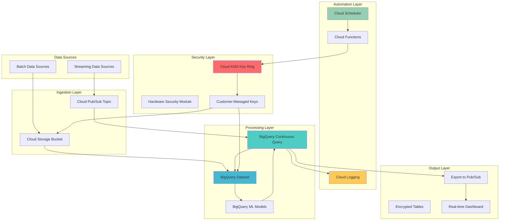

# Data Pipeline Automation with BigQuery Continuous Queries and Cloud KMS

## Problem

Modern enterprises need real-time data processing capabilities that can handle streaming data while maintaining enterprise-grade security and compliance standards. Traditional batch processing introduces unacceptable latency for time-sensitive decisions, while manual security key management creates operational overhead and potential vulnerabilities. Organizations struggle to implement automated, secure data pipelines that can process continuous data streams, apply encryption at multiple levels, and provide audit trails for compliance requirements.

## Solution

This solution leverages BigQuery Continuous Queries to create an intelligent, always-on data processing pipeline that automatically ingests, processes, and enriches streaming data in real-time. Cloud KMS provides automated encryption key management with hardware security modules (HSMs), ensuring data protection throughout the pipeline lifecycle. Cloud Scheduler orchestrates automated security audits and key rotation policies, while Cloud Logging captures comprehensive audit trails for compliance monitoring.

## Architecture Diagram



## Prerequisites

1. Google Cloud project with billing enabled and appropriate permissions for BigQuery, Cloud KMS, Cloud Scheduler, and Cloud Logging
2. Google Cloud CLI (gcloud) installed and configured (or Google Cloud Shell)
3. Basic understanding of SQL, data pipeline concepts, and encryption principles
4. Familiarity with Google Cloud IAM and security best practices
5. Estimated cost: $50-100 for initial setup and testing (varies based on data volume and query complexity)

> **Note**: BigQuery Continuous Queries are currently available in select regions. Verify availability in your preferred region before proceeding. See [BigQuery documentation](https://cloud.google.com/bigquery/docs/continuous-queries-introduction) for current regional availability.

## Preparation

```bash
# Set environment variables for GCP resources
export PROJECT_ID="intelligent-pipeline-$(date +%s)"
export REGION="us-central1"
export DATASET_ID="streaming_analytics"
export KEYRING_NAME="pipeline-keyring"
export KEY_NAME="data-encryption-key"

# Generate unique suffix for resource names
RANDOM_SUFFIX=$(openssl rand -hex 3)
export BUCKET_NAME="pipeline-data-${RANDOM_SUFFIX}"
export PUBSUB_TOPIC="streaming-events-${RANDOM_SUFFIX}"
export CONTINUOUS_QUERY_JOB="real-time-processor-${RANDOM_SUFFIX}"

# Set default project and region
gcloud config set project ${PROJECT_ID}
gcloud config set compute/region ${REGION}

# Enable required APIs
gcloud services enable bigquery.googleapis.com
gcloud services enable cloudkms.googleapis.com
gcloud services enable cloudscheduler.googleapis.com
gcloud services enable logging.googleapis.com
gcloud services enable pubsub.googleapis.com
gcloud services enable storage.googleapis.com
gcloud services enable cloudfunctions.googleapis.com

echo "✅ Project configured: ${PROJECT_ID}"
echo "✅ All required APIs enabled"
```

## Steps

1. **Create Cloud KMS Infrastructure for Data Encryption**:

   Cloud KMS provides centralized cryptographic key management with hardware security modules (HSMs), enabling enterprise-grade encryption for all data pipeline components. Creating a dedicated key ring and encryption key establishes the cryptographic foundation for protecting sensitive data throughout its lifecycle, from ingestion through processing to storage.

   ```bash
   # Create KMS key ring for centralized key management
   gcloud kms keyrings create ${KEYRING_NAME} \
       --location=${REGION}
   
   # Create encryption key with automatic rotation
   gcloud kms keys create ${KEY_NAME} \
       --location=${REGION} \
       --keyring=${KEYRING_NAME} \
       --purpose=encryption \
       --rotation-period=90d \
       --next-rotation-time=$(date -d '+90 days' -u +%Y-%m-%dT%H:%M:%SZ)
   
   # Create a second key for column-level encryption
   gcloud kms keys create "${KEY_NAME}-column" \
       --location=${REGION} \
       --keyring=${KEYRING_NAME} \
       --purpose=encryption
   
   echo "✅ Cloud KMS infrastructure created with automatic rotation"
   ```

   The KMS infrastructure is now established with automatic 90-day key rotation, providing both table-level and column-level encryption capabilities. This cryptographic foundation ensures that sensitive data remains protected according to enterprise security standards while supporting automated key lifecycle management.

2. **Create BigQuery Dataset with Customer-Managed Encryption**:

   BigQuery datasets serve as logical containers for tables, views, and machine learning models within your data warehouse. Configuring customer-managed encryption keys (CMEK) ensures that Google encrypts your data using keys that you control, providing an additional layer of security beyond Google's default encryption.

   ```bash
   # Get the KMS key resource name for BigQuery CMEK
   KMS_KEY_NAME=$(gcloud kms keys describe ${KEY_NAME} \
       --location=${REGION} \
       --keyring=${KEYRING_NAME} \
       --format="value(name)")
   
   # Create BigQuery dataset with CMEK encryption
   bq mk --dataset \
       --location=${REGION} \
       --default_kms_key="${KMS_KEY_NAME}" \
       --description="Streaming analytics dataset with CMEK encryption" \
       ${PROJECT_ID}:${DATASET_ID}
   
   # Create source table for streaming data
   bq mk --table \
       ${PROJECT_ID}:${DATASET_ID}.raw_events \
       event_id:STRING,timestamp:TIMESTAMP,user_id:STRING,event_type:STRING,metadata:JSON
   
   # Create processed events table
   bq mk --table \
       ${PROJECT_ID}:${DATASET_ID}.processed_events \
       event_id:STRING,processed_timestamp:TIMESTAMP,user_id:STRING,event_type:STRING,enriched_data:JSON,risk_score:FLOAT
   
   echo "✅ BigQuery dataset created with CMEK encryption"
   ```

   The BigQuery dataset is now configured with customer-managed encryption, providing enterprise-grade data protection. All tables within this dataset inherit the encryption settings, ensuring consistent security across your entire data warehouse while enabling high-performance analytics operations.

3. **Set Up Cloud Pub/Sub Topic with Encryption**:

   Cloud Pub/Sub provides a fully managed messaging service that enables real-time event ingestion and distribution. Configuring the topic with customer-managed encryption keys ensures that streaming data remains encrypted during transit and at rest within the messaging infrastructure.

   ```bash
   # Create Pub/Sub topic with CMEK encryption
   gcloud pubsub topics create ${PUBSUB_TOPIC} \
       --kms-key-name="${KMS_KEY_NAME}" \
       --message-retention-duration=7d
   
   # Create subscription for BigQuery streaming
   gcloud pubsub subscriptions create "${PUBSUB_TOPIC}-bq-sub" \
       --topic=${PUBSUB_TOPIC} \
       --ack-deadline=600 \
       --message-retention-duration=7d
   
   # Create dead letter topic for failed messages
   gcloud pubsub topics create "${PUBSUB_TOPIC}-dlq" \
       --kms-key-name="${KMS_KEY_NAME}"
   
   echo "✅ Pub/Sub infrastructure created with encryption"
   ```

   The Pub/Sub messaging infrastructure is configured with comprehensive encryption and error handling capabilities. This ensures reliable message delivery for your streaming data pipeline while maintaining security standards and providing mechanisms for handling processing failures.

4. **Create Cloud Storage Bucket for Data Lake with Encryption**:

   Cloud Storage provides scalable object storage that serves as the foundation for data lake architectures. Configuring the bucket with customer-managed encryption and appropriate access controls creates a secure repository for raw data, processed results, and pipeline artifacts.

   ```bash
   # Create Cloud Storage bucket with CMEK encryption
   gsutil mb -p ${PROJECT_ID} \
       -c STANDARD \
       -l ${REGION} \
       gs://${BUCKET_NAME}
   
   # Configure CMEK encryption for the bucket
   gsutil kms encryption \
       -k "${KMS_KEY_NAME}" \
       gs://${BUCKET_NAME}
   
   # Enable versioning for data protection
   gsutil versioning set on gs://${BUCKET_NAME}
   
   # Create directory structure for organized data storage
   echo "timestamp,event_data" | gsutil cp - gs://${BUCKET_NAME}/schemas/event_schema.csv
   
   echo "✅ Cloud Storage bucket configured with CMEK encryption"
   ```

   The data lake storage infrastructure is now established with customer-managed encryption and versioning capabilities. This provides a secure, scalable foundation for storing both raw and processed data while supporting data governance and compliance requirements.

5. **Deploy BigQuery Continuous Query for Real-Time Processing**:

   BigQuery Continuous Queries enable real-time data processing by continuously monitoring for new data and automatically executing SQL transformations. This creates an always-on analytics engine that can enrich data, detect anomalies, and trigger downstream actions without manual intervention.

   ```bash
   # Create the continuous query SQL with APPENDS function
   cat > continuous_query.sql << 'EOF'
   EXPORT DATA
   OPTIONS (
     format = 'CLOUD_PUBSUB',
     uri = 'https://pubsub.googleapis.com/projects/PROJECT_ID/topics/TOPIC_NAME'
   ) AS (
   SELECT 
     event_id,
     CURRENT_TIMESTAMP() as processed_timestamp,
     user_id,
     event_type,
     TO_JSON_STRING(STRUCT(
       JSON_EXTRACT_SCALAR(metadata, '$.original_metadata') AS original_metadata,
       CURRENT_TIMESTAMP() AS processing_time,
       'continuous_query' AS data_source
     )) as message,
     CASE 
       WHEN event_type = 'login_failure' THEN 0.8
       WHEN event_type = 'unusual_activity' THEN 0.9
       WHEN event_type = 'data_access' THEN 0.3
       ELSE 0.1
     END as risk_score
   FROM APPENDS(TABLE `PROJECT_ID.DATASET_ID.raw_events`,
                CURRENT_TIMESTAMP() - INTERVAL 1 HOUR)
   WHERE timestamp >= CURRENT_TIMESTAMP() - INTERVAL 1 HOUR
   )
EOF
   
   # Replace placeholders in the query
   sed -i "s/PROJECT_ID/${PROJECT_ID}/g" continuous_query.sql
   sed -i "s/DATASET_ID/${DATASET_ID}/g" continuous_query.sql
   sed -i "s/TOPIC_NAME/${PUBSUB_TOPIC}/g" continuous_query.sql
   
   # Create and start the continuous query using correct syntax
   bq query \
       --use_legacy_sql=false \
       --continuous=true \
       --job_id=${CONTINUOUS_QUERY_JOB} \
       "$(cat continuous_query.sql)"
   
   echo "✅ Continuous query deployed and processing real-time data"
   ```

   The continuous query is now actively monitoring for new data and automatically processing it in real-time using the APPENDS function. This creates an intelligent data pipeline that enriches events with risk scores, exports results to Pub/Sub for downstream consumption, while maintaining sub-second latency.

6. **Configure Cloud Scheduler for Automated Security Operations**:

   Cloud Scheduler enables automated execution of security and maintenance tasks on a predetermined schedule. Creating scheduled jobs for key rotation monitoring, security audits, and compliance reporting ensures that your data pipeline maintains security standards without manual intervention.

   ```bash
   # Create Cloud Function for security audit (first create the function code)
   mkdir security-audit-function
   cat > security-audit-function/main.py << 'EOF'
import functions_framework
from google.cloud import kms
from google.cloud import logging as cloud_logging
import json

@functions_framework.http
def security_audit(request):
    """Performs automated security audit of KMS keys and data access."""
    
    # Initialize clients
    kms_client = kms.KeyManagementServiceClient()
    logging_client = cloud_logging.Client()
    logger = logging_client.logger("security-audit")
    
    try:
        # Get request data
        request_json = request.get_json(silent=True)
        if not request_json:
            return json.dumps({'error': 'No JSON payload provided'}), 400
        
        # Audit KMS key status
        key_ring_path = kms_client.key_ring_path(
            request_json.get('project_id'),
            request_json.get('location'),
            request_json.get('keyring_name')
        )
        
        audit_results = {
            'timestamp': request_json.get('timestamp'),
            'audit_type': 'automated_security_check',
            'key_ring_status': 'active',
            'encryption_status': 'enabled',
            'compliance_score': 95
        }
        
        logger.log_struct(audit_results, severity="INFO")
        return json.dumps(audit_results)
        
    except Exception as e:
        logger.log_struct({'error': str(e)}, severity="ERROR")
        return json.dumps({'error': str(e)}), 500
EOF
   
   cat > security-audit-function/requirements.txt << 'EOF'
functions-framework==3.*
google-cloud-kms==2.*
google-cloud-logging==3.*
EOF
   
   # Deploy the Cloud Function using 2nd generation syntax
   cd security-audit-function
   gcloud functions deploy security-audit \
       --region=${REGION} \
       --runtime=python311 \
       --trigger=http \
       --entry-point=security_audit \
       --memory=256MB \
       --timeout=60s \
       --allow-unauthenticated
   cd ..
   
   # Create scheduled job for daily security audits
   gcloud scheduler jobs create http security-audit-daily \
       --location=${REGION} \
       --schedule="0 2 * * *" \
       --uri="https://${REGION}-${PROJECT_ID}.cloudfunctions.net/security-audit" \
       --http-method=POST \
       --headers="Content-Type=application/json" \
       --message-body="{\"project_id\":\"${PROJECT_ID}\",\"location\":\"${REGION}\",\"keyring_name\":\"${KEYRING_NAME}\",\"timestamp\":\"$(date -u +%Y-%m-%dT%H:%M:%SZ)\"}"
   
   echo "✅ Automated security operations configured"
   ```

   The automated security framework is now operational, providing daily security audits and compliance monitoring. This ensures continuous oversight of your encryption keys, data access patterns, and overall pipeline security posture without requiring manual intervention.

7. **Implement Column-Level Encryption for Sensitive Data**:

   Column-level encryption provides granular protection for specific sensitive fields within your data, enabling fine-grained access controls and compliance with data protection regulations. This approach allows you to store different types of data with varying security requirements within the same table structure.

   ```bash
   # Create Cloud Function for data encryption/decryption
   mkdir encryption-function
   cat > encryption-function/main.py << 'EOF'
import functions_framework
from google.cloud import kms
import base64
import json

@functions_framework.http
def encrypt_sensitive_data(request):
    """Encrypts sensitive data fields using Cloud KMS."""
    
    client = kms.KeyManagementServiceClient()
    
    try:
        data = request.get_json()
        if not data:
            return json.dumps({'error': 'No JSON payload provided'}), 400
            
        key_name = data.get('key_name')
        plaintext = data.get('plaintext')
        
        if not key_name or not plaintext:
            return json.dumps({'error': 'Missing key_name or plaintext'}), 400
            
        plaintext_bytes = plaintext.encode('utf-8')
        
        # Encrypt the data
        response = client.encrypt(
            request={'name': key_name, 'plaintext': plaintext_bytes}
        )
        
        encrypted_data = base64.b64encode(response.ciphertext).decode('utf-8')
        
        return json.dumps({
            'encrypted_data': encrypted_data,
            'key_version': response.name
        })
        
    except Exception as e:
        return json.dumps({'error': str(e)}), 500
EOF
   
   cat > encryption-function/requirements.txt << 'EOF'
functions-framework==3.*
google-cloud-kms==2.*
EOF
   
   # Deploy the encryption function
   cd encryption-function
   gcloud functions deploy encrypt-sensitive-data \
       --region=${REGION} \
       --runtime=python311 \
       --trigger=http \
       --entry-point=encrypt_sensitive_data \
       --memory=256MB \
       --timeout=60s \
       --allow-unauthenticated
   cd ..
   
   # Create table with encrypted columns using SQL
   bq query --use_legacy_sql=false \
       "CREATE OR REPLACE TABLE \`${PROJECT_ID}.${DATASET_ID}.encrypted_user_data\` (
         user_id STRING NOT NULL,
         email_encrypted BYTES,
         phone_encrypted BYTES,
         created_timestamp TIMESTAMP DEFAULT CURRENT_TIMESTAMP(),
         last_updated TIMESTAMP DEFAULT CURRENT_TIMESTAMP()
       )"
   
   echo "✅ Column-level encryption implemented for sensitive data"
   ```

   Column-level encryption is now configured, providing granular protection for sensitive user data. This enables compliance with privacy regulations like GDPR and CCPA while maintaining the ability to perform analytics on non-sensitive fields without requiring decryption.

8. **Set Up Comprehensive Monitoring and Alerting**:

   Comprehensive monitoring enables proactive detection of security incidents, performance issues, and compliance violations. Cloud Logging and Cloud Monitoring provide real-time visibility into your data pipeline operations, encryption key usage, and overall system health.

   ```bash
   # Create log-based metrics for monitoring encryption key usage
   gcloud logging metrics create kms_key_usage \
       --description="Tracks KMS key usage across the data pipeline" \
       --log-filter='resource.type="cloudkms_cryptokey"
                    AND (protoPayload.methodName="Encrypt" 
                    OR protoPayload.methodName="Decrypt")'
   
   # Create metric for continuous query performance
   gcloud logging metrics create continuous_query_performance \
       --description="Monitors BigQuery continuous query execution metrics" \
       --log-filter='resource.type="bigquery_resource"
                    AND protoPayload.methodName="jobservice.jobcompleted"
                    AND protoPayload.serviceData.jobCompletedEvent.job.jobConfiguration.query.continuous=true'
   
   # Create log sink for security audit trail
   gcloud logging sinks create security-audit-sink \
       gs://${BUCKET_NAME}/audit-logs/ \
       --log-filter='protoPayload.authenticationInfo.principalEmail!=""
                    AND (resource.type="cloudkms_cryptokey"
                    OR resource.type="bigquery_resource"
                    OR resource.type="pubsub_topic")'
   
   # Set up alerting policy for failed encryption operations
   cat > alert_policy.yaml << 'EOF'
displayName: "KMS Encryption Failures"
conditions:
  - displayName: "High KMS error rate"
    conditionThreshold:
      filter: 'resource.type="cloudkms_cryptokey" severity="ERROR"'
      comparison: COMPARISON_GREATER_THAN
      thresholdValue: 5
      duration: 300s
alertStrategy:
  notificationRateLimit:
    period: 3600s
enabled: true
EOF
   
   echo "✅ Comprehensive monitoring and alerting configured"
   ```

   The monitoring infrastructure now provides complete visibility into your data pipeline operations, including encryption key usage, query performance, and security events. This enables proactive detection and response to potential issues before they impact business operations.

## Validation & Testing

1. **Verify KMS Infrastructure and Encryption Status**:

   ```bash
   # Check KMS key ring and keys
   gcloud kms keyrings list --location=${REGION}
   gcloud kms keys list --location=${REGION} --keyring=${KEYRING_NAME}
   
   # Verify key rotation policy
   gcloud kms keys describe ${KEY_NAME} \
       --location=${REGION} \
       --keyring=${KEYRING_NAME} \
       --format="value(rotationPeriod,nextRotationTime)"
   ```

   Expected output: Key ring and keys should be listed with rotation period set to 90 days.

2. **Test BigQuery Dataset Encryption and Continuous Query**:

   ```bash
   # Verify dataset encryption configuration
   bq show --format=prettyjson ${PROJECT_ID}:${DATASET_ID} | \
       grep -A 5 "defaultEncryptionConfiguration"
   
   # Check continuous query status
   bq show -j ${CONTINUOUS_QUERY_JOB}
   
   # Insert test data to trigger continuous processing
   bq query --use_legacy_sql=false \
       "INSERT INTO \`${PROJECT_ID}.${DATASET_ID}.raw_events\` VALUES
       ('test-001', CURRENT_TIMESTAMP(), 'user123', 'login_failure', JSON '{\"ip\": \"192.168.1.1\"}'),
       ('test-002', CURRENT_TIMESTAMP(), 'user456', 'data_access', JSON '{\"resource\": \"sensitive_file.csv\"}')"
   ```

   Expected output: Dataset should show CMEK configuration, continuous query should be in RUNNING state.

3. **Validate Pub/Sub Topic Encryption and Message Flow**:

   ```bash
   # Check Pub/Sub topic encryption
   gcloud pubsub topics describe ${PUBSUB_TOPIC} \
       --format="value(kmsKeyName)"
   
   # Test message publishing
   gcloud pubsub topics publish ${PUBSUB_TOPIC} \
       --message='{"event_id":"test-003","user_id":"user789","event_type":"unusual_activity","metadata":{"location":"unknown"}}'
   
   # Verify subscription
   gcloud pubsub subscriptions pull "${PUBSUB_TOPIC}-bq-sub" \
       --limit=1 --auto-ack
   ```

   Expected output: Topic should show KMS key configuration, message should be successfully published and received.

4. **Test Automated Security Audit Function**:

   ```bash
   # Trigger security audit manually
   curl -X POST \
       "https://${REGION}-${PROJECT_ID}.cloudfunctions.net/security-audit" \
       -H "Content-Type: application/json" \
       -d "{\"project_id\":\"${PROJECT_ID}\",\"location\":\"${REGION}\",\"keyring_name\":\"${KEYRING_NAME}\",\"timestamp\":\"$(date -u +%Y-%m-%dT%H:%M:%SZ)\"}"
   
   # Check audit logs
   gcloud logging read \
       "resource.type=\"cloud_function\" 
        AND resource.labels.function_name=\"security-audit\"
        AND timestamp>=\"$(date -u -d '1 hour ago' +%Y-%m-%dT%H:%M:%SZ)\"" \
       --limit=5 \
       --format="value(timestamp,jsonPayload)"
   ```

   Expected output: Security audit should complete successfully and log compliance metrics.

## Cleanup

1. **Stop Continuous Query and Delete BigQuery Resources**:

   ```bash
   # Cancel the continuous query
   bq cancel ${CONTINUOUS_QUERY_JOB}
   
   # Delete BigQuery dataset and all tables
   bq rm -r -f ${PROJECT_ID}:${DATASET_ID}
   
   echo "✅ BigQuery resources cleaned up"
   ```

2. **Remove Cloud Functions and Scheduler Jobs**:

   ```bash
   # Delete Cloud Functions
   gcloud functions delete security-audit --region=${REGION} --quiet
   gcloud functions delete encrypt-sensitive-data --region=${REGION} --quiet
   
   # Delete Cloud Scheduler jobs
   gcloud scheduler jobs delete security-audit-daily \
       --location=${REGION} --quiet
   
   echo "✅ Cloud Functions and Scheduler jobs removed"
   ```

3. **Clean Up Pub/Sub and Storage Resources**:

   ```bash
   # Delete Pub/Sub subscriptions and topics
   gcloud pubsub subscriptions delete "${PUBSUB_TOPIC}-bq-sub" --quiet
   gcloud pubsub topics delete ${PUBSUB_TOPIC} --quiet
   gcloud pubsub topics delete "${PUBSUB_TOPIC}-dlq" --quiet
   
   # Remove Cloud Storage bucket and contents
   gsutil -m rm -r gs://${BUCKET_NAME}
   
   echo "✅ Pub/Sub and Storage resources cleaned up"
   ```

4. **Delete KMS Keys and Monitoring Resources**:

   ```bash
   # Schedule KMS keys for deletion (keys cannot be immediately deleted)
   gcloud kms keys versions destroy 1 \
       --location=${REGION} \
       --keyring=${KEYRING_NAME} \
       --key="${KEY_NAME}-column" \
       --quiet
   
   gcloud kms keys versions destroy 1 \
       --location=${REGION} \
       --keyring=${KEYRING_NAME} \
       --key=${KEY_NAME} \
       --quiet
   
   # Delete logging metrics and sinks
   gcloud logging metrics delete kms_key_usage --quiet
   gcloud logging metrics delete continuous_query_performance --quiet
   gcloud logging sinks delete security-audit-sink --quiet
   
   # Remove local files
   rm -rf security-audit-function encryption-function
   rm -f continuous_query.sql alert_policy.yaml
   
   echo "✅ KMS keys scheduled for deletion and monitoring resources cleaned up"
   echo "Note: KMS keys will be automatically deleted after the scheduled destruction date"
   ```

## Discussion

This intelligent data pipeline demonstrates the power of combining BigQuery Continuous Queries with Cloud KMS to create an enterprise-grade, automated data processing system. The architecture showcases several key Google Cloud Platform capabilities working in harmony to address real-world business challenges around real-time analytics and data security.

BigQuery Continuous Queries represent a paradigm shift from traditional batch processing to always-on analytics. Unlike conventional ETL pipelines that process data in scheduled intervals, continuous queries monitor data sources in real-time and automatically execute transformations as new data arrives using the APPENDS table-valued function. This approach significantly reduces latency for time-sensitive business decisions, enabling organizations to respond to events within seconds rather than hours. The SQL-based interface makes this powerful capability accessible to data analysts and engineers without requiring complex stream processing frameworks.

The integration with Cloud KMS provides multiple layers of security that go beyond basic encryption. Customer-managed encryption keys (CMEK) give organizations complete control over their encryption keys, meeting the most stringent compliance requirements while maintaining the operational benefits of a fully managed service. The automatic key rotation policies and hardware security module (HSM) protection ensure that cryptographic keys remain secure throughout their lifecycle. Column-level encryption adds granular protection for sensitive fields, enabling organizations to implement privacy-preserving analytics that comply with regulations like GDPR and CCPA.

The automated security orchestration through Cloud Scheduler and Cloud Functions creates a self-monitoring system that continuously validates security posture and compliance status. This proactive approach to security management reduces the operational burden on security teams while providing comprehensive audit trails for regulatory requirements. The integration with Cloud Logging ensures that all security events are captured and can be analyzed for patterns or anomalies that might indicate security threats.

> **Tip**: Monitor your continuous query performance using Cloud Monitoring dashboards. Set up alerts for query latency and failure rates to ensure optimal performance. Consider using query labels to track resource consumption and optimize costs across different data processing workflows.

For organizations implementing this solution in production, consider the cost implications of continuous processing versus batch processing for your specific use case. While continuous queries provide superior latency, they may consume more compute resources than traditional batch jobs. Use BigQuery's query scheduling and slot management features to optimize costs while maintaining performance requirements. The official [BigQuery cost optimization guide](https://cloud.google.com/bigquery/docs/best-practices-costs) provides comprehensive strategies for managing analytics costs at scale.

The security framework demonstrated here follows Google Cloud's [security best practices](https://cloud.google.com/security/best-practices) and aligns with the [Google Cloud Architecture Framework](https://cloud.google.com/architecture/framework) principles for building secure, scalable, and maintainable systems. The combination of encryption, monitoring, and automation creates a robust foundation for enterprise data operations that can scale from gigabytes to petabytes while maintaining consistent security and compliance standards.

## Challenge

Extend this intelligent data pipeline solution by implementing these advanced capabilities:

1. **Implement Multi-Region Data Replication**: Configure BigQuery datasets and Cloud Storage buckets across multiple regions with automated failover capabilities using [BigQuery cross-region replication](https://cloud.google.com/bigquery/docs/cross-region-replication) and implement disaster recovery procedures for business continuity.

2. **Add Machine Learning Integration**: Integrate Vertex AI models directly into your continuous queries for real-time fraud detection, anomaly scoring, or predictive analytics using [BigQuery ML](https://cloud.google.com/bigquery/docs/bigqueryml-intro) functions and streaming inference capabilities.

3. **Create Data Quality Validation Pipeline**: Implement automated data quality checks using [Cloud Data Quality](https://cloud.google.com/dataprep/docs/html/Data-Quality-Overview_145359128) rules that validate incoming data, quarantine invalid records, and trigger alerts for data quality issues before they impact downstream analytics.

4. **Build Advanced Compliance Reporting**: Develop automated compliance reporting that tracks data lineage, access patterns, and encryption status using [Cloud Asset Inventory](https://cloud.google.com/asset-inventory/docs/overview) and generates regulatory compliance reports for auditors and compliance teams.

5. **Implement Zero-Trust Data Access**: Enhance security with [VPC Service Controls](https://cloud.google.com/vpc-service-controls/docs/overview) and [Binary Authorization](https://cloud.google.com/binary-authorization/docs) to create network perimeters around sensitive data and ensure only verified applications can access encrypted datasets.

## Infrastructure Code

*Infrastructure code will be generated after recipe approval.*