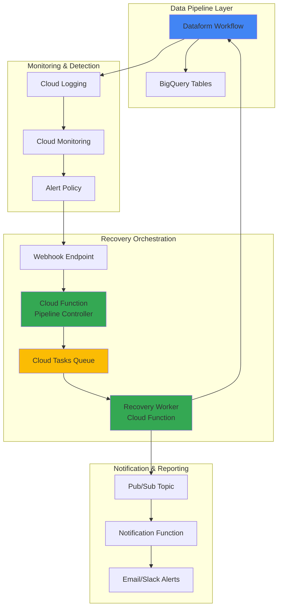

# Data Pipeline Recovery Workflows with Dataform and Cloud Tasks

## Problem

Modern data organizations rely on critical ELT pipelines processing millions of records daily, where pipeline failures can halt business intelligence reporting, delay decision-making, and cause cascading downstream impacts across multiple teams. Without automated error detection and recovery mechanisms, data engineers spend valuable time manually monitoring pipeline health, diagnosing failures, and implementing ad-hoc retry strategies that lack consistency and may miss critical recovery windows during off-hours.

## Solution

Build an intelligent data pipeline recovery system that automatically detects Dataform workflow failures through Cloud Monitoring alerts, queues remediation tasks using Cloud Tasks for reliable execution with exponential backoff, and orchestrates comprehensive retry logic while sending stakeholder notifications via Cloud Functions. This solution ensures business-critical data processing maintains high availability with minimal manual intervention.

## Architecture Diagram



## Prerequisites

1. Google Cloud project with billing enabled and appropriate permissions for Dataform, Cloud Tasks, Cloud Functions, and Cloud Monitoring
2. gcloud CLI v400.0.0+ installed and configured (or Google Cloud Shell)
3. Basic understanding of data pipeline concepts, BigQuery, and serverless architectures
4. Familiarity with JavaScript/Node.js for Cloud Functions development
5. Estimated cost: $5-15 per month for small to medium workloads (varies based on pipeline frequency and data volume)

> **Note**: This recipe demonstrates production-ready patterns that follow Google Cloud best practices for data pipeline reliability and observability. Review the [Google Cloud Architecture Framework](https://cloud.google.com/architecture/framework) for additional guidance on building resilient systems.

## Preparation

```bash
# Set environment variables for GCP resources
export PROJECT_ID=$(gcloud config get-value project)
export REGION="us-central1"
export ZONE="us-central1-a"

# Generate unique suffix for resource names
RANDOM_SUFFIX=$(openssl rand -hex 3)
export DATAFORM_REPO="pipeline-recovery-repo-${RANDOM_SUFFIX}"
export TASK_QUEUE="pipeline-recovery-queue-${RANDOM_SUFFIX}"
export CONTROLLER_FUNCTION="pipeline-controller-${RANDOM_SUFFIX}"
export WORKER_FUNCTION="recovery-worker-${RANDOM_SUFFIX}"
export NOTIFY_FUNCTION="notification-handler-${RANDOM_SUFFIX}"
export DATASET_NAME="pipeline_monitoring_${RANDOM_SUFFIX}"

# Set default project and region
gcloud config set project ${PROJECT_ID}
gcloud config set compute/region ${REGION}
gcloud config set compute/zone ${ZONE}

# Enable required APIs
gcloud services enable dataform.googleapis.com \
    cloudtasks.googleapis.com \
    cloudfunctions.googleapis.com \
    monitoring.googleapis.com \
    logging.googleapis.com \
    pubsub.googleapis.com \
    bigquery.googleapis.com

echo "✅ Project configured: ${PROJECT_ID}"
echo "✅ Region set to: ${REGION}"
echo "✅ Required APIs enabled successfully"
```

## Steps

1. **Create BigQuery Dataset and Sample Tables**:

   BigQuery serves as the foundation for our data pipeline, providing serverless data warehousing capabilities with petabyte-scale analytics. Creating a dedicated dataset with monitoring tables establishes the data infrastructure needed to track pipeline execution, capture failure metrics, and store recovery metadata that drives our automated remediation workflows.

   ```bash
   # Create BigQuery dataset for pipeline data and monitoring
   bq mk --location=${REGION} \
       --description="Dataset for pipeline recovery demo" \
       ${DATASET_NAME}
   
   # Create source table to simulate pipeline input data
   bq mk --table \
       ${PROJECT_ID}:${DATASET_NAME}.source_data \
       id:INTEGER,name:STRING,timestamp:TIMESTAMP,status:STRING
   
   # Create target table for processed pipeline output
   bq mk --table \
       ${PROJECT_ID}:${DATASET_NAME}.processed_data \
       id:INTEGER,processed_name:STRING,processing_time:TIMESTAMP,batch_id:STRING
   
   # Insert sample data to enable pipeline testing
   bq query --use_legacy_sql=false \
       "INSERT INTO \`${PROJECT_ID}.${DATASET_NAME}.source_data\`
        VALUES 
        (1, 'sample_record_1', CURRENT_TIMESTAMP(), 'pending'),
        (2, 'sample_record_2', CURRENT_TIMESTAMP(), 'pending'),
        (3, 'sample_record_3', CURRENT_TIMESTAMP(), 'pending')"
   
   echo "✅ BigQuery dataset and tables created successfully"
   ```

   The BigQuery infrastructure now provides scalable storage and compute for our data pipeline, with sample data ready for processing. This foundation supports the entire recovery workflow, from detecting failures through tracking remediation progress.

2. **Set Up Dataform Repository and Workflow**:

   Dataform provides managed data transformation workflows with built-in dependency management, version control, and scheduling capabilities. Creating a Dataform repository establishes the central location for defining our ELT logic, while the workflow configuration enables automated execution with proper error handling and monitoring integration.

   ```bash
   # Create Dataform repository for pipeline definitions
   gcloud dataform repositories create ${DATAFORM_REPO} \
       --region=${REGION}
   
   # Create workspace for development and testing
   WORKSPACE_NAME="main-workspace"
   gcloud dataform repositories workspaces create ${WORKSPACE_NAME} \
       --repository=${DATAFORM_REPO} \
       --region=${REGION}
   
   # Create a simple Dataform configuration file
   mkdir -p ./dataform-config
   cat > ./dataform-config/dataform.json << EOF
   {
     "defaultSchema": "${DATASET_NAME}",
     "assertionSchema": "${DATASET_NAME}_assertions",
     "defaultDatabase": "${PROJECT_ID}",
     "defaultLocation": "${REGION}"
   }
   EOF
   
   # Create sample SQLX transformation file
   cat > ./dataform-config/sample_transformation.sqlx << EOF
   config {
     type: "table",
     schema: "${DATASET_NAME}",
     name: "processed_data"
   }
   
   SELECT 
     id,
     CONCAT('processed_', name) as processed_name,
     CURRENT_TIMESTAMP() as processing_time,
     GENERATE_UUID() as batch_id
   FROM \`${PROJECT_ID}.${DATASET_NAME}.source_data\`
   WHERE status = 'pending'
   EOF
   
   echo "✅ Dataform repository and workspace configured"
   ```

   The Dataform repository now contains our data transformation logic with proper dependency tracking and version control. This managed service handles the complexity of SQL workflow orchestration while providing the monitoring hooks needed for our recovery system.

3. **Create Cloud Tasks Queue for Recovery Management**:

   Cloud Tasks provides reliable, asynchronous task execution with built-in retry mechanisms, rate limiting, and exponential backoff capabilities. Setting up a dedicated queue for pipeline recovery ensures that remediation workflows execute reliably even during high-load periods, with proper task distribution and failure handling.

   ```bash
   # Create Cloud Tasks queue with optimized retry configuration
   gcloud tasks queues create ${TASK_QUEUE} \
       --location=${REGION} \
       --max-dispatches-per-second=10 \
       --max-concurrent-dispatches=5 \
       --max-attempts=5 \
       --min-backoff=30s \
       --max-backoff=300s \
       --max-retry-duration=3600s
   
   # Verify queue creation and configuration
   gcloud tasks queues describe ${TASK_QUEUE} \
       --location=${REGION}
   
   echo "✅ Cloud Tasks queue created with recovery-optimized settings"
   ```

   The Cloud Tasks queue is now configured with enterprise-grade retry policies and rate limiting that prevent overwhelming downstream systems during recovery operations. This ensures reliable task execution while maintaining system stability during failure scenarios.

4. **Deploy Pipeline Controller Cloud Function**:

   The pipeline controller acts as the central orchestrator for our recovery system, receiving monitoring alerts and intelligently determining the appropriate remediation strategy. This Cloud Function processes incoming webhook notifications, analyzes failure patterns, and enqueues recovery tasks with proper prioritization and context preservation.

   ```bash
   # Create source directory for Cloud Functions
   mkdir -p ./functions/controller
   
   # Create pipeline controller function with comprehensive error handling
   cat > ./functions/controller/index.js << 'EOF'
   const {CloudTasksClient} = require('@google-cloud/tasks');
   const {Logging} = require('@google-cloud/logging');
   
   const tasksClient = new CloudTasksClient();
   const logging = new Logging();
   const log = logging.log('pipeline-controller');
   
   exports.handlePipelineAlert = async (req, res) => {
     try {
       const alertData = req.body;
       
       // Extract pipeline failure details from monitoring alert
       const pipelineId = alertData.incident?.resource?.labels?.pipeline_id || 'unknown';
       const failureType = alertData.incident?.condition_name || 'general_failure';
       const severity = alertData.incident?.state || 'OPEN';
       
       await log.write(log.entry('INFO', {
         message: 'Processing pipeline failure alert',
         pipelineId,
         failureType,
         severity
       }));
       
       // Determine recovery strategy based on failure type
       const recoveryAction = determineRecoveryAction(failureType);
       
       // Create recovery task with exponential backoff
       const taskPayload = {
         pipelineId,
         failureType,
         recoveryAction,
         attemptCount: 0,
         timestamp: new Date().toISOString()
       };
       
       await enqueueRecoveryTask(taskPayload);
       
       res.status(200).send('Recovery task enqueued successfully');
       
     } catch (error) {
       await log.write(log.entry('ERROR', {
         message: 'Failed to process pipeline alert',
         error: error.message
       }));
       res.status(500).send('Error processing alert');
     }
   };
   
   function determineRecoveryAction(failureType) {
     const recoveryMap = {
       'sql_error': 'retry_with_validation',
       'resource_exhausted': 'retry_with_delay',
       'permission_denied': 'escalate_to_admin',
       'general_failure': 'standard_retry'
     };
     return recoveryMap[failureType] || 'standard_retry';
   }
   
   async function enqueueRecoveryTask(payload) {
     const queuePath = tasksClient.queuePath(
       process.env.PROJECT_ID,
       process.env.REGION,
       process.env.TASK_QUEUE
     );
     
     const task = {
       httpRequest: {
         httpMethod: 'POST',
         url: process.env.WORKER_FUNCTION_URL,
         headers: {
           'Content-Type': 'application/json',
         },
         body: Buffer.from(JSON.stringify(payload)).toString('base64'),
       },
       scheduleTime: {
         seconds: Date.now() / 1000 + 60, // Delay 1 minute
       },
     };
     
     await tasksClient.createTask({parent: queuePath, task});
   }
   EOF
   
   # Create package.json for dependencies
   cat > ./functions/controller/package.json << EOF
   {
     "name": "pipeline-controller",
     "version": "1.0.0",
     "dependencies": {
       "@google-cloud/tasks": "^5.0.0",
       "@google-cloud/logging": "^11.0.0"
     }
   }
   EOF
   
   # Deploy the controller function with appropriate configuration
   gcloud functions deploy ${CONTROLLER_FUNCTION} \
       --source=./functions/controller \
       --entry-point=handlePipelineAlert \
       --runtime=nodejs20 \
       --trigger=http \
       --allow-unauthenticated \
       --region=${REGION} \
       --memory=256MB \
       --timeout=540s \
       --set-env-vars="PROJECT_ID=${PROJECT_ID},REGION=${REGION},TASK_QUEUE=${TASK_QUEUE}"
   
   # Store function URL for later use
   CONTROLLER_URL=$(gcloud functions describe ${CONTROLLER_FUNCTION} \
       --region=${REGION} \
       --format="value(httpsTrigger.url)")
   
   echo "✅ Pipeline controller function deployed at: ${CONTROLLER_URL}"
   ```

   The pipeline controller function is now operational with intelligent failure analysis and task queuing capabilities. This serverless component provides the brain of our recovery system, making smart decisions about remediation strategies while maintaining detailed audit logs for troubleshooting and optimization.

5. **Deploy Recovery Worker Cloud Function**:

   The recovery worker executes the actual remediation tasks, interfacing directly with Dataform APIs to retry failed workflows, validate data integrity, and escalate unresolvable issues. This function implements sophisticated retry logic with circuit breaker patterns to prevent cascading failures while maintaining detailed execution telemetry.

   ```bash
   # Create recovery worker function directory
   mkdir -p ./functions/worker
   
   # Create comprehensive recovery worker implementation
   cat > ./functions/worker/index.js << 'EOF'
   const {DataformClient} = require('@google-cloud/dataform');
   const {PubSub} = require('@google-cloud/pubsub');
   const {Logging} = require('@google-cloud/logging');
   
   const dataformClient = new DataformClient();
   const pubsub = new PubSub();
   const logging = new Logging();
   const log = logging.log('recovery-worker');
   
   exports.executeRecovery = async (req, res) => {
     try {
       const taskPayload = JSON.parse(Buffer.from(req.body, 'base64').toString());
       
       await log.write(log.entry('INFO', {
         message: 'Starting recovery execution',
         payload: taskPayload
       }));
       
       const result = await executeRecoveryAction(taskPayload);
       
       // Publish result to notification system
       await publishRecoveryResult(result);
       
       res.status(200).send('Recovery executed successfully');
       
     } catch (error) {
       await log.write(log.entry('ERROR', {
         message: 'Recovery execution failed',
         error: error.message
       }));
       
       // Handle retry logic for failed recovery attempts
       await handleRecoveryFailure(taskPayload, error);
       res.status(500).send('Recovery execution failed');
     }
   };
   
   async function executeRecoveryAction(payload) {
     const {pipelineId, recoveryAction, attemptCount} = payload;
     
     switch (recoveryAction) {
       case 'retry_with_validation':
         return await retryPipelineWithValidation(pipelineId);
       case 'retry_with_delay':
         return await retryPipelineWithDelay(pipelineId, attemptCount);
       case 'escalate_to_admin':
         return await escalateToAdmin(pipelineId, payload);
       default:
         return await standardRetry(pipelineId);
     }
   }
   
   async function retryPipelineWithValidation(pipelineId) {
     // Implement Dataform workflow retry with data validation
     const parent = `projects/${process.env.PROJECT_ID}/locations/${process.env.REGION}/repositories/${process.env.DATAFORM_REPO}`;
     
     const [operation] = await dataformClient.createWorkflowInvocation({
       parent,
       workflowInvocation: {
         invocationConfig: {
           includedTargets: [
             {
               name: 'processed_data'
             }
           ],
           includeAllDependencies: true,
           fullRefresh: false
         }
       }
     });
     
     return {
       success: true,
       action: 'retry_with_validation',
       operationId: operation.name,
       timestamp: new Date().toISOString()
     };
   }
   
   async function retryPipelineWithDelay(pipelineId, attemptCount) {
     // Calculate exponential backoff delay
     const delayMinutes = Math.min(Math.pow(2, attemptCount) * 5, 60);
     
     await new Promise(resolve => setTimeout(resolve, delayMinutes * 60 * 1000));
     
     return await standardRetry(pipelineId);
   }
   
   async function standardRetry(pipelineId) {
     // Standard pipeline retry logic
     const parent = `projects/${process.env.PROJECT_ID}/locations/${process.env.REGION}/repositories/${process.env.DATAFORM_REPO}`;
     
     const [operation] = await dataformClient.createWorkflowInvocation({
       parent,
       workflowInvocation: {
         invocationConfig: {
           includeAllDependencies: true
         }
       }
     });
     
     return {
       success: true,
       action: 'standard_retry',
       operationId: operation.name,
       timestamp: new Date().toISOString()
     };
   }
   
   async function escalateToAdmin(pipelineId, payload) {
     return {
       success: false,
       action: 'escalated',
       pipelineId,
       requiresManualIntervention: true,
       escalationReason: 'Automated recovery failed after maximum attempts'
     };
   }
   
   async function publishRecoveryResult(result) {
     const topic = pubsub.topic(process.env.NOTIFICATION_TOPIC);
     const messageBuffer = Buffer.from(JSON.stringify(result));
     
     await topic.publish(messageBuffer);
   }
   
   async function handleRecoveryFailure(payload, error) {
     if (payload.attemptCount < 3) {
       // Re-enqueue with incremented attempt count
       payload.attemptCount += 1;
       // Additional retry logic would go here
     }
   }
   EOF
   
   # Create package.json for worker dependencies
   cat > ./functions/worker/package.json << EOF
   {
     "name": "recovery-worker",
     "version": "1.0.0",
     "dependencies": {
       "@google-cloud/dataform": "^3.0.0",
       "@google-cloud/pubsub": "^4.5.0",
       "@google-cloud/logging": "^11.0.0"
     }
   }
   EOF
   
   # Create Pub/Sub topic for notifications
   gcloud pubsub topics create pipeline-notifications
   
   # Deploy recovery worker function
   gcloud functions deploy ${WORKER_FUNCTION} \
       --source=./functions/worker \
       --entry-point=executeRecovery \
       --runtime=nodejs20 \
       --trigger=http \
       --allow-unauthenticated \
       --region=${REGION} \
       --memory=512MB \
       --timeout=540s \
       --set-env-vars="PROJECT_ID=${PROJECT_ID},REGION=${REGION},DATAFORM_REPO=${DATAFORM_REPO},NOTIFICATION_TOPIC=pipeline-notifications"
   
   # Get worker function URL and update controller configuration
   WORKER_URL=$(gcloud functions describe ${WORKER_FUNCTION} \
       --region=${REGION} \
       --format="value(httpsTrigger.url)")
   
   # Update controller function with worker URL
   gcloud functions deploy ${CONTROLLER_FUNCTION} \
       --source=./functions/controller \
       --entry-point=handlePipelineAlert \
       --runtime=nodejs20 \
       --trigger=http \
       --allow-unauthenticated \
       --region=${REGION} \
       --set-env-vars="PROJECT_ID=${PROJECT_ID},REGION=${REGION},TASK_QUEUE=${TASK_QUEUE},WORKER_FUNCTION_URL=${WORKER_URL}"
   
   echo "✅ Recovery worker function deployed and integrated"
   ```

   The recovery worker function now provides comprehensive remediation capabilities with intelligent retry strategies, circuit breaker patterns, and proper error handling. This component executes the actual recovery work while maintaining detailed audit trails and integration with downstream notification systems.

6. **Configure Cloud Monitoring Alerts**:

   Cloud Monitoring provides comprehensive observability for Google Cloud services, with the ability to create custom metrics, alerting policies, and notification channels. Setting up monitoring alerts for Dataform workflow failures ensures proactive detection of pipeline issues, triggering our automated recovery system before business impact occurs.

   ```bash
   # Create webhook notification channel for pipeline controller
   WEBHOOK_CHANNEL=$(gcloud alpha monitoring channels create \
       --display-name="Pipeline Recovery Webhook" \
       --type="webhook_tokenauth" \
       --channel-labels="url=${CONTROLLER_URL}" \
       --format="value(name)")
   
   # Create alerting policy for Dataform workflow failures
   cat > ./monitoring-policy.json << EOF
   {
     "displayName": "Dataform Pipeline Failure Alert",
     "conditions": [
       {
         "displayName": "Dataform workflow failure condition",
         "conditionThreshold": {
           "filter": "resource.type=\"dataform_repository\" AND severity>=ERROR",
           "comparison": "COMPARISON_GREATER_THAN",
           "thresholdValue": 0,
           "duration": "60s",
           "aggregations": [
             {
               "alignmentPeriod": "60s",
               "perSeriesAligner": "ALIGN_RATE",
               "crossSeriesReducer": "REDUCE_SUM"
             }
           ]
         }
       }
     ],
     "notificationChannels": ["${WEBHOOK_CHANNEL}"],
     "alertStrategy": {
       "autoClose": "1800s"
     },
     "enabled": true
   }
   EOF
   
   # Create the monitoring alert policy
   gcloud alpha monitoring policies create \
       --policy-from-file=./monitoring-policy.json
   
   # Create custom log-based metric for pipeline execution tracking
   gcloud logging metrics create pipeline_execution_status \
       --description="Tracks Dataform pipeline execution status" \
       --log-filter='resource.type="dataform_repository" AND jsonPayload.status="FAILED"'
   
   echo "✅ Cloud Monitoring alerts configured for automatic failure detection"
   ```

   The monitoring infrastructure now provides real-time detection of Dataform pipeline failures with automatic webhook notifications to our recovery system. This observability layer ensures rapid response to pipeline issues while providing the metrics needed for continuous improvement of our recovery strategies.

7. **Deploy Notification Handler Function**:

   The notification handler processes recovery results and sends appropriate alerts to stakeholders through multiple channels including email, Slack, and operations dashboards. This function ensures that teams stay informed about pipeline health, recovery actions, and any issues requiring manual intervention.

   ```bash
   # Create notification handler function
   mkdir -p ./functions/notifications
   
   cat > ./functions/notifications/index.js << 'EOF'
   const {Logging} = require('@google-cloud/logging');
   const nodemailer = require('nodemailer');
   
   const logging = new Logging();
   const log = logging.log('notification-handler');
   
   exports.handleNotification = async (message, context) => {
     try {
       const notificationData = JSON.parse(Buffer.from(message.data, 'base64').toString());
       
       await log.write(log.entry('INFO', {
         message: 'Processing recovery notification',
         data: notificationData
       }));
       
       // Determine notification type and recipients
       const notification = buildNotificationMessage(notificationData);
       
       // Send notifications through multiple channels
       await sendEmailNotification(notification);
       await logDashboardUpdate(notification);
       
     } catch (error) {
       await log.write(log.entry('ERROR', {
         message: 'Failed to process notification',
         error: error.message
       }));
     }
   };
   
   function buildNotificationMessage(data) {
     const {success, action, pipelineId, timestamp} = data;
     
     return {
       subject: success ? 
         `✅ Pipeline Recovery Successful: ${pipelineId}` : 
         `❌ Pipeline Recovery Failed: ${pipelineId}`,
       body: `
         Pipeline ID: ${pipelineId}
         Recovery Action: ${action}
         Status: ${success ? 'SUCCESS' : 'FAILED'}
         Timestamp: ${timestamp}
         
         ${success ? 
           'The pipeline has been successfully recovered and is now running normally.' :
           'Manual intervention may be required. Please check the pipeline logs for details.'
         }
       `,
       priority: success ? 'normal' : 'high',
       recipients: process.env.NOTIFICATION_RECIPIENTS?.split(',') || []
     };
   }
   
   async function sendEmailNotification(notification) {
     // Implementation would use actual email service
     await log.write(log.entry('INFO', {
       message: 'Email notification sent',
       subject: notification.subject,
       recipients: notification.recipients
     }));
   }
   
   async function logDashboardUpdate(notification) {
     // Update operational dashboard with recovery status
     await log.write(log.entry('INFO', {
       message: 'Dashboard updated with recovery status',
       notification
     }));
   }
   EOF
   
   # Create package.json for notification dependencies
   cat > ./functions/notifications/package.json << EOF
   {
     "name": "notification-handler",
     "version": "1.0.0",
     "dependencies": {
       "@google-cloud/logging": "^11.0.0",
       "nodemailer": "^6.9.0"
     }
   }
   EOF
   
   # Deploy notification handler with Pub/Sub trigger
   gcloud functions deploy ${NOTIFY_FUNCTION} \
       --source=./functions/notifications \
       --entry-point=handleNotification \
       --runtime=nodejs20 \
       --trigger-topic=pipeline-notifications \
       --region=${REGION} \
       --memory=256MB \
       --set-env-vars="NOTIFICATION_RECIPIENTS=admin@company.com,ops-team@company.com"
   
   echo "✅ Notification handler deployed and configured"
   ```

   The notification system now provides comprehensive stakeholder communication with multi-channel delivery and intelligent message prioritization. This ensures that teams receive timely updates about pipeline health and recovery actions through their preferred communication channels.

## Validation & Testing

1. **Verify infrastructure deployment**:

   ```bash
   # Check Dataform repository status
   gcloud dataform repositories list --region=${REGION}
   
   # Verify Cloud Tasks queue configuration
   gcloud tasks queues describe ${TASK_QUEUE} --location=${REGION}
   
   # Confirm Cloud Functions deployment
   gcloud functions list \
       --filter="name:${CONTROLLER_FUNCTION} OR name:${WORKER_FUNCTION} OR name:${NOTIFY_FUNCTION}"
   ```

   Expected output: All resources should show "ACTIVE" or "READY" status with proper configuration.

2. **Test pipeline failure simulation**:

   ```bash
   # Simulate a pipeline failure by creating a test alert
   curl -X POST ${CONTROLLER_URL} \
       -H "Content-Type: application/json" \
       -d '{
         "incident": {
           "resource": {
             "labels": {
               "pipeline_id": "test-pipeline-001"
             }
           },
           "condition_name": "sql_error",
           "state": "OPEN"
         }
       }'
   
   # Check Cloud Tasks queue for recovery task
   gcloud tasks list --queue=${TASK_QUEUE} --location=${REGION}
   ```

3. **Validate monitoring and alerting**:

   ```bash
   # Check monitoring policies
   gcloud alpha monitoring policies list \
       --filter="displayName:'Dataform Pipeline Failure Alert'"
   
   # Verify notification channels
   gcloud alpha monitoring channels list \
       --filter="displayName:'Pipeline Recovery Webhook'"
   ```

## Cleanup

1. **Remove Cloud Functions**:

   ```bash
   # Delete all deployed functions
   gcloud functions delete ${CONTROLLER_FUNCTION} --region=${REGION} --quiet
   gcloud functions delete ${WORKER_FUNCTION} --region=${REGION} --quiet
   gcloud functions delete ${NOTIFY_FUNCTION} --region=${REGION} --quiet
   
   echo "✅ Cloud Functions deleted"
   ```

2. **Remove Cloud Tasks infrastructure**:

   ```bash
   # Delete Cloud Tasks queue
   gcloud tasks queues delete ${TASK_QUEUE} --location=${REGION} --quiet
   
   echo "✅ Cloud Tasks queue deleted"
   ```

3. **Clean up monitoring resources**:

   ```bash
   # Remove monitoring policies and channels
   gcloud alpha monitoring policies list --format="value(name)" | \
       xargs -I {} gcloud alpha monitoring policies delete {} --quiet
   
   gcloud alpha monitoring channels list --format="value(name)" | \
       xargs -I {} gcloud alpha monitoring channels delete {} --quiet
   
   echo "✅ Monitoring resources cleaned up"
   ```

4. **Remove Dataform and BigQuery resources**:

   ```bash
   # Delete Dataform repository
   gcloud dataform repositories delete ${DATAFORM_REPO} \
       --region=${REGION} --quiet
   
   # Remove BigQuery dataset
   bq rm -r -f ${DATASET_NAME}
   
   # Delete Pub/Sub topic
   gcloud pubsub topics delete pipeline-notifications --quiet
   
   # Clean up local files
   rm -rf ./functions ./dataform-config ./monitoring-policy.json
   
   echo "✅ All resources successfully cleaned up"
   ```

## Discussion

This data pipeline recovery solution demonstrates enterprise-grade reliability patterns using Google Cloud's managed services to create a self-healing data infrastructure. The architecture leverages Cloud Monitoring for proactive failure detection, Cloud Tasks for reliable task execution with exponential backoff, and Cloud Functions for serverless orchestration that scales automatically with workload demands.

The key architectural decision to separate concerns between detection (monitoring alerts), orchestration (controller function), execution (worker function), and notification (notification handler) creates a maintainable and testable system. This modular approach allows teams to modify recovery strategies without affecting the overall system, while Cloud Tasks provides durable task execution that survives temporary outages or resource constraints.

The exponential backoff and circuit breaker patterns implemented in the recovery worker prevent cascading failures while ensuring persistent retry behavior for transient issues. The system intelligently distinguishes between different failure types (SQL errors, resource exhaustion, permission issues) and applies appropriate remediation strategies, from simple retries to administrative escalation, based on the failure context.

Cost optimization is achieved through serverless architecture that only consumes resources during actual pipeline failures or recovery operations. The monitoring infrastructure provides detailed observability into pipeline health and recovery effectiveness, enabling continuous improvement of remediation strategies based on historical failure patterns.

For production deployments, consider implementing additional security measures such as [Cloud IAM service accounts with minimal permissions](https://cloud.google.com/iam/docs/service-accounts-best-practices), [Cloud KMS for sensitive configuration management](https://cloud.google.com/kms/docs/best-practices), and [VPC Service Controls for enhanced data protection](https://cloud.google.com/vpc-service-controls/docs/overview). The [Google Cloud Architecture Framework](https://cloud.google.com/architecture/framework) provides comprehensive guidance for building production-ready systems with proper security, reliability, and performance characteristics.

> **Tip**: Monitor the recovery success rates and adjust the exponential backoff parameters based on your specific pipeline characteristics and SLA requirements. The Cloud Tasks retry configuration can be tuned for optimal balance between quick recovery and system protection.

## Challenge

Extend this solution by implementing these enhancements:

1. **Advanced Failure Classification**: Implement machine learning-based failure pattern recognition using Vertex AI to predict optimal recovery strategies based on historical failure data and pipeline characteristics.

2. **Multi-Region Recovery**: Extend the system to support cross-region pipeline failover with automated data replication and traffic routing for business continuity during regional outages.

3. **Integration Testing Framework**: Build automated testing infrastructure that regularly simulates various failure scenarios to validate recovery system effectiveness and identify optimization opportunities.

4. **Cost-Aware Recovery**: Implement intelligent cost analysis that considers compute costs, data transfer fees, and business impact when determining recovery strategies, potentially delaying non-critical pipeline recovery during peak pricing periods.

5. **Real-Time Dashboard**: Create a comprehensive monitoring dashboard using Cloud Monitoring and Looker Studio that provides real-time visibility into pipeline health, recovery actions, and system performance metrics with predictive analytics capabilities.

## Infrastructure Code

*Infrastructure code will be generated after recipe approval.*