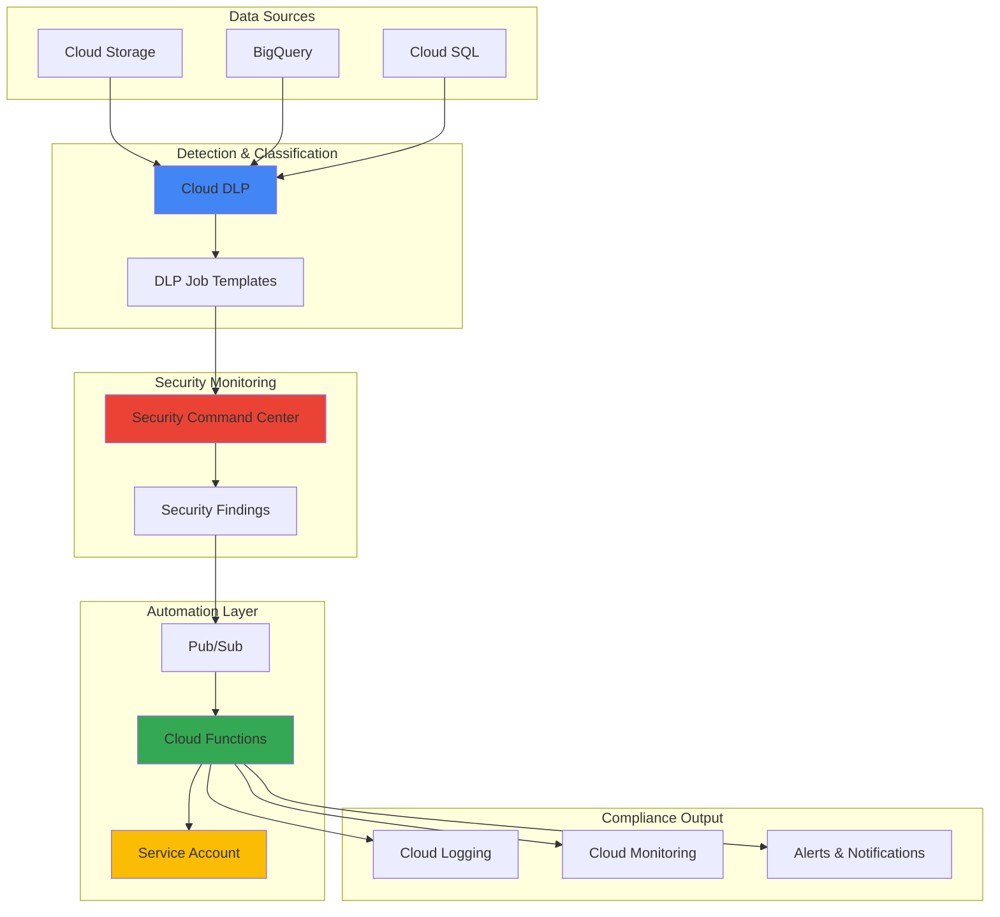

# Data Privacy Compliance with Cloud Data Loss Prevention and Security Command Center

## Problem

Organizations face increasing regulatory pressure to protect sensitive data across cloud environments while maintaining operational efficiency. Manual compliance monitoring is time-consuming, error-prone, and often reactive rather than proactive. Security teams struggle to continuously scan cloud resources for sensitive data exposure, generate compliance reports, and respond to privacy violations in a timely manner across distributed infrastructure.

## Solution

Build an automated data privacy compliance system using Cloud Data Loss Prevention (DLP) for sensitive data discovery and classification, Security Command Center for centralized security monitoring and finding aggregation, and Cloud Functions for automated remediation workflows. This solution provides continuous scanning, real-time alerts, and automated response capabilities that ensure proactive privacy compliance across your organization's cloud infrastructure.

## Architecture Diagram



## Prerequisites

1. Google Cloud project with billing enabled and appropriate permissions for DLP, Security Command Center, and Cloud Functions
2. gcloud CLI installed and configured (or use Cloud Shell)
3. Basic understanding of data privacy regulations (GDPR, CCPA, HIPAA)
4. Familiarity with Google Cloud security concepts and IAM
5. Estimated cost: $50-100/month for moderate data volumes (varies by scan frequency and data size)

> **Note**: Security Command Center requires Standard or Premium tier for full DLP integration and advanced threat detection capabilities.

## Preparation

```bash
# Set environment variables for GCP resources
export PROJECT_ID="privacy-compliance-$(date +%s)"
export REGION="us-central1"
export ZONE="us-central1-a"

# Generate unique suffix for resource names
RANDOM_SUFFIX=$(openssl rand -hex 3)
export FUNCTION_NAME="privacy-compliance-${RANDOM_SUFFIX}"
export TOPIC_NAME="privacy-findings-${RANDOM_SUFFIX}"
export BUCKET_NAME="privacy-scan-data-${RANDOM_SUFFIX}"

# Set default project and region
gcloud config set project ${PROJECT_ID}
gcloud config set compute/region ${REGION}
gcloud config set compute/zone ${ZONE}

# Enable required APIs
gcloud services enable dlp.googleapis.com
gcloud services enable securitycenter.googleapis.com
gcloud services enable cloudfunctions.googleapis.com
gcloud services enable pubsub.googleapis.com
gcloud services enable storage-api.googleapis.com
gcloud services enable logging.googleapis.com
gcloud services enable monitoring.googleapis.com
gcloud services enable cloudscheduler.googleapis.com

echo "✅ Project configured: ${PROJECT_ID}"
echo "✅ APIs enabled for DLP, Security Command Center, and Cloud Functions"
```

## Steps

1. **Create Cloud Storage Bucket for Test Data**:

   Cloud Storage serves as our primary data repository for demonstrating sensitive data detection. We'll create a bucket with appropriate security settings and populate it with sample data containing various sensitive information types that Cloud DLP can identify and classify.

   ```bash
   # Create bucket for test data
   gsutil mb -p ${PROJECT_ID} \
       -c STANDARD \
       -l ${REGION} \
       gs://${BUCKET_NAME}
   
   # Enable uniform bucket-level access for security
   gsutil uniformbucketlevelaccess set on gs://${BUCKET_NAME}
   
   # Create sample files with sensitive data
   echo "Customer: John Doe, SSN: 123-45-6789, Email: john.doe@example.com" > sample_data.txt
   echo "Credit Card: 4111-1111-1111-1111, Phone: (555) 123-4567" >> sample_data.txt
   echo "Medical Record: Patient ID 12345, DOB: 1985-03-15" >> sample_data.txt
   
   # Upload sample data
   gsutil cp sample_data.txt gs://${BUCKET_NAME}/
   
   echo "✅ Test data bucket created and populated: ${BUCKET_NAME}"
   ```

   The bucket is now configured with uniform access controls and contains sample data with various sensitive information types including SSNs, credit cards, and personal identifiers that Cloud DLP can detect and classify.

2. **Configure Cloud DLP Inspection Templates**:

   Cloud DLP inspection templates define what types of sensitive data to detect and how to handle findings. Creating custom templates allows us to tailor detection rules to specific compliance requirements and organizational policies while maintaining consistency across scan operations.

   ```bash
   # Create DLP inspection template for PII detection
   cat > dlp-template.json << 'EOF'
   {
     "displayName": "Privacy Compliance Template",
     "description": "Detects PII, PHI, and financial data for compliance monitoring",
     "inspectConfig": {
       "infoTypes": [
         {"name": "US_SOCIAL_SECURITY_NUMBER"},
         {"name": "CREDIT_CARD_NUMBER"},
         {"name": "EMAIL_ADDRESS"},
         {"name": "PHONE_NUMBER"},
         {"name": "PERSON_NAME"},
         {"name": "US_HEALTHCARE_NPI"},
         {"name": "DATE_OF_BIRTH"}
       ],
       "minLikelihood": "POSSIBLE",
       "limits": {
         "maxFindingsPerRequest": 100,
         "maxFindingsPerInfoType": [
           {
             "infoType": {"name": "US_SOCIAL_SECURITY_NUMBER"},
             "maxFindings": 10
           }
         ]
       },
       "includeQuote": true
     }
   }
   EOF
   
   # Create the inspection template
   gcloud dlp inspect-templates create \
       --template-file=dlp-template.json \
       --location=${REGION}
   
   # Store template name for later use
   export DLP_TEMPLATE_NAME="projects/${PROJECT_ID}/locations/${REGION}/inspectTemplates/privacy-compliance-template"
   
   echo "✅ DLP inspection template created for comprehensive PII detection"
   ```

   The inspection template is configured to detect multiple sensitive data types with appropriate likelihood thresholds and limits, ensuring comprehensive coverage while preventing excessive findings that could overwhelm security teams.

3. **Create Pub/Sub Topic for DLP Findings**:

   Pub/Sub provides reliable, asynchronous messaging for DLP findings, enabling real-time processing and automated responses. This messaging infrastructure ensures that security findings are processed immediately and can trigger multiple downstream actions simultaneously.

   ```bash
   # Create Pub/Sub topic for DLP findings
   gcloud pubsub topics create ${TOPIC_NAME}
   
   # Create subscription for processing findings
   gcloud pubsub subscriptions create ${TOPIC_NAME}-subscription \
       --topic=${TOPIC_NAME} \
       --ack-deadline=60
   
   # Set up IAM permissions for DLP to publish to topic
   gcloud pubsub topics add-iam-policy-binding ${TOPIC_NAME} \
       --member="serviceAccount:service-${PROJECT_ID}@dlp-api.iam.gserviceaccount.com" \
       --role="roles/pubsub.publisher"
   
   echo "✅ Pub/Sub topic configured for DLP findings: ${TOPIC_NAME}"
   ```

   The Pub/Sub infrastructure is now ready to receive DLP findings and route them to automated processing functions, with appropriate IAM permissions for the DLP service to publish messages.

4. **Create Cloud Function for Automated Response**:

   Cloud Functions provides serverless compute for processing DLP findings and triggering automated responses. This function will parse findings, assess severity, and initiate appropriate remediation actions based on data classification and compliance requirements.

   ```bash
   # Create source code directory
   mkdir -p privacy-function
   cd privacy-function
   
   # Create requirements.txt for Python dependencies
   cat > requirements.txt << 'EOF'
   functions-framework==3.*
   google-cloud-dlp==3.*
   google-cloud-securitycenter==1.*
   google-cloud-logging==3.*
   google-cloud-monitoring==2.*
   EOF
   
   # Create main function code
   cat > main.py << 'EOF'
   import base64
   import json
   import logging
   import time
   import os
   from google.cloud import dlp_v2
   from google.cloud import securitycenter
   from google.cloud import logging as cloud_logging
   from google.cloud import monitoring_v3
   import functions_framework
   
   # Initialize clients
   dlp_client = dlp_v2.DlpServiceClient()
   scc_client = securitycenter.SecurityCenterClient()
   logging_client = cloud_logging.Client()
   monitoring_client = monitoring_v3.MetricServiceClient()
   
   @functions_framework.cloud_event
   def process_dlp_findings(cloud_event):
       """Process DLP findings and create Security Command Center findings"""
       
       try:
           # Decode Pub/Sub message
           message_data = base64.b64decode(cloud_event.data["message"]["data"]).decode('utf-8')
           finding_data = json.loads(message_data)
           
           # Extract finding details
           project_id = finding_data.get('projectId', os.environ.get('PROJECT_ID'))
           location = finding_data.get('location', 'global')
           finding_type = finding_data.get('infoType', {}).get('name', 'UNKNOWN')
           resource_name = finding_data.get('resourceName', 'UNKNOWN')
           
           # Determine severity based on info type
           severity = determine_severity(finding_type)
           
           # Log the finding
           log_finding(finding_data, severity)
           
           # Create custom metrics
           create_custom_metrics(finding_type, severity, project_id)
           
           # Trigger remediation actions
           trigger_remediation(finding_data, severity)
           
           return "Finding processed successfully"
           
       except Exception as e:
           logging.error(f"Error processing DLP finding: {str(e)}")
           raise
   
   def determine_severity(info_type):
       """Determine severity based on information type"""
       high_risk_types = ['US_SOCIAL_SECURITY_NUMBER', 'CREDIT_CARD_NUMBER', 'US_HEALTHCARE_NPI']
       medium_risk_types = ['EMAIL_ADDRESS', 'PHONE_NUMBER', 'DATE_OF_BIRTH']
       
       if info_type in high_risk_types:
           return "HIGH"
       elif info_type in medium_risk_types:
           return "MEDIUM"
       else:
           return "LOW"
   
   def get_compliance_impact(info_type):
       """Get compliance impact based on data type"""
       pii_types = ['US_SOCIAL_SECURITY_NUMBER', 'EMAIL_ADDRESS', 'PERSON_NAME']
       phi_types = ['US_HEALTHCARE_NPI', 'DATE_OF_BIRTH']
       pci_types = ['CREDIT_CARD_NUMBER']
       
       impacts = []
       if info_type in pii_types:
           impacts.append("GDPR")
       if info_type in phi_types:
           impacts.append("HIPAA")
       if info_type in pci_types:
           impacts.append("PCI-DSS")
       
       return ",".join(impacts) if impacts else "General Privacy"
   
   def get_recommended_action(info_type):
       """Get recommended remediation action"""
       actions = {
           'US_SOCIAL_SECURITY_NUMBER': 'Encrypt or redact immediately',
           'CREDIT_CARD_NUMBER': 'Remove from storage, audit access',
           'EMAIL_ADDRESS': 'Review data retention policy',
           'PHONE_NUMBER': 'Verify consent for storage',
           'PERSON_NAME': 'Check data processing lawfulness'
       }
       return actions.get(info_type, 'Review data classification')
   
   def log_finding(finding_data, severity):
       """Log finding to Cloud Logging"""
       logger = logging_client.logger('privacy-compliance')
       logger.log_struct({
           'message': 'DLP finding processed',
           'severity': severity,
           'finding_data': finding_data,
           'timestamp': time.time()
       })
   
   def create_custom_metrics(info_type, severity, project_id):
       """Create custom metrics for monitoring"""
       try:
           project_name = f"projects/{project_id}"
           
           # Create time series for findings count
           series = monitoring_v3.TimeSeries()
           series.metric.type = "custom.googleapis.com/dlp/findings_count"
           series.resource.type = "global"
           series.metric.labels['info_type'] = info_type
           series.metric.labels['severity'] = severity
           
           # Add data point
           point = monitoring_v3.Point()
           point.value.int64_value = 1
           now = time.time()
           point.interval.end_time.seconds = int(now)
           series.points = [point]
           
           monitoring_client.create_time_series(
               name=project_name,
               time_series=[series]
           )
       except Exception as e:
           logging.error(f"Error creating custom metrics: {str(e)}")
   
   def trigger_remediation(finding_data, severity):
       """Trigger automated remediation based on severity"""
       if severity == "HIGH":
           # High severity: immediate action required
           send_alert_notification(finding_data, "CRITICAL")
           # Could trigger automated quarantine here
       elif severity == "MEDIUM":
           # Medium severity: review required
           send_alert_notification(finding_data, "WARNING")
   
   def send_alert_notification(finding_data, alert_level):
       """Send alert notification (implement based on your notification system)"""
       # Log the alert for now - implement actual notification system
       logger = logging_client.logger('privacy-alerts')
       logger.log_struct({
           'alert_level': alert_level,
           'finding_data': finding_data,
           'timestamp': time.time()
       })
   EOF
   
   # Deploy the Cloud Function
   gcloud functions deploy ${FUNCTION_NAME} \
       --gen2 \
       --region=${REGION} \
       --runtime=python312 \
       --source=. \
       --entry-point=process_dlp_findings \
       --trigger-topic=${TOPIC_NAME} \
       --memory=512MB \
       --timeout=300s \
       --set-env-vars="PROJECT_ID=${PROJECT_ID}"
   
   cd ..
   
   echo "✅ Cloud Function deployed for automated DLP finding processing"
   ```

   The Cloud Function is now deployed with the latest Python 3.12 runtime and ready to process DLP findings, create monitoring metrics, and trigger automated responses based on data sensitivity and compliance requirements.

5. **Configure Service Account for Secure Authentication**:

   Service accounts provide secure, keyless authentication for Cloud Functions to access Google Cloud services. This eliminates the need for service account keys while ensuring proper authorization for DLP operations and Security Command Center integration.

   ```bash
   # Create service account for the function
   gcloud iam service-accounts create privacy-compliance-sa \
       --display-name="Privacy Compliance Service Account" \
       --description="Service account for privacy compliance automation"
   
   # Grant necessary permissions
   gcloud projects add-iam-policy-binding ${PROJECT_ID} \
       --member="serviceAccount:privacy-compliance-sa@${PROJECT_ID}.iam.gserviceaccount.com" \
       --role="roles/dlp.user"
   
   gcloud projects add-iam-policy-binding ${PROJECT_ID} \
       --member="serviceAccount:privacy-compliance-sa@${PROJECT_ID}.iam.gserviceaccount.com" \
       --role="roles/securitycenter.findingsEditor"
   
   gcloud projects add-iam-policy-binding ${PROJECT_ID} \
       --member="serviceAccount:privacy-compliance-sa@${PROJECT_ID}.iam.gserviceaccount.com" \
       --role="roles/logging.logWriter"
   
   gcloud projects add-iam-policy-binding ${PROJECT_ID} \
       --member="serviceAccount:privacy-compliance-sa@${PROJECT_ID}.iam.gserviceaccount.com" \
       --role="roles/monitoring.metricWriter"
   
   # Configure the Cloud Function to use the service account
   gcloud functions deploy ${FUNCTION_NAME} \
       --region=${REGION} \
       --service-account=privacy-compliance-sa@${PROJECT_ID}.iam.gserviceaccount.com \
       --update-labels=function=privacy-compliance
   
   echo "✅ Service account configured for secure authentication"
   ```

   The service account is configured with least-privilege permissions for DLP operations, Security Command Center integration, and monitoring, ensuring secure access to required resources.

6. **Create DLP Scan Job for Continuous Monitoring**:

   DLP scan jobs provide continuous monitoring of cloud resources for sensitive data. Configuring recurring scans ensures that new data is automatically inspected and any privacy violations are detected promptly across your organization's cloud infrastructure.

   ```bash
   # Create DLP job configuration for inspection
   cat > dlp-job.json << EOF
   {
     "inspectJob": {
       "inspectTemplate": "${DLP_TEMPLATE_NAME}",
       "storageConfig": {
         "cloudStorageOptions": {
           "fileSet": {
             "url": "gs://${BUCKET_NAME}/*"
           }
         }
       },
       "actions": [
         {
           "pubSub": {
             "topic": "projects/${PROJECT_ID}/topics/${TOPIC_NAME}"
           }
         }
       ]
     }
   }
   EOF
   
   # Create and run the DLP job
   gcloud dlp jobs create \
       --location=${REGION} \
       --job-file=dlp-job.json
   
   # Create a scheduled job for continuous monitoring
   gcloud scheduler jobs create pubsub privacy-scan-schedule \
       --schedule="0 */6 * * *" \
       --topic=${TOPIC_NAME} \
       --message-body='{"trigger": "scheduled_scan"}' \
       --time-zone="UTC" \
       --description="Triggers DLP scan every 6 hours"
   
   echo "✅ DLP scan job created with continuous monitoring schedule"
   ```

   The DLP scan job is configured to monitor Cloud Storage resources continuously, with scheduled scans every 6 hours to ensure ongoing compliance monitoring and immediate detection of new sensitive data.

7. **Configure Security Command Center Integration**:

   Security Command Center provides centralized security monitoring and finding management. Integrating DLP findings with SCC creates a unified security dashboard where privacy violations are tracked alongside other security events for comprehensive risk management.

   ```bash
   # Get organization ID (required for SCC operations)
   export ORGANIZATION_ID=$(gcloud organizations list --format="value(name)" --limit=1 | cut -d'/' -f2)
   
   # Create Security Command Center source for DLP findings
   gcloud scc sources create \
       --organization=${ORGANIZATION_ID} \
       --display-name="Privacy Compliance Scanner" \
       --description="Automated DLP findings from privacy compliance system"
   
   # Get the source ID for reference
   export SCC_SOURCE_ID=$(gcloud scc sources list \
       --organization=${ORGANIZATION_ID} \
       --format="value(name)" \
       --filter="displayName='Privacy Compliance Scanner'")
   
   # Create notification configuration for high-severity findings
   gcloud scc notifications create privacy-critical-alerts \
       --organization=${ORGANIZATION_ID} \
       --pubsub-topic=projects/${PROJECT_ID}/topics/${TOPIC_NAME} \
       --filter='severity="HIGH" AND category="DATA_LEAK"' \
       --description="Critical privacy violations requiring immediate attention"
   
   echo "✅ Security Command Center integration configured"
   echo "Source ID: ${SCC_SOURCE_ID}"
   ```

   Security Command Center is configured to receive and manage DLP findings, providing centralized visibility into data privacy violations and enabling automated alerting for critical issues.

8. **Create Monitoring Dashboard and Alerts**:

   Cloud Monitoring provides comprehensive visibility into privacy compliance metrics and enables proactive alerting. Creating custom dashboards and alerts ensures that security teams have real-time visibility into data privacy violations and can respond quickly to emerging threats.

   ```bash
   # Create the metric descriptor for DLP findings
   gcloud logging metrics create dlp-findings-metric \
       --description="DLP findings count by type and severity" \
       --log-filter='resource.type="cloud_function" AND jsonPayload.message="DLP finding processed"'
   
   # Create alerting policy for high-severity findings
   cat > alert-policy.json << EOF
   {
     "displayName": "High Severity Privacy Violations",
     "conditions": [
       {
         "displayName": "High severity DLP findings",
         "conditionThreshold": {
           "filter": "metric.type=\"logging.googleapis.com/user/dlp-findings-metric\"",
           "comparison": "COMPARISON_GT",
           "thresholdValue": 0,
           "duration": "60s"
         }
       }
     ],
     "alertStrategy": {
       "autoClose": "86400s"
     },
     "enabled": true,
     "notificationChannels": []
   }
   EOF
   
   # Create the alerting policy
   gcloud alpha monitoring policies create --policy-from-file=alert-policy.json
   
   echo "✅ Monitoring dashboard and alerts configured for privacy compliance"
   ```

   The monitoring infrastructure is configured to track DLP findings, create custom metrics, and generate alerts for high-severity privacy violations, ensuring proactive response to compliance issues.

## Validation & Testing

1. **Verify DLP Template and Function Deployment**:

   ```bash
   # Check DLP template creation
   gcloud dlp inspect-templates list --location=${REGION}
   
   # Verify Cloud Function deployment
   gcloud functions describe ${FUNCTION_NAME} --region=${REGION}
   
   # Check Pub/Sub topic and subscription
   gcloud pubsub topics list --filter="name:${TOPIC_NAME}"
   gcloud pubsub subscriptions list --filter="name:${TOPIC_NAME}-subscription"
   ```

   Expected output: DLP template should show as created, Cloud Function should be active, and Pub/Sub resources should be properly configured.

2. **Test Sensitive Data Detection**:

   ```bash
   # Trigger a manual DLP scan
   gcloud dlp jobs create \
       --location=${REGION} \
       --job-file=dlp-job.json
   
   # Check for job completion
   gcloud dlp jobs list --location=${REGION} --filter="state:DONE"
   
   # Verify findings were published to Pub/Sub
   gcloud pubsub subscriptions pull ${TOPIC_NAME}-subscription \
       --limit=5 --auto-ack
   ```

   Expected output: DLP job should complete successfully and findings should appear in Pub/Sub messages.

3. **Verify Security Command Center Integration**:

   ```bash
   # Check for DLP findings in Security Command Center
   gcloud scc findings list \
       --organization=${ORGANIZATION_ID} \
       --source=${SCC_SOURCE_ID} \
       --filter="category='DATA_LEAK'"
   
   # Verify notification configuration
   gcloud scc notifications list --organization=${ORGANIZATION_ID}
   ```

   Expected output: Security Command Center should show DLP findings with appropriate severity levels and categorization.

4. **Test Function Processing and Monitoring**:

   ```bash
   # Check function logs
   gcloud functions logs read ${FUNCTION_NAME} --region=${REGION} --limit=10
   
   # Verify custom metrics
   gcloud logging metrics list --filter="name:dlp-findings-metric"
   
   # Check alerting policies
   gcloud alpha monitoring policies list \
       --filter="displayName='High Severity Privacy Violations'"
   ```

   Expected output: Function logs should show successful processing, custom metrics should be created, and alerting policies should be active.

## Cleanup

1. **Remove Cloud Function and associated resources**:

   ```bash
   # Delete Cloud Function
   gcloud functions delete ${FUNCTION_NAME} --region=${REGION} --quiet
   
   # Delete service account
   gcloud iam service-accounts delete \
       privacy-compliance-sa@${PROJECT_ID}.iam.gserviceaccount.com --quiet
   
   echo "✅ Cloud Function and service account deleted"
   ```

2. **Remove Pub/Sub resources**:

   ```bash
   # Delete Pub/Sub subscription and topic
   gcloud pubsub subscriptions delete ${TOPIC_NAME}-subscription --quiet
   gcloud pubsub topics delete ${TOPIC_NAME} --quiet
   
   echo "✅ Pub/Sub resources removed"
   ```

3. **Remove DLP resources**:

   ```bash
   # Delete DLP inspection template
   gcloud dlp inspect-templates delete ${DLP_TEMPLATE_NAME} --quiet
   
   # Cancel any running DLP jobs (if any)
   for job in $(gcloud dlp jobs list --location=${REGION} \
       --filter="state:RUNNING" --format="value(name)"); do
     gcloud dlp jobs cancel $job --quiet
   done
   
   echo "✅ DLP resources cleaned up"
   ```

4. **Remove monitoring and Security Command Center resources**:

   ```bash
   # Delete monitoring resources
   gcloud alpha monitoring policies delete \
       --filter="displayName='High Severity Privacy Violations'" --quiet
   gcloud logging metrics delete dlp-findings-metric --quiet
   
   # Delete Security Command Center source (if organization access available)
   if [ ! -z "${SCC_SOURCE_ID}" ]; then
     gcloud scc sources delete ${SCC_SOURCE_ID} --quiet
   fi
   
   # Delete Cloud Storage bucket
   gsutil -m rm -r gs://${BUCKET_NAME}
   
   echo "✅ All monitoring and security resources removed"
   ```

5. **Remove scheduler and final cleanup**:

   ```bash
   # Delete Cloud Scheduler job
   gcloud scheduler jobs delete privacy-scan-schedule --quiet
   
   # Remove local files
   rm -rf privacy-function/ dlp-template.json dlp-job.json alert-policy.json sample_data.txt
   
   echo "✅ Complete cleanup finished"
   ```

## Discussion

This comprehensive privacy compliance solution demonstrates how Google Cloud's native security services can be orchestrated to create a proactive data protection system. The integration of Cloud Data Loss Prevention with Security Command Center provides a powerful foundation for automated compliance monitoring that scales with your organization's needs.

Cloud DLP's advanced inspection capabilities, with over 200 built-in information type detectors, enable precise identification of sensitive data across multiple cloud services. The service's ability to detect context-aware patterns and custom information types makes it particularly effective for organizations with specific compliance requirements. By configuring inspection templates with appropriate likelihood thresholds and finding limits, organizations can balance comprehensive coverage with operational efficiency.

The Security Command Center integration creates a unified security operations center where data privacy violations are managed alongside other security events. This centralized approach enables security teams to prioritize response efforts based on comprehensive risk assessment rather than managing privacy compliance in isolation. The platform's threat intelligence and asset inventory capabilities provide additional context for understanding the scope and impact of privacy violations.

The serverless architecture using Cloud Functions and Pub/Sub ensures that the system scales automatically with finding volume while maintaining low operational overhead. Service account authentication eliminates the security risks associated with long-lived service account keys, while the event-driven design ensures rapid response to privacy violations. The system's ability to process findings in real-time and trigger automated remediation actions significantly reduces the mean time to response for privacy incidents.

> **Tip**: Configure different DLP inspection templates for different data sensitivity levels and compliance requirements. This allows for more granular control over scanning frequency and remediation actions based on the specific regulatory obligations for each data type.

For production deployments, consider implementing additional security measures such as VPC Service Controls to create security perimeters around sensitive data processing, and Cloud KMS for encryption key management. The system can be extended to support multi-cloud environments by integrating with external SIEM systems and implementing cross-cloud data classification policies.

**Additional Resources:**
- [Google Cloud DLP Documentation](https://cloud.google.com/dlp/docs)
- [Security Command Center Best Practices](https://cloud.google.com/security-command-center/docs/best-practices)
- [Google Cloud Security Architecture Framework](https://cloud.google.com/architecture/framework/security)
- [Data Loss Prevention Implementation Guide](https://cloud.google.com/dlp/docs/dlp-on-gcp)
- [Cloud Functions Best Practices](https://cloud.google.com/functions/docs/bestpractices)

## Challenge

Extend this privacy compliance solution by implementing these enhancements:

1. **Multi-Cloud Data Discovery**: Integrate with BigQuery Data Catalog and implement cross-cloud data discovery using Cloud Data Fusion to scan data across hybrid and multi-cloud environments.

2. **Advanced Remediation Workflows**: Build automated remediation actions including data quarantine, access revocation, and data subject request processing using Cloud Workflows and Identity and Access Management.

3. **Compliance Reporting Dashboard**: Create a comprehensive compliance dashboard using Looker Studio that provides executive-level visibility into privacy posture, including trend analysis and regulatory compliance status.

4. **Machine Learning-Enhanced Detection**: Implement custom ML models using Vertex AI to detect context-specific sensitive data patterns and improve detection accuracy for industry-specific data types.

5. **Zero-Trust Data Access Controls**: Integrate with BeyondCorp Enterprise and implement dynamic access controls that automatically adjust data access permissions based on DLP findings and user behavior analytics.

## Infrastructure Code

### Available Infrastructure as Code:

- [Infrastructure Code Overview](code/README.md) - Detailed description of all infrastructure components
- [Infrastructure Manager](code/infrastructure-manager/) - GCP Infrastructure Manager templates
- [Bash CLI Scripts](code/scripts/) - Example bash scripts using gcloud CLI commands to deploy infrastructure
- [Terraform](code/terraform/) - Terraform configuration files