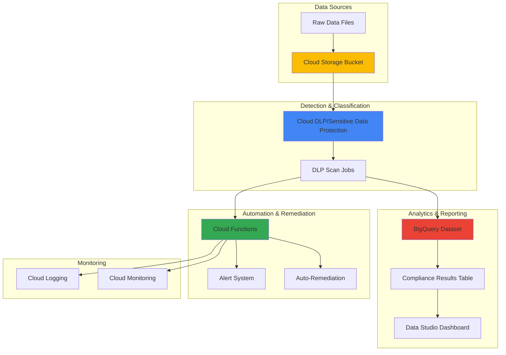

# Data Privacy Compliance with Cloud DLP and BigQuery

## Problem

Organizations handling customer data face increasingly complex privacy regulations like GDPR, CCPA, and HIPAA that require automated detection and protection of sensitive information. Manual data classification and remediation processes are time-consuming, error-prone, and cannot scale with modern data volumes, creating compliance risks and potential regulatory penalties that can reach millions of dollars.

## Solution

Build an automated data privacy compliance system using Google Cloud's Sensitive Data Protection (formerly Cloud DLP) to scan and classify sensitive data in Cloud Storage, store compliance metadata in BigQuery for analytics and reporting, and trigger automated remediation actions through Cloud Functions. This solution provides continuous monitoring, real-time threat detection, and automated compliance workflows that scale with your data infrastructure.

## Architecture Diagram



## Prerequisites

1. Google Cloud Platform account with billing enabled
2. Project with the following APIs enabled: Cloud DLP, BigQuery, Cloud Storage, Cloud Functions, Cloud Logging
3. Basic understanding of data privacy regulations (GDPR, CCPA)
4. Familiarity with BigQuery SQL and data analysis concepts
5. Estimated cost: $10-50 for initial setup and testing (varies by data volume and scan frequency)

> **Note**: Cloud DLP pricing is based on the amount of data scanned and the number of API requests. Review the [Sensitive Data Protection pricing documentation](https://cloud.google.com/sensitive-data-protection/pricing) for detailed cost estimates.

## Preparation

```bash
# Set environment variables for GCP resources
export PROJECT_ID="privacy-compliance-$(date +%s)"
export REGION="us-central1"
export ZONE="us-central1-a"

# Generate unique suffix for resource names
RANDOM_SUFFIX=$(openssl rand -hex 3)
export BUCKET_NAME="dlp-compliance-data-${RANDOM_SUFFIX}"
export DATASET_NAME="privacy_compliance"
export FUNCTION_NAME="dlp-remediation-${RANDOM_SUFFIX}"

# Set default project and region
gcloud config set project ${PROJECT_ID}
gcloud config set compute/region ${REGION}
gcloud config set compute/zone ${ZONE}

# Enable required APIs
gcloud services enable dlp.googleapis.com
gcloud services enable bigquery.googleapis.com
gcloud services enable storage.googleapis.com
gcloud services enable cloudfunctions.googleapis.com
gcloud services enable logging.googleapis.com
gcloud services enable monitoring.googleapis.com
gcloud services enable pubsub.googleapis.com

echo "✅ Project configured: ${PROJECT_ID}"
echo "✅ APIs enabled for data privacy compliance"
```

## Steps

1. **Create Cloud Storage Bucket for Data Sources**:

   Cloud Storage serves as the central repository for data that needs privacy compliance scanning. This bucket will contain various file types including CSV files with customer data, documents, and other structured/unstructured data sources that may contain personally identifiable information (PII) subject to privacy regulations.

   ```bash
   # Create bucket with appropriate location and access controls
   gsutil mb -p ${PROJECT_ID} \
       -c STANDARD \
       -l ${REGION} \
       gs://${BUCKET_NAME}
   
   # Enable uniform bucket-level access for security
   gsutil uniformbucketlevelaccess set on gs://${BUCKET_NAME}
   
   # Set up lifecycle policy to manage data retention
   cat > lifecycle.json << EOF
   {
     "rule": [
       {
         "action": {"type": "Delete"},
         "condition": {"age": 365}
       }
     ]
   }
   EOF
   
   gsutil lifecycle set lifecycle.json gs://${BUCKET_NAME}
   
   echo "✅ Storage bucket created with security and retention policies"
   ```

   The storage bucket is now configured with uniform bucket-level access controls and automatic data lifecycle management. This foundation ensures that all data entering the compliance pipeline is properly secured and automatically cleaned up according to data retention policies, which is crucial for maintaining GDPR compliance.

2. **Create BigQuery Dataset for Compliance Analytics**:

   BigQuery provides the analytical foundation for privacy compliance reporting and monitoring. This dataset will store DLP scan results, compliance metrics, and privacy risk assessments that enable data protection officers to track compliance status, identify trends, and generate regulatory reports required by privacy laws.

   ```bash
   # Create BigQuery dataset with appropriate location
   bq mk \
       --project_id=${PROJECT_ID} \
       --location=${REGION} \
       --description="Privacy compliance and DLP scan results" \
       ${DATASET_NAME}
   
   # Create table for DLP scan results
   bq mk \
       --project_id=${PROJECT_ID} \
       --table \
       ${DATASET_NAME}.dlp_scan_results \
       scan_id:STRING,file_path:STRING,scan_timestamp:TIMESTAMP,info_type:STRING,likelihood:STRING,quote:STRING,byte_offset_start:INTEGER,byte_offset_end:INTEGER,finding_count:INTEGER,compliance_status:STRING
   
   # Create table for compliance summary metrics
   bq mk \
       --project_id=${PROJECT_ID} \
       --table \
       ${DATASET_NAME}.compliance_summary \
       date:DATE,total_files_scanned:INTEGER,files_with_pii:INTEGER,high_risk_findings:INTEGER,medium_risk_findings:INTEGER,low_risk_findings:INTEGER,compliance_score:FLOAT
   
   echo "✅ BigQuery dataset and tables created for compliance analytics"
   ```

   The BigQuery dataset now provides structured storage for privacy compliance data with tables optimized for both detailed scan results and high-level compliance metrics. This analytical foundation enables real-time monitoring of privacy risks and supports regulatory reporting requirements with SQL-based queries and visualization tools.

3. **Set Up Sample Data with PII for Testing**:

   Testing the privacy compliance system requires representative data containing various types of personally identifiable information. This step creates sample datasets that mimic real-world scenarios while ensuring the DLP system can detect different categories of sensitive information as defined by major privacy regulations.

   ```bash
   # Create sample CSV file with PII data
   cat > sample_customer_data.csv << EOF
   customer_id,name,email,phone,ssn,credit_card,address
   1001,John Smith,john.smith@email.com,555-123-4567,123-45-6789,4532-1234-5678-9012,123 Main St
   1002,Jane Doe,jane.doe@email.com,555-987-6543,987-65-4321,5555-4444-3333-2222,456 Oak Ave
   1003,Bob Johnson,bob.johnson@email.com,555-555-5555,555-55-5555,4111-1111-1111-1111,789 Pine Rd
   EOF
   
   # Create sample document with mixed PII
   cat > privacy_policy.txt << EOF
   Customer Support Contact Information:
   Email: support@company.com
   Phone: 1-800-555-0123
   
   For account inquiries, reference your account number: AC-123456789
   Social Security verification: 123-45-6789
   Payment card ending in: 1111
   EOF
   
   # Upload sample files to Cloud Storage
   gsutil cp sample_customer_data.csv gs://${BUCKET_NAME}/data/
   gsutil cp privacy_policy.txt gs://${BUCKET_NAME}/documents/
   
   # Clean up local files
   rm sample_customer_data.csv privacy_policy.txt lifecycle.json
   
   echo "✅ Sample data with PII uploaded for compliance testing"
   ```

   Sample data is now available in Cloud Storage with various PII types including social security numbers, credit cards, emails, and phone numbers. This test data enables validation of the DLP system's ability to detect and classify different sensitive data types according to privacy regulation requirements like GDPR's definition of personal data.

4. **Create DLP Inspection Template for Privacy Compliance**:

   DLP inspection templates define the specific types of sensitive information to detect and the confidence levels required for classification. This template focuses on privacy regulation requirements by configuring detection for personal identifiers, financial data, and other sensitive information categories that trigger compliance obligations under GDPR, CCPA, and similar laws.

   ```bash
   # Create DLP inspection template configuration
   cat > dlp_template.json << EOF
   {
     "displayName": "Privacy Compliance Scanner",
     "description": "Template for detecting PII and sensitive data for privacy compliance",
     "inspectConfig": {
       "infoTypes": [
         {"name": "EMAIL_ADDRESS"},
         {"name": "PHONE_NUMBER"},
         {"name": "US_SOCIAL_SECURITY_NUMBER"},
         {"name": "CREDIT_CARD_NUMBER"},
         {"name": "PERSON_NAME"},
         {"name": "US_DRIVERS_LICENSE_NUMBER"},
         {"name": "DATE_OF_BIRTH"},
         {"name": "IP_ADDRESS"}
       ],
       "minLikelihood": "POSSIBLE",
       "limits": {
         "maxFindingsPerRequest": 1000,
         "maxFindingsPerInfoType": [
           {
             "infoType": {"name": "EMAIL_ADDRESS"},
             "maxFindings": 100
           }
         ]
       }
     }
   }
   EOF
   
   # Create the DLP inspection template
   TEMPLATE_RESPONSE=$(curl -X POST \
       -H "Authorization: Bearer $(gcloud auth print-access-token)" \
       -H "Content-Type: application/json" \
       -d @dlp_template.json \
       "https://dlp.googleapis.com/v2/projects/${PROJECT_ID}/inspectTemplates")
   
   # Store template name for later use
   export TEMPLATE_NAME=$(echo $TEMPLATE_RESPONSE | \
       python3 -c "import sys, json; data=json.load(sys.stdin); print(data.get('name', ''))")
   
   rm dlp_template.json
   
   echo "✅ DLP inspection template created for privacy compliance"
   echo "Template name: ${TEMPLATE_NAME}"
   ```

   The DLP inspection template is now configured to detect multiple categories of personal data with appropriate sensitivity thresholds. This template follows privacy regulation best practices by casting a wide net for potential PII while providing configurable confidence levels to balance detection accuracy with operational efficiency.

5. **Create Cloud Function for Automated Remediation**:

   Cloud Functions provide the automation layer for privacy compliance by processing DLP scan results and triggering appropriate remediation actions. This serverless function can automatically quarantine files with high-risk PII, send notifications to data protection officers, and update compliance tracking systems based on configurable policies aligned with organizational privacy requirements.

   ```bash
   # Create function source directory
   mkdir dlp-function && cd dlp-function
   
   # Create requirements.txt for Python dependencies
   cat > requirements.txt << EOF
   google-cloud-dlp==3.22.0
   google-cloud-bigquery==3.25.0
   google-cloud-storage==2.17.0
   google-cloud-logging==3.11.0
   functions-framework==3.8.0
   EOF
   
   # Create main function code
   cat > main.py << 'EOF'
   import json
   import os
   import base64
   from datetime import datetime
   from google.cloud import dlp_v2
   from google.cloud import bigquery
   from google.cloud import storage
   from google.cloud import logging as cloud_logging
   
   def process_dlp_results(cloud_event):
       """Process DLP scan results and perform automated remediation."""
       
       # Initialize clients
       dlp_client = dlp_v2.DlpServiceClient()
       bq_client = bigquery.Client()
       storage_client = storage.Client()
       logging_client = cloud_logging.Client()
       logger = logging_client.logger("dlp-remediation")
       
       try:
           # Parse the Pub/Sub message
           if 'data' in cloud_event:
               message_data = json.loads(base64.b64decode(cloud_event['data']).decode('utf-8'))
           else:
               logger.error("No data in cloud event")
               return {'status': 'error', 'message': 'No data in cloud event'}
           
           # Extract scan results
           scan_results = message_data.get('findings', [])
           file_path = message_data.get('resource', {}).get('name', '')
           
           # Process each finding
           for finding in scan_results:
               info_type = finding.get('infoType', {}).get('name', '')
               likelihood = finding.get('likelihood', '')
               quote = finding.get('quote', '')
               
               # Insert results into BigQuery
               table_id = f"{os.environ['PROJECT_ID']}.privacy_compliance.dlp_scan_results"
               rows_to_insert = [{
                   'scan_id': cloud_event.get('id', ''),
                   'file_path': file_path,
                   'scan_timestamp': datetime.utcnow().isoformat(),
                   'info_type': info_type,
                   'likelihood': likelihood,
                   'quote': quote[:100],  # Truncate for privacy
                   'byte_offset_start': finding.get('location', {}).get('byteRange', {}).get('start', 0),
                   'byte_offset_end': finding.get('location', {}).get('byteRange', {}).get('end', 0),
                   'finding_count': 1,
                   'compliance_status': 'REQUIRES_REVIEW' if likelihood in ['LIKELY', 'VERY_LIKELY'] else 'APPROVED'
               }]
               
               errors = bq_client.insert_rows_json(table_id, rows_to_insert)
               if errors:
                   logger.error(f"BigQuery insert errors: {errors}")
               
               # Implement remediation logic for high-confidence findings
               if likelihood in ['LIKELY', 'VERY_LIKELY'] and file_path.startswith('gs://'):
                   # Extract bucket and object path from gs:// URL
                   path_parts = file_path.replace('gs://', '').split('/', 1)
                   if len(path_parts) == 2:
                       bucket_name, blob_name = path_parts
                       
                       bucket = storage_client.bucket(bucket_name)
                       blob = bucket.blob(blob_name)
                       
                       # Add metadata tag for compliance tracking
                       blob.metadata = blob.metadata or {}
                       blob.metadata['compliance_status'] = 'HIGH_RISK_PII_DETECTED'
                       blob.metadata['scan_timestamp'] = datetime.utcnow().isoformat()
                       blob.patch()
                       
                       logger.warning(f"High-risk PII detected in {file_path}: {info_type}")
           
           return {'status': 'success', 'processed_findings': len(scan_results)}
           
       except Exception as e:
           logger.error(f"Error processing DLP results: {str(e)}")
           return {'status': 'error', 'message': str(e)}
   EOF
   
   # Deploy the Cloud Function with updated runtime
   gcloud functions deploy ${FUNCTION_NAME} \
       --gen2 \
       --runtime python312 \
       --trigger-topic dlp-notifications \
       --entry-point process_dlp_results \
       --memory 512Mi \
       --timeout 120s \
       --set-env-vars PROJECT_ID=${PROJECT_ID} \
       --region ${REGION}
   
   cd ..
   
   echo "✅ Cloud Function deployed for automated DLP remediation"
   ```

   The Cloud Function is now deployed and ready to process DLP scan results automatically. This serverless remediation system provides scalable, event-driven privacy compliance by analyzing scan results, storing findings in BigQuery for reporting, and implementing configurable remediation actions based on the sensitivity and likelihood of detected PII.

6. **Configure DLP Job to Scan Cloud Storage**:

   DLP jobs provide systematic scanning of Cloud Storage data to identify privacy-sensitive information across your entire data lake. This configuration establishes recurring scans that automatically process new files and generate findings that feed into the compliance monitoring and remediation pipeline, ensuring continuous privacy protection as data volumes grow.

   ```bash
   # Create Pub/Sub topic for DLP notifications first
   gcloud pubsub topics create dlp-notifications --quiet || true
   
   # Create DLP job configuration for Cloud Storage scanning
   cat > dlp_job.json << EOF
   {
     "inspectJob": {
       "inspectConfig": {
         "infoTypes": [
           {"name": "EMAIL_ADDRESS"},
           {"name": "PHONE_NUMBER"},
           {"name": "US_SOCIAL_SECURITY_NUMBER"},
           {"name": "CREDIT_CARD_NUMBER"},
           {"name": "PERSON_NAME"}
         ],
         "minLikelihood": "POSSIBLE",
         "limits": {
           "maxFindingsPerRequest": 1000
         }
       },
       "storageConfig": {
         "cloudStorageOptions": {
           "fileSet": {
             "url": "gs://${BUCKET_NAME}/*"
           },
           "bytesLimitPerFile": "10485760",
           "fileTypes": ["CSV", "TEXT_FILE"]
         }
       },
       "actions": [
         {
           "publishToPubSub": {
             "topic": "projects/${PROJECT_ID}/topics/dlp-notifications"
           }
         },
         {
           "publishSummaryToCscc": {}
         }
       ]
     }
   }
   EOF
   
   # Create the DLP scan job
   JOB_RESPONSE=$(curl -X POST \
       -H "Authorization: Bearer $(gcloud auth print-access-token)" \
       -H "Content-Type: application/json" \
       -d @dlp_job.json \
       "https://dlp.googleapis.com/v2/projects/${PROJECT_ID}/dlpJobs")
   
   # Extract job name from response with better parsing
   export DLP_JOB_NAME=$(echo $JOB_RESPONSE | \
       python3 -c "import sys, json; data=json.load(sys.stdin); print(data.get('name', ''))")
   
   rm dlp_job.json
   
   echo "✅ DLP scan job created: ${DLP_JOB_NAME}"
   echo "✅ Scanning Cloud Storage for privacy-sensitive data"
   ```

   The DLP scan job is now actively scanning your Cloud Storage bucket for sensitive data and publishing results to Pub/Sub for automated processing. This systematic approach ensures comprehensive coverage of your data landscape while providing real-time notifications about privacy risks that require immediate attention or compliance action.

7. **Monitor DLP Job Progress and Results**:

   Monitoring DLP job execution provides visibility into the privacy compliance scanning process and enables data protection officers to track progress, identify issues, and validate that all data sources are being properly evaluated for privacy risks. This monitoring capability is essential for maintaining audit trails required by privacy regulations.

   ```bash
   # Check DLP job status
   echo "Monitoring DLP job progress..."
   
   # Function to check job status with improved error handling
   check_job_status() {
       if [ -z "${DLP_JOB_NAME}" ]; then
           echo "DLP job name not available"
           return 1
       fi
       
       curl -s -H "Authorization: Bearer $(gcloud auth print-access-token)" \
           "https://dlp.googleapis.com/v2/${DLP_JOB_NAME}" | \
           python3 -c "
   import sys, json
   try:
       data = json.load(sys.stdin)
       print(f\"Job State: {data.get('state', 'UNKNOWN')}\")
       print(f\"Create Time: {data.get('createTime', 'N/A')}\")
       if 'inspectDetails' in data:
           details = data['inspectDetails']
           result = details.get('result', {})
           print(f\"Processed Bytes: {result.get('processedBytes', 0)}\")
           print(f\"Total Estimated Bytes: {result.get('totalEstimatedBytes', 0)}\")
   except json.JSONDecodeError:
       print('Error parsing job status response')
   except Exception as e:
       print(f'Error checking job status: {e}')
   "
   }
   
   # Monitor job until completion with timeout
   for i in {1..20}; do
       echo "Check #${i}:"
       check_job_status
       echo "---"
       sleep 30
   done
   
   # Query BigQuery for scan results
   echo "Querying scan results in BigQuery..."
   bq query --use_legacy_sql=false \
       "SELECT 
          info_type,
          likelihood,
          COUNT(*) as finding_count,
          compliance_status
        FROM \`${PROJECT_ID}.${DATASET_NAME}.dlp_scan_results\`
        GROUP BY info_type, likelihood, compliance_status
        ORDER BY finding_count DESC"
   
   echo "✅ DLP scan monitoring completed"
   ```

   The monitoring system provides real-time visibility into scan progress and immediate access to compliance findings through BigQuery analytics. This combination of operational monitoring and analytical reporting ensures that privacy teams can quickly assess compliance status and respond to high-risk findings according to regulatory requirements and organizational policies.

## Validation & Testing

1. **Verify DLP Scan Results in BigQuery**:

   ```bash
   # Check total number of findings
   bq query --use_legacy_sql=false \
       "SELECT COUNT(*) as total_findings 
        FROM \`${PROJECT_ID}.${DATASET_NAME}.dlp_scan_results\`"
   
   # Analyze findings by type and risk level
   bq query --use_legacy_sql=false \
       "SELECT 
          info_type,
          likelihood,
          COUNT(*) as count,
          ROUND(COUNT(*) * 100.0 / SUM(COUNT(*)) OVER(), 2) as percentage
        FROM \`${PROJECT_ID}.${DATASET_NAME}.dlp_scan_results\`
        GROUP BY info_type, likelihood
        ORDER BY count DESC"
   ```

   Expected output: Results showing detected PII types (EMAIL_ADDRESS, PHONE_NUMBER, US_SOCIAL_SECURITY_NUMBER, etc.) with likelihood scores and finding counts.

2. **Test Cloud Function Remediation Logic**:

   ```bash
   # Check Cloud Function logs
   gcloud functions logs read ${FUNCTION_NAME} \
       --region ${REGION} \
       --limit 50 \
       --format "table(timestamp,severity,textPayload)"
   
   # Verify metadata tags on flagged files
   gsutil ls -L gs://${BUCKET_NAME}/** | grep -A 5 "compliance_status"
   ```

   Expected output: Function logs showing successful processing of DLP results and Cloud Storage objects tagged with compliance metadata.

3. **Validate Compliance Reporting Capabilities**:

   ```bash
   # Generate compliance summary report
   bq query --use_legacy_sql=false \
       "SELECT 
          DATE(scan_timestamp) as scan_date,
          COUNT(DISTINCT file_path) as files_scanned,
          COUNT(*) as total_findings,
          SUM(CASE WHEN likelihood IN ('LIKELY', 'VERY_LIKELY') THEN 1 ELSE 0 END) as high_risk_findings,
          SUM(CASE WHEN compliance_status = 'REQUIRES_REVIEW' THEN 1 ELSE 0 END) as requires_review
        FROM \`${PROJECT_ID}.${DATASET_NAME}.dlp_scan_results\`
        GROUP BY DATE(scan_timestamp)
        ORDER BY scan_date DESC"
   ```

   Expected output: Daily compliance summary showing scan coverage, finding counts, and risk assessment metrics.

## Cleanup

1. **Delete Cloud Function and associated resources**:

   ```bash
   # Delete Cloud Function
   gcloud functions delete ${FUNCTION_NAME} --region ${REGION} --quiet
   
   # Delete function source directory
   rm -rf dlp-function
   
   echo "✅ Cloud Function deleted"
   ```

2. **Remove BigQuery dataset and tables**:

   ```bash
   # Delete BigQuery dataset and all tables
   bq rm -r -f ${PROJECT_ID}:${DATASET_NAME}
   
   echo "✅ BigQuery dataset deleted"
   ```

3. **Clean up Cloud Storage and DLP resources**:

   ```bash
   # Delete Cloud Storage bucket and contents
   gsutil -m rm -r gs://${BUCKET_NAME}
   
   # Delete Pub/Sub topic
   gcloud pubsub topics delete dlp-notifications --quiet
   
   # Cancel any running DLP jobs
   if [ ! -z "${DLP_JOB_NAME}" ]; then
       curl -X POST \
           -H "Authorization: Bearer $(gcloud auth print-access-token)" \
           "${DLP_JOB_NAME}:cancel"
   fi
   
   echo "✅ Storage bucket and DLP resources cleaned up"
   ```

4. **Remove project (optional)**:

   ```bash
   # Delete entire project if created specifically for this recipe
   gcloud projects delete ${PROJECT_ID} --quiet
   
   echo "✅ Project deletion initiated"
   echo "Note: Project deletion may take several minutes to complete"
   ```

## Discussion

This automated data privacy compliance solution demonstrates how Google Cloud's Sensitive Data Protection service can be integrated with BigQuery analytics and Cloud Functions automation to create a comprehensive privacy monitoring and remediation system. The architecture follows privacy-by-design principles by implementing continuous monitoring, automated classification, and configurable remediation workflows that scale with enterprise data volumes while maintaining compliance with regulations like GDPR, CCPA, and HIPAA.

The solution's strength lies in its ability to provide both operational automation and analytical insights. DLP's machine learning-powered detection capabilities identify sensitive data across multiple file formats and data sources, while BigQuery's analytical engine enables sophisticated compliance reporting and trend analysis. Cloud Functions provide the automation layer that connects detection with remediation, enabling organizations to respond to privacy risks in real-time without manual intervention. This combination is particularly valuable for organizations processing large volumes of customer data where manual privacy reviews would be impractical and prone to human error.

From a compliance perspective, this architecture supports key regulatory requirements including data discovery and inventory (Article 30 of GDPR), privacy impact assessments, and the ability to demonstrate appropriate technical and organizational measures for data protection. The audit trail created by storing all scan results in BigQuery provides the documentation necessary for regulatory compliance reporting and helps organizations demonstrate their commitment to privacy protection to regulators, customers, and stakeholders.

The extensibility of this solution allows organizations to customize detection rules, remediation actions, and reporting formats to match their specific industry requirements and risk tolerance. For example, healthcare organizations can configure additional HIPAA-specific detectors, while financial services companies can emphasize PCI DSS compliance patterns, and multinational corporations can implement region-specific privacy requirements based on local regulations and data residency requirements.

> **Tip**: Regularly review and update your DLP inspection templates to include new types of sensitive information as your business evolves and privacy regulations change. Consider implementing gradual rollouts of new detection rules to avoid overwhelming compliance teams with false positives.

**Key documentation references:**
- [Google Cloud Sensitive Data Protection documentation](https://cloud.google.com/sensitive-data-protection/docs)
- [BigQuery data governance and privacy best practices](https://cloud.google.com/bigquery/docs/best-practices-privacy)
- [Cloud Functions security and compliance guidelines](https://cloud.google.com/functions/docs/securing)
- [GDPR compliance on Google Cloud Platform](https://cloud.google.com/security/gdpr)
- [Cloud Storage data encryption and access controls](https://cloud.google.com/storage/docs/encryption)

## Challenge

Extend this privacy compliance solution by implementing these advanced capabilities:

1. **Multi-region compliance monitoring**: Configure DLP scanning across multiple Google Cloud regions to handle data residency requirements and implement region-specific privacy rules based on local regulations like Brazil's LGPD or India's PDP Bill.

2. **Real-time streaming data protection**: Integrate Cloud DLP with Dataflow streaming pipelines to scan and protect sensitive data in real-time as it flows through your data processing infrastructure, enabling privacy protection for streaming analytics and ML pipelines.

3. **Advanced remediation workflows**: Extend the Cloud Functions remediation logic to include automatic data anonymization using DLP's de-identification transformations, dynamic access control updates through Cloud IAM, and integration with incident response systems for high-risk findings.

4. **Privacy-preserving analytics**: Implement differential privacy techniques using BigQuery's privacy-safe aggregation functions to enable analytics on sensitive datasets while maintaining individual privacy protection, supporting research and business intelligence use cases.

5. **Cross-cloud privacy federation**: Develop a multi-cloud privacy monitoring system that coordinates DLP scanning across Google Cloud, AWS, and Azure environments, providing unified compliance reporting and remediation workflows for organizations with hybrid cloud architectures.

## Infrastructure Code

*Infrastructure code will be generated after recipe approval.*