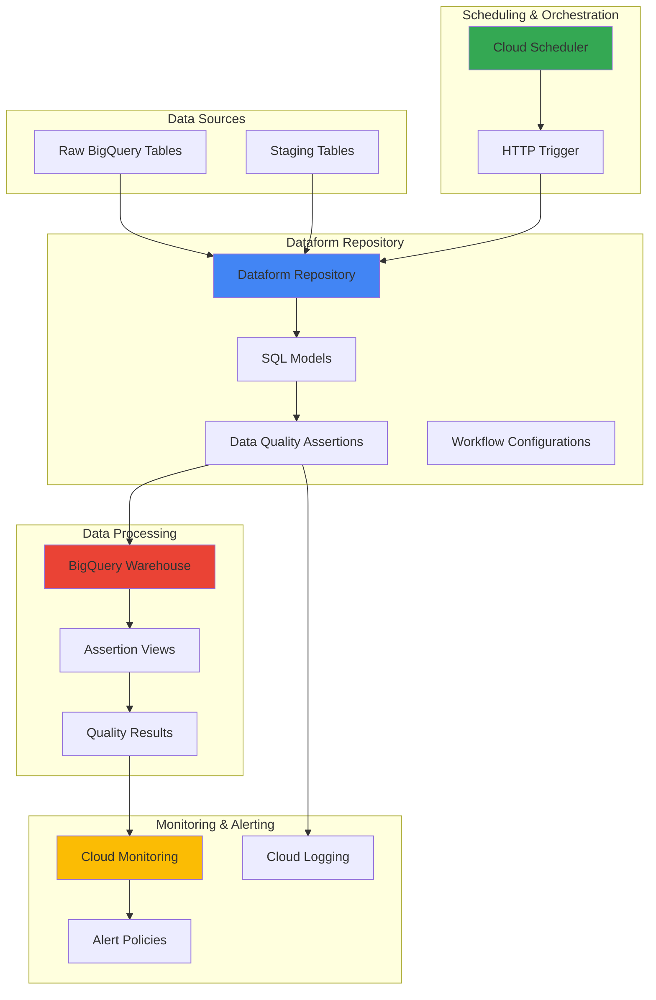

# Data Quality Monitoring with Dataform and Cloud Scheduler

## Problem

Data quality issues in modern data pipelines often go undetected until they impact business decisions or downstream analytics processes. Organizations struggle with manually monitoring data transformations across multiple BigQuery datasets, leading to inconsistent data validation, delayed issue detection, and lack of proactive alerting when data quality thresholds are breached. Manual data quality checks are time-consuming, error-prone, and don't scale with growing data volumes.

## Solution

Create an automated data quality monitoring system using Dataform for SQL-based data assertions and Cloud Scheduler for orchestrating regular quality checks. This solution implements scheduled data quality workflows that validate data transformations, detect anomalies, and send alerts through Cloud Monitoring when quality issues arise. The system provides continuous monitoring of data pipelines with minimal manual intervention while maintaining comprehensive audit trails.

## Architecture Diagram



## Prerequisites

1. Google Cloud project with billing enabled and necessary permissions
2. Google Cloud CLI (gcloud) installed and authenticated
3. BigQuery Admin and Dataform Admin roles assigned to your account
4. Cloud Scheduler Admin and Cloud Monitoring Editor roles
5. Basic understanding of SQL, data warehousing concepts, and Google Cloud services
6. Estimated cost: $20-50/month depending on BigQuery usage and schedule frequency

> **Note**: This recipe uses Google Cloud's serverless data transformation service Dataform, which integrates natively with BigQuery and follows software engineering best practices for data pipeline development.

## Preparation

```bash
# Set environment variables for the project
export PROJECT_ID="dataform-quality-$(date +%s)"
export REGION="us-central1"
export DATAFORM_REGION="us-central1"
export REPOSITORY_ID="data-quality-repo"
export WORKSPACE_ID="quality-workspace"

# Set default project and region
gcloud config set project ${PROJECT_ID}
gcloud config set compute/region ${REGION}

# Generate unique suffix for resource names
RANDOM_SUFFIX=$(openssl rand -hex 3)
export DATASET_ID="sample_ecommerce_${RANDOM_SUFFIX}"
export SCHEDULER_JOB_ID="dataform-quality-job-${RANDOM_SUFFIX}"

# Enable required Google Cloud APIs
gcloud services enable dataform.googleapis.com
gcloud services enable cloudscheduler.googleapis.com
gcloud services enable monitoring.googleapis.com
gcloud services enable bigquery.googleapis.com
gcloud services enable logging.googleapis.com

echo "✅ Project configured: ${PROJECT_ID}"
echo "✅ APIs enabled for Dataform, Scheduler, Monitoring, and BigQuery"
```

## Steps

1. **Create Sample BigQuery Dataset and Tables for Testing**:

   Before implementing data quality monitoring, we need sample data to validate. BigQuery provides the foundation for our data warehouse, offering serverless analytics with built-in integration to Dataform. Creating sample tables with realistic e-commerce data allows us to demonstrate common data quality scenarios like null value detection, referential integrity checks, and business rule validation.

   ```bash
   # Create the sample dataset
   bq mk --dataset \
       --location=${REGION} \
       ${PROJECT_ID}:${DATASET_ID}
   
   # Create customers table with sample data
   bq query --use_legacy_sql=false \
   "CREATE OR REPLACE TABLE \`${PROJECT_ID}.${DATASET_ID}.customers\` AS
   SELECT 
     customer_id,
     email,
     first_name,
     last_name,
     registration_date,
     city,
     state
   FROM (
     SELECT 1 as customer_id, 'john@example.com' as email, 'John' as first_name, 'Doe' as last_name, '2024-01-15' as registration_date, 'New York' as city, 'NY' as state
     UNION ALL
     SELECT 2, 'jane@example.com', 'Jane', 'Smith', '2024-02-20', 'Los Angeles', 'CA'
     UNION ALL
     SELECT 3, 'bob@example.com', 'Bob', 'Johnson', '2024-03-10', 'Chicago', 'IL'
     UNION ALL
     SELECT 4, NULL, 'Alice', 'Brown', '2024-04-05', 'Houston', 'TX'
     UNION ALL
     SELECT 5, 'charlie@example.com', NULL, 'Davis', '2024-05-12', 'Phoenix', 'AZ'
   )"
   
   # Create orders table with sample data including some data quality issues
   bq query --use_legacy_sql=false \
   "CREATE OR REPLACE TABLE \`${PROJECT_ID}.${DATASET_ID}.orders\` AS
   SELECT 
     order_id,
     customer_id,
     order_date,
     total_amount,
     status
   FROM (
     SELECT 1 as order_id, 1 as customer_id, '2024-06-01' as order_date, 99.99 as total_amount, 'completed' as status
     UNION ALL
     SELECT 2, 2, '2024-06-02', 149.50, 'completed'
     UNION ALL
     SELECT 3, 3, '2024-06-03', -25.00, 'refunded'
     UNION ALL
     SELECT 4, 999, '2024-06-04', 75.25, 'pending'
     UNION ALL
     SELECT 5, 2, '2024-06-05', NULL, 'completed'
   )"
   
   echo "✅ Sample BigQuery dataset and tables created with intentional data quality issues"
   ```

   The sample data now includes intentional quality issues: null email addresses, missing names, negative amounts, orphaned customer references, and null order totals. These scenarios will trigger our data quality assertions and demonstrate the monitoring capabilities.

2. **Create Dataform Repository and Workspace**:

   Dataform provides a Git-based development environment for managing SQL transformations and data quality assertions. A repository stores all your SQL code, dependencies, and configurations, while workspaces provide isolated development environments. This follows software engineering best practices with version control, code reviews, and collaborative development workflows.

   ```bash
   # Create the Dataform repository
   gcloud dataform repositories create ${REPOSITORY_ID} \
       --location=${DATAFORM_REGION} \
       --project=${PROJECT_ID}
   
   # Create a development workspace
   gcloud dataform workspaces create ${WORKSPACE_ID} \
       --location=${DATAFORM_REGION} \
       --repository=${REPOSITORY_ID} \
       --project=${PROJECT_ID}
   
   # Verify repository creation
   gcloud dataform repositories describe ${REPOSITORY_ID} \
       --location=${DATAFORM_REGION} \
       --project=${PROJECT_ID}
   
   echo "✅ Dataform repository and workspace created successfully"
   ```

   The repository is now ready for development with a clean workspace environment. Dataform manages dependencies automatically and provides SQL compilation with error checking, ensuring your data transformations are syntactically correct before execution.

3. **Initialize Dataform Project Structure**:

   A well-structured Dataform project follows established patterns for organizing SQL files, configuration, and data quality rules. The `dataform.json` file defines project-wide settings including default dataset locations, BigQuery connection details, and assertion schemas. This configuration enables Dataform to manage table dependencies and generate optimized execution plans.

   ```bash
   # Create local directory structure for Dataform project
   mkdir -p ~/dataform-project/definitions
   mkdir -p ~/dataform-project/definitions/models
   mkdir -p ~/dataform-project/definitions/assertions
   
   # Navigate to project directory
   cd ~/dataform-project
   
   # Create dataform.json configuration file
   cat > dataform.json << EOF
   {
     "warehouse": "bigquery",
     "defaultDatabase": "${PROJECT_ID}",
     "defaultSchema": "${DATASET_ID}",
     "assertionSchema": "dataform_assertions_${RANDOM_SUFFIX}",
     "defaultLocation": "${REGION}",
     "vars": {
       "environment": "development"
     }
   }
   EOF
   
   # Create package.json for dependencies
   cat > package.json << EOF
   {
     "dependencies": {
       "@dataform/core": "^3.0.0"
     }
   }
   EOF
   
   echo "✅ Dataform project structure initialized with BigQuery configuration"
   ```

   The project structure now includes essential configuration files that define how Dataform connects to BigQuery, where to store assertion results, and project-specific variables. The assertion schema will contain views showing data quality validation results.

4. **Create Data Quality Assertions for Customer Data**:

   Data quality assertions in Dataform are SQL queries that identify rows violating specific conditions. When assertions fail (return rows), they indicate data quality issues. Built-in assertions handle common scenarios like uniqueness and non-null checks, while custom assertions allow complex business rule validation. These assertions automatically create BigQuery views for monitoring and alerting.

   ```bash
   # Create customer data quality assertions
   cat > definitions/assertions/customer_quality_checks.sqlx << 'EOF'
   config {
     type: "assertion",
     name: "customers_have_valid_emails"
   }
   
   -- Check for customers with missing or invalid email addresses
   SELECT 
     customer_id,
     email,
     first_name,
     last_name,
     'Missing or invalid email address' as quality_issue
   FROM ${ref("customers")}
   WHERE email IS NULL 
      OR email = ''
      OR NOT REGEXP_CONTAINS(email, r'^[a-zA-Z0-9._%+-]+@[a-zA-Z0-9.-]+\.[a-zA-Z]{2,}$')
   EOF
   
   # Create assertion for customer name completeness
   cat > definitions/assertions/customer_name_completeness.sqlx << 'EOF'
   config {
     type: "assertion",
     name: "customers_have_complete_names"
   }
   
   -- Check for customers with missing first or last names
   SELECT 
     customer_id,
     first_name,
     last_name,
     email,
     'Incomplete customer name information' as quality_issue
   FROM ${ref("customers")}
   WHERE first_name IS NULL 
      OR last_name IS NULL
      OR TRIM(first_name) = ''
      OR TRIM(last_name) = ''
   EOF
   
   echo "✅ Customer data quality assertions created"
   ```

   These assertions will identify customers with invalid emails and incomplete names, creating monitoring views that can trigger alerts when data quality issues are detected. The assertions use Dataform's `ref()` function to create proper table dependencies.

5. **Create Data Quality Assertions for Order Data**:

   Order data often requires more complex validation rules including referential integrity checks, business logic validation, and financial constraints. These assertions demonstrate advanced data quality patterns like checking foreign key relationships, validating business rules (positive amounts), and ensuring data consistency across related tables.

   ```bash
   # Create order data quality assertions
   cat > definitions/assertions/order_quality_checks.sqlx << 'EOF'
   config {
     type: "assertion",
     name: "orders_have_valid_amounts"
   }
   
   -- Check for orders with invalid or missing amounts
   SELECT 
     order_id,
     customer_id,
     total_amount,
     status,
     'Invalid order amount detected' as quality_issue
   FROM ${ref("orders")}
   WHERE total_amount IS NULL 
      OR total_amount < 0
      OR (status IN ('completed', 'pending') AND total_amount <= 0)
   EOF
   
   # Create referential integrity assertion
   cat > definitions/assertions/order_referential_integrity.sqlx << 'EOF'
   config {
     type: "assertion",
     name: "orders_reference_valid_customers"
   }
   
   -- Check for orders referencing non-existent customers
   SELECT 
     o.order_id,
     o.customer_id,
     o.order_date,
     o.total_amount,
     'Order references non-existent customer' as quality_issue
   FROM ${ref("orders")} o
   LEFT JOIN ${ref("customers")} c
     ON o.customer_id = c.customer_id
   WHERE c.customer_id IS NULL
   EOF
   
   echo "✅ Order data quality assertions created with referential integrity checks"
   ```

   These assertions validate business rules and data relationships, ensuring orders have valid amounts and reference existing customers. Failed assertions will appear in the monitoring dashboard, enabling proactive data quality management.

6. **Create Aggregated Data Quality Summary View**:

   A centralized summary view provides a single location to monitor all data quality metrics across your data warehouse. This view aggregates assertion results, calculates quality scores, and provides trend analysis capabilities. It serves as the foundation for automated monitoring and alerting, giving stakeholders a comprehensive view of data health.

   ```bash
   # Create data quality summary model
   cat > definitions/models/data_quality_summary.sqlx << 'EOF'
   config {
     type: "view",
     name: "data_quality_summary",
     description: "Centralized view of data quality metrics across all tables"
   }
   
   WITH assertion_results AS (
     SELECT 
       'customers_have_valid_emails' as assertion_name,
       'customers' as table_name,
       COUNT(*) as failed_records,
       CURRENT_TIMESTAMP() as check_timestamp
     FROM ${ref("customers_have_valid_emails")}
     
     UNION ALL
     
     SELECT 
       'customers_have_complete_names' as assertion_name,
       'customers' as table_name,
       COUNT(*) as failed_records,
       CURRENT_TIMESTAMP() as check_timestamp
     FROM ${ref("customers_have_complete_names")}
     
     UNION ALL
     
     SELECT 
       'orders_have_valid_amounts' as assertion_name,
       'orders' as table_name,
       COUNT(*) as failed_records,
       CURRENT_TIMESTAMP() as check_timestamp
     FROM ${ref("orders_have_valid_amounts")}
     
     UNION ALL
     
     SELECT 
       'orders_reference_valid_customers' as assertion_name,
       'orders' as table_name,
       COUNT(*) as failed_records,
       CURRENT_TIMESTAMP() as check_timestamp
     FROM ${ref("orders_reference_valid_customers")}
   ),
   
   quality_metrics AS (
     SELECT 
       table_name,
       COUNT(*) as total_assertions,
       SUM(CASE WHEN failed_records > 0 THEN 1 ELSE 0 END) as failed_assertions,
       SUM(failed_records) as total_failed_records,
       MAX(check_timestamp) as last_check_timestamp
     FROM assertion_results
     GROUP BY table_name
   )
   
   SELECT 
     table_name,
     total_assertions,
     failed_assertions,
     total_failed_records,
     ROUND(
       ((total_assertions - failed_assertions) / total_assertions) * 100, 2
     ) as quality_score_percent,
     CASE 
       WHEN failed_assertions = 0 THEN 'EXCELLENT'
       WHEN failed_assertions <= 1 THEN 'GOOD'
       WHEN failed_assertions <= 2 THEN 'FAIR'
       ELSE 'POOR'
     END as quality_status,
     last_check_timestamp
   FROM quality_metrics
   ORDER BY quality_score_percent DESC
   EOF
   
   echo "✅ Data quality summary view created for centralized monitoring"
   ```

   This summary view calculates quality scores and status levels, providing an executive dashboard view of data health. The quality score helps identify trending issues and prioritize data quality improvements across different tables.

7. **Create Release Configuration and Deploy to Dataform**:

   Release configurations in Dataform define how your SQL code gets compiled and executed in production. They specify which files to include, compilation variables, and scheduling parameters. This configuration enables automated deployments and ensures consistent execution across different environments.

   ```bash
   # Create workflow configuration for release
   cat > workflow_settings.yaml << EOF
   defaultProject: ${PROJECT_ID}
   defaultDataset: ${DATASET_ID}
   defaultLocation: ${REGION}
   assertionDataset: dataform_assertions_${RANDOM_SUFFIX}
   EOF
   
   # Create the release configuration
   gcloud dataform release-configs create quality-monitoring-release \
       --location=${DATAFORM_REGION} \
       --repository=${REPOSITORY_ID} \
       --git-commitish=main \
       --project=${PROJECT_ID}
   
   # Create compilation result to validate the project
   gcloud dataform compilation-results create \
       --location=${DATAFORM_REGION} \
       --repository=${REPOSITORY_ID} \
       --workspace=${WORKSPACE_ID} \
       --project=${PROJECT_ID}
   
   echo "✅ Release configuration created and project validated"
   ```

   The release configuration is now ready for automated execution. Dataform has validated the SQL syntax and dependencies, ensuring the data quality workflow will execute successfully when triggered.

8. **Create Cloud Scheduler Job for Automated Execution**:

   Cloud Scheduler provides cron-based scheduling for triggering Dataform workflows at regular intervals. This automation ensures data quality checks run consistently without manual intervention. The scheduler integrates with Dataform's API to trigger workflow executions and can be configured for different frequencies based on data update patterns and business requirements.

   ```bash
   # Create service account for Cloud Scheduler to access Dataform
   gcloud iam service-accounts create dataform-scheduler-sa \
       --display-name="Dataform Scheduler Service Account" \
       --project=${PROJECT_ID}
   
   # Grant necessary permissions to the service account
   gcloud projects add-iam-policy-binding ${PROJECT_ID} \
       --member="serviceAccount:dataform-scheduler-sa@${PROJECT_ID}.iam.gserviceaccount.com" \
       --role="roles/dataform.editor"
   
   gcloud projects add-iam-policy-binding ${PROJECT_ID} \
       --member="serviceAccount:dataform-scheduler-sa@${PROJECT_ID}.iam.gserviceaccount.com" \
       --role="roles/bigquery.admin"
   
   # Create the Cloud Scheduler job to run every 6 hours
   gcloud scheduler jobs create http ${SCHEDULER_JOB_ID} \
       --location=${REGION} \
       --schedule="0 */6 * * *" \
       --uri="https://dataform.googleapis.com/v1beta1/projects/${PROJECT_ID}/locations/${DATAFORM_REGION}/repositories/${REPOSITORY_ID}/workflowInvocations" \
       --http-method=POST \
       --headers="Content-Type=application/json" \
       --message-body="{\"compilationResult\":\"projects/${PROJECT_ID}/locations/${DATAFORM_REGION}/repositories/${REPOSITORY_ID}/compilationResults/latest\"}" \
       --oidc-service-account-email="dataform-scheduler-sa@${PROJECT_ID}.iam.gserviceaccount.com" \
       --oidc-token-audience="https://dataform.googleapis.com/"
   
   echo "✅ Cloud Scheduler job created to run data quality checks every 6 hours"
   ```

   The scheduler job now runs automatically every 6 hours, executing the complete data quality workflow including all assertions and summary calculations. This provides continuous monitoring of data quality metrics with minimal operational overhead.

9. **Configure Cloud Monitoring for Data Quality Alerts**:

   Cloud Monitoring provides comprehensive observability for data quality metrics by creating custom metrics from BigQuery query results. Alert policies can trigger notifications when data quality scores fall below thresholds or when specific assertions fail. This proactive approach ensures data quality issues are detected and addressed before they impact business operations.

   ```bash
   # Create log-based metric for data quality failures
   gcloud logging metrics create data_quality_failures \
       --description="Metric tracking data quality assertion failures" \
       --log-filter='resource.type="bigquery_dataset" AND 
                     (textPayload:"assertion" OR textPayload:"quality")' \
       --project=${PROJECT_ID}
   
   # Create notification channel for email alerts
   cat > notification-channel.json << EOF
   {
     "type": "email",
     "displayName": "Data Quality Alerts",
     "description": "Email notifications for data quality issues",
     "labels": {
       "email_address": "your-email@example.com"
     },
     "enabled": true
   }
   EOF
   
   # Create the notification channel
   gcloud alpha monitoring channels create \
       --channel-content-from-file=notification-channel.json
   
   # Get the notification channel ID for alert policy
   NOTIFICATION_CHANNEL=$(gcloud alpha monitoring channels list \
       --filter="displayName:'Data Quality Alerts'" \
       --format="value(name)")
   
   echo "✅ Cloud Monitoring metrics and notification channels configured"
   ```

   Monitoring infrastructure is now configured to track data quality metrics and send alerts when issues are detected. The log-based metrics capture assertion failures and provide trending data for analysis.

10. **Create Alert Policy for Data Quality Monitoring**:

    Alert policies define the conditions that trigger notifications when data quality issues arise. These policies can monitor multiple metrics including assertion failure rates, quality score thresholds, and execution success rates. Configuring appropriate alert thresholds ensures teams are notified of critical issues while avoiding alert fatigue from minor fluctuations.

    ```bash
    # Create alert policy for data quality issues
    cat > alert-policy.json << EOF
    {
      "displayName": "Data Quality Alert Policy",
      "documentation": {
        "content": "Alert when data quality assertions fail or quality scores drop below acceptable thresholds"
      },
      "conditions": [
        {
          "displayName": "High Data Quality Failure Rate",
          "conditionThreshold": {
            "filter": "metric.type=\"logging.googleapis.com/user/data_quality_failures\"",
            "comparison": "COMPARISON_GREATER_THAN",
            "thresholdValue": 5,
            "duration": "300s",
            "aggregations": [
              {
                "alignmentPeriod": "300s",
                "perSeriesAligner": "ALIGN_RATE"
              }
            ]
          }
        }
      ],
      "alertStrategy": {
        "autoClose": "1800s"
      },
      "combiner": "OR",
      "enabled": true,
      "notificationChannels": [
        "${NOTIFICATION_CHANNEL}"
      ]
    }
    EOF
    
    # Create the alert policy
    gcloud alpha monitoring policies create --policy-from-file=alert-policy.json
    
    echo "✅ Alert policy created for proactive data quality monitoring"
    ```

    The alert policy now monitors data quality metrics continuously and sends notifications when quality issues exceed acceptable thresholds. This enables rapid response to data quality degradation and maintains high confidence in analytics and reporting.

## Validation & Testing

1. **Verify Dataform Repository and Workspace Setup**:

   ```bash
   # Check repository status
   gcloud dataform repositories list \
       --location=${DATAFORM_REGION} \
       --project=${PROJECT_ID}
   
   # Verify workspace creation
   gcloud dataform workspaces list \
       --location=${DATAFORM_REGION} \
       --repository=${REPOSITORY_ID} \
       --project=${PROJECT_ID}
   ```

   Expected output: Repository and workspace should be listed with "ACTIVE" status.

2. **Execute Manual Dataform Workflow to Test Assertions**:

   ```bash
   # Trigger a manual workflow execution
   gcloud dataform workflow-invocations create \
       --location=${DATAFORM_REGION} \
       --repository=${REPOSITORY_ID} \
       --compilation-result=projects/${PROJECT_ID}/locations/${DATAFORM_REGION}/repositories/${REPOSITORY_ID}/compilationResults/latest \
       --project=${PROJECT_ID}
   
   # Check execution status
   gcloud dataform workflow-invocations list \
       --location=${DATAFORM_REGION} \
       --repository=${REPOSITORY_ID} \
       --project=${PROJECT_ID}
   ```

   Expected output: Workflow invocation should complete successfully with assertion views created in BigQuery.

3. **Verify Data Quality Assertion Results in BigQuery**:

   ```bash
   # Query the data quality summary view
   bq query --use_legacy_sql=false \
   "SELECT * FROM \`${PROJECT_ID}.${DATASET_ID}.data_quality_summary\`
    ORDER BY quality_score_percent DESC"
   
   # Check specific assertion results
   bq query --use_legacy_sql=false \
   "SELECT COUNT(*) as failed_email_checks 
    FROM \`${PROJECT_ID}.dataform_assertions_${RANDOM_SUFFIX}.customers_have_valid_emails\`"
   ```

   Expected output: Summary view should show quality scores and assertion results should indicate the intentional data quality issues we created.

4. **Test Cloud Scheduler Job Execution**:

   ```bash
   # Manually trigger the scheduler job
   gcloud scheduler jobs run ${SCHEDULER_JOB_ID} \
       --location=${REGION}
   
   # Check job execution history
   gcloud scheduler jobs describe ${SCHEDULER_JOB_ID} \
       --location=${REGION}
   ```

   Expected output: Job should execute successfully and trigger a new Dataform workflow invocation.

## Cleanup

1. **Delete Cloud Scheduler Job**:

   ```bash
   # Delete the scheduler job
   gcloud scheduler jobs delete ${SCHEDULER_JOB_ID} \
       --location=${REGION} \
       --quiet
   
   echo "✅ Cloud Scheduler job deleted"
   ```

2. **Remove Dataform Resources**:

   ```bash
   # Delete workflow invocations
   for invocation in $(gcloud dataform workflow-invocations list \
       --location=${DATAFORM_REGION} \
       --repository=${REPOSITORY_ID} \
       --format="value(name)" \
       --project=${PROJECT_ID}); do
     gcloud dataform workflow-invocations delete ${invocation} \
         --location=${DATAFORM_REGION} \
         --quiet
   done
   
   # Delete release configurations
   gcloud dataform release-configs delete quality-monitoring-release \
       --location=${DATAFORM_REGION} \
       --repository=${REPOSITORY_ID} \
       --quiet
   
   # Delete workspace and repository
   gcloud dataform workspaces delete ${WORKSPACE_ID} \
       --location=${DATAFORM_REGION} \
       --repository=${REPOSITORY_ID} \
       --quiet
   
   gcloud dataform repositories delete ${REPOSITORY_ID} \
       --location=${DATAFORM_REGION} \
       --quiet
   
   echo "✅ Dataform resources deleted"
   ```

3. **Remove BigQuery Datasets and Tables**:

   ```bash
   # Delete the assertion dataset
   bq rm -r -f -d ${PROJECT_ID}:dataform_assertions_${RANDOM_SUFFIX}
   
   # Delete the main dataset
   bq rm -r -f -d ${PROJECT_ID}:${DATASET_ID}
   
   echo "✅ BigQuery datasets and tables deleted"
   ```

4. **Clean Up Monitoring and IAM Resources**:

   ```bash
   # Delete alert policies
   for policy in $(gcloud alpha monitoring policies list \
       --filter="displayName:'Data Quality Alert Policy'" \
       --format="value(name)"); do
     gcloud alpha monitoring policies delete ${policy} --quiet
   done
   
   # Delete log-based metrics
   gcloud logging metrics delete data_quality_failures --quiet
   
   # Delete notification channels
   for channel in $(gcloud alpha monitoring channels list \
       --filter="displayName:'Data Quality Alerts'" \
       --format="value(name)"); do
     gcloud alpha monitoring channels delete ${channel} --quiet
   done
   
   # Delete service account
   gcloud iam service-accounts delete \
       dataform-scheduler-sa@${PROJECT_ID}.iam.gserviceaccount.com \
       --quiet
   
   # Clean up local files
   rm -rf ~/dataform-project
   rm -f notification-channel.json alert-policy.json workflow_settings.yaml
   
   echo "✅ Monitoring resources and service accounts deleted"
   ```

## Discussion

This automated data quality monitoring solution demonstrates the power of combining Dataform's SQL-based transformation capabilities with Cloud Scheduler's reliable orchestration and Cloud Monitoring's comprehensive alerting infrastructure. By implementing data quality as code, organizations can maintain consistent validation standards across their entire data warehouse while leveraging Google Cloud's serverless architecture for scalability and cost efficiency.

The Dataform assertions provide a declarative approach to data quality validation, where SQL queries define the conditions that indicate data quality issues. This approach is particularly powerful because it allows data engineers and analysts to use familiar SQL syntax while benefiting from Dataform's dependency management, version control integration, and automated documentation generation. The assertion results are stored as BigQuery views, making them easily accessible for downstream analysis and monitoring dashboards.

Cloud Scheduler integration ensures that data quality checks run consistently without manual intervention, while the configurable cron expressions allow organizations to align monitoring frequency with their data update patterns and business requirements. The HTTP-based trigger mechanism provides flexibility for integration with other orchestration tools and supports complex workflow patterns including conditional execution and error handling.

The Cloud Monitoring integration creates a comprehensive observability layer that tracks data quality metrics over time, enabling trend analysis and proactive issue detection. Custom log-based metrics capture assertion failures and execution statistics, while alert policies provide configurable thresholds for different severity levels. This approach supports both operational monitoring for immediate issue response and strategic monitoring for long-term data quality improvement initiatives.

> **Tip**: Consider implementing data quality scoring algorithms that weight different assertion types based on business impact, allowing prioritized alerting and resource allocation for the most critical quality issues.

For comprehensive implementation guidance, refer to the [Dataform documentation](https://cloud.google.com/dataform/docs/overview), [Cloud Scheduler best practices](https://cloud.google.com/scheduler/docs/best-practices), [BigQuery data governance patterns](https://cloud.google.com/bigquery/docs/best-practices-governance), [Cloud Monitoring alerting strategies](https://cloud.google.com/monitoring/alerts/concepts-indepth), and the [Google Cloud Architecture Framework for analytics](https://cloud.google.com/architecture/framework/data-analytics).

## Challenge

Extend this data quality monitoring solution by implementing these enhancements:

1. **Advanced Anomaly Detection**: Integrate with Vertex AI to implement statistical anomaly detection for numerical data columns, automatically identifying outliers and unusual patterns that traditional rule-based assertions might miss.

2. **Cross-Dataset Quality Validation**: Expand the assertion framework to validate data consistency across multiple BigQuery datasets and projects, implementing referential integrity checks and business rule validation spanning your entire data ecosystem.

3. **Real-Time Quality Streaming**: Implement streaming data quality validation using Dataflow and Pub/Sub to monitor data quality in real-time as new records arrive, complementing the batch-based Dataform assertions with continuous validation.

4. **Quality Score Trending and Forecasting**: Build predictive models using BigQuery ML to forecast data quality trends and proactively identify potential quality degradation before it impacts business operations.

5. **Integration with Data Catalog and Lineage**: Connect the quality monitoring system with Dataplex and Data Catalog to provide comprehensive data lineage tracking, showing how quality issues propagate through downstream transformations and analytical workflows.

## Infrastructure Code

### Available Infrastructure as Code:

- [Infrastructure Code Overview](code/README.md) - Detailed description of all infrastructure components
- [Infrastructure Manager](code/infrastructure-manager/) - GCP Infrastructure Manager templates
- [Bash CLI Scripts](code/scripts/) - Example bash scripts using gcloud CLI commands to deploy infrastructure
- [Terraform](code/terraform/) - Terraform configuration files