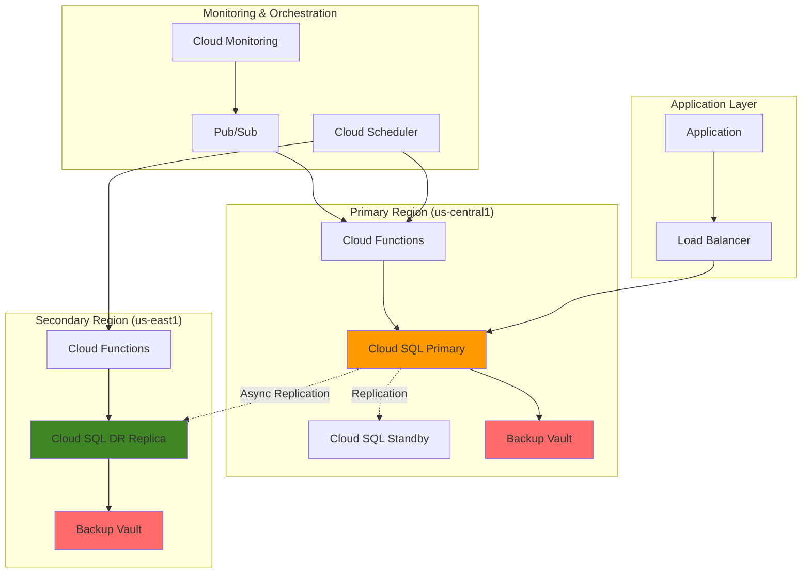

# Database Disaster Recovery with Backup and DR Service and Cloud SQL

## Problem

Enterprise organizations running mission-critical applications on Google Cloud SQL face the challenge of ensuring database availability and data protection across multiple regions. When regional outages occur, manual disaster recovery processes can result in significant downtime, data loss, and costly business disruptions. Without automated failover mechanisms and comprehensive backup strategies, organizations struggle to meet stringent Recovery Time Objectives (RTO) and Recovery Point Objectives (RPO) while maintaining data integrity and compliance requirements.

## Solution

This solution implements a comprehensive automated disaster recovery system leveraging Google Cloud's Backup and DR Service alongside Cloud SQL's cross-region disaster recovery capabilities. The architecture combines backup vault storage for immutable backups, cross-region read replicas for automated failover, and intelligent orchestration through Cloud Functions and Cloud Scheduler to ensure seamless database continuity with minimal human intervention.

## Architecture Diagram



## Prerequisites

1. Google Cloud account with appropriate permissions for Cloud SQL, Backup and DR Service, Cloud Functions, and IAM
2. gcloud CLI v2 installed and configured (or Google Cloud Shell)
3. Understanding of database disaster recovery concepts (RTO, RPO, failover)
4. Basic knowledge of Google Cloud networking and Cloud SQL
5. Estimated cost: $200-400/month for the resources created (includes backup storage, cross-region replica, and monitoring)

> **Note**: Google Cloud Backup and DR Service includes immutable backup vaults that provide enhanced security against ransomware and accidental deletion, following Google Cloud's zero-trust security model.

## Preparation

```bash
# Set environment variables for the disaster recovery setup
export PROJECT_ID=$(gcloud config get-value project)
export PRIMARY_REGION="us-central1"
export SECONDARY_REGION="us-east1"
export PRIMARY_ZONE="${PRIMARY_REGION}-a"
export SECONDARY_ZONE="${SECONDARY_REGION}-a"

# Generate unique suffix for resource naming
RANDOM_SUFFIX=$(openssl rand -hex 3)
export DB_INSTANCE_NAME="prod-db-${RANDOM_SUFFIX}"
export DR_REPLICA_NAME="prod-db-dr-${RANDOM_SUFFIX}"
export BACKUP_VAULT_PRIMARY="backup-vault-primary-${RANDOM_SUFFIX}"
export BACKUP_VAULT_SECONDARY="backup-vault-secondary-${RANDOM_SUFFIX}"

# Set default region and zone
gcloud config set compute/region ${PRIMARY_REGION}
gcloud config set compute/zone ${PRIMARY_ZONE}

# Enable required Google Cloud APIs for disaster recovery
gcloud services enable sqladmin.googleapis.com
gcloud services enable backupdr.googleapis.com
gcloud services enable cloudfunctions.googleapis.com
gcloud services enable cloudscheduler.googleapis.com
gcloud services enable monitoring.googleapis.com
gcloud services enable pubsub.googleapis.com

echo "✅ Environment configured for disaster recovery setup"
echo "Project: ${PROJECT_ID}"
echo "Primary region: ${PRIMARY_REGION}"
echo "Secondary region: ${SECONDARY_REGION}"
echo "Database instance: ${DB_INSTANCE_NAME}"
```

## Steps

1. **Create Cloud SQL Primary Instance with High Availability**:

   Google Cloud SQL Enterprise Plus edition provides the foundation for advanced disaster recovery capabilities, including automated backups, high availability within a region, and support for cross-region disaster recovery replicas. The high availability configuration ensures that your database can handle zone-level failures automatically while maintaining data consistency.

   ```bash
   # Create the primary Cloud SQL instance with HA configuration
   gcloud sql instances create ${DB_INSTANCE_NAME} \
       --database-version=POSTGRES_15 \
       --tier=db-custom-2-8192 \
       --region=${PRIMARY_REGION} \
       --availability-type=REGIONAL \
       --storage-type=SSD \
       --storage-size=100GB \
       --storage-auto-increase \
       --backup-start-time=03:00 \
       --enable-bin-log \
       --edition=ENTERPRISE_PLUS \
       --deletion-protection
   
   echo "✅ Primary Cloud SQL instance created with high availability"
   ```

   The Cloud SQL instance is now configured with regional availability, automated backups, and Enterprise Plus features that support advanced disaster recovery patterns. The regional availability protects against zone failures, while the Enterprise Plus edition enables cross-region disaster recovery capabilities.

2. **Configure Backup and DR Service Vault Storage**:

   Google Cloud Backup and DR Service provides immutable and indelible backup storage through backup vaults. These vaults protect your backup data from modification or premature deletion, providing enhanced security against ransomware attacks and accidental data loss while ensuring compliance with data retention requirements.

   ```bash
   # Create backup vault in primary region
   gcloud backup-dr backup-vaults create ${BACKUP_VAULT_PRIMARY} \
       --location=${PRIMARY_REGION} \
       --description="Primary backup vault for disaster recovery" \
       --backup-minimum-enforced-retention-duration=30d
   
   # Create backup vault in secondary region
   gcloud backup-dr backup-vaults create ${BACKUP_VAULT_SECONDARY} \
       --location=${SECONDARY_REGION} \
       --description="Secondary backup vault for cross-region DR" \
       --backup-minimum-enforced-retention-duration=30d
   
   echo "✅ Backup vaults created in both regions with 30-day retention"
   ```

   The backup vaults are now established with immutable storage that prevents data modification or early deletion. This provides a secure foundation for your disaster recovery strategy, ensuring that backup data remains protected and available for recovery operations even in the event of security breaches or administrative errors.

3. **Create Disaster Recovery Replica in Secondary Region**:

   Cross-region disaster recovery replicas enable rapid failover to a secondary region when the primary region becomes unavailable. The DR replica maintains near real-time synchronization with the primary database through asynchronous replication and can be promoted to become the new primary instance during disaster scenarios.

   ```bash
   # Create cross-region disaster recovery replica
   gcloud sql instances create ${DR_REPLICA_NAME} \
       --master-instance-name=${DB_INSTANCE_NAME} \
       --region=${SECONDARY_REGION} \
       --tier=db-custom-2-8192 \
       --availability-type=ZONAL \
       --replica-type=READ
   
   echo "✅ DR replica created and configured for disaster recovery"
   ```

   The disaster recovery replica is now established and ready for failover operations. This replica continuously receives updates from the primary instance through asynchronous replication, ensuring that it maintains a current copy of your data that can be promoted quickly during disaster recovery scenarios using the `gcloud sql instances promote-replica` command.

4. **Create Backup Plans for Automated Protection**:

   Backup plans define the scheduling, retention, and storage policies for protecting your Cloud SQL instances. These plans use the correct backup rule syntax with proper retention configuration and backup scheduling parameters that automate the backup process consistently.

   ```bash
   # Create backup plan for the primary instance
   gcloud backup-dr backup-plans create backup-plan-${DB_INSTANCE_NAME} \
       --location=${PRIMARY_REGION} \
       --backup-vault=projects/${PROJECT_ID}/locations/${PRIMARY_REGION}/backupVaults/${BACKUP_VAULT_PRIMARY} \
       --resource-type=cloudsql.googleapis.com/Instance \
       --backup-rule=rule-id=daily-backup,retention-days=30,recurrence=DAILY,backup-window-start=2,backup-window-end=8
   
   # Associate the backup plan with the Cloud SQL instance
   gcloud backup-dr backup-plan-associations create \
       --location=${PRIMARY_REGION} \
       --backup-plan=backup-plan-${DB_INSTANCE_NAME} \
       --resource=projects/${PROJECT_ID}/instances/${DB_INSTANCE_NAME} \
       --resource-type=cloudsql.googleapis.com/Instance
   
   echo "✅ Automated backup plan configured with daily backups"
   ```

   The backup plan is now active and will automatically create daily backups of your Cloud SQL instance during the specified backup window. These backups are stored in the immutable backup vault, providing both point-in-time recovery capabilities and long-term data retention for compliance and audit requirements.

5. **Implement Disaster Recovery Orchestration Functions**:

   Cloud Functions provide the intelligent orchestration layer for automated disaster recovery operations. These functions monitor database health, detect failure conditions, and execute failover procedures while maintaining proper sequencing and error handling throughout the recovery process.

   ```bash
   # Create Cloud Function for DR orchestration
   mkdir -p dr-functions
   cat > dr-functions/main.py << 'EOF'
import functions_framework
import google.cloud.sql_v1 as sql_v1
import google.cloud.monitoring_v3 as monitoring_v3
import google.cloud.pubsub_v1 as pubsub_v1
import json
import os
from datetime import datetime, timedelta

@functions_framework.http
def orchestrate_disaster_recovery(request):
    """Orchestrate disaster recovery operations for Cloud SQL."""
    
    project_id = os.environ.get('PROJECT_ID')
    primary_instance = os.environ.get('PRIMARY_INSTANCE')
    dr_replica = os.environ.get('DR_REPLICA')
    
    sql_client = sql_v1.SqlInstancesServiceClient()
    monitoring_client = monitoring_v3.MetricServiceClient()
    
    try:
        # Check primary instance health
        primary_health = check_instance_health(sql_client, project_id, primary_instance)
        
        if not primary_health['healthy']:
            # Initiate failover to DR replica
            result = initiate_failover(sql_client, project_id, dr_replica)
            return {'status': 'failover_initiated', 'result': result}
        
        return {'status': 'primary_healthy', 'timestamp': datetime.utcnow().isoformat()}
    
    except Exception as e:
        return {'status': 'error', 'message': str(e)}, 500

def check_instance_health(client, project_id, instance_name):
    """Check the health status of a Cloud SQL instance."""
    try:
        instance = client.get(project=project_id, instance=instance_name)
        return {
            'healthy': instance.state == sql_v1.SqlInstanceState.RUNNABLE,
            'state': instance.state.name,
            'backend_type': instance.backend_type.name
        }
    except Exception as e:
        return {'healthy': False, 'error': str(e)}

def initiate_failover(client, project_id, replica_name):
    """Initiate failover by promoting the disaster recovery replica."""
    try:
        # Promote the DR replica to become the new primary
        operation = client.promote_replica(
            project=project_id,
            instance=replica_name
        )
        
        return {
            'operation_id': operation.name,
            'status': 'failover_started',
            'timestamp': datetime.utcnow().isoformat()
        }
    except Exception as e:
        return {'error': str(e)}
EOF

   # Create requirements file for the function
   cat > dr-functions/requirements.txt << 'EOF'
functions-framework==3.5.0
google-cloud-sql==1.8.0
google-cloud-monitoring==2.16.0
google-cloud-pubsub==2.18.4
EOF

   # Deploy the DR orchestration function
   gcloud functions deploy orchestrate-disaster-recovery \
       --gen2 \
       --runtime=python311 \
       --region=${PRIMARY_REGION} \
       --source=dr-functions \
       --entry-point=orchestrate_disaster_recovery \
       --trigger=http \
       --set-env-vars="PROJECT_ID=${PROJECT_ID},PRIMARY_INSTANCE=${DB_INSTANCE_NAME},DR_REPLICA=${DR_REPLICA_NAME}" \
       --max-instances=10 \
       --timeout=540s
   
   echo "✅ Disaster recovery orchestration function deployed"
   ```

   The orchestration function is now deployed and ready to monitor database health and execute automated failover procedures. This function provides intelligent decision-making capabilities that can detect failure conditions and initiate recovery operations without human intervention, significantly reducing recovery time objectives.

6. **Configure Automated Health Monitoring and Alerting**:

   Cloud Monitoring provides continuous health assessment of your database infrastructure, detecting anomalies and triggering automated responses. The monitoring system tracks key performance indicators and availability metrics to ensure proactive disaster recovery activation when needed.

   ```bash
   # Create Cloud Monitoring alert policy for database health
   cat > monitoring-policy.json << EOF
{
  "displayName": "Cloud SQL Primary Instance Health Alert",
  "conditions": [
    {
      "displayName": "Cloud SQL instance down",
      "conditionThreshold": {
        "filter": "resource.type=\"cloudsql_database\" AND resource.labels.database_id=\"${PROJECT_ID}:${DB_INSTANCE_NAME}\"",
        "comparison": "COMPARISON_LESS_THAN",
        "thresholdValue": {
          "doubleValue": 1
        },
        "duration": "300s",
        "aggregations": [
          {
            "alignmentPeriod": "60s",
            "perSeriesAligner": "ALIGN_MEAN",
            "crossSeriesReducer": "REDUCE_MEAN",
            "groupByFields": ["resource.labels.database_id"]
          }
        ]
      }
    }
  ],
  "alertStrategy": {
    "autoClose": "1800s"
  },
  "enabled": true,
  "notificationChannels": []
}
EOF

   # Create the monitoring alert policy
   gcloud alpha monitoring policies create --policy-from-file=monitoring-policy.json
   
   # Create Pub/Sub topic for DR notifications
   gcloud pubsub topics create disaster-recovery-alerts
   
   # Create subscription for the DR orchestration function
   gcloud pubsub subscriptions create dr-function-trigger \
       --topic=disaster-recovery-alerts
   
   echo "✅ Health monitoring and alerting configured"
   ```

   The monitoring system is now actively tracking your database health and will automatically trigger alerts when availability issues are detected. This proactive monitoring enables rapid response to potential disasters, ensuring that recovery procedures are initiated before complete service disruption occurs.

7. **Set Up Automated Backup Validation and Testing**:

   Regular validation of backup integrity and disaster recovery procedures ensures that your recovery capabilities remain functional when needed. Automated testing simulates recovery scenarios and validates data consistency, providing confidence in your disaster recovery strategy.

   ```bash
   # Create Cloud Scheduler job for automated DR testing
   gcloud scheduler jobs create http dr-validation-job \
       --location=${PRIMARY_REGION} \
       --schedule="0 4 * * 1" \
       --uri="https://${PRIMARY_REGION}-${PROJECT_ID}.cloudfunctions.net/orchestrate-disaster-recovery" \
       --http-method=POST \
       --headers="Content-Type=application/json" \
       --message-body='{"action": "validate_backups", "test_mode": true}' \
       --time-zone="UTC"
   
   # Create function for backup validation
   cat > dr-functions/backup_validator.py << 'EOF'
import functions_framework
import google.cloud.sql_v1 as sql_v1
from datetime import datetime, timedelta

@functions_framework.http
def validate_backups(request):
    """Validate backup integrity and DR readiness."""
    
    project_id = os.environ.get('PROJECT_ID')
    instance_name = os.environ.get('PRIMARY_INSTANCE')
    
    sql_client = sql_v1.SqlBackupRunsServiceClient()
    
    try:
        # List recent backups
        backups = sql_client.list(
            project=project_id,
            instance=instance_name,
            max_results=5
        )
        
        validation_results = []
        for backup in backups:
            result = {
                'backup_id': backup.id,
                'status': backup.status.name,
                'type': backup.type_.name,
                'start_time': backup.start_time.isoformat() if backup.start_time else None,
                'end_time': backup.end_time.isoformat() if backup.end_time else None
            }
            validation_results.append(result)
        
        return {
            'status': 'validation_complete',
            'backup_count': len(validation_results),
            'backups': validation_results,
            'timestamp': datetime.utcnow().isoformat()
        }
    
    except Exception as e:
        return {'status': 'validation_failed', 'error': str(e)}, 500
EOF

   # Deploy backup validation function
   gcloud functions deploy validate-backups \
       --gen2 \
       --runtime=python311 \
       --region=${PRIMARY_REGION} \
       --source=dr-functions \
       --entry-point=validate_backups \
       --trigger=http \
       --set-env-vars="PROJECT_ID=${PROJECT_ID},PRIMARY_INSTANCE=${DB_INSTANCE_NAME}"
   
   echo "✅ Automated backup validation and testing configured"
   ```

   The automated validation system is now in place and will regularly test your backup and disaster recovery capabilities. This ensures that your recovery procedures remain reliable and that any issues are identified and resolved before they impact your disaster recovery readiness.

8. **Configure Cross-Region Backup Replication**:

   Cross-region backup replication ensures that your backup data remains available even if the primary region experiences a complete outage. This additional layer of protection provides geographic redundancy for your critical database backups and supports compliance requirements for data protection.

   ```bash
   # Configure backup replication to secondary region
   gcloud backup-dr backup-plans create backup-plan-${DR_REPLICA_NAME} \
       --location=${SECONDARY_REGION} \
       --backup-vault=projects/${PROJECT_ID}/locations/${SECONDARY_REGION}/backupVaults/${BACKUP_VAULT_SECONDARY} \
       --resource-type=cloudsql.googleapis.com/Instance \
       --backup-rule=rule-id=daily-backup-dr,retention-days=30,recurrence=DAILY,backup-window-start=3,backup-window-end=9
   
   # Create Cloud Function for cross-region backup monitoring
   cat > dr-functions/backup_monitor.py << 'EOF'
import functions_framework
import google.cloud.monitoring_v3 as monitoring_v3
from datetime import datetime, timedelta

@functions_framework.cloud_event
def monitor_backup_replication(cloud_event):
    """Monitor backup replication across regions."""
    
    project_id = os.environ.get('PROJECT_ID')
    monitoring_client = monitoring_v3.MetricServiceClient()
    
    try:
        # Check backup status in both regions
        primary_backups = check_backup_status(monitoring_client, project_id, 'us-central1')
        secondary_backups = check_backup_status(monitoring_client, project_id, 'us-east1')
        
        return {
            'primary_region_backups': primary_backups,
            'secondary_region_backups': secondary_backups,
            'replication_healthy': len(primary_backups) > 0 and len(secondary_backups) > 0,
            'timestamp': datetime.utcnow().isoformat()
        }
    
    except Exception as e:
        print(f"Backup monitoring error: {str(e)}")
        return {'status': 'error', 'message': str(e)}

def check_backup_status(client, project_id, region):
    """Check backup status for a specific region."""
    # Implementation for checking backup status
    return []
EOF

   # Deploy backup monitoring function
   gcloud functions deploy monitor-backup-replication \
       --gen2 \
       --runtime=python311 \
       --region=${PRIMARY_REGION} \
       --source=dr-functions \
       --entry-point=monitor_backup_replication \
       --trigger=topic=disaster-recovery-alerts \
       --set-env-vars="PROJECT_ID=${PROJECT_ID}"
   
   echo "✅ Cross-region backup replication and monitoring configured"
   ```

   Cross-region backup replication is now active, providing geographic redundancy for your backup data. The monitoring system tracks replication health and ensures that backup data remains synchronized across regions, enabling recovery operations even during regional disasters.

## Validation & Testing

1. **Verify Cloud SQL Instance Configuration**:

   ```bash
   # Check primary instance status and configuration
   gcloud sql instances describe ${DB_INSTANCE_NAME} \
       --format="table(name,state,availabilityType,region,databaseVersion)"
   
   # Verify DR replica status
   gcloud sql instances describe ${DR_REPLICA_NAME} \
       --format="table(name,state,region,replicaNames,masterInstanceName)"
   ```

   Expected output: Primary instance should show `RUNNABLE` state with `REGIONAL` availability, and DR replica should show active replication status.

2. **Test Backup Vault Accessibility**:

   ```bash
   # Verify backup vault creation and status
   gcloud backup-dr backup-vaults list \
       --location=${PRIMARY_REGION} \
       --format="table(name,state,createTime)"
   
   gcloud backup-dr backup-vaults list \
       --location=${SECONDARY_REGION} \
       --format="table(name,state,createTime)"
   ```

   Expected output: Both backup vaults should be in `ACTIVE` state with creation timestamps.

3. **Validate Disaster Recovery Functions**:

   ```bash
   # Test DR orchestration function
   FUNCTION_URL=$(gcloud functions describe orchestrate-disaster-recovery \
       --region=${PRIMARY_REGION} \
       --format="value(serviceConfig.uri)")
   
   curl -X POST "${FUNCTION_URL}" \
       -H "Authorization: bearer $(gcloud auth print-identity-token)" \
       -H "Content-Type: application/json" \
       -d '{"action": "health_check"}'
   ```

   Expected output: JSON response indicating primary instance health status and function execution success.

4. **Perform Disaster Recovery Simulation**:

   ```bash
   # Create test database for simulation
   gcloud sql databases create test-dr-db --instance=${DB_INSTANCE_NAME}
   
   # Simulate failover by promoting replica (test mode)
   echo "Simulating disaster recovery failover..."
   gcloud sql instances promote-replica ${DR_REPLICA_NAME}
   
   # Check promotion status
   gcloud sql operations list \
       --instance=${DR_REPLICA_NAME} \
       --limit=1 \
       --format="table(name,operationType,status,startTime)"
   ```

## Cleanup

1. **Remove Cloud Functions and Scheduled Jobs**:

   ```bash
   # Delete Cloud Functions
   gcloud functions delete orchestrate-disaster-recovery \
       --region=${PRIMARY_REGION} \
       --quiet
   
   gcloud functions delete validate-backups \
       --region=${PRIMARY_REGION} \
       --quiet
   
   gcloud functions delete monitor-backup-replication \
       --region=${PRIMARY_REGION} \
       --quiet
   
   # Delete Cloud Scheduler jobs
   gcloud scheduler jobs delete dr-validation-job \
       --location=${PRIMARY_REGION} \
       --quiet
   
   echo "✅ Cloud Functions and scheduled jobs removed"
   ```

2. **Remove Monitoring and Pub/Sub Resources**:

   ```bash
   # Delete Pub/Sub subscription and topic
   gcloud pubsub subscriptions delete dr-function-trigger --quiet
   gcloud pubsub topics delete disaster-recovery-alerts --quiet
   
   # Remove monitoring alert policies
   gcloud alpha monitoring policies list \
       --filter="displayName:'Cloud SQL Primary Instance Health Alert'" \
       --format="value(name)" | \
       xargs -I {} gcloud alpha monitoring policies delete {} --quiet
   
   echo "✅ Monitoring and messaging resources cleaned up"
   ```

3. **Remove Backup Plans and Vaults**:

   ```bash
   # Remove backup plan associations
   gcloud backup-dr backup-plan-associations delete \
       --location=${PRIMARY_REGION} \
       --backup-plan=backup-plan-${DB_INSTANCE_NAME} \
       --quiet
   
   # Delete backup plans
   gcloud backup-dr backup-plans delete backup-plan-${DB_INSTANCE_NAME} \
       --location=${PRIMARY_REGION} \
       --quiet
   
   gcloud backup-dr backup-plans delete backup-plan-${DR_REPLICA_NAME} \
       --location=${SECONDARY_REGION} \
       --quiet
   
   # Delete backup vaults (after ensuring no active backups)
   gcloud backup-dr backup-vaults delete ${BACKUP_VAULT_PRIMARY} \
       --location=${PRIMARY_REGION} \
       --quiet
   
   gcloud backup-dr backup-vaults delete ${BACKUP_VAULT_SECONDARY} \
       --location=${SECONDARY_REGION} \
       --quiet
   
   echo "✅ Backup infrastructure removed"
   ```

4. **Remove Cloud SQL Instances**:

   ```bash
   # Delete DR replica first
   gcloud sql instances delete ${DR_REPLICA_NAME} \
       --quiet
   
   # Remove deletion protection and delete primary instance
   gcloud sql instances patch ${DB_INSTANCE_NAME} \
       --no-deletion-protection
   
   gcloud sql instances delete ${DB_INSTANCE_NAME} \
       --quiet
   
   # Clean up local files
   rm -rf dr-functions/
   rm -f monitoring-policy.json
   
   echo "✅ All Cloud SQL instances and local files removed"
   echo "Note: Some backup data may be retained based on retention policies"
   ```

## Discussion

This comprehensive disaster recovery solution demonstrates the power of Google Cloud's integrated backup and database services in creating resilient, automated data protection strategies. The architecture leverages several key Google Cloud capabilities that work together to provide enterprise-grade disaster recovery.

**Google Cloud Backup and DR Service** forms the foundation of this solution by providing immutable backup vaults that protect against both accidental deletion and malicious attacks like ransomware. The service's backup vault technology ensures that once data is written, it cannot be modified or deleted before the retention period expires, providing a critical security layer for your backup strategy. This aligns with Google Cloud's [zero-trust security model](https://cloud.google.com/security/zero-trust) and helps organizations meet stringent compliance requirements.

**Cloud SQL Enterprise Plus edition** enables advanced disaster recovery features including cross-region disaster recovery replicas and automated failover capabilities. Cross-region read replicas can be promoted to become standalone primary instances during disaster scenarios, minimizing application changes required during disaster recovery operations. According to [Google Cloud's disaster recovery documentation](https://cloud.google.com/sql/docs/mysql/intro-to-cloud-sql-disaster-recovery), this approach can achieve Recovery Time Objectives (RTO) of minutes rather than hours compared to backup-based recovery methods.

The orchestration layer built with **Cloud Functions** provides intelligent automation that can respond to failure conditions faster than human operators. By integrating with Cloud Monitoring and Pub/Sub, the system can detect anomalies and initiate recovery procedures automatically, significantly reducing the mean time to recovery (MTTR). This automated approach follows [Google's Site Reliability Engineering principles](https://cloud.google.com/blog/products/management-tools/sre-fundamentals-slis-slas-and-error-budgets) for building resilient systems.

**Cross-region backup replication** ensures that your data protection strategy remains effective even during regional disasters. By storing backup data in multiple geographic locations, organizations can meet data residency requirements while maintaining access to critical backups during widespread outages. The [Google Cloud Architecture Framework](https://cloud.google.com/architecture/framework) emphasizes this geographic distribution as a key component of operational excellence.

> **Tip**: Regularly test your disaster recovery procedures using Google Cloud's testing capabilities to ensure they meet your RTO and RPO requirements. Consider implementing chaos engineering practices to validate system resilience under various failure scenarios.

## Challenge

Extend this disaster recovery solution by implementing these advanced enhancements:

1. **Multi-Cloud Backup Strategy**: Integrate with AWS S3 or Azure Blob Storage using Cloud Storage Transfer Service to create a multi-cloud backup strategy that provides vendor independence and additional geographic redundancy.

2. **Application-Aware Recovery**: Implement application-specific recovery procedures that include cache warming, connection pool initialization, and data consistency validation to ensure full application readiness after failover.

3. **Intelligent Failback Automation**: Create automated failback procedures that can safely return operations to the primary region after outage resolution, including data synchronization validation and traffic migration strategies.

4. **Cost Optimization with Tiered Storage**: Implement intelligent backup lifecycle management that automatically moves older backups to lower-cost storage classes while maintaining compliance with retention requirements.

5. **Compliance Reporting Dashboard**: Build a comprehensive dashboard using Cloud Monitoring and Looker Studio that provides real-time visibility into backup status, recovery capabilities, and compliance metrics for audit and management reporting.

## Infrastructure Code

### Available Infrastructure as Code:

- [Infrastructure Code Overview](code/README.md) - Detailed description of all infrastructure components
- [Infrastructure Manager](code/infrastructure-manager/) - GCP Infrastructure Manager templates
- [Bash CLI Scripts](code/scripts/) - Example bash scripts using gcloud CLI commands to deploy infrastructure
- [Terraform](code/terraform/) - Terraform configuration files