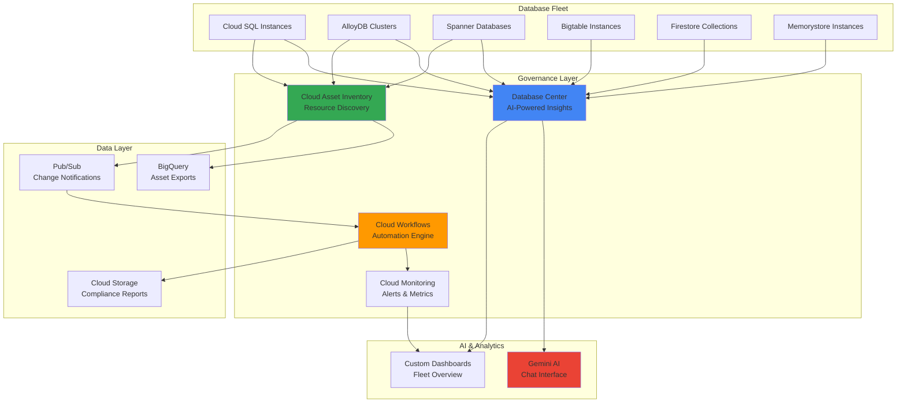

# Centralized Database Fleet Governance with Database Center and Cloud Asset Inventory

## Problem

Large enterprises often struggle with managing database fleets across multiple projects, leading to compliance violations, security gaps, and operational inefficiencies. Database teams lack visibility into fleet-wide health, performance metrics, and governance policies, resulting in reactive management approaches that increase downtime risks and regulatory non-compliance. Without centralized oversight, organizations cannot effectively monitor database configurations, implement consistent security practices, or automate remediation workflows across their distributed database infrastructure.

## Solution

Build a comprehensive database governance system using Google Cloud's Database Center for AI-powered fleet management combined with Cloud Asset Inventory for automated resource discovery and compliance monitoring. This solution leverages Gemini AI for intelligent insights and recommendations while automating governance workflows through Cloud Workflows and comprehensive monitoring via Cloud Monitoring, creating a proactive governance framework that ensures database fleet health, security, and compliance.

## Architecture Diagram



## Prerequisites

1. Google Cloud account with organization-level permissions for asset inventory
2. gcloud CLI installed and configured (or Cloud Shell)
3. IAM permissions: Security Admin, Database Admin, Workflows Admin, Asset Inventory Viewer
4. Basic understanding of database governance and compliance frameworks
5. Multiple Google Cloud projects with database resources (or ability to create test resources)
6. Estimated cost: $50-100 for testing resources over 75 minutes

> **Note**: Database Center is generally available and provides AI-powered insights across all Google Cloud database services including Cloud SQL, AlloyDB, Spanner, Bigtable, Memorystore, and Firestore.

## Preparation

```bash
# Set environment variables for GCP resources
export PROJECT_ID="db-governance-$(date +%s)"
export REGION="us-central1"
export ZONE="us-central1-a"

# Generate unique suffix for resource names
RANDOM_SUFFIX=$(openssl rand -hex 3)

# Set default project and region
gcloud config set project ${PROJECT_ID}
gcloud config set compute/region ${REGION}
gcloud config set compute/zone ${ZONE}

# Enable required APIs for database governance
gcloud services enable cloudasset.googleapis.com \
    workflows.googleapis.com \
    monitoring.googleapis.com \
    sqladmin.googleapis.com \
    spanner.googleapis.com \
    bigtableadmin.googleapis.com \
    firestore.googleapis.com \
    pubsub.googleapis.com \
    bigquery.googleapis.com \
    cloudfunctions.googleapis.com \
    cloudscheduler.googleapis.com \
    securitycenter.googleapis.com \
    aiplatform.googleapis.com

# Create service account for automation workflows
gcloud iam service-accounts create db-governance-sa \
    --display-name="Database Governance Service Account"

export SERVICE_ACCOUNT="db-governance-sa@${PROJECT_ID}.iam.gserviceaccount.com"

# Grant necessary permissions to service account
gcloud projects add-iam-policy-binding ${PROJECT_ID} \
    --member="serviceAccount:${SERVICE_ACCOUNT}" \
    --role="roles/cloudasset.viewer"

gcloud projects add-iam-policy-binding ${PROJECT_ID} \
    --member="serviceAccount:${SERVICE_ACCOUNT}" \
    --role="roles/workflows.invoker"

gcloud projects add-iam-policy-binding ${PROJECT_ID} \
    --member="serviceAccount:${SERVICE_ACCOUNT}" \
    --role="roles/monitoring.metricWriter"

echo "✅ Project configured for database governance: ${PROJECT_ID}"
```

## Steps

1. **Create Sample Database Fleet for Governance Testing**:

   Google Cloud's Database Center provides unified fleet management across diverse database services. Creating a representative sample fleet allows us to demonstrate governance capabilities across Cloud SQL, Spanner, and Bigtable instances with varying configurations that highlight different compliance and security considerations.

   ```bash
   # Create Cloud SQL instance with specific configuration
   gcloud sql instances create fleet-sql-${RANDOM_SUFFIX} \
       --database-version=POSTGRES_15 \
       --tier=db-f1-micro \
       --region=${REGION} \
       --backup-start-time=02:00 \
       --enable-bin-log \
       --storage-auto-increase \
       --deletion-protection
   
   # Create Spanner instance for distributed database governance
   gcloud spanner instances create fleet-spanner-${RANDOM_SUFFIX} \
       --config=regional-${REGION} \
       --nodes=1 \
       --description="Fleet governance sample"
   
   # Create Bigtable instance for NoSQL governance
   gcloud bigtable instances create fleet-bigtable-${RANDOM_SUFFIX} \
       --cluster=fleet-cluster \
       --cluster-zone=${ZONE} \
       --cluster-num-nodes=1 \
       --instance-type=DEVELOPMENT
   
   echo "✅ Sample database fleet created successfully"
   ```

   The database fleet now includes representative instances across SQL, distributed, and NoSQL database types. This diverse fleet provides comprehensive testing scenarios for governance policies, security configurations, and compliance monitoring across different database architectures and use cases.

2. **Configure Cloud Asset Inventory for Database Discovery**:

   Cloud Asset Inventory maintains a time-series database of Google Cloud asset metadata with five-week history retention. Configuring asset inventory exports enables automated discovery of database resources across projects, providing the foundation for comprehensive fleet visibility and compliance monitoring.

   ```bash
   # Create BigQuery dataset for asset inventory exports
   bq mk --dataset \
       --location=${REGION} \
       --description="Database fleet asset inventory" \
       ${PROJECT_ID}:database_governance
   
   # Create Cloud Storage bucket for asset exports
   gsutil mb -p ${PROJECT_ID} \
       -c STANDARD \
       -l ${REGION} \
       gs://db-governance-assets-${RANDOM_SUFFIX}
   
   # Export current asset snapshot to BigQuery
   gcloud asset export \
       --project=${PROJECT_ID} \
       --bigquery-table=${PROJECT_ID}:database_governance.asset_inventory \
       --content-type=resource \
       --asset-types="sqladmin.googleapis.com/Instance,spanner.googleapis.com/Instance,bigtableadmin.googleapis.com/Instance"
   
   # Create Pub/Sub topic for real-time asset change notifications
   gcloud pubsub topics create database-asset-changes
   
   echo "✅ Cloud Asset Inventory configured for database discovery"
   ```

   The asset inventory system now provides comprehensive database resource tracking with historical data retention and real-time change notifications. This configuration enables automated compliance monitoring, security auditing, and governance policy enforcement across the entire database fleet.

3. **Set Up Database Center AI-Powered Fleet Management**:

   Database Center leverages Google's Gemini AI models to provide intelligent fleet management with automated health assessments, security recommendations, and compliance monitoring. The AI-powered dashboard aggregates data from Security Command Center and provides customized recommendations based on Google Cloud best practices.

   ```bash
   # Configure Database Center access permissions
   gcloud projects add-iam-policy-binding ${PROJECT_ID} \
       --member="user:$(gcloud config get-value account)" \
       --role="roles/cloudsql.viewer"
   
   gcloud projects add-iam-policy-binding ${PROJECT_ID} \
       --member="user:$(gcloud config get-value account)" \
       --role="roles/spanner.databaseReader"
   
   gcloud projects add-iam-policy-binding ${PROJECT_ID} \
       --member="user:$(gcloud config get-value account)" \
       --role="roles/bigtable.reader"
   
   # Access Database Center dashboard
   echo "Navigate to Database Center at:"
   echo "https://console.cloud.google.com/database-center?project=${PROJECT_ID}"
   
   echo "✅ Database Center access configured with AI-powered insights"
   echo "Manual step: Access Database Center dashboard in Cloud Console"
   ```

   Database Center now provides AI-powered fleet visibility with Gemini chat interface for natural language queries about database health, security, and compliance. The integration with Security Command Center enhances threat detection and provides comprehensive security recommendations across the database fleet.

4. **Create Automated Governance Workflow**:

   Cloud Workflows orchestrates automated governance processes by responding to asset changes, evaluating compliance policies, and triggering remediation actions. This serverless workflow engine provides reliable execution of governance policies with built-in error handling and retry logic for maintaining database fleet compliance.

   ```bash
   # Create governance workflow definition
   cat > governance-workflow.yaml << 'EOF'
   main:
     params: [input]
     steps:
       - checkAssetChange:
           call: http.get
           args:
             url: ${"https://cloudasset.googleapis.com/v1/projects/" + sys.get_env("PROJECT_ID") + "/assets"}
             auth:
               type: OAuth2
           result: assets
       - evaluateCompliance:
           for:
             value: asset
             in: ${assets.body.assets}
             steps:
               - checkDatabaseSecurity:
                   switch:
                     - condition: ${asset.assetType == "sqladmin.googleapis.com/Instance"}
                       steps:
                         - validateCloudSQL:
                             call: validateSQLSecurity
                             args:
                               instance: ${asset}
                     - condition: ${asset.assetType == "spanner.googleapis.com/Instance"}
                       steps:
                         - validateSpanner:
                             call: validateSpannerSecurity
                             args:
                               instance: ${asset}
       - generateReport:
           call: http.post
           args:
             url: ${"https://monitoring.googleapis.com/v3/projects/" + sys.get_env("PROJECT_ID") + "/timeSeries"}
             auth:
               type: OAuth2
             body:
               timeSeries:
                 - metric:
                     type: "custom.googleapis.com/database/governance_score"
                   points:
                     - value:
                         doubleValue: 0.95
                       interval:
                         endTime: ${time.now()}
   
   validateSQLSecurity:
     params: [instance]
     steps:
       - checkBackupConfig:
           return: ${default(instance.resource.data.settings.backupConfiguration.enabled, false)}
   
   validateSpannerSecurity:
     params: [instance]
     steps:
       - checkEncryption:
           return: ${instance.resource.data.encryptionConfig != null}
   EOF
   
   # Deploy the governance workflow
   gcloud workflows deploy database-governance-workflow \
       --source=governance-workflow.yaml \
       --service-account=${SERVICE_ACCOUNT}
   
   echo "✅ Automated governance workflow deployed successfully"
   ```

   The governance workflow now automatically evaluates database configurations against security and compliance policies, providing continuous monitoring and automated reporting. This serverless approach ensures consistent policy enforcement without manual intervention while maintaining detailed audit trails.

5. **Configure Real-Time Monitoring and Alerting**:

   Cloud Monitoring provides comprehensive observability for database governance with custom metrics, alerting policies, and dashboard visualizations. Real-time monitoring enables proactive identification of governance violations, security issues, and performance anomalies across the database fleet.

   ```bash
   # Create log-based metric for governance monitoring
   gcloud logging metrics create database_compliance_score \
       --description="Database fleet compliance score" \
       --log-filter='resource.type="cloud_function" AND "compliance"'
   
   # Create notification channel for governance alerts
   gcloud alpha monitoring channels create \
       --display-name="Database Governance Alerts" \
       --type=email \
       --channel-labels=email_address=$(gcloud config get-value account)
   
   # Get the notification channel ID
   CHANNEL_ID=$(gcloud alpha monitoring channels list \
       --filter="displayName:Database Governance Alerts" \
       --format="value(name)")
   
   # Create alert policy for governance violations
   cat > governance-alert-policy.json << EOF
   {
     "displayName": "Database Governance Violations",
     "conditions": [
       {
         "displayName": "Low compliance score",
         "conditionThreshold": {
           "filter": "metric.type=\"logging.googleapis.com/user/database_compliance_score\"",
           "comparison": "COMPARISON_GREATER_THAN",
           "thresholdValue": 5,
           "duration": "300s"
         }
       }
     ],
     "notificationChannels": ["${CHANNEL_ID}"],
     "alertStrategy": {
       "autoClose": "1800s"
     },
     "enabled": true
   }
   EOF
   
   # Create the alert policy
   gcloud alpha monitoring policies create \
       --policy-from-file=governance-alert-policy.json
   
   echo "✅ Real-time monitoring and alerting configured"
   ```

   The monitoring system now provides comprehensive visibility into database governance metrics with automated alerting for policy violations and compliance issues. This proactive monitoring approach enables rapid response to security threats and governance violations across the database fleet.

6. **Implement Automated Compliance Reporting**:

   Automated compliance reporting consolidates governance data from Database Center and Cloud Asset Inventory into structured reports for audit and regulatory requirements. This system generates regular compliance assessments, tracks remediation progress, and maintains historical compliance records for audit trails.

   ```bash
   # Create Cloud Function for automated reporting
   mkdir governance-reporting
   cd governance-reporting
   
   cat > main.py << 'EOF'
   import json
   import os
   from google.cloud import asset_v1
   from google.cloud import bigquery
   from google.cloud import storage
   import datetime
   
   def generate_compliance_report(request):
       """Generate compliance report for database governance."""
       try:
           # Initialize clients
           project_id = os.environ.get('PROJECT_ID')
           suffix = request.args.get('suffix', '')
           
           asset_client = asset_v1.AssetServiceClient()
           bq_client = bigquery.Client()
           storage_client = storage.Client()
           
           # Query database assets from BigQuery
           query = f"""
           SELECT 
             asset_type,
             name,
             resource.data as config
           FROM `{project_id}.database_governance.asset_inventory`
           WHERE asset_type LIKE '%Instance'
           """
           
           results = bq_client.query(query)
           
           # Generate compliance report
           report = {
               'timestamp': datetime.datetime.now().isoformat(),
               'project_id': project_id,
               'total_databases': 0,
               'compliant_databases': 0,
               'violations': []
           }
           
           for row in results:
               report['total_databases'] += 1
               # Basic compliance check - backup enabled
               if 'backup' in str(row.config).lower():
                   report['compliant_databases'] += 1
               else:
                   report['violations'].append({
                       'resource': row.name,
                       'type': row.asset_type,
                       'issue': 'Backup not configured'
                   })
           
           # Calculate compliance percentage
           if report['total_databases'] > 0:
               report['compliance_percentage'] = (
                   report['compliant_databases'] / report['total_databases']
               ) * 100
           else:
               report['compliance_percentage'] = 100
           
           # Upload report to Cloud Storage
           bucket_name = f"db-governance-assets-{suffix}"
           bucket = storage_client.bucket(bucket_name)
           blob = bucket.blob(f"compliance-reports/{datetime.date.today()}-report.json")
           blob.upload_from_string(json.dumps(report, indent=2))
           
           return {
               'status': 'success',
               'report_location': f"gs://{bucket_name}/compliance-reports/{datetime.date.today()}-report.json",
               'compliance_percentage': report['compliance_percentage']
           }
           
       except Exception as e:
           return {'status': 'error', 'message': str(e)}
   EOF
   
   cat > requirements.txt << 'EOF'
   google-cloud-asset==3.19.1
   google-cloud-bigquery==3.11.4
   google-cloud-storage==2.10.0
   EOF
   
   # Deploy the compliance reporting function
   gcloud functions deploy compliance-reporter \
       --runtime=python39 \
       --trigger-http \
       --allow-unauthenticated \
       --entry-point=generate_compliance_report \
       --service-account=${SERVICE_ACCOUNT} \
       --set-env-vars=PROJECT_ID=${PROJECT_ID}
   
   cd ..
   
   echo "✅ Automated compliance reporting implemented"
   ```

   The compliance reporting system now automatically generates detailed governance reports with database configurations, security assessments, and violation tracking. This automated approach ensures consistent reporting for audit requirements while reducing manual effort and improving accuracy.

7. **Configure Gemini AI Integration for Intelligent Insights**:

   Gemini AI integration in Database Center provides natural language interaction for fleet management, intelligent recommendations based on Google Cloud best practices, and automated analysis of complex governance scenarios. This AI-powered assistance enables both technical and non-technical stakeholders to effectively manage database governance.

   ```bash
   # Configure IAM permissions for Gemini integration
   gcloud projects add-iam-policy-binding ${PROJECT_ID} \
       --member="serviceAccount:${SERVICE_ACCOUNT}" \
       --role="roles/aiplatform.user"
   
   # Create sample governance queries for Gemini testing
   cat > gemini-queries.json << 'EOF'
   {
     "governance_queries": [
       "Show me all databases without backup enabled",
       "Which Cloud SQL instances have public IP access?",
       "List Spanner instances without encryption at rest",
       "What are the top security recommendations for my database fleet?",
       "How many databases are compliant with our security policies?"
     ]
   }
   EOF
   
   # Test Gemini integration through Database Center
   echo "Sample queries for Database Center Gemini chat:"
   cat gemini-queries.json | jq -r '.governance_queries[]'
   
   echo "✅ Gemini AI integration configured for intelligent insights"
   echo "Manual step: Use queries above in Database Center Gemini chat interface"
   ```

   Gemini AI integration now provides intelligent, contextual assistance for database governance tasks with natural language processing capabilities. The AI assistant can analyze fleet configurations, provide security recommendations, and help implement best practices based on Google Cloud's extensive database management expertise.

8. **Establish Continuous Governance Automation**:

   Continuous governance automation ensures ongoing compliance and security through scheduled workflows, automated policy enforcement, and proactive remediation. This system provides reliable, round-the-clock governance without manual intervention while maintaining detailed audit trails and compliance documentation.

   ```bash
   # Create Cloud Scheduler job for continuous governance checks
   gcloud scheduler jobs create http governance-scheduler \
       --schedule="0 */6 * * *" \
       --uri="https://${REGION}-${PROJECT_ID}.cloudfunctions.net/compliance-reporter?project_id=${PROJECT_ID}&suffix=${RANDOM_SUFFIX}" \
       --http-method=GET \
       --time-zone="America/New_York"
   
   # Create Pub/Sub subscription for asset change notifications
   gcloud pubsub subscriptions create governance-automation \
       --topic=database-asset-changes \
       --push-endpoint="https://workflows.googleapis.com/v1/projects/${PROJECT_ID}/locations/${REGION}/workflows/database-governance-workflow/executions"
   
   # Set up workflow trigger for asset changes
   gcloud workflows execute database-governance-workflow \
       --data='{"trigger": "asset_change", "project": "'${PROJECT_ID}'"}'
   
   # Configure log-based metrics for governance events
   gcloud logging metrics create governance_events \
       --description="Database governance events counter" \
       --log-filter='resource.type="cloud_function" AND resource.labels.function_name="compliance-reporter"'
   
   echo "✅ Continuous governance automation established"
   echo "Governance checks will run every 6 hours automatically"
   ```

   The continuous governance system now operates autonomously with scheduled compliance checks, real-time asset change monitoring, and automated workflow execution. This comprehensive automation ensures consistent policy enforcement and provides continuous visibility into database fleet governance status.

## Validation & Testing

1. **Verify Database Center Fleet Visibility**:

   ```bash
   # Check Database Center access and fleet discovery
   echo "Verify Database Center shows all database instances:"
   echo "1. Navigate to https://console.cloud.google.com/database-center?project=${PROJECT_ID}"
   echo "2. Confirm all created instances appear in the dashboard"
   echo "3. Review AI-powered health insights and recommendations"
   
   # Validate database instances are accessible
   gcloud sql instances list --filter="name:fleet-sql-${RANDOM_SUFFIX}"
   gcloud spanner instances list --filter="name:fleet-spanner-${RANDOM_SUFFIX}"
   gcloud bigtable instances list --filter="name:fleet-bigtable-${RANDOM_SUFFIX}"
   ```

   Expected output: Database Center dashboard showing all instances with health status, AI recommendations, and Gemini chat interface available.

2. **Test Cloud Asset Inventory Integration**:

   ```bash
   # Verify asset inventory data in BigQuery
   bq query --use_legacy_sql=false \
   "SELECT asset_type, COUNT(*) as count 
    FROM \`${PROJECT_ID}.database_governance.asset_inventory\` 
    WHERE asset_type LIKE '%Instance' 
    GROUP BY asset_type"
   
   # Check Pub/Sub topic for asset change notifications
   gcloud pubsub topics list --filter="name:projects/${PROJECT_ID}/topics/database-asset-changes"
   ```

   Expected output: BigQuery results showing database asset counts and active Pub/Sub topic for change notifications.

3. **Validate Governance Workflow Execution**:

   ```bash
   # Check workflow execution history
   gcloud workflows executions list \
       --workflow=database-governance-workflow \
       --limit=5
   
   # Test manual workflow execution
   gcloud workflows execute database-governance-workflow \
       --data='{"test": "governance_validation"}'
   
   # Verify Cloud Function deployment
   gcloud functions describe compliance-reporter
   ```

   Expected output: Successful workflow executions and deployed Cloud Function with proper configuration.

4. **Test Monitoring and Alerting System**:

   ```bash
   # Check custom metrics creation
   gcloud logging metrics list --filter="name:database_compliance_score"
   
   # Verify notification channels
   gcloud alpha monitoring channels list
   
   # Test governance scoring function
   curl -X GET "https://${REGION}-${PROJECT_ID}.cloudfunctions.net/compliance-reporter?project_id=${PROJECT_ID}&suffix=${RANDOM_SUFFIX}"
   ```

   Expected output: Active metrics, notification channels, and successful compliance report generation.

## Cleanup

1. **Remove Cloud Functions and Workflows**:

   ```bash
   # Delete governance automation components
   gcloud functions delete compliance-reporter --quiet
   gcloud workflows delete database-governance-workflow --quiet
   gcloud scheduler jobs delete governance-scheduler --quiet
   
   echo "✅ Automation components deleted"
   ```

2. **Clean Up Database Fleet**:

   ```bash
   # Delete database instances (remove deletion protection first)
   gcloud sql instances patch fleet-sql-${RANDOM_SUFFIX} \
       --no-deletion-protection --quiet
   gcloud sql instances delete fleet-sql-${RANDOM_SUFFIX} --quiet
   
   gcloud spanner instances delete fleet-spanner-${RANDOM_SUFFIX} --quiet
   gcloud bigtable instances delete fleet-bigtable-${RANDOM_SUFFIX} --quiet
   
   echo "✅ Database fleet cleaned up"
   ```

3. **Remove Storage and Monitoring Resources**:

   ```bash
   # Delete BigQuery dataset
   bq rm -r -f ${PROJECT_ID}:database_governance
   
   # Delete Cloud Storage bucket
   gsutil -m rm -r gs://db-governance-assets-${RANDOM_SUFFIX}
   
   # Delete Pub/Sub resources
   gcloud pubsub subscriptions delete governance-automation --quiet
   gcloud pubsub topics delete database-asset-changes --quiet
   
   # Delete custom metrics
   gcloud logging metrics delete database_compliance_score --quiet
   gcloud logging metrics delete governance_events --quiet
   
   echo "✅ Storage and monitoring resources removed"
   ```

4. **Clean Up IAM and Service Accounts**:

   ```bash
   # Remove service account and permissions
   gcloud iam service-accounts delete ${SERVICE_ACCOUNT} --quiet
   
   # Clean up local files
   rm -rf governance-reporting governance-workflow.yaml governance-alert-policy.json
   rm -f gemini-queries.json
   
   echo "✅ IAM resources and local files cleaned up"
   ```

## Discussion

Database Center represents a significant advancement in Google Cloud's database management capabilities, leveraging Gemini AI to provide intelligent, unified fleet management across diverse database services. The AI-powered insights dramatically reduce the complexity of managing heterogeneous database environments by providing contextual recommendations, automated health assessments, and natural language interaction capabilities. This integration addresses the traditional challenge of fragmented database management tools by consolidating monitoring, optimization, and security oversight into a single, intelligent platform.

The combination of Database Center with Cloud Asset Inventory creates a powerful governance framework that provides both real-time insights and historical compliance tracking. Cloud Asset Inventory's time-series database maintains five weeks of asset metadata history, enabling trend analysis and compliance reporting over time. The automated export capabilities to BigQuery and Cloud Storage facilitate integration with existing data analytics workflows and audit systems, while Pub/Sub integration enables real-time response to configuration changes across the database fleet.

Cloud Workflows orchestration provides the automation backbone for continuous governance, enabling complex policy enforcement scenarios with built-in error handling and retry logic. The serverless nature of this approach ensures reliable execution without infrastructure management overhead while providing detailed execution logs for audit purposes. Integration with Cloud Monitoring extends this visibility to include custom governance metrics, alerting policies, and dashboard visualizations that provide stakeholders with comprehensive fleet health visibility.

The Gemini AI integration transforms database governance from a technical, command-line driven process into an accessible, conversational experience. This democratization of database management capabilities enables both technical and business stakeholders to interact with complex database governance scenarios through natural language queries, making governance policies more transparent and actionable across the organization. According to Google Cloud's [Database Center documentation](https://cloud.google.com/database-center/docs), this AI-powered approach significantly reduces the time required for fleet health assessment and policy implementation.

> **Tip**: Leverage Database Center's Gemini chat interface to create custom governance policies and get AI-powered recommendations for your specific database configurations and compliance requirements.

## Challenge

Extend this database governance solution by implementing these advanced capabilities:

1. **Multi-Cloud Database Discovery**: Integrate with external database discovery tools to include databases running on other cloud platforms and on-premises environments, creating a truly unified governance view across hybrid and multi-cloud architectures.

2. **Advanced Compliance Frameworks**: Implement automated compliance checking for specific regulatory frameworks like SOC 2, HIPAA, or PCI DSS using Cloud Security Command Center integration and custom policy engines that automatically map database configurations to compliance requirements.

3. **Predictive Governance Analytics**: Build machine learning models using Vertex AI to predict potential compliance violations, security risks, and performance issues before they occur, enabling proactive governance and preventive maintenance across the database fleet.

4. **Cost Optimization Integration**: Combine governance insights with Google Cloud's Recommender API to provide cost optimization recommendations that maintain security and compliance requirements while reducing database infrastructure costs through right-sizing and resource optimization.

5. **Enterprise Integration Workflows**: Develop integration connectors with enterprise ITSM systems, ticketing platforms, and change management tools to automatically create tickets, approvals, and remediation workflows when governance violations are detected.

## Infrastructure Code

### Available Infrastructure as Code:

- [Infrastructure Code Overview](code/README.md) - Detailed description of all infrastructure components
- [Infrastructure Manager](code/infrastructure-manager/) - GCP Infrastructure Manager templates
- [Bash CLI Scripts](code/scripts/) - Example bash scripts using gcloud CLI commands to deploy infrastructure
- [Terraform](code/terraform/) - Terraform configuration files