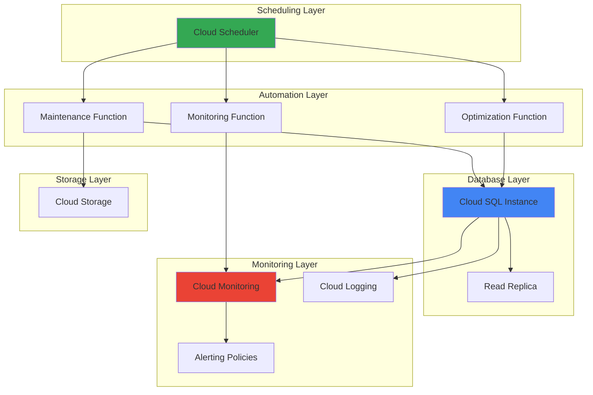

# Database Maintenance Automation with Cloud SQL and Cloud Scheduler

## Problem

Enterprise database administrators face the ongoing challenge of maintaining optimal database performance while minimizing manual overhead and operational costs. Database maintenance tasks like query optimization, performance monitoring, and proactive alerting traditionally require significant manual intervention, leading to inconsistent maintenance schedules, reactive problem-solving, and increased operational risk during peak business hours.

## Solution

Implement an intelligent database maintenance automation system using Cloud SQL's managed database services combined with Cloud Scheduler for precise timing control, Cloud Functions for automated task execution, and Cloud Monitoring for comprehensive performance tracking. This approach delivers consistent maintenance schedules, proactive performance optimization, and automated alerting while leveraging Google Cloud's serverless architecture for cost efficiency and scalability.

## Architecture Diagram



## Prerequisites

1. Google Cloud project with Owner or Editor permissions for database and function management
2. Google Cloud CLI (gcloud) installed and configured with authentication
3. Basic understanding of SQL database concepts and Cloud SQL administration
4. Familiarity with Cloud Functions deployment and Cloud Scheduler configuration
5. Estimated cost: $15-30/month for Cloud SQL db-f1-micro instance and associated serverless resources

> **Note**: This recipe uses Cloud SQL's managed database service which automatically handles underlying infrastructure, security patches, and high availability, following Google Cloud's operational excellence best practices.

## Preparation

```bash
# Set environment variables for consistent resource naming
export PROJECT_ID=$(gcloud config get-value project)
export REGION="us-central1"
export ZONE="us-central1-a"

# Generate unique suffix for resource names to avoid conflicts
RANDOM_SUFFIX=$(openssl rand -hex 3)
export DB_INSTANCE_NAME="maintenance-db-${RANDOM_SUFFIX}"
export FUNCTION_NAME="db-maintenance-${RANDOM_SUFFIX}"
export SCHEDULER_JOB_NAME="db-scheduler-${RANDOM_SUFFIX}"
export BUCKET_NAME="db-maintenance-logs-${PROJECT_ID}-${RANDOM_SUFFIX}"

# Set default project and region for gcloud commands
gcloud config set project ${PROJECT_ID}
gcloud config set compute/region ${REGION}
gcloud config set compute/zone ${ZONE}

# Enable required Google Cloud APIs for the automation system
gcloud services enable sqladmin.googleapis.com
gcloud services enable cloudfunctions.googleapis.com
gcloud services enable cloudscheduler.googleapis.com
gcloud services enable monitoring.googleapis.com
gcloud services enable logging.googleapis.com
gcloud services enable storage.googleapis.com

echo "✅ Project configured with ID: ${PROJECT_ID}"
echo "✅ Required APIs enabled for database automation"
```

## Steps

1. **Create Cloud Storage Bucket for Maintenance Logs**:

   Cloud Storage provides durable object storage for maintenance logs, backup artifacts, and automation scripts. Creating a regional bucket with appropriate lifecycle policies ensures cost-effective storage while maintaining audit trails for compliance and troubleshooting. This foundational component supports the entire maintenance automation workflow by providing persistent storage for operational data.

   ```bash
   # Create storage bucket for maintenance logs and artifacts
   gsutil mb -p ${PROJECT_ID} \
       -c STANDARD \
       -l ${REGION} \
       gs://${BUCKET_NAME}
   
   # Configure lifecycle policy for cost optimization
   cat > lifecycle.json << EOF
   {
     "rule": [
       {
         "action": {"type": "SetStorageClass", "storageClass": "NEARLINE"},
         "condition": {"age": 30}
       },
       {
         "action": {"type": "Delete"},
         "condition": {"age": 365}
       }
     ]
   }
   EOF
   
   gsutil lifecycle set lifecycle.json gs://${BUCKET_NAME}
   rm lifecycle.json
   
   echo "✅ Storage bucket created with lifecycle management"
   ```

   The storage bucket now provides secure, scalable storage for maintenance artifacts with automated cost optimization. The lifecycle policy transitions older logs to more cost-effective storage classes and removes aged data, ensuring efficient resource utilization while maintaining adequate retention for operational needs.

2. **Create Cloud SQL Database Instance with Monitoring Configuration**:

   Cloud SQL provides fully managed relational database services with built-in high availability, automatic backups, and seamless scaling. Configuring the instance with appropriate maintenance windows and backup settings establishes a robust foundation for automated database operations while ensuring business continuity and data protection.

   ```bash
   # Create Cloud SQL MySQL instance with optimized configuration
   gcloud sql instances create ${DB_INSTANCE_NAME} \
       --database-version=MYSQL_8_0 \
       --tier=db-f1-micro \
       --region=${REGION} \
       --backup-start-time=02:00 \
       --maintenance-window-day=SUN \
       --maintenance-window-hour=03 \
       --enable-bin-log \
       --storage-auto-increase \
       --storage-type=SSD \
       --database-flags=slow_query_log=on,long_query_time=2
   
   # Wait for instance to be ready
   echo "Waiting for Cloud SQL instance to be ready..."
   gcloud sql instances describe ${DB_INSTANCE_NAME} \
       --format="value(state)" | \
       while read state; do
         if [ "$state" = "RUNNABLE" ]; then
           break
         fi
         sleep 10
       done
   
   # Create database for application data
   gcloud sql databases create maintenance_app \
       --instance=${DB_INSTANCE_NAME}
   
   # Create database user with appropriate permissions
   gcloud sql users create maintenance_user \
       --instance=${DB_INSTANCE_NAME} \
       --password=TempPassword123!
   
   echo "✅ Cloud SQL instance created with monitoring enabled"
   ```

   The Cloud SQL instance is now operational with automated backups, maintenance windows, and performance monitoring enabled. The configuration includes binary logging for point-in-time recovery, slow query logging for performance analysis, and automatic storage scaling to accommodate growth without manual intervention.

3. **Deploy Cloud Function for Database Maintenance Tasks**:

   Cloud Functions provide serverless compute for executing maintenance operations without managing infrastructure. The function implements intelligent maintenance logic including query analysis, performance optimization, and automated reporting, leveraging Cloud SQL's administrative APIs for comprehensive database management.

   ```bash
   # Create directory and source code for maintenance function
   mkdir -p maintenance-function
   cd maintenance-function
   
   # Create main function file with maintenance logic
   cat > main.py << 'EOF'
   import functions_framework
   import pymysql
   import json
   import logging
   from google.cloud import monitoring_v3
   from google.cloud import storage
   from google.cloud import sql_v1
   from datetime import datetime, timedelta
   import os
   
   def get_db_connection():
       """Establish connection to Cloud SQL instance"""
       try:
           connection = pymysql.connect(
               host='127.0.0.1',
               user=os.environ['DB_USER'],
               password=os.environ['DB_PASSWORD'],
               database=os.environ['DB_NAME'],
               unix_socket=f'/cloudsql/{os.environ["CONNECTION_NAME"]}'
           )
           return connection
       except Exception as e:
           logging.error(f"Database connection failed: {e}")
           raise
   
   def analyze_slow_queries(connection):
       """Analyze and log slow queries for optimization"""
       cursor = connection.cursor()
       try:
           cursor.execute("""
               SELECT sql_text, exec_count, avg_timer_wait/1000000000 as avg_time_seconds
               FROM performance_schema.events_statements_summary_by_digest 
               WHERE avg_timer_wait > 2000000000
               ORDER BY avg_timer_wait DESC LIMIT 10
           """)
           
           slow_queries = cursor.fetchall()
           return [{"query": q[0][:100] if q[0] else "", "count": q[1], "avg_time": float(q[2])} 
                   for q in slow_queries]
       except Exception as e:
           logging.warning(f"Failed to analyze slow queries: {e}")
           return []
       finally:
           cursor.close()
   
   def optimize_tables(connection):
       """Perform table optimization and maintenance"""
       cursor = connection.cursor()
       try:
           cursor.execute("SHOW TABLES")
           tables = cursor.fetchall()
           
           optimized_tables = []
           for table in tables:
               table_name = table[0]
               try:
                   cursor.execute(f"OPTIMIZE TABLE `{table_name}`")
                   optimized_tables.append(table_name)
               except Exception as e:
                   logging.warning(f"Failed to optimize {table_name}: {e}")
           
           return optimized_tables
       except Exception as e:
           logging.warning(f"Failed to optimize tables: {e}")
           return []
       finally:
           cursor.close()
   
   def collect_performance_metrics(connection):
       """Collect database performance metrics"""
       cursor = connection.cursor()
       try:
           # Get connection stats
           cursor.execute("SHOW STATUS LIKE 'Threads_connected'")
           connections_result = cursor.fetchone()
           connections = int(connections_result[1]) if connections_result else 0
           
           # Get query cache stats
           cursor.execute("SHOW STATUS LIKE 'Qcache_hits'")
           cache_hits_result = cursor.fetchone()
           cache_hits = int(cache_hits_result[1]) if cache_hits_result else 0
           
           cursor.execute("SHOW STATUS LIKE 'Questions'")
           total_queries_result = cursor.fetchone()
           total_queries = int(total_queries_result[1]) if total_queries_result else 0
           
           return {
               "connections": connections,
               "cache_hits": cache_hits,
               "total_queries": total_queries,
               "timestamp": datetime.now().isoformat()
           }
       except Exception as e:
           logging.warning(f"Failed to collect performance metrics: {e}")
           return {
               "connections": 0,
               "cache_hits": 0,
               "total_queries": 0,
               "timestamp": datetime.now().isoformat()
           }
       finally:
           cursor.close()
   
   def save_maintenance_report(report_data, bucket_name):
       """Save maintenance report to Cloud Storage"""
       try:
           client = storage.Client()
           bucket = client.bucket(bucket_name)
           
           timestamp = datetime.now().strftime("%Y%m%d_%H%M%S")
           blob_name = f"maintenance-reports/report_{timestamp}.json"
           
           blob = bucket.blob(blob_name)
           blob.upload_from_string(json.dumps(report_data, indent=2))
           
           return blob_name
       except Exception as e:
           logging.error(f"Failed to save report: {e}")
           return None
   
   @functions_framework.http
   def database_maintenance(request):
       """Main maintenance function triggered by Cloud Scheduler"""
       try:
           connection = get_db_connection()
           
           # Perform maintenance tasks
           slow_queries = analyze_slow_queries(connection)
           optimized_tables = optimize_tables(connection)
           performance_metrics = collect_performance_metrics(connection)
           
           # Create maintenance report
           report = {
               "maintenance_date": datetime.now().isoformat(),
               "slow_queries": slow_queries,
               "optimized_tables": optimized_tables,
               "performance_metrics": performance_metrics,
               "status": "completed"
           }
           
           # Save report to storage
           report_path = save_maintenance_report(report, os.environ['BUCKET_NAME'])
           
           connection.close()
           
           return {
               "status": "success",
               "report_path": report_path,
               "optimized_tables_count": len(optimized_tables),
               "slow_queries_found": len(slow_queries)
           }
           
       except Exception as e:
           logging.error(f"Maintenance failed: {e}")
           return {"status": "error", "message": str(e)}, 500
   EOF
   
   # Create requirements file for dependencies
   cat > requirements.txt << EOF
   functions-framework==3.8.3
   PyMySQL==1.1.1
   google-cloud-monitoring==2.22.2
   google-cloud-storage==2.18.0
   google-cloud-sql==0.4.0
   EOF
   
   echo "✅ Maintenance function code created"
   ```

   The Cloud Function implements comprehensive database maintenance logic with error handling, performance monitoring, and automated reporting. The serverless architecture ensures cost-effective execution with automatic scaling based on maintenance schedules while providing detailed audit trails for compliance and troubleshooting.

4. **Deploy the Cloud Function with Database Connectivity**:

   Deploying the Cloud Function with appropriate IAM roles and environment variables enables secure, automated access to Cloud SQL instances. The configuration includes Cloud SQL proxy connectivity for secure database access and proper resource limits for consistent performance during maintenance operations.

   ```bash
   # Deploy function with Cloud SQL connectivity and environment variables
   gcloud functions deploy ${FUNCTION_NAME} \
       --runtime=python311 \
       --trigger=http \
       --allow-unauthenticated \
       --region=${REGION} \
       --memory=512MB \
       --timeout=540s \
       --set-env-vars="DB_USER=maintenance_user,DB_NAME=maintenance_app,DB_PASSWORD=TempPassword123!,BUCKET_NAME=${BUCKET_NAME},CONNECTION_NAME=${PROJECT_ID}:${REGION}:${DB_INSTANCE_NAME}" \
       --add-cloudsql-instances=${PROJECT_ID}:${REGION}:${DB_INSTANCE_NAME} \
       --source=.
   
   # Get function URL for scheduler configuration
   FUNCTION_URL=$(gcloud functions describe ${FUNCTION_NAME} \
       --region=${REGION} \
       --format="value(httpsTrigger.url)")
   
   cd ..
   rm -rf maintenance-function
   
   echo "✅ Maintenance function deployed successfully"
   echo "Function URL: ${FUNCTION_URL}"
   ```

   The Cloud Function is now deployed with secure database connectivity and proper resource allocation. The function can access the Cloud SQL instance through the Cloud SQL proxy, ensuring encrypted communication and automatic connection management while maintaining the least privilege security model.

5. **Create Cloud Scheduler Job for Automated Maintenance**:

   Cloud Scheduler provides enterprise-grade cron job functionality with built-in retry logic and monitoring integration. Configuring scheduled maintenance during off-peak hours ensures minimal business impact while maintaining consistent database performance through regular optimization and monitoring tasks.

   ```bash
   # Create Cloud Scheduler job for daily maintenance at 2 AM
   gcloud scheduler jobs create http ${SCHEDULER_JOB_NAME} \
       --location=${REGION} \
       --schedule="0 2 * * *" \
       --uri=${FUNCTION_URL} \
       --http-method=POST \
       --description="Daily database maintenance automation" \
       --time-zone="America/New_York" \
       --attempt-deadline=10m \
       --max-retry-attempts=3 \
       --min-backoff=1m \
       --max-backoff=5m
   
   # Create additional scheduler for performance monitoring (every 6 hours)
   gcloud scheduler jobs create http ${SCHEDULER_JOB_NAME}-monitor \
       --location=${REGION} \
       --schedule="0 */6 * * *" \
       --uri=${FUNCTION_URL} \
       --http-method=POST \
       --description="Database performance monitoring" \
       --time-zone="America/New_York" \
       --attempt-deadline=5m \
       --max-retry-attempts=2
   
   echo "✅ Scheduled maintenance jobs created"
   echo "Daily maintenance: 2:00 AM EST"
   echo "Performance monitoring: Every 6 hours"
   ```

   The scheduler jobs are now configured with appropriate retry policies and timeout settings. The staggered schedule ensures continuous monitoring while concentrating intensive maintenance operations during low-traffic periods, optimizing both performance and cost efficiency.

6. **Configure Cloud Monitoring Alerting Policies**:

   Cloud Monitoring provides comprehensive observability for database performance with customizable alerting policies. Setting up intelligent alerts for key performance indicators enables proactive response to performance degradation while reducing false positives through carefully tuned thresholds and notification channels.

   ```bash
   # Create alerting policy for database CPU utilization
   cat > cpu-alert-policy.json << EOF
   {
     "displayName": "Cloud SQL High CPU Usage",
     "documentation": {
       "content": "Alert when Cloud SQL CPU usage exceeds 80% for 5 minutes"
     },
     "conditions": [
       {
         "displayName": "Cloud SQL CPU > 80%",
         "conditionThreshold": {
           "filter": "resource.type=\"cloudsql_database\" AND metric.type=\"cloudsql.googleapis.com/database/cpu/utilization\"",
           "comparison": "COMPARISON_GREATER_THAN",
           "thresholdValue": 0.8,
           "duration": "300s",
           "aggregations": [
             {
               "alignmentPeriod": "60s",
               "perSeriesAligner": "ALIGN_MEAN"
             }
           ]
         }
       }
     ],
     "enabled": true,
     "alertStrategy": {
       "autoClose": "1800s"
     }
   }
   EOF
   
   # Create alerting policy for database connections
   cat > connection-alert-policy.json << EOF
   {
     "displayName": "Cloud SQL High Connection Count",
     "documentation": {
       "content": "Alert when active connections approach maximum limits"
     },
     "conditions": [
       {
         "displayName": "High Connection Count",
         "conditionThreshold": {
           "filter": "resource.type=\"cloudsql_database\" AND metric.type=\"cloudsql.googleapis.com/database/mysql/connections\"",
           "comparison": "COMPARISON_GREATER_THAN",
           "thresholdValue": 80,
           "duration": "300s",
           "aggregations": [
             {
               "alignmentPeriod": "60s",
               "perSeriesAligner": "ALIGN_MEAN"
             }
           ]
         }
       }
     ],
     "enabled": true,
     "alertStrategy": {
       "autoClose": "1800s"
     }
   }
   EOF
   
   # Apply alerting policies
   gcloud monitoring policies create --policy-from-file=cpu-alert-policy.json
   gcloud monitoring policies create --policy-from-file=connection-alert-policy.json
   
   rm cpu-alert-policy.json connection-alert-policy.json
   
   echo "✅ Monitoring alerts configured for database performance"
   ```

   The alerting policies are now active and monitoring critical database metrics. These intelligent alerts provide early warning for performance issues while avoiding alert fatigue through appropriate thresholds and auto-close configurations, enabling proactive database management.

7. **Create Database Performance Dashboard**:

   Cloud Monitoring dashboards provide visual insights into database performance trends and maintenance outcomes. Creating custom dashboards with relevant metrics enables stakeholders to track system health, maintenance effectiveness, and performance optimization results over time.

   ```bash
   # Create custom monitoring dashboard for database insights
   cat > dashboard-config.json << EOF
   {
     "displayName": "Database Maintenance Dashboard",
     "mosaicLayout": {
       "tiles": [
         {
           "width": 6,
           "height": 4,
           "widget": {
             "title": "Database CPU Utilization",
             "xyChart": {
               "dataSets": [
                 {
                   "timeSeriesQuery": {
                     "timeSeriesFilter": {
                       "filter": "resource.type=\"cloudsql_database\" AND metric.type=\"cloudsql.googleapis.com/database/cpu/utilization\"",
                       "aggregation": {
                         "alignmentPeriod": "60s",
                         "perSeriesAligner": "ALIGN_MEAN"
                       }
                     }
                   }
                 }
               ]
             }
           }
         },
         {
           "width": 6,
           "height": 4,
           "xPos": 6,
           "widget": {
             "title": "Active Connections",
             "xyChart": {
               "dataSets": [
                 {
                   "timeSeriesQuery": {
                     "timeSeriesFilter": {
                       "filter": "resource.type=\"cloudsql_database\" AND metric.type=\"cloudsql.googleapis.com/database/mysql/connections\"",
                       "aggregation": {
                         "alignmentPeriod": "60s",
                         "perSeriesAligner": "ALIGN_MEAN"
                       }
                     }
                   }
                 }
               ]
             }
           }
         }
       ]
     }
   }
   EOF
   
   # Create the dashboard
   gcloud monitoring dashboards create --config-from-file=dashboard-config.json
   
   rm dashboard-config.json
   
   echo "✅ Performance dashboard created"
   echo "Access dashboard in Cloud Console > Monitoring > Dashboards"
   ```

   The performance dashboard provides real-time visibility into database metrics and maintenance operations. This centralized view enables data-driven decision making for database optimization while providing stakeholders with clear insights into system performance and maintenance effectiveness.

## Validation & Testing

1. **Verify Cloud SQL Instance Configuration**:

   ```bash
   # Check Cloud SQL instance status and configuration
   gcloud sql instances describe ${DB_INSTANCE_NAME} \
       --format="table(name,databaseVersion,state,settings.tier)"
   
   # Verify database and user creation
   gcloud sql databases list --instance=${DB_INSTANCE_NAME}
   gcloud sql users list --instance=${DB_INSTANCE_NAME}
   ```

   Expected output: Instance should show `RUNNABLE` state with MySQL 8.0 and appropriate configuration.

2. **Test Cloud Function Deployment and Connectivity**:

   ```bash
   # Test function deployment status
   gcloud functions describe ${FUNCTION_NAME} \
       --region=${REGION} \
       --format="table(name,status,runtime)"
   
   # Test function execution (manual trigger)
   curl -X POST ${FUNCTION_URL} \
       -H "Content-Type: application/json" \
       -d '{"test": "manual_trigger"}'
   ```

   Expected output: Function should return success status with maintenance report details.

3. **Verify Cloud Scheduler Jobs**:

   ```bash
   # Check scheduler job configuration
   gcloud scheduler jobs list --location=${REGION} \
       --format="table(name,schedule,state)"
   
   # Manually trigger maintenance job for testing
   gcloud scheduler jobs run ${SCHEDULER_JOB_NAME} \
       --location=${REGION}
   
   # Check job execution logs
   gcloud logging read "resource.type=cloud_scheduler_job" \
       --limit=5 --format=json
   ```

   Expected output: Jobs should be listed as `ENABLED` with correct schedules.

4. **Validate Monitoring and Alerting Setup**:

   ```bash
   # List created alerting policies
   gcloud monitoring policies list \
       --format="table(displayName,enabled)"
   
   # Check dashboard creation
   gcloud monitoring dashboards list \
       --format="table(displayName)"
   
   # Verify storage bucket and lifecycle policy
   gsutil ls -b gs://${BUCKET_NAME}
   gsutil lifecycle get gs://${BUCKET_NAME}
   ```

   Expected output: Policies and dashboard should be listed as active and properly configured.

## Cleanup

1. **Remove Cloud Scheduler Jobs**:

   ```bash
   # Delete scheduler jobs
   gcloud scheduler jobs delete ${SCHEDULER_JOB_NAME} \
       --location=${REGION} \
       --quiet
   
   gcloud scheduler jobs delete ${SCHEDULER_JOB_NAME}-monitor \
       --location=${REGION} \
       --quiet
   
   echo "✅ Scheduler jobs removed"
   ```

2. **Delete Cloud Function**:

   ```bash
   # Remove the maintenance function
   gcloud functions delete ${FUNCTION_NAME} \
       --region=${REGION} \
       --quiet
   
   echo "✅ Cloud Function deleted"
   ```

3. **Remove Monitoring Resources**:

   ```bash
   # Delete alerting policies (requires policy IDs)
   POLICY_IDS=$(gcloud monitoring policies list \
       --filter="displayName:('Cloud SQL High CPU Usage' OR 'Cloud SQL High Connection Count')" \
       --format="value(name)")
   
   for policy_id in $POLICY_IDS; do
       gcloud monitoring policies delete $policy_id --quiet
   done
   
   # Delete dashboard
   DASHBOARD_ID=$(gcloud monitoring dashboards list \
       --filter="displayName:'Database Maintenance Dashboard'" \
       --format="value(name)")
   
   if [ ! -z "$DASHBOARD_ID" ]; then
       gcloud monitoring dashboards delete $DASHBOARD_ID --quiet
   fi
   
   echo "✅ Monitoring resources removed"
   ```

4. **Delete Cloud SQL Instance**:

   ```bash
   # Delete the Cloud SQL instance and all associated data
   gcloud sql instances delete ${DB_INSTANCE_NAME} --quiet
   
   echo "✅ Cloud SQL instance deleted"
   ```

5. **Remove Cloud Storage Bucket**:

   ```bash
   # Remove all objects and delete bucket
   gsutil -m rm -r gs://${BUCKET_NAME}
   
   echo "✅ Storage bucket and contents removed"
   ```

6. **Clean Environment Variables**:

   ```bash
   # Remove environment variables
   unset PROJECT_ID REGION ZONE DB_INSTANCE_NAME FUNCTION_NAME
   unset SCHEDULER_JOB_NAME BUCKET_NAME RANDOM_SUFFIX FUNCTION_URL
   
   echo "✅ Environment variables cleared"
   ```

## Discussion

This intelligent database maintenance automation solution demonstrates the power of Google Cloud's managed services working together to solve complex operational challenges. Cloud SQL provides the foundational database platform with built-in high availability, automated backups, and performance monitoring, while Cloud Scheduler ensures precise timing control for maintenance operations. The integration of Cloud Functions enables serverless execution of maintenance tasks, automatically scaling based on demand while minimizing costs through pay-per-execution pricing.

The architecture implements several Google Cloud best practices, including the use of Cloud Storage for durable audit trails, Cloud Monitoring for comprehensive observability, and IAM-based security controls for least privilege access. The automated maintenance functions include query optimization analysis, table maintenance operations, and performance metric collection, providing proactive database management that reduces manual administrative overhead. According to [Google Cloud SQL best practices documentation](https://cloud.google.com/sql/docs/best-practices), regular maintenance operations like index optimization and performance monitoring are critical for maintaining optimal database performance at scale.

The solution addresses common database administration challenges including inconsistent maintenance schedules, reactive problem-solving, and manual overhead. By implementing automated monitoring with intelligent alerting thresholds, database administrators can shift from reactive to proactive management, identifying performance issues before they impact business operations. The Cloud Monitoring integration provides comprehensive visibility into database metrics, enabling data-driven optimization decisions and trend analysis over time. The [Cloud Scheduler documentation](https://cloud.google.com/scheduler/docs) emphasizes the importance of reliable, automated scheduling for maintaining consistent system operations.

Cost optimization is achieved through several mechanisms: Cloud Functions' serverless execution model charges only for actual runtime, Cloud SQL's automatic storage scaling prevents over-provisioning, and Cloud Storage lifecycle policies automatically transition older maintenance logs to more cost-effective storage classes. The solution also leverages Google Cloud's global infrastructure for high availability and performance, ensuring maintenance operations complete successfully regardless of regional issues. The [Google Cloud Architecture Framework](https://cloud.google.com/architecture/framework) provides additional guidance on operational excellence and cost optimization principles.

> **Tip**: Implement gradual rollout of maintenance automation by starting with read replicas and non-production environments before applying to primary production databases. Monitor maintenance operation performance and adjust scheduling based on actual database workload patterns.

## Challenge

Extend this database maintenance automation solution by implementing these advanced capabilities:

1. **Multi-Database Environment Management**: Modify the solution to support multiple Cloud SQL instances across different projects and regions, implementing centralized maintenance coordination and reporting with appropriate IAM delegation and cross-project resource management.

2. **Intelligent Performance Anomaly Detection**: Integrate Vertex AI to implement machine learning-based anomaly detection for database performance metrics, enabling predictive maintenance and automated query optimization recommendations based on historical performance patterns.

3. **Custom Maintenance Workflows**: Develop a Cloud Workflows-based orchestration system that coordinates complex maintenance operations including automated failover testing, backup verification, and staged deployment of database schema changes with rollback capabilities.

4. **Advanced Security Automation**: Implement automated security compliance checking including database privilege auditing, encryption validation, and security patch management using Cloud Security Command Center integration for comprehensive security posture management.

5. **Real-Time Performance Optimization**: Create a Pub/Sub-based real-time monitoring system that triggers immediate optimization actions based on performance thresholds, including automatic index creation recommendations and query plan analysis using Cloud SQL Insights.

## Infrastructure Code

### Available Infrastructure as Code:

- [Infrastructure Code Overview](code/README.md) - Detailed description of all infrastructure components
- [Infrastructure Manager](code/infrastructure-manager/) - GCP Infrastructure Manager templates
- [Bash CLI Scripts](code/scripts/) - Example bash scripts using gcloud CLI commands to deploy infrastructure
- [Terraform](code/terraform/) - Terraform configuration files