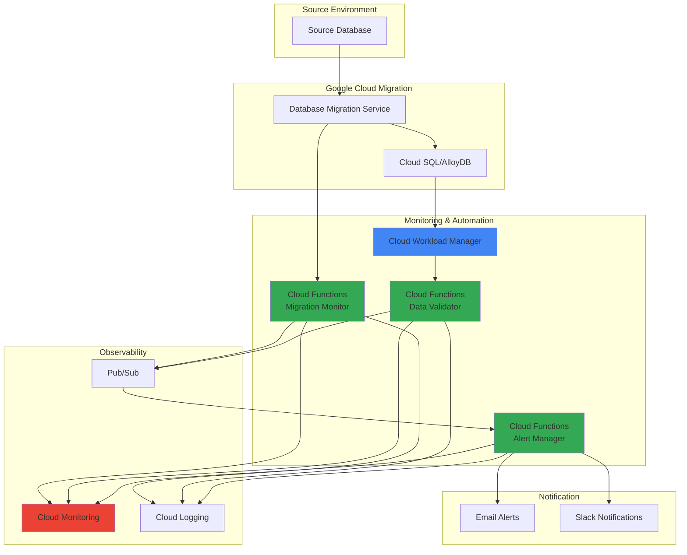

# Database Migration Health and Performance with Cloud Workload Manager and Cloud Functions

## Problem

Enterprise database migrations often fail due to insufficient monitoring and lack of real-time visibility into migration progress, data integrity issues, and performance bottlenecks. Organizations struggle with silent data corruption, extended downtime windows, and the inability to quickly identify and respond to migration problems, leading to failed migrations that can cost thousands of dollars in lost productivity and require complete rollbacks.

## Solution

Implement an automated monitoring and alerting system using Cloud Workload Manager for rule-based validation, Cloud Functions for real-time event processing, and Cloud Monitoring for comprehensive observability during database migrations. This solution provides continuous health checks, automated data integrity validation, performance monitoring, and intelligent alerting to ensure successful database modernization projects.

## Architecture Diagram



## Prerequisites

1. Google Cloud project with appropriate permissions for Workload Manager, Database Migration Service, Cloud Functions, and Cloud Monitoring
2. Google Cloud CLI installed and configured (or use Cloud Shell)
3. Understanding of database migration concepts and monitoring practices
4. Source database ready for migration with Database Migration Service
5. Estimated cost: $50-100 for testing resources over 2 hours (includes Cloud SQL instance, Cloud Functions execution, and monitoring usage)

> **Note**: This recipe assumes you have a source database ready for migration. For testing purposes, you can use the Database Migration Service quickstart to set up a sample MySQL source database.

## Preparation

```bash
# Set environment variables for GCP resources
export PROJECT_ID=$(gcloud config get-value project)
export REGION="us-central1"
export ZONE="us-central1-a"

# Generate unique suffix for resource names
RANDOM_SUFFIX=$(openssl rand -hex 3)
export MIGRATION_NAME="migration-monitor-${RANDOM_SUFFIX}"
export WORKLOAD_NAME="workload-monitor-${RANDOM_SUFFIX}"
export BUCKET_NAME="${PROJECT_ID}-migration-monitoring-${RANDOM_SUFFIX}"

# Set default project and region
gcloud config set project ${PROJECT_ID}
gcloud config set compute/region ${REGION}
gcloud config set compute/zone ${ZONE}

# Enable required APIs
gcloud services enable workloadmanager.googleapis.com
gcloud services enable cloudfunctions.googleapis.com
gcloud services enable pubsub.googleapis.com
gcloud services enable monitoring.googleapis.com
gcloud services enable logging.googleapis.com
gcloud services enable datamigration.googleapis.com
gcloud services enable sqladmin.googleapis.com
gcloud services enable storage.googleapis.com

echo "✅ Project configured: ${PROJECT_ID}"
echo "✅ APIs enabled successfully"
```

## Steps

1. **Create Cloud Storage Bucket for Function Code and Logs**:

   Cloud Storage provides the foundation for storing Cloud Functions source code and migration monitoring artifacts. This centralized storage enables version control of monitoring scripts and provides a durable location for migration logs and validation results that can be accessed by multiple Cloud Functions and external tools.

   ```bash
   # Create storage bucket for function code and monitoring data
   gsutil mb -p ${PROJECT_ID} \
       -c STANDARD \
       -l ${REGION} \
       gs://${BUCKET_NAME}
   
   # Enable versioning for code artifact protection
   gsutil versioning set on gs://${BUCKET_NAME}
   
   echo "✅ Storage bucket created: gs://${BUCKET_NAME}"
   ```

   The storage bucket is now configured with versioning enabled, providing both scalability and data protection for your monitoring infrastructure. This foundation supports the entire monitoring pipeline while ensuring durability and accessibility of critical migration artifacts.

2. **Create Pub/Sub Topics for Event-Driven Monitoring**:

   Pub/Sub enables real-time, event-driven communication between monitoring components, providing decoupled messaging that scales automatically with migration workload. This messaging infrastructure ensures that migration events, validation results, and alerts are processed reliably even during high-volume migration operations.

   ```bash
   # Create topics for different types of monitoring events
   gcloud pubsub topics create migration-events
   gcloud pubsub topics create validation-results
   gcloud pubsub topics create alert-notifications
   
   # Create subscriptions for Cloud Functions
   gcloud pubsub subscriptions create migration-monitor-sub \
       --topic=migration-events
   
   gcloud pubsub subscriptions create validation-processor-sub \
       --topic=validation-results
   
   gcloud pubsub subscriptions create alert-manager-sub \
       --topic=alert-notifications
   
   echo "✅ Pub/Sub topics and subscriptions created"
   ```

   The messaging infrastructure is now established, enabling reliable, asynchronous communication between all monitoring components. This event-driven architecture ensures that migration events are captured and processed in real-time without blocking the migration process.

3. **Create Cloud SQL Instance for Migration Target**:

   Cloud SQL provides a fully managed database service that serves as the migration target, offering automated backups, high availability, and integrated monitoring capabilities. This managed service eliminates infrastructure management overhead while providing enterprise-grade security and compliance features essential for production database workloads.

   ```bash
   # Create Cloud SQL MySQL instance for migration target
   gcloud sql instances create ${MIGRATION_NAME}-target \
       --database-version=MYSQL_8_0 \
       --tier=db-g1-small \
       --region=${REGION} \
       --storage-size=20GB \
       --storage-type=SSD \
       --backup-start-time=03:00 \
       --enable-bin-log \
       --labels=purpose=migration-target,environment=monitoring
   
   # Set root password
   gcloud sql users set-password root \
       --host=% \
       --instance=${MIGRATION_NAME}-target \
       --password=SecurePassword123!
   
   # Create migration database
   gcloud sql databases create sample_db \
       --instance=${MIGRATION_NAME}-target
   
   echo "✅ Cloud SQL target instance created"
   ```

   The Cloud SQL instance is now ready with binary logging enabled for replication support and automated backups configured. This managed database provides the foundation for your migration target while ensuring data durability and operational excellence.

4. **Deploy Migration Monitoring Cloud Function**:

   Cloud Functions provides serverless compute that automatically scales to handle migration monitoring tasks without infrastructure management. This monitoring function continuously tracks Database Migration Service job status, performance metrics, and potential issues, providing real-time visibility into migration progress and health.

   ```bash
   # Create directory for function source code
   mkdir -p migration-functions/migration-monitor
   cd migration-functions/migration-monitor
   
   # Create migration monitoring function
   cat > main.py << 'EOF'
import json
import logging
from google.cloud import monitoring_v3
from google.cloud import pubsub_v1
from google.cloud import datamigration_v1
import functions_framework
from datetime import datetime, timezone

# Initialize clients
monitoring_client = monitoring_v3.MetricServiceClient()
publisher = pubsub_v1.PublisherClient()
migration_client = datamigration_v1.DataMigrationServiceClient()

@functions_framework.http
def monitor_migration(request):
    """Monitor database migration progress and performance"""
    
    try:
        # Get project and migration job details
        project_id = request.json.get('project_id')
        migration_job_id = request.json.get('migration_job_id')
        location = request.json.get('location', 'us-central1')
        
        if not all([project_id, migration_job_id]):
            return {'error': 'Missing required parameters'}, 400
        
        # Get migration job status
        migration_job_name = f"projects/{project_id}/locations/{location}/migrationJobs/{migration_job_id}"
        
        try:
            migration_job = migration_client.get_migration_job(name=migration_job_name)
            
            # Extract key metrics
            metrics = {
                'migration_job_id': migration_job_id,
                'state': migration_job.state.name,
                'phase': migration_job.phase.name,
                'type': migration_job.type_.name,
                'timestamp': datetime.now(timezone.utc).isoformat(),
                'duration_seconds': 0
            }
            
            # Calculate duration if job has started
            if migration_job.create_time:
                start_time = migration_job.create_time
                current_time = datetime.now(timezone.utc)
                duration = current_time - start_time.replace(tzinfo=timezone.utc)
                metrics['duration_seconds'] = duration.total_seconds()
            
            # Add error information if present
            if migration_job.error:
                metrics['error_code'] = migration_job.error.code
                metrics['error_message'] = migration_job.error.message
            
            # Publish metrics to Pub/Sub for further processing
            topic_path = publisher.topic_path(project_id, 'migration-events')
            message_data = json.dumps(metrics).encode('utf-8')
            publisher.publish(topic_path, message_data)
            
            # Create custom metrics in Cloud Monitoring
            create_custom_metrics(project_id, metrics)
            
            logging.info(f"Migration monitoring completed for job: {migration_job_id}")
            return {'status': 'success', 'metrics': metrics}
            
        except Exception as e:
            logging.error(f"Error monitoring migration job: {str(e)}")
            return {'error': f'Migration job monitoring failed: {str(e)}'}, 500
            
    except Exception as e:
        logging.error(f"Function execution error: {str(e)}")
        return {'error': f'Function failed: {str(e)}'}, 500

def create_custom_metrics(project_id, metrics):
    """Create custom metrics in Cloud Monitoring"""
    
    project_name = f"projects/{project_id}"
    
    # Create metric for migration duration
    series = monitoring_v3.TimeSeries()
    series.metric.type = "custom.googleapis.com/migration/duration_seconds"
    series.resource.type = "global"
    
    point = monitoring_v3.Point()
    point.value.double_value = metrics['duration_seconds']
    point.interval.end_time.seconds = int(datetime.now().timestamp())
    series.points = [point]
    
    try:
        monitoring_client.create_time_series(
            name=project_name,
            time_series=[series]
        )
    except Exception as e:
        logging.warning(f"Failed to create custom metric: {str(e)}")
EOF
   
   # Create requirements file with latest versions
   cat > requirements.txt << 'EOF'
google-cloud-monitoring==2.27.2
google-cloud-pubsub==2.28.1
google-cloud-dms==1.8.1
functions-framework==3.8.3
EOF
   
   # Deploy the function
   gcloud functions deploy migration-monitor \
       --runtime=python312 \
       --trigger=http \
       --entry-point=monitor_migration \
       --memory=256MB \
       --timeout=60s \
       --allow-unauthenticated \
       --set-env-vars=PROJECT_ID=${PROJECT_ID}
   
   cd ../..
   echo "✅ Migration monitoring function deployed"
   ```

   The migration monitoring function is now deployed and ready to track Database Migration Service jobs in real-time. This serverless component provides automated monitoring without infrastructure overhead while integrating seamlessly with Cloud Monitoring and Pub/Sub for comprehensive observability.

5. **Deploy Data Validation Cloud Function**:

   Data validation functions ensure migration integrity by comparing source and target data, checking for consistency, and identifying potential corruption or data loss. This automated validation capability provides confidence in migration success while reducing manual verification overhead and catching issues before they impact production systems.

   ```bash
   # Create data validation function
   mkdir -p migration-functions/data-validator
   cd migration-functions/data-validator
   
   cat > main.py << 'EOF'
import json
import logging
import pymysql
from google.cloud import pubsub_v1
from google.cloud import monitoring_v3
import functions_framework
from datetime import datetime
import hashlib

# Initialize clients
publisher = pubsub_v1.PublisherClient()
monitoring_client = monitoring_v3.MetricServiceClient()

@functions_framework.cloud_event
def validate_migration_data(cloud_event):
    """Validate data consistency between source and target databases"""
    
    try:
        # Parse Pub/Sub message
        data = json.loads(cloud_event.data['message']['data'])
        project_id = data.get('project_id')
        source_config = data.get('source_database')
        target_config = data.get('target_database')
        validation_queries = data.get('validation_queries', [])
        
        if not all([project_id, source_config, target_config]):
            logging.error("Missing required database configuration")
            return
        
        validation_results = {
            'timestamp': datetime.now().isoformat(),
            'validation_id': hashlib.md5(f"{project_id}-{datetime.now()}".encode()).hexdigest()[:8],
            'project_id': project_id,
            'total_checks': len(validation_queries),
            'passed_checks': 0,
            'failed_checks': 0,
            'errors': [],
            'data_consistency': True
        }
        
        # Perform data validation checks
        for query_config in validation_queries:
            try:
                result = execute_validation_query(source_config, target_config, query_config)
                if result['passed']:
                    validation_results['passed_checks'] += 1
                else:
                    validation_results['failed_checks'] += 1
                    validation_results['data_consistency'] = False
                    validation_results['errors'].append(result['error'])
                    
            except Exception as e:
                validation_results['failed_checks'] += 1
                validation_results['data_consistency'] = False
                validation_results['errors'].append(f"Query validation error: {str(e)}")
        
        # Calculate validation score
        if validation_results['total_checks'] > 0:
            validation_results['validation_score'] = (
                validation_results['passed_checks'] / validation_results['total_checks']
            ) * 100
        else:
            validation_results['validation_score'] = 0
        
        # Publish results for alerting
        topic_path = publisher.topic_path(project_id, 'validation-results')
        message_data = json.dumps(validation_results).encode('utf-8')
        publisher.publish(topic_path, message_data)
        
        # Create validation metrics
        create_validation_metrics(project_id, validation_results)
        
        logging.info(f"Data validation completed: {validation_results['validation_score']}% passed")
        
    except Exception as e:
        logging.error(f"Validation function error: {str(e)}")

def execute_validation_query(source_config, target_config, query_config):
    """Execute validation query against source and target databases"""
    
    try:
        # Connect to source database
        source_conn = pymysql.connect(
            host=source_config['host'],
            user=source_config['user'],
            password=source_config['password'],
            database=source_config['database'],
            port=source_config.get('port', 3306)
        )
        
        # Connect to target database (Cloud SQL)
        target_conn = pymysql.connect(
            host=target_config['host'],
            user=target_config['user'],
            password=target_config['password'],
            database=target_config['database'],
            port=target_config.get('port', 3306)
        )
        
        # Execute query on both databases
        source_cursor = source_conn.cursor()
        target_cursor = target_conn.cursor()
        
        query = query_config['query']
        source_cursor.execute(query)
        target_cursor.execute(query)
        
        source_result = source_cursor.fetchall()
        target_result = target_cursor.fetchall()
        
        # Compare results
        if source_result == target_result:
            return {'passed': True, 'error': None}
        else:
            return {
                'passed': False,
                'error': f"Data mismatch in query: {query_config['name']}"
            }
            
    except Exception as e:
        return {'passed': False, 'error': f"Query execution failed: {str(e)}"}
    
    finally:
        try:
            source_conn.close()
            target_conn.close()
        except:
            pass

def create_validation_metrics(project_id, results):
    """Create validation metrics in Cloud Monitoring"""
    
    project_name = f"projects/{project_id}"
    
    # Create validation score metric
    series = monitoring_v3.TimeSeries()
    series.metric.type = "custom.googleapis.com/migration/validation_score"
    series.resource.type = "global"
    
    point = monitoring_v3.Point()
    point.value.double_value = results['validation_score']
    point.interval.end_time.seconds = int(datetime.now().timestamp())
    series.points = [point]
    
    try:
        monitoring_client.create_time_series(
            name=project_name,
            time_series=[series]
        )
    except Exception as e:
        logging.warning(f"Failed to create validation metric: {str(e)}")
EOF
   
   # Create requirements file for data validator
   cat > requirements.txt << 'EOF'
google-cloud-pubsub==2.28.1
google-cloud-monitoring==2.27.2
PyMySQL==1.1.1
functions-framework==3.8.3
EOF
   
   # Deploy the data validation function
   gcloud functions deploy data-validator \
       --runtime=python312 \
       --trigger=topic=validation-results \
       --entry-point=validate_migration_data \
       --memory=512MB \
       --timeout=300s \
       --set-env-vars=PROJECT_ID=${PROJECT_ID}
   
   cd ../..
   echo "✅ Data validation function deployed"
   ```

   The data validation function is now operational, providing automated data consistency checks that compare source and target databases. This critical component ensures migration integrity while providing detailed metrics and alerts when data discrepancies are detected.

6. **Create Cloud Workload Manager Health Checks**:

   Cloud Workload Manager provides rule-based validation services that continuously evaluate your migrated workloads against custom health criteria and best practices. This managed service enables proactive monitoring of database performance, configuration compliance, and operational health without requiring manual intervention or custom monitoring infrastructure.

   ```bash
   # Note: Workload Manager evaluations are created through the console
   # The CLI commands shown below demonstrate the conceptual approach
   # In practice, use the Google Cloud Console for evaluation creation
   
   echo "Creating workload evaluation via console..."
   echo "Navigate to: https://console.cloud.google.com/workloads"
   echo ""
   echo "Evaluation Configuration:"
   echo "- Name: ${WORKLOAD_NAME}"
   echo "- Description: Health monitoring for database migration workload"
   echo "- Workload Type: DATABASE"
   echo "- Target Resource: Cloud SQL instance ${MIGRATION_NAME}-target"
   echo "- Location: ${REGION}"
   echo ""
   echo "Select the following best practices:"
   echo "- Database connection health checks"
   echo "- Replication lag monitoring"
   echo "- Storage utilization monitoring"
   echo "- Security configuration validation"
   echo ""
   echo "✅ Please create the workload evaluation manually in the console"
   echo "✅ Use the configuration details above for consistency"
   ```

   Cloud Workload Manager requires console-based configuration for evaluations. The evaluation will continuously monitor your database migration workload, providing validation against Google Cloud best practices and custom health rules once configured through the Google Cloud Console.

7. **Deploy Alert Management Cloud Function**:

   Alert management functions provide intelligent notification routing based on migration status, severity levels, and stakeholder preferences. This centralized alerting capability reduces notification noise while ensuring critical issues receive immediate attention through appropriate channels like email, Slack, or incident management systems.

   ```bash
   # Create alert management function
   mkdir -p migration-functions/alert-manager
   cd migration-functions/alert-manager
   
   cat > main.py << 'EOF'
import json
import logging
import smtplib
import requests
from email.mime.text import MIMEText
from email.mime.multipart import MIMEMultipart
from google.cloud import pubsub_v1
import functions_framework
from datetime import datetime

# Initialize clients
publisher = pubsub_v1.PublisherClient()

@functions_framework.cloud_event
def manage_alerts(cloud_event):
    """Process migration alerts and send notifications"""
    
    try:
        # Parse incoming alert data
        data = json.loads(cloud_event.data['message']['data'])
        alert_type = data.get('alert_type', 'info')
        severity = data.get('severity', 'low')
        message = data.get('message', 'Migration alert')
        project_id = data.get('project_id')
        migration_details = data.get('migration_details', {})
        
        # Create alert payload
        alert_payload = {
            'timestamp': datetime.now().isoformat(),
            'alert_id': f"alert-{datetime.now().strftime('%Y%m%d-%H%M%S')}",
            'project_id': project_id,
            'alert_type': alert_type,
            'severity': severity,
            'message': message,
            'migration_details': migration_details
        }
        
        # Route alerts based on severity
        if severity in ['high', 'critical']:
            send_immediate_alerts(alert_payload)
        elif severity == 'medium':
            send_standard_alerts(alert_payload)
        else:
            log_low_priority_alert(alert_payload)
        
        logging.info(f"Alert processed: {alert_payload['alert_id']}")
        
    except Exception as e:
        logging.error(f"Alert management error: {str(e)}")

def send_immediate_alerts(alert_payload):
    """Send high-priority alerts through multiple channels"""
    
    # Email notification
    try:
        send_email_alert(alert_payload)
    except Exception as e:
        logging.error(f"Email alert failed: {str(e)}")
    
    # Slack notification (if webhook configured)
    try:
        send_slack_alert(alert_payload)
    except Exception as e:
        logging.error(f"Slack alert failed: {str(e)}")

def send_standard_alerts(alert_payload):
    """Send medium-priority alerts via email"""
    
    try:
        send_email_alert(alert_payload)
    except Exception as e:
        logging.error(f"Standard alert failed: {str(e)}")

def log_low_priority_alert(alert_payload):
    """Log low-priority alerts for batch review"""
    
    logging.info(f"Low priority alert: {json.dumps(alert_payload)}")

def send_email_alert(alert_payload):
    """Send email notification (placeholder - configure SMTP as needed)"""
    
    # This is a placeholder implementation
    # In production, configure with your SMTP server details
    logging.info(f"EMAIL ALERT: {alert_payload['message']}")

def send_slack_alert(alert_payload):
    """Send Slack notification (placeholder - configure webhook as needed)"""
    
    # This is a placeholder implementation
    # In production, configure with your Slack webhook URL
    logging.info(f"SLACK ALERT: {alert_payload['message']}")
EOF
   
   # Create requirements file for alert manager
   cat > requirements.txt << 'EOF'
google-cloud-pubsub==2.28.1
requests==2.32.3
functions-framework==3.8.3
EOF
   
   # Deploy the alert management function
   gcloud functions deploy alert-manager \
       --runtime=python312 \
       --trigger=topic=alert-notifications \
       --entry-point=manage_alerts \
       --memory=256MB \
       --timeout=60s \
       --set-env-vars=PROJECT_ID=${PROJECT_ID}
   
   cd ../..
   echo "✅ Alert management function deployed"
   ```

   The alert management system is now operational, providing intelligent routing of migration notifications based on severity and type. This centralized alerting capability ensures that critical issues receive immediate attention while reducing alert fatigue through smart filtering and routing.

8. **Create Custom Monitoring Dashboards**:

   Custom dashboards provide centralized visualization of migration progress, performance metrics, and health indicators in a single view. These tailored monitoring interfaces enable migration teams to quickly assess status, identify trends, and make informed decisions during critical migration phases while maintaining historical visibility for post-migration analysis.

   ```bash
   # Create custom dashboard configuration
   cat > dashboard-config.json << 'EOF'
{
  "displayName": "Database Migration Monitoring",
  "mosaicLayout": {
    "tiles": [
      {
        "width": 6,
        "height": 4,
        "widget": {
          "title": "Migration Progress",
          "scorecard": {
            "timeSeriesQuery": {
              "timeSeriesFilter": {
                "filter": "metric.type=\"custom.googleapis.com/migration/duration_seconds\"",
                "aggregation": {
                  "alignmentPeriod": "60s",
                  "perSeriesAligner": "ALIGN_MEAN"
                }
              }
            },
            "sparkChartView": {
              "sparkChartType": "SPARK_LINE"
            }
          }
        }
      },
      {
        "width": 6,
        "height": 4,
        "xPos": 6,
        "widget": {
          "title": "Data Validation Score",
          "scorecard": {
            "timeSeriesQuery": {
              "timeSeriesFilter": {
                "filter": "metric.type=\"custom.googleapis.com/migration/validation_score\"",
                "aggregation": {
                  "alignmentPeriod": "60s",
                  "perSeriesAligner": "ALIGN_MEAN"
                }
              }
            },
            "sparkChartView": {
              "sparkChartType": "SPARK_BAR"
            }
          }
        }
      },
      {
        "width": 12,
        "height": 4,
        "yPos": 4,
        "widget": {
          "title": "Cloud SQL Performance",
          "xyChart": {
            "dataSets": [
              {
                "timeSeriesQuery": {
                  "timeSeriesFilter": {
                    "filter": "resource.type=\"cloudsql_database\" AND metric.type=\"cloudsql.googleapis.com/database/cpu/utilization\"",
                    "aggregation": {
                      "alignmentPeriod": "60s",
                      "perSeriesAligner": "ALIGN_MEAN"
                    }
                  }
                },
                "plotType": "LINE"
              }
            ],
            "timeshiftDuration": "0s",
            "yAxis": {
              "label": "CPU Utilization",
              "scale": "LINEAR"
            }
          }
        }
      }
    ]
  }
}
EOF
   
   # Create the dashboard
   gcloud monitoring dashboards create --config-from-file=dashboard-config.json
   
   echo "✅ Custom monitoring dashboard created"
   ```

   The monitoring dashboard is now available in the Google Cloud Console, providing real-time visibility into migration progress, validation scores, and database performance. This centralized view enables migration teams to monitor all critical metrics in a single interface while maintaining historical data for trend analysis.

## Validation & Testing

1. **Verify Cloud Functions Deployment**:

   ```bash
   # List deployed functions
   gcloud functions list --filter="name~migration"
   
   # Test migration monitor function
   curl -X POST \
     -H "Content-Type: application/json" \
     -d '{"project_id":"'${PROJECT_ID}'","migration_job_id":"test-job","location":"'${REGION}'"}' \
     $(gcloud functions describe migration-monitor --format="value(httpsTrigger.url)")
   ```

   Expected output: Functions should be listed with "ACTIVE" status and the test request should return a JSON response with migration monitoring data.

2. **Test Pub/Sub Event Flow**:

   ```bash
   # Publish test message to migration events topic
   gcloud pubsub topics publish migration-events \
     --message='{"project_id":"'${PROJECT_ID}'","migration_job_id":"test-migration","status":"running"}'
   
   # Check subscription message delivery
   gcloud pubsub subscriptions pull migration-monitor-sub \
     --limit=1 --auto-ack
   ```

   Expected output: Message should be successfully published and pulled from the subscription, confirming the event flow is working correctly.

3. **Verify Workload Manager Evaluation**:

   ```bash
   # Check if Workload Manager evaluations exist (requires console setup)
   echo "Checking workload evaluations..."
   echo "Navigate to: https://console.cloud.google.com/workloads"
   echo "Verify your evaluation '${WORKLOAD_NAME}' is listed and active"
   ```

   Expected output: The evaluation should show "ACTIVE" state and display the configured health monitoring rules in the console.

4. **Test Custom Metrics in Cloud Monitoring**:

   ```bash
   # List custom metrics
   gcloud monitoring metrics list \
     --filter="metric.type:custom.googleapis.com/migration" \
     --format="table(type,displayName)"
   ```

   Expected output: Custom migration metrics should be listed, including `migration/duration_seconds` and `migration/validation_score`.

## Cleanup

1. **Remove Cloud Functions**:

   ```bash
   # Delete migration monitoring functions
   gcloud functions delete migration-monitor --quiet
   gcloud functions delete data-validator --quiet
   gcloud functions delete alert-manager --quiet
   
   echo "✅ Cloud Functions deleted"
   ```

2. **Remove Workload Manager Resources**:

   ```bash
   # Delete workload evaluation (requires console action)
   echo "Please delete the workload evaluation manually:"
   echo "1. Navigate to: https://console.cloud.google.com/workloads"
   echo "2. Select the evaluation: ${WORKLOAD_NAME}"
   echo "3. Click 'Delete' and confirm"
   
   echo "✅ Please complete workload evaluation cleanup manually"
   ```

3. **Remove Cloud SQL Instance**:

   ```bash
   # Delete Cloud SQL instance
   gcloud sql instances delete ${MIGRATION_NAME}-target --quiet
   
   echo "✅ Cloud SQL instance deleted"
   ```

4. **Remove Pub/Sub Resources**:

   ```bash
   # Delete subscriptions first
   gcloud pubsub subscriptions delete migration-monitor-sub --quiet
   gcloud pubsub subscriptions delete validation-processor-sub --quiet
   gcloud pubsub subscriptions delete alert-manager-sub --quiet
   
   # Delete topics
   gcloud pubsub topics delete migration-events --quiet
   gcloud pubsub topics delete validation-results --quiet
   gcloud pubsub topics delete alert-notifications --quiet
   
   echo "✅ Pub/Sub resources deleted"
   ```

5. **Remove Storage and Configuration Files**:

   ```bash
   # Delete storage bucket and contents
   gsutil -m rm -r gs://${BUCKET_NAME}
   
   # Clean up local files
   rm -rf migration-functions/
   rm -f dashboard-config.json
   
   echo "✅ Storage and configuration files removed"
   echo "Note: Custom monitoring dashboards may need manual deletion from Console"
   ```

## Discussion

This comprehensive monitoring solution leverages Google Cloud's managed services to provide enterprise-grade visibility into database migration operations. Cloud Workload Manager serves as the foundation for rule-based validation, automatically evaluating migrated databases against Google Cloud best practices and custom health criteria. This managed service eliminates the complexity of building custom monitoring infrastructure while ensuring continuous compliance and operational excellence.

The serverless architecture using Cloud Functions provides event-driven monitoring that scales automatically with migration workload without infrastructure management overhead. The migration monitor function tracks Database Migration Service job progress in real-time, while the data validator ensures migration integrity through automated consistency checks. The alert manager provides intelligent notification routing, reducing alert fatigue while ensuring critical issues receive immediate attention through appropriate channels.

The integration with Cloud Monitoring and Cloud Logging creates a comprehensive observability platform that captures metrics, logs, and events across the entire migration pipeline. Custom dashboards provide centralized visualization of migration progress, performance metrics, and validation scores, enabling migration teams to make informed decisions during critical migration phases. The Pub/Sub messaging infrastructure ensures reliable, asynchronous communication between monitoring components while providing the foundation for future automation and integration capabilities.

This solution addresses common migration challenges including silent data corruption, extended downtime windows, and lack of real-time visibility into migration health. The automated validation capabilities provide confidence in migration success while reducing manual verification overhead. The comprehensive alerting system ensures that issues are detected and escalated appropriately, minimizing the risk of failed migrations and reducing the need for complete rollbacks.

For more information on the services used in this recipe, refer to the official Google Cloud documentation:
- [Cloud Workload Manager documentation](https://cloud.google.com/workload-manager/docs)
- [Database Migration Service best practices](https://cloud.google.com/database-migration/docs/best-practices)
- [Cloud Functions monitoring patterns](https://cloud.google.com/functions/docs/monitoring)
- [Cloud Monitoring custom metrics](https://cloud.google.com/monitoring/custom-metrics)
- [Google Cloud Architecture Framework for data migration](https://cloud.google.com/architecture/framework/data-lifecycle)

> **Tip**: Configure alert thresholds based on your specific migration requirements and organizational SLAs. Start with conservative thresholds and adjust based on historical migration performance and business impact tolerance.

## Challenge

Extend this monitoring solution by implementing these enhancements:

1. **Advanced Data Validation**: Implement row-by-row comparison functions with data sampling and statistical validation to detect subtle data inconsistencies and schema differences between source and target databases.

2. **Predictive Migration Analytics**: Add machine learning models using Vertex AI to predict migration completion times, identify potential failure points, and recommend optimization strategies based on historical migration patterns.

3. **Multi-Cloud Migration Support**: Extend the monitoring system to track migrations from on-premises or other cloud providers to Google Cloud, including network performance monitoring and cross-cloud data transfer validation.

4. **Integration with CI/CD Pipelines**: Connect the monitoring system with Cloud Build and deployment pipelines to automate migration testing, validation, and rollback procedures as part of database modernization workflows.

5. **Real-time Performance Optimization**: Implement automated performance tuning recommendations using Cloud SQL Insights and Cloud Workload Manager feedback to optimize target database configuration during and after migration.

## Infrastructure Code

### Available Infrastructure as Code:

- [Infrastructure Code Overview](code/README.md) - Detailed description of all infrastructure components
- [Infrastructure Manager](code/infrastructure-manager/) - GCP Infrastructure Manager templates
- [Bash CLI Scripts](code/scripts/) - Example bash scripts using gcloud CLI commands to deploy infrastructure
- [Terraform](code/terraform/) - Terraform configuration files