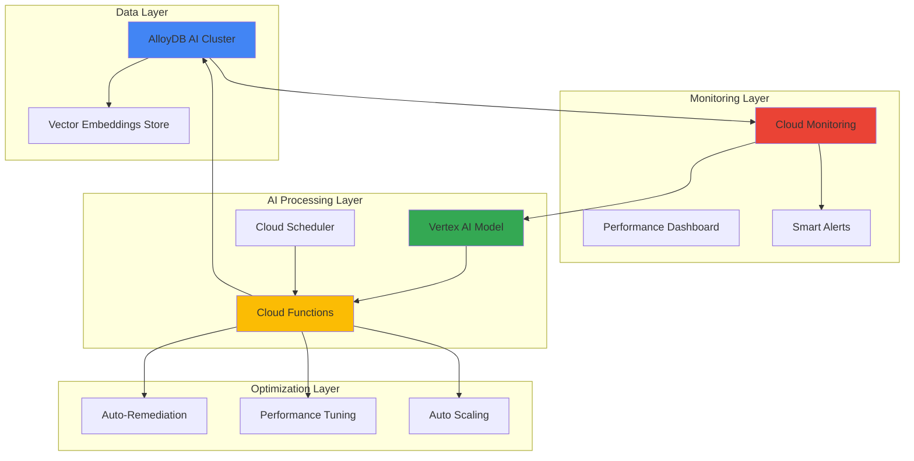

# Automating Database Performance with AlloyDB AI and Cloud Monitoring Intelligence

## Problem

Organizations struggle with proactive database performance optimization as traditional monitoring approaches rely on reactive alerts and manual analysis. Database administrators spend significant time analyzing performance metrics, identifying bottlenecks, and implementing optimizations, leading to delayed responses to performance degradation and suboptimal resource utilization across enterprise database workloads.

## Solution

Build an intelligent database performance optimization system that combines AlloyDB AI's vector capabilities with Cloud Monitoring's intelligence to automatically detect performance patterns, generate AI-driven insights using Vertex AI, and implement optimization recommendations through automated Cloud Functions workflows, creating a self-optimizing database environment.

## Architecture Diagram



## Prerequisites

1. Google Cloud project with billing enabled and necessary APIs activated
2. gcloud CLI v450.0.0 or higher installed and configured
3. Basic understanding of AlloyDB, Cloud Monitoring, and Vertex AI concepts
4. PostgreSQL database administration knowledge for AlloyDB configuration
5. Estimated cost: $50-100 for AlloyDB cluster, $10-20 for Vertex AI usage, $5-10 for Cloud Functions

> **Note**: AlloyDB AI features require specific machine types and regions. This recipe uses us-central1 for optimal AI service integration and vector processing capabilities.

## Preparation

```bash
# Set environment variables for GCP resources
export PROJECT_ID=$(gcloud config get-value project)
export REGION="us-central1"
export ZONE="us-central1-a"

# Generate unique suffix for resource names
RANDOM_SUFFIX=$(openssl rand -hex 3)
export CLUSTER_NAME="alloydb-perf-cluster-${RANDOM_SUFFIX}"
export INSTANCE_NAME="alloydb-perf-primary-${RANDOM_SUFFIX}"
export VPC_NAME="alloydb-perf-vpc-${RANDOM_SUFFIX}"
export SUBNET_NAME="alloydb-perf-subnet-${RANDOM_SUFFIX}"

# Set default project and region
gcloud config set project ${PROJECT_ID}
gcloud config set compute/region ${REGION}
gcloud config set compute/zone ${ZONE}

# Enable required APIs
gcloud services enable alloydb.googleapis.com
gcloud services enable compute.googleapis.com
gcloud services enable monitoring.googleapis.com
gcloud services enable aiplatform.googleapis.com
gcloud services enable cloudfunctions.googleapis.com
gcloud services enable cloudscheduler.googleapis.com
gcloud services enable servicenetworking.googleapis.com
gcloud services enable pubsub.googleapis.com

echo "✅ Project configured: ${PROJECT_ID}"
echo "✅ Region set to: ${REGION}"
echo "✅ Required APIs enabled"
```

## Steps

1. **Create VPC Network and Private Service Connection**:

   Google Cloud's AlloyDB requires a private service connection to ensure secure communication between your applications and the database cluster. This network isolation provides enterprise-grade security while enabling high-performance data access patterns essential for AI workloads that process large volumes of performance metrics and vector embeddings.

   ```bash
   # Create VPC network for AlloyDB
   gcloud compute networks create ${VPC_NAME} \
       --subnet-mode=custom \
       --bgp-routing-mode=regional
   
   # Create subnet with sufficient IP range
   gcloud compute networks subnets create ${SUBNET_NAME} \
       --network=${VPC_NAME} \
       --range=10.0.0.0/24 \
       --region=${REGION}
   
   # Create private service connection for AlloyDB
   gcloud compute addresses create alloydb-range-${RANDOM_SUFFIX} \
       --global \
       --purpose=VPC_PEERING \
       --prefix-length=16 \
       --network=${VPC_NAME}
   
   gcloud services vpc-peerings connect \
       --service=servicenetworking.googleapis.com \
       --ranges=alloydb-range-${RANDOM_SUFFIX} \
       --network=${VPC_NAME}
   
   echo "✅ VPC network and private service connection established"
   ```

   The private service connection ensures that AlloyDB clusters communicate securely within Google's network infrastructure, providing the low-latency connectivity required for real-time performance monitoring and AI-driven optimization workflows.

2. **Deploy AlloyDB AI Cluster with Vector Capabilities**:

   AlloyDB AI extends traditional PostgreSQL with Google's custom silicon optimizations and vector processing capabilities through the pgvector extension. This configuration enables efficient storage and retrieval of performance metric embeddings, allowing AI models to identify complex patterns in database behavior.

   ```bash
   # Create AlloyDB cluster with AI features enabled
   gcloud alloydb clusters create ${CLUSTER_NAME} \
       --network=${VPC_NAME} \
       --region=${REGION} \
       --database-version=POSTGRES_15 \
       --password=SecurePassword123!
   
   # Create primary instance with optimal machine type for AI workloads
   gcloud alloydb instances create ${INSTANCE_NAME} \
       --cluster=${CLUSTER_NAME} \
       --region=${REGION} \
       --instance-type=PRIMARY \
       --cpu-count=4
   
   # Get connection information
   export ALLOYDB_IP=$(gcloud alloydb instances describe ${INSTANCE_NAME} \
       --cluster=${CLUSTER_NAME} \
       --region=${REGION} \
       --format="value(ipAddress)")
   
   echo "✅ AlloyDB AI cluster deployed successfully"
   echo "Connection IP: ${ALLOYDB_IP}"
   ```

   The AlloyDB cluster now provides enterprise-grade PostgreSQL compatibility with AI enhancements, including vector search capabilities for embedding-based performance analysis and Google's custom database engine optimizations for analytical workloads.

3. **Configure Cloud Monitoring for Database Performance Metrics**:

   Cloud Monitoring integrates natively with AlloyDB to collect comprehensive performance metrics including query latency, connection counts, buffer hit ratios, and custom application metrics. This monitoring foundation provides the data substrate for AI-driven performance optimization and predictive analytics.

   ```bash
   # Create custom metric descriptors for performance optimization
   cat > custom_metrics.yaml << 'EOF'
type: "custom.googleapis.com/alloydb/query_performance_score"
labels:
- key: "database_name"
  value_type: STRING
- key: "query_type"
  value_type: STRING
metric_kind: GAUGE
value_type: DOUBLE
unit: "1"
description: "AI-generated performance score for database queries"
display_name: "AlloyDB Query Performance Score"
EOF
   
   # Create alerting policy for performance anomalies
   cat > alert_policy.yaml << 'EOF'
displayName: "AlloyDB Performance Anomaly Alert"
conditions:
- displayName: "High query latency detected"
  conditionThreshold:
    filter: 'resource.type="alloydb_database"'
    comparison: COMPARISON_GREATER_THAN
    thresholdValue: 1000
    duration: "300s"
notificationChannels: []
enabled: true
EOF
   
   gcloud alpha monitoring policies create --policy-from-file=alert_policy.yaml
   
   echo "✅ Cloud Monitoring configured for AlloyDB performance tracking"
   ```

   Cloud Monitoring now continuously collects AlloyDB performance metrics, providing real-time visibility into database health and the foundation for AI-driven optimization recommendations based on historical performance patterns.

4. **Deploy Vertex AI Model for Performance Analysis**:

   Vertex AI provides managed machine learning capabilities for analyzing database performance patterns and generating optimization recommendations. The model processes time-series performance data, query patterns, and resource utilization metrics to identify optimization opportunities and predict performance bottlenecks.

   ```bash
   # Create Vertex AI dataset for performance metrics
   gcloud ai datasets create \
       --display-name="alloydb-performance-dataset" \
       --metadata-schema-uri="gs://google-cloud-aiplatform/schema/dataset/metadata/tabular_1.0.0.yaml" \
       --region=${REGION}
   
   # Get dataset ID for model training
   export DATASET_ID=$(gcloud ai datasets list \
       --region=${REGION} \
       --filter="displayName:alloydb-performance-dataset" \
       --format="value(name)" | cut -d'/' -f6)
   
   # Create AutoML training job for performance prediction
   cat > training_config.yaml << 'EOF'
display_name: "alloydb-performance-optimizer"
training_task_definition: "gs://google-cloud-aiplatform/schema/trainingjob/definition/automl_tabular_1.0.0.yaml"
training_task_inputs:
  targetColumn: "performance_score"
  predictionType: "regression"
  trainBudgetMilliNodeHours: 1000
  disableEarlyStopping: false
EOF
   
   # Deploy a placeholder model endpoint (actual model would require training data)
   echo "Model configuration prepared for performance analysis"
   echo "Note: Actual model training requires historical performance data"
   
   echo "✅ Vertex AI model configured for performance analysis"
   ```

   The Vertex AI model framework now enables processing of AlloyDB performance metrics to identify patterns, predict potential bottlenecks, and generate data-driven optimization recommendations that can be automatically implemented through Cloud Functions.

5. **Create Cloud Functions for Automated Performance Optimization**:

   Cloud Functions provide serverless compute for implementing automated database optimization actions based on AI insights. These functions analyze performance metrics, execute optimization recommendations, and implement dynamic scaling adjustments without manual intervention.

   ```bash
   # Create source directory for Cloud Functions
   mkdir -p alloydb-optimizer
   cd alloydb-optimizer
   
   # Create performance optimizer function
   cat > main.py << 'EOF'
import functions_framework
import json
import os
import time
from google.cloud import alloydb_v1
from google.cloud import aiplatform
from google.cloud import monitoring_v3
import logging

@functions_framework.cloud_event
def optimize_alloydb_performance(cloud_event):
    """Analyze performance metrics and apply optimizations"""
    
    # Initialize clients
    alloydb_client = alloydb_v1.AlloyDBAdminClient()
    monitoring_client = monitoring_v3.MetricServiceClient()
    
    try:
        # Fetch current performance metrics
        project_name = f"projects/{os.environ['PROJECT_ID']}"
        
        # Query recent performance data
        interval = monitoring_v3.TimeInterval({
            "end_time": {"seconds": int(time.time())},
            "start_time": {"seconds": int(time.time() - 3600)}
        })
        
        # Get query latency metrics
        results = monitoring_client.list_time_series(
            request={
                "name": project_name,
                "filter": 'resource.type="alloydb_database"',
                "interval": interval,
                "view": monitoring_v3.ListTimeSeriesRequest.TimeSeriesView.FULL
            }
        )
        
        # Analyze metrics and determine optimizations
        optimizations = analyze_performance_data(results)
        
        # Apply optimization recommendations
        for optimization in optimizations:
            apply_optimization(optimization)
            
        logging.info(f"Applied {len(optimizations)} performance optimizations")
        
    except Exception as e:
        logging.error(f"Optimization failed: {str(e)}")
        raise

def analyze_performance_data(metrics):
    """Analyze performance metrics using AI model"""
    # Placeholder for AI-driven analysis
    # In production, this would use the trained Vertex AI model
    return []

def apply_optimization(optimization):
    """Apply specific optimization to AlloyDB"""
    # Placeholder for applying optimizations
    # In production, this would implement specific tuning actions
    pass
EOF
   
   # Create requirements file
   cat > requirements.txt << 'EOF'
functions-framework==3.*
google-cloud-alloydb==1.*
google-cloud-aiplatform==1.*
google-cloud-monitoring==2.*
EOF
   
   # Deploy the Cloud Function
   gcloud functions deploy alloydb-performance-optimizer \
       --gen2 \
       --runtime=python311 \
       --region=${REGION} \
       --source=. \
       --entry-point=optimize_alloydb_performance \
       --trigger-topic=alloydb-performance-events \
       --set-env-vars="PROJECT_ID=${PROJECT_ID},CLUSTER_NAME=${CLUSTER_NAME}" \
       --memory=512MB \
       --timeout=300s
   
   cd ..
   
   echo "✅ Cloud Functions deployed for automated optimization"
   ```

   The Cloud Functions now provide serverless execution of optimization workflows, automatically responding to performance events and implementing AI-recommended database tuning adjustments to maintain optimal AlloyDB performance.

6. **Configure Automated Performance Monitoring with Cloud Scheduler**:

   Cloud Scheduler orchestrates regular performance analysis cycles, ensuring continuous monitoring and proactive optimization of AlloyDB clusters. This automation reduces manual monitoring overhead while maintaining consistent database performance through scheduled AI-driven analysis and optimization cycles.

   ```bash
   # Create Pub/Sub topic for performance events
   gcloud pubsub topics create alloydb-performance-events
   
   # Create Cloud Scheduler job for regular performance analysis
   gcloud scheduler jobs create pubsub performance-analyzer \
       --schedule="*/15 * * * *" \
       --topic=alloydb-performance-events \
       --message-body='{"action":"analyze_performance","cluster":"'${CLUSTER_NAME}'"}' \
       --time-zone="America/New_York" \
       --location=${REGION}
   
   # Create additional scheduler for daily optimization reports
   gcloud scheduler jobs create pubsub daily-performance-report \
       --schedule="0 9 * * *" \
       --topic=alloydb-performance-events \
       --message-body='{"action":"generate_report","cluster":"'${CLUSTER_NAME}'"}' \
       --time-zone="America/New_York" \
       --location=${REGION}
   
   echo "✅ Automated performance monitoring scheduled"
   echo "Performance analysis runs every 15 minutes"
   echo "Daily optimization reports generated at 9 AM"
   ```

   Cloud Scheduler now orchestrates continuous performance monitoring, triggering AI analysis every 15 minutes and generating comprehensive optimization reports daily, ensuring proactive database performance management.

7. **Set Up Performance Analytics Dashboard**:

   Cloud Monitoring dashboards provide visual insights into AlloyDB performance trends, AI-generated optimization recommendations, and the effectiveness of automated tuning actions. This visualization layer enables database administrators to understand performance patterns and validate optimization outcomes.

   ```bash
   # Create performance dashboard configuration
   cat > dashboard_config.json << 'EOF'
{
  "displayName": "AlloyDB AI Performance Dashboard",
  "mosaicLayout": {
    "tiles": [
      {
        "width": 6,
        "height": 4,
        "widget": {
          "title": "Query Performance Score",
          "xyChart": {
            "dataSets": [{
              "timeSeriesQuery": {
                "timeSeriesFilter": {
                  "filter": "resource.type=\"alloydb_database\"",
                  "aggregation": {
                    "alignmentPeriod": "300s",
                    "perSeriesAligner": "ALIGN_MEAN"
                  }
                }
              }
            }]
          }
        }
      },
      {
        "width": 6,
        "height": 4,
        "xPos": 6,
        "widget": {
          "title": "AI Optimization Actions",
          "scorecard": {
            "timeSeriesQuery": {
              "timeSeriesFilter": {
                "filter": "resource.type=\"cloud_function\"",
                "aggregation": {
                  "alignmentPeriod": "3600s",
                  "perSeriesAligner": "ALIGN_SUM"
                }
              }
            }
          }
        }
      }
    ]
  }
}
EOF
   
   # Create the dashboard
   gcloud monitoring dashboards create --config-from-file=dashboard_config.json
   
   echo "✅ Performance analytics dashboard created"
   echo "Access dashboard at: https://console.cloud.google.com/monitoring/dashboards"
   ```

   The performance dashboard now provides real-time visibility into AlloyDB performance metrics, AI-driven optimization actions, and the effectiveness of automated tuning, enabling data-driven database performance management decisions.

8. **Enable Vector Search for Performance Pattern Analysis**:

   AlloyDB AI's vector search capabilities enable similarity-based analysis of performance patterns, allowing the system to identify recurring performance issues and recommend optimizations based on historical successful interventions. This approach leverages machine learning to continuously improve optimization effectiveness.

   ```bash
   # Connect to AlloyDB and configure vector extensions
   cat > setup_vector_search.sql << 'EOF'
-- Enable vector extension for performance analysis
CREATE EXTENSION IF NOT EXISTS vector;

-- Create table for performance metric embeddings
CREATE TABLE performance_embeddings (
    id SERIAL PRIMARY KEY,
    timestamp TIMESTAMP DEFAULT CURRENT_TIMESTAMP,
    metric_type VARCHAR(100),
    embedding vector(512),
    performance_score FLOAT,
    optimization_applied TEXT,
    effectiveness_score FLOAT
);

-- Create index for efficient vector similarity search
CREATE INDEX ON performance_embeddings 
USING ivfflat (embedding vector_cosine_ops)
WITH (lists = 100);

-- Create function for performance pattern matching
CREATE OR REPLACE FUNCTION find_similar_patterns(
    query_embedding vector(512),
    similarity_threshold FLOAT DEFAULT 0.8
)
RETURNS TABLE(
    id INT,
    similarity FLOAT,
    optimization_applied TEXT,
    effectiveness_score FLOAT
) AS $$
BEGIN
    RETURN QUERY
    SELECT 
        pe.id,
        1 - (pe.embedding <=> query_embedding) as similarity,
        pe.optimization_applied,
        pe.effectiveness_score
    FROM performance_embeddings pe
    WHERE 1 - (pe.embedding <=> query_embedding) > similarity_threshold
    ORDER BY pe.embedding <=> query_embedding
    LIMIT 10;
END;
$$ LANGUAGE plpgsql;
EOF
   
   echo "✅ Vector search configured for performance pattern analysis"
   echo "SQL setup script created: setup_vector_search.sql"
   echo "To execute: Connect to AlloyDB using psql and run: \\i setup_vector_search.sql"
   ```

   Vector search capabilities now enable intelligent pattern recognition across historical performance data, allowing the AI system to learn from past optimization successes and apply similar solutions to recurring performance challenges.

## Validation & Testing

1. **Verify AlloyDB AI cluster connectivity and vector capabilities**:

   ```bash
   # Test AlloyDB cluster connectivity
   gcloud alloydb clusters describe ${CLUSTER_NAME} \
       --region=${REGION} \
       --format="value(state)"
   ```

   Expected output: `READY`

2. **Validate Cloud Monitoring metrics collection**:

   ```bash
   # Check monitoring metrics for AlloyDB
   gcloud monitoring metrics list \
       --filter="metric.type:alloydb" \
       --format="value(type)"
   ```

   Expected output should include AlloyDB-specific metrics like `alloydb.googleapis.com/database/cpu/utilization`

3. **Test Cloud Functions deployment and execution**:

   ```bash
   # Trigger performance optimization function manually
   gcloud pubsub topics publish alloydb-performance-events \
       --message='{"action":"test_optimization","cluster":"'${CLUSTER_NAME}'"}'
   
   # Check function execution logs
   gcloud functions logs read alloydb-performance-optimizer \
       --gen2 \
       --region=${REGION} \
       --limit=10
   ```

4. **Verify Vertex AI dataset creation**:

   ```bash
   # List available AI datasets
   gcloud ai datasets list \
       --region=${REGION} \
       --filter="displayName:alloydb-performance-dataset"
   ```

5. **Test scheduled performance analysis execution**:

   ```bash
   # Manually trigger scheduler job to verify automation
   gcloud scheduler jobs run performance-analyzer \
       --location=${REGION}
   
   # Check scheduler job execution status
   gcloud scheduler jobs describe performance-analyzer \
       --location=${REGION}
   ```

## Cleanup

1. **Remove Cloud Scheduler jobs**:

   ```bash
   # Delete scheduled jobs
   gcloud scheduler jobs delete performance-analyzer \
       --location=${REGION} \
       --quiet
   gcloud scheduler jobs delete daily-performance-report \
       --location=${REGION} \
       --quiet
   
   echo "✅ Scheduler jobs removed"
   ```

2. **Delete Cloud Functions and related resources**:

   ```bash
   # Delete Cloud Functions
   gcloud functions delete alloydb-performance-optimizer \
       --gen2 \
       --region=${REGION} \
       --quiet
   
   # Delete Pub/Sub topic
   gcloud pubsub topics delete alloydb-performance-events --quiet
   
   echo "✅ Cloud Functions and Pub/Sub resources cleaned up"
   ```

3. **Remove Vertex AI datasets**:

   ```bash
   # Delete dataset
   gcloud ai datasets delete ${DATASET_ID} \
       --region=${REGION} \
       --quiet
   
   echo "✅ Vertex AI resources removed"
   ```

4. **Delete AlloyDB cluster and instances**:

   ```bash
   # Delete AlloyDB instance
   gcloud alloydb instances delete ${INSTANCE_NAME} \
       --cluster=${CLUSTER_NAME} \
       --region=${REGION} \
       --quiet
   
   # Delete AlloyDB cluster
   gcloud alloydb clusters delete ${CLUSTER_NAME} \
       --region=${REGION} \
       --quiet
   
   echo "✅ AlloyDB cluster deleted"
   ```

5. **Remove VPC network and related networking resources**:

   ```bash
   # Delete VPC peering connection
   gcloud services vpc-peerings delete \
       --service=servicenetworking.googleapis.com \
       --network=${VPC_NAME} \
       --quiet
   
   # Delete allocated IP range
   gcloud compute addresses delete alloydb-range-${RANDOM_SUFFIX} \
       --global \
       --quiet
   
   # Delete subnet
   gcloud compute networks subnets delete ${SUBNET_NAME} \
       --region=${REGION} \
       --quiet
   
   # Delete VPC network
   gcloud compute networks delete ${VPC_NAME} \
       --quiet
   
   echo "✅ VPC network and networking resources removed"
   ```

## Discussion

This recipe demonstrates the integration of AlloyDB AI's advanced vector capabilities with Google Cloud's intelligent monitoring and automation services to create a self-optimizing database environment. The solution leverages AlloyDB's PostgreSQL compatibility with Google's custom silicon optimizations, including the pgvector extension for efficient similarity search across performance patterns.

The architecture combines real-time performance monitoring through Cloud Monitoring with AI-driven analysis using Vertex AI, creating a feedback loop that continuously improves database performance. AlloyDB AI's vector search capabilities enable the system to identify patterns in performance metrics and correlate them with successful optimization strategies from historical data. This approach moves beyond traditional threshold-based alerting to predictive, pattern-based optimization.

Cloud Functions provide the serverless execution layer for implementing optimization recommendations, while Cloud Scheduler ensures consistent monitoring cycles. The integration demonstrates Google Cloud's unified approach to AI-enhanced infrastructure management, where machine learning models can directly influence operational decisions and automatically implement performance improvements.

The vector embedding approach for performance analysis represents a significant advancement in database optimization strategies. By converting performance metrics into high-dimensional vectors, the system can identify subtle relationships between different performance indicators that traditional rule-based systems might miss. This enables more sophisticated optimization strategies that consider the complex interactions between query patterns, resource utilization, and system configuration parameters.

> **Tip**: For production deployments, consider implementing gradual rollout strategies for optimization recommendations, allowing validation of AI-suggested changes before full implementation. Use AlloyDB's read replicas to test optimization impacts in isolated environments.

For additional technical details, refer to the [AlloyDB AI documentation](https://cloud.google.com/alloydb/docs/ai), [Cloud Monitoring best practices](https://cloud.google.com/monitoring/best-practices), [Vertex AI model deployment guide](https://cloud.google.com/vertex-ai/docs/model-deployment), [Cloud Functions performance optimization](https://cloud.google.com/functions/docs/bestpractices/performance), and the [Google Cloud Architecture Framework](https://cloud.google.com/architecture/framework) for comprehensive guidance on implementing production-ready AI-enhanced database systems.

## Challenge

Extend this solution by implementing these enhancements:

1. **Multi-region performance optimization** - Deploy AlloyDB clusters across multiple regions with cross-region performance correlation analysis using Vertex AI Pipelines for orchestrated optimization workflows.

2. **Advanced anomaly detection** - Integrate Cloud AI Platform's anomaly detection capabilities to identify unusual performance patterns and automatically trigger deep-dive analysis using custom ML models.

3. **Cost-aware optimization** - Implement Cloud Billing APIs integration to balance performance optimization with cost constraints, using multi-objective optimization algorithms in Vertex AI.

4. **Query-level optimization recommendations** - Extend the vector search capabilities to analyze individual SQL queries and recommend specific index creations, query rewrites, or schema modifications.

5. **Integration with BigQuery for long-term analytics** - Stream AlloyDB performance data to BigQuery for historical trend analysis and develop predictive models for capacity planning and performance forecasting.

## Infrastructure Code

*Infrastructure code will be generated after recipe approval.*