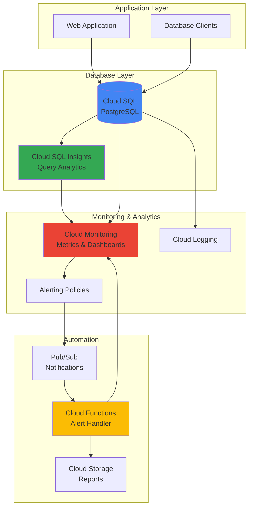

# Database Performance Monitoring with Cloud SQL Insights and Cloud Monitoring

## Problem

Database performance issues often go unnoticed until they impact user experience or application availability. Traditional monitoring approaches provide reactive insights rather than proactive intelligence, making it difficult for database administrators to identify query bottlenecks, predict performance degradation, or optimize resource allocation before problems escalate into critical incidents.

## Solution

Build a comprehensive database observability platform using Cloud SQL Insights for deep query-level analysis, Cloud Monitoring for metrics aggregation and visualization, and Cloud Functions for automated alerting and remediation. This intelligent monitoring system proactively detects anomalies, provides actionable performance recommendations, and enables data-driven optimization decisions.

## Architecture Diagram



## Prerequisites

1. Google Cloud account with billing enabled and appropriate permissions for Cloud SQL, Cloud Monitoring, and Cloud Functions
2. Google Cloud CLI installed and configured (or Cloud Shell)
3. Basic understanding of SQL databases and performance metrics
4. Familiarity with monitoring concepts and alerting strategies
5. Estimated cost: $50-75 for running Cloud SQL instance and associated services for the duration of this recipe

> **Note**: This recipe uses Cloud SQL Enterprise Plus edition to access advanced Query Insights features including wait event analysis and AI-assisted troubleshooting.

## Preparation

```bash
# Set environment variables for GCP resources
export PROJECT_ID="db-monitoring-$(date +%s)"
export REGION="us-central1"
export ZONE="us-central1-a"

# Generate unique suffix for resource names
RANDOM_SUFFIX=$(openssl rand -hex 3)

# Set default project and region
gcloud config set project ${PROJECT_ID}
gcloud config set compute/region ${REGION}
gcloud config set compute/zone ${ZONE}

# Enable required APIs
gcloud services enable sqladmin.googleapis.com
gcloud services enable monitoring.googleapis.com
gcloud services enable cloudfunctions.googleapis.com
gcloud services enable pubsub.googleapis.com
gcloud services enable storage.googleapis.com
gcloud services enable logging.googleapis.com

echo "✅ Project configured: ${PROJECT_ID}"
echo "✅ Required APIs enabled for database monitoring platform"

# Create foundational resources
export DB_INSTANCE_NAME="performance-db-${RANDOM_SUFFIX}"
export FUNCTION_NAME="db-alert-handler-${RANDOM_SUFFIX}"
export TOPIC_NAME="db-alerts-${RANDOM_SUFFIX}"
export BUCKET_NAME="db-reports-${RANDOM_SUFFIX}"

# Create Pub/Sub topic for alert notifications
gcloud pubsub topics create ${TOPIC_NAME}

# Create Cloud Storage bucket for performance reports
gsutil mb -p ${PROJECT_ID} \
    -c STANDARD \
    -l ${REGION} \
    gs://${BUCKET_NAME}

echo "✅ Foundational resources created successfully"
```

## Steps

1. **Create Cloud SQL Instance with Enterprise Plus Edition**:

   Cloud SQL Enterprise Plus edition provides advanced Query Insights capabilities including real-time wait event analysis, query plan capture, and AI-assisted troubleshooting. These features enable comprehensive database performance monitoring that goes beyond basic metrics to provide actionable intelligence for optimization.

   ```bash
   # Create Cloud SQL PostgreSQL instance with Enterprise Plus edition
   gcloud sql instances create ${DB_INSTANCE_NAME} \
       --database-version=POSTGRES_15 \
       --tier=db-perf-optimized-N-2 \
       --region=${REGION} \
       --edition=ENTERPRISE_PLUS \
       --enable-bin-log \
       --storage-type=SSD \
       --storage-size=100GB \
       --storage-auto-increase \
       --maintenance-window-day=SUN \
       --maintenance-window-hour=04 \
       --backup-start-time=02:00
   
   echo "✅ Cloud SQL Enterprise Plus instance created: ${DB_INSTANCE_NAME}"
   ```

   The Enterprise Plus edition provides enhanced monitoring capabilities including extended metrics retention, advanced query insights, and AI-powered performance recommendations that are essential for intelligent database monitoring.

2. **Enable Query Insights on the Database Instance**:

   Query Insights provides deep visibility into database performance by capturing and analyzing query execution patterns, wait events, and resource consumption. Enabling this feature activates automatic collection of performance telemetry that feeds into our monitoring dashboard.

   ```bash
   # Enable Query Insights for advanced performance monitoring
   gcloud sql instances patch ${DB_INSTANCE_NAME} \
       --insights-config-query-insights-enabled \
       --insights-config-query-string-length=1024 \
       --insights-config-record-application-tags \
       --insights-config-record-client-address
   
   # Wait for the configuration to apply
   sleep 60
   
   echo "✅ Query Insights enabled with comprehensive data collection"
   ```

   Query Insights now captures detailed query performance data including execution plans, wait events, and application context, providing the foundation for intelligent performance analysis and automated optimization recommendations.

3. **Create Database and Sample Data for Testing**:

   Setting up a test database with realistic data patterns enables validation of our monitoring system. The sample data includes tables with varying query complexities to demonstrate different performance monitoring scenarios.

   ```bash
   # Set database password
   export DB_PASSWORD="SecurePass123!"
   
   # Set root password for the instance
   gcloud sql users set-password postgres \
       --instance=${DB_INSTANCE_NAME} \
       --password=${DB_PASSWORD}
   
   # Create test database
   gcloud sql databases create performance_test \
       --instance=${DB_INSTANCE_NAME}
   
   # Get the instance connection name for later use
   export CONNECTION_NAME=$(gcloud sql instances describe ${DB_INSTANCE_NAME} \
       --format="value(connectionName)")
   
   echo "✅ Database created with connection name: ${CONNECTION_NAME}"
   ```

   The test database is now ready for performance monitoring validation. Query Insights will automatically begin collecting performance metrics as soon as database activity starts, providing immediate visibility into query execution patterns.

4. **Create Custom Monitoring Dashboard**:

   Cloud Monitoring dashboards provide centralized visualization of database performance metrics from both Cloud SQL native monitoring and Query Insights. Custom dashboards enable tailored views for different stakeholders and use cases.

   ```bash
   # Create dashboard configuration
   cat > dashboard-config.json << 'EOF'
   {
     "displayName": "Cloud SQL Performance Monitoring Dashboard",
     "mosaicLayout": {
       "tiles": [
         {
           "width": 6,
           "height": 4,
           "widget": {
             "title": "Database Connections",
             "xyChart": {
               "dataSets": [
                 {
                   "timeSeriesQuery": {
                     "timeSeriesFilter": {
                       "filter": "resource.type=\"cloudsql_database\"",
                       "aggregation": {
                         "alignmentPeriod": "60s",
                         "perSeriesAligner": "ALIGN_MEAN"
                       }
                     }
                   }
                 }
               ]
             }
           }
         },
         {
           "width": 6,
           "height": 4,
           "widget": {
             "title": "Query Insights Top Queries",
             "xyChart": {
               "dataSets": [
                 {
                   "timeSeriesQuery": {
                     "timeSeriesFilter": {
                       "filter": "resource.type=\"cloudsql_database\" AND metric.type=\"cloudsql.googleapis.com/insights/aggregate/execution_time\"",
                       "aggregation": {
                         "alignmentPeriod": "300s",
                         "perSeriesAligner": "ALIGN_MEAN"
                       }
                     }
                   }
                 }
               ]
             }
           }
         }
       ]
     }
   }
   EOF
   
   # Create the monitoring dashboard
   gcloud monitoring dashboards create --config-from-file=dashboard-config.json
   
   echo "✅ Custom monitoring dashboard created successfully"
   ```

   The dashboard now provides real-time visibility into database performance, combining traditional infrastructure metrics with Query Insights data to deliver comprehensive database observability for proactive performance management.

5. **Configure Alerting Policies for Performance Thresholds**:

   Intelligent alerting policies monitor key performance indicators and automatically trigger notifications when thresholds are exceeded. These policies enable proactive response to performance degradation before it impacts users.

   ```bash
   # Create alerting policy for high CPU usage
   cat > cpu-alert-policy.json << EOF
   {
     "displayName": "Cloud SQL High CPU Usage",
     "conditions": [
       {
         "displayName": "CPU utilization is high",
         "conditionThreshold": {
           "filter": "resource.type=\"cloudsql_database\" AND resource.label.database_id=\"${PROJECT_ID}:${DB_INSTANCE_NAME}\" AND metric.type=\"cloudsql.googleapis.com/database/cpu/utilization\"",
           "comparison": "COMPARISON_GREATER_THAN",
           "thresholdValue": 0.8,
           "duration": "300s",
           "aggregations": [
             {
               "alignmentPeriod": "60s",
               "perSeriesAligner": "ALIGN_MEAN"
             }
           ]
         }
       }
     ],
     "notificationChannels": [],
     "alertStrategy": {
       "autoClose": "1800s"
     },
     "enabled": true
   }
   EOF
   
   # Create the alerting policy
   gcloud monitoring policies create --policy-from-file=cpu-alert-policy.json
   
   # Create alerting policy for slow queries
   cat > slow-query-alert-policy.json << EOF
   {
     "displayName": "Cloud SQL Slow Query Detection",
     "conditions": [
       {
         "displayName": "Query execution time is high",
         "conditionThreshold": {
           "filter": "resource.type=\"cloudsql_database\" AND resource.label.database_id=\"${PROJECT_ID}:${DB_INSTANCE_NAME}\" AND metric.type=\"cloudsql.googleapis.com/insights/aggregate/execution_time\"",
           "comparison": "COMPARISON_GREATER_THAN",
           "thresholdValue": 5000,
           "duration": "180s",
           "aggregations": [
             {
               "alignmentPeriod": "60s",
               "perSeriesAligner": "ALIGN_MEAN"
             }
           ]
         }
       }
     ],
     "notificationChannels": [],
     "alertStrategy": {
       "autoClose": "1800s"
     },
     "enabled": true
   }
   EOF
   
   gcloud monitoring policies create --policy-from-file=slow-query-alert-policy.json
   
   echo "✅ Intelligent alerting policies configured for proactive monitoring"
   ```

   Alerting policies are now actively monitoring database performance metrics and will automatically trigger when performance thresholds are exceeded, enabling rapid response to potential issues.

6. **Deploy Cloud Function for Automated Alert Processing**:

   Cloud Functions provide serverless automation for alert processing, enabling intelligent responses to performance events. The function processes alerts, analyzes patterns, and can trigger automated remediation actions.

   ```bash
   # Create directory for Cloud Function code
   mkdir -p ./db-alert-function
   cd ./db-alert-function
   
   # Create the main function file
   cat > main.py << 'EOF'
   import json
   import base64
   import os
   from google.cloud import storage
   from google.cloud import monitoring_v3
   from datetime import datetime, timezone
   import logging
   
   # Configure logging
   logging.basicConfig(level=logging.INFO)
   logger = logging.getLogger(__name__)
   
   def process_db_alert(event, context):
       """Process database performance alerts and generate actionable insights."""
       try:
           # Decode Pub/Sub message
           if 'data' in event:
               message = base64.b64decode(event['data']).decode('utf-8')
               alert_data = json.loads(message)
           else:
               alert_data = event
           
           logger.info(f"Processing alert: {alert_data}")
           
           # Extract alert information
           alert_type = alert_data.get('incident', {}).get('condition_name', 'Unknown')
           resource_name = alert_data.get('incident', {}).get('resource_display_name', 'Unknown')
           state = alert_data.get('incident', {}).get('state', 'UNKNOWN')
           
           # Generate performance report
           report = generate_performance_report(alert_type, resource_name, state)
           
           # Store report in Cloud Storage
           store_report(report)
           
           # Log processed alert
           logger.info(f"Successfully processed {alert_type} alert for {resource_name}")
           
           return {"status": "success", "alert_type": alert_type}
           
       except Exception as e:
           logger.error(f"Error processing alert: {str(e)}")
           return {"status": "error", "message": str(e)}
   
   def generate_performance_report(alert_type, resource_name, state):
       """Generate detailed performance analysis report."""
       timestamp = datetime.now(timezone.utc).isoformat()
       
       report = {
           "timestamp": timestamp,
           "alert_type": alert_type,
           "resource_name": resource_name,
           "state": state,
           "recommendations": get_performance_recommendations(alert_type),
           "analysis": f"Performance alert triggered for {resource_name} at {timestamp}"
       }
       
       return report
   
   def get_performance_recommendations(alert_type):
       """Provide intelligent recommendations based on alert type."""
       recommendations = {
           "CPU utilization is high": [
               "Consider upgrading to a higher CPU tier",
               "Review Query Insights for expensive queries",
               "Implement query optimization strategies",
               "Consider read replicas for read-heavy workloads"
           ],
           "Query execution time is high": [
               "Analyze query execution plans in Query Insights",
               "Review and optimize table indexes",
               "Consider query rewriting for better performance",
               "Check for table lock contention"
           ]
       }
       
       return recommendations.get(alert_type, ["Review database performance metrics"])
   
   def store_report(report):
       """Store performance report in Cloud Storage."""
       try:
           client = storage.Client()
           bucket_name = os.environ.get('BUCKET_NAME', 'default-bucket')
           bucket = client.bucket(bucket_name)
           
           filename = f"performance-reports/{report['timestamp']}-{report['alert_type'].replace(' ', '-')}.json"
           blob = bucket.blob(filename)
           blob.upload_from_string(json.dumps(report, indent=2))
           
           logger.info(f"Report stored: gs://{bucket_name}/{filename}")
           
       except Exception as e:
           logger.warning(f"Failed to store report: {str(e)}")
   EOF
   
   # Create requirements file
   cat > requirements.txt << 'EOF'
   google-cloud-storage==2.18.0
   google-cloud-monitoring==2.22.0
   functions-framework==3.8.1
   EOF
   
   # Deploy the Cloud Function
   gcloud functions deploy ${FUNCTION_NAME} \
       --runtime python312 \
       --trigger-topic ${TOPIC_NAME} \
       --source . \
       --entry-point process_db_alert \
       --memory 256MB \
       --timeout 60s \
       --set-env-vars BUCKET_NAME=${BUCKET_NAME}
   
   cd ..
   
   echo "✅ Cloud Function deployed for intelligent alert processing"
   ```

   The Cloud Function is now deployed and ready to process database performance alerts, providing automated analysis and actionable recommendations based on Query Insights data and performance patterns.

7. **Configure Notification Channels for Alert Integration**:

   Notification channels connect alerting policies to the Cloud Function, enabling automated processing of performance alerts. This integration creates a complete feedback loop from monitoring to intelligent response.

   ```bash
   # Create Pub/Sub notification channel
   NOTIFICATION_CHANNEL=$(gcloud monitoring channels create \
       --display-name="Database Alert Processing" \
       --type=pubsub \
       --channel-labels=topic=projects/${PROJECT_ID}/topics/${TOPIC_NAME} \
       --format="value(name)")
   
   # Update existing alerting policies to use the notification channel
   POLICIES=$(gcloud monitoring policies list \
       --filter="displayName:('Cloud SQL High CPU Usage' OR 'Cloud SQL Slow Query Detection')" \
       --format="value(name)")
   
   for policy in $POLICIES; do
       gcloud monitoring policies update $policy \
           --add-notification-channels=$NOTIFICATION_CHANNEL
   done
   
   echo "✅ Notification channels configured for automated alert processing"
   echo "Alert notifications will now trigger intelligent analysis and recommendations"
   ```

   The monitoring system now provides end-to-end automation from performance detection through intelligent analysis, enabling proactive database optimization and rapid incident response.

## Validation & Testing

1. **Verify Cloud SQL instance with Query Insights enabled**:

   ```bash
   # Check instance status and configuration
   gcloud sql instances describe ${DB_INSTANCE_NAME} \
       --format="table(name,state,databaseVersion,settings.tier,edition)"
   
   # Verify Query Insights configuration
   gcloud sql instances describe ${DB_INSTANCE_NAME} \
       --format="value(settings.insightsConfig.queryInsightsEnabled)"
   ```

   Expected output: Instance should show as `RUNNABLE` with `ENTERPRISE_PLUS` edition and Query Insights enabled as `True`.

2. **Test monitoring dashboard and metrics collection**:

   ```bash
   # List available monitoring dashboards
   gcloud monitoring dashboards list \
       --filter="displayName:'Cloud SQL Performance Monitoring Dashboard'"
   
   # Verify Query Insights metrics are being collected
   gcloud logging read "resource.type=cloudsql_database AND jsonPayload.message:insights" \
       --limit=5 --format="value(timestamp,jsonPayload.message)"
   ```

   Expected output: Dashboard should be listed, and Query Insights logs should show data collection activity.

3. **Validate alerting policies and notification setup**:

   ```bash
   # List alerting policies
   gcloud monitoring policies list \
       --filter="displayName:('Cloud SQL High CPU Usage' OR 'Cloud SQL Slow Query Detection')" \
       --format="table(displayName,enabled,notificationChannels[0])"
   
   # Test Cloud Function deployment
   gcloud functions describe ${FUNCTION_NAME} \
       --format="table(name,status,trigger.eventTrigger.eventType)"
   ```

   Expected output: Both alerting policies should be enabled with notification channels configured, and the Cloud Function should show as `ACTIVE`.

4. **Generate test database activity for monitoring validation**:

   ```bash
   # Connect to the database and create test load
   gcloud sql connect ${DB_INSTANCE_NAME} --user=postgres --database=performance_test << 'EOF'
   -- Create test table with indexes
   CREATE TABLE performance_test (
       id SERIAL PRIMARY KEY,
       name VARCHAR(100),
       created_at TIMESTAMP DEFAULT CURRENT_TIMESTAMP,
       data TEXT
   );
   
   -- Insert test data
   INSERT INTO performance_test (name, data) 
   SELECT 'Test User ' || generate_series(1, 1000), 
          'Sample data for performance testing';
   
   -- Create some query load
   SELECT COUNT(*) FROM performance_test WHERE name LIKE '%User 5%';
   SELECT * FROM performance_test ORDER BY created_at DESC LIMIT 100;
   \q
   EOF
   
   echo "✅ Test database activity generated for monitoring validation"
   ```

## Cleanup

1. **Remove Cloud Function and associated resources**:

   ```bash
   # Delete Cloud Function
   gcloud functions delete ${FUNCTION_NAME} --quiet
   
   # Delete Pub/Sub topic
   gcloud pubsub topics delete ${TOPIC_NAME} --quiet
   
   echo "✅ Cloud Function and Pub/Sub resources deleted"
   ```

2. **Remove monitoring dashboard and alerting policies**:

   ```bash
   # Delete alerting policies
   POLICIES=$(gcloud monitoring policies list \
       --filter="displayName:('Cloud SQL High CPU Usage' OR 'Cloud SQL Slow Query Detection')" \
       --format="value(name)")
   
   for policy in $POLICIES; do
       gcloud monitoring policies delete $policy --quiet
   done
   
   # Delete monitoring dashboard
   DASHBOARD=$(gcloud monitoring dashboards list \
       --filter="displayName:'Cloud SQL Performance Monitoring Dashboard'" \
       --format="value(name)")
   
   if [ ! -z "$DASHBOARD" ]; then
       gcloud monitoring dashboards delete $DASHBOARD --quiet
   fi
   
   echo "✅ Monitoring dashboard and alerting policies removed"
   ```

3. **Remove Cloud SQL instance and storage resources**:

   ```bash
   # Delete Cloud SQL instance
   gcloud sql instances delete ${DB_INSTANCE_NAME} --quiet
   
   # Remove Cloud Storage bucket and contents
   gsutil -m rm -r gs://${BUCKET_NAME}
   
   echo "✅ Cloud SQL instance and storage resources deleted"
   ```

4. **Clean up local files and environment variables**:

   ```bash
   # Remove local function code directory
   rm -rf ./db-alert-function
   rm -f dashboard-config.json cpu-alert-policy.json slow-query-alert-policy.json
   
   # Unset environment variables
   unset DB_INSTANCE_NAME FUNCTION_NAME TOPIC_NAME BUCKET_NAME
   unset DB_PASSWORD CONNECTION_NAME PROJECT_ID REGION ZONE RANDOM_SUFFIX
   
   echo "✅ Local files and environment variables cleaned up"
   echo "Note: Project deletion may take several minutes to complete"
   ```

## Discussion

Cloud SQL Insights represents a significant advancement in database observability, providing query-level visibility that goes far beyond traditional infrastructure monitoring. By combining this deep analytical capability with Cloud Monitoring's robust alerting system and Cloud Functions' serverless automation, we create an intelligent monitoring platform that not only detects performance issues but provides actionable insights for optimization. This comprehensive approach aligns with Google Cloud's [Architecture Framework](https://cloud.google.com/architecture/framework) principles of operational excellence and reliability.

The Enterprise Plus edition's advanced features, including AI-assisted troubleshooting and extended metrics retention, enable sophisticated analysis of database performance patterns. Query Insights captures detailed execution plans, wait events, and resource consumption data, providing the granular visibility needed for intelligent performance optimization. This data becomes the foundation for automated analysis and recommendation systems that can guide database tuning decisions based on Google Cloud's [Cloud SQL best practices](https://cloud.google.com/sql/docs/postgres/best-practices).

The integration of multiple Google Cloud services creates a powerful feedback loop where monitoring data drives automated analysis, which in turn generates actionable recommendations. Cloud Functions serve as the intelligence layer, processing alerts and performance data to provide context-aware insights. This approach transforms reactive monitoring into proactive optimization, enabling database administrators to address performance issues before they impact users, following the principles outlined in the [Google Cloud Operations Suite](https://cloud.google.com/products/operations).

Performance monitoring at this level requires understanding the relationship between infrastructure metrics, query execution patterns, and application behavior. Query Insights provides this correlation by linking individual queries to their resource consumption and performance impact, enabling targeted optimization efforts that deliver measurable improvements while maintaining [Google Cloud security best practices](https://cloud.google.com/security/best-practices).

> **Tip**: Regularly review Query Insights data to identify performance trends and optimization opportunities. The AI-assisted troubleshooting feature can provide valuable recommendations for query optimization and index strategies.

## Challenge

Extend this intelligent monitoring solution by implementing these advanced capabilities:

1. **Machine Learning-Based Anomaly Detection**: Implement [Vertex AI](https://cloud.google.com/vertex-ai) models to learn normal database performance patterns and automatically detect anomalies that may not trigger traditional threshold-based alerts.

2. **Automated Query Optimization**: Develop [Cloud Functions](https://cloud.google.com/functions) that automatically apply index recommendations from Query Insights and validate performance improvements through A/B testing.

3. **Multi-Database Fleet Management**: Scale the monitoring system to handle multiple Cloud SQL instances across different projects using [Cloud Asset Inventory](https://cloud.google.com/asset-inventory) for discovery and centralized monitoring.

4. **Predictive Scaling**: Integrate with [Cloud Scheduler](https://cloud.google.com/scheduler) to implement predictive scaling based on historical performance patterns and Query Insights trend analysis.

5. **Cost Optimization Intelligence**: Combine performance data with [Cloud Billing](https://cloud.google.com/billing) APIs to provide cost-per-query analysis and automated right-sizing recommendations for optimal price-performance ratios.

## Infrastructure Code

*Infrastructure code will be generated after recipe approval.*