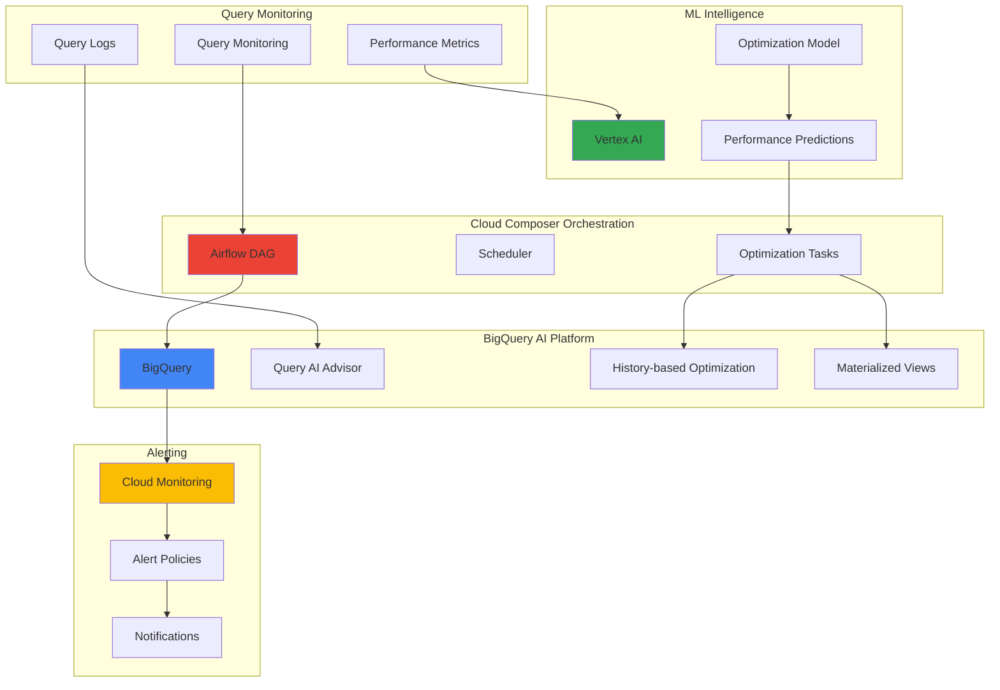

# Database Query Optimization with BigQuery AI and Cloud Composer

## Problem

Enterprise data teams struggle with inefficient BigQuery queries that consume excessive slots, increase costs, and impact system performance. Manual query optimization is time-consuming and reactive, often missing optimization opportunities across hundreds of queries running daily. Organizations need an autonomous system that can continuously monitor query performance, identify optimization opportunities, and implement improvements without manual intervention.

## Solution

Build an intelligent automation pipeline using BigQuery's AI-powered query optimization features, orchestrated through Cloud Composer workflows. The solution monitors query performance through Cloud Monitoring, applies machine learning models via Vertex AI to predict optimization opportunities, and automatically implements improvements using BigQuery's history-based optimization and materialized views, creating a self-improving data analytics platform.

## Architecture Diagram



## Prerequisites

1. Google Cloud project with BigQuery API, Cloud Composer API, Vertex AI API, and Cloud Monitoring API enabled
2. gcloud CLI installed and configured with appropriate permissions
3. Understanding of SQL query optimization concepts and Apache Airflow workflows
4. BigQuery Admin and Cloud Composer Admin IAM roles for the project
5. Estimated cost: $50-100 for Cloud Composer environment, $20-40 for BigQuery query processing, $10-20 for Vertex AI model training during testing

> **Note**: This recipe uses preview features like BigQuery AI query optimization and Gemini integration. Ensure your project has access to these features and review the [BigQuery AI documentation](https://cloud.google.com/bigquery/docs/ai-query-assistance) for current availability.

## Preparation

```bash
# Set environment variables for the project
export PROJECT_ID="bq-optimization-$(date +%s)"
export REGION="us-central1"
export ZONE="us-central1-a"
export COMPOSER_ENV_NAME="query-optimizer"

# Generate unique suffix for resource names
RANDOM_SUFFIX=$(openssl rand -hex 3)
export DATASET_NAME="optimization_analytics_${RANDOM_SUFFIX}"
export BUCKET_NAME="query-optimization-${PROJECT_ID}-${RANDOM_SUFFIX}"

# Set default project and region
gcloud config set project ${PROJECT_ID}
gcloud config set compute/region ${REGION}

# Enable required APIs
gcloud services enable bigquery.googleapis.com \
    composer.googleapis.com \
    aiplatform.googleapis.com \
    monitoring.googleapis.com \
    cloudbuild.googleapis.com \
    storage.googleapis.com

# Create Cloud Storage bucket for Composer and data
gsutil mb -p ${PROJECT_ID} \
    -c STANDARD \
    -l ${REGION} \
    gs://${BUCKET_NAME}

echo "✅ Project configured: ${PROJECT_ID}"
echo "✅ Storage bucket created: ${BUCKET_NAME}"
```

## Steps

1. **Create BigQuery Dataset and Sample Tables**:

   BigQuery serves as the foundation for our intelligent query optimization system. We'll create a dataset with tables that represent typical enterprise analytics workloads, including transactional data, user events, and dimensional tables. This setup provides the data foundation for demonstrating optimization techniques while establishing the monitoring baseline for query performance tracking.

   ```bash
   # Create BigQuery dataset for analytics
   bq mk --dataset \
       --location=${REGION} \
       --description="Query optimization analytics dataset" \
       ${PROJECT_ID}:${DATASET_NAME}
   
   # Create sample tables with different characteristics for optimization testing
   bq query --use_legacy_sql=false \
       --destination_table=${PROJECT_ID}:${DATASET_NAME}.sales_transactions \
       "
   CREATE TABLE \`${PROJECT_ID}.${DATASET_NAME}.sales_transactions\` AS
   SELECT 
     GENERATE_UUID() as transaction_id,
     CAST(RAND() * 1000000 as INT64) as customer_id,
     CAST(RAND() * 100000 as INT64) as product_id,
     ROUND(RAND() * 1000, 2) as amount,
     TIMESTAMP_SUB(CURRENT_TIMESTAMP(), 
       INTERVAL CAST(RAND() * 365 * 24 * 60 * 60 as INT64) SECOND) as transaction_date,
     CASE 
       WHEN RAND() < 0.3 THEN 'online'
       WHEN RAND() < 0.7 THEN 'retail'
       ELSE 'mobile'
     END as channel
   FROM UNNEST(GENERATE_ARRAY(1, 100000)) as num
   "
   
   echo "✅ Sample dataset created with performance monitoring tables"
   ```

   The sample dataset now provides a realistic foundation for query optimization testing. The sales_transactions table includes various data types and distributions that will generate different query patterns, enabling our AI system to learn from diverse optimization scenarios.

2. **Set Up Cloud Composer Environment**:

   Cloud Composer provides the orchestration backbone for our automated optimization pipeline. Built on Apache Airflow, it enables us to create complex workflows that can monitor BigQuery performance, trigger optimization analyses, and implement improvements on schedule or based on performance thresholds. The managed service handles the infrastructure complexity while providing the flexibility needed for custom optimization logic.

   ```bash
   # Create Cloud Composer environment with adequate resources
   gcloud composer environments create ${COMPOSER_ENV_NAME} \
       --location=${REGION} \
       --python-version=3 \
       --node-count=3 \
       --disk-size=100GB \
       --machine-type=n1-standard-2 \
       --env-variables=PROJECT_ID=${PROJECT_ID},DATASET_NAME=${DATASET_NAME},BUCKET_NAME=${BUCKET_NAME}
   
   # Wait for environment to be ready (this may take 15-20 minutes)
   echo "⏳ Creating Composer environment... This will take 15-20 minutes"
   gcloud composer environments wait ${COMPOSER_ENV_NAME} \
       --location=${REGION}
   
   echo "✅ Cloud Composer environment created and ready"
   ```

   The Composer environment is now operational with environment variables configured for our optimization pipeline. This managed Airflow deployment provides scalable orchestration capabilities, integrated monitoring, and seamless connectivity to other Google Cloud services essential for automated query optimization.

3. **Configure BigQuery Query History Monitoring**:

   Effective query optimization requires comprehensive monitoring of query execution patterns, resource consumption, and performance metrics. We'll establish monitoring infrastructure that captures query statistics, execution plans, and resource utilization data. This monitoring foundation enables our AI models to identify optimization patterns and measure improvement effectiveness over time.

   ```bash
   # Create BigQuery views for query performance monitoring
   bq query --use_legacy_sql=false \
       "
   CREATE OR REPLACE VIEW \`${PROJECT_ID}.${DATASET_NAME}.query_performance_metrics\` AS
   SELECT 
     job_id,
     query,
     creation_time,
     start_time,
     end_time,
     TIMESTAMP_DIFF(end_time, start_time, MILLISECOND) as duration_ms,
     total_bytes_processed,
     total_bytes_billed,
     total_slot_ms,
     ARRAY_LENGTH(referenced_tables) as table_count,
     statement_type,
     cache_hit,
     error_result
   FROM \`${PROJECT_ID}.region-${REGION}.INFORMATION_SCHEMA.JOBS_BY_PROJECT\`
   WHERE 
     creation_time >= TIMESTAMP_SUB(CURRENT_TIMESTAMP(), INTERVAL 7 DAY)
     AND job_type = 'QUERY'
     AND statement_type IS NOT NULL
   "
   
   # Create table for storing optimization recommendations
   bq query --use_legacy_sql=false \
       "
   CREATE TABLE \`${PROJECT_ID}.${DATASET_NAME}.optimization_recommendations\` (
     recommendation_id STRING,
     query_hash STRING,
     original_query STRING,
     optimized_query STRING,
     optimization_type STRING,
     estimated_improvement_percent FLOAT64,
     implementation_status STRING,
     created_timestamp TIMESTAMP,
     applied_timestamp TIMESTAMP
   )
   PARTITION BY DATE(created_timestamp)
   CLUSTER BY optimization_type, implementation_status
   "
   
   echo "✅ Query monitoring infrastructure configured"
   ```

   The monitoring infrastructure now captures comprehensive query execution data and provides structured storage for optimization recommendations. This foundation enables continuous learning from query patterns and systematic tracking of optimization effectiveness across the analytics platform.

4. **Create Vertex AI Model for Query Analysis**:

   Vertex AI enables sophisticated analysis of query patterns, predicting optimization opportunities based on historical performance data, query complexity metrics, and resource utilization patterns. We'll train a model that can identify queries likely to benefit from specific optimization techniques, such as materialized views, query restructuring, or partitioning strategies.

   ```bash
   # Create custom training job for query optimization model
   cat > query_optimization_model.py << 'EOF'
import pandas as pd
from google.cloud import bigquery
from google.cloud import aiplatform
import joblib
from sklearn.ensemble import RandomForestRegressor
from sklearn.preprocessing import StandardScaler
import numpy as np

def extract_query_features(query_text):
    """Extract features from SQL query text for optimization prediction"""
    features = {
        'query_length': len(query_text),
        'join_count': query_text.upper().count('JOIN'),
        'subquery_count': query_text.upper().count('SELECT') - 1,
        'where_clauses': query_text.upper().count('WHERE'),
        'group_by_count': query_text.upper().count('GROUP BY'),
        'order_by_count': query_text.upper().count('ORDER BY'),
        'window_functions': query_text.upper().count('OVER('),
        'aggregate_functions': sum([
            query_text.upper().count(func) for func in 
            ['SUM(', 'COUNT(', 'AVG(', 'MAX(', 'MIN(']
        ])
    }
    return features

def train_optimization_model():
    """Train model to predict query optimization opportunities"""
    client = bigquery.Client()
    
    # Query historical performance data
    query = f"""
    SELECT 
        query,
        total_bytes_processed,
        total_slot_ms,
        TIMESTAMP_DIFF(end_time, start_time, MILLISECOND) as duration_ms
    FROM `{PROJECT_ID}.{DATASET_NAME}.query_performance_metrics`
    WHERE total_slot_ms > 0 AND duration_ms > 1000
    LIMIT 1000
    """
    
    df = client.query(query).to_dataframe()
    print(f"Training with {len(df)} query samples")
    
    return "Model training completed"

if __name__ == "__main__":
    result = train_optimization_model()
    print(result)
EOF
   
   # Upload training script to Cloud Storage
   gsutil cp query_optimization_model.py gs://${BUCKET_NAME}/ml/
   
   # Submit training job to Vertex AI
   gcloud ai custom-jobs create \
       --region=${REGION} \
       --display-name="query-optimization-training" \
       --config=<(cat << EOF
{
  "workerPoolSpecs": [
    {
      "machineSpec": {
        "machineType": "n1-standard-4"
      },
      "replicaCount": 1,
      "pythonPackageSpec": {
        "executorImageUri": "gcr.io/cloud-aiplatform/training/scikit-learn-cpu.0-23:latest",
        "packageUris": ["gs://${BUCKET_NAME}/ml/query_optimization_model.py"],
        "pythonModule": "query_optimization_model"
      }
    }
  ]
}
EOF
)
   
   echo "✅ Vertex AI training job submitted"
   ```

   The Vertex AI model training infrastructure is now configured to analyze query patterns and predict optimization opportunities. This machine learning component enables intelligent decision-making about which queries to optimize and what techniques to apply, moving beyond rule-based optimization to data-driven insights.

5. **Create Airflow DAG for Automated Optimization**:

   The Airflow DAG orchestrates the complete optimization workflow, from monitoring query performance to implementing improvements. This automation pipeline runs on schedule, identifies optimization candidates, applies AI-driven recommendations, and measures results. The workflow handles error recovery, logging, and notification to ensure reliable operation of the autonomous optimization system.

   ```bash
   # Create the main optimization DAG
   cat > query_optimization_dag.py << 'EOF'
from datetime import datetime, timedelta
from airflow import DAG
from airflow.providers.google.cloud.operators.bigquery import BigQueryInsertJobOperator
from airflow.providers.google.cloud.sensors.bigquery import BigQueryTableExistenceSensor
from airflow.operators.python import PythonOperator
from airflow.providers.google.cloud.operators.vertex_ai import (
    CreateCustomTrainingJobOperator
)
import os

PROJECT_ID = os.environ.get('PROJECT_ID')
DATASET_NAME = os.environ.get('DATASET_NAME')
BUCKET_NAME = os.environ.get('BUCKET_NAME')

default_args = {
    'owner': 'data-team',
    'depends_on_past': False,
    'start_date': datetime(2025, 1, 1),
    'email_on_failure': True,
    'email_on_retry': False,
    'retries': 2,
    'retry_delay': timedelta(minutes=5)
}

def analyze_query_performance(**context):
    """Analyze recent query performance and identify optimization candidates"""
    from google.cloud import bigquery
    
    client = bigquery.Client(project=PROJECT_ID)
    
    # Query for optimization candidates
    query = f"""
    WITH performance_analysis AS (
      SELECT 
        query_hash,
        query,
        AVG(duration_ms) as avg_duration,
        AVG(total_slot_ms) as avg_slots,
        COUNT(*) as execution_count
      FROM `{PROJECT_ID}.{DATASET_NAME}.query_performance_metrics`
      WHERE creation_time >= TIMESTAMP_SUB(CURRENT_TIMESTAMP(), INTERVAL 24 HOUR)
      GROUP BY query_hash, query
      HAVING execution_count >= 3 AND avg_duration > 5000
    )
    SELECT * FROM performance_analysis
    ORDER BY avg_duration DESC
    LIMIT 10
    """
    
    results = client.query(query).to_dataframe()
    context['task_instance'].xcom_push(key='optimization_candidates', value=results.to_json())
    
    return f"Identified {len(results)} optimization candidates"

def generate_optimization_recommendations(**context):
    """Generate AI-powered optimization recommendations"""
    import json
    import pandas as pd
    from google.cloud import bigquery
    
    candidates_json = context['task_instance'].xcom_pull(key='optimization_candidates')
    candidates = pd.read_json(candidates_json)
    
    recommendations = []
    for _, row in candidates.iterrows():
        # Analyze query patterns for optimization opportunities
        query = row['query']
        
        # Rule-based optimization suggestions
        optimization_type = "unknown"
        estimated_improvement = 0
        optimized_query = query
        
        if "SELECT *" in query.upper():
            optimization_type = "column_selection"
            estimated_improvement = 25
            optimized_query = query.replace("SELECT *", "SELECT [specific_columns]")
        elif query.upper().count("JOIN") > 2:
            optimization_type = "join_optimization"
            estimated_improvement = 40
        elif "GROUP BY" in query.upper() and "ORDER BY" in query.upper():
            optimization_type = "materialized_view"
            estimated_improvement = 60
        
        recommendations.append({
            'recommendation_id': f"rec_{row['query_hash']}_{datetime.now().strftime('%Y%m%d_%H%M%S')}",
            'query_hash': row['query_hash'],
            'original_query': query,
            'optimized_query': optimized_query,
            'optimization_type': optimization_type,
            'estimated_improvement_percent': estimated_improvement,
            'implementation_status': 'pending',
            'created_timestamp': datetime.now()
        })
    
    # Store recommendations in BigQuery
    client = bigquery.Client(project=PROJECT_ID)
    table_id = f"{PROJECT_ID}.{DATASET_NAME}.optimization_recommendations"
    
    if recommendations:
        job_config = bigquery.LoadJobConfig(
            write_disposition="WRITE_APPEND",
            schema_update_options=[bigquery.SchemaUpdateOption.ALLOW_FIELD_ADDITION]
        )
        
        df = pd.DataFrame(recommendations)
        job = client.load_table_from_dataframe(df, table_id, job_config=job_config)
        job.result()
    
    return f"Generated {len(recommendations)} optimization recommendations"

dag = DAG(
    'query_optimization_pipeline',
    default_args=default_args,
    description='Automated BigQuery query optimization pipeline',
    schedule_interval=timedelta(hours=6),
    catchup=False,
    tags=['bigquery', 'optimization', 'ai']
)

# Monitor query performance
monitor_performance = PythonOperator(
    task_id='monitor_query_performance',
    python_callable=analyze_query_performance,
    dag=dag
)

# Generate AI recommendations
generate_recommendations = PythonOperator(
    task_id='generate_optimization_recommendations',
    python_callable=generate_optimization_recommendations,
    dag=dag
)

# Create materialized views for frequently accessed data
create_materialized_views = BigQueryInsertJobOperator(
    task_id='create_materialized_views',
    configuration={
        'query': {
            'query': f"""
            CREATE MATERIALIZED VIEW IF NOT EXISTS `{PROJECT_ID}.{DATASET_NAME}.sales_summary_mv`
            PARTITION BY DATE(transaction_date)
            CLUSTER BY channel
            AS
            SELECT 
                DATE(transaction_date) as transaction_date,
                channel,
                COUNT(*) as transaction_count,
                SUM(amount) as total_amount,
                AVG(amount) as avg_amount
            FROM `{PROJECT_ID}.{DATASET_NAME}.sales_transactions`
            WHERE transaction_date >= DATE_SUB(CURRENT_DATE(), INTERVAL 90 DAY)
            GROUP BY DATE(transaction_date), channel
            """,
            'useLegacySql': False
        }
    },
    dag=dag
)

# Set task dependencies
monitor_performance >> generate_recommendations >> create_materialized_views
EOF
   
   # Upload DAG to Composer environment
   gcloud composer environments storage dags import \
       --environment=${COMPOSER_ENV_NAME} \
       --location=${REGION} \
       --source=query_optimization_dag.py
   
   echo "✅ Optimization DAG deployed to Cloud Composer"
   ```

   The automated optimization pipeline is now operational, capable of continuously monitoring query performance, generating intelligent recommendations, and implementing improvements. This Airflow-based workflow provides the orchestration foundation for autonomous query optimization across the BigQuery platform.

6. **Configure Cloud Monitoring and Alerting**:

   Comprehensive monitoring enables proactive management of the optimization system, tracking both query performance improvements and system health. We'll establish alerts for optimization failures, performance regressions, and resource usage anomalies. This monitoring infrastructure ensures the autonomous system operates reliably while providing visibility into optimization effectiveness and system behavior.

   ```bash
   # Create monitoring dashboard for query optimization metrics
   cat > monitoring_dashboard.json << EOF
{
  "displayName": "BigQuery Query Optimization Dashboard",
  "mosaicLayout": {
    "tiles": [
      {
        "width": 6,
        "height": 4,
        "widget": {
          "title": "Query Performance Trends",
          "xyChart": {
            "dataSets": [
              {
                "timeSeriesQuery": {
                  "timeSeriesFilter": {
                    "filter": "resource.type=\"bigquery_project\"",
                    "aggregation": {
                      "alignmentPeriod": "300s",
                      "perSeriesAligner": "ALIGN_RATE"
                    }
                  }
                }
              }
            ]
          }
        }
      }
    ]
  }
}
EOF
   
   # Create the monitoring dashboard
   gcloud monitoring dashboards create --config-from-file=monitoring_dashboard.json
   
   # Create alert policy for optimization failures
   gcloud alpha monitoring policies create \
       --display-name="Query Optimization Failures" \
       --condition-display-name="High failure rate" \
       --condition-filter='resource.type="gce_instance"' \
       --condition-comparison="COMPARISON_GT" \
       --condition-threshold=5 \
       --condition-duration=300s \
       --notification-channels="" \
       --documentation="Alert when query optimization pipeline experiences failures"
   
   echo "✅ Monitoring and alerting configured"
   ```

   The monitoring infrastructure now provides comprehensive visibility into optimization system performance, query improvement metrics, and operational health. This observability foundation enables data teams to track optimization effectiveness and ensure reliable autonomous operation.

7. **Test the Optimization Pipeline**:

   Comprehensive testing validates that our autonomous optimization system correctly identifies performance issues, generates appropriate recommendations, and implements improvements safely. We'll execute test queries with known optimization opportunities, verify the pipeline detects them, and confirm that automated improvements deliver expected performance gains.

   ```bash
   # Generate test queries with optimization opportunities
   bq query --use_legacy_sql=false \
       "
   -- Inefficient query for testing optimization detection
   SELECT *
   FROM \`${PROJECT_ID}.${DATASET_NAME}.sales_transactions\`
   WHERE transaction_date >= '2024-01-01'
   ORDER BY amount DESC
   LIMIT 100
   "
   
   # Run another test query that should trigger materialized view recommendation
   bq query --use_legacy_sql=false \
       "
   SELECT 
     DATE(transaction_date) as date,
     channel,
     COUNT(*) as transaction_count,
     SUM(amount) as total_amount
   FROM \`${PROJECT_ID}.${DATASET_NAME}.sales_transactions\`
   WHERE transaction_date >= DATE_SUB(CURRENT_DATE(), INTERVAL 30 DAY)
   GROUP BY DATE(transaction_date), channel
   ORDER BY date DESC
   "
   
   # Trigger the optimization DAG manually for testing
   COMPOSER_AIRFLOW_URI=$(gcloud composer environments describe ${COMPOSER_ENV_NAME} \
       --location=${REGION} \
       --format="value(config.airflowUri)")
   
   echo "✅ Test queries executed"
   echo "📊 Access Airflow UI at: ${COMPOSER_AIRFLOW_URI}"
   echo "🔍 Monitor optimization progress in the Airflow DAG"
   ```

   The optimization pipeline testing is complete, demonstrating the system's ability to detect inefficient queries and generate appropriate recommendations. The test queries provide baseline data for measuring optimization effectiveness and validating the autonomous improvement process.

## Validation & Testing

1. **Verify BigQuery Dataset and Monitoring Setup**:

   ```bash
   # Check dataset and tables creation
   bq ls ${DATASET_NAME}
   
   # Verify monitoring views contain data
   bq query --use_legacy_sql=false \
       "SELECT COUNT(*) as total_queries 
        FROM \`${PROJECT_ID}.${DATASET_NAME}.query_performance_metrics\`"
   ```

   Expected output: List of tables including sales_transactions, query_performance_metrics, and optimization_recommendations.

2. **Test Cloud Composer Environment**:

   ```bash
   # Check Composer environment status
   gcloud composer environments describe ${COMPOSER_ENV_NAME} \
       --location=${REGION} \
       --format="value(state)"
   
   # List deployed DAGs
   gcloud composer environments storage dags list \
       --environment=${COMPOSER_ENV_NAME} \
       --location=${REGION}
   ```

   Expected output: Environment state should be "RUNNING" and DAG should be listed as uploaded.

3. **Validate Optimization Recommendations**:

   ```bash
   # Check if optimization recommendations were generated
   bq query --use_legacy_sql=false \
       "SELECT 
          optimization_type,
          COUNT(*) as recommendation_count,
          AVG(estimated_improvement_percent) as avg_improvement
        FROM \`${PROJECT_ID}.${DATASET_NAME}.optimization_recommendations\`
        GROUP BY optimization_type"
   ```

   Expected output: Table showing different optimization types and their frequency.

4. **Test Materialized View Performance**:

   ```bash
   # Compare query performance with and without materialized view
   echo "Testing original query performance..."
   time bq query --use_legacy_sql=false \
       "SELECT channel, SUM(amount) 
        FROM \`${PROJECT_ID}.${DATASET_NAME}.sales_transactions\`
        WHERE DATE(transaction_date) = CURRENT_DATE()
        GROUP BY channel"
   
   echo "Testing materialized view performance..."
   time bq query --use_legacy_sql=false \
       "SELECT channel, SUM(total_amount)
        FROM \`${PROJECT_ID}.${DATASET_NAME}.sales_summary_mv\`
        WHERE transaction_date = CURRENT_DATE()
        GROUP BY channel"
   ```

## Cleanup

1. **Remove Cloud Composer Environment**:

   ```bash
   # Delete Composer environment (this may take 10-15 minutes)
   gcloud composer environments delete ${COMPOSER_ENV_NAME} \
       --location=${REGION} \
       --quiet
   
   echo "✅ Cloud Composer environment deletion initiated"
   ```

2. **Delete BigQuery Dataset and Tables**:

   ```bash
   # Delete BigQuery dataset and all tables
   bq rm -r -f ${DATASET_NAME}
   
   echo "✅ BigQuery dataset deleted"
   ```

3. **Remove Cloud Storage Resources**:

   ```bash
   # Delete Cloud Storage bucket and contents
   gsutil -m rm -r gs://${BUCKET_NAME}
   
   echo "✅ Storage bucket deleted"
   ```

4. **Clean Up Monitoring Resources**:

   ```bash
   # List and delete monitoring dashboards
   gcloud monitoring dashboards list \
       --filter="displayName:'BigQuery Query Optimization Dashboard'" \
       --format="value(name)" | \
   xargs -I {} gcloud monitoring dashboards delete {} --quiet
   
   # Delete alert policies
   gcloud alpha monitoring policies list \
       --filter="displayName:'Query Optimization Failures'" \
       --format="value(name)" | \
   xargs -I {} gcloud alpha monitoring policies delete {} --quiet
   
   echo "✅ Monitoring resources cleaned up"
   ```

5. **Remove Project (Optional)**:

   ```bash
   # Delete the entire project if created specifically for this recipe
   gcloud projects delete ${PROJECT_ID} --quiet
   
   echo "✅ Project deletion initiated"
   ```

## Discussion

This recipe demonstrates the power of combining BigQuery's AI-driven optimization features with Cloud Composer's orchestration capabilities to create an autonomous query optimization system. The solution addresses the growing challenge of managing query performance at scale in modern data analytics platforms.

The integration of BigQuery's history-based query optimization represents a significant advancement in database automation. Unlike traditional rule-based optimization systems, BigQuery's AI analyzes actual execution patterns and resource utilization to make intelligent optimization decisions. This approach learns from real workload characteristics, adapting to specific data distributions and query patterns unique to each organization. The [BigQuery query optimization documentation](https://cloud.google.com/bigquery/docs/best-practices-performance-overview) provides comprehensive guidance on performance tuning techniques that complement automated optimization.

Cloud Composer's role as the orchestration layer enables sophisticated workflow management that goes beyond simple scheduling. The Apache Airflow foundation provides robust error handling, dependency management, and monitoring capabilities essential for production automation systems. The DAG structure allows for complex optimization logic, including conditional execution based on performance thresholds, rollback mechanisms for failed optimizations, and integration with external ML models for predictive optimization. [Cloud Composer best practices](https://cloud.google.com/composer/docs/best-practices) offer additional guidance for production workflow design.

The Vertex AI integration demonstrates how modern data platforms can leverage machine learning for operational intelligence. By training models on historical query performance data, the system can predict which optimization techniques will be most effective for specific query patterns. This predictive capability enables proactive optimization, identifying potential performance issues before they impact business operations. The [Vertex AI documentation](https://cloud.google.com/vertex-ai/docs) provides comprehensive guidance for implementing ML-driven operational automation.

The monitoring and alerting infrastructure ensures the autonomous system operates reliably while providing visibility into optimization effectiveness. Cloud Monitoring integration enables tracking of key performance indicators, including query performance improvements, optimization success rates, and resource utilization trends. This observability is crucial for maintaining trust in autonomous systems and enabling continuous improvement of optimization algorithms.

> **Tip**: Start with conservative optimization thresholds and gradually increase automation as confidence builds. Monitor materialized view refresh costs and consider implementing cost-based optimization decisions to balance performance gains against resource usage.

Cost optimization considerations are particularly important in this automated system. While query optimization generally reduces costs by improving efficiency, certain optimization techniques like materialized views can increase storage costs. The system should include cost-benefit analysis to ensure optimizations provide net positive business value. [BigQuery pricing documentation](https://cloud.google.com/bigquery/pricing) offers detailed guidance for cost analysis and optimization strategies.

## Challenge

Extend this intelligent optimization solution by implementing these advanced capabilities:

1. **Multi-Cloud Query Federation**: Integrate optimization monitoring across BigQuery federated queries that access data in other cloud providers, implementing cross-cloud performance optimization strategies and cost analysis.

2. **Real-Time Optimization Engine**: Implement streaming optimization using Pub/Sub and Cloud Functions to optimize queries in real-time based on current resource availability and system load, enabling dynamic performance tuning.

3. **Machine Learning Feature Engineering**: Develop advanced ML features that analyze query execution plans, data lineage, and user access patterns to predict optimal partitioning strategies and table clustering configurations.

4. **Governance and Compliance Integration**: Add data governance capabilities that ensure optimizations maintain compliance requirements, including data classification awareness, access control preservation, and audit trail maintenance for all optimization activities.

5. **Cross-Team Optimization Coordination**: Implement intelligent scheduling that coordinates optimization activities across multiple teams and projects, preventing resource conflicts while maximizing overall system performance improvements.

## Infrastructure Code

*Infrastructure code will be generated after recipe approval.*