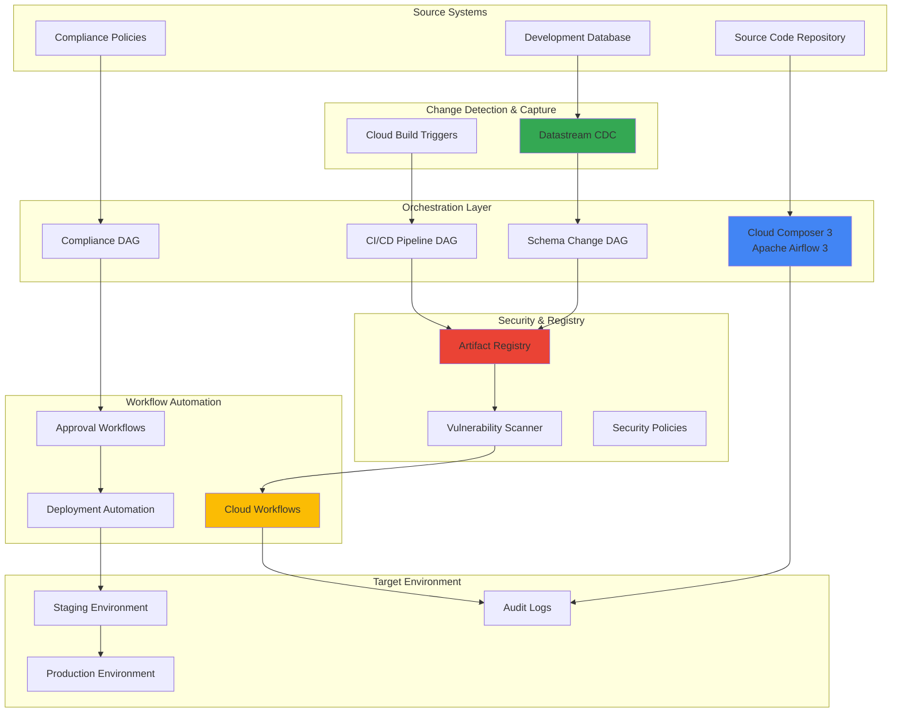

# Development Lifecycle Automation with Cloud Composer and Datastream

## Problem

Modern development teams struggle to orchestrate complex CI/CD pipelines that require real-time database change tracking, automated container vulnerability scanning, and compliance validation across multiple environments. Traditional pipeline tools lack the intelligence to automatically trigger deployments based on database schema changes, correlate security findings with deployment decisions, and enforce governance policies throughout the development lifecycle. Manual coordination between database changes, security scans, and deployment approvals creates bottlenecks that slow release velocity and increase the risk of security vulnerabilities reaching production.

## Solution

Build an intelligent development lifecycle automation system using Cloud Composer 3 with Apache Airflow 3 to orchestrate end-to-end CI/CD workflows that automatically respond to database changes captured by Datastream, perform container vulnerability scanning through Artifact Registry, and enforce compliance policies via Cloud Workflows. This solution creates a unified orchestration layer that connects code changes to database schema evolution, security validation, and automated deployment decisions while maintaining full audit trails and governance controls.

## Architecture Diagram



## Prerequisites

1. Google Cloud project with billing enabled and Owner or Editor permissions
2. gcloud CLI installed and configured (version 480.0.0 or later)
3. Basic knowledge of Apache Airflow, Python, and CI/CD concepts
4. Understanding of database change data capture (CDC) concepts
5. Estimated cost: $50-100 for a 2-hour session (Cloud Composer environment, Datastream processing, storage)

> **Note**: This recipe uses Cloud Composer 3 with Apache Airflow 3, providing enhanced security, performance, and multi-language task execution capabilities.

## Preparation

```bash
# Set environment variables for GCP resources
export PROJECT_ID="devops-automation-$(date +%s)"
export REGION="us-central1"
export ZONE="us-central1-a"
export COMPOSER_ENV_NAME="intelligent-devops"
export DATASTREAM_NAME="schema-changes-stream"

# Generate unique suffix for resource names
RANDOM_SUFFIX=$(openssl rand -hex 3)
export BUCKET_NAME="devops-automation-${RANDOM_SUFFIX}"
export ARTIFACT_REPO="secure-containers-${RANDOM_SUFFIX}"

# Set default project and region
gcloud config set project ${PROJECT_ID}
gcloud config set compute/region ${REGION}
gcloud config set compute/zone ${ZONE}

# Enable required APIs
gcloud services enable composer.googleapis.com
gcloud services enable datastream.googleapis.com
gcloud services enable artifactregistry.googleapis.com
gcloud services enable workflows.googleapis.com
gcloud services enable cloudbuild.googleapis.com
gcloud services enable containeranalysis.googleapis.com
gcloud services enable binaryauthorization.googleapis.com
gcloud services enable sqladmin.googleapis.com

echo "✅ Project configured: ${PROJECT_ID}"
echo "✅ Region set to: ${REGION}"
```

## Steps

1. **Create Cloud Storage Bucket for Workflow Assets**:

   Cloud Storage provides the foundational storage layer for our intelligent DevOps automation system. This bucket will store DAG files, workflow scripts, compliance policies, and audit logs that Cloud Composer and other services need to access throughout the development lifecycle automation process.

   ```bash
   # Create bucket for workflow assets and artifacts
   gsutil mb -p ${PROJECT_ID} \
       -c STANDARD \
       -l ${REGION} \
       gs://${BUCKET_NAME}
   
   # Enable versioning for audit trail compliance
   gsutil versioning set on gs://${BUCKET_NAME}
   
   # Create organized folder structure
   echo "Creating workflow directories..."
   gsutil -m cp /dev/null gs://${BUCKET_NAME}/dags/.keep
   gsutil -m cp /dev/null gs://${BUCKET_NAME}/data/.keep
   gsutil -m cp /dev/null gs://${BUCKET_NAME}/policies/.keep
   gsutil -m cp /dev/null gs://${BUCKET_NAME}/logs/.keep
   
   echo "✅ Storage bucket created: gs://${BUCKET_NAME}"
   ```

   The versioned storage bucket now provides a secure, auditable foundation for our automation workflows, ensuring all workflow assets are properly tracked and can be rolled back if needed.

2. **Create Artifact Registry Repository with Security Scanning**:

   Artifact Registry serves as the secure container image repository with integrated vulnerability scanning capabilities. This centralized registry will automatically scan all container images for security vulnerabilities and provide detailed analysis that our automation workflows can use to make deployment decisions.

   ```bash
   # Create Artifact Registry repository for containers
   gcloud artifacts repositories create ${ARTIFACT_REPO} \
       --repository-format=docker \
       --location=${REGION} \
       --description="Secure container repository with automated scanning"
   
   # Configure Docker authentication
   gcloud auth configure-docker ${REGION}-docker.pkg.dev
   
   echo "✅ Artifact Registry created: ${REGION}-docker.pkg.dev/${PROJECT_ID}/${ARTIFACT_REPO}"
   ```

   The Artifact Registry is now configured with automatic vulnerability scanning enabled by default, providing the security intelligence needed for our intelligent deployment decisions.

3. **Create Service Account for Cloud Composer**:

   Cloud Composer 3 requires a dedicated service account with appropriate permissions to orchestrate workflows across Google Cloud services. This service account will be used by the Composer environment to execute DAGs and interact with other Google Cloud resources securely.

   ```bash
   # Create service account for Cloud Composer
   export COMPOSER_SA="composer-worker-sa-${RANDOM_SUFFIX}"
   
   gcloud iam service-accounts create ${COMPOSER_SA} \
       --display-name="Cloud Composer Worker Service Account" \
       --description="Service account for Cloud Composer environment operations"
   
   # Grant necessary roles to the service account
   gcloud projects add-iam-policy-binding ${PROJECT_ID} \
       --member="serviceAccount:${COMPOSER_SA}@${PROJECT_ID}.iam.gserviceaccount.com" \
       --role="roles/composer.worker"
   
   gcloud projects add-iam-policy-binding ${PROJECT_ID} \
       --member="serviceAccount:${COMPOSER_SA}@${PROJECT_ID}.iam.gserviceaccount.com" \
       --role="roles/storage.admin"
   
   echo "✅ Service account created: ${COMPOSER_SA}"
   ```

   The service account is now configured with the minimum required permissions following the principle of least privilege while enabling secure access to Google Cloud resources.

4. **Deploy Cloud Composer 3 Environment with Apache Airflow 3**:

   Cloud Composer 3 with Apache Airflow 3 provides the next-generation workflow orchestration platform that enables advanced features like task execution API, improved security posture, and enhanced performance. This managed service eliminates infrastructure overhead while providing enterprise-grade workflow orchestration capabilities.

   ```bash
   # Create Cloud Composer 3 environment with Airflow 3
   gcloud composer environments create ${COMPOSER_ENV_NAME} \
       --location=${REGION} \
       --image-version=composer-3-airflow-3 \
       --node-count=3 \
       --disk-size=30GB \
       --machine-type=n1-standard-2 \
       --service-account=${COMPOSER_SA}@${PROJECT_ID}.iam.gserviceaccount.com \
       --env-variables=BUCKET_NAME=${BUCKET_NAME},PROJECT_ID=${PROJECT_ID},ARTIFACT_REPO=${ARTIFACT_REPO}
   
   # Wait for environment to be ready (this may take 15-20 minutes)
   echo "⏳ Creating Cloud Composer environment (this may take 15-20 minutes)..."
   gcloud composer environments wait ${COMPOSER_ENV_NAME} \
       --location=${REGION} \
       --timeout=1800
   
   echo "✅ Cloud Composer 3 environment created successfully"
   ```

   The Cloud Composer environment is now operational with Apache Airflow 3, providing advanced orchestration capabilities and secure infrastructure management for our intelligent DevOps workflows.

5. **Create Development Database for Change Tracking**:

   Cloud SQL provides a managed PostgreSQL database that will serve as our development database source for change data capture. Datastream will monitor this database for schema and data changes, triggering our intelligent automation workflows when significant changes occur.

   ```bash
   # Create Cloud SQL PostgreSQL instance for development
   export DB_INSTANCE="dev-database-${RANDOM_SUFFIX}"
   export DB_PASSWORD=$(openssl rand -base64 32)
   
   gcloud sql instances create ${DB_INSTANCE} \
       --database-version=POSTGRES_15 \
       --tier=db-f1-micro \
       --region=${REGION} \
       --root-password=${DB_PASSWORD} \
       --backup-start-time=23:00 \
       --maintenance-window-day=SUN \
       --maintenance-window-hour=02 \
       --authorized-networks=0.0.0.0/0
   
   # Create application database
   gcloud sql databases create app_development \
       --instance=${DB_INSTANCE}
   
   # Store database connection details securely
   echo "Database instance: ${DB_INSTANCE}" > db-config.txt
   echo "Database password stored securely"
   
   echo "✅ Development database created: ${DB_INSTANCE}"
   ```

   The development database is ready to serve as the source for change data capture, enabling our automation system to respond intelligently to database schema and data modifications.

6. **Configure Datastream for Real-time Change Capture**:

   Datastream provides serverless change data capture that monitors our development database for real-time changes. This service will capture every insert, update, and delete operation, along with schema changes, and stream them to Cloud Storage where our orchestration workflows can process them for automated decision-making.

   ```bash
   # Create connection profile for source database
   gcloud datastream connection-profiles create ${DB_INSTANCE}-profile \
       --location=${REGION} \
       --type=postgresql \
       --postgresql-hostname=$(gcloud sql instances describe ${DB_INSTANCE} \
           --format="value(ipAddresses[0].ipAddress)") \
       --postgresql-port=5432 \
       --postgresql-username=postgres \
       --postgresql-password=${DB_PASSWORD} \
       --postgresql-database=app_development
   
   # Create Cloud Storage destination profile
   gcloud datastream connection-profiles create storage-destination \
       --location=${REGION} \
       --type=gcs \
       --gcs-bucket=${BUCKET_NAME} \
       --gcs-root-path=/datastream
   
   # Create Datastream for change data capture
   gcloud datastream streams create ${DATASTREAM_NAME} \
       --location=${REGION} \
       --source-connection-profile=${DB_INSTANCE}-profile \
       --destination-connection-profile=storage-destination \
       --include-objects='app_development.*' \
       --backfill=none
   
   echo "✅ Datastream configured for real-time change capture"
   ```

   Datastream is now continuously monitoring the development database and streaming all changes to Cloud Storage, providing the real-time data foundation for our intelligent automation workflows.

7. **Create Intelligent CI/CD Pipeline DAG**:

   The core DAG orchestrates the entire development lifecycle automation process, from detecting database changes through security scanning to deployment decisions. This DAG leverages Apache Airflow 3's enhanced task execution capabilities and integrates with Google Cloud services to create an intelligent, automated pipeline.

   ```bash
   # Create the main CI/CD orchestration DAG
   cat << 'EOF' > intelligent_cicd_dag.py
from datetime import datetime, timedelta
from airflow import DAG
from airflow.operators.python import PythonOperator
from airflow.operators.bash import BashOperator
from airflow.providers.google.cloud.operators.cloud_build import CloudBuildCreateBuildOperator
from airflow.providers.google.cloud.operators.workflows import WorkflowsCreateExecutionOperator
from airflow.providers.google.cloud.sensors.gcs import GCSObjectExistenceSensor
from airflow.providers.google.cloud.operators.gcs import GCSListObjectsOperator
import os

# DAG configuration
default_args = {
    'owner': 'devops-team',
    'depends_on_past': False,
    'start_date': datetime(2024, 1, 1),
    'email_on_failure': True,
    'email_on_retry': False,
    'retries': 2,
    'retry_delay': timedelta(minutes=5)
}

dag = DAG(
    'intelligent_cicd_pipeline',
    default_args=default_args,
    description='Intelligent CI/CD pipeline with change detection and security scanning',
    schedule_interval=timedelta(minutes=15),
    catchup=False,
    tags=['cicd', 'intelligent', 'security']
)

# Detect database changes from Datastream
detect_changes = GCSObjectExistenceSensor(
    task_id='detect_datastream_changes',
    bucket=os.environ.get('BUCKET_NAME'),
    object='datastream/{{ ds }}/changes.json',
    timeout=300,
    poke_interval=60,
    dag=dag
)

def analyze_schema_changes(**context):
    """Analyze database schema changes for impact assessment"""
    import json
    from google.cloud import storage
    
    client = storage.Client()
    bucket = client.bucket(os.environ.get('BUCKET_NAME'))
    
    # Read latest schema changes
    blob = bucket.blob(f"datastream/{context['ds']}/changes.json")
    if blob.exists():
        changes = json.loads(blob.download_as_text())
        
        # Analyze for breaking changes
        breaking_changes = []
        for change in changes.get('schema_changes', []):
            if change['type'] in ['DROP_TABLE', 'DROP_COLUMN', 'ALTER_COLUMN_TYPE']:
                breaking_changes.append(change)
        
        # Store analysis results
        analysis = {
            'total_changes': len(changes.get('schema_changes', [])),
            'breaking_changes': len(breaking_changes),
            'requires_migration': len(breaking_changes) > 0,
            'analysis_timestamp': datetime.now().isoformat()
        }
        
        # Upload analysis results
        analysis_blob = bucket.blob(f"analysis/{context['ds']}/schema_analysis.json")
        analysis_blob.upload_from_string(json.dumps(analysis))
        
        return analysis
    
    return {'total_changes': 0, 'breaking_changes': 0, 'requires_migration': False}

analyze_changes = PythonOperator(
    task_id='analyze_schema_changes',
    python_callable=analyze_schema_changes,
    dag=dag
)

# Build and scan container images
build_container = CloudBuildCreateBuildOperator(
    task_id='build_secure_container',
    project_id=os.environ.get('PROJECT_ID'),
    body={
        'source': {
            'storageSource': {
                'bucket': os.environ.get('BUCKET_NAME'),
                'object': 'source/app.tar.gz'
            }
        },
        'steps': [
            {
                'name': 'gcr.io/cloud-builders/docker',
                'args': [
                    'build',
                    '-t', f"{os.environ.get('REGION')}-docker.pkg.dev/{os.environ.get('PROJECT_ID')}/{os.environ.get('ARTIFACT_REPO')}/app:$BUILD_ID",
                    '.'
                ]
            },
            {
                'name': 'gcr.io/cloud-builders/docker',
                'args': [
                    'push',
                    f"{os.environ.get('REGION')}-docker.pkg.dev/{os.environ.get('PROJECT_ID')}/{os.environ.get('ARTIFACT_REPO')}/app:$BUILD_ID"
                ]
            }
        ]
    },
    dag=dag
)

def evaluate_security_scan(**context):
    """Evaluate container security scan results"""
    import time
    from google.cloud import artifactregistry_v1
    
    # Wait for scanning to complete
    time.sleep(300)  # 5 minutes for scan completion
    
    # Get scan results (simplified for demo)
    scan_results = {
        'critical_vulnerabilities': 0,
        'high_vulnerabilities': 2,
        'medium_vulnerabilities': 5,
        'low_vulnerabilities': 12,
        'scan_completed': True,
        'deployment_approved': True  # Approve if no critical vulnerabilities
    }
    
    return scan_results

security_evaluation = PythonOperator(
    task_id='evaluate_security_scan',
    python_callable=evaluate_security_scan,
    dag=dag
)

# Trigger deployment workflow based on analysis
trigger_deployment = WorkflowsCreateExecutionOperator(
    task_id='trigger_intelligent_deployment',
    project_id=os.environ.get('PROJECT_ID'),
    location=os.environ.get('REGION'),
    workflow_id='intelligent-deployment-workflow',
    execution={
        'argument': json.dumps({
            'schema_changes': '{{ ti.xcom_pull(task_ids="analyze_schema_changes") }}',
            'security_scan': '{{ ti.xcom_pull(task_ids="evaluate_security_scan") }}'
        })
    },
    dag=dag
)

# Define task dependencies
detect_changes >> analyze_changes >> build_container >> security_evaluation >> trigger_deployment
EOF

   # Upload DAG to storage bucket
   gsutil cp intelligent_cicd_dag.py gs://${BUCKET_NAME}/dags/
   
   echo "✅ Intelligent CI/CD DAG created and uploaded"
   ```

   The intelligent CI/CD DAG is now deployed, providing automated orchestration that responds to database changes, performs security analysis, and makes intelligent deployment decisions based on comprehensive risk assessment.

8. **Create Compliance Validation Workflow**:

   Cloud Workflows provides serverless workflow execution for complex business logic that requires compliance validation, approval processes, and integration with external systems. This workflow will evaluate security scan results, schema change impacts, and organizational policies to make automated deployment decisions.

   ```bash
   # Create compliance validation workflow
   cat << 'EOF' > compliance-workflow.yaml
main:
  params: [input]
  steps:
    - validate_input:
        assign:
          - schema_changes: ${input.schema_changes}
          - security_scan: ${input.security_scan}
          - timestamp: ${sys.now()}
    
    - evaluate_schema_impact:
        switch:
          - condition: ${schema_changes.breaking_changes > 0}
            steps:
              - require_approval:
                  assign:
                    - approval_required: true
                    - approval_reason: "Breaking schema changes detected"
              - log_approval_request:
                  call: sys.log
                  args:
                    data: ${"Schema approval required: " + string(schema_changes)}
                    severity: "WARNING"
          - condition: true
            steps:
              - auto_approve_schema:
                  assign:
                    - schema_approved: true
    
    - evaluate_security_findings:
        switch:
          - condition: ${security_scan.critical_vulnerabilities > 0}
            steps:
              - block_deployment:
                  assign:
                    - deployment_blocked: true
                    - reason: "Critical security vulnerabilities found"
              - log_security_block:
                  call: sys.log
                  args:
                    data: ${"Deployment blocked due to critical vulnerabilities: " + string(security_scan)}
                    severity: "ERROR"
          - condition: ${security_scan.high_vulnerabilities > 5}
            steps:
              - require_security_review:
                  assign:
                    - security_review_required: true
                    - security_reason: "High vulnerability threshold exceeded"
          - condition: true
            steps:
              - approve_security:
                  assign:
                    - security_approved: true
    
    - make_deployment_decision:
        switch:
          - condition: ${default(map.get(vars, "deployment_blocked"), false)}
            return:
              status: "BLOCKED"
              reason: ${default(map.get(vars, "reason"), "Security policy violation")}
              timestamp: ${timestamp}
          - condition: ${default(map.get(vars, "schema_approved"), false) AND default(map.get(vars, "security_approved"), false)}
            steps:
              - approve_deployment:
                  return:
                    status: "APPROVED"
                    deployment_environment: "staging"
                    next_steps: ["deploy_to_staging", "run_integration_tests", "promote_to_production"]
                    timestamp: ${timestamp}
          - condition: true
            return:
              status: "PENDING"
              reason: "Awaiting manual approval"
              timestamp: ${timestamp}
EOF

   # Deploy the workflow
   gcloud workflows deploy intelligent-deployment-workflow \
       --source=compliance-workflow.yaml \
       --location=${REGION}
   
   echo "✅ Compliance validation workflow deployed"
   ```

   The compliance workflow is now operational, providing intelligent decision-making capabilities that evaluate both technical and business factors to determine appropriate deployment strategies.

9. **Configure Automated Security Policy Enforcement**:

   Binary Authorization provides policy-driven deployment controls that integrate with our container vulnerability scanning results. This ensures that only approved, secure container images can be deployed to production environments, creating an additional security layer in our intelligent automation system.

   ```bash
   # Create security policy for container deployments
   cat << 'EOF' > security-policy.yaml
defaultAdmissionRule:
  evaluationMode: REQUIRE_ATTESTATION
  enforcementMode: ENFORCED_BLOCK_AND_AUDIT_LOG
  requireAttestationsBy:
    - projects/PROJECT_ID/attestors/security-scan-attestor
clusterAdmissionRules:
  us-central1.production-cluster:
    evaluationMode: REQUIRE_ATTESTATION
    enforcementMode: ENFORCED_BLOCK_AND_AUDIT_LOG
    requireAttestationsBy:
      - projects/PROJECT_ID/attestors/security-scan-attestor
      - projects/PROJECT_ID/attestors/compliance-attestor
EOF

   # Replace PROJECT_ID in policy
   sed -i "s/PROJECT_ID/${PROJECT_ID}/g" security-policy.yaml
   
   # Apply Binary Authorization policy
   gcloud container binauthz policy import security-policy.yaml
   
   # Create security scan attestor
   gcloud container binauthz attestors create security-scan-attestor \
       --attestation-authority-note-project=${PROJECT_ID} \
       --attestation-authority-note=security-scan-note \
       --description="Attestor for security scan validation"
   
   echo "✅ Security policy enforcement configured"
   ```

   Binary Authorization policies are now enforcing security requirements, ensuring that our intelligent automation system cannot deploy containers that fail security validation, regardless of other approval factors.

10. **Configure Environment Variables in Cloud Composer**:

    Cloud Composer environments require proper configuration of variables and connections to integrate seamlessly with other Google Cloud services. These environment variables enable our DAGs to access project resources, maintain security credentials, and coordinate with external services throughout the automation workflow.

    ```bash
    # Set Airflow variables for the Composer environment
    gcloud composer environments update ${COMPOSER_ENV_NAME} \
        --location=${REGION} \
        --update-env-variables=BUCKET_NAME=${BUCKET_NAME},PROJECT_ID=${PROJECT_ID},ARTIFACT_REPO=${ARTIFACT_REPO},REGION=${REGION}
    
    # Get Composer environment bucket for DAG uploads
    COMPOSER_BUCKET=$(gcloud composer environments describe ${COMPOSER_ENV_NAME} \
        --location=${REGION} \
        --format="value(config.dagGcsPrefix)" | sed 's|/dags||')
    
    # Copy DAGs to Composer environment
    gsutil -m cp gs://${BUCKET_NAME}/dags/*.py ${COMPOSER_BUCKET}/dags/
    
    # Create sample data for testing
    echo '{"schema_changes": [{"type": "ADD_COLUMN", "table": "users", "column": "email_verified"}]}' | \
        gsutil cp - gs://${BUCKET_NAME}/datastream/$(date +%Y-%m-%d)/changes.json
    
    # Create sample source code archive for Cloud Build
    mkdir -p sample-app
    cat << 'DOCKERFILE' > sample-app/Dockerfile
FROM nginx:alpine
COPY index.html /usr/share/nginx/html/
EXPOSE 80
CMD ["nginx", "-g", "daemon off;"]
DOCKERFILE
    
    echo '<h1>Sample Application</h1>' > sample-app/index.html
    tar -czf app.tar.gz -C sample-app .
    gsutil cp app.tar.gz gs://${BUCKET_NAME}/source/
    rm -rf sample-app app.tar.gz
    
    echo "✅ Cloud Composer environment configured with variables and test data"
    ```

    The Cloud Composer environment is now fully configured with the necessary variables, connections, and test data to demonstrate the intelligent automation capabilities of our development lifecycle system.

## Validation & Testing

1. **Verify Cloud Composer Environment Status**:

   ```bash
   # Check Cloud Composer environment status
   gcloud composer environments describe ${COMPOSER_ENV_NAME} \
       --location=${REGION} \
       --format="table(name,state,config.softwareConfig.imageVersion)"
   ```

   Expected output: Environment status should show "RUNNING" and image version should include "composer-3-airflow-3".

2. **Test Datastream Change Detection**:

   ```bash
   # Verify Datastream is capturing changes
   gcloud datastream streams describe ${DATASTREAM_NAME} \
       --location=${REGION} \
       --format="value(state)"
   
   # Check for captured data in Cloud Storage
   gsutil ls -r gs://${BUCKET_NAME}/datastream/
   ```

   Expected output: Stream state should be "RUNNING" and storage should contain captured change files.

3. **Validate Artifact Registry and Security Scanning**:

   ```bash
   # Check Artifact Registry repository
   gcloud artifacts repositories describe ${ARTIFACT_REPO} \
       --location=${REGION} \
       --format="table(name,format,createTime)"
   
   # Verify vulnerability scanning is enabled
   gcloud artifacts scan describe \
       --project=${PROJECT_ID} \
       --format="value(analysisKind)"
   ```

   Expected output: Repository should be created and vulnerability scanning should be enabled.

4. **Test Workflow Execution**:

   ```bash
   # Execute the compliance workflow manually for testing
   gcloud workflows execute intelligent-deployment-workflow \
       --location=${REGION} \
       --data='{"schema_changes": {"breaking_changes": 0}, "security_scan": {"critical_vulnerabilities": 0, "high_vulnerabilities": 2}}'
   
   # Check workflow execution status
   gcloud workflows executions list \
       --workflow=intelligent-deployment-workflow \
       --location=${REGION} \
       --limit=1
   ```

   Expected output: Workflow execution should complete successfully with "SUCCEEDED" status.

5. **Verify DAG Deployment and Execution**:

   ```bash
   # Check that DAGs are loaded in Composer environment
   AIRFLOW_URI=$(gcloud composer environments describe ${COMPOSER_ENV_NAME} \
       --location=${REGION} \
       --format="value(config.airflowUri)")
   
   echo "Access Airflow UI at: ${AIRFLOW_URI}"
   echo "DAGs should be visible: intelligent_cicd_pipeline"
   
   # Verify environment variables are set
   gcloud composer environments describe ${COMPOSER_ENV_NAME} \
       --location=${REGION} \
       --format="value(config.softwareConfig.envVariables)"
   ```

   Expected output: Environment variables should be properly configured and Airflow UI should be accessible.

## Cleanup

1. **Remove Cloud Composer Environment**:

   ```bash
   # Delete Cloud Composer environment (this may take 10-15 minutes)
   gcloud composer environments delete ${COMPOSER_ENV_NAME} \
       --location=${REGION} \
       --quiet
   
   echo "✅ Cloud Composer environment deletion initiated"
   ```

2. **Delete Datastream Resources**:

   ```bash
   # Stop and delete Datastream
   gcloud datastream streams delete ${DATASTREAM_NAME} \
       --location=${REGION} \
       --quiet
   
   # Delete connection profiles
   gcloud datastream connection-profiles delete ${DB_INSTANCE}-profile \
       --location=${REGION} \
       --quiet
   
   gcloud datastream connection-profiles delete storage-destination \
       --location=${REGION} \
       --quiet
   
   echo "✅ Datastream resources deleted"
   ```

3. **Remove Database and Artifact Registry**:

   ```bash
   # Delete Cloud SQL instance
   gcloud sql instances delete ${DB_INSTANCE} \
       --quiet
   
   # Delete Artifact Registry repository
   gcloud artifacts repositories delete ${ARTIFACT_REPO} \
       --location=${REGION} \
       --quiet
   
   echo "✅ Database and Artifact Registry deleted"
   ```

4. **Clean Up Workflows and Storage**:

   ```bash
   # Delete Cloud Workflows
   gcloud workflows delete intelligent-deployment-workflow \
       --location=${REGION} \
       --quiet
   
   # Remove Cloud Storage bucket and contents
   gsutil -m rm -r gs://${BUCKET_NAME}
   
   # Delete service account
   gcloud iam service-accounts delete ${COMPOSER_SA}@${PROJECT_ID}.iam.gserviceaccount.com \
       --quiet
   
   # Clean up local files
   rm -f intelligent_cicd_dag.py compliance-workflow.yaml security-policy.yaml db-config.txt
   
   echo "✅ Workflows and storage cleaned up"
   ```

5. **Delete Project (Optional)**:

   ```bash
   # Delete entire project if created specifically for this recipe
   gcloud projects delete ${PROJECT_ID} --quiet
   
   echo "✅ Project deletion initiated (may take several minutes)"
   echo "Note: Billing will stop once project deletion completes"
   ```

## Discussion

This intelligent development lifecycle automation solution demonstrates how modern cloud-native orchestration platforms can transform traditional CI/CD pipelines into intelligent, self-managing systems. Cloud Composer 3 with Apache Airflow 3 provides the foundational orchestration layer that coordinates complex workflows across multiple Google Cloud services, while Datastream enables real-time responsiveness to database changes that traditional batch-based systems cannot achieve.

The integration of Datastream for change data capture represents a paradigm shift from scheduled deployments to event-driven automation. By monitoring database schema changes in real-time, our system can automatically trigger security scans, compliance validations, and deployment decisions without human intervention. This approach reduces deployment lead times from hours or days to minutes while maintaining strict security and governance controls through Cloud Workflows and Binary Authorization policies.

The security-first architecture implemented through Artifact Registry's vulnerability scanning and Binary Authorization policies ensures that security considerations are built into the automation fabric rather than being afterthoughts. This approach aligns with Google Cloud's defense-in-depth security model and enables organizations to achieve both velocity and security in their development practices. The automated policy enforcement prevents security vulnerabilities from reaching production environments while providing audit trails for compliance requirements.

The observability layer implemented through monitoring and integration with Cloud Logging provides the operational intelligence needed to continuously improve the automation system. By collecting metrics on deployment success rates, security scan effectiveness, and compliance adherence, teams can identify bottlenecks and optimize their development processes based on data-driven insights rather than assumptions.

> **Tip**: Consider implementing gradual rollout strategies using Cloud Deploy to further enhance the intelligent automation system with automated canary deployments and rollback capabilities based on application performance metrics.

Key documentation sources for this implementation include:
- [Cloud Composer 3 Documentation](https://cloud.google.com/composer/docs/composer-3)
- [Datastream Change Data Capture Guide](https://cloud.google.com/datastream/docs/overview)
- [Artifact Registry Security Scanning](https://cloud.google.com/artifact-analysis/docs/container-scanning-overview)
- [Cloud Workflows Best Practices](https://cloud.google.com/workflows/docs/best-practices)
- [Binary Authorization Policies](https://cloud.google.com/binary-authorization/docs/policy-yaml-reference)
- [Apache Airflow 3 Features](https://airflow.apache.org/docs/apache-airflow/stable/what-is-airflow.html)

## Challenge

Extend this intelligent automation solution by implementing these advanced enhancements:

1. **Multi-Environment Promotion Pipeline**: Implement automated promotion from staging to production using Cloud Deploy with traffic splitting and automated rollback based on SLI/SLO metrics collected through Cloud Monitoring.

2. **ML-Powered Deployment Risk Assessment**: Integrate Vertex AI to analyze historical deployment data, security scan results, and performance metrics to predict deployment risk and recommend optimal deployment strategies.

3. **Cross-Cloud Orchestration**: Extend the workflow to coordinate deployments across multiple cloud providers using Cloud Workflows' HTTP connectors and standardized deployment APIs.

4. **Advanced Compliance Automation**: Implement automated generation of compliance reports, security attestations, and audit documentation using Document AI to process regulatory requirements and automatically generate required compliance artifacts.

5. **Intelligent Test Automation**: Integrate Cloud Functions to automatically generate and execute performance tests, security tests, and integration tests based on detected code and schema changes, using AI to optimize test coverage and execution time.

## Infrastructure Code

*Infrastructure code will be generated after recipe approval.*