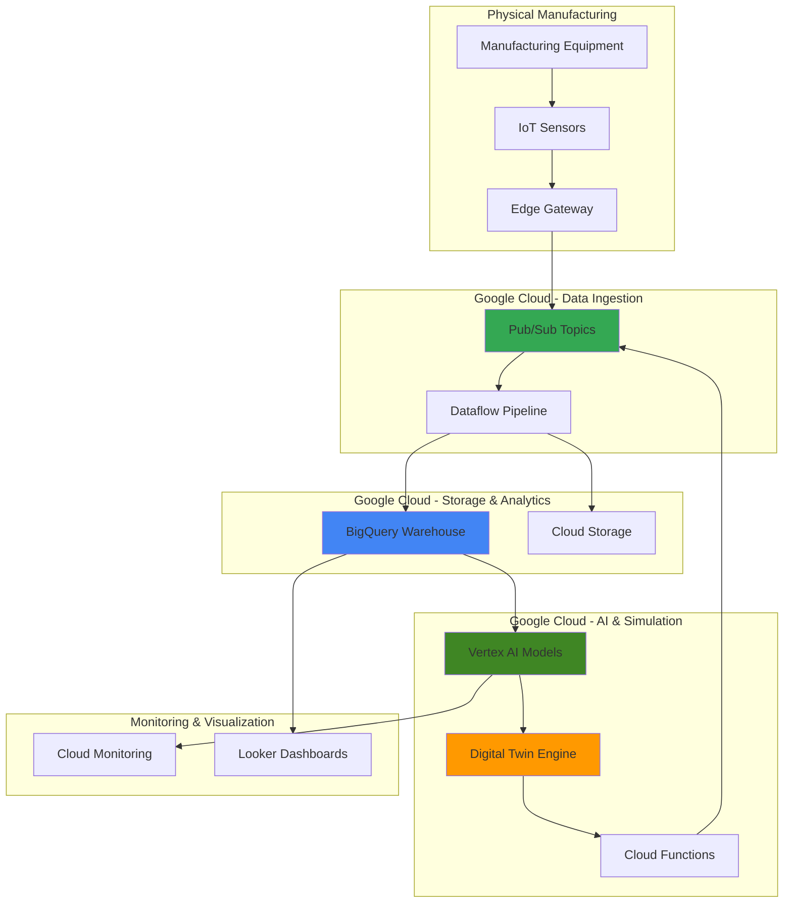

# Digital Twin Manufacturing Resilience with IoT and Vertex AI

## Problem

Manufacturing operations face critical downtime risks when equipment failures occur unexpectedly, with unplanned outages costing manufacturers an average of $50,000 per hour. Traditional resilience testing cannot be performed on live production systems due to safety risks and operational disruptions, leaving organizations blind to potential failure scenarios and recovery bottlenecks until actual incidents occur.

## Solution

Build a comprehensive digital twin system using Google Cloud services to create a safe, cloud-based replica of manufacturing equipment that ingests real-time IoT sensor data, simulates various failure scenarios using Vertex AI machine learning models, and tests recovery procedures without disrupting production operations. This approach enables proactive identification of vulnerabilities, optimization of recovery processes, and validation of resilience strategies before implementing them in the physical environment.

## Architecture Diagram



## Prerequisites

1. Google Cloud project with billing enabled and the following APIs enabled: Pub/Sub, Dataflow, BigQuery, Vertex AI, Cloud Functions, Cloud Storage
2. Google Cloud CLI installed and authenticated (or Cloud Shell access)
3. Basic understanding of IoT data flows, machine learning concepts, and manufacturing processes
4. Python 3.8+ for developing simulation models and data processing functions
5. Estimated cost: $50-100 for running this recipe (includes ML training, data processing, and storage)

> **Note**: This recipe simulates IoT data for demonstration purposes. In production environments, you would connect actual manufacturing sensors and equipment through secure edge gateways.

## Preparation

```bash
# Set environment variables for GCP resources
export PROJECT_ID="manufacturing-twin-$(date +%s)"
export REGION="us-central1"
export ZONE="us-central1-a"
export DATASET_NAME="manufacturing_data"
export BUCKET_NAME="manufacturing-twin-storage-$(openssl rand -hex 3)"

# Generate unique suffix for resource names
RANDOM_SUFFIX=$(openssl rand -hex 3)

# Set default project and region
gcloud config set project ${PROJECT_ID}
gcloud config set compute/region ${REGION}
gcloud config set compute/zone ${ZONE}

# Enable required APIs
gcloud services enable pubsub.googleapis.com
gcloud services enable dataflow.googleapis.com
gcloud services enable bigquery.googleapis.com
gcloud services enable aiplatform.googleapis.com
gcloud services enable cloudfunctions.googleapis.com
gcloud services enable storage.googleapis.com
gcloud services enable monitoring.googleapis.com

echo "✅ Project configured: ${PROJECT_ID}"
```

## Steps

1. **Create Pub/Sub Topics for IoT Data Ingestion**:

   Pub/Sub provides the foundational messaging infrastructure for ingesting real-time sensor data from manufacturing equipment. In production environments, edge gateways aggregate sensor data and publish messages to these topics, creating a scalable and reliable data pipeline that can handle millions of messages per second while maintaining data integrity and delivery guarantees.

   ```bash
   # Create topic for sensor data ingestion
   gcloud pubsub topics create manufacturing-sensor-data
   
   # Create topic for failure simulation events
   gcloud pubsub topics create failure-simulation-events
   
   # Create topic for recovery commands
   gcloud pubsub topics create recovery-commands
   
   # Create subscriptions for data processing
   gcloud pubsub subscriptions create sensor-data-processing \
       --topic=manufacturing-sensor-data
   
   gcloud pubsub subscriptions create simulation-processing \
       --topic=failure-simulation-events
   
   echo "✅ Pub/Sub topics and subscriptions created successfully"
   ```

   The messaging infrastructure is now established with dedicated channels for sensor telemetry, simulation events, and recovery coordination. This decoupled architecture enables independent scaling of data producers and consumers while providing built-in retry mechanisms and dead letter handling for robust data processing.

2. **Create BigQuery Dataset and Tables for Data Warehousing**:

   BigQuery serves as the central data warehouse for storing and analyzing manufacturing telemetry, providing petabyte-scale analytics capabilities with standard SQL interfaces. The schema design accommodates time-series sensor data, equipment metadata, and simulation results, enabling complex analytics queries for pattern recognition and anomaly detection across the entire manufacturing operation.

   ```bash
   # Create BigQuery dataset
   bq mk --location=${REGION} ${PROJECT_ID}:${DATASET_NAME}
   
   # Create sensor data table
   bq mk --table ${PROJECT_ID}:${DATASET_NAME}.sensor_data \
       timestamp:TIMESTAMP,equipment_id:STRING,sensor_type:STRING,\
value:FLOAT,unit:STRING,location:STRING
   
   # Create simulation results table
   bq mk --table ${PROJECT_ID}:${DATASET_NAME}.simulation_results \
       simulation_id:STRING,timestamp:TIMESTAMP,scenario:STRING,\
equipment_id:STRING,predicted_outcome:STRING,confidence:FLOAT,\
recovery_time:INTEGER
   
   # Create equipment metadata table
   bq mk --table ${PROJECT_ID}:${DATASET_NAME}.equipment_metadata \
       equipment_id:STRING,equipment_type:STRING,manufacturer:STRING,\
model:STRING,installation_date:DATE,criticality_level:STRING,\
location:STRING
   
   echo "✅ BigQuery dataset and tables created successfully"
   ```

   The data warehouse foundation is now ready with optimized schemas for time-series analytics and simulation tracking. BigQuery's columnar storage and automatic partitioning will provide sub-second query performance even as data volumes scale to billions of sensor readings and simulation events.

3. **Create Cloud Storage Bucket for Model Artifacts and Data Pipeline**:

   Cloud Storage provides scalable object storage for machine learning model artifacts, training data, and intermediate processing results. The bucket configuration includes lifecycle management policies to automatically transition historical data to cost-effective storage classes while maintaining immediate access to recent data for real-time analytics and model training.

   ```bash
   # Create storage bucket for model artifacts and data
   gsutil mb -p ${PROJECT_ID} \
       -c STANDARD \
       -l ${REGION} \
       gs://${BUCKET_NAME}
   
   # Enable versioning for model artifact management
   gsutil versioning set on gs://${BUCKET_NAME}
   
   # Create folder structure for organized data management
   echo "Creating folder structure..." | \
       gsutil cp - gs://${BUCKET_NAME}/models/.keep
   echo "Creating folder structure..." | \
       gsutil cp - gs://${BUCKET_NAME}/training-data/.keep
   echo "Creating folder structure..." | \
       gsutil cp - gs://${BUCKET_NAME}/simulation-configs/.keep
   echo "Creating folder structure..." | \
       gsutil cp - gs://${BUCKET_NAME}/temp/.keep
   
   echo "✅ Cloud Storage bucket created with organized structure"
   ```

   The storage infrastructure is now configured with versioning and organizational structure to support the machine learning lifecycle from data preparation through model deployment and simulation execution.

4. **Deploy Dataflow Pipeline for Real-time Data Processing**:

   Dataflow provides serverless stream processing to transform raw sensor data into structured formats suitable for analytics and machine learning. The pipeline implements windowing functions for temporal aggregation, applies data quality filters, and enriches sensor readings with equipment metadata, creating a robust foundation for downstream analytics and AI model training.

   ```bash
   # Create a simple Dataflow job template for sensor data processing
   cat > sensor_data_pipeline.py << 'EOF'
import apache_beam as beam
from apache_beam.options.pipeline_options import PipelineOptions
import json
from datetime import datetime
import os

class ProcessSensorData(beam.DoFn):
    def process(self, element):
        try:
            data = json.loads(element)
            # Add processing timestamp and validate data
            data['processing_timestamp'] = datetime.utcnow().isoformat()
            if 'equipment_id' in data and 'sensor_type' in data and 'value' in data:
                yield data
        except Exception as e:
            # Log error and continue processing
            yield beam.pvalue.TaggedOutput('errors', str(e))

def run_pipeline():
    PROJECT_ID = os.environ.get('PROJECT_ID')
    DATASET_NAME = os.environ.get('DATASET_NAME')
    pipeline_options = PipelineOptions()
    
    with beam.Pipeline(options=pipeline_options) as pipeline:
        sensor_data = (pipeline
            | 'Read from Pub/Sub' >> beam.io.ReadFromPubSub(
                topic=f'projects/{PROJECT_ID}/topics/manufacturing-sensor-data')
            | 'Process Data' >> beam.ParDo(ProcessSensorData()).with_outputs('errors', main='processed')
            | 'Write to BigQuery' >> beam.io.WriteToBigQuery(
                table=f'{PROJECT_ID}:{DATASET_NAME}.sensor_data',
                write_disposition=beam.io.BigQueryDisposition.WRITE_APPEND))

if __name__ == '__main__':
    run_pipeline()
EOF
   
   # Upload pipeline code to Cloud Storage
   gsutil cp sensor_data_pipeline.py gs://${BUCKET_NAME}/dataflow/
   
   echo "✅ Dataflow pipeline code prepared and uploaded"
   ```

   The stream processing pipeline is now configured to handle real-time sensor data transformation with error handling and BigQuery integration. This serverless approach automatically scales based on data volume and provides exactly-once processing guarantees for data integrity.

5. **Create Vertex AI Dataset for Failure Prediction Model**:

   Vertex AI provides managed machine learning services for training and deploying predictive models that can identify patterns indicative of equipment failures. The model training process uses historical sensor data to learn normal operating patterns and detect anomalies that could indicate impending failures, enabling proactive maintenance and resilience planning.

   ```bash
   # Create sample training data for failure prediction model
   cat > training_data.jsonl << 'EOF'
{"equipment_id": "pump_001", "temperature": 75.2, "vibration": 0.3, "pressure": 150.5, "failure_in_hours": 0}
{"equipment_id": "pump_001", "temperature": 78.1, "vibration": 0.4, "pressure": 148.2, "failure_in_hours": 0}
{"equipment_id": "pump_001", "temperature": 82.3, "vibration": 0.7, "pressure": 145.1, "failure_in_hours": 24}
{"equipment_id": "pump_001", "temperature": 85.4, "vibration": 1.2, "pressure": 142.8, "failure_in_hours": 12}
{"equipment_id": "compressor_002", "temperature": 68.5, "vibration": 0.2, "pressure": 200.1, "failure_in_hours": 0}
{"equipment_id": "compressor_002", "temperature": 71.2, "vibration": 0.5, "pressure": 195.3, "failure_in_hours": 48}
EOF
   
   # Upload training data to Cloud Storage
   gsutil cp training_data.jsonl gs://${BUCKET_NAME}/training-data/
   
   # Create managed dataset for tabular data using gcloud AI Platform
   gcloud ai datasets create \
       --display-name="manufacturing-failure-prediction" \
       --metadata-schema-uri="gs://google-cloud-aiplatform/schema/dataset/metadata/tabular_1.0.0.yaml" \
       --region=${REGION}
   
   # Get dataset ID
   DATASET_ID=$(gcloud ai datasets list \
       --region=${REGION} \
       --filter="displayName:manufacturing-failure-prediction" \
       --format="value(name)" | cut -d'/' -f6)
   
   echo "✅ Vertex AI dataset created with ID: ${DATASET_ID}"
   ```

   The machine learning foundation is established with a structured dataset that captures the relationship between sensor readings and equipment failure patterns. Vertex AI's managed training environment will handle model optimization, hyperparameter tuning, and validation to ensure reliable failure prediction capabilities.

6. **Deploy Digital Twin Simulation Engine using Cloud Functions**:

   Cloud Functions provides serverless compute for implementing the digital twin simulation logic that models equipment behavior, simulates failure scenarios, and tests recovery procedures. The function-based architecture enables rapid iteration on simulation algorithms while providing automatic scaling and cost-effective execution based on simulation workload demands.

   ```bash
   # Create Cloud Function for digital twin simulation
   mkdir -p digital_twin_simulation
   cd digital_twin_simulation
   
   cat > main.py << 'EOF'
import functions_framework
import json
import random
from datetime import datetime, timedelta
from google.cloud import pubsub_v1
import os

@functions_framework.http
def simulate_failure_scenario(request):
    """Simulate equipment failure scenarios for resilience testing"""
    
    publisher = pubsub_v1.PublisherClient()
    project_id = os.environ.get('PROJECT_ID')
    topic_path = publisher.topic_path(project_id, 'failure-simulation-events')
    
    # Parse simulation request
    request_json = request.get_json()
    equipment_id = request_json.get('equipment_id', 'pump_001')
    failure_type = request_json.get('failure_type', 'temperature_spike')
    duration_hours = request_json.get('duration_hours', 2)
    
    # Generate failure simulation data
    simulation_id = f"sim_{datetime.now().strftime('%Y%m%d_%H%M%S')}_{random.randint(1000, 9999)}"
    
    simulation_event = {
        'simulation_id': simulation_id,
        'equipment_id': equipment_id,
        'failure_type': failure_type,
        'start_time': datetime.utcnow().isoformat(),
        'duration_hours': duration_hours,
        'severity': random.choice(['low', 'medium', 'high']),
        'predicted_recovery_time': random.randint(30, 180),
        'business_impact': calculate_business_impact(failure_type, duration_hours)
    }
    
    # Publish simulation event
    future = publisher.publish(topic_path, json.dumps(simulation_event).encode('utf-8'))
    future.result()
    
    return {
        'simulation_id': simulation_id,
        'status': 'simulation_started',
        'details': simulation_event
    }

def calculate_business_impact(failure_type, duration_hours):
    """Calculate estimated business impact of failure scenario"""
    base_cost_per_hour = 50000  # $50k per hour downtime cost
    
    multipliers = {
        'temperature_spike': 1.2,
        'vibration_anomaly': 1.5,
        'pressure_drop': 2.0,
        'complete_failure': 3.0
    }
    
    multiplier = multipliers.get(failure_type, 1.0)
    total_impact = base_cost_per_hour * duration_hours * multiplier
    
    return {
        'estimated_cost': total_impact,
        'affected_production_lines': random.randint(1, 5),
        'recovery_complexity': 'high' if total_impact > 200000 else 'medium'
    }
EOF
   
   cat > requirements.txt << 'EOF'
functions-framework==3.*
google-cloud-pubsub==2.*
EOF
   
   # Deploy Cloud Function
   gcloud functions deploy digital-twin-simulator \
       --runtime python311 \
       --trigger-http \
       --entry-point simulate_failure_scenario \
       --source . \
       --set-env-vars PROJECT_ID=${PROJECT_ID} \
       --memory 256MB \
       --timeout 60s \
       --region ${REGION} \
       --allow-unauthenticated
   
   cd ..
   
   echo "✅ Digital twin simulation engine deployed successfully"
   ```

   The serverless simulation engine is now operational with capabilities to model various failure scenarios, calculate business impact, and trigger recovery testing procedures. This function-based approach provides the flexibility to rapidly develop and deploy new simulation algorithms as manufacturing requirements evolve.

7. **Create Monitoring Dashboard for Digital Twin Operations**:

   Cloud Monitoring provides comprehensive observability for the digital twin system, tracking key performance indicators, simulation results, and system health metrics. The dashboard configuration includes custom metrics for failure prediction accuracy, simulation execution times, and data pipeline throughput, enabling operational teams to monitor the digital twin's effectiveness and reliability.

   ```bash
   # Create monitoring dashboard configuration
   cat > dashboard_config.json << 'EOF'
{
  "displayName": "Manufacturing Digital Twin Dashboard",
  "mosaicLayout": {
    "tiles": [
      {
        "width": 6,
        "height": 4,
        "widget": {
          "title": "Sensor Data Ingestion Rate",
          "xyChart": {
            "dataSets": [
              {
                "timeSeriesQuery": {
                  "unitOverride": "1/s",
                  "timeSeriesFilter": {
                    "filter": "resource.type=\"pubsub_topic\"",
                    "aggregation": {
                      "alignmentPeriod": "60s",
                      "perSeriesAligner": "ALIGN_RATE"
                    }
                  }
                }
              }
            ]
          }
        }
      },
      {
        "width": 6,
        "height": 4,
        "widget": {
          "title": "Simulation Execution Metrics",
          "xyChart": {
            "dataSets": [
              {
                "timeSeriesQuery": {
                  "timeSeriesFilter": {
                    "filter": "resource.type=\"cloud_function\"",
                    "aggregation": {
                      "alignmentPeriod": "300s",
                      "perSeriesAligner": "ALIGN_MEAN"
                    }
                  }
                }
              }
            ]
          }
        }
      }
    ]
  }
}
EOF
   
   # Create custom dashboard
   gcloud monitoring dashboards create --config-from-file=dashboard_config.json
   
   echo "✅ Monitoring dashboard created for digital twin operations"
   ```

   The monitoring infrastructure is now configured to provide real-time visibility into digital twin performance, enabling proactive identification of system issues and optimization opportunities for the simulation and data processing workflows.

## Validation & Testing

1. **Verify Pub/Sub message flow and data ingestion**:

   ```bash
   # Test sensor data publication
   gcloud pubsub topics publish manufacturing-sensor-data \
       --message='{"equipment_id":"test_pump","sensor_type":"temperature","value":75.5,"unit":"celsius","timestamp":"2025-07-23T10:00:00Z"}'
   
   # Check subscription for message delivery
   gcloud pubsub subscriptions pull sensor-data-processing \
       --limit=1 \
       --format="value(message.data)" | base64 -d
   ```

   Expected output: JSON message with sensor data showing successful pub/sub message flow.

2. **Test digital twin simulation functionality**:

   ```bash
   # Get Cloud Function URL
   FUNCTION_URL=$(gcloud functions describe digital-twin-simulator \
       --region=${REGION} \
       --format="value(httpsTrigger.url)")
   
   # Trigger failure simulation
   curl -X POST ${FUNCTION_URL} \
       -H "Content-Type: application/json" \
       -d '{"equipment_id":"pump_001","failure_type":"temperature_spike","duration_hours":2}'
   ```

   Expected output: JSON response with simulation ID and scenario details.

3. **Verify BigQuery data ingestion and analytics capabilities**:

   ```bash
   # Query sensor data in BigQuery
   bq query --use_legacy_sql=false \
       "SELECT equipment_id, COUNT(*) as reading_count 
        FROM \`${PROJECT_ID}.${DATASET_NAME}.sensor_data\` 
        GROUP BY equipment_id 
        ORDER BY reading_count DESC"
   ```

   Expected output: Table showing equipment IDs and their respective sensor reading counts.

4. **Test Vertex AI dataset status**:

   ```bash
   # Check dataset status
   gcloud ai datasets describe ${DATASET_ID} \
       --region=${REGION} \
       --format="value(displayName,createTime)"
   ```

   Expected output: Dataset name and creation timestamp confirming successful setup.

## Cleanup

1. **Remove Cloud Functions and related resources**:

   ```bash
   # Delete Cloud Function
   gcloud functions delete digital-twin-simulator \
       --region=${REGION} \
       --quiet
   
   echo "✅ Cloud Function deleted"
   ```

2. **Remove BigQuery dataset and all tables**:

   ```bash
   # Delete BigQuery dataset
   bq rm -r -f ${PROJECT_ID}:${DATASET_NAME}
   
   echo "✅ BigQuery dataset deleted"
   ```

3. **Remove Pub/Sub topics and subscriptions**:

   ```bash
   # Delete subscriptions first
   gcloud pubsub subscriptions delete sensor-data-processing --quiet
   gcloud pubsub subscriptions delete simulation-processing --quiet
   
   # Delete topics
   gcloud pubsub topics delete manufacturing-sensor-data --quiet
   gcloud pubsub topics delete failure-simulation-events --quiet
   gcloud pubsub topics delete recovery-commands --quiet
   
   echo "✅ Pub/Sub resources deleted"
   ```

4. **Remove Cloud Storage bucket and contents**:

   ```bash
   # Remove storage bucket and all contents
   gsutil -m rm -r gs://${BUCKET_NAME}
   
   echo "✅ Cloud Storage bucket deleted"
   ```

5. **Remove Vertex AI dataset**:

   ```bash
   # Delete Vertex AI dataset
   gcloud ai datasets delete ${DATASET_ID} \
       --region=${REGION} \
       --quiet
   
   echo "✅ Vertex AI dataset deleted"
   ```

6. **Clean up monitoring dashboard**:

   ```bash
   # List and delete custom dashboards
   gcloud monitoring dashboards list \
       --filter="displayName:Manufacturing Digital Twin Dashboard" \
       --format="value(name)" | \
   xargs -I {} gcloud monitoring dashboards delete {} --quiet
   
   echo "✅ Monitoring dashboard deleted"
   ```

## Discussion

Digital twins represent a transformative approach to manufacturing resilience, enabling organizations to test failure scenarios and optimize recovery procedures without risking production systems. This implementation leverages Google Cloud's serverless and managed services to create a scalable, cost-effective digital twin platform that can handle enterprise-scale manufacturing operations following [Google Cloud's Architecture Framework](https://cloud.google.com/architecture/framework) principles.

The architecture demonstrates several key design principles for digital twin systems. First, the use of Pub/Sub for data ingestion provides a decoupled, scalable messaging layer that can handle millions of sensor readings per second while maintaining data integrity through built-in retry mechanisms and dead letter queues. Second, the combination of Dataflow and BigQuery creates a robust data pipeline that transforms raw sensor data into actionable insights through real-time stream processing and petabyte-scale analytics capabilities.

Vertex AI's role in this solution extends beyond simple predictive analytics to encompass comprehensive failure scenario modeling and optimization. The platform's AutoML capabilities can automatically discover patterns in sensor data that correlate with equipment failures, while custom models can simulate complex failure cascades and their business impacts. This AI-driven approach enables manufacturing teams to proactively identify vulnerabilities and develop targeted resilience strategies based on data-driven insights rather than assumptions.

The serverless architecture provides significant operational advantages over traditional on-premises digital twin implementations. Cloud Functions automatically scale simulation workloads based on demand, eliminating the need for dedicated compute infrastructure while ensuring cost-effective execution. Similarly, the managed nature of BigQuery, Dataflow, and Vertex AI reduces operational overhead and enables teams to focus on developing sophisticated simulation algorithms rather than managing infrastructure, aligning with [Google Cloud's operational excellence principles](https://cloud.google.com/architecture/framework/operational-excellence).

> **Tip**: Consider implementing automated alerting based on simulation results to notify operations teams when digital twin testing identifies potential resilience gaps or optimization opportunities using Cloud Monitoring alerts.

## Challenge

Extend this digital twin solution by implementing these advanced capabilities:

1. **Multi-Site Resilience Modeling**: Integrate data from multiple manufacturing facilities to simulate supply chain disruptions and cross-site failure impacts, using Cloud Spanner for global data consistency and Anthos for hybrid cloud deployments.

2. **Predictive Maintenance Integration**: Connect the digital twin to existing maintenance management systems using Apigee API management and implement automated work order generation based on failure predictions and simulation results.

3. **Real-Time Optimization Engine**: Develop a closed-loop optimization system using Vertex AI Pipelines that continuously adjusts manufacturing parameters based on digital twin insights, incorporating reinforcement learning models for dynamic optimization.

4. **Advanced Visualization and AR Integration**: Build immersive visualization dashboards using Looker and integrate with augmented reality systems for on-site technicians to visualize digital twin insights overlaid on physical equipment.

5. **Regulatory Compliance Automation**: Implement automated compliance reporting and audit trail generation using Cloud Logging and Security Command Center, ensuring digital twin testing and optimization activities meet industry regulations and standards.

## Infrastructure Code

*Infrastructure code will be generated after recipe approval.*