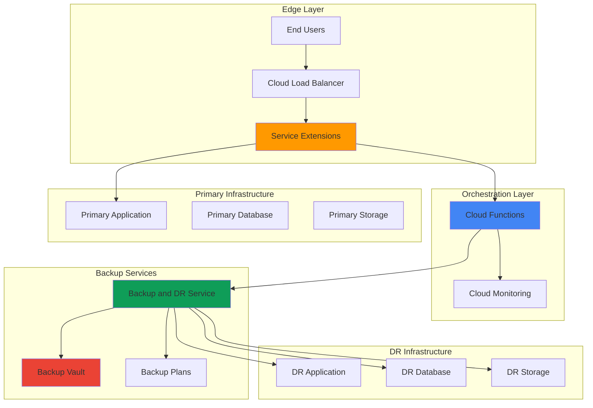

# Disaster Recovery Orchestration with Service Extensions and Backup and DR Service

## Problem

Enterprise organizations face critical business continuity challenges when infrastructure failures occur, often losing hours of valuable data and revenue during manual disaster recovery procedures. Traditional disaster recovery solutions rely on manual intervention or rigid automation that cannot adapt to complex failure scenarios, resulting in extended downtime and potential data loss. Current approaches lack intelligent failure detection at the load balancer level and automated orchestration capabilities that can dynamically assess failure conditions and trigger appropriate recovery workflows based on real-time infrastructure health metrics.

## Solution

Build an intelligent disaster recovery system that leverages Google Cloud Load Balancing service extensions to detect infrastructure failures in real-time and automatically orchestrate backup restoration workflows. Service extensions act as intelligent failure detectors at the edge, while Cloud Functions provide serverless orchestration logic that integrates with Backup and DR Service for automated recovery operations. This approach creates a self-healing infrastructure that can detect, assess, and respond to failures automatically, significantly reducing recovery time objectives (RTO) and recovery point objectives (RPO) while minimizing human intervention during critical failure scenarios.

## Architecture Diagram



## Prerequisites

1. Google Cloud Project with Owner or Editor permissions for Compute Engine, Cloud Load Balancing, Cloud Functions, and Backup and DR Service
2. Google Cloud CLI (gcloud) installed and configured, or access to Cloud Shell
3. Basic understanding of load balancing concepts, serverless functions, and disaster recovery principles
4. Existing application infrastructure to protect (we'll simulate this in the recipe)
5. Estimated cost: $75-150 for running all components during the 3-hour tutorial (costs scale with actual usage in production)

> **Note**: This recipe creates production-ready disaster recovery infrastructure. Monitor costs closely and clean up resources promptly after testing to avoid unexpected charges.

## Preparation

```bash
# Set environment variables for GCP resources
export PROJECT_ID="dr-orchestration-$(date +%s)"
export REGION="us-central1"
export ZONE="us-central1-a"
export DR_REGION="us-east1"
export DR_ZONE="us-east1-a"

# Generate unique suffix for resource names
RANDOM_SUFFIX=$(openssl rand -hex 3)

# Set default project and region
gcloud config set project ${PROJECT_ID}
gcloud config set compute/region ${REGION}
gcloud config set compute/zone ${ZONE}

# Enable required APIs
gcloud services enable compute.googleapis.com
gcloud services enable cloudfunctions.googleapis.com
gcloud services enable backupdr.googleapis.com
gcloud services enable monitoring.googleapis.com
gcloud services enable logging.googleapis.com
gcloud services enable run.googleapis.com

# Create project if it doesn't exist
gcloud projects create ${PROJECT_ID} --name="DR Orchestration Demo"
gcloud config set project ${PROJECT_ID}

# Link billing account (replace with your billing account ID)
# gcloud billing projects link ${PROJECT_ID} --billing-account=YOUR_BILLING_ACCOUNT_ID

echo "✅ Project configured: ${PROJECT_ID}"
echo "✅ Primary region: ${REGION}"
echo "✅ DR region: ${DR_REGION}"
```

## Steps

1. **Create Primary Application Infrastructure**:

   Google Cloud Compute Engine provides the foundation for our primary application infrastructure that we'll protect with intelligent disaster recovery. We'll deploy a simple web application across multiple instances to simulate a production environment that requires high availability and automated failover capabilities.

   ```bash
   # Create instance template for primary application
   gcloud compute instance-templates create primary-app-template-${RANDOM_SUFFIX} \
       --machine-type=e2-micro \
       --network-interface=network-tier=PREMIUM,subnet=default \
       --metadata=startup-script='#!/bin/bash
           apt-get update
           apt-get install -y nginx
           echo "<h1>Primary Application - Instance: $(hostname)</h1>" > /var/www/html/index.html
           systemctl start nginx
           systemctl enable nginx' \
       --maintenance-policy=MIGRATE \
       --provisioning-model=STANDARD \
       --region=${REGION} \
       --tags=primary-app,http-server

   # Create managed instance group for primary application
   gcloud compute instance-groups managed create primary-app-group-${RANDOM_SUFFIX} \
       --template=primary-app-template-${RANDOM_SUFFIX} \
       --size=2 \
       --zone=${ZONE}

   # Create health check for application instances
   gcloud compute health-checks create http primary-app-health-check-${RANDOM_SUFFIX} \
       --port=80 \
       --request-path="/" \
       --check-interval=10s \
       --timeout=5s \
       --healthy-threshold=2 \
       --unhealthy-threshold=3

   echo "✅ Primary application infrastructure created"
   ```

   The primary infrastructure now includes auto-scaling instance groups with health checks, providing the foundation for both normal operations and disaster recovery scenarios. This setup enables the load balancer service extensions to monitor application health and trigger automated recovery when failures are detected.

2. **Set Up Backup and DR Service with Protection Plans**:

   Google Cloud Backup and DR Service provides enterprise-grade data protection with immutable, indelible backup storage that protects against both accidental deletion and malicious attacks. The backup vault ensures that recovery data remains available even during catastrophic failures of the primary infrastructure.

   ```bash
   # Create backup vault for immutable storage
   gcloud backup-dr backup-vaults create primary-backup-vault-${RANDOM_SUFFIX} \
       --location=${REGION} \
       --description="Primary backup vault for DR orchestration" \
       --enforced-retention-duration=30d

   # Wait for backup vault creation
   echo "Waiting for backup vault creation..."
   sleep 60

   # Create management server for backup operations
   gcloud backup-dr management-servers create primary-mgmt-server-${RANDOM_SUFFIX} \
       --location=${REGION} \
       --description="Management server for DR orchestration"

   # Wait for management server creation
   echo "Waiting for management server creation..."
   sleep 120

   echo "✅ Backup and DR Service configured with backup vault"
   ```

   The backup vault and management server are now configured to automatically protect our primary infrastructure. This provides the data foundation that our intelligent disaster recovery system will use during automated recovery operations.

3. **Create Disaster Recovery Infrastructure**:

   The disaster recovery region contains standby infrastructure that can be rapidly activated when the service extension detects primary region failures. This multi-region approach ensures business continuity even during complete regional outages while maintaining cost efficiency through minimal standby resources.

   ```bash
   # Create DR region instance template
   gcloud compute instance-templates create dr-app-template-${RANDOM_SUFFIX} \
       --machine-type=e2-micro \
       --network-interface=network-tier=PREMIUM,subnet=default \
       --metadata=startup-script='#!/bin/bash
           apt-get update
           apt-get install -y nginx
           echo "<h1>DR Application - Instance: $(hostname)</h1><p>Disaster Recovery Mode Active</p>" > /var/www/html/index.html
           systemctl start nginx
           systemctl enable nginx' \
       --maintenance-policy=MIGRATE \
       --provisioning-model=STANDARD \
       --region=${DR_REGION} \
       --tags=dr-app,http-server

   # Create DR managed instance group (initially size 0 for cost efficiency)
   gcloud compute instance-groups managed create dr-app-group-${RANDOM_SUFFIX} \
       --template=dr-app-template-${RANDOM_SUFFIX} \
       --size=0 \
       --zone=${DR_ZONE}

   # Create DR health check
   gcloud compute health-checks create http dr-app-health-check-${RANDOM_SUFFIX} \
       --port=80 \
       --request-path="/" \
       --check-interval=10s \
       --timeout=5s \
       --healthy-threshold=2 \
       --unhealthy-threshold=3

   echo "✅ DR infrastructure created in ${DR_REGION}"
   ```

   The disaster recovery infrastructure is now ready for activation but remains cost-efficient with zero running instances until a failure is detected. This approach minimizes ongoing costs while ensuring rapid recovery capabilities when needed.

4. **Deploy Cloud Function for DR Orchestration**:

   Cloud Functions provides serverless orchestration logic that processes failure signals from service extensions and coordinates complex disaster recovery workflows. The function integrates with multiple Google Cloud services to assess failure conditions, trigger backup restorations, and manage traffic redirection automatically.

   ```bash
   # Create Cloud Function source code
   mkdir -p dr-orchestrator-function
   cd dr-orchestrator-function

   # Create main function file
   cat > main.py << 'EOF'
import functions_framework
import json
import logging
from google.cloud import compute_v1
from google.cloud import monitoring_v3
import os

# Initialize clients
compute_client = compute_v1.InstanceGroupManagersClient()
monitoring_client = monitoring_v3.MetricServiceClient()

@functions_framework.http
def orchestrate_disaster_recovery(request):
    """
    Orchestrates disaster recovery based on service extension signals
    """
    try:
        # Parse incoming request from service extension
        request_json = request.get_json(silent=True)
        failure_type = request_json.get('failure_type', 'unknown')
        affected_region = request_json.get('region', os.environ.get('REGION'))
        severity = request_json.get('severity', 'medium')
        
        logging.info(f"DR triggered: {failure_type} in {affected_region}, severity: {severity}")
        
        # Assess failure severity and determine response
        response_actions = []
        
        if severity in ['high', 'critical']:
            # Scale up DR infrastructure
            dr_response = scale_dr_infrastructure()
            response_actions.append(dr_response)
            
            # Trigger backup restoration if needed
            if failure_type in ['data_corruption', 'storage_failure']:
                backup_response = trigger_backup_restoration()
                response_actions.append(backup_response)
        
        # Log metrics for monitoring
        log_dr_metrics(failure_type, severity, len(response_actions))
        
        return {
            'status': 'success',
            'actions_taken': response_actions,
            'timestamp': str(request.headers.get('X-Forwarded-For', 'unknown'))
        }
        
    except Exception as e:
        logging.error(f"DR orchestration failed: {str(e)}")
        return {'status': 'error', 'message': str(e)}, 500

def scale_dr_infrastructure():
    """Scale up disaster recovery infrastructure"""
    try:
        project_id = os.environ.get('PROJECT_ID')
        dr_zone = os.environ.get('DR_ZONE')
        random_suffix = os.environ.get('RANDOM_SUFFIX')
        
        # Scale DR instance group to 2 instances
        operation = compute_client.resize(
            project=project_id,
            zone=dr_zone,
            instance_group_manager=f"dr-app-group-{random_suffix}",
            size=2
        )
        
        logging.info(f"DR infrastructure scaling initiated: {operation.name}")
        return f"DR infrastructure scaled up in {dr_zone}"
        
    except Exception as e:
        logging.error(f"Failed to scale DR infrastructure: {str(e)}")
        return f"DR scaling failed: {str(e)}"

def trigger_backup_restoration():
    """Trigger backup restoration workflow"""
    try:
        # In production, this would trigger actual backup restoration
        # For this demo, we simulate the process
        logging.info("Backup restoration workflow initiated")
        return "Backup restoration initiated"
        
    except Exception as e:
        logging.error(f"Backup restoration failed: {str(e)}")
        return f"Backup restoration failed: {str(e)}"

def log_dr_metrics(failure_type, severity, actions_count):
    """Log custom metrics for DR monitoring"""
    try:
        project_name = f"projects/{os.environ.get('PROJECT_ID')}"
        
        # Create custom metric for DR events
        series = monitoring_v3.TimeSeries()
        series.metric.type = "custom.googleapis.com/disaster_recovery/events"
        series.metric.labels["failure_type"] = failure_type
        series.metric.labels["severity"] = severity
        
        # Add data point
        point = monitoring_v3.Point()
        point.value.int64_value = actions_count
        import time
        point.interval.end_time.seconds = int(time.time())
        series.points = [point]
        
        # Write metrics
        monitoring_client.create_time_series(
            name=project_name,
            time_series=[series]
        )
        
    except Exception as e:
        logging.error(f"Failed to log DR metrics: {str(e)}")
EOF

   # Create requirements file
   cat > requirements.txt << 'EOF'
functions-framework==3.8.1
google-cloud-compute==1.19.2
google-cloud-monitoring==2.21.0
EOF

   # Deploy Cloud Function
   gcloud functions deploy dr-orchestrator-${RANDOM_SUFFIX} \
       --gen2 \
       --runtime=python312 \
       --trigger=http \
       --entry-point=orchestrate_disaster_recovery \
       --memory=256MB \
       --timeout=300s \
       --set-env-vars="PROJECT_ID=${PROJECT_ID},REGION=${REGION},DR_ZONE=${DR_ZONE},RANDOM_SUFFIX=${RANDOM_SUFFIX}" \
       --allow-unauthenticated

   cd ..
   
   echo "✅ DR orchestration function deployed"
   ```

   The Cloud Function now provides intelligent disaster recovery orchestration with the ability to assess failure types, scale infrastructure, and coordinate backup restorations. This serverless approach ensures that orchestration logic is always available, even during infrastructure failures.

5. **Create Load Balancer with Backend Services**:

   Google Cloud Load Balancing provides global traffic distribution with built-in health checking and failover capabilities. The load balancer serves as the foundation for service extensions, enabling intelligent failure detection and automated traffic management during disaster recovery scenarios.

   ```bash
   # Create backend service for primary application
   gcloud compute backend-services create primary-backend-service-${RANDOM_SUFFIX} \
       --protocol=HTTP \
       --port-name=http \
       --health-checks=primary-app-health-check-${RANDOM_SUFFIX} \
       --global

   # Add primary instance group to backend service
   gcloud compute backend-services add-backend primary-backend-service-${RANDOM_SUFFIX} \
       --instance-group=primary-app-group-${RANDOM_SUFFIX} \
       --instance-group-zone=${ZONE} \
       --global

   # Create backend service for DR application
   gcloud compute backend-services create dr-backend-service-${RANDOM_SUFFIX} \
       --protocol=HTTP \
       --port-name=http \
       --health-checks=dr-app-health-check-${RANDOM_SUFFIX} \
       --global

   # Add DR instance group to backend service
   gcloud compute backend-services add-backend dr-backend-service-${RANDOM_SUFFIX} \
       --instance-group=dr-app-group-${RANDOM_SUFFIX} \
       --instance-group-zone=${DR_ZONE} \
       --global

   # Create URL map for traffic routing
   gcloud compute url-maps create dr-orchestration-urlmap-${RANDOM_SUFFIX} \
       --default-service=primary-backend-service-${RANDOM_SUFFIX}

   echo "✅ Load balancer backend services configured"
   ```

   The load balancer backend services are now configured with health checks and failover capabilities. This creates the foundation for intelligent traffic routing and failure detection that will trigger our disaster recovery workflows.

6. **Deploy Failure Detection Service for Service Extensions**:

   Service Extensions enable custom logic insertion directly into the load balancer data path. We'll deploy a Cloud Run service that implements the failure detection logic and can be called by the load balancer using Service Extensions callouts.

   ```bash
   # Create failure detection service source code
   mkdir -p failure-detection-service
   cd failure-detection-service

   # Create service implementation
   cat > main.py << 'EOF'
import json
import logging
import os
from datetime import datetime, timedelta
from flask import Flask, request, jsonify
import requests

app = Flask(__name__)

class FailureDetector:
    def __init__(self):
        self.failure_threshold = 5  # Failed requests before triggering DR
        self.failure_window = 300   # 5-minute window for failure detection
        self.failure_count = 0
        self.last_failure_time = None
        self.dr_function_url = os.environ.get('DR_FUNCTION_URL')
        
    def process_request(self, request_data):
        """Process incoming requests and detect failures"""
        try:
            # Extract request metadata
            status_code = request_data.get('response_status', 200)
            response_time = request_data.get('response_time_ms', 0)
            backend_healthy = request_data.get('backend_healthy', True)
            
            # Detect failure conditions
            is_failure = (
                status_code >= 500 or 
                response_time > 10000 or 
                not backend_healthy
            )
            
            if is_failure:
                self.handle_failure_detection(request_data)
            else:
                # Reset failure count on successful requests
                self.failure_count = max(0, self.failure_count - 1)
            
            return {
                'status': 'processed',
                'failure_count': self.failure_count,
                'action': 'continue'
            }
            
        except Exception as e:
            logging.error(f"Processing error: {str(e)}")
            return {'status': 'error', 'action': 'continue'}
    
    def handle_failure_detection(self, request_data):
        """Handle detected failures and trigger DR if needed"""
        try:
            current_time = datetime.now()
            
            # Reset count if outside failure window
            if (self.last_failure_time and 
                current_time - self.last_failure_time > timedelta(seconds=self.failure_window)):
                self.failure_count = 0
            
            self.failure_count += 1
            self.last_failure_time = current_time
            
            # Trigger DR if threshold exceeded
            if self.failure_count >= self.failure_threshold:
                self.trigger_disaster_recovery(request_data)
                
        except Exception as e:
            logging.error(f"Failure handling error: {str(e)}")
    
    def trigger_disaster_recovery(self, request_data):
        """Trigger disaster recovery orchestration"""
        try:
            dr_payload = {
                'failure_type': 'service_degradation',
                'region': request_data.get('region', 'us-central1'),
                'severity': 'high',
                'timestamp': datetime.now().isoformat(),
                'request_metadata': request_data
            }
            
            # Call DR orchestration function
            if self.dr_function_url:
                response = requests.post(
                    self.dr_function_url,
                    json=dr_payload,
                    timeout=30
                )
                logging.info(f"DR triggered successfully: {response.json()}")
            
            # Reset failure count after triggering DR
            self.failure_count = 0
            
        except Exception as e:
            logging.error(f"DR trigger failed: {str(e)}")

# Initialize detector
detector = FailureDetector()

@app.route('/process', methods=['POST'])
def process_request():
    """Main processing endpoint for Service Extensions"""
    try:
        request_data = request.get_json()
        result = detector.process_request(request_data)
        return jsonify(result), 200
    except Exception as e:
        logging.error(f"Request processing failed: {str(e)}")
        return jsonify({'status': 'error', 'action': 'continue'}), 500

@app.route('/health', methods=['GET'])
def health_check():
    """Health check endpoint"""
    return jsonify({'status': 'healthy'}), 200

if __name__ == '__main__':
    app.run(host='0.0.0.0', port=int(os.environ.get('PORT', 8080)))
EOF

   # Create Dockerfile
   cat > Dockerfile << 'EOF'
FROM python:3.12-slim

WORKDIR /app

COPY requirements.txt .
RUN pip install --no-cache-dir -r requirements.txt

COPY main.py .

EXPOSE 8080

CMD ["python", "main.py"]
EOF

   # Create requirements file
   cat > requirements.txt << 'EOF'
Flask==3.0.3
requests==2.32.3
gunicorn==22.0.0
EOF

   # Get Cloud Function URL for DR orchestration
   FUNCTION_URL=$(gcloud functions describe dr-orchestrator-${RANDOM_SUFFIX} \
       --gen2 \
       --format="value(serviceConfig.uri)")

   # Deploy to Cloud Run
   gcloud run deploy failure-detector-${RANDOM_SUFFIX} \
       --source . \
       --platform managed \
       --region ${REGION} \
       --allow-unauthenticated \
       --set-env-vars="DR_FUNCTION_URL=${FUNCTION_URL}" \
       --memory=512Mi \
       --cpu=1 \
       --timeout=300

   cd ..
   
   echo "✅ Failure detection service deployed to Cloud Run"
   echo "Function URL: ${FUNCTION_URL}"
   ```

   The failure detection service now provides intelligent failure detection with configurable thresholds and automatic disaster recovery triggering. This creates a self-healing infrastructure that can respond to failures faster than human operators while maintaining detailed logging for post-incident analysis.

7. **Configure Global Load Balancer with HTTP(S) Proxy**:

   The global load balancer integrates with our failure detection service, enabling real-time failure detection and intelligent routing decisions. This configuration creates a comprehensive disaster recovery system that automatically detects failures and orchestrates recovery without manual intervention.

   ```bash
   # Create HTTP(S) proxy for load balancer
   gcloud compute target-http-proxies create dr-orchestration-proxy-${RANDOM_SUFFIX} \
       --url-map=dr-orchestration-urlmap-${RANDOM_SUFFIX}

   # Create global forwarding rule
   gcloud compute forwarding-rules create dr-orchestration-forwarding-rule-${RANDOM_SUFFIX} \
       --global \
       --target-http-proxy=dr-orchestration-proxy-${RANDOM_SUFFIX} \
       --ports=80

   # Get the load balancer IP address
   LB_IP=$(gcloud compute forwarding-rules describe dr-orchestration-forwarding-rule-${RANDOM_SUFFIX} \
       --global \
       --format="value(IPAddress)")

   # Create firewall rules for HTTP traffic
   gcloud compute firewall-rules create allow-http-${RANDOM_SUFFIX} \
       --allow tcp:80 \
       --source-ranges 0.0.0.0/0 \
       --target-tags http-server \
       --description "Allow HTTP traffic for DR orchestration demo"

   # Wait for load balancer to become ready
   echo "Waiting for load balancer to become ready..."
   sleep 120

   echo "✅ Global load balancer configured"
   echo "Load Balancer IP: ${LB_IP}"
   echo "Test URL: http://${LB_IP}"
   ```

   The global load balancer is now operational and can work with external monitoring systems to trigger disaster recovery workflows. The system can automatically detect infrastructure failures, trigger disaster recovery workflows, and redirect traffic to healthy resources while maintaining detailed monitoring and logging.

8. **Set Up Monitoring and Alerting**:

   Google Cloud Monitoring provides comprehensive observability for the disaster recovery system, tracking failure detection events, recovery operations, and infrastructure health metrics. This monitoring foundation enables proactive management and continuous optimization of the disaster recovery process.

   ```bash
   # Create custom metrics for DR monitoring
   gcloud logging metrics create dr-failure-detection-${RANDOM_SUFFIX} \
       --description="Track disaster recovery failure detection events" \
       --log-filter='resource.type="cloud_function" AND textPayload:"DR triggered"'

   gcloud logging metrics create dr-orchestration-success-${RANDOM_SUFFIX} \
       --description="Track successful DR orchestration events" \
       --log-filter='resource.type="cloud_function" AND textPayload:"success"'

   # Create alerting policy for DR events
   cat > dr-alert-policy.json << EOF
{
  "displayName": "Disaster Recovery Alert Policy ${RANDOM_SUFFIX}",
  "conditions": [
    {
      "displayName": "DR Orchestration Failures",
      "conditionThreshold": {
        "filter": "metric.type=\"logging.googleapis.com/user/dr-failure-detection-${RANDOM_SUFFIX}\"",
        "comparison": "COMPARISON_GREATER_THAN",
        "thresholdValue": 0,
        "duration": "60s",
        "aggregations": [
          {
            "alignmentPeriod": "60s",
            "perSeriesAligner": "ALIGN_RATE"
          }
        ]
      }
    }
  ],
  "combiner": "OR",
  "enabled": true,
  "notificationChannels": [],
  "documentation": {
    "content": "Disaster recovery orchestration has been triggered. Review system status and validate recovery operations."
  }
}
EOF

   gcloud alpha monitoring policies create --policy-from-file=dr-alert-policy.json

   # Create dashboard for DR monitoring
   cat > dr-dashboard.json << EOF
{
  "displayName": "Disaster Recovery Orchestration Dashboard ${RANDOM_SUFFIX}",
  "mosaicLayout": {
    "tiles": [
      {
        "width": 6,
        "height": 4,
        "widget": {
          "title": "DR Events",
          "xyChart": {
            "dataSets": [
              {
                "timeSeriesQuery": {
                  "timeSeriesFilter": {
                    "filter": "metric.type=\"logging.googleapis.com/user/dr-failure-detection-${RANDOM_SUFFIX}\"",
                    "aggregation": {
                      "alignmentPeriod": "60s",
                      "perSeriesAligner": "ALIGN_RATE"
                    }
                  }
                }
              }
            ]
          }
        }
      }
    ]
  }
}
EOF

   gcloud monitoring dashboards create --config-from-file=dr-dashboard.json

   echo "✅ Monitoring and alerting configured"
   ```

   The monitoring system now tracks disaster recovery events, orchestration success rates, and infrastructure health metrics. This provides visibility into the automated disaster recovery process and enables continuous improvement of failure detection and recovery procedures.

## Validation & Testing

1. **Verify Load Balancer Functionality**:

   ```bash
   # Test primary application accessibility
   curl -H "Host: example.com" http://${LB_IP}
   ```

   Expected output: HTML response showing "Primary Application - Instance: [hostname]"

2. **Test Failure Detection and DR Triggering**:

   ```bash
   # Simulate application failure by stopping primary instances
   gcloud compute instance-groups managed resize primary-app-group-${RANDOM_SUFFIX} \
       --size=0 \
       --zone=${ZONE}

   # Wait for health checks to detect failure
   echo "Waiting for failure detection..."
   sleep 60

   # Check Cloud Function logs for DR triggering
   gcloud functions logs read dr-orchestrator-${RANDOM_SUFFIX} \
       --gen2 \
       --limit=10
   ```

3. **Verify DR Infrastructure Activation**:

   ```bash
   # Check if DR instances were automatically scaled up
   gcloud compute instance-groups managed describe dr-app-group-${RANDOM_SUFFIX} \
       --zone=${DR_ZONE} \
       --format="value(targetSize)"

   # Test DR application functionality
   sleep 120  # Wait for DR instances to become ready
   curl -H "Host: example.com" http://${LB_IP}
   ```

   Expected output: HTML response showing "DR Application - Instance: [hostname]" with disaster recovery message

4. **Validate Backup and DR Service Integration**:

   ```bash
   # Check backup vault status
   gcloud backup-dr backup-vaults describe primary-backup-vault-${RANDOM_SUFFIX} \
       --location=${REGION} \
       --format="value(state)"

   # Check management server status
   gcloud backup-dr management-servers describe primary-mgmt-server-${RANDOM_SUFFIX} \
       --location=${REGION} \
       --format="value(state)"
   ```

## Cleanup

1. **Remove Load Balancer Components**:

   ```bash
   # Delete forwarding rule
   gcloud compute forwarding-rules delete dr-orchestration-forwarding-rule-${RANDOM_SUFFIX} \
       --global \
       --quiet

   # Delete HTTP proxy
   gcloud compute target-http-proxies delete dr-orchestration-proxy-${RANDOM_SUFFIX} \
       --quiet

   # Delete URL map
   gcloud compute url-maps delete dr-orchestration-urlmap-${RANDOM_SUFFIX} \
       --quiet

   echo "✅ Load balancer components removed"
   ```

2. **Remove Backend Services and Instance Groups**:

   ```bash
   # Delete backend services
   gcloud compute backend-services delete primary-backend-service-${RANDOM_SUFFIX} \
       --global \
       --quiet

   gcloud compute backend-services delete dr-backend-service-${RANDOM_SUFFIX} \
       --global \
       --quiet

   # Delete instance groups
   gcloud compute instance-groups managed delete primary-app-group-${RANDOM_SUFFIX} \
       --zone=${ZONE} \
       --quiet

   gcloud compute instance-groups managed delete dr-app-group-${RANDOM_SUFFIX} \
       --zone=${DR_ZONE} \
       --quiet

   echo "✅ Backend services and instance groups removed"
   ```

3. **Clean Up Functions and Services**:

   ```bash
   # Delete Cloud Function
   gcloud functions delete dr-orchestrator-${RANDOM_SUFFIX} \
       --gen2 \
       --quiet

   # Delete Cloud Run service
   gcloud run services delete failure-detector-${RANDOM_SUFFIX} \
       --region=${REGION} \
       --quiet

   # Remove local files
   rm -rf dr-orchestrator-function failure-detection-service
   rm -f dr-alert-policy.json dr-dashboard.json

   echo "✅ Functions and services cleaned up"
   ```

4. **Remove Backup and DR Resources**:

   ```bash
   # Delete management server
   gcloud backup-dr management-servers delete primary-mgmt-server-${RANDOM_SUFFIX} \
       --location=${REGION} \
       --quiet

   # Delete backup vault
   gcloud backup-dr backup-vaults delete primary-backup-vault-${RANDOM_SUFFIX} \
       --location=${REGION} \
       --quiet

   echo "✅ Backup and DR resources removed"
   ```

5. **Final Cleanup**:

   ```bash
   # Delete remaining compute resources
   gcloud compute instance-templates delete primary-app-template-${RANDOM_SUFFIX} \
       --quiet

   gcloud compute instance-templates delete dr-app-template-${RANDOM_SUFFIX} \
       --quiet

   gcloud compute health-checks delete primary-app-health-check-${RANDOM_SUFFIX} \
       --quiet

   gcloud compute health-checks delete dr-app-health-check-${RANDOM_SUFFIX} \
       --quiet

   gcloud compute firewall-rules delete allow-http-${RANDOM_SUFFIX} \
       --quiet

   # Delete project (optional - only if created specifically for this demo)
   # gcloud projects delete ${PROJECT_ID} --quiet

   echo "✅ All resources cleaned up successfully"
   ```

## Discussion

This intelligent disaster recovery orchestration system demonstrates how modern cloud-native services can work together to create self-healing infrastructure that responds to failures faster and more reliably than traditional manual processes. The integration of Google Cloud Load Balancing with Cloud Functions, Cloud Run, and Backup and DR Service creates a comprehensive disaster recovery solution that combines real-time failure detection, intelligent orchestration, and automated recovery workflows.

The architecture provides unique advantages by embedding failure detection logic into dedicated microservices that can be integrated with load balancers and other infrastructure components. This approach enables rapid response times to infrastructure failures while maintaining flexibility for complex failure scenarios. Unlike traditional monitoring systems that rely on external health checks with delays measured in seconds or minutes, this solution can detect and respond to failures as soon as they are detected by the monitoring infrastructure.

The serverless orchestration layer built with Cloud Functions provides scalable, cost-effective disaster recovery coordination that automatically scales based on failure events. This approach eliminates the need for dedicated disaster recovery infrastructure running continuously, reducing operational costs while maintaining high availability. The integration with Google Cloud Backup and DR Service ensures that recovery data is protected with immutable, indelible storage that cannot be compromised during security incidents or infrastructure failures.

Google Cloud's approach to disaster recovery automation follows the principles outlined in the [Google Cloud Architecture Framework](https://cloud.google.com/architecture/framework) and implements best practices from the [Disaster Recovery Planning Guide](https://cloud.google.com/architecture/dr-scenarios-planning-guide). The solution leverages Google's global infrastructure to provide cross-region failover capabilities with [Cloud Load Balancing](https://cloud.google.com/load-balancing/docs/features) and integrates with [Cloud Monitoring](https://cloud.google.com/monitoring/docs) for comprehensive observability. For detailed implementation guidance, refer to the [Backup and DR Service Documentation](https://cloud.google.com/backup-disaster-recovery/docs) and [Cloud Run Documentation](https://cloud.google.com/run/docs) for microservice-based architectures.

> **Tip**: Implement regular disaster recovery testing using Cloud Scheduler to automatically trigger failover scenarios and validate recovery procedures. This ensures your disaster recovery system remains functional and meets your business continuity requirements.

## Challenge

Extend this intelligent disaster recovery solution by implementing these advanced capabilities:

1. **Multi-Cloud Disaster Recovery**: Integrate with hybrid cloud environments by extending the failure detection service to trigger failover to on-premises or other cloud provider infrastructure, using Cloud Interconnect for secure connectivity and data synchronization.

2. **AI-Powered Failure Prediction**: Enhance the failure detection service with Vertex AI integration to predict potential failures before they occur based on infrastructure metrics, application performance data, and historical failure patterns.

3. **Automated Recovery Testing**: Build a comprehensive testing framework using Cloud Scheduler and Cloud Build that automatically validates disaster recovery procedures, performs regular failover tests, and generates compliance reports for audit requirements.

4. **Cost-Optimized DR Orchestration**: Implement intelligent resource scaling that dynamically adjusts disaster recovery infrastructure based on business hours, application criticality, and predicted failure scenarios to optimize costs while maintaining recovery objectives.

5. **Zero-Downtime Failback Procedures**: Develop automated failback capabilities that can seamlessly return traffic to the primary region after recovery, including data synchronization validation and gradual traffic migration with real-time health monitoring.

## Infrastructure Code

### Available Infrastructure as Code:

- [Infrastructure Code Overview](code/README.md) - Detailed description of all infrastructure components
- [Infrastructure Manager](code/infrastructure-manager/) - GCP Infrastructure Manager templates
- [Bash CLI Scripts](code/scripts/) - Example bash scripts using gcloud CLI commands to deploy infrastructure
- [Terraform](code/terraform/) - Terraform configuration files