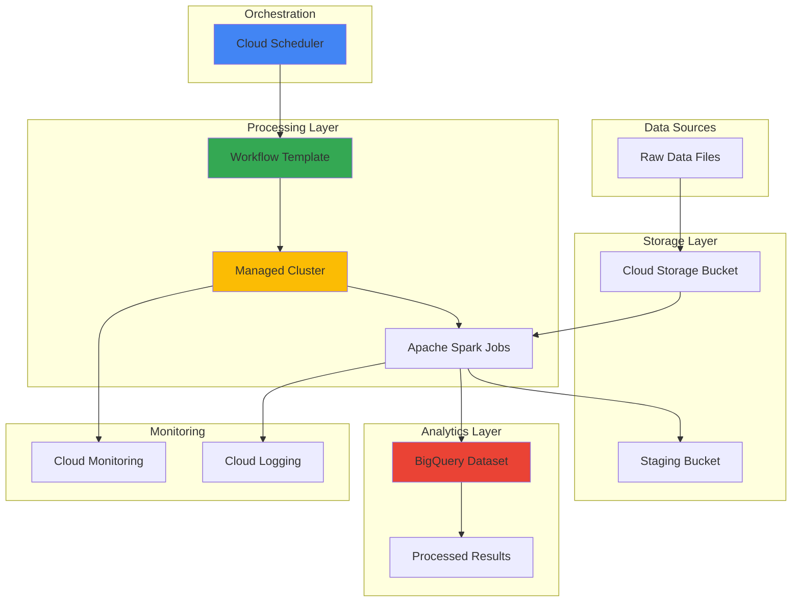

# Distributed Data Processing Workflows with Cloud Dataproc and Cloud Scheduler

## Problem

Modern enterprises collect vast amounts of data from multiple sources requiring regular batch processing, transformation, and analysis. Manual execution of Apache Spark jobs on distributed clusters creates operational overhead, inconsistent processing schedules, and increased risk of human error. Organizations need automated, reliable data processing pipelines that can scale with growing datasets while maintaining cost efficiency and processing quality.

## Solution

Build an automated data processing pipeline that combines Cloud Dataproc's managed Apache Spark clusters with Cloud Scheduler's cron-based job orchestration. This solution creates workflow templates that define reusable Spark processing jobs, automatically provisions ephemeral clusters for cost optimization, processes data stored in Cloud Storage, and exports results to BigQuery for analysis. The architecture ensures reliable execution, automatic scaling, and comprehensive monitoring.

## Architecture Diagram



## Prerequisites

1. Google Cloud Project with billing enabled and appropriate permissions for Dataproc, Cloud Scheduler, Cloud Storage, and BigQuery
2. Google Cloud CLI (gcloud) installed and configured (version 400.0.0 or later)
3. Basic understanding of Apache Spark, data processing workflows, and cron expressions
4. Familiarity with BigQuery and SQL for data analysis
5. Estimated cost: $10-25 for running this tutorial (primarily Compute Engine and BigQuery usage)

> **Note**: This recipe uses ephemeral clusters that automatically delete after job completion to minimize costs. Review [Google Cloud Dataproc pricing](https://cloud.google.com/dataproc/pricing) for detailed cost information.

## Preparation

```bash
# Set environment variables for Google Cloud resources
export PROJECT_ID="dataproc-workflow-$(date +%s)"
export REGION="us-central1"
export ZONE="us-central1-a"

# Generate unique suffix for resource names
RANDOM_SUFFIX=$(openssl rand -hex 3)
export BUCKET_NAME="dataproc-data-${RANDOM_SUFFIX}"
export STAGING_BUCKET="dataproc-staging-${RANDOM_SUFFIX}"
export DATASET_NAME="analytics_results"
export WORKFLOW_NAME="sales-analytics-workflow"

# Set default project and region
gcloud config set project ${PROJECT_ID}
gcloud config set compute/region ${REGION}
gcloud config set compute/zone ${ZONE}

# Enable required Google Cloud APIs
gcloud services enable dataproc.googleapis.com
gcloud services enable cloudscheduler.googleapis.com
gcloud services enable storage.googleapis.com
gcloud services enable bigquery.googleapis.com
gcloud services enable compute.googleapis.com

echo "✅ Project configured: ${PROJECT_ID}"
echo "✅ Required APIs enabled"
```

## Steps

1. **Create Cloud Storage Buckets for Data Lake**:

   Cloud Storage provides the foundation for a scalable data lake architecture with strong consistency and global access. Creating separate buckets for input data and staging ensures proper data organization while supporting the distributed nature of Apache Spark processing. This separation also enables better security controls and lifecycle management policies.

   ```bash
   # Create main data bucket for input files
   gsutil mb -p ${PROJECT_ID} \
       -c STANDARD \
       -l ${REGION} \
       gs://${BUCKET_NAME}
   
   # Create staging bucket for Dataproc operations
   gsutil mb -p ${PROJECT_ID} \
       -c STANDARD \
       -l ${REGION} \
       gs://${STAGING_BUCKET}
   
   # Enable versioning for data protection
   gsutil versioning set on gs://${BUCKET_NAME}
   gsutil versioning set on gs://${STAGING_BUCKET}
   
   echo "✅ Storage buckets created and configured"
   ```

   The storage infrastructure is now established with versioning enabled for data protection. These buckets will serve as the primary data repositories, with the main bucket storing raw data files and the staging bucket handling temporary files generated during Spark job execution.

2. **Create Sample Data for Processing**:

   Sample sales data simulates real-world scenarios where businesses need to process transaction records, customer information, and product data. This synthetic dataset demonstrates typical data processing patterns including aggregation, filtering, and transformation that are common in business analytics workflows.

   ```bash
   # Create sample sales data file
   cat > sales_data.csv << 'EOF'
   transaction_id,customer_id,product_id,product_name,category,quantity,unit_price,transaction_date,region
   T001,C001,P001,Laptop Pro,Electronics,2,1299.99,2024-01-15,North
   T002,C002,P002,Coffee Maker,Appliances,1,89.99,2024-01-15,South
   T003,C003,P003,Running Shoes,Sports,1,129.99,2024-01-16,East
   T004,C001,P004,Wireless Mouse,Electronics,3,29.99,2024-01-16,North
   T005,C004,P005,Yoga Mat,Sports,2,49.99,2024-01-17,West
   T006,C005,P001,Laptop Pro,Electronics,1,1299.99,2024-01-17,South
   T007,C002,P006,Blender,Appliances,1,199.99,2024-01-18,South
   T008,C006,P003,Running Shoes,Sports,2,129.99,2024-01-18,East
   T009,C007,P007,Gaming Chair,Furniture,1,399.99,2024-01-19,North
   T010,C003,P008,Desk Lamp,Furniture,1,79.99,2024-01-19,East
   EOF
   
   # Upload sample data to Cloud Storage
   gsutil cp sales_data.csv gs://${BUCKET_NAME}/input/
   
   echo "✅ Sample sales data uploaded to Cloud Storage"
   ```

   The sample dataset contains realistic e-commerce transactions with multiple dimensions for analysis. This data structure supports common analytics use cases such as regional sales analysis, product category performance, and customer behavior patterns.

3. **Create BigQuery Dataset for Results**:

   BigQuery serves as the analytical data warehouse where processed results are stored and queried. Creating a dedicated dataset with proper permissions ensures that Spark jobs can write results while maintaining data governance and access controls. BigQuery's serverless architecture provides automatic scaling for analytical workloads.

   ```bash
   # Create BigQuery dataset for analytics results
   bq mk --location=${REGION} \
       --description="Sales analytics results from Dataproc processing" \
       ${DATASET_NAME}
   
   # Create table schema for processed results
   bq mk --table \
       ${PROJECT_ID}:${DATASET_NAME}.sales_summary \
       region:STRING,category:STRING,total_sales:FLOAT,transaction_count:INTEGER,avg_order_value:FLOAT,processing_timestamp:TIMESTAMP
   
   echo "✅ BigQuery dataset and table created"
   ```

   The BigQuery infrastructure is configured to receive processed analytics results with a predefined schema optimized for business intelligence queries. This setup enables immediate analysis and visualization of processing outcomes.

4. **Create Spark Processing Script**:

   Apache Spark provides distributed data processing capabilities that can scale from gigabytes to petabytes of data. This PySpark script demonstrates common data engineering patterns including data ingestion from Cloud Storage, transformation and aggregation operations, and output to both Cloud Storage and BigQuery for different use cases.

   ```bash
   # Create PySpark script for sales analytics
   cat > spark_sales_analysis.py << 'EOF'
   from pyspark.sql import SparkSession
   from pyspark.sql.functions import col, sum as spark_sum, count, avg, current_timestamp
   import sys
   
   def main():
       # Initialize Spark session with BigQuery connector
       spark = SparkSession.builder \
           .appName("SalesAnalyticsWorkflow") \
           .config("spark.jars.packages", "com.google.cloud.spark:spark-bigquery-with-dependencies_2.12:0.28.0") \
           .getOrCreate()
       
       try:
           # Read input data from Cloud Storage
           input_path = sys.argv[1] if len(sys.argv) > 1 else "gs://*/input/sales_data.csv"
           output_path = sys.argv[2] if len(sys.argv) > 2 else "gs://*/output/"
           project_id = sys.argv[3] if len(sys.argv) > 3 else "default-project"
           
           print(f"Processing data from: {input_path}")
           
           # Load sales data
           df = spark.read.option("header", "true").option("inferSchema", "true").csv(input_path)
           
           # Perform analytics aggregations
           sales_summary = df.groupBy("region", "category") \
               .agg(
                   spark_sum(col("quantity") * col("unit_price")).alias("total_sales"),
                   count("transaction_id").alias("transaction_count"),
                   avg(col("quantity") * col("unit_price")).alias("avg_order_value")
               ) \
               .withColumn("processing_timestamp", current_timestamp())
           
           # Show sample results
           print("Sales Summary Results:")
           sales_summary.show()
           
           # Write results to Cloud Storage as Parquet
           sales_summary.write.mode("overwrite").parquet(f"{output_path}/sales_summary")
           
           # Write results to BigQuery
           sales_summary.write \
               .format("bigquery") \
               .option("table", f"{project_id}.analytics_results.sales_summary") \
               .option("writeMethod", "overwrite") \
               .save()
           
           print("✅ Processing completed successfully")
           
       except Exception as e:
           print(f"❌ Error during processing: {str(e)}")
           raise
       finally:
           spark.stop()
   
   if __name__ == "__main__":
       main()
   EOF
   
   # Upload Spark script to Cloud Storage
   gsutil cp spark_sales_analysis.py gs://${STAGING_BUCKET}/scripts/
   
   echo "✅ Spark processing script uploaded"
   ```

   The PySpark script implements a complete data processing pipeline that reads from Cloud Storage, performs business logic transformations, and writes results to both Cloud Storage (as Parquet for data lake scenarios) and BigQuery (for immediate analytics). This dual output strategy supports both batch processing and real-time analytics use cases.

5. **Create Dataproc Workflow Template**:

   Workflow templates in Cloud Dataproc provide reusable job definitions that include cluster specifications, job parameters, and resource management policies. Creating templates enables consistent job execution, simplified scheduling, and better resource optimization through ephemeral cluster usage.

   ```bash
   # Create the workflow template
   gcloud dataproc workflow-templates create ${WORKFLOW_NAME} \
       --region=${REGION}
   
   # Configure managed ephemeral cluster for the workflow
   gcloud dataproc workflow-templates set-managed-cluster ${WORKFLOW_NAME} \
       --region=${REGION} \
       --cluster-name="sales-analytics-cluster" \
       --num-workers=2 \
       --worker-machine-type=e2-standard-4 \
       --worker-disk-size=50GB \
       --image-version=2.1-debian11 \
       --enable-autoscaling \
       --max-workers=4 \
       --enable-ip-alias \
       --metadata="enable-cloud-sql-hive-metastore=false"
   
   echo "✅ Workflow template created with managed cluster configuration"
   ```

   The workflow template is configured with an auto-scaling managed cluster that optimizes costs by creating resources only when needed and scaling based on workload demands. The cluster configuration balances performance and cost-effectiveness for typical data processing workloads.

6. **Add Spark Job to Workflow Template**:

   Adding the Spark job to the workflow template creates a complete processing definition that includes input/output parameters, dependency management, and execution configuration. This step connects the business logic (PySpark script) with the infrastructure configuration (cluster template) for automated execution.

   ```bash
   # Add PySpark job to the workflow template
   gcloud dataproc workflow-templates add-job pyspark \
       gs://${STAGING_BUCKET}/scripts/spark_sales_analysis.py \
       --workflow-template=${WORKFLOW_NAME} \
       --region=${REGION} \
       --step-id=sales-analytics-job \
       --py-files=gs://${STAGING_BUCKET}/scripts/spark_sales_analysis.py \
       -- gs://${BUCKET_NAME}/input/sales_data.csv \
          gs://${BUCKET_NAME}/output/ \
          ${PROJECT_ID}
   
   echo "✅ Spark job added to workflow template"
   ```

   The workflow template now contains a complete job definition with proper argument passing for input/output paths and project configuration. This parameterization enables flexible execution across different environments and datasets.

7. **Create Service Account for Scheduler**:

   Proper Identity and Access Management (IAM) ensures secure automation by creating dedicated service accounts with minimal required permissions. This service account enables Cloud Scheduler to invoke Dataproc workflows while maintaining security best practices and audit trail capabilities.

   ```bash
   # Create service account for Cloud Scheduler
   gcloud iam service-accounts create dataproc-scheduler \
       --display-name="Dataproc Workflow Scheduler" \
       --description="Service account for scheduling Dataproc workflows"
   
   # Grant necessary permissions to service account
   gcloud projects add-iam-policy-binding ${PROJECT_ID} \
       --member="serviceAccount:dataproc-scheduler@${PROJECT_ID}.iam.gserviceaccount.com" \
       --role="roles/dataproc.editor"
   
   gcloud projects add-iam-policy-binding ${PROJECT_ID} \
       --member="serviceAccount:dataproc-scheduler@${PROJECT_ID}.iam.gserviceaccount.com" \
       --role="roles/storage.objectViewer"
   
   gcloud projects add-iam-policy-binding ${PROJECT_ID} \
       --member="serviceAccount:dataproc-scheduler@${PROJECT_ID}.iam.gserviceaccount.com" \
       --role="roles/bigquery.dataEditor"
   
   echo "✅ Service account created with appropriate permissions"
   ```

   The service account is configured with the minimum permissions required for workflow execution, following Google Cloud security best practices. This includes Dataproc workflow management, storage access for data files, and BigQuery write permissions for results.

8. **Create Cloud Scheduler Job for Daily Processing**:

   Cloud Scheduler provides reliable cron-based job scheduling with built-in retry mechanisms and monitoring capabilities. Creating a scheduled job automates the entire data processing pipeline, ensuring consistent execution without manual intervention while providing flexibility for different scheduling patterns.

   ```bash
   # Create Cloud Scheduler job for daily data processing
   gcloud scheduler jobs create http sales-analytics-daily \
       --location=${REGION} \
       --schedule="0 2 * * *" \
       --time-zone="America/New_York" \
       --uri="https://dataproc.googleapis.com/v1/projects/${PROJECT_ID}/regions/${REGION}/workflowTemplates/${WORKFLOW_NAME}:instantiate" \
       --http-method=POST \
       --headers="Content-Type=application/json" \
       --oauth-service-account-email="dataproc-scheduler@${PROJECT_ID}.iam.gserviceaccount.com" \
       --oauth-token-scope="https://www.googleapis.com/auth/cloud-platform" \
       --message-body='{"requestId":"'$(uuidgen)'"}' \
       --description="Daily sales analytics processing workflow"
   
   echo "✅ Cloud Scheduler job created for daily execution at 2 AM EST"
   ```

   The scheduler is configured to run daily at 2 AM Eastern time, providing a reliable processing window during low-activity hours. The HTTP-based invocation directly calls the Dataproc workflow template API, ensuring reliable execution with proper authentication and error handling.

## Validation & Testing

1. **Test Workflow Template Execution**:

   ```bash
   # Execute workflow template immediately for testing
   gcloud dataproc workflow-templates instantiate ${WORKFLOW_NAME} \
       --region=${REGION}
   
   echo "✅ Workflow template execution initiated"
   ```

   Expected output: The command should return a workflow execution ID and begin cluster creation. Monitor progress in the Google Cloud Console under Dataproc > Workflows.

2. **Verify Cloud Storage Results**:

   ```bash
   # Check output files in Cloud Storage
   gsutil ls -r gs://${BUCKET_NAME}/output/
   
   # Display sample processed data
   gsutil cat gs://${BUCKET_NAME}/output/sales_summary/*.parquet | head -20
   ```

   Expected output: You should see Parquet files containing processed sales summary data organized by partition.

3. **Verify BigQuery Results**:

   ```bash
   # Query processed results in BigQuery
   bq query --use_legacy_sql=false \
   "SELECT 
       region,
       category,
       ROUND(total_sales, 2) as total_sales,
       transaction_count,
       ROUND(avg_order_value, 2) as avg_order_value,
       processing_timestamp
   FROM \`${PROJECT_ID}.${DATASET_NAME}.sales_summary\`
   ORDER BY total_sales DESC"
   ```

   Expected output: A table showing sales analytics results grouped by region and category with calculated metrics.

4. **Test Cloud Scheduler Job**:

   ```bash
   # Manually trigger the scheduled job for immediate testing
   gcloud scheduler jobs run sales-analytics-daily \
       --location=${REGION}
   
   # Check job execution history
   gcloud scheduler jobs describe sales-analytics-daily \
       --location=${REGION}
   ```

   Expected output: The job should execute successfully and show status information including last run time and next scheduled execution.

## Cleanup

1. **Delete Cloud Scheduler Job**:

   ```bash
   # Remove the scheduled job
   gcloud scheduler jobs delete sales-analytics-daily \
       --location=${REGION} \
       --quiet
   
   echo "✅ Cloud Scheduler job deleted"
   ```

2. **Delete Workflow Template**:

   ```bash
   # Remove Dataproc workflow template
   gcloud dataproc workflow-templates delete ${WORKFLOW_NAME} \
       --region=${REGION} \
       --quiet
   
   echo "✅ Workflow template deleted"
   ```

3. **Remove Service Account**:

   ```bash
   # Delete service account and its IAM bindings
   gcloud iam service-accounts delete \
       dataproc-scheduler@${PROJECT_ID}.iam.gserviceaccount.com \
       --quiet
   
   echo "✅ Service account deleted"
   ```

4. **Delete BigQuery Dataset**:

   ```bash
   # Remove BigQuery dataset and all tables
   bq rm -r -f ${DATASET_NAME}
   
   echo "✅ BigQuery dataset deleted"
   ```

5. **Remove Cloud Storage Buckets**:

   ```bash
   # Delete all objects and buckets
   gsutil -m rm -r gs://${BUCKET_NAME}
   gsutil -m rm -r gs://${STAGING_BUCKET}
   
   echo "✅ Cloud Storage buckets deleted"
   ```

## Discussion

This recipe demonstrates a production-ready approach to building automated data processing pipelines using Google Cloud's managed services. The combination of Cloud Dataproc and Cloud Scheduler creates a robust architecture that addresses common enterprise data processing challenges while maintaining cost efficiency and operational simplicity.

**Dataproc Workflow Templates** provide significant advantages over traditional cluster management approaches. By defining reusable job configurations with ephemeral clusters, organizations can achieve better resource utilization and cost optimization. The managed cluster approach automatically handles cluster provisioning, job execution, and cleanup, reducing operational overhead while ensuring consistent execution environments. According to [Google Cloud Dataproc best practices](https://cloud.google.com/dataproc/docs/guides/dataproc-best-practices), using workflow templates with specific image versions ensures reproducible results and simplifies production deployment management.

**Apache Spark Integration** within the Google Cloud ecosystem leverages native connectors for seamless data movement between services. The BigQuery Spark connector enables direct writes from Spark DataFrames to BigQuery tables, eliminating the need for intermediate storage and data format conversions. This integration pattern supports both batch and streaming analytics workloads while maintaining data consistency and performance optimization. The [Cloud Dataproc Apache Spark documentation](https://cloud.google.com/dataproc/docs/concepts/jobs/spark-jobs) provides detailed guidance on optimizing Spark configurations for different workload types.

**Cost Optimization Strategies** are built into this architecture through several mechanisms. Ephemeral clusters ensure resources are only provisioned during job execution, with automatic deletion upon completion. Auto-scaling capabilities adjust cluster size based on workload demands, optimizing compute costs while maintaining performance. The use of standard storage classes in Cloud Storage provides cost-effective data retention, while BigQuery's serverless architecture eliminates the need for pre-provisioned analytics infrastructure. Organizations can further optimize costs by implementing [Cloud Dataproc preemptible instances](https://cloud.google.com/dataproc/docs/concepts/preemptible-vms) for fault-tolerant workloads.

**Security and Compliance** considerations are addressed through IAM service accounts with minimal required permissions, following the principle of least privilege. The automated workflow eliminates human access to sensitive data during processing, while Cloud Audit Logs provide comprehensive audit trails for compliance requirements. Integration with Google Cloud's native security services, including Cloud KMS for encryption key management and VPC controls for network isolation, enables enterprise-grade security posture.

> **Tip**: Monitor workflow execution costs using [Cloud Billing reports](https://cloud.google.com/billing/docs/how-to/reports) and set up budget alerts to prevent unexpected charges. Consider using preemptible instances for development and testing environments to reduce costs by up to 80%.

## Challenge

Extend this solution by implementing these enhancements:

1. **Real-time Streaming Integration**: Modify the architecture to process streaming data using Cloud Dataflow and Pub/Sub, enabling near real-time analytics alongside batch processing workflows.

2. **Multi-Region Data Processing**: Implement cross-region data processing with Cloud Storage Transfer Service for data replication and region-specific Dataproc clusters for improved latency and disaster recovery.

3. **Advanced ML Pipeline Integration**: Add Vertex AI components to the workflow for automated feature engineering, model training, and prediction serving using the processed analytics results.

4. **Data Quality and Monitoring**: Implement data quality checks using Cloud Data Quality and integrate with Cloud Monitoring for comprehensive pipeline observability, including custom metrics and alerting rules.

5. **Cost Optimization with Spot Instances**: Configure the workflow to use Spot VMs for Dataproc clusters, implementing proper error handling and retry mechanisms for interrupted workloads to achieve significant cost savings.

## Infrastructure Code

*Infrastructure code will be generated after recipe approval.*