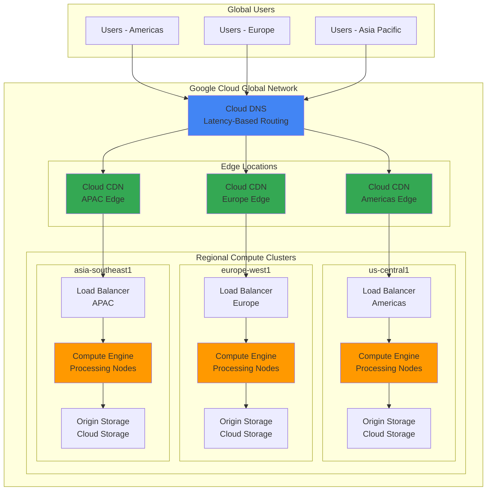

# Architecting Distributed Edge Computing Networks with Cloud CDN and Compute Engine

## Problem

Global enterprises face mounting pressure to deliver ultra-low latency content and compute services to geographically distributed users while managing infrastructure costs and complexity. Traditional centralized data center architectures introduce unacceptable latency for real-time applications, content streaming, and interactive workloads, resulting in poor user experiences and competitive disadvantages. Without edge computing capabilities that dynamically scale and process content closer to end users, organizations struggle to meet modern performance requirements for applications like video streaming, gaming, IoT processing, and AI inference workloads.

## Solution

Build a globally distributed edge computing architecture using Google Cloud CDN's global edge network combined with strategically placed Compute Engine instances for dynamic content processing. This solution leverages Cloud Load Balancing for intelligent traffic distribution and Cloud DNS for latency-based routing, creating a comprehensive edge computing platform that automatically serves cached content from the nearest edge location while processing dynamic requests at regional compute nodes closest to users.

## Architecture Diagram



## Prerequisites

1. Google Cloud account with appropriate permissions for Compute Engine, Cloud CDN, Cloud Load Balancing, and Cloud DNS
2. Google Cloud CLI (gcloud) installed and configured (version 450.0.0 or later)
3. Basic understanding of CDN concepts, load balancing, and edge computing principles
4. Knowledge of DNS configuration and HTTP/HTTPS protocols
5. Estimated cost: $50-150 per month for development setup (varies by traffic volume and compute usage)

> **Note**: This recipe creates global infrastructure across multiple regions. Monitor your [Google Cloud billing dashboard](https://cloud.google.com/billing/docs/how-to/billing-dashboard) to track costs and set up budget alerts to avoid unexpected charges.

## Preparation

```bash
# Set environment variables for global edge network
export PROJECT_ID="edge-network-$(date +%s)"
export REGIONS=("us-central1" "europe-west1" "asia-southeast1")
export ZONES=("us-central1-a" "europe-west1-b" "asia-southeast1-a")
export DOMAIN_NAME="edge-example.com"

# Generate unique suffix for resource names
RANDOM_SUFFIX=$(openssl rand -hex 3)
export NETWORK_NAME="edge-network-${RANDOM_SUFFIX}"
export BACKEND_SERVICE_NAME="edge-backend-${RANDOM_SUFFIX}"

# Set default project and region
gcloud config set project ${PROJECT_ID}
gcloud config set compute/region ${REGIONS[0]}
gcloud config set compute/zone ${ZONES[0]}

# Enable required APIs for edge computing infrastructure
gcloud services enable compute.googleapis.com \
    dns.googleapis.com \
    storage.googleapis.com \
    logging.googleapis.com \
    monitoring.googleapis.com

echo "✅ Project configured: ${PROJECT_ID}"
echo "✅ APIs enabled for global edge computing"
```

## Steps

1. **Create Global VPC Network and Subnets**:

   A global Virtual Private Cloud (VPC) network provides the foundational connectivity layer for distributed edge computing infrastructure. Google Cloud's global VPC enables seamless communication between regional compute clusters while maintaining security boundaries and optimized routing. This network architecture supports automatic failover and load distribution across multiple geographic regions.

   ```bash
   # Create global VPC network for edge infrastructure
   gcloud compute networks create ${NETWORK_NAME} \
       --subnet-mode=custom \
       --bgp-routing-mode=global
   
   # Create regional subnets for each edge computing cluster
   for i in "${!REGIONS[@]}"; do
       REGION=${REGIONS[$i]}
       SUBNET_RANGE="10.$((i+1)).0.0/16"
       
       gcloud compute networks subnets create ${NETWORK_NAME}-${REGION} \
           --network=${NETWORK_NAME} \
           --region=${REGION} \
           --range=${SUBNET_RANGE} \
           --enable-private-ip-google-access
       
       echo "✅ Created subnet in ${REGION} with range ${SUBNET_RANGE}"
   done
   ```

   The global network infrastructure is now established with regional subnets configured for optimal latency and bandwidth. Private Google Access ensures that Compute Engine instances can reach Google services without external IP addresses, improving security and reducing costs while maintaining high performance connectivity to Cloud Storage and other services.

2. **Configure Firewall Rules for Edge Traffic**:

   Security policies for edge computing networks require carefully designed firewall rules that protect infrastructure while enabling legitimate traffic flows. These rules establish secure communication channels between load balancers, compute instances, and external users while blocking unauthorized access attempts.

   ```bash
   # Allow HTTP/HTTPS traffic for edge services
   gcloud compute firewall-rules create ${NETWORK_NAME}-allow-web \
       --network=${NETWORK_NAME} \
       --allow=tcp:80,tcp:443,tcp:8080 \
       --source-ranges=0.0.0.0/0 \
       --target-tags=edge-server
   
   # Allow health check traffic from Google Cloud Load Balancing
   gcloud compute firewall-rules create ${NETWORK_NAME}-allow-health-check \
       --network=${NETWORK_NAME} \
       --allow=tcp:80,tcp:443,tcp:8080 \
       --source-ranges=130.211.0.0/22,35.191.0.0/16 \
       --target-tags=edge-server
   
   # Allow internal communication between edge nodes
   gcloud compute firewall-rules create ${NETWORK_NAME}-allow-internal \
       --network=${NETWORK_NAME} \
       --allow=tcp:1-65535,udp:1-65535,icmp \
       --source-ranges=10.0.0.0/8 \
       --target-tags=edge-server
   
   echo "✅ Firewall rules configured for secure edge traffic"
   ```

   The firewall configuration now permits essential traffic patterns while maintaining security. Health check access from Google's load balancing infrastructure ensures reliable service monitoring, while internal communication rules enable coordination between edge nodes for data synchronization and failover scenarios.

3. **Deploy Regional Compute Engine Clusters**:

   Compute Engine instances deployed across multiple regions form the processing backbone of the edge computing network. These instances handle dynamic content generation, API processing, and computational workloads that cannot be cached at CDN edge locations. Regional deployment ensures that compute resources are positioned close to user populations for minimal latency.

   ```bash
   # Deploy managed instance groups in each region
   for i in "${!REGIONS[@]}"; do
       REGION=${REGIONS[$i]}
       ZONE=${ZONES[$i]}
       
       # Create instance template with regional subnet
       gcloud compute instance-templates create \
           edge-template-${REGION}-${RANDOM_SUFFIX} \
           --machine-type=e2-standard-2 \
           --network-interface=network=${NETWORK_NAME},subnet=${NETWORK_NAME}-${REGION},no-address \
           --image-family=ubuntu-2404-lts \
           --image-project=ubuntu-os-cloud \
           --tags=edge-server \
           --scopes=https://www.googleapis.com/auth/cloud-platform \
           --metadata=startup-script='#!/bin/bash
   apt-get update
   apt-get install -y nginx
   
   # Configure nginx for edge processing
   cat > /var/www/html/index.html << EOF
   <!DOCTYPE html>
   <html>
   <head><title>Edge Node - $(hostname)</title></head>
   <body>
       <h1>Edge Computing Node</h1>
       <p>Server: $(hostname)</p>
       <p>Region: $(curl -s "http://metadata.google.internal/computeMetadata/v1/instance/zone" -H "Metadata-Flavor: Google" | cut -d/ -f4)</p>
       <p>Timestamp: $(date)</p>
       <p>Processing dynamic content at the edge</p>
   </body>
   </html>
   EOF
   
   systemctl start nginx
   systemctl enable nginx'
       
       # Create regional managed instance group
       gcloud compute instance-groups managed create edge-group-${REGION} \
           --template=edge-template-${REGION}-${RANDOM_SUFFIX} \
           --size=2 \
           --zone=${ZONE}
       
       # Configure autoscaling for dynamic load handling
       gcloud compute instance-groups managed set-autoscaling \
           edge-group-${REGION} \
           --zone=${ZONE} \
           --max-num-replicas=5 \
           --min-num-replicas=2 \
           --target-cpu-utilization=0.7
       
       echo "✅ Deployed edge compute cluster in ${REGION}"
   done
   ```

   The regional compute clusters are now operational with automatic scaling capabilities. Each cluster can dynamically adjust its capacity based on CPU utilization, ensuring optimal performance during traffic spikes while minimizing costs during low-demand periods. The nginx web servers provide a foundation for edge processing applications.

4. **Create Cloud Storage Origins for Static Content**:

   Cloud Storage buckets serve as origin servers for static content cached by Cloud CDN. Geographic distribution of storage buckets optimizes initial content delivery and provides redundancy for critical assets. These origins store images, videos, static HTML, CSS, JavaScript, and other cacheable resources.

   ```bash
   # Create regional storage buckets for content origins
   for i in "${!REGIONS[@]}"; do
       REGION=${REGIONS[$i]}
       BUCKET_NAME="edge-origin-${REGION}-${RANDOM_SUFFIX}"
       
       # Create bucket in specific region for optimal performance
       gsutil mb -p ${PROJECT_ID} \
           -c STANDARD \
           -l ${REGION} \
           gs://${BUCKET_NAME}
       
       # Enable uniform bucket-level access for security
       gsutil uniformbucketlevelaccess set on gs://${BUCKET_NAME}
       
       # Upload sample static content
       echo "<h1>Static Content from ${REGION}</h1><p>Served via Cloud CDN</p>" | \
           gsutil cp - gs://${BUCKET_NAME}/index.html
       
       # Make bucket publicly readable for CDN access
       gsutil iam ch allUsers:objectViewer gs://${BUCKET_NAME}
       
       echo "✅ Created origin storage bucket: ${BUCKET_NAME}"
   done
   ```

   The storage origins are now configured with appropriate security settings and sample content. Uniform bucket-level access provides consistent security policies, while public read access enables Cloud CDN to retrieve and cache content efficiently. This foundation supports both static content delivery and dynamic content caching.

5. **Configure Global Load Balancer with Backend Services**:

   Google Cloud's global load balancer distributes traffic across regional backend services based on geographic proximity and health status. This configuration ensures that user requests are routed to the nearest healthy compute cluster, minimizing latency while providing automatic failover capabilities for high availability.

   ```bash
   # Create health check for backend services
   gcloud compute health-checks create http edge-health-check \
       --port=80 \
       --request-path="/" \
       --check-interval=10s \
       --timeout=5s \
       --healthy-threshold=2 \
       --unhealthy-threshold=3
   
   # Create backend service with CDN enabled
   gcloud compute backend-services create ${BACKEND_SERVICE_NAME} \
       --protocol=HTTP \
       --health-checks=edge-health-check \
       --global \
       --load-balancing-scheme=EXTERNAL_MANAGED \
       --enable-cdn
   
   # Add regional instance groups as backends
   for i in "${!REGIONS[@]}"; do
       REGION=${REGIONS[$i]}
       ZONE=${ZONES[$i]}
       
       gcloud compute backend-services add-backend ${BACKEND_SERVICE_NAME} \
           --instance-group=edge-group-${REGION} \
           --instance-group-zone=${ZONE} \
           --balancing-mode=UTILIZATION \
           --max-utilization=0.8 \
           --capacity-scaler=1.0 \
           --global
       
       echo "✅ Added ${REGION} backend to global load balancer"
   done
   ```

   The global load balancer now intelligently distributes traffic across all regional compute clusters. Health checks ensure that only healthy instances receive traffic, while the capacity scaling configuration optimizes resource utilization and maintains performance under varying load conditions.

6. **Enable Cloud CDN with Advanced Caching Policies**:

   Cloud CDN acceleration dramatically improves content delivery performance by caching responses at Google's global edge locations. Advanced caching policies ensure optimal cache behavior for different content types while providing granular control over cache keys, TTL values, and cache invalidation strategies.

   ```bash
   # Configure CDN caching policy for the backend service
   gcloud compute backend-services update ${BACKEND_SERVICE_NAME} \
       --enable-cdn \
       --cache-mode=CACHE_ALL_STATIC \
       --default-ttl=3600 \
       --max-ttl=86400 \
       --client-ttl=1800 \
       --negative-caching \
       --negative-caching-policy=404=60,500=10 \
       --global
   
   # Create URL map for request routing
   gcloud compute url-maps create edge-url-map \
       --default-service=${BACKEND_SERVICE_NAME} \
       --global
   
   # Create target HTTP proxy
   gcloud compute target-http-proxies create edge-http-proxy \
       --url-map=edge-url-map \
       --global
   
   # Reserve global static IP address
   gcloud compute addresses create edge-global-ip \
       --global
   
   # Get the reserved IP address
   GLOBAL_IP=$(gcloud compute addresses describe edge-global-ip \
       --global --format="value(address)")
   
   # Create global forwarding rule
   gcloud compute forwarding-rules create edge-forwarding-rule \
       --address=edge-global-ip \
       --global \
       --target-http-proxy=edge-http-proxy \
       --ports=80
   
   echo "✅ Cloud CDN enabled with global IP: ${GLOBAL_IP}"
   ```

   Cloud CDN is now actively caching content at Google's edge locations worldwide. The caching policies optimize performance for static assets while ensuring dynamic content freshness. The global IP address provides a single entry point for the distributed edge computing network.

7. **Configure Cloud DNS for Latency-Based Routing**:

   Cloud DNS with latency-based routing directs users to the geographically closest edge location, minimizing network latency and improving user experience. This intelligent routing considers real-time network conditions and geographic proximity to optimize content delivery paths.

   ```bash
   # Create DNS managed zone
   gcloud dns managed-zones create edge-zone \
       --description="Edge computing network DNS zone" \
       --dns-name="${DOMAIN_NAME}." \
       --visibility=public
   
   # Create A record pointing to global load balancer
   gcloud dns record-sets create ${DOMAIN_NAME}. \
       --zone=edge-zone \
       --type=A \
       --ttl=300 \
       --data=${GLOBAL_IP}
   
   # Create www subdomain record
   gcloud dns record-sets create www.${DOMAIN_NAME}. \
       --zone=edge-zone \
       --type=CNAME \
       --ttl=300 \
       --data=${DOMAIN_NAME}.
   
   # Get DNS nameservers for domain configuration
   NAME_SERVERS=$(gcloud dns managed-zones describe edge-zone \
       --format="value(nameServers[].join(' '))")
   
   echo "✅ DNS configured for ${DOMAIN_NAME}"
   echo "Configure your domain registrar with these nameservers:"
   echo "${NAME_SERVERS}"
   ```

   DNS configuration now provides global name resolution with optimized routing. Users worldwide will be automatically directed to the nearest edge location through Google's intelligent DNS infrastructure, ensuring minimal latency and optimal performance for all edge computing workloads.

## Validation & Testing

1. **Verify Global Infrastructure Deployment**:

   ```bash
   # Check VPC network and subnets
   gcloud compute networks list --filter="name:${NETWORK_NAME}"
   gcloud compute networks subnets list --filter="network:${NETWORK_NAME}"
   
   # Verify compute instance groups across regions
   for i in "${!REGIONS[@]}"; do
       REGION=${REGIONS[$i]}
       ZONE=${ZONES[$i]}
       echo "Checking instances in ${REGION}:"
       gcloud compute instance-groups managed list-instances \
           edge-group-${REGION} --zone=${ZONE}
   done
   ```

   Expected output: Network showing READY status with subnets in three regions, and instance groups showing 2 running instances each.

2. **Test Load Balancer and CDN Performance**:

   ```bash
   # Test global load balancer response
   curl -H "Host: ${DOMAIN_NAME}" http://${GLOBAL_IP}/
   
   # Test CDN cache behavior with multiple requests
   for i in {1..5}; do
       echo "Request ${i}:"
       curl -s -w "Response time: %{time_total}s\n" \
           -H "Host: ${DOMAIN_NAME}" \
           http://${GLOBAL_IP}/ -o /dev/null
       sleep 2
   done
   
   # Check CDN cache status
   curl -I -H "Host: ${DOMAIN_NAME}" http://${GLOBAL_IP}/
   ```

   Expected output: Decreasing response times indicating CDN caching, and Cache-Control headers showing CDN configuration.

3. **Verify Regional Failover and Health Checks**:

   ```bash
   # Monitor backend service health
   gcloud compute backend-services get-health ${BACKEND_SERVICE_NAME} \
       --global
   
   # Test autoscaling configuration
   echo "Autoscaling configuration:"
   for i in "${!REGIONS[@]}"; do
       REGION=${REGIONS[$i]}
       ZONE=${ZONES[$i]}
       gcloud compute instance-groups managed describe \
           edge-group-${REGION} --zone=${ZONE} \
           --format="value(autoscaler.target)"
   done
   ```

   Expected output: All backends showing HEALTHY status and autoscaling targets configured correctly.

## Cleanup

1. **Remove DNS and Load Balancer Configuration**:

   ```bash
   # Delete DNS records and managed zone
   gcloud dns record-sets delete ${DOMAIN_NAME}. \
       --zone=edge-zone --type=A --quiet
   gcloud dns record-sets delete www.${DOMAIN_NAME}. \
       --zone=edge-zone --type=CNAME --quiet
   gcloud dns managed-zones delete edge-zone --quiet
   
   # Delete forwarding rule and load balancer components
   gcloud compute forwarding-rules delete edge-forwarding-rule \
       --global --quiet
   gcloud compute target-http-proxies delete edge-http-proxy \
       --global --quiet
   gcloud compute url-maps delete edge-url-map --global --quiet
   
   echo "✅ DNS and load balancer configuration removed"
   ```

2. **Delete Backend Services and Compute Resources**:

   ```bash
   # Delete backend service (this also disables CDN)
   gcloud compute backend-services delete ${BACKEND_SERVICE_NAME} \
       --global --quiet
   
   # Delete managed instance groups and templates in all regions
   for i in "${!REGIONS[@]}"; do
       REGION=${REGIONS[$i]}
       ZONE=${ZONES[$i]}
       
       gcloud compute instance-groups managed delete \
           edge-group-${REGION} --zone=${ZONE} --quiet
       gcloud compute instance-templates delete \
           edge-template-${REGION}-${RANDOM_SUFFIX} --quiet
   done
   
   # Delete health check
   gcloud compute health-checks delete edge-health-check --quiet
   
   echo "✅ Compute resources deleted"
   ```

3. **Remove Storage and Network Infrastructure**:

   ```bash
   # Delete storage buckets and contents
   for region in "${REGIONS[@]}"; do
       BUCKET_NAME="edge-origin-${region}-${RANDOM_SUFFIX}"
       gsutil -m rm -r gs://${BUCKET_NAME} 2>/dev/null || true
   done
   
   # Release global IP address
   gcloud compute addresses delete edge-global-ip --global --quiet
   
   # Delete firewall rules
   gcloud compute firewall-rules delete \
       ${NETWORK_NAME}-allow-web \
       ${NETWORK_NAME}-allow-health-check \
       ${NETWORK_NAME}-allow-internal --quiet
   
   # Delete subnets and VPC network
   for region in "${REGIONS[@]}"; do
       gcloud compute networks subnets delete \
           ${NETWORK_NAME}-${region} --region=${region} --quiet
   done
   gcloud compute networks delete ${NETWORK_NAME} --quiet
   
   echo "✅ All infrastructure resources cleaned up"
   echo "Note: Monitor billing dashboard to confirm resource deletion"
   ```

## Discussion

This edge computing architecture leverages Google Cloud's global infrastructure to create a sophisticated content delivery and processing network that automatically optimizes performance based on user location and traffic patterns. The solution combines the caching capabilities of Cloud CDN with the computational power of strategically distributed Compute Engine clusters, creating a hybrid approach that serves both static and dynamic content with minimal latency.

The global load balancer acts as the intelligent traffic director, using Google's advanced routing algorithms to select the optimal backend based on real-time network conditions, geographic proximity, and backend health. This ensures that users always connect to the fastest available resources while providing automatic failover protection against regional outages or performance degradation. Google's anycast IP technology enables automatic routing to the nearest healthy backend, significantly reducing connection establishment time.

Cloud CDN's integration provides substantial performance benefits by caching content at over 100 edge locations worldwide. The caching policies configured in this recipe optimize for different content types while maintaining freshness requirements. Static assets benefit from extended cache times, while dynamic content can be cached for shorter periods to balance performance and data consistency. For more information about CDN optimization strategies, see the [Cloud CDN best practices guide](https://cloud.google.com/cdn/docs/best-practices).

The distributed compute clusters enable processing capabilities at the network edge, supporting use cases like real-time data processing, AI inference, content transformation, and API services. Auto-scaling ensures that compute capacity matches demand while controlling costs during low-traffic periods. This architecture pattern is particularly effective for applications requiring sub-100ms response times, such as gaming, financial trading, IoT processing, and interactive media applications. Google's [edge computing architecture documentation](https://cloud.google.com/architecture/edge-computing) provides additional guidance on optimizing edge deployments for specific workloads and geographic requirements.

> **Tip**: Monitor CDN cache hit ratios and backend response times using Cloud Monitoring to identify optimization opportunities. Consider implementing cache warming strategies for frequently accessed content and evaluate additional edge services like Edge TPU for AI workloads.

## Challenge

Extend this edge computing architecture with these advanced enhancements:

1. **Implement HTTPS with SSL certificates** using Google-managed certificates and HTTP to HTTPS redirects for security across all edge locations
2. **Add Cloud Armor security policies** to protect against DDoS attacks, bot traffic, and geographic restrictions at the edge
3. **Deploy Cloud Functions for serverless edge processing** to handle lightweight computational tasks without managing server infrastructure
4. **Integrate Cloud Monitoring and Alerting** with custom dashboards showing global performance metrics, cache hit ratios, and regional traffic patterns
5. **Implement multi-CDN failover** using Cloud DNS policies to automatically switch between Google Cloud CDN and third-party CDN providers for ultimate reliability

## Infrastructure Code

### Available Infrastructure as Code:

- [Infrastructure Code Overview](code/README.md) - Detailed description of all infrastructure components
- [Infrastructure Manager](code/infrastructure-manager/) - GCP Infrastructure Manager templates
- [Bash CLI Scripts](code/scripts/) - Example bash scripts using gcloud CLI commands to deploy infrastructure
- [Terraform](code/terraform/) - Terraform configuration files