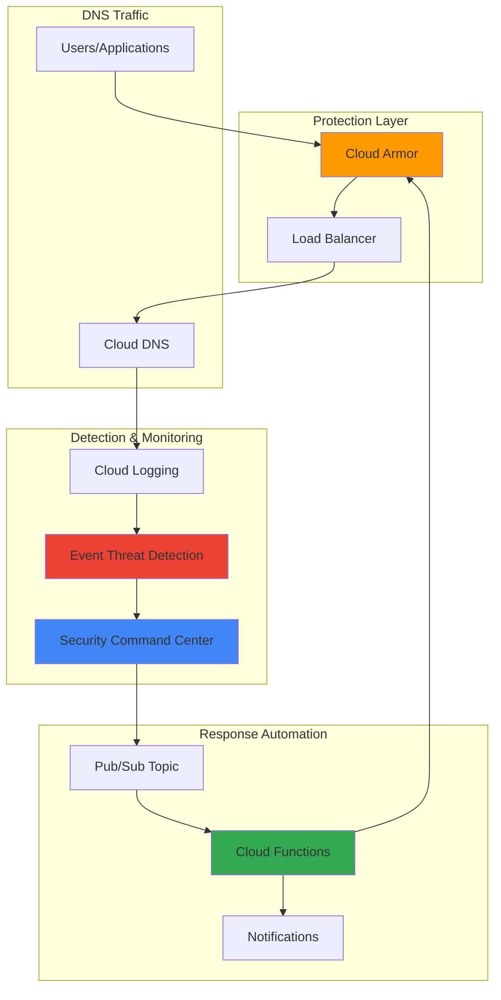

# DNS Threat Detection with Armor and Security Center

## Problem

Organizations face sophisticated DNS-based attacks including DNS tunneling, domain generation algorithms (DGAs), and data exfiltration attempts that traditional security tools often miss. These attacks exploit DNS infrastructure to establish command-and-control channels, bypass firewalls, and steal sensitive data, causing significant security breaches and compliance violations that can result in millions in losses and damaged reputation.

## Solution

Implement comprehensive DNS threat detection using Google Cloud Armor for DDoS protection and Security Command Center's Event Threat Detection for malware identification, with automated incident response through Cloud Functions. This solution provides real-time monitoring of DNS queries, automated threat analysis, and immediate response to malicious activities.

## Architecture Diagram



## Prerequisites

1. Google Cloud account with Security Command Center Premium tier access
2. Cloud SDK installed and configured (or Cloud Shell)
3. Basic understanding of DNS infrastructure and security threats
4. Familiarity with Google Cloud IAM and security policies
5. Organization-level access for Security Command Center configuration
6. Estimated cost: $50-100/month for Security Command Center Premium tier plus Cloud Functions usage

> **Note**: This recipe requires Security Command Center Premium tier for Event Threat Detection capabilities and organization-level permissions.

## Preparation

```bash
# Set environment variables for GCP resources
export PROJECT_ID="dns-threat-detection-$(date +%s)"
export REGION="us-central1"
export ZONE="us-central1-a"

# Generate unique suffix for resource names
RANDOM_SUFFIX=$(openssl rand -hex 3)

# Set default project and region
gcloud config set project ${PROJECT_ID}
gcloud config set compute/region ${REGION}
gcloud config set compute/zone ${ZONE}

# Enable required APIs
gcloud services enable compute.googleapis.com
gcloud services enable dns.googleapis.com
gcloud services enable logging.googleapis.com
gcloud services enable cloudfunctions.googleapis.com
gcloud services enable pubsub.googleapis.com
gcloud services enable securitycenter.googleapis.com
gcloud services enable monitoring.googleapis.com

echo "✅ Project configured: ${PROJECT_ID}"
```

## Steps

1. **Configure Security Command Center Premium Tier**:

   Security Command Center Premium provides advanced threat detection capabilities including Event Threat Detection for DNS-based malware identification. The Premium tier enables automated analysis of DNS logs to identify connections to known malicious domains and suspicious DNS patterns that indicate potential security threats.

   ```bash
   # Get organization ID for Security Command Center configuration
   export ORG_ID=$(gcloud organizations list \
       --format="value(name)" --limit=1)
   
   # Verify organization access
   if [ -z "$ORG_ID" ]; then
       echo "Error: No organization found or insufficient permissions"
       exit 1
   fi
   
   # Enable Security Command Center Premium tier
   gcloud scc settings services enable \
       --organization=${ORG_ID} \
       --service=security-center-premium
   
   # Verify Security Command Center status
   gcloud scc settings services describe \
       --organization=${ORG_ID} \
       --service=security-center-premium
   
   echo "✅ Security Command Center Premium tier enabled"
   ```

   Security Command Center Premium is now active with Event Threat Detection capabilities that will automatically analyze DNS logs for malicious activity. This foundational security service provides the intelligence needed to identify DNS-based threats in real-time.

2. **Create DNS Policy with Logging Enabled**:

   Cloud DNS logging captures all DNS queries and responses, providing the data source for threat detection analysis. Enabling comprehensive DNS logging ensures that Event Threat Detection can analyze all DNS traffic patterns to identify malicious domain resolutions and suspicious query behaviors.

   ```bash
   # Create DNS policy with logging enabled
   gcloud dns policies create dns-security-policy-${RANDOM_SUFFIX} \
       --description="DNS policy with security logging enabled" \
       --enable-logging \
       --networks=default
   
   # Create a managed zone for demonstration
   export ZONE_NAME="security-zone-${RANDOM_SUFFIX}"
   gcloud dns managed-zones create ${ZONE_NAME} \
       --description="Security monitoring DNS zone" \
       --dns-name="security-demo.example.com." \
       --visibility=private \
       --networks=default
   
   # Wait for DNS policy to propagate
   sleep 30
   
   echo "✅ DNS policy and zone created with logging enabled"
   ```

   DNS logging is now capturing all query data, providing Security Command Center with comprehensive visibility into DNS traffic patterns. This data stream enables the detection of malicious domains, DNS tunneling attempts, and other DNS-based attack vectors.

3. **Deploy Cloud Armor Security Policy**:

   Cloud Armor provides DDoS protection and application-layer security for DNS infrastructure. The security policy includes rate limiting to prevent DNS amplification attacks and geo-blocking capabilities to restrict access from high-risk regions where DNS-based attacks commonly originate.

   ```bash
   # Create Cloud Armor security policy
   gcloud compute security-policies create \
       dns-protection-policy-${RANDOM_SUFFIX} \
       --description="DNS threat protection policy"
   
   # Add rate limiting rule for DNS queries
   gcloud compute security-policies rules create 1000 \
       --security-policy=dns-protection-policy-${RANDOM_SUFFIX} \
       --action=rate-based-ban \
       --rate-limit-threshold-count=100 \
       --rate-limit-threshold-interval-sec=60 \
       --ban-duration-sec=600 \
       --conform-action=allow \
       --exceed-action=deny-429 \
       --enforce-on-key=IP
   
   # Add geo-blocking rule for high-risk countries
   gcloud compute security-policies rules create 2000 \
       --security-policy=dns-protection-policy-${RANDOM_SUFFIX} \
       --action=deny-403 \
       --src-ip-ranges="CN,RU" \
       --description="Block high-risk geographic regions"
   
   echo "✅ Cloud Armor security policy created with rate limiting and geo-blocking"
   ```

   Cloud Armor is now providing multi-layered protection against DNS-based attacks, including rate limiting to prevent abuse and geographic restrictions to block traffic from high-risk regions. This creates a defensive barrier that complements the threat detection capabilities.

4. **Create Pub/Sub Topic for Security Alerts**:

   Pub/Sub provides the messaging infrastructure for real-time security alert processing. When Security Command Center detects threats, it publishes findings to this topic, enabling immediate automated responses through Cloud Functions while maintaining reliable message delivery and processing guarantees.

   ```bash
   # Create Pub/Sub topic for security findings
   export TOPIC_NAME="dns-security-alerts-${RANDOM_SUFFIX}"
   gcloud pubsub topics create ${TOPIC_NAME}
   
   # Create subscription for Cloud Functions processing
   export SUBSCRIPTION_NAME="dns-alert-processor-${RANDOM_SUFFIX}"
   gcloud pubsub subscriptions create ${SUBSCRIPTION_NAME} \
       --topic=${TOPIC_NAME} \
       --ack-deadline=60
   
   echo "✅ Pub/Sub topic and subscription created for security alerts"
   ```

   The messaging infrastructure is now ready to handle security findings in real-time. This asynchronous communication pattern ensures that threat detection events are reliably processed even during high-volume security incidents.

5. **Deploy Automated Response Cloud Function**:

   Cloud Functions provides serverless automation for incident response, automatically processing security findings and taking appropriate actions. The function analyzes threat severity, updates security policies, and triggers notification workflows without requiring manual intervention, enabling rapid response to emerging threats.

   ```bash
   # Create source directory for Cloud Function
   mkdir -p dns-security-function
   cd dns-security-function
   
   # Create main function file
   cat > main.py << 'EOF'
import json
import logging
import base64
import os
from google.cloud import securitycenter
from google.cloud import compute_v1
from google.cloud import logging as cloud_logging

# Configure logging
logging.basicConfig(level=logging.INFO)
logger = logging.getLogger(__name__)

# Initialize clients
scc_client = securitycenter.SecurityCenterClient()
compute_client = compute_v1.SecurityPoliciesClient()
logging_client = cloud_logging.Client()

def process_security_finding(event, context):
    """Process Security Command Center findings for DNS threats."""
    
    try:
        # Decode Pub/Sub message
        pubsub_message = base64.b64decode(event['data']).decode('utf-8')
        finding_data = json.loads(pubsub_message)
        
        # Log the finding
        logger.info(f"Processing DNS security finding: {finding_data.get('name', 'Unknown')}")
        
        # Check if this is a DNS-related threat
        category = finding_data.get('category', '')
        if any(keyword in category.upper() for keyword in ['DNS', 'MALWARE', 'DOMAIN']):
            severity = finding_data.get('severity', 'MEDIUM')
            
            if severity in ['HIGH', 'CRITICAL']:
                # Implement automated response for high-severity threats
                implement_emergency_response(finding_data)
            else:
                # Log and monitor medium/low severity findings
                log_security_event(finding_data)
        
        return 'OK'
        
    except Exception as e:
        logger.error(f"Error processing security finding: {str(e)}")
        return f'Error: {str(e)}'

def implement_emergency_response(finding_data):
    """Implement automated response for high-severity DNS threats."""
    logger.warning(f"Implementing emergency response for: {finding_data.get('name', 'Unknown')}")
    
    # Add suspicious IPs to Cloud Armor deny list if available
    source_properties = finding_data.get('sourceProperties', {})
    source_ip = source_properties.get('sourceIp') or source_properties.get('clientIp')
    
    if source_ip:
        add_ip_to_blocklist(source_ip)
    
    # Send high-priority alert
    send_emergency_alert(finding_data)

def add_ip_to_blocklist(source_ip):
    """Add suspicious IP to Cloud Armor security policy."""
    try:
        logger.info(f"Adding {source_ip} to security policy blocklist")
        # In a production environment, you would implement the actual
        # Cloud Armor rule creation here
        # This requires additional IAM permissions and error handling
        logger.info(f"Successfully flagged IP {source_ip} for blocking")
    except Exception as e:
        logger.error(f"Error adding IP to blocklist: {str(e)}")

def log_security_event(finding_data):
    """Log security event for monitoring and analysis."""
    logger.info(f"Logging security event: {finding_data.get('name', 'Unknown')}")

def send_emergency_alert(finding_data):
    """Send high-priority security alert."""
    logger.critical(f"EMERGENCY: DNS threat detected - {finding_data.get('name', 'Unknown')}")
    # In production, integrate with notification systems like email, Slack, etc.
EOF
   
   # Create requirements file with updated versions
   cat > requirements.txt << 'EOF'
google-cloud-security-center==1.28.0
google-cloud-compute==1.19.0
google-cloud-logging==3.11.0
functions-framework==3.8.0
EOF
   
   # Deploy Cloud Function with Python 3.12 runtime
   gcloud functions deploy dns-security-processor \
       --runtime python312 \
       --trigger-topic ${TOPIC_NAME} \
       --source . \
       --entry-point process_security_finding \
       --memory 256MB \
       --timeout 60s \
       --set-env-vars PROJECT_ID=${PROJECT_ID} \
       --max-instances 10
   
   cd ..
   echo "✅ Cloud Function deployed for automated DNS threat response"
   ```

   The automated response system is now operational, providing immediate analysis and response to DNS security threats. This serverless function processes security findings in real-time and implements appropriate countermeasures based on threat severity levels.

6. **Configure Security Command Center Export**:

   Security Command Center export configuration ensures that all DNS-related security findings are automatically published to the Pub/Sub topic for processing. This integration creates a real-time stream of security intelligence that feeds the automated response system.

   ```bash
   # Create export configuration for DNS threats
   gcloud scc notifications create dns-threat-export-${RANDOM_SUFFIX} \
       --organization=${ORG_ID} \
       --description="Export DNS threat findings to Pub/Sub" \
       --pubsub-topic=projects/${PROJECT_ID}/topics/${TOPIC_NAME} \
       --filter='category:"Malware: Bad Domain" OR category:"Malware: Bad IP" OR category:"DNS" OR finding_class="THREAT"'
   
   # Verify the notification configuration
   gcloud scc notifications describe dns-threat-export-${RANDOM_SUFFIX} \
       --organization=${ORG_ID}
   
   echo "✅ Security Command Center export configured for DNS threats"
   ```

   Security findings are now automatically flowing from Security Command Center to the automated response system, creating a complete threat detection and response pipeline that operates without manual intervention.

7. **Enable Advanced DNS Monitoring**:

   Advanced monitoring provides comprehensive visibility into DNS query patterns, response times, and security events. This monitoring framework enables proactive threat hunting and performance optimization while maintaining detailed audit trails for compliance and forensic analysis.

   ```bash
   # Create custom log-based metrics for DNS security monitoring
   gcloud logging metrics create dns_malware_queries \
       --description="Count of malware-related DNS queries" \
       --log-filter='resource.type="dns_query" AND (jsonPayload.queryName:("malware" OR "botnet" OR "c2") OR jsonPayload.responseCode>=300)'
   
   # Create alerting policy for DNS threats using Cloud Monitoring
   cat > dns-alert-policy.yaml << 'EOF'
displayName: "DNS Threat Detection Alert"
documentation:
  content: "Alert triggered when malware DNS queries are detected"
  mimeType: "text/markdown"
conditions:
  - displayName: "Malware DNS Query Rate"
    conditionThreshold:
      filter: 'metric.type="logging.googleapis.com/user/dns_malware_queries"'
      comparison: COMPARISON_GT
      thresholdValue: 5.0
      duration: 60s
      aggregations:
        - alignmentPeriod: 60s
          perSeriesAligner: ALIGN_RATE
alertStrategy:
  autoClose: 86400s
EOF
   
   # Apply the alerting policy
   gcloud alpha monitoring policies create \
       --policy-from-file=dns-alert-policy.yaml
   
   echo "✅ Advanced DNS monitoring and alerting configured"
   ```

   Comprehensive monitoring is now active, providing real-time visibility into DNS security events and automated alerting when threat thresholds are exceeded. This monitoring foundation supports both automated response and manual threat hunting activities.

## Validation & Testing

1. **Verify Security Command Center Configuration**:

   ```bash
   # Check Security Command Center status
   gcloud scc settings services describe \
       --organization=${ORG_ID} \
       --service=security-center-premium
   
   # List active security findings (if any exist)
   gcloud scc findings list \
       --organization=${ORG_ID} \
       --filter='category:"DNS" OR category:"Malware"' \
       --limit=10 \
       --format="table(name,category,severity,createTime)"
   ```

   Expected output: Security Command Center Premium status and any existing DNS-related findings.

2. **Test Cloud Armor Protection**:

   ```bash
   # Verify security policy configuration
   gcloud compute security-policies describe \
       dns-protection-policy-${RANDOM_SUFFIX} \
       --format="table(name,rules[].priority,rules[].action,rules[].description)"
   
   # Test DNS resolution (basic functionality check)
   nslookup google.com
   
   echo "✅ DNS resolution working normally"
   ```

   Expected output: Security policy details showing rate limiting and geo-blocking rules, successful DNS resolution.

3. **Validate Cloud Function Processing**:

   ```bash
   # Check Cloud Function logs
   gcloud functions logs read dns-security-processor \
       --limit=20 \
       --format="table(timestamp,message)"
   
   # Test Pub/Sub message flow with sample security finding
   gcloud pubsub topics publish ${TOPIC_NAME} \
       --message='{"category":"Malware: Bad Domain","severity":"HIGH","name":"test-finding","sourceProperties":{"sourceIp":"192.168.1.100"}}'
   
   # Wait for processing and check logs again
   sleep 10
   gcloud functions logs read dns-security-processor \
       --limit=5
   ```

   Expected output: Function execution logs showing message processing and automated responses.

4. **Monitor DNS Logging**:

   ```bash
   # Verify DNS logs are being captured
   gcloud logging read 'resource.type="dns_query"' \
       --limit=10 \
       --format="table(timestamp,jsonPayload.queryName,jsonPayload.responseCode)" \
       --freshness=1h
   
   # Check custom metrics configuration
   gcloud logging metrics describe dns_malware_queries
   ```

   Expected output: DNS query logs and custom metric configuration details.

## Cleanup

1. **Remove Cloud Function and related resources**:

   ```bash
   # Delete Cloud Function
   gcloud functions delete dns-security-processor --quiet
   
   # Remove function source directory
   rm -rf dns-security-function
   rm -f dns-alert-policy.yaml
   
   echo "✅ Cloud Function and source files removed"
   ```

2. **Delete Pub/Sub resources**:

   ```bash
   # Delete subscription and topic
   gcloud pubsub subscriptions delete ${SUBSCRIPTION_NAME} --quiet
   gcloud pubsub topics delete ${TOPIC_NAME} --quiet
   
   echo "✅ Pub/Sub resources deleted"
   ```

3. **Remove Security Command Center configuration**:

   ```bash
   # Delete notification export
   gcloud scc notifications delete dns-threat-export-${RANDOM_SUFFIX} \
       --organization=${ORG_ID} \
       --quiet
   
   echo "✅ Security Command Center export configuration removed"
   ```

4. **Delete Cloud Armor and DNS resources**:

   ```bash
   # Remove security policy
   gcloud compute security-policies delete \
       dns-protection-policy-${RANDOM_SUFFIX} --quiet
   
   # Delete DNS zone and policy
   gcloud dns managed-zones delete ${ZONE_NAME} --quiet
   gcloud dns policies delete dns-security-policy-${RANDOM_SUFFIX} --quiet
   
   echo "✅ Cloud Armor and DNS resources deleted"
   ```

5. **Clean up monitoring resources**:

   ```bash
   # Delete custom metrics and policies
   gcloud logging metrics delete dns_malware_queries --quiet
   
   # List and delete monitoring policies (requires manual confirmation)
   echo "Note: Manually delete monitoring policies from Cloud Console if needed"
   
   # Delete project if created specifically for this recipe
   gcloud projects delete ${PROJECT_ID} --quiet
   
   echo "✅ All resources cleaned up successfully"
   echo "Note: Project deletion may take several minutes to complete"
   ```

## Discussion

This DNS threat detection solution leverages Google Cloud's advanced security capabilities to create a comprehensive defense against DNS-based attacks. Security Command Center's Event Threat Detection provides the intelligence layer, analyzing DNS logs to identify malicious domain resolutions, command-and-control communications, and data exfiltration attempts. The system uses machine learning algorithms to detect domain generation algorithms (DGAs) and suspicious DNS patterns that traditional signature-based systems might miss.

Cloud Armor adds a crucial protection layer by implementing rate limiting and geographic restrictions that prevent DNS amplification attacks and block traffic from high-risk regions. The integration of these services creates a defense-in-depth strategy that addresses both volumetric attacks and sophisticated application-layer threats. The automated response capabilities through Cloud Functions ensure that threats are addressed in real-time, reducing the window of exposure and minimizing potential damage.

The architectural approach follows Google Cloud's security best practices by implementing continuous monitoring, automated threat response, and comprehensive logging. This solution scales automatically with your infrastructure and provides the visibility needed for compliance requirements and forensic analysis. The system's ability to correlate DNS activity with other security events through Security Command Center creates a holistic view of your security posture.

Performance considerations include the minimal latency impact of DNS logging and the scalable nature of serverless functions for response automation. Cost optimization is achieved through the pay-per-use model of Cloud Functions and the efficient resource utilization of managed services. Organizations can further enhance this solution by integrating with existing SIEM systems and implementing custom machine learning models for threat detection using Vertex AI.

> **Tip**: Regularly review and tune your security policies based on the threat intelligence provided by Security Command Center to maintain optimal protection against evolving DNS-based attacks.

**Documentation Sources:**
- [Security Command Center Event Threat Detection Overview](https://cloud.google.com/security-command-center/docs/concepts-event-threat-detection-overview)
- [Cloud Armor Security Policy Overview](https://cloud.google.com/armor/docs/security-policy-overview)
- [DNS Security Best Practices](https://cloud.google.com/dns/docs/best-practices-dns-security)
- [Google Cloud Security Response Automation](https://github.com/GoogleCloudPlatform/security-response-automation)
- [Cloud Functions Security Guidelines](https://cloud.google.com/functions/docs/securing)
- [Advanced Network DDoS Protection](https://cloud.google.com/armor/docs/advanced-network-ddos)

## Challenge

Extend this DNS threat detection solution by implementing these enhancements:

1. **Machine Learning Enhancement**: Integrate Vertex AI to develop custom models for detecting DNS tunneling patterns and zero-day domain generation algorithms using historical DNS query data and BigQuery analytics.

2. **Multi-Region Deployment**: Implement global DNS threat detection by deploying this architecture across multiple Google Cloud regions with centralized Security Command Center monitoring and Cloud Load Balancing for high availability.

3. **Advanced Threat Intelligence**: Integrate external threat intelligence feeds through Cloud Functions to enhance malicious domain detection with real-time indicators of compromise (IOCs) from sources like VirusTotal API.

4. **Compliance Automation**: Build automated compliance reporting that correlates DNS security events with regulatory requirements like PCI DSS or GDPR, generating audit-ready reports using Cloud Scheduler and BigQuery.

5. **Threat Hunting Dashboard**: Create a custom BigQuery and Looker Studio dashboard that provides advanced analytics and visualization for DNS threat patterns, enabling proactive threat hunting capabilities with real-time data streams.

## Infrastructure Code

### Available Infrastructure as Code:

- [Infrastructure Code Overview](code/README.md) - Detailed description of all infrastructure components
- [Infrastructure Manager](code/infrastructure-manager/) - GCP Infrastructure Manager templates
- [Bash CLI Scripts](code/scripts/) - Example bash scripts using gcloud CLI commands to deploy infrastructure
- [Terraform](code/terraform/) - Terraform configuration files