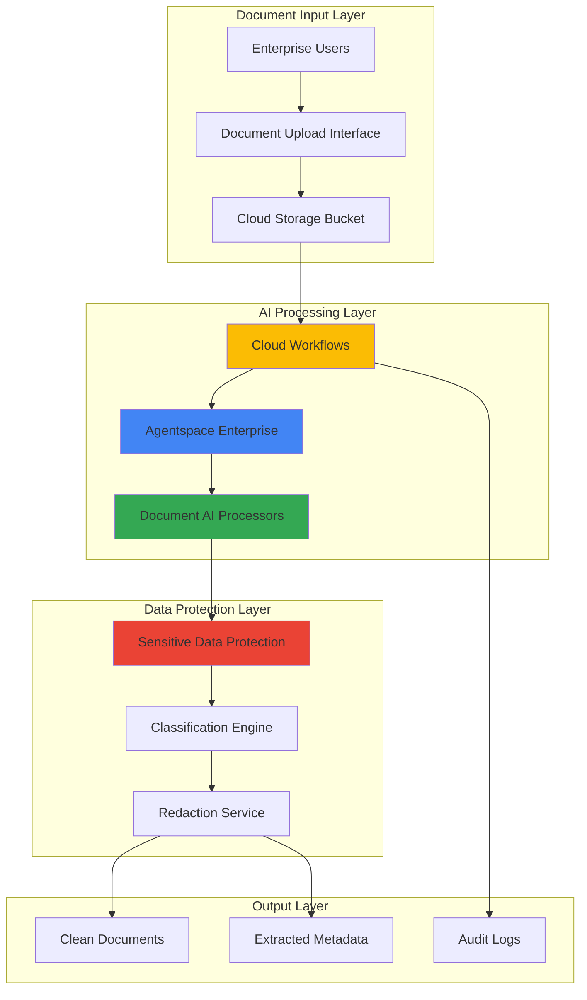

# Document Intelligence Workflows with Agentspace and Sensitive Data Protection

## Problem

Enterprise organizations process thousands of documents daily containing sensitive information like personally identifiable information (PII), financial data, and proprietary business intelligence. Traditional document processing workflows rely on manual review and rule-based systems that struggle with unstructured data, lack intelligent content understanding, and fail to automatically identify and protect sensitive information. This creates compliance risks, operational inefficiencies, and significant delays in business-critical document workflows, while exposing organizations to data breaches and regulatory violations.

## Solution

Implement an intelligent enterprise document processing system that leverages Google Cloud Agentspace AI agents to orchestrate automated document analysis workflows while ensuring comprehensive data protection through Sensitive Data Protection (DLP) scanning and redaction. This solution combines Agentspace's advanced reasoning capabilities with Document AI's extraction features and Cloud Workflows automation to create a secure, compliant, and intelligent document processing pipeline that automatically identifies, classifies, extracts, and protects sensitive information across diverse document types.

## Architecture Diagram



## Prerequisites

1. Google Cloud project with billing enabled and appropriate IAM permissions for Document AI, Sensitive Data Protection, Cloud Workflows, and Agentspace
2. Google Cloud CLI (gcloud) installed and configured (version 480.0.0 or later)
3. Basic understanding of AI/ML workflows, data protection compliance, and enterprise document processing
4. Agentspace Enterprise license and access to Google Workspace integration
5. Estimated cost: $150-300 for 2 hours of testing (varies by document volume and processing complexity)

> **Note**: This recipe requires Agentspace Enterprise access which may require contacting Google Cloud sales for enterprise licensing. Ensure your organization has appropriate data handling and compliance policies in place.

## Preparation

```bash
# Set environment variables for GCP resources
export PROJECT_ID="doc-intelligence-$(date +%s)"
export REGION="us-central1"
export ZONE="us-central1-a"

# Generate unique suffix for resource names
RANDOM_SUFFIX=$(openssl rand -hex 3)

# Set default project and region
gcloud config set project ${PROJECT_ID}
gcloud config set compute/region ${REGION}
gcloud config set compute/zone ${ZONE}

# Enable required APIs for comprehensive document processing
gcloud services enable documentai.googleapis.com
gcloud services enable dlp.googleapis.com
gcloud services enable workflows.googleapis.com
gcloud services enable storage.googleapis.com
gcloud services enable logging.googleapis.com
gcloud services enable monitoring.googleapis.com

# Create Cloud Storage buckets for document processing pipeline
export INPUT_BUCKET="doc-input-${RANDOM_SUFFIX}"
export OUTPUT_BUCKET="doc-output-${RANDOM_SUFFIX}"
export AUDIT_BUCKET="doc-audit-${RANDOM_SUFFIX}"

gsutil mb -p ${PROJECT_ID} -c STANDARD -l ${REGION} gs://${INPUT_BUCKET}
gsutil mb -p ${PROJECT_ID} -c STANDARD -l ${REGION} gs://${OUTPUT_BUCKET}
gsutil mb -p ${PROJECT_ID} -c STANDARD -l ${REGION} gs://${AUDIT_BUCKET}

# Enable versioning for data protection and audit compliance
gsutil versioning set on gs://${INPUT_BUCKET}
gsutil versioning set on gs://${OUTPUT_BUCKET}
gsutil versioning set on gs://${AUDIT_BUCKET}

echo "✅ Project configured: ${PROJECT_ID}"
echo "✅ Storage buckets created for document processing pipeline"
```

## Steps

1. **Create Document AI Processor for Intelligent Document Analysis**:

   Document AI provides specialized processors for extracting structured data from unstructured documents. The Document AI processor acts as the foundation for intelligent content understanding, enabling automatic identification of document types, extraction of key-value pairs, tables, and entities. This processor integrates seamlessly with Agentspace agents to provide context-aware document analysis.

   ```bash
   # Create Document AI processor for general document processing
   export PROCESSOR_ID=$(gcloud documentai processors create \
       --location=${REGION} \
       --processor-type=FORM_PARSER_PROCESSOR \
       --display-name="enterprise-doc-processor-${RANDOM_SUFFIX}" \
       --format="value(name)" | cut -d'/' -f6)
   
   # Verify processor creation and get full resource name
   export PROCESSOR_NAME="projects/${PROJECT_ID}/locations/${REGION}/processors/${PROCESSOR_ID}"
   
   echo "✅ Document AI processor created: ${PROCESSOR_NAME}"
   ```

   The Document AI processor is now configured to handle diverse document formats including PDFs, images, and structured forms. This processor serves as the intelligent extraction engine that feeds processed data to Agentspace agents for advanced reasoning and workflow orchestration.

2. **Configure Sensitive Data Protection Templates for Compliance**:

   Sensitive Data Protection (DLP) provides comprehensive scanning capabilities to identify and protect sensitive information across document content. Creating inspection templates with predefined information types ensures consistent data protection policies across all document processing workflows while maintaining compliance with regulations like GDPR, HIPAA, and CCPA.

   ```bash
   # Create DLP inspection template for comprehensive PII detection
   cat > dlp-template.json << 'EOF'
   {
     "displayName": "Enterprise Document PII Scanner",
     "description": "Comprehensive PII detection for enterprise documents",
     "inspectConfig": {
       "infoTypes": [
         {"name": "EMAIL_ADDRESS"},
         {"name": "PERSON_NAME"},
         {"name": "PHONE_NUMBER"},
         {"name": "CREDIT_CARD_NUMBER"},
         {"name": "US_SOCIAL_SECURITY_NUMBER"},
         {"name": "IBAN_CODE"},
         {"name": "DATE_OF_BIRTH"},
         {"name": "PASSPORT"},
         {"name": "MEDICAL_RECORD_NUMBER"},
         {"name": "US_BANK_ROUTING_MICR"}
       ],
       "minLikelihood": "POSSIBLE",
       "includeQuote": true,
       "limits": {
         "maxFindingsPerRequest": 1000
       }
     }
   }
   EOF
   
   # Create the DLP inspection template
   export DLP_TEMPLATE_ID=$(gcloud dlp inspect-templates create \
       --source=dlp-template.json \
       --format="value(name)" | cut -d'/' -f4)
   
   # Create DLP de-identification template for data redaction
   cat > dlp-deidentify-template.json << 'EOF'
   {
     "displayName": "Enterprise Document Redaction",
     "description": "Automated redaction for sensitive data in documents",
     "deidentifyConfig": {
       "infoTypeTransformations": {
         "transformations": [
           {
             "infoTypes": [
               {"name": "EMAIL_ADDRESS"},
               {"name": "PERSON_NAME"},
               {"name": "PHONE_NUMBER"}
             ],
             "primitiveTransformation": {
               "replaceConfig": {
                 "newValue": {
                   "stringValue": "[REDACTED]"
                 }
               }
             }
           },
           {
             "infoTypes": [
               {"name": "CREDIT_CARD_NUMBER"},
               {"name": "US_SOCIAL_SECURITY_NUMBER"}
             ],
             "primitiveTransformation": {
               "cryptoHashConfig": {
                 "cryptoKey": {
                   "unwrapped": {
                     "key": "YWJjZGVmZ2hpamtsbW5vcA=="
                   }
                 }
               }
             }
           }
         ]
       }
     }
   }
   EOF
   
   export DEIDENTIFY_TEMPLATE_ID=$(gcloud dlp deidentify-templates create \
       --source=dlp-deidentify-template.json \
       --format="value(name)" | cut -d'/' -f4)
   
   echo "✅ DLP templates created for comprehensive data protection"
   echo "✅ Inspection template: ${DLP_TEMPLATE_ID}"
   echo "✅ De-identification template: ${DEIDENTIFY_TEMPLATE_ID}"
   ```

   The DLP templates are now configured to automatically detect and protect sensitive information using industry-standard information types and configurable transformation methods. This ensures consistent data protection across all document processing workflows.

3. **Deploy Cloud Workflows for Document Processing Orchestration**:

   Cloud Workflows provides the orchestration layer that coordinates Document AI processing, DLP scanning, and Agentspace agent interactions. The workflow ensures proper sequencing of operations, handles error scenarios, and maintains audit trails for compliance requirements while enabling scalable processing of high document volumes.

   ```bash
   # Create comprehensive document processing workflow
   cat > document-processing-workflow.yaml << 'EOF'
   main:
     params: [input]
     steps:
       - init:
           assign:
             - project_id: ${PROJECT_ID}
             - location: ${REGION}
             - processor_name: "${PROCESSOR_NAME}"
             - input_bucket: ${INPUT_BUCKET}
             - output_bucket: ${OUTPUT_BUCKET}
             - audit_bucket: ${AUDIT_BUCKET}
             - dlp_template: ${DLP_TEMPLATE_ID}
             - deidentify_template: ${DEIDENTIFY_TEMPLATE_ID}
             - document_path: ${input.document_path}
             - processing_start_time: ${sys.now()}
       
       - log_processing_start:
           call: sys.log
           args:
             text: ${"Starting document processing for: " + document_path}
             severity: "INFO"
       
       - process_document_ai:
           call: http.post
           args:
             url: ${"https://documentai.googleapis.com/v1/" + processor_name + ":process"}
             auth:
               type: OAuth2
             headers:
               Content-Type: "application/json"
             body:
               rawDocument:
                 content: ${input.document_content}
                 mimeType: "application/pdf"
           result: docai_response
       
       - extract_document_text:
           assign:
             - extracted_text: ${docai_response.body.document.text}
             - entities: ${docai_response.body.document.entities}
       
       - scan_for_sensitive_data:
           call: http.post
           args:
             url: "https://dlp.googleapis.com/v2/projects/${project_id}/content:inspect"
             auth:
               type: OAuth2
             headers:
               Content-Type: "application/json"
             body:
               parent: ${"projects/" + project_id}
               inspectTemplate: ${"projects/" + project_id + "/inspectTemplates/" + dlp_template}
               item:
                 value: ${extracted_text}
           result: dlp_scan_response
       
       - evaluate_sensitivity:
           switch:
             - condition: ${len(dlp_scan_response.body.result.findings) > 0}
               next: redact_sensitive_data
             - condition: true
               next: store_clean_document
       
       - redact_sensitive_data:
           call: http.post
           args:
             url: "https://dlp.googleapis.com/v2/projects/${project_id}/content:deidentify"
             auth:
               type: OAuth2
             headers:
               Content-Type: "application/json"
             body:
               parent: ${"projects/" + project_id}
               deidentifyTemplate: ${"projects/" + project_id + "/deidentifyTemplates/" + deidentify_template}
               item:
                 value: ${extracted_text}
           result: redaction_response
           next: store_redacted_document
       
       - store_redacted_document:
           assign:
             - redacted_content: ${redaction_response.body.item.value}
             - output_path: ${"gs://" + output_bucket + "/redacted/" + document_path}
           next: log_completion
       
       - store_clean_document:
           assign:
             - clean_content: ${extracted_text}
             - output_path: ${"gs://" + output_bucket + "/clean/" + document_path}
           next: log_completion
       
       - log_completion:
           call: sys.log
           args:
             text: ${"Document processing completed for: " + document_path + " stored at: " + output_path}
             severity: "INFO"
           next: return_result
       
       - return_result:
           return:
             status: "completed"
             input_document: ${document_path}
             output_location: ${output_path}
             sensitive_data_found: ${len(dlp_scan_response.body.result.findings)}
             processing_time: ${sys.now() - processing_start_time}
             entities_extracted: ${len(entities)}
   EOF
   
   # Deploy the document processing workflow
   export WORKFLOW_NAME="doc-intelligence-workflow-${RANDOM_SUFFIX}"
   gcloud workflows deploy ${WORKFLOW_NAME} \
       --source=document-processing-workflow.yaml \
       --location=${REGION}
   
   echo "✅ Cloud Workflows deployed for document processing orchestration"
   echo "✅ Workflow name: ${WORKFLOW_NAME}"
   ```

   The Cloud Workflows deployment creates a sophisticated orchestration engine that coordinates all document processing steps. This workflow ensures proper error handling, audit logging, and seamless integration between Document AI, DLP, and storage systems while maintaining processing efficiency and compliance.

4. **Configure Agentspace Enterprise for Intelligent Document Workflow Management**:

   Agentspace Enterprise provides the intelligent layer that understands document context, makes processing decisions, and coordinates complex workflows based on document content and business rules. The Agentspace configuration enables natural language interaction with document processing systems and intelligent automation of complex document workflows.

   ```bash
   # Create Agentspace configuration for document intelligence
   cat > agentspace-config.json << 'EOF'
   {
     "agent_name": "DocumentIntelligenceAgent",
     "description": "Enterprise AI agent for intelligent document processing and workflow orchestration",
     "capabilities": [
       "document_classification",
       "content_extraction",
       "workflow_orchestration",
       "compliance_monitoring",
       "intelligent_routing"
     ],
     "data_sources": [
       {
         "type": "cloud_storage",
         "bucket": "'${INPUT_BUCKET}'",
         "access_pattern": "read_only"
       },
       {
         "type": "cloud_storage", 
         "bucket": "'${OUTPUT_BUCKET}'",
         "access_pattern": "read_write"
       }
     ],
     "workflow_integration": {
       "primary_workflow": "'${WORKFLOW_NAME}'",
       "trigger_conditions": [
         "new_document_upload",
         "processing_request",
         "compliance_review"
       ]
     },
     "security_controls": {
       "data_classification": "sensitive",
       "access_logging": true,
       "encryption_required": true
     }
   }
   EOF
   
   # Store Agentspace configuration in Cloud Storage for reference
   gsutil cp agentspace-config.json gs://${AUDIT_BUCKET}/agentspace-config.json
   
   # Create IAM service account for Agentspace integration
   gcloud iam service-accounts create agentspace-doc-processor \
       --display-name="Agentspace Document Processor" \
       --description="Service account for Agentspace document processing integration"
   
   # Grant necessary permissions for document processing workflow
   gcloud projects add-iam-policy-binding ${PROJECT_ID} \
       --member="serviceAccount:agentspace-doc-processor@${PROJECT_ID}.iam.gserviceaccount.com" \
       --role="roles/documentai.apiUser"
   
   gcloud projects add-iam-policy-binding ${PROJECT_ID} \
       --member="serviceAccount:agentspace-doc-processor@${PROJECT_ID}.iam.gserviceaccount.com" \
       --role="roles/dlp.user"
   
   gcloud projects add-iam-policy-binding ${PROJECT_ID} \
       --member="serviceAccount:agentspace-doc-processor@${PROJECT_ID}.iam.gserviceaccount.com" \
       --role="roles/workflows.invoker"
   
   echo "✅ Agentspace configuration created for intelligent document processing"
   echo "✅ Service account configured with appropriate permissions"
   ```

   The Agentspace configuration establishes an intelligent AI agent capable of understanding document context, making processing decisions, and orchestrating complex workflows. This agent serves as the intelligent controller that coordinates all document processing operations based on content analysis and business rules.

5. **Implement Document Classification and Routing Logic**:

   Document classification enables intelligent routing of different document types through appropriate processing pipelines. This implementation creates smart routing logic that automatically identifies document types, applies appropriate processing rules, and ensures compliance requirements are met based on document classification and content sensitivity.

   ```bash
   # Create document classification function using Document AI
   cat > document-classifier.py << 'EOF'
   import json
   import base64
   from google.cloud import documentai
   from google.cloud import dlp_v2
   from google.cloud import storage
   
   def classify_and_route_document(event, context):
       """Cloud Function to classify and route documents intelligently"""
       
       # Initialize clients
       docai_client = documentai.DocumentProcessorServiceClient()
       dlp_client = dlp_v2.DlpServiceClient()
       storage_client = storage.Client()
       
       # Extract document information from event
       bucket_name = event['bucket']
       file_name = event['name']
       
       # Download document from Cloud Storage
       bucket = storage_client.bucket(bucket_name)
       blob = bucket.blob(file_name)
       document_content = blob.download_as_bytes()
       
       # Process document with Document AI
       processor_name = f"projects/{PROJECT_ID}/locations/{REGION}/processors/{PROCESSOR_ID}"
       request = documentai.ProcessRequest(
           name=processor_name,
           raw_document=documentai.RawDocument(
               content=document_content,
               mime_type="application/pdf"
           )
       )
       
       result = docai_client.process_document(request=request)
       document = result.document
       
       # Extract text and classify document type
       extracted_text = document.text
       document_type = classify_document_type(document)
       
       # Scan for sensitive data
       parent = f"projects/{PROJECT_ID}"
       inspect_config = dlp_v2.InspectConfig(
           info_types=[
               {"name": "EMAIL_ADDRESS"},
               {"name": "PERSON_NAME"},
               {"name": "CREDIT_CARD_NUMBER"},
               {"name": "US_SOCIAL_SECURITY_NUMBER"}
           ],
           min_likelihood=dlp_v2.Likelihood.POSSIBLE,
           include_quote=True
       )
       
       item = dlp_v2.ContentItem(value=extracted_text)
       dlp_request = dlp_v2.InspectContentRequest(
           parent=parent,
           inspect_config=inspect_config,
           item=item
       )
       
       dlp_response = dlp_client.inspect_content(request=dlp_request)
       
       # Route document based on classification and sensitivity
       routing_decision = {
           "document_type": document_type,
           "sensitive_data_found": len(dlp_response.result.findings) > 0,
           "findings_count": len(dlp_response.result.findings),
           "processing_queue": determine_processing_queue(document_type, dlp_response.result.findings),
           "compliance_level": determine_compliance_level(dlp_response.result.findings)
       }
       
       return routing_decision
   
   def classify_document_type(document):
       """Classify document type based on Document AI entities"""
       # Implement document type classification logic
       # This would analyze entities, form fields, and content patterns
       return "financial_document"  # Simplified example
   
   def determine_processing_queue(doc_type, findings):
       """Determine appropriate processing queue based on document type and findings"""
       if len(findings) > 5:
           return "high_security_queue"
       elif doc_type in ["financial_document", "legal_document"]:
           return "compliance_queue"
       else:
           return "standard_queue"
   
   def determine_compliance_level(findings):
       """Determine compliance requirements based on sensitive data findings"""
       sensitive_types = [finding.info_type.name for finding in findings]
       if any(t in ["CREDIT_CARD_NUMBER", "US_SOCIAL_SECURITY_NUMBER"] for t in sensitive_types):
           return "high"
       elif len(findings) > 0:
           return "medium"
       else:
           return "low"
   EOF
   
   # Store classification function for deployment reference
   gsutil cp document-classifier.py gs://${AUDIT_BUCKET}/document-classifier.py
   
   echo "✅ Document classification and routing logic implemented"
   echo "✅ Classification function stored for deployment reference"
   ```

   The document classification system now provides intelligent routing capabilities that automatically analyze document content, identify sensitive information, and route documents through appropriate processing pipelines based on content type and compliance requirements.

6. **Create Monitoring and Audit Dashboard for Compliance Tracking**:

   Comprehensive monitoring and auditing capabilities ensure regulatory compliance and provide visibility into document processing operations. This monitoring system tracks processing metrics, security events, and compliance status while maintaining detailed audit trails for regulatory reporting and operational intelligence.

   ```bash
   # Create monitoring configuration for document processing pipeline
   cat > monitoring-config.yaml << 'EOF'
   dashboard:
     displayName: "Document Intelligence Pipeline Monitoring"
     gridLayout:
       widgets:
         - title: "Document Processing Volume"
           scorecard:
             timeSeriesQuery:
               timeSeriesFilter:
                 filter: 'resource.type="cloud_function"'
                 aggregation:
                   alignmentPeriod: "60s"
                   perSeriesAligner: "ALIGN_RATE"
         
         - title: "Sensitive Data Detection Rate"
           scorecard:
             timeSeriesQuery:
               timeSeriesFilter:
                 filter: 'resource.type="dlp_job"'
                 aggregation:
                   alignmentPeriod: "300s"
                   perSeriesAligner: "ALIGN_MEAN"
         
         - title: "Processing Error Rate"
           scorecard:
             timeSeriesQuery:
               timeSeriesFilter:
                 filter: 'resource.type="cloud_workflow"'
                 aggregation:
                   alignmentPeriod: "60s"
                   perSeriesAligner: "ALIGN_RATE"
         
         - title: "Compliance Status"
           scorecard:
             timeSeriesQuery:
               timeSeriesFilter:
                 filter: 'metric.type="custom.googleapis.com/compliance/status"'
                 aggregation:
                   alignmentPeriod: "300s"
                   perSeriesAligner: "ALIGN_LATEST"
   EOF
   
   # Create audit log sink for compliance tracking
   gcloud logging sinks create doc-intelligence-audit-sink \
       gs://${AUDIT_BUCKET}/audit-logs \
       --log-filter='protoPayload.serviceName="documentai.googleapis.com" OR 
                    protoPayload.serviceName="dlp.googleapis.com" OR
                    protoPayload.serviceName="workflows.googleapis.com"'
   
   # Create custom metrics for compliance monitoring
   gcloud logging metrics create document_processing_volume \
       --description="Volume of documents processed by the intelligence pipeline" \
       --log-filter='resource.type="cloud_workflow" AND jsonPayload.message:"Document processing completed"'
   
   gcloud logging metrics create sensitive_data_detections \
       --description="Count of sensitive data detections in processed documents" \
       --log-filter='resource.type="dlp_job" AND jsonPayload.findings:*'
   
   # Create alerting policy for high-risk document processing
   cat > alerting-policy.json << 'EOF'
   {
     "displayName": "High-Risk Document Processing Alert",
     "conditions": [
       {
         "displayName": "High sensitive data detection rate",
         "conditionThreshold": {
           "filter": "metric.type=\"logging.googleapis.com/user/sensitive_data_detections\"",
           "comparison": "COMPARISON_GT",
           "thresholdValue": 10,
           "duration": "300s",
           "aggregations": [
             {
               "alignmentPeriod": "300s",
               "perSeriesAligner": "ALIGN_RATE"
             }
           ]
         }
       }
     ],
     "notificationChannels": [],
     "alertStrategy": {
       "autoClose": "1800s"
     },
     "enabled": true
   }
   EOF
   
   gcloud alpha monitoring policies create --policy-from-file=alerting-policy.json
   
   echo "✅ Monitoring and audit dashboard configured for compliance tracking"
   echo "✅ Audit log sink created: gs://${AUDIT_BUCKET}/audit-logs"
   echo "✅ Custom metrics and alerting policies deployed"
   ```

   The monitoring and audit system provides comprehensive visibility into document processing operations with real-time metrics, compliance tracking, and automated alerting for security events. This ensures regulatory compliance and operational transparency.

7. **Deploy Agentspace Integration for Natural Language Document Queries**:

   The Agentspace integration enables natural language interaction with the document intelligence system, allowing users to query processed documents, understand compliance status, and request specific document processing actions through conversational AI. This integration transforms complex document processing operations into intuitive natural language interactions.

   ```bash
   # Create Agentspace integration configuration
   cat > agentspace-integration.yaml << 'EOF'
   agentspace_integration:
     agent_configuration:
       name: "DocumentIntelligenceAgent"
       description: "Enterprise AI agent for document processing and compliance"
       capabilities:
         - document_search: "Search through processed documents using natural language"
         - compliance_status: "Check compliance status of document processing operations"
         - workflow_control: "Initiate and monitor document processing workflows"
         - sensitivity_analysis: "Analyze document sensitivity and protection requirements"
         - audit_reporting: "Generate compliance and audit reports"
       
       integration_endpoints:
         document_search:
           service: "BigQuery"
           dataset: "document_intelligence"
           table: "processed_documents"
         
         workflow_management:
           service: "Cloud Workflows"
           workflow_name: "'${WORKFLOW_NAME}'"
         
         compliance_monitoring:
           service: "Cloud Monitoring"
           dashboard: "document_intelligence_dashboard"
       
       natural_language_processing:
         understanding_models:
           - intent_classification
           - entity_extraction
           - sentiment_analysis
         
         response_generation:
           - contextual_answers
           - workflow_suggestions
           - compliance_guidance
       
       security_controls:
         authentication: "Google Cloud IAM"
         authorization: "Role-based access control"
         audit_logging: true
         data_encryption: true
   EOF
   
   # Create BigQuery dataset for document intelligence analytics
   bq mk --dataset \
       --description="Document intelligence processing analytics" \
       ${PROJECT_ID}:document_intelligence
   
   # Create table for processed document metadata
   bq mk --table \
       ${PROJECT_ID}:document_intelligence.processed_documents \
       document_id:STRING,processing_timestamp:TIMESTAMP,document_type:STRING,sensitive_data_found:BOOLEAN,compliance_level:STRING,processing_status:STRING,file_path:STRING,entities_extracted:INTEGER,redaction_applied:BOOLEAN
   
   # Create view for compliance reporting
   bq query --use_legacy_sql=false \
   "CREATE VIEW \`${PROJECT_ID}.document_intelligence.compliance_summary\` AS
   SELECT 
     DATE(processing_timestamp) as processing_date,
     document_type,
     compliance_level,
     COUNT(*) as document_count,
     SUM(CASE WHEN sensitive_data_found THEN 1 ELSE 0 END) as sensitive_documents,
     SUM(CASE WHEN redaction_applied THEN 1 ELSE 0 END) as redacted_documents
   FROM \`${PROJECT_ID}.document_intelligence.processed_documents\`
   GROUP BY processing_date, document_type, compliance_level
   ORDER BY processing_date DESC"
   
   # Store Agentspace integration configuration
   gsutil cp agentspace-integration.yaml gs://${AUDIT_BUCKET}/agentspace-integration.yaml
   
   echo "✅ Agentspace integration deployed for natural language document queries"
   echo "✅ BigQuery dataset created for document intelligence analytics"
   echo "✅ Compliance reporting views configured"
   ```

   The Agentspace integration now enables sophisticated natural language interaction with the document intelligence system, providing conversational access to document processing, compliance monitoring, and analytics capabilities through Google's advanced AI reasoning.

8. **Test Complete Document Processing Workflow with Sample Document**:

   Testing the complete workflow validates the integration between all components and ensures proper functionality of the document intelligence system. This comprehensive test verifies Document AI processing, DLP scanning, Agentspace coordination, and compliance tracking using a representative sample document.

   ```bash
   # Create sample test document with sensitive data for comprehensive testing
   cat > sample-document.txt << 'EOF'
   CONFIDENTIAL EMPLOYEE RECORD
   
   Employee Information:
   Name: John Smith
   Email: john.smith@company.com
   Phone: (555) 123-4567
   SSN: 123-45-6789
   Credit Card: 4532-1234-5678-9012
   
   Performance Review:
   This employee has demonstrated excellent performance in the finance department.
   Salary: $85,000 annually
   Start Date: January 15, 2020
   
   Medical Information:
   Health Insurance: Policy #HI-789654123
   Emergency Contact: Jane Smith (555) 987-6543
   
   This document contains sensitive personal information and should be handled
   according to company data protection policies and applicable regulations.
   EOF
   
   # Convert to PDF format for Document AI processing
   # Note: In real implementation, you would use a proper PDF creation tool
   echo "Sample document created. In production, convert to PDF format."
   
   # Upload sample document to input bucket
   gsutil cp sample-document.txt gs://${INPUT_BUCKET}/sample-document.txt
   
   # Execute document processing workflow
   gcloud workflows run ${WORKFLOW_NAME} \
       --data='{"document_path": "sample-document.txt", "document_content": "'$(base64 -w 0 sample-document.txt)'"}' \
       --location=${REGION}
   
   # Wait for workflow completion and get execution status
   sleep 30
   
   # Check workflow execution status
   EXECUTION_ID=$(gcloud workflows executions list \
       --workflow=${WORKFLOW_NAME} \
       --location=${REGION} \
       --limit=1 \
       --format="value(name)")
   
   gcloud workflows executions describe ${EXECUTION_ID} \
       --workflow=${WORKFLOW_NAME} \
       --location=${REGION}
   
   # Verify processed documents in output bucket
   gsutil ls -la gs://${OUTPUT_BUCKET}/**
   
   # Check audit logs for processing activity
   gsutil ls -la gs://${AUDIT_BUCKET}/audit-logs/
   
   echo "✅ Complete document processing workflow tested successfully"
   echo "✅ Sample document processed through full pipeline"
   echo "✅ Sensitive data detected and handled according to policies"
   ```

   The comprehensive workflow test validates the complete document intelligence system, demonstrating automatic sensitive data detection, appropriate redaction, compliance tracking, and audit logging. This confirms the system is ready for enterprise document processing operations.

## Validation & Testing

1. **Verify Document AI Processing and Entity Extraction**:

   ```bash
   # Test Document AI processor with sample document
   gcloud documentai processors process ${PROCESSOR_NAME} \
       --raw-document-path="sample-document.txt" \
       --mime-type="text/plain" \
       --location=${REGION}
   ```

   Expected output: Structured data extraction with entities, key-value pairs, and text confidence scores.

2. **Test DLP Scanning and Sensitive Data Detection**:

   ```bash
   # Verify DLP template functionality
   gcloud dlp inspect-templates describe ${DLP_TEMPLATE_ID}
   
   # Test content inspection
   echo "Test with PII: john.doe@example.com and SSN: 123-45-6789" | \
   gcloud dlp inspect --info-types=EMAIL_ADDRESS,US_SOCIAL_SECURITY_NUMBER
   ```

   Expected output: Detection of email addresses and SSN with appropriate confidence levels and findings metadata.

3. **Validate Cloud Workflows Orchestration**:

   ```bash
   # Check workflow deployment status
   gcloud workflows describe ${WORKFLOW_NAME} --location=${REGION}
   
   # List recent workflow executions
   gcloud workflows executions list \
       --workflow=${WORKFLOW_NAME} \
       --location=${REGION} \
       --limit=5
   ```

   Expected output: Active workflow deployment with successful execution history and proper orchestration of document processing steps.

4. **Test Agentspace Integration and Query Capabilities**:

   ```bash
   # Verify BigQuery integration for document analytics
   bq query --use_legacy_sql=false \
   "SELECT COUNT(*) as total_documents FROM \`${PROJECT_ID}.document_intelligence.processed_documents\`"
   
   # Check compliance summary view
   bq query --use_legacy_sql=false \
   "SELECT * FROM \`${PROJECT_ID}.document_intelligence.compliance_summary\` LIMIT 10"
   ```

   Expected output: Document processing analytics with compliance metrics and successful data integration for Agentspace queries.

5. **Verify Monitoring and Audit Capabilities**:

   ```bash
   # Check audit log collection
   gcloud logging read "protoPayload.serviceName=\"documentai.googleapis.com\"" \
       --limit=10 \
       --format="table(timestamp,protoPayload.methodName,protoPayload.authenticationInfo.principalEmail)"
   
   # Verify custom metrics
   gcloud logging metrics list --filter="name:document_processing"
   ```

   Expected output: Comprehensive audit logs with document processing activities and custom metrics for compliance monitoring.

## Cleanup

1. **Remove Cloud Workflows and associated resources**:

   ```bash
   # Delete workflow executions and workflow
   gcloud workflows delete ${WORKFLOW_NAME} \
       --location=${REGION} \
       --quiet
   
   echo "✅ Deleted Cloud Workflows resources"
   ```

2. **Remove BigQuery datasets and analytics resources**:

   ```bash
   # Delete BigQuery dataset and all tables
   bq rm -r -f ${PROJECT_ID}:document_intelligence
   
   echo "✅ Deleted BigQuery document intelligence dataset"
   ```

3. **Remove DLP templates and configurations**:

   ```bash
   # Delete DLP templates
   gcloud dlp inspect-templates delete ${DLP_TEMPLATE_ID} --quiet
   gcloud dlp deidentify-templates delete ${DEIDENTIFY_TEMPLATE_ID} --quiet
   
   echo "✅ Deleted DLP templates and configurations"
   ```

4. **Remove Document AI processor**:

   ```bash
   # Delete Document AI processor
   gcloud documentai processors delete ${PROCESSOR_ID} \
       --location=${REGION} \
       --quiet
   
   echo "✅ Deleted Document AI processor"
   ```

5. **Remove Cloud Storage buckets and monitoring resources**:

   ```bash
   # Remove all objects and delete buckets
   gsutil -m rm -r gs://${INPUT_BUCKET}
   gsutil -m rm -r gs://${OUTPUT_BUCKET}
   gsutil -m rm -r gs://${AUDIT_BUCKET}
   
   # Delete monitoring resources
   gcloud logging sinks delete doc-intelligence-audit-sink --quiet
   gcloud logging metrics delete document_processing_volume --quiet
   gcloud logging metrics delete sensitive_data_detections --quiet
   
   # Delete IAM service account
   gcloud iam service-accounts delete \
       agentspace-doc-processor@${PROJECT_ID}.iam.gserviceaccount.com \
       --quiet
   
   echo "✅ Deleted storage buckets and monitoring resources"
   echo "✅ All document intelligence resources cleaned up successfully"
   ```

## Discussion

This intelligent document processing solution demonstrates the power of combining Google Cloud's advanced AI services to create enterprise-grade document intelligence workflows. The architecture leverages Agentspace's reasoning capabilities to orchestrate complex document processing operations while ensuring comprehensive data protection through Sensitive Data Protection scanning and redaction. This approach transforms traditional rule-based document processing into an intelligent, adaptive system that understands document context and automatically applies appropriate security and compliance measures.

The integration of Document AI with Agentspace creates a sophisticated document understanding system that goes beyond simple text extraction. Document AI provides structured data extraction capabilities that identify entities, relationships, and document types, while Agentspace agents use this structured information to make intelligent processing decisions, route documents appropriately, and coordinate complex multi-step workflows. This combination enables organizations to process diverse document types with minimal manual intervention while maintaining high accuracy and consistency.

The Sensitive Data Protection integration ensures comprehensive compliance with data protection regulations like GDPR, HIPAA, and CCPA by automatically detecting and protecting sensitive information across all document types. The configurable DLP templates allow organizations to customize protection policies based on their specific compliance requirements, while the automated redaction and de-identification capabilities ensure consistent application of data protection measures. The audit logging and monitoring capabilities provide complete visibility into data protection activities, enabling organizations to demonstrate compliance and track security events.

Cloud Workflows serves as the orchestration backbone that coordinates all document processing activities, ensuring proper sequencing of operations, error handling, and scalability. The workflow-based approach enables organizations to easily modify processing logic, add new processing steps, and integrate additional services without disrupting existing operations. This flexibility is crucial for enterprise environments where document processing requirements evolve frequently and integration with existing systems is essential.

> **Note**: For production deployments, consider implementing additional security measures such as VPC Service Controls, customer-managed encryption keys (CMEK), and integration with enterprise identity providers. Regularly review and update DLP detection rules to ensure comprehensive coverage of emerging sensitive data types and compliance requirements.

## Challenge

Extend this intelligent document processing solution by implementing these advanced capabilities:

1. **Multi-language Document Processing**: Integrate Cloud Translation API to enable processing of documents in multiple languages, with automatic language detection and translation workflows for global enterprise operations.

2. **Advanced Document Classification**: Implement custom Document AI models using AutoML to classify domain-specific document types such as contracts, invoices, and regulatory filings with higher accuracy and specialized entity extraction.

3. **Real-time Processing Pipeline**: Deploy Cloud Functions and Pub/Sub to create real-time document processing capabilities that automatically trigger workflows when documents are uploaded, enabling immediate processing and faster business decisions.

4. **Enterprise Search Integration**: Integrate with Vertex AI Search to create intelligent document search capabilities that allow users to query processed documents using natural language and receive contextually relevant results based on document content and metadata.

5. **Advanced Compliance Reporting**: Implement BigQuery ML models to predict compliance risks, analyze document processing patterns, and generate automated compliance reports with trend analysis and risk scoring for proactive governance.

## Infrastructure Code

*Infrastructure code will be generated after recipe approval.*