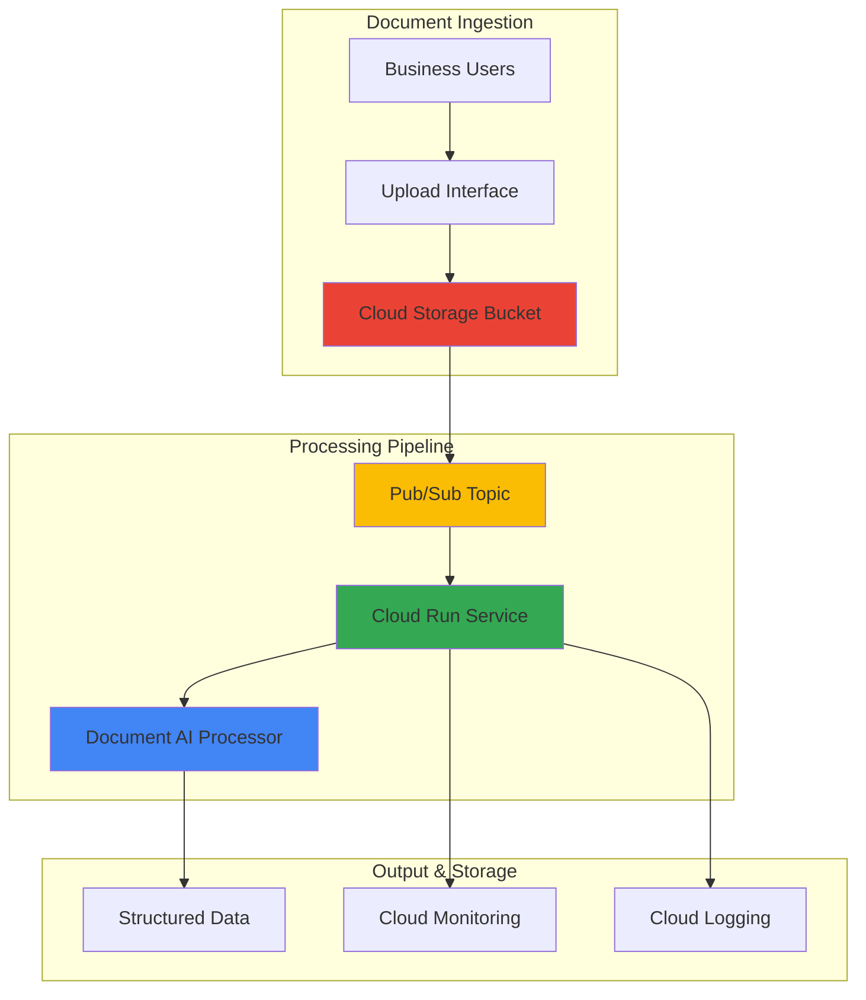

# Document Processing Workflows with Document AI and Cloud Run

## Problem

Organizations manually process thousands of forms, invoices, and contracts daily, leading to costly data entry errors, processing delays, and limited scalability during peak volumes. Traditional OCR solutions require extensive configuration and fail to extract structured data from complex document layouts, creating bottlenecks in business operations and preventing real-time decision making.

## Solution

Build an automated document processing pipeline using Google Cloud Document AI for intelligent data extraction, Cloud Run for serverless processing logic, and Pub/Sub for asynchronous workflow orchestration. This architecture scales automatically based on document volume while providing structured JSON output from unstructured documents for downstream business applications.

## Architecture Diagram



## Prerequisites

1. Google Cloud project with billing enabled and appropriate permissions
2. gcloud CLI v2 installed and configured (or Cloud Shell)
3. Basic understanding of serverless architectures and document processing
4. Docker Desktop installed for local container building (optional)
5. Estimated cost: $10-15 for processing 100 documents during testing

> **Note**: Document AI pricing varies by processor type and document volume. Form Parser costs $1.50 per 1,000 pages, while specialized processors like Invoice Parser cost $10.00 per 1,000 pages. Review [Document AI pricing](https://cloud.google.com/document-ai/pricing) for current rates.

## Preparation

```bash
# Set environment variables for the project
export PROJECT_ID="doc-processing-$(date +%s)"
export REGION="us-central1"
export BUCKET_NAME="document-uploads-${PROJECT_ID}"
export PUBSUB_TOPIC="document-processing"
export PUBSUB_SUBSCRIPTION="document-worker"
export CLOUDRUN_SERVICE="document-processor"

# Generate unique suffix for resource names
RANDOM_SUFFIX=$(openssl rand -hex 3)
export PROCESSOR_DISPLAY_NAME="form-parser-${RANDOM_SUFFIX}"

# Set default project and region
gcloud config set project ${PROJECT_ID}
gcloud config set compute/region ${REGION}

# Enable required Google Cloud APIs
gcloud services enable documentai.googleapis.com
gcloud services enable run.googleapis.com
gcloud services enable pubsub.googleapis.com
gcloud services enable storage.googleapis.com
gcloud services enable cloudbuild.googleapis.com
gcloud services enable artifactregistry.googleapis.com

echo "✅ Project configured: ${PROJECT_ID}"
echo "✅ Region set to: ${REGION}"
```

## Steps

1. **Create Document AI Processor for Form Parsing**:

   Document AI processors are specialized machine learning models that extract structured data from specific document types. The Form Parser processor uses advanced OCR and natural language processing to identify key-value pairs, tables, and text elements in documents, providing consistent extraction across various form layouts and quality levels.

   ```bash
   # Create a Form Parser processor for general document processing
   gcloud documentai processors create \
       --location=${REGION} \
       --display-name=${PROCESSOR_DISPLAY_NAME} \
       --type=FORM_PARSER_PROCESSOR
   
   # Store the processor ID for later use
   export PROCESSOR_ID=$(gcloud documentai processors list \
       --location=${REGION} \
       --filter="displayName:${PROCESSOR_DISPLAY_NAME}" \
       --format="value(name)" | cut -d'/' -f6)
   
   echo "✅ Document AI processor created with ID: ${PROCESSOR_ID}"
   ```

   The Form Parser processor is now active and ready to process documents. This general-purpose processor can handle various form types including applications, surveys, and basic invoices, providing structured JSON output with confidence scores for each extracted element.

2. **Create Cloud Storage Bucket for Document Uploads**:

   Cloud Storage provides the entry point for documents into our processing pipeline. The regional bucket configuration ensures low-latency access to Document AI processors in the same region while maintaining cost efficiency through intelligent storage class selection.

   ```bash
   # Create regional storage bucket for document uploads
   gsutil mb -p ${PROJECT_ID} \
       -c STANDARD \
       -l ${REGION} \
       gs://${BUCKET_NAME}
   
   # Enable object versioning for data protection
   gsutil versioning set on gs://${BUCKET_NAME}
   
   # Configure bucket notification to trigger processing
   echo "✅ Storage bucket created: gs://${BUCKET_NAME}"
   ```

   The storage bucket now provides a secure, scalable repository for document uploads with versioning enabled to protect against accidental deletions. This foundation supports the entire processing pipeline from ingestion through completion.

3. **Create Pub/Sub Topic and Subscription for Asynchronous Processing**:

   Pub/Sub enables decoupled, asynchronous communication between storage events and processing services. This messaging system ensures reliable document processing even during high-volume periods by providing message durability, retry mechanisms, and automatic scaling capabilities.

   ```bash
   # Create Pub/Sub topic for document processing events
   gcloud pubsub topics create ${PUBSUB_TOPIC}
   
   # Create subscription for Cloud Run service
   gcloud pubsub subscriptions create ${PUBSUB_SUBSCRIPTION} \
       --topic=${PUBSUB_TOPIC} \
       --ack-deadline=600 \
       --message-retention-duration=7d
   
   echo "✅ Pub/Sub topic and subscription created"
   ```

   The Pub/Sub infrastructure now provides reliable message delivery with extended acknowledgment deadlines to accommodate Document AI processing times. The 7-day message retention ensures no documents are lost during system maintenance or temporary outages.

4. **Configure Storage Bucket Notification to Pub/Sub**:

   Bucket notifications automatically trigger processing workflows when documents are uploaded. This event-driven architecture eliminates the need for polling mechanisms and ensures immediate processing initiation while maintaining loose coupling between system components.

   ```bash
   # Create notification configuration for new object uploads
   gsutil notification create -t ${PUBSUB_TOPIC} \
       -e OBJECT_FINALIZE \
       gs://${BUCKET_NAME}
   
   echo "✅ Storage notification configured to trigger Pub/Sub"
   ```

   The bucket notification system now automatically publishes messages to Pub/Sub whenever documents are uploaded, creating a seamless bridge between document storage and processing pipeline activation.

5. **Create Cloud Run Service for Document Processing**:

   Cloud Run provides serverless container execution with automatic scaling based on incoming requests. This service handles Document AI API calls, processes extraction results, and formats output data while managing authentication, error handling, and observability through Google Cloud's managed infrastructure.

   ```bash
   # Create a simple Python processing service
   mkdir -p document-processor
   cd document-processor
   
   # Create main processing script
   cat > main.py << 'EOF'
import os
import json
import base64
from google.cloud import documentai_v1 as documentai
from google.cloud import storage
from flask import Flask, request

app = Flask(__name__)

@app.route('/', methods=['POST'])
def process_document():
    # Parse Pub/Sub message
    envelope = request.get_json()
    if not envelope:
        return 'Bad Request', 400
    
    pubsub_message = envelope.get('message', {})
    data = pubsub_message.get('data', '')
    
    if not data:
        return 'No data', 400
    
    # Decode the message data
    message_data = json.loads(base64.b64decode(data).decode('utf-8'))
    bucket_name = message_data.get('bucketId')
    object_name = message_data.get('objectId')
    
    if not bucket_name or not object_name:
        return 'Missing bucket or object info', 400
    
    try:
        # Process document with Document AI
        result = process_with_documentai(bucket_name, object_name)
        
        # Log successful processing
        print(f"Successfully processed: {object_name}")
        print(f"Extracted entities: {len(result.get('entities', []))}")
        
        return 'OK', 200
    
    except Exception as e:
        print(f"Error processing {object_name}: {str(e)}")
        return f'Error: {str(e)}', 500

def process_with_documentai(bucket_name, object_name):
    # Initialize Document AI client
    client = documentai.DocumentProcessorServiceClient()
    
    # Configure processor
    project_id = os.environ.get('PROJECT_ID')
    location = os.environ.get('REGION')
    processor_id = os.environ.get('PROCESSOR_ID')
    
    processor_name = f"projects/{project_id}/locations/{location}/processors/{processor_id}"
    
    # Download document from Cloud Storage
    storage_client = storage.Client()
    bucket = storage_client.bucket(bucket_name)
    blob = bucket.blob(object_name)
    document_content = blob.download_as_bytes()
    
    # Process document
    document = documentai.Document(content=document_content, mime_type="application/pdf")
    request = documentai.ProcessRequest(name=processor_name, document=document)
    
    result = client.process_document(request=request)
    
    # Extract structured data
    extracted_data = {
        'source_file': object_name,
        'text': result.document.text,
        'entities': [],
        'tables': []
    }
    
    # Process form fields
    for form_field in result.document.pages[0].form_fields:
        if form_field.field_name and form_field.field_value:
            extracted_data['entities'].append({
                'name': form_field.field_name.text_anchor.content.strip(),
                'value': form_field.field_value.text_anchor.content.strip(),
                'confidence': form_field.field_value.confidence
            })
    
    # Save results to Cloud Storage
    results_blob = bucket.blob(f"processed/{object_name}.json")
    results_blob.upload_from_string(json.dumps(extracted_data, indent=2))
    
    return extracted_data

if __name__ == '__main__':
    app.run(host='0.0.0.0', port=int(os.environ.get('PORT', 8080)))
EOF
   
   # Create requirements file
   cat > requirements.txt << 'EOF'
google-cloud-documentai==2.20.1
google-cloud-storage==2.10.0
google-cloud-pubsub==2.18.0
flask==2.3.3
gunicorn==21.2.0
EOF
   
   # Create Dockerfile
   cat > Dockerfile << 'EOF'
FROM python:3.11-slim

WORKDIR /app
COPY requirements.txt .
RUN pip install --no-cache-dir -r requirements.txt

COPY main.py .

CMD exec gunicorn --bind :$PORT --workers 1 --threads 8 --timeout 600 main:app
EOF
   
   echo "✅ Cloud Run service code created"
   ```

   The processing service is now configured with comprehensive error handling, structured data extraction, and automatic result storage. This containerized application leverages Google Cloud client libraries for seamless integration with Document AI and storage services.

6. **Deploy Cloud Run Service with Environment Variables**:

   Cloud Run deployment configures the serverless environment with appropriate resource limits, environment variables, and security settings. The service automatically scales from zero to handle document processing loads while maintaining cost efficiency through per-request billing.

   ```bash
   # Deploy the Cloud Run service
   gcloud run deploy ${CLOUDRUN_SERVICE} \
       --source . \
       --platform managed \
       --region ${REGION} \
       --allow-unauthenticated \
       --set-env-vars PROJECT_ID=${PROJECT_ID} \
       --set-env-vars REGION=${REGION} \
       --set-env-vars PROCESSOR_ID=${PROCESSOR_ID} \
       --memory 1Gi \
       --cpu 1 \
       --timeout 600 \
       --max-instances 10
   
   # Get the service URL
   export SERVICE_URL=$(gcloud run services describe ${CLOUDRUN_SERVICE} \
       --region=${REGION} \
       --format="value(status.url)")
   
   echo "✅ Cloud Run service deployed at: ${SERVICE_URL}"
   cd ..
   ```

   The Cloud Run service is now live with optimized resource allocation for document processing workloads. The 10-minute timeout accommodates large documents while automatic scaling ensures cost-effective operation during varying processing volumes.

7. **Configure Pub/Sub Push Subscription to Cloud Run**:

   Push subscriptions enable automatic message delivery to Cloud Run services without requiring long-running connections or polling mechanisms. This configuration ensures reliable message processing with appropriate retry policies and error handling for failed document processing attempts.

   ```bash
   # Update subscription to push messages to Cloud Run
   gcloud pubsub subscriptions modify-push-config ${PUBSUB_SUBSCRIPTION} \
       --push-endpoint=${SERVICE_URL}
   
   # Verify subscription configuration
   gcloud pubsub subscriptions describe ${PUBSUB_SUBSCRIPTION}
   
   echo "✅ Pub/Sub subscription configured to push to Cloud Run"
   ```

   The push subscription now automatically delivers storage notifications to the Cloud Run service, completing the event-driven architecture that processes documents immediately upon upload without manual intervention.

8. **Create IAM Service Account with Required Permissions**:

   Service accounts provide secure, least-privilege access to Google Cloud resources. This configuration ensures the Cloud Run service can access Document AI processors, read from Cloud Storage, and write processing results while maintaining security best practices through scoped permissions.

   ```bash
   # Create service account for Cloud Run
   gcloud iam service-accounts create document-processor-sa \
       --description="Service account for document processing" \
       --display-name="Document Processor Service Account"
   
   # Grant necessary permissions
   gcloud projects add-iam-policy-binding ${PROJECT_ID} \
       --member="serviceAccount:document-processor-sa@${PROJECT_ID}.iam.gserviceaccount.com" \
       --role="roles/documentai.apiUser"
   
   gcloud projects add-iam-policy-binding ${PROJECT_ID} \
       --member="serviceAccount:document-processor-sa@${PROJECT_ID}.iam.gserviceaccount.com" \
       --role="roles/storage.objectAdmin"
   
   # Update Cloud Run service to use the service account
   gcloud run services update ${CLOUDRUN_SERVICE} \
       --region=${REGION} \
       --service-account=document-processor-sa@${PROJECT_ID}.iam.gserviceaccount.com
   
   echo "✅ Service account configured with least-privilege permissions"
   ```

   The service account now provides secure access to required resources while following Google Cloud security best practices. This configuration enables document processing operations without exposing unnecessary permissions or using overprivileged accounts.

## Validation & Testing

1. **Verify Document AI Processor Status**:

   ```bash
   # Check processor availability and configuration
   gcloud documentai processors list \
       --location=${REGION} \
       --format="table(name,displayName,type,state)"
   
   # Verify processor details
   gcloud documentai processors describe ${PROCESSOR_ID} \
       --location=${REGION}
   ```

   Expected output: Processor state should show "ENABLED" and type should show "FORM_PARSER_PROCESSOR".

2. **Test Storage Bucket and Pub/Sub Integration**:

   ```bash
   # Create test document
   echo "Test Document for Processing" > test-document.txt
   
   # Upload test file to trigger processing
   gsutil cp test-document.txt gs://${BUCKET_NAME}/
   
   # Check Pub/Sub message delivery
   gcloud pubsub subscriptions pull ${PUBSUB_SUBSCRIPTION} \
       --limit=1 \
       --auto-ack
   ```

   Expected output: Pub/Sub message containing storage event details should be visible.

3. **Verify Cloud Run Service Processing**:

   ```bash
   # Check Cloud Run service logs
   gcloud logging read "resource.type=cloud_run_revision AND resource.labels.service_name=${CLOUDRUN_SERVICE}" \
       --limit=20 \
       --format="table(timestamp,textPayload)"
   
   # Verify service metrics
   gcloud run services describe ${CLOUDRUN_SERVICE} \
       --region=${REGION} \
       --format="yaml(status.latestReadyRevisionName,status.url)"
   ```

   Expected output: Service logs should show successful document processing events.

4. **Test End-to-End Document Processing**:

   ```bash
   # Create sample PDF for testing (requires pandoc)
   if command -v pandoc &> /dev/null; then
       echo -e "# Sample Invoice\n\nInvoice Number: INV-001\nDate: $(date)\nAmount: \$150.00\nCustomer: Test Company" | \
       pandoc -o sample-invoice.pdf
       
       # Upload and process
       gsutil cp sample-invoice.pdf gs://${BUCKET_NAME}/
       
       # Wait for processing
       sleep 30
       
       # Check results
       gsutil ls gs://${BUCKET_NAME}/processed/
   fi
   ```

## Cleanup

1. **Remove Cloud Run Service**:

   ```bash
   # Delete Cloud Run service
   gcloud run services delete ${CLOUDRUN_SERVICE} \
       --region=${REGION} \
       --quiet
   
   echo "✅ Deleted Cloud Run service"
   ```

2. **Remove Pub/Sub Resources**:

   ```bash
   # Delete subscription and topic
   gcloud pubsub subscriptions delete ${PUBSUB_SUBSCRIPTION} --quiet
   gcloud pubsub topics delete ${PUBSUB_TOPIC} --quiet
   
   echo "✅ Deleted Pub/Sub resources"
   ```

3. **Remove Storage Bucket and Contents**:

   ```bash
   # Remove all objects and bucket
   gsutil -m rm -r gs://${BUCKET_NAME}
   
   echo "✅ Deleted storage bucket and contents"
   ```

4. **Remove Document AI Processor**:

   ```bash
   # Delete Document AI processor
   gcloud documentai processors delete ${PROCESSOR_ID} \
       --location=${REGION} \
       --quiet
   
   echo "✅ Deleted Document AI processor"
   ```

5. **Remove Service Account**:

   ```bash
   # Delete service account
   gcloud iam service-accounts delete \
       document-processor-sa@${PROJECT_ID}.iam.gserviceaccount.com \
       --quiet
   
   echo "✅ Deleted service account"
   echo "Note: Consider deleting the project if created specifically for this recipe"
   ```

## Discussion

This automated document processing pipeline demonstrates the power of combining Google Cloud's AI capabilities with serverless computing infrastructure. Document AI's Form Parser processor leverages advanced machine learning models trained on millions of documents to extract structured data with high accuracy, while Cloud Run provides cost-effective serverless execution that scales automatically based on document processing demands.

The architecture pattern shown here follows Google Cloud's event-driven design principles, where storage events trigger processing workflows through Pub/Sub messaging. This approach provides several key advantages: fault tolerance through message persistence, automatic retry mechanisms for failed processing attempts, and the ability to handle sudden spikes in document volume without manual infrastructure management. The loose coupling between components ensures that each service can be updated, scaled, or replaced independently.

For production deployments, consider implementing additional features such as Cloud Monitoring alerts for processing failures, Cloud Audit Logs for compliance tracking, and Cloud KMS encryption for sensitive documents. The current implementation can be extended to support specialized Document AI processors like Invoice Parser or Contract Parser for specific document types, each requiring minimal code changes while providing enhanced extraction capabilities.

Cost optimization opportunities include implementing Cloud Storage lifecycle policies to automatically archive processed documents to cheaper storage classes, using Cloud Scheduler for batch processing during off-peak hours, and leveraging Cloud Run's minimum instances feature for consistent performance during high-volume periods. Organizations processing thousands of documents daily typically see 60-80% cost reduction compared to traditional VM-based solutions while achieving better scalability and reliability.

> **Tip**: Monitor Document AI processing confidence scores and implement human review workflows for low-confidence extractions. This hybrid approach ensures accuracy while maintaining automation benefits for high-confidence document processing.

For more detailed information, refer to the [Document AI documentation](https://cloud.google.com/document-ai/docs), [Cloud Run best practices](https://cloud.google.com/run/docs/best-practices), [Pub/Sub event-driven patterns](https://cloud.google.com/pubsub/docs/overview), [Cloud Storage event notifications](https://cloud.google.com/storage/docs/pubsub-notifications), and the [Google Cloud Architecture Framework](https://cloud.google.com/architecture/framework).

## Challenge

Extend this solution by implementing these enhancements:

1. **Multi-Document Type Processing**: Configure specialized Document AI processors (Invoice, Receipt, Contract) with routing logic based on document classification confidence scores.

2. **Human-in-the-Loop Validation**: Implement Cloud Tasks queues to route low-confidence extractions to human reviewers through a Cloud Run web interface with approval workflows.

3. **Real-time Analytics Dashboard**: Build a Looker Studio dashboard connected to BigQuery that displays processing metrics, accuracy trends, and cost analytics with automated reporting.

4. **Advanced Security Implementation**: Add Cloud KMS encryption for documents, VPC Service Controls for network security, and Cloud DLP for sensitive data detection and redaction.

5. **Multi-Region Disaster Recovery**: Deploy the pipeline across multiple regions with Cloud Storage cross-region replication and automated failover using Cloud Load Balancing health checks.

## Infrastructure Code

*Infrastructure code will be generated after recipe approval.*