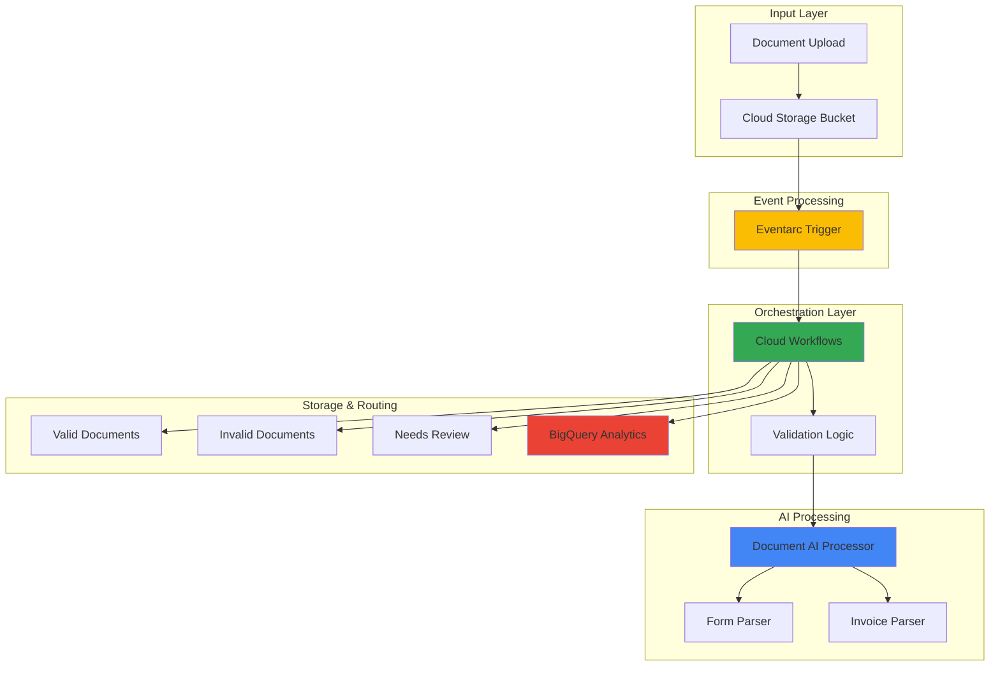

# Document Validation Workflows with Document AI and Cloud Workflows

## Problem

Many organizations struggle with manual document processing workflows that create bottlenecks in business operations. Financial institutions processing loan applications, insurance companies handling claims, and healthcare providers managing patient intake forms face challenges with inconsistent data extraction, validation errors, and delayed processing times. These manual processes not only increase operational costs but also lead to customer dissatisfaction and compliance risks when document validation is inconsistent or incomplete.

## Solution

This solution implements an intelligent, event-driven document validation pipeline using Google Cloud's Document AI for automated extraction and Cloud Workflows for sophisticated orchestration. When documents are uploaded to Cloud Storage, Eventarc triggers a Cloud Workflows execution that processes documents through Document AI, validates extracted data against business rules, and routes documents to appropriate downstream systems based on validation results. This approach provides consistent, scalable document processing while maintaining human oversight for exceptional cases.

## Architecture Diagram



## Prerequisites

1. Google Cloud project with billing enabled and appropriate IAM permissions for Document AI, Cloud Workflows, Cloud Storage, and Eventarc
2. Google Cloud CLI installed and configured (or Cloud Shell access)
3. Basic understanding of serverless architectures and document processing workflows
4. Familiarity with YAML syntax for workflow definitions
5. Estimated cost: $10-30 for testing (includes Document AI processing, Cloud Storage, and workflow executions)

> **Note**: Document AI charges per document page processed. Review [Document AI pricing](https://cloud.google.com/document-ai/pricing) for current rates and consider using the free tier for initial testing.

## Preparation

```bash
# Set environment variables for GCP resources
export PROJECT_ID="doc-validation-$(date +%s)"
export REGION="us-central1"
export ZONE="us-central1-a"

# Generate unique suffix for resource names
RANDOM_SUFFIX=$(openssl rand -hex 3)

# Set project configuration
gcloud config set project ${PROJECT_ID}
gcloud config set compute/region ${REGION}
gcloud config set compute/zone ${ZONE}

# Enable required APIs
gcloud services enable documentai.googleapis.com
gcloud services enable workflows.googleapis.com
gcloud services enable storage.googleapis.com
gcloud services enable eventarc.googleapis.com
gcloud services enable cloudbuild.googleapis.com
gcloud services enable bigquery.googleapis.com

# Create storage buckets for document processing pipeline
export INPUT_BUCKET="doc-input-${RANDOM_SUFFIX}"
export VALID_BUCKET="doc-valid-${RANDOM_SUFFIX}"
export INVALID_BUCKET="doc-invalid-${RANDOM_SUFFIX}"
export REVIEW_BUCKET="doc-review-${RANDOM_SUFFIX}"

gsutil mb -p ${PROJECT_ID} -c STANDARD -l ${REGION} gs://${INPUT_BUCKET}
gsutil mb -p ${PROJECT_ID} -c STANDARD -l ${REGION} gs://${VALID_BUCKET}
gsutil mb -p ${PROJECT_ID} -c STANDARD -l ${REGION} gs://${INVALID_BUCKET}
gsutil mb -p ${PROJECT_ID} -c STANDARD -l ${REGION} gs://${REVIEW_BUCKET}

echo "✅ Project configured: ${PROJECT_ID}"
echo "✅ Storage buckets created for document pipeline"
```

## Steps

1. **Create Document AI Processors for Multiple Document Types**:

   Document AI processors provide specialized machine learning models for extracting structured data from various document types. Creating multiple processors enables our workflow to handle different document formats with optimized extraction accuracy. The Form Parser excels at structured forms with key-value pairs, while the Invoice Parser is specifically trained for financial documents with complex layouts and tables.

   ```bash
   # Create Form Parser processor for general documents
   export FORM_PROCESSOR_ID=$(gcloud documentai processors create \
       --location=${REGION} \
       --display-name="form-processor-${RANDOM_SUFFIX}" \
       --type=FORM_PARSER_PROCESSOR \
       --format="value(name)" | sed 's/.*processors\///')
   
   # Create Invoice Parser for financial documents
   export INVOICE_PROCESSOR_ID=$(gcloud documentai processors create \
       --location=${REGION} \
       --display-name="invoice-processor-${RANDOM_SUFFIX}" \
       --type=INVOICE_PROCESSOR \
       --format="value(name)" | sed 's/.*processors\///')
   
   echo "✅ Form Processor created: ${FORM_PROCESSOR_ID}"
   echo "✅ Invoice Processor created: ${INVOICE_PROCESSOR_ID}"
   ```

   The processors are now ready to process documents with specialized extraction capabilities. Each processor uses pre-trained models optimized for specific document structures, ensuring high accuracy in data extraction while providing consistent output formats for downstream validation.

2. **Create BigQuery Dataset for Document Analytics**:

   BigQuery provides a scalable data warehouse for storing and analyzing document processing metrics, validation results, and business intelligence. This analytics foundation enables organizations to track processing performance, identify common validation failures, and optimize their document workflows based on data-driven insights.

   ```bash
   # Create BigQuery dataset for document analytics
   export DATASET_NAME="document_analytics_${RANDOM_SUFFIX//-/_}"
   
   bq mk --dataset \
       --location=${REGION} \
       --description="Document processing analytics and validation metrics" \
       ${PROJECT_ID}:${DATASET_NAME}
   
   # Create table for document processing results
   bq mk --table \
       ${PROJECT_ID}:${DATASET_NAME}.processing_results \
       document_id:STRING,processor_type:STRING,processing_time:TIMESTAMP,validation_status:STRING,confidence_score:FLOAT,extracted_fields:JSON,validation_errors:JSON
   
   echo "✅ BigQuery dataset created for document analytics"
   ```

   The BigQuery dataset now provides structured storage for comprehensive document processing analytics, enabling real-time monitoring and historical analysis of validation workflows.

3. **Create Cloud Workflows Definition for Document Processing**:

   Cloud Workflows orchestrates the complex document validation pipeline by defining a series of coordinated steps that handle document classification, AI processing, validation logic, and routing decisions. This serverless orchestration ensures reliable execution with built-in error handling and retry mechanisms while maintaining complete visibility into the processing workflow.

   ```bash
   # Create workflow definition file
   cat > document-validation-workflow.yaml << 'EOF'
main:
  params: [event]
  steps:
    - init:
        assign:
          - bucket: ${event.data.bucket}
          - name: ${event.data.name}
          - project_id: ${sys.get_env("GOOGLE_CLOUD_PROJECT_ID")}
          - region: "us-central1"
          - form_processor: ${sys.get_env("FORM_PROCESSOR_ID")}
          - invoice_processor: ${sys.get_env("INVOICE_PROCESSOR_ID")}
    
    - log_start:
        call: sys.log
        args:
          text: ${"Starting document processing for: " + name}
          severity: INFO
    
    - determine_document_type:
        switch:
          - condition: ${text.match_regex(name, ".*invoice.*|.*bill.*|.*receipt.*")}
            assign:
              - processor_id: ${invoice_processor}
              - document_type: "invoice"
            next: process_document
          - condition: ${text.match_regex(name, ".*form.*|.*application.*")}
            assign:
              - processor_id: ${form_processor}
              - document_type: "form"
            next: process_document
        next: default_processing
    
    - default_processing:
        assign:
          - processor_id: ${form_processor}
          - document_type: "general"
    
    - process_document:
        try:
          call: googleapis.documentai.v1.projects.locations.processors.process
          args:
            name: ${"projects/" + project_id + "/locations/" + region + "/processors/" + processor_id}
            body:
              rawDocument:
                content: ${base64.encode(http.get("gs://" + bucket + "/" + name).body)}
                mimeType: "application/pdf"
          result: processing_result
        except:
          as: e
          steps:
            - log_error:
                call: sys.log
                args:
                  text: ${"Document processing failed: " + string(e)}
                  severity: ERROR
            - move_to_invalid:
                call: googleapis.storage.v1.objects.copy
                args:
                  sourceBucket: ${bucket}
                  sourceObject: ${name}
                  destinationBucket: ${sys.get_env("INVALID_BUCKET")}
                  destinationObject: ${name}
            - return_error:
                return: {"status": "error", "message": "Processing failed"}
    
    - validate_extraction:
        assign:
          - confidence_threshold: 0.8
          - validation_errors: []
          - extracted_data: ${processing_result.document.entities}
    
    - check_confidence:
        for:
          value: entity
          in: ${extracted_data}
          steps:
            - evaluate_confidence:
                switch:
                  - condition: ${entity.confidence < confidence_threshold}
                    steps:
                      - add_error:
                          assign:
                            - validation_errors: ${list.concat(validation_errors, [{"field": entity.type, "confidence": entity.confidence, "reason": "Low confidence"}])}
    
    - determine_routing:
        switch:
          - condition: ${len(validation_errors) == 0}
            assign:
              - destination_bucket: ${sys.get_env("VALID_BUCKET")}
              - validation_status: "valid"
            next: route_document
          - condition: ${len(validation_errors) > 0 and len(validation_errors) <= 2}
            assign:
              - destination_bucket: ${sys.get_env("REVIEW_BUCKET")}
              - validation_status: "needs_review"
            next: route_document
          - condition: ${len(validation_errors) > 2}
            assign:
              - destination_bucket: ${sys.get_env("INVALID_BUCKET")}
              - validation_status: "invalid"
            next: route_document
    
    - route_document:
        call: googleapis.storage.v1.objects.copy
        args:
          sourceBucket: ${bucket}
          sourceObject: ${name}
          destinationBucket: ${destination_bucket}
          destinationObject: ${name}
    
    - store_analytics:
        call: googleapis.bigquery.v2.tabledata.insertAll
        args:
          projectId: ${project_id}
          datasetId: ${sys.get_env("DATASET_NAME")}
          tableId: "processing_results"
          body:
            rows:
              - json:
                  document_id: ${name}
                  processor_type: ${document_type}
                  processing_time: ${time.now()}
                  validation_status: ${validation_status}
                  confidence_score: ${if(len(extracted_data) > 0, extracted_data[0].confidence, 0.0)}
                  extracted_fields: ${extracted_data}
                  validation_errors: ${validation_errors}
    
    - cleanup_source:
        call: googleapis.storage.v1.objects.delete
        args:
          bucket: ${bucket}
          object: ${name}
    
    - log_completion:
        call: sys.log
        args:
          text: ${"Document processing completed: " + name + " -> " + validation_status}
          severity: INFO
    
    - return_result:
        return:
          status: "success"
          document: ${name}
          validation_status: ${validation_status}
          processor_used: ${document_type}
          validation_errors: ${validation_errors}
EOF
   
   echo "✅ Workflow definition created with intelligent routing logic"
   ```

   The workflow definition now includes sophisticated document classification, confidence-based validation, and intelligent routing logic that automatically adapts to different document types and quality levels.

4. **Deploy Cloud Workflows with Environment Variables**:

   Deploying the workflow with environment variables enables dynamic configuration while maintaining security and flexibility. The workflow can access processor IDs and bucket names through environment variables, making the solution portable across different environments while keeping sensitive configuration separate from the workflow definition.

   ```bash
   # Deploy the workflow with environment variables
   gcloud workflows deploy document-validation-workflow \
       --source=document-validation-workflow.yaml \
       --location=${REGION} \
       --env-vars="FORM_PROCESSOR_ID=${FORM_PROCESSOR_ID},INVOICE_PROCESSOR_ID=${INVOICE_PROCESSOR_ID},VALID_BUCKET=${VALID_BUCKET},INVALID_BUCKET=${INVALID_BUCKET},REVIEW_BUCKET=${REVIEW_BUCKET},DATASET_NAME=${DATASET_NAME}"
   
   # Get workflow details
   export WORKFLOW_NAME="document-validation-workflow"
   gcloud workflows describe ${WORKFLOW_NAME} \
       --location=${REGION} \
       --format="value(name)"
   
   echo "✅ Cloud Workflows deployed with environment configuration"
   ```

   The workflow is now deployed and ready to process documents with all necessary environment variables configured for seamless integration with Document AI processors and storage buckets.

5. **Create Eventarc Trigger for Automatic Processing**:

   Eventarc provides event-driven automation that triggers the document validation workflow whenever new files are uploaded to Cloud Storage. This serverless event processing ensures immediate response to document uploads while maintaining loose coupling between storage and processing components. The trigger filters events to process only relevant file types, optimizing resource usage and processing efficiency.

   ```bash
   # Create service account for Eventarc
   gcloud iam service-accounts create eventarc-workflows-sa \
       --display-name="Eventarc Workflows Service Account"
   
   # Grant necessary permissions to service account
   gcloud projects add-iam-policy-binding ${PROJECT_ID} \
       --member="serviceAccount:eventarc-workflows-sa@${PROJECT_ID}.iam.gserviceaccount.com" \
       --role="roles/workflows.invoker"
   
   gcloud projects add-iam-policy-binding ${PROJECT_ID} \
       --member="serviceAccount:eventarc-workflows-sa@${PROJECT_ID}.iam.gserviceaccount.com" \
       --role="roles/eventarc.eventReceiver"
   
   # Create Eventarc trigger for Cloud Storage events
   gcloud eventarc triggers create document-upload-trigger \
       --location=${REGION} \
       --destination-workflow=${WORKFLOW_NAME} \
       --destination-workflow-location=${REGION} \
       --event-filters="type=google.cloud.storage.object.v1.finalized" \
       --event-filters="bucket=${INPUT_BUCKET}" \
       --service-account="eventarc-workflows-sa@${PROJECT_ID}.iam.gserviceaccount.com"
   
   echo "✅ Eventarc trigger created for automatic document processing"
   ```

   The Eventarc trigger now automatically initiates document validation workflows whenever files are uploaded to the input bucket, creating a fully automated document processing pipeline.

6. **Configure IAM Permissions for Workflow Execution**:

   Proper IAM configuration ensures the workflow has necessary permissions to interact with Document AI, Cloud Storage, and BigQuery while maintaining security best practices. The Compute Engine default service account receives minimal required permissions, following the principle of least privilege while enabling full workflow functionality.

   ```bash
   # Get the Compute Engine default service account
   export COMPUTE_SA="${PROJECT_ID}-compute@developer.gserviceaccount.com"
   
   # Grant Document AI permissions
   gcloud projects add-iam-policy-binding ${PROJECT_ID} \
       --member="serviceAccount:${COMPUTE_SA}" \
       --role="roles/documentai.apiUser"
   
   # Grant Cloud Storage permissions
   gcloud projects add-iam-policy-binding ${PROJECT_ID} \
       --member="serviceAccount:${COMPUTE_SA}" \
       --role="roles/storage.objectAdmin"
   
   # Grant BigQuery permissions
   gcloud projects add-iam-policy-binding ${PROJECT_ID} \
       --member="serviceAccount:${COMPUTE_SA}" \
       --role="roles/bigquery.dataEditor"
   
   gcloud projects add-iam-policy-binding ${PROJECT_ID} \
       --member="serviceAccount:${COMPUTE_SA}" \
       --role="roles/bigquery.jobUser"
   
   echo "✅ IAM permissions configured for workflow execution"
   ```

   The workflow now has appropriate permissions to execute all required operations while maintaining security boundaries between different Google Cloud services.

7. **Create Sample Documents for Testing**:

   Creating realistic test documents enables validation of the entire pipeline while demonstrating different document types and processing scenarios. These samples represent common business documents that organizations typically process, providing a comprehensive test of the AI extraction capabilities and validation logic.

   ```bash
   # Create a sample invoice document (text-based for testing)
   cat > sample_invoice.txt << 'EOF'
INVOICE

Date: 2025-01-15
Invoice Number: INV-2025-001
Due Date: 2025-02-15

Bill To:
ABC Corporation
123 Business Street
City, State 12345

Description: Consulting Services
Amount: $2,500.00
Tax: $250.00
Total: $2,750.00

Payment Terms: Net 30 days
EOF
   
   # Create a sample form document
   cat > sample_form.txt << 'EOF'
APPLICATION FORM

Name: John Doe
Email: john.doe@example.com
Phone: (555) 123-4567
Address: 456 Main Street, Anytown, ST 67890

Application Type: Business License
Date Submitted: 2025-01-15
Signature: [Digital Signature]
EOF
   
   # Upload test documents to trigger processing
   gsutil cp sample_invoice.txt gs://${INPUT_BUCKET}/
   gsutil cp sample_form.txt gs://${INPUT_BUCKET}/
   
   echo "✅ Sample documents uploaded for testing"
   echo "🔄 Document processing workflows should trigger automatically"
   ```

   Sample documents are now uploaded and will trigger the automated processing pipeline, demonstrating the complete document validation workflow from upload to final routing.

## Validation & Testing

1. **Verify Document AI processors are active**:

   ```bash
   # Check processor status and capabilities
   gcloud documentai processors list \
       --location=${REGION} \
       --format="table(name,type,state)"
   
   # Test processor with a sample document
   echo "Sample processor response format:"
   gcloud documentai processors describe \
       --location=${REGION} \
       --processor=${FORM_PROCESSOR_ID} \
       --format="value(name,type)"
   ```

   Expected output: Active processors with ENABLED state and correct processor types.

2. **Monitor workflow executions**:

   ```bash
   # List recent workflow executions
   gcloud workflows executions list ${WORKFLOW_NAME} \
       --location=${REGION} \
       --limit=5 \
       --format="table(name,state,startTime,endTime)"
   
   # Get details of the most recent execution
   LATEST_EXECUTION=$(gcloud workflows executions list ${WORKFLOW_NAME} \
       --location=${REGION} \
       --limit=1 \
       --format="value(name)")
   
   gcloud workflows executions describe ${LATEST_EXECUTION} \
       --workflow=${WORKFLOW_NAME} \
       --location=${REGION}
   ```

   Expected output: Successful workflow executions with SUCCEEDED state and processing results.

3. **Verify document routing and analytics**:

   ```bash
   # Check document distribution across buckets
   echo "Valid documents:"
   gsutil ls gs://${VALID_BUCKET}/
   
   echo "Documents needing review:"
   gsutil ls gs://${REVIEW_BUCKET}/
   
   echo "Invalid documents:"
   gsutil ls gs://${INVALID_BUCKET}/
   
   # Query BigQuery analytics
   bq query --use_legacy_sql=false "
   SELECT 
     validation_status,
     COUNT(*) as document_count,
     AVG(confidence_score) as avg_confidence
   FROM \`${PROJECT_ID}.${DATASET_NAME}.processing_results\`
   GROUP BY validation_status
   ORDER BY document_count DESC"
   ```

   Expected output: Documents properly routed to appropriate buckets with analytics data in BigQuery showing processing metrics.

## Cleanup

1. **Delete Eventarc trigger and service accounts**:

   ```bash
   # Delete Eventarc trigger
   gcloud eventarc triggers delete document-upload-trigger \
       --location=${REGION} \
       --quiet
   
   # Delete service account
   gcloud iam service-accounts delete \
       eventarc-workflows-sa@${PROJECT_ID}.iam.gserviceaccount.com \
       --quiet
   
   echo "✅ Eventarc resources deleted"
   ```

2. **Remove Cloud Workflows and Document AI processors**:

   ```bash
   # Delete workflow
   gcloud workflows delete ${WORKFLOW_NAME} \
       --location=${REGION} \
       --quiet
   
   # Delete Document AI processors
   gcloud documentai processors delete ${FORM_PROCESSOR_ID} \
       --location=${REGION} \
       --quiet
   
   gcloud documentai processors delete ${INVOICE_PROCESSOR_ID} \
       --location=${REGION} \
       --quiet
   
   echo "✅ Workflows and Document AI processors deleted"
   ```

3. **Remove storage buckets and BigQuery dataset**:

   ```bash
   # Delete storage buckets and contents
   gsutil -m rm -r gs://${INPUT_BUCKET}
   gsutil -m rm -r gs://${VALID_BUCKET}
   gsutil -m rm -r gs://${INVALID_BUCKET}
   gsutil -m rm -r gs://${REVIEW_BUCKET}
   
   # Delete BigQuery dataset
   bq rm -r -f ${PROJECT_ID}:${DATASET_NAME}
   
   # Clean up local files
   rm -f document-validation-workflow.yaml sample_*.txt
   
   echo "✅ Storage and analytics resources cleaned up"
   echo "💰 All billable resources have been removed"
   ```

## Discussion

This intelligent document validation solution demonstrates the power of combining Google Cloud's AI capabilities with serverless orchestration to create scalable, event-driven processing pipelines. Document AI provides state-of-the-art machine learning models specifically trained for document understanding, offering superior accuracy compared to traditional OCR solutions. The platform's ability to handle various document types through specialized processors (Form Parser, Invoice Parser, Contract Parser) ensures optimal extraction quality for different business use cases.

Cloud Workflows serves as the orchestration backbone, providing reliable execution with built-in error handling, retry mechanisms, and state management. The workflow definition uses a declarative approach that makes complex business logic readable and maintainable. The integration with Eventarc creates a truly serverless architecture where document processing begins automatically upon upload, eliminating the need for polling or manual intervention. This event-driven pattern scales naturally with document volume while maintaining cost efficiency through pay-per-use pricing.

The solution's validation logic demonstrates sophisticated decision-making capabilities by evaluating extraction confidence scores and routing documents based on business rules. Documents with high confidence scores proceed automatically to valid processing, while those requiring human review are flagged appropriately. This hybrid approach maintains processing efficiency while ensuring quality control. The BigQuery integration provides comprehensive analytics, enabling organizations to track processing metrics, identify improvement opportunities, and demonstrate compliance with audit requirements.

> **Tip**: Monitor Document AI confidence scores over time to identify document types that may benefit from custom processor training or workflow optimization.

Security considerations include proper IAM role assignments following the principle of least privilege, with service accounts granted only the minimum permissions required for their specific functions. The solution supports encryption at rest and in transit through Google Cloud's default security features. For additional security, consider implementing Cloud KMS for customer-managed encryption keys and Cloud DLP for sensitive data detection and redaction.

## Challenge

Extend this document validation solution by implementing these enhancements:

1. **Custom Document Classifier**: Implement a Document AI custom classifier to automatically categorize documents into specific business types (contracts, invoices, applications, reports) for more targeted processing workflows and improved routing accuracy.

2. **Human-in-the-Loop Review Interface**: Build a Cloud Run web application that presents documents requiring review to human operators, allowing them to validate AI extractions, make corrections, and provide feedback for continuous model improvement.

3. **Advanced Validation Rules Engine**: Create a Cloud Functions-based validation service that applies complex business rules (date validations, cross-field consistency checks, external database lookups) to extracted data before final approval.

4. **Multi-Language Document Support**: Extend the workflow to handle documents in multiple languages by integrating Cloud Translation API for text normalization and training custom Document AI processors for specific regional document formats.

5. **Real-Time Processing Dashboard**: Implement a real-time monitoring dashboard using Cloud Monitoring, Looker Studio, or custom Cloud Run application that displays processing metrics, validation statistics, error rates, and system health indicators for operational teams.

## Infrastructure Code

*Infrastructure code will be generated after recipe approval.*