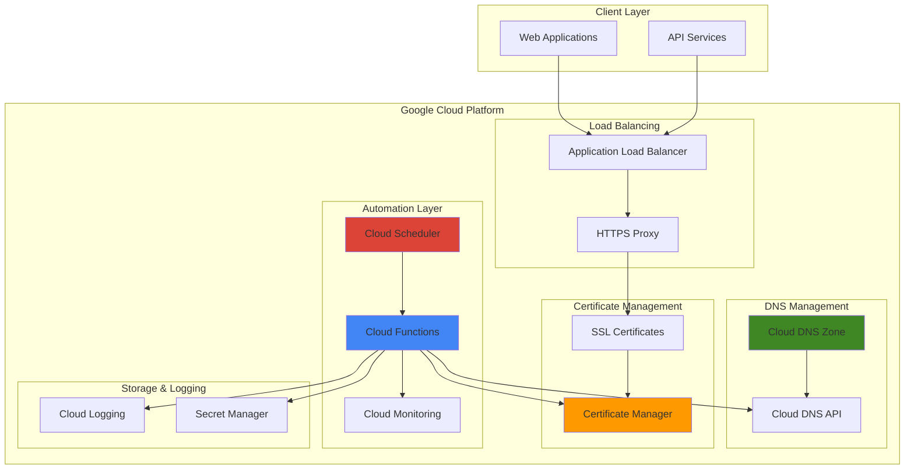

# Domain and Certificate Lifecycle Management with Cloud DNS and Certificate Manager

## Problem

Organizations managing multiple web applications and APIs face significant operational overhead manually managing DNS records and SSL/TLS certificates. Manual certificate renewal processes are error-prone and can lead to service outages when certificates expire unexpectedly, while DNS changes require careful coordination across development teams. Without automation, teams spend valuable time on routine maintenance tasks instead of focusing on core business features, and the risk of security vulnerabilities increases with manual processes.

## Solution

Build an automated certificate and domain management system using Google Cloud DNS for authoritative DNS management and Certificate Manager for automated SSL/TLS certificate provisioning and renewal. Cloud Functions will handle certificate lifecycle events and DNS updates, while Cloud Scheduler orchestrates regular health checks and proactive renewals, creating a comprehensive automation framework that eliminates manual intervention and reduces operational risk.

## Architecture Diagram



## Prerequisites

1. Google Cloud account with billing enabled and appropriate IAM permissions (DNS Administrator, Certificate Manager Editor, Cloud Functions Developer)
2. Google Cloud CLI installed and configured (or Cloud Shell access)
3. Basic understanding of DNS concepts, SSL/TLS certificates, and serverless functions
4. A registered domain name with ability to configure nameservers (for testing)
5. Estimated cost: $5-15/month for DNS zones, certificate management, and minimal Cloud Functions usage

> **Note**: This recipe uses Google-managed certificates which are free, but DNS zones incur charges based on the number of zones and queries processed.

## Preparation

```bash
# Set environment variables for GCP resources
export PROJECT_ID="cert-dns-automation-$(date +%s)"
export REGION="us-central1"
export ZONE="us-central1-a"

# Generate unique suffix for resource names
RANDOM_SUFFIX=$(openssl rand -hex 3)
export DNS_ZONE_NAME="automation-zone-${RANDOM_SUFFIX}"
export DOMAIN_NAME="example-${RANDOM_SUFFIX}.com"
export CERT_NAME="ssl-cert-${RANDOM_SUFFIX}"
export FUNCTION_NAME="cert-automation-${RANDOM_SUFFIX}"
export SCHEDULER_JOB="cert-check-${RANDOM_SUFFIX}"

# Set default project and region
gcloud config set project ${PROJECT_ID}
gcloud config set compute/region ${REGION}
gcloud config set compute/zone ${ZONE}

# Enable required APIs
gcloud services enable dns.googleapis.com \
    certificatemanager.googleapis.com \
    cloudfunctions.googleapis.com \
    cloudscheduler.googleapis.com \
    secretmanager.googleapis.com \
    monitoring.googleapis.com \
    compute.googleapis.com

echo "✅ Project configured: ${PROJECT_ID}"
echo "✅ Domain configured: ${DOMAIN_NAME}"
```

## Steps

1. **Create Cloud DNS Zone for Domain Management**:

   Cloud DNS provides scalable, reliable, and managed authoritative DNS service that forms the foundation for automated domain management. Creating a DNS zone establishes Google Cloud as the authoritative source for your domain's DNS records, enabling programmatic control over DNS configurations and supporting automated certificate validation through DNS challenges.

   ```bash
   # Create DNS zone for domain management
   gcloud dns managed-zones create ${DNS_ZONE_NAME} \
       --dns-name="${DOMAIN_NAME}." \
       --description="Automated DNS zone for certificate management" \
       --visibility=public
   
   # Get nameserver information
   gcloud dns managed-zones describe ${DNS_ZONE_NAME} \
       --format="value(nameServers)" > nameservers.txt
   
   echo "✅ DNS zone created successfully"
   echo "Configure these nameservers with your domain registrar:"
   cat nameservers.txt
   ```

   The DNS zone is now configured and ready to handle automated DNS record management. The nameservers listed must be configured with your domain registrar to delegate DNS authority to Google Cloud, enabling automated certificate validation and DNS-based automation workflows.

2. **Create Service Account for Automation Functions**:

   A dedicated service account with minimal required permissions ensures secure automation while following the principle of least privilege. This service account will authenticate Cloud Functions to interact with DNS, Certificate Manager, and monitoring services without requiring broad project-level permissions.

   ```bash
   # Create service account for automation
   gcloud iam service-accounts create cert-automation \
       --display-name="Certificate Automation Service Account" \
       --description="Service account for DNS and certificate automation"
   
   # Grant necessary permissions
   gcloud projects add-iam-policy-binding ${PROJECT_ID} \
       --member="serviceAccount:cert-automation@${PROJECT_ID}.iam.gserviceaccount.com" \
       --role="roles/dns.admin"
   
   gcloud projects add-iam-policy-binding ${PROJECT_ID} \
       --member="serviceAccount:cert-automation@${PROJECT_ID}.iam.gserviceaccount.com" \
       --role="roles/certificatemanager.editor"
   
   gcloud projects add-iam-policy-binding ${PROJECT_ID} \
       --member="serviceAccount:cert-automation@${PROJECT_ID}.iam.gserviceaccount.com" \
       --role="roles/monitoring.metricWriter"
   
   echo "✅ Service account configured with appropriate permissions"
   ```

   The service account is now ready with precisely scoped permissions for DNS management, certificate operations, and monitoring, ensuring secure automation without excessive privileges that could pose security risks.

3. **Create Certificate Manager Certificate**:

   Certificate Manager automates the entire certificate lifecycle, from initial provisioning through renewal, using Google's robust infrastructure and Let's Encrypt integration. Google-managed certificates automatically renew approximately 30 days before expiration, eliminating manual intervention and reducing the risk of service disruptions.

   ```bash
   # Create Google-managed certificate
   gcloud certificate-manager certificates create ${CERT_NAME} \
       --domains="${DOMAIN_NAME}" \
       --global
   
   # Create certificate map for load balancer integration
   gcloud certificate-manager maps create cert-map-${RANDOM_SUFFIX} \
       --global
   
   # Add certificate to map
   gcloud certificate-manager maps entries create ${DOMAIN_NAME} \
       --map=cert-map-${RANDOM_SUFFIX} \
       --certificates=${CERT_NAME} \
       --hostname="${DOMAIN_NAME}" \
       --global
   
   echo "✅ Certificate and certificate map created"
   ```

   The certificate is now provisioned and will automatically validate domain ownership through DNS challenges. Certificate Manager handles the complete validation process and will begin automatic renewal cycles approximately 60 days after issuance.

4. **Deploy Certificate Monitoring Cloud Function**:

   The monitoring function provides proactive certificate health checking and automated alerting when certificates approach expiration or encounter validation issues. This serverless approach ensures continuous monitoring without infrastructure overhead while enabling custom business logic for certificate lifecycle events.

   ```bash
   # Create function source directory
   mkdir -p cert-automation-function
   cd cert-automation-function
   
   # Create main function file
   cat > main.py << 'EOF'
import os
import json
import logging
from datetime import datetime, timedelta
from google.cloud import certificatemanager_v1
from google.cloud import dns
from google.cloud import monitoring_v3
from google.cloud import secretmanager
import functions_framework

logging.basicConfig(level=logging.INFO)
logger = logging.getLogger(__name__)

@functions_framework.http
def check_certificates(request):
    """Monitor certificate status and handle lifecycle events."""
    try:
        project_id = os.environ.get('GCP_PROJECT')
        
        # Initialize clients
        cert_client = certificatemanager_v1.CertificateManagerClient()
        dns_client = dns.Client(project=project_id)
        monitoring_client = monitoring_v3.MetricServiceClient()
        
        # List all certificates
        location = f"projects/{project_id}/locations/global"
        certificates = cert_client.list_certificates(parent=location)
        
        results = []
        for cert in certificates:
            cert_info = {
                'name': cert.name,
                'domains': list(cert.managed.domains),
                'state': cert.managed.state.name,
                'provisioning_issue': cert.managed.provisioning_issue.reason if cert.managed.provisioning_issue else None
            }
            
            # Check certificate expiration
            if cert.managed.state == certificatemanager_v1.Certificate.ManagedCertificate.State.ACTIVE:
                # Certificate is active - log success metric
                write_metric(monitoring_client, project_id, 'certificate_status', 1, cert.name)
                logger.info(f"Certificate {cert.name} is active and healthy")
            else:
                # Certificate has issues - log failure metric
                write_metric(monitoring_client, project_id, 'certificate_status', 0, cert.name)
                logger.warning(f"Certificate {cert.name} state: {cert.managed.state.name}")
            
            results.append(cert_info)
        
        return {
            'status': 'success',
            'certificates_checked': len(results),
            'certificates': results,
            'timestamp': datetime.utcnow().isoformat()
        }
        
    except Exception as e:
        logger.error(f"Certificate check failed: {str(e)}")
        return {'status': 'error', 'message': str(e)}, 500

def write_metric(client, project_id, metric_type, value, resource_name):
    """Write custom metric to Cloud Monitoring."""
    try:
        project_name = f"projects/{project_id}"
        
        series = monitoring_v3.TimeSeries()
        series.metric.type = f"custom.googleapis.com/{metric_type}"
        series.resource.type = "global"
        series.resource.labels["project_id"] = project_id
        
        point = monitoring_v3.Point()
        point.value.int64_value = value
        point.interval.end_time.seconds = int(datetime.utcnow().timestamp())
        series.points = [point]
        
        client.create_time_series(name=project_name, time_series=[series])
        
    except Exception as e:
        logger.error(f"Failed to write metric: {str(e)}")

@functions_framework.http
def update_dns_record(request):
    """Update DNS records for certificate validation or domain changes."""
    try:
        request_json = request.get_json(silent=True)
        if not request_json:
            return {'error': 'Invalid JSON payload'}, 400
            
        project_id = os.environ.get('GCP_PROJECT')
        zone_name = request_json.get('zone_name')
        record_name = request_json.get('record_name')
        record_type = request_json.get('record_type', 'A')
        record_data = request_json.get('record_data')
        ttl = request_json.get('ttl', 300)
        
        if not all([zone_name, record_name, record_data]):
            return {'error': 'Missing required parameters'}, 400
        
        # Initialize DNS client and get zone
        dns_client = dns.Client(project=project_id)
        zone = dns_client.zone(zone_name)
        
        # Create or update DNS record
        record_set = zone.resource_record_set(record_name, record_type, ttl, [record_data])
        
        # Check if record exists and update or create
        changes = zone.changes()
        
        try:
            existing_record = next(zone.list_resource_record_sets(name=record_name, type_=record_type))
            changes.delete_record_set(existing_record)
            logger.info(f"Existing record found, updating: {record_name}")
        except StopIteration:
            logger.info(f"Creating new record: {record_name}")
        
        changes.add_record_set(record_set)
        changes.create()
        
        # Wait for changes to complete
        while changes.status != 'done':
            changes.reload()
        
        return {
            'status': 'success',
            'message': f'DNS record {record_name} updated successfully',
            'record_type': record_type,
            'record_data': record_data
        }
        
    except Exception as e:
        logger.error(f"DNS update failed: {str(e)}")
        return {'status': 'error', 'message': str(e)}, 500
EOF
   
   # Create requirements file with updated versions
   cat > requirements.txt << 'EOF'
google-cloud-certificate-manager>=1.14.1
google-cloud-dns>=0.35.1
google-cloud-monitoring>=2.21.0
google-cloud-secret-manager>=2.20.0
functions-framework>=3.8.2
EOF
   
   echo "✅ Function source code prepared"
   ```

   The monitoring function source code is now ready with comprehensive certificate health checking, DNS record management, and custom metrics integration. The function provides both HTTP endpoints for on-demand operations and scheduled monitoring capabilities.

5. **Deploy Cloud Functions for Certificate Management**:

   Deploying the Cloud Function creates a serverless endpoint that can respond to certificate lifecycle events and scheduled health checks. The function integrates with Cloud Monitoring for observability and uses the previously configured service account for secure API access.

   ```bash
   # Deploy certificate monitoring function
   gcloud functions deploy ${FUNCTION_NAME} \
       --runtime python312 \
       --trigger-http \
       --allow-unauthenticated \
       --source . \
       --entry-point check_certificates \
       --memory 256MB \
       --timeout 60s \
       --service-account "cert-automation@${PROJECT_ID}.iam.gserviceaccount.com" \
       --set-env-vars "GCP_PROJECT=${PROJECT_ID}"
   
   # Deploy DNS update function
   gcloud functions deploy dns-update-${RANDOM_SUFFIX} \
       --runtime python312 \
       --trigger-http \
       --allow-unauthenticated \
       --source . \
       --entry-point update_dns_record \
       --memory 256MB \
       --timeout 60s \
       --service-account "cert-automation@${PROJECT_ID}.iam.gserviceaccount.com" \
       --set-env-vars "GCP_PROJECT=${PROJECT_ID}"
   
   # Get function URLs
   export CERT_FUNCTION_URL=$(gcloud functions describe ${FUNCTION_NAME} \
       --format="value(httpsTrigger.url)")
   export DNS_FUNCTION_URL=$(gcloud functions describe dns-update-${RANDOM_SUFFIX} \
       --format="value(httpsTrigger.url)")
   
   cd ..
   echo "✅ Cloud Functions deployed successfully"
   echo "Certificate monitoring URL: ${CERT_FUNCTION_URL}"
   echo "DNS update URL: ${DNS_FUNCTION_URL}"
   ```

   The Cloud Functions are now deployed and accessible via HTTPS endpoints. These functions provide the core automation capabilities for certificate monitoring and DNS management, operating with minimal latency and automatic scaling based on demand.

6. **Configure Cloud Scheduler for Automated Monitoring**:

   Cloud Scheduler provides reliable, managed cron functionality that triggers certificate health checks at regular intervals. Scheduled monitoring ensures proactive detection of certificate issues and enables automatic remediation before problems impact users or services.

   ```bash
   # Create Cloud Scheduler job for certificate monitoring
   gcloud scheduler jobs create http ${SCHEDULER_JOB} \
       --schedule="0 */6 * * *" \
       --uri="${CERT_FUNCTION_URL}" \
       --http-method=GET \
       --description="Automated certificate health monitoring" \
       --time-zone="UTC" \
       --location=${REGION}
   
   # Create additional job for daily comprehensive checks
   gcloud scheduler jobs create http daily-cert-audit-${RANDOM_SUFFIX} \
       --schedule="0 2 * * *" \
       --uri="${CERT_FUNCTION_URL}" \
       --http-method=GET \
       --description="Daily comprehensive certificate audit" \
       --time-zone="UTC" \
       --location=${REGION}
   
   echo "✅ Scheduled monitoring jobs created"
   echo "Certificate monitoring will run every 6 hours"
   echo "Comprehensive audits will run daily at 2:00 AM UTC"
   ```

   The automated monitoring system is now active with both frequent health checks and comprehensive daily audits. This dual-schedule approach balances operational visibility with cost efficiency while ensuring rapid detection of certificate issues.

7. **Create Application Load Balancer with Certificate Integration**:

   The Application Load Balancer provides the production endpoint where certificates are actually utilized, demonstrating the complete integration between Certificate Manager, Cloud DNS, and Google Cloud's load balancing infrastructure. This configuration shows how automated certificate management integrates with real traffic serving.

   ```bash
   # Create health check for backend service
   gcloud compute health-checks create http basic-health-check-${RANDOM_SUFFIX} \
       --port 80 \
       --request-path "/" \
       --check-interval 30s \
       --timeout 5s \
       --healthy-threshold 2 \
       --unhealthy-threshold 3
   
   # Create backend service
   gcloud compute backend-services create demo-backend-${RANDOM_SUFFIX} \
       --protocol=HTTP \
       --port-name=http \
       --health-checks=basic-health-check-${RANDOM_SUFFIX} \
       --global
   
   # Create URL map
   gcloud compute url-maps create demo-url-map-${RANDOM_SUFFIX} \
       --default-service=demo-backend-${RANDOM_SUFFIX} \
       --global
   
   # Create HTTPS proxy with certificate map
   gcloud compute target-https-proxies create demo-https-proxy-${RANDOM_SUFFIX} \
       --url-map=demo-url-map-${RANDOM_SUFFIX} \
       --certificate-map=cert-map-${RANDOM_SUFFIX} \
       --global
   
   # Create forwarding rule
   gcloud compute forwarding-rules create demo-https-rule-${RANDOM_SUFFIX} \
       --target-https-proxy=demo-https-proxy-${RANDOM_SUFFIX} \
       --ports=443 \
       --global
   
   # Get load balancer IP
   export LB_IP=$(gcloud compute forwarding-rules describe demo-https-rule-${RANDOM_SUFFIX} \
       --global --format="value(IPAddress)")
   
   echo "✅ Load balancer created with certificate integration"
   echo "Load balancer IP: ${LB_IP}"
   ```

   The load balancer infrastructure is now configured with automated certificate management. Traffic to your domain will be secured with automatically managed certificates that renew without service interruption.

8. **Configure DNS Records for Load Balancer**:

   Creating the DNS A record connects your domain to the load balancer, completing the automated certificate validation process and enabling end-to-end HTTPS connectivity. This step demonstrates how DNS automation integrates with certificate management for seamless domain operations.

   ```bash
   # Add A record pointing to load balancer
   curl -X POST "${DNS_FUNCTION_URL}" \
       -H "Content-Type: application/json" \
       -d "{
           \"zone_name\": \"${DNS_ZONE_NAME}\",
           \"record_name\": \"${DOMAIN_NAME}.\",
           \"record_type\": \"A\",
           \"record_data\": \"${LB_IP}\",
           \"ttl\": 300
       }"
   
   # Add CNAME record for www subdomain
   curl -X POST "${DNS_FUNCTION_URL}" \
       -H "Content-Type: application/json" \
       -d "{
           \"zone_name\": \"${DNS_ZONE_NAME}\",
           \"record_name\": \"www.${DOMAIN_NAME}.\",
           \"record_type\": \"CNAME\",
           \"record_data\": \"${DOMAIN_NAME}.\",
           \"ttl\": 300
       }"
   
   echo "✅ DNS records configured for automated certificate validation"
   echo "Domain ${DOMAIN_NAME} now points to load balancer"
   ```

   The DNS configuration is complete, enabling automatic certificate validation and providing a production-ready domain setup. Certificate Manager will now automatically validate domain ownership and provision the SSL certificate.

## Validation & Testing

1. Verify certificate provisioning status:

   ```bash
   # Check certificate status
   gcloud certificate-manager certificates describe ${CERT_NAME} \
       --global \
       --format="table(name,managed.state,managed.domains)"
   ```

   Expected output: Certificate should show "ACTIVE" state after domain validation completes (5-15 minutes).

2. Test automated monitoring function:

   ```bash
   # Trigger certificate monitoring function manually
   curl -X GET "${CERT_FUNCTION_URL}"
   
   # Check function logs
   gcloud functions logs read ${FUNCTION_NAME} --limit=10
   ```

   Expected output: JSON response showing certificate status and monitoring results.

3. Verify DNS record management:

   ```bash
   # Test DNS record creation through automation
   curl -X POST "${DNS_FUNCTION_URL}" \
       -H "Content-Type: application/json" \
       -d "{
           \"zone_name\": \"${DNS_ZONE_NAME}\",
           \"record_name\": \"test.${DOMAIN_NAME}.\",
           \"record_type\": \"A\",
           \"record_data\": \"1.2.3.4\",
           \"ttl\": 300
       }"
   
   # Verify record was created
   gcloud dns record-sets list --zone=${DNS_ZONE_NAME} \
       --filter="name:test.${DOMAIN_NAME}"
   ```

4. Test scheduled monitoring:

   ```bash
   # Check scheduler job status
   gcloud scheduler jobs describe ${SCHEDULER_JOB} \
       --location=${REGION}
   
   # View recent job executions
   gcloud scheduler jobs list --location=${REGION} \
       --filter="name:${SCHEDULER_JOB}"
   ```

## Cleanup

1. Remove Cloud Scheduler jobs:

   ```bash
   # Delete scheduler jobs
   gcloud scheduler jobs delete ${SCHEDULER_JOB} \
       --location=${REGION} --quiet
   gcloud scheduler jobs delete daily-cert-audit-${RANDOM_SUFFIX} \
       --location=${REGION} --quiet
   
   echo "✅ Deleted scheduler jobs"
   ```

2. Remove Cloud Functions:

   ```bash
   # Delete Cloud Functions
   gcloud functions delete ${FUNCTION_NAME} --quiet
   gcloud functions delete dns-update-${RANDOM_SUFFIX} --quiet
   
   echo "✅ Deleted Cloud Functions"
   ```

3. Remove load balancer components:

   ```bash
   # Delete forwarding rule
   gcloud compute forwarding-rules delete demo-https-rule-${RANDOM_SUFFIX} \
       --global --quiet
   
   # Delete HTTPS proxy
   gcloud compute target-https-proxies delete demo-https-proxy-${RANDOM_SUFFIX} \
       --global --quiet
   
   # Delete URL map
   gcloud compute url-maps delete demo-url-map-${RANDOM_SUFFIX} \
       --global --quiet
   
   # Delete backend service
   gcloud compute backend-services delete demo-backend-${RANDOM_SUFFIX} \
       --global --quiet
   
   # Delete health check
   gcloud compute health-checks delete basic-health-check-${RANDOM_SUFFIX} \
       --quiet
   
   echo "✅ Deleted load balancer components"
   ```

4. Remove certificates and certificate map:

   ```bash
   # Delete certificate map entries
   gcloud certificate-manager maps entries delete ${DOMAIN_NAME} \
       --map=cert-map-${RANDOM_SUFFIX} \
       --global --quiet
   
   # Delete certificate map
   gcloud certificate-manager maps delete cert-map-${RANDOM_SUFFIX} \
       --global --quiet
   
   # Delete certificate
   gcloud certificate-manager certificates delete ${CERT_NAME} \
       --global --quiet
   
   echo "✅ Deleted certificates and certificate map"
   ```

5. Remove DNS zone and service account:

   ```bash
   # Delete DNS zone
   gcloud dns managed-zones delete ${DNS_ZONE_NAME} --quiet
   
   # Delete service account
   gcloud iam service-accounts delete \
       cert-automation@${PROJECT_ID}.iam.gserviceaccount.com --quiet
   
   # Clean up local files
   rm -rf cert-automation-function nameservers.txt
   
   echo "✅ Cleanup completed successfully"
   echo "Note: Remember to revert nameserver changes with your domain registrar"
   ```

## Discussion

This automated certificate and domain management solution demonstrates how Google Cloud's managed services can eliminate manual overhead while improving security posture and operational reliability. Certificate Manager's integration with Let's Encrypt provides industry-standard certificates with automatic renewal, while Cloud DNS offers enterprise-grade DNS management with programmatic control through APIs and Cloud Functions.

The serverless architecture using Cloud Functions and Cloud Scheduler provides cost-effective automation that scales automatically based on demand. This approach eliminates the need for dedicated infrastructure while ensuring reliable execution of certificate lifecycle management tasks. The monitoring integration with Cloud Monitoring enables proactive alerting and observability into certificate health, supporting both operational teams and compliance requirements.

The solution follows Google Cloud security best practices by implementing least-privilege service accounts, encrypting data in transit through HTTPS everywhere, and using managed services that handle security patching and updates automatically. Certificate Manager's integration with Google's global infrastructure ensures high availability and performance for certificate validation and renewal processes. For organizations with compliance requirements, this automated approach provides consistent certificate management with full audit trails through Cloud Logging.

This architecture pattern scales efficiently from development environments to enterprise production deployments, supporting multiple domains, complex certificate hierarchies, and integration with existing CI/CD pipelines. The modular design allows teams to extend functionality for specific use cases, such as integration with external monitoring systems, custom certificate validation workflows, or multi-cloud certificate management strategies. See the [Google Cloud Certificate Manager documentation](https://cloud.google.com/certificate-manager/docs) and [Google Cloud DNS best practices](https://cloud.google.com/dns/docs/best-practices) for additional guidance.

> **Tip**: Monitor certificate validation metrics in Cloud Monitoring to identify DNS propagation issues or domain ownership challenges that could affect automatic renewal processes.

## Challenge

Extend this solution by implementing these enhancements:

1. **Multi-Environment Certificate Management**: Create separate certificate automation for development, staging, and production environments with environment-specific DNS zones and automated promotion workflows between environments.

2. **Custom Certificate Authority Integration**: Integrate with Certificate Authority Service to use private CA certificates for internal applications, implementing automated certificate distribution to Google Kubernetes Engine clusters and Compute Engine instances.

3. **Advanced Monitoring and Alerting**: Implement comprehensive monitoring with custom Cloud Monitoring dashboards, alerting policies for certificate expiration warnings, and integration with external notification systems like Slack or PagerDuty for operational awareness.

4. **Multi-Cloud Certificate Synchronization**: Extend the automation to synchronize certificates across multiple cloud providers or on-premises infrastructure, implementing secure certificate distribution and renewal coordination across hybrid environments.

5. **Compliance and Audit Automation**: Build compliance reporting features that automatically generate certificate inventory reports, track certificate usage across applications, and integrate with security scanning tools to ensure certificate policies are enforced consistently.

## Infrastructure Code

*Infrastructure code will be generated after recipe approval.*