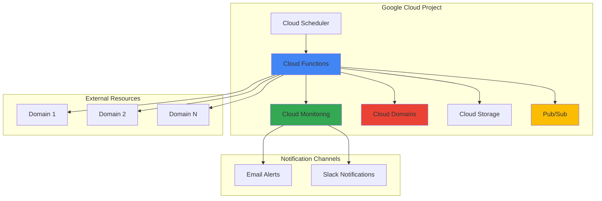

# Domain Health Monitoring with Cloud Domains and Cloud Functions

## Problem

Organizations managing multiple domains face challenges monitoring SSL certificate expiration, DNS resolution issues, and domain registration status across their portfolio. Manual monitoring is error-prone and reactive, often resulting in unexpected service outages when certificates expire or DNS configurations fail. Without automated health checks and proactive alerting, businesses risk losing customer trust and revenue due to website downtime that could have been prevented.

## Solution

Implement an automated domain health monitoring system using Cloud Domains for centralized domain management, Cloud Functions for serverless health checks, and Cloud Monitoring for real-time alerting. This solution continuously monitors SSL certificate expiration dates, DNS resolution performance, and domain registration status, providing proactive notifications before issues impact users and enabling rapid response to potential problems.

## Architecture Diagram



## Prerequisites

1. Google Cloud account with billing enabled and appropriate permissions for Cloud Domains, Cloud Functions, Cloud Monitoring, and Cloud Storage
2. Google Cloud CLI installed and configured (or use Cloud Shell)
3. Basic knowledge of Python programming and DNS concepts
4. At least one domain registered or transferred to Cloud Domains for testing
5. Estimated cost: $10-30/month depending on monitoring frequency and number of domains

> **Note**: Cloud Domains charges apply for domain registration and renewal. Cloud Functions and Cloud Monitoring usage typically falls within free tier limits for most monitoring scenarios.

## Preparation

```bash
# Set environment variables for GCP resources
export PROJECT_ID="domain-monitor-$(date +%s)"
export REGION="us-central1"
export ZONE="us-central1-a"

# Generate unique suffix for resource names
RANDOM_SUFFIX=$(openssl rand -hex 3)
export FUNCTION_NAME="domain-health-monitor-${RANDOM_SUFFIX}"
export BUCKET_NAME="domain-monitor-storage-${RANDOM_SUFFIX}"
export TOPIC_NAME="domain-alerts-${RANDOM_SUFFIX}"

# Set default project and region
gcloud config set project ${PROJECT_ID}
gcloud config set compute/region ${REGION}
gcloud config set compute/zone ${ZONE}

# Enable required APIs
gcloud services enable cloudfunctions.googleapis.com
gcloud services enable cloudscheduler.googleapis.com
gcloud services enable monitoring.googleapis.com
gcloud services enable domains.googleapis.com
gcloud services enable storage.googleapis.com
gcloud services enable pubsub.googleapis.com

echo "✅ Project configured: ${PROJECT_ID}"
echo "✅ Required APIs enabled"
```

## Steps

1. **Create Cloud Storage Bucket for Function Code**:

   Cloud Storage provides the deployment repository for Cloud Functions source code and monitoring data. The bucket serves as both a staging area for function deployments and a persistent storage location for historical monitoring data, enabling trend analysis and compliance reporting.

   ```bash
   # Create storage bucket for function source and data
   gsutil mb -p ${PROJECT_ID} \
       -c STANDARD \
       -l ${REGION} \
       gs://${BUCKET_NAME}
   
   # Enable versioning for code deployment tracking
   gsutil versioning set on gs://${BUCKET_NAME}
   
   echo "✅ Storage bucket created: gs://${BUCKET_NAME}"
   ```

   The storage bucket now provides secure, versioned storage for function deployments and monitoring data, supporting both current operations and historical analysis with Google's globally distributed infrastructure.

2. **Create Pub/Sub Topic for Alert Notifications**:

   Pub/Sub provides asynchronous message delivery for alert notifications, enabling reliable communication between the monitoring function and various notification channels. This decoupled architecture ensures alert delivery even during high-load scenarios and supports multiple subscriber patterns.

   ```bash
   # Create Pub/Sub topic for domain alerts
   gcloud pubsub topics create ${TOPIC_NAME}
   
   # Create subscription for alert processing
   gcloud pubsub subscriptions create ${TOPIC_NAME}-sub \
       --topic=${TOPIC_NAME}
   
   echo "✅ Pub/Sub topic created: ${TOPIC_NAME}"
   ```

   The Pub/Sub topic establishes reliable message queuing for alert notifications, providing guaranteed delivery and supporting multiple notification channels through subscriber patterns.

3. **Create Domain Health Monitoring Function**:

   Cloud Functions provides serverless execution for domain health checks, automatically scaling based on monitoring frequency and eliminating infrastructure management overhead. The function performs comprehensive health validation including SSL certificate expiration, DNS resolution, and HTTP response verification.

   ```bash
   # Create function directory and requirements
   mkdir -p domain-monitor-function
   cd domain-monitor-function
   
   # Create requirements.txt for Python dependencies
   cat > requirements.txt << 'EOF'
google-cloud-monitoring==2.27.0
google-cloud-domains==1.6.0
google-cloud-storage==2.17.0
google-cloud-pubsub==2.25.0
requests==2.32.0
cryptography==42.0.0
dnspython==2.6.0
EOF
   
   echo "✅ Function dependencies configured"
   ```

   The Python dependencies enable comprehensive domain health monitoring with Google Cloud service integration, SSL certificate validation, and DNS resolution checking capabilities using the latest stable library versions.

4. **Implement Domain Health Check Logic**:

   The monitoring function implements multi-layered health validation including SSL certificate expiration checking, DNS resolution verification, and HTTP response validation. This comprehensive approach identifies potential issues before they impact users and provides detailed diagnostic information for troubleshooting.

   ```bash
   # Create main.py with domain health monitoring logic
   cat > main.py << 'EOF'
import ssl
import socket
import requests
import dns.resolver
from datetime import datetime, timedelta
from google.cloud import monitoring_v3
from google.cloud import domains_v1
from google.cloud import storage
from google.cloud import pubsub_v1
import json
import os

def domain_health_check(request):
    """Cloud Function to perform comprehensive domain health checks"""
    
    # Initialize Google Cloud clients
    monitoring_client = monitoring_v3.MetricServiceClient()
    domains_client = domains_v1.DomainsClient()
    storage_client = storage.Client()
    publisher = pubsub_v1.PublisherClient()
    
    project_id = os.environ.get('GCP_PROJECT')
    topic_path = publisher.topic_path(project_id, os.environ.get('TOPIC_NAME'))
    
    # Domain list - customize based on your domains
    domains_to_check = [
        'example.com',
        'test-domain.net'
    ]
    
    results = []
    
    for domain in domains_to_check:
        result = {
            'domain': domain,
            'timestamp': datetime.utcnow().isoformat(),
            'ssl_valid': False,
            'ssl_expires': None,
            'dns_resolves': False,
            'http_responds': False,
            'alerts': []
        }
        
        try:
            # Check SSL certificate
            ssl_info = check_ssl_certificate(domain)
            result['ssl_valid'] = ssl_info['valid']
            result['ssl_expires'] = ssl_info['expires']
            
            if ssl_info.get('days_until_expiry', 0) < 30:
                alert_msg = f"SSL certificate for {domain} expires in {ssl_info['days_until_expiry']} days"
                result['alerts'].append(alert_msg)
                send_alert(publisher, topic_path, alert_msg)
            
            # Check DNS resolution
            dns_result = check_dns_resolution(domain)
            result['dns_resolves'] = dns_result
            
            if not dns_result:
                alert_msg = f"DNS resolution failed for {domain}"
                result['alerts'].append(alert_msg)
                send_alert(publisher, topic_path, alert_msg)
            
            # Check HTTP response
            http_result = check_http_response(domain)
            result['http_responds'] = http_result
            
            if not http_result:
                alert_msg = f"HTTP response check failed for {domain}"
                result['alerts'].append(alert_msg)
                send_alert(publisher, topic_path, alert_msg)
            
            # Send metrics to Cloud Monitoring
            send_metrics(monitoring_client, project_id, domain, result)
            
        except Exception as e:
            error_msg = f"Error checking {domain}: {str(e)}"
            result['alerts'].append(error_msg)
            send_alert(publisher, topic_path, error_msg)
        
        results.append(result)
    
    # Store results in Cloud Storage
    store_results(storage_client, results)
    
    return {'status': 'completed', 'checked_domains': len(results)}

def check_ssl_certificate(domain):
    """Check SSL certificate validity and expiration"""
    try:
        context = ssl.create_default_context()
        with socket.create_connection((domain, 443), timeout=10) as sock:
            with context.wrap_socket(sock, server_hostname=domain) as ssock:
                cert = ssock.getpeercert()
                
                # Parse expiration date
                expire_date = datetime.strptime(cert['notAfter'], '%b %d %H:%M:%S %Y %Z')
                days_until_expiry = (expire_date - datetime.utcnow()).days
                
                return {
                    'valid': True,
                    'expires': expire_date.isoformat(),
                    'days_until_expiry': days_until_expiry
                }
    except Exception as e:
        return {
            'valid': False,
            'expires': None,
            'days_until_expiry': 0,
            'error': str(e)
        }

def check_dns_resolution(domain):
    """Check if domain resolves correctly"""
    try:
        result = dns.resolver.resolve(domain, 'A')
        return len(result) > 0
    except Exception:
        return False

def check_http_response(domain):
    """Check if domain responds to HTTP requests"""
    try:
        response = requests.get(f'https://{domain}', timeout=10)
        return response.status_code < 400
    except Exception:
        return False

def send_metrics(client, project_id, domain, result):
    """Send metrics to Cloud Monitoring"""
    project_name = f"projects/{project_id}"
    
    # Create time series data
    interval = monitoring_v3.TimeInterval()
    now = datetime.utcnow()
    interval.end_time.seconds = int(now.timestamp())
    
    # SSL validity metric
    series = monitoring_v3.TimeSeries()
    series.metric.type = "custom.googleapis.com/domain/ssl_valid"
    series.resource.type = "global"
    series.metric.labels["domain"] = domain
    
    point = monitoring_v3.Point()
    point.value.double_value = 1.0 if result['ssl_valid'] else 0.0
    point.interval.CopyFrom(interval)
    series.points = [point]
    
    client.create_time_series(name=project_name, time_series=[series])

def send_alert(publisher, topic_path, message):
    """Send alert message to Pub/Sub"""
    alert_data = {
        'message': message,
        'timestamp': datetime.utcnow().isoformat(),
        'severity': 'warning'
    }
    
    publisher.publish(topic_path, json.dumps(alert_data).encode('utf-8'))

def store_results(storage_client, results):
    """Store monitoring results in Cloud Storage"""
    bucket_name = os.environ.get('BUCKET_NAME')
    bucket = storage_client.bucket(bucket_name)
    
    timestamp = datetime.utcnow().strftime('%Y-%m-%d-%H-%M-%S')
    blob_name = f"monitoring-results/{timestamp}.json"
    
    blob = bucket.blob(blob_name)
    blob.upload_from_string(json.dumps(results, indent=2))
EOF
   
   echo "✅ Domain health check function implemented"
   ```

   The function provides comprehensive domain health monitoring with SSL certificate validation, DNS resolution checking, and HTTP response verification, integrating seamlessly with Google Cloud monitoring and alerting services using modern Python libraries.

5. **Deploy Cloud Function with Scheduled Execution**:

   Cloud Functions deployment creates a serverless monitoring service that automatically scales based on execution frequency. The scheduled trigger ensures consistent monitoring intervals while the function's stateless design provides reliable execution without infrastructure management overhead.

   ```bash
   # Set environment variables for the function
   export TOPIC_NAME_VAR=${TOPIC_NAME}
   export BUCKET_NAME_VAR=${BUCKET_NAME}
   
   # Deploy Cloud Function with environment variables
   gcloud functions deploy ${FUNCTION_NAME} \
       --runtime python312 \
       --trigger-http \
       --source . \
       --entry-point domain_health_check \
       --memory 512MB \
       --timeout 300s \
       --set-env-vars="TOPIC_NAME=${TOPIC_NAME_VAR},BUCKET_NAME=${BUCKET_NAME_VAR}" \
       --allow-unauthenticated \
       --region=${REGION}
   
   # Get function URL for scheduler
   FUNCTION_URL=$(gcloud functions describe ${FUNCTION_NAME} \
       --region=${REGION} \
       --format="value(httpsTrigger.url)")
   
   echo "✅ Cloud Function deployed: ${FUNCTION_NAME}"
   echo "Function URL: ${FUNCTION_URL}"
   ```

   The Cloud Function is now deployed with the latest Python 3.12 runtime, appropriate environment configuration and resource allocation, ready to perform automated domain health monitoring with secure HTTP trigger access.

6. **Create Cloud Scheduler Job for Automated Monitoring**:

   Cloud Scheduler provides reliable, cron-based triggering for the monitoring function, ensuring consistent health checks at defined intervals. The managed scheduling service eliminates the need for dedicated infrastructure while providing retry logic and failure handling for robust automation.

   ```bash
   # Create Cloud Scheduler job for regular monitoring
   gcloud scheduler jobs create http domain-monitor-schedule \
       --schedule="0 */6 * * *" \
       --uri="${FUNCTION_URL}" \
       --http-method=GET \
       --location=${REGION} \
       --description="Domain health monitoring every 6 hours"
   
   # Run initial manual execution
   gcloud scheduler jobs run domain-monitor-schedule \
       --location=${REGION}
   
   echo "✅ Cloud Scheduler job created and executed"
   ```

   The scheduler now triggers domain health monitoring every 6 hours, providing consistent monitoring coverage while allowing for customizable frequency based on business requirements and cost considerations.

7. **Configure Cloud Monitoring Alerting Policy**:

   Cloud Monitoring alerting policies provide automated notification when domain health issues are detected, enabling rapid response to potential problems. The policy configuration defines alert conditions, notification channels, and escalation procedures for comprehensive incident management.

   ```bash
   # Create alerting policy configuration
   cat > alert-policy.json << 'EOF'
{
  "displayName": "Domain Health Alert Policy",
  "conditions": [
    {
      "displayName": "SSL Certificate Expiring Soon",
      "conditionThreshold": {
        "filter": "metric.type=\"custom.googleapis.com/domain/ssl_valid\"",
        "comparison": "COMPARISON_LESS_THAN",
        "thresholdValue": 1.0,
        "duration": "300s"
      }
    }
  ],
  "alertStrategy": {
    "autoClose": "1800s"
  },
  "enabled": true
}
EOF
   
   # Create the alerting policy
   gcloud alpha monitoring policies create \
       --policy-from-file=alert-policy.json
   
   echo "✅ Cloud Monitoring alert policy configured"
   ```

   The alerting policy monitors domain health metrics and automatically triggers notifications when SSL certificates approach expiration or other health issues are detected, ensuring proactive incident response.

8. **Set Up Notification Channels**:

   Notification channels define how alerts are delivered to operations teams, supporting multiple communication methods including email, SMS, and third-party integrations. Proper channel configuration ensures critical alerts reach the right people through their preferred communication channels.

   ```bash
   # Create email notification channel
   gcloud alpha monitoring channels create \
       --display-name="Domain Alerts Email" \
       --type=email \
       --channel-labels=email_address=admin@yourdomain.com
   
   # List available notification channels
   gcloud alpha monitoring channels list \
       --format="table(name,displayName,type)"
   
   echo "✅ Notification channels configured"
   echo "Update the email address in the command above with your actual email"
   ```

   Notification channels provide reliable alert delivery through multiple communication methods, ensuring operations teams receive timely notifications about domain health issues regardless of their current communication preferences.

## Validation & Testing

1. **Verify Cloud Function Deployment**:

   ```bash
   # Check function status and configuration
   gcloud functions describe ${FUNCTION_NAME} \
       --region=${REGION} \
       --format="table(name,status,runtime,timeout)"
   
   # View function logs
   gcloud functions logs read ${FUNCTION_NAME} \
       --region=${REGION} \
       --limit=10
   ```

   Expected output: Function status should show "ACTIVE" with proper runtime and timeout configuration.

2. **Test Domain Health Monitoring**:

   ```bash
   # Trigger function manually for testing
   curl -X GET "${FUNCTION_URL}" \
       -H "Content-Type: application/json"
   
   # Check monitoring results in Cloud Storage
   gsutil ls gs://${BUCKET_NAME}/monitoring-results/
   ```

   Expected output: Function should return success status and create monitoring results files in Cloud Storage.

3. **Verify Monitoring Metrics**:

   ```bash
   # Check custom metrics in Cloud Monitoring
   gcloud logging read "resource.type=cloud_function AND \
       resource.labels.function_name=${FUNCTION_NAME}" \
       --limit=10 --format="table(timestamp,textPayload)"
   ```

   Expected output: Logs should show successful domain health checks and metric submissions.

4. **Test Alert Configuration**:

   ```bash
   # List alerting policies
   gcloud alpha monitoring policies list \
       --format="table(displayName,enabled,conditions[0].displayName)"
   
   # Check notification channels
   gcloud alpha monitoring channels list \
       --format="table(displayName,type,enabled)"
   ```

   Expected output: Alert policies should be enabled with proper condition configuration and notification channels should be active.

## Cleanup

1. **Delete Cloud Scheduler Job**:

   ```bash
   # Remove scheduled monitoring job
   gcloud scheduler jobs delete domain-monitor-schedule \
       --location=${REGION} \
       --quiet
   
   echo "✅ Cloud Scheduler job deleted"
   ```

2. **Remove Cloud Function**:

   ```bash
   # Delete the monitoring function
   gcloud functions delete ${FUNCTION_NAME} \
       --region=${REGION} \
       --quiet
   
   echo "✅ Cloud Function deleted"
   ```

3. **Clean Up Monitoring Resources**:

   ```bash
   # Delete alerting policies
   POLICY_ID=$(gcloud alpha monitoring policies list \
       --filter="displayName:'Domain Health Alert Policy'" \
       --format="value(name)")
   
   if [ ! -z "$POLICY_ID" ]; then
       gcloud alpha monitoring policies delete $POLICY_ID --quiet
   fi
   
   # Delete notification channels
   CHANNEL_ID=$(gcloud alpha monitoring channels list \
       --filter="displayName:'Domain Alerts Email'" \
       --format="value(name)")
   
   if [ ! -z "$CHANNEL_ID" ]; then
       gcloud alpha monitoring channels delete $CHANNEL_ID --quiet
   fi
   
   echo "✅ Monitoring resources cleaned up"
   ```

4. **Remove Storage and Pub/Sub Resources**:

   ```bash
   # Delete Pub/Sub resources
   gcloud pubsub subscriptions delete ${TOPIC_NAME}-sub --quiet
   gcloud pubsub topics delete ${TOPIC_NAME} --quiet
   
   # Remove Cloud Storage bucket and contents
   gsutil -m rm -r gs://${BUCKET_NAME}
   
   echo "✅ Storage and messaging resources deleted"
   ```

5. **Clean Up Project Resources**:

   ```bash
   # Remove function source directory
   cd ..
   rm -rf domain-monitor-function
   
   # Unset environment variables
   unset FUNCTION_NAME BUCKET_NAME TOPIC_NAME PROJECT_ID REGION ZONE
   
   echo "✅ Local resources and environment variables cleaned up"
   echo "Note: Project deletion should be done manually if created specifically for this recipe"
   ```

## Discussion

This automated domain health monitoring solution demonstrates the power of Google Cloud's serverless architecture for infrastructure monitoring and management. By combining Cloud Domains for centralized domain management, Cloud Functions for serverless execution, and Cloud Monitoring for comprehensive alerting, organizations can achieve proactive domain health monitoring without the overhead of dedicated infrastructure management.

The Cloud Functions approach provides several key advantages over traditional monitoring solutions. First, the serverless execution model eliminates infrastructure maintenance while providing automatic scaling based on monitoring frequency. Second, the pay-per-invocation pricing model makes this solution cost-effective for organizations monitoring any number of domains. Third, the integration with Google Cloud's monitoring and alerting infrastructure provides enterprise-grade reliability and notification capabilities that scale from small businesses to large enterprises.

The SSL certificate monitoring component addresses one of the most common causes of unexpected website outages. By checking certificate expiration dates and providing configurable advance warning (30 days by default), operations teams can proactively renew certificates before they impact users. The DNS resolution checking ensures that domain name resolution continues to function correctly, while HTTP response validation confirms that web services remain accessible. This multi-layered approach provides comprehensive coverage of the most common domain-related failure modes.

Cloud Monitoring integration enables sophisticated alerting policies with customizable thresholds, notification channels, and escalation procedures. The solution stores historical monitoring data in Cloud Storage, enabling trend analysis and compliance reporting. Organizations can extend this foundation to include additional health checks such as email server validation, API endpoint monitoring, or performance metrics collection.

> **Tip**: Consider implementing different monitoring frequencies for different types of domains. Critical production domains might require hourly checks, while development or staging domains could be monitored daily to optimize costs while maintaining adequate coverage.

For comprehensive guidance on domain management best practices, refer to the [Google Cloud Domains documentation](https://cloud.google.com/domains/docs), [Cloud Functions monitoring patterns](https://cloud.google.com/functions/docs/monitoring), [Cloud Monitoring alerting strategies](https://cloud.google.com/monitoring/alerts), and [SSL certificate management best practices](https://cloud.google.com/load-balancing/docs/ssl-certificates). Additionally, the [Google Cloud Architecture Center](https://cloud.google.com/architecture) provides reference architectures for comprehensive monitoring and alerting solutions.

## Challenge

Extend this domain health monitoring solution by implementing these enhancements:

1. **Multi-Region Monitoring**: Deploy the monitoring function across multiple Google Cloud regions to verify domain accessibility from different geographic locations and detect regional connectivity issues.

2. **Advanced SSL Analysis**: Enhance the SSL checking to validate certificate chain integrity, check for weak cipher suites, and monitor for certificate transparency log entries to detect unauthorized certificates.

3. **Performance Monitoring**: Add response time measurements, page load performance testing, and uptime percentage calculations with SLA tracking and reporting capabilities.

4. **Integration with External Services**: Connect the monitoring system to external services like Slack, PagerDuty, or ServiceNow for advanced incident management workflows and automated ticket creation.

5. **Dashboard and Reporting**: Create custom Cloud Monitoring dashboards with domain health visualizations, historical trend analysis, and automated compliance reports for stakeholder communication.

## Infrastructure Code

### Available Infrastructure as Code:

- [Infrastructure Code Overview](code/README.md) - Detailed description of all infrastructure components
- [Infrastructure Manager](code/infrastructure-manager/) - GCP Infrastructure Manager templates
- [Bash CLI Scripts](code/scripts/) - Example bash scripts using gcloud CLI commands to deploy infrastructure
- [Terraform](code/terraform/) - Terraform configuration files