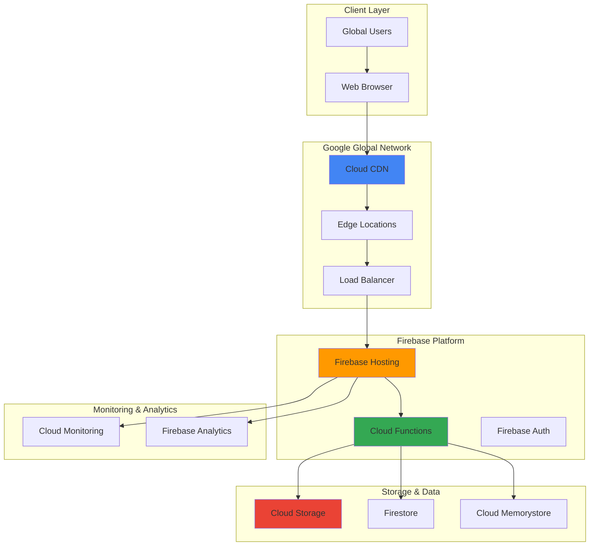

# Dynamic Content Delivery with Firebase Hosting and Cloud CDN

## Problem

E-commerce and media-rich applications struggle with global content delivery performance as user traffic scales across different geographical regions. Traditional hosting solutions fail to provide the automatic optimization, edge caching, and serverless backend integration needed for modern web applications that serve dynamic product catalogs, user-generated content, and real-time updates while maintaining sub-second load times worldwide.

## Solution

Firebase Hosting combined with Cloud CDN provides a comprehensive global content delivery architecture that automatically optimizes static assets, caches dynamic content at edge locations, and seamlessly integrates with Cloud Functions for serverless backend processing. This solution leverages Google's global infrastructure to deliver content from the nearest edge location while maintaining dynamic capabilities through intelligent caching strategies.

## Architecture Diagram



## Prerequisites

1. Google Cloud account with billing enabled and appropriate permissions
2. Node.js v20+ and npm installed locally
3. Firebase CLI v14+ installed (`npm install -g firebase-tools`)
4. gcloud CLI v450+ installed and configured
5. Basic understanding of web development and CDN concepts
6. Estimated cost: $5-15 for resources created during this recipe

> **Note**: Firebase Hosting includes a generous free tier with 10GB storage and 360MB daily transfer. Additional usage follows pay-as-you-go pricing.

## Preparation

```bash
# Set environment variables for Google Cloud resources
export PROJECT_ID="content-delivery-$(date +%s)"
export REGION="us-central1"
export LOCATION="us-central"

# Generate unique suffix for resource names
RANDOM_SUFFIX=$(openssl rand -hex 3)
export SITE_ID="cdn-demo-${RANDOM_SUFFIX}"
export STORAGE_BUCKET="${PROJECT_ID}-media"
export FUNCTION_NAME="dynamic-content-${RANDOM_SUFFIX}"

# Create and configure Google Cloud project
gcloud projects create ${PROJECT_ID} \
    --name="Dynamic Content Delivery Demo"
gcloud config set project ${PROJECT_ID}
gcloud config set compute/region ${REGION}

# Enable required APIs for Firebase and Cloud CDN
gcloud services enable firebase.googleapis.com \
    cloudfunctions.googleapis.com \
    storage.googleapis.com \
    compute.googleapis.com \
    monitoring.googleapis.com

# Initialize Firebase project
firebase projects:addfirebase ${PROJECT_ID}

echo "✅ Project configured: ${PROJECT_ID}"
echo "✅ Site ID: ${SITE_ID}"
```

## Steps

1. **Create Firebase Hosting Site with CDN Integration**:

   Firebase Hosting automatically provides global CDN capabilities through Google's edge network, delivering content from over 190 locations worldwide. Setting up a custom site allows for advanced configuration and integration with additional Google Cloud services for enhanced performance optimization.

   ```bash
   # Create Firebase hosting site
   firebase hosting:sites:create ${SITE_ID} \
       --project=${PROJECT_ID}
   
   # Create local web application directory
   mkdir -p dynamic-content-app/{public,functions}
   cd dynamic-content-app
   
   # Initialize Firebase in the project directory
   firebase init hosting functions --project=${PROJECT_ID}
   
   echo "✅ Firebase hosting site created and initialized"
   ```

   The hosting site is now configured with Firebase's global CDN infrastructure, providing automatic SSL certificates, compression, and edge caching capabilities that will serve as the foundation for our dynamic content delivery system.

2. **Create Sample Web Application with Dynamic Elements**:

   Modern web applications require both static assets for fast loading and dynamic content for personalization. This step creates a representative e-commerce-style application that demonstrates different content types and caching strategies essential for real-world performance optimization.

   ```bash
   # Create main HTML file with dynamic content placeholders
   cat > public/index.html << 'EOF'
   <!DOCTYPE html>
   <html lang="en">
   <head>
       <meta charset="UTF-8">
       <meta name="viewport" content="width=device-width, initial-scale=1.0">
       <title>Dynamic E-commerce Demo</title>
       <link rel="stylesheet" href="styles.css">
   </head>
   <body>
       <header>
           <h1>Global Marketplace</h1>
           <div id="user-info">Loading user data...</div>
       </header>
       
       <main>
           <section id="featured-products">
               <h2>Featured Products</h2>
               <div id="product-grid">Loading products...</div>
           </section>
           
           <section id="user-recommendations">
               <h2>Recommended for You</h2>
               <div id="recommendations">Loading recommendations...</div>
           </section>
       </main>
       
       <script src="app.js"></script>
   </body>
   </html>
   EOF
   
   # Create CSS for styling
   cat > public/styles.css << 'EOF'
   body {
       font-family: 'Segoe UI', sans-serif;
       margin: 0;
       padding: 0;
       background: linear-gradient(135deg, #667eea 0%, #764ba2 100%);
       min-height: 100vh;
   }
   
   header {
       background: rgba(255,255,255,0.1);
       padding: 1rem;
       backdrop-filter: blur(10px);
   }
   
   .product-card {
       background: white;
       border-radius: 8px;
       padding: 1rem;
       margin: 0.5rem;
       box-shadow: 0 4px 6px rgba(0,0,0,0.1);
       transition: transform 0.2s;
   }
   
   .product-card:hover {
       transform: translateY(-2px);
   }
   
   #product-grid {
       display: grid;
       grid-template-columns: repeat(auto-fit, minmax(250px, 1fr));
       gap: 1rem;
       padding: 1rem;
   }
   EOF
   
   echo "✅ Web application structure created"
   ```

   The application structure now includes both static assets (CSS) that benefit from aggressive caching and dynamic content areas that will be populated by Cloud Functions, demonstrating the hybrid content delivery patterns common in modern web applications.

3. **Implement Cloud Function for Dynamic Content Generation**:

   Cloud Functions enable serverless backend processing that integrates seamlessly with Firebase Hosting, allowing dynamic content generation while maintaining the performance benefits of edge caching. This function demonstrates content personalization and API integration patterns essential for modern applications.

   ```bash
   # Navigate to functions directory
   cd functions
   
   # Initialize package.json if not exists
   if [ ! -f package.json ]; then
       npm init -y
   fi
   
   # Install required dependencies for Node.js 20
   npm install firebase-functions@^5.0.0 firebase-admin@^12.0.0 cors
   
   # Create main functions file
   cat > index.js << 'EOF'
   const { onRequest } = require('firebase-functions/v2/https');
   const admin = require('firebase-admin');
   const cors = require('cors')({origin: true});
   
   admin.initializeApp();
   
   // Dynamic product catalog function
   exports.getProducts = onRequest({
       cors: true,
       region: 'us-central1'
   }, (req, res) => {
       const products = [
           {
               id: 1,
               name: "Premium Headphones",
               price: "$299",
               image: "/images/headphones.jpg",
               category: "electronics"
           },
           {
               id: 2,
               name: "Smart Watch",
               price: "$399",
               image: "/images/smartwatch.jpg",
               category: "electronics"
           },
           {
               id: 3,
               name: "Designer Backpack",
               price: "$159",
               image: "/images/backpack.jpg",
               category: "fashion"
           }
       ];
       
       // Simulate personalization based on region
       const userRegion = req.headers['cf-ipcountry'] || 'US';
       const personalizedProducts = products.map(product => ({
           ...product,
           regionPrice: userRegion === 'EU' ? 
               `€${Math.floor(parseInt(product.price.slice(1)) * 0.85)}` : 
               product.price
       }));
       
       // Set caching headers for CDN optimization
       res.set('Cache-Control', 'public, max-age=300, s-maxage=600');
       res.json({ products: personalizedProducts, region: userRegion });
   });
   
   // User recommendations function
   exports.getRecommendations = onRequest({
       cors: true,
       region: 'us-central1'
   }, (req, res) => {
       const userId = req.query.userId || 'anonymous';
       
       // Simulate ML-based recommendations
       const recommendations = [
           { id: 'rec1', title: 'Similar items viewed', count: 5 },
           { id: 'rec2', title: 'Trending in your area', count: 8 },
           { id: 'rec3', title: 'Recently purchased', count: 3 }
       ];
       
       // Cache recommendations for 5 minutes
       res.set('Cache-Control', 'public, max-age=300');
       res.json({ recommendations, userId });
   });
   EOF
   
   cd ..
   echo "✅ Cloud Functions implemented with caching strategies"
   ```

   The Cloud Functions now provide dynamic content generation with intelligent caching headers that work with Cloud CDN to optimize performance while maintaining content freshness, demonstrating how serverless backends can scale globally using the latest Firebase Functions v2 API.

4. **Create JavaScript Client for Dynamic Content Loading**:

   Client-side JavaScript orchestrates the loading of dynamic content from Cloud Functions while leveraging browser caching and CDN optimizations. This implementation demonstrates progressive loading patterns and error handling essential for production web applications.

   ```bash
   # Create main application JavaScript
   cat > public/app.js << 'EOF'
   class DynamicContentLoader {
       constructor() {
           this.apiBase = window.location.origin;
           this.cache = new Map();
           this.init();
       }
   
       async init() {
           await this.loadProducts();
           await this.loadRecommendations();
           this.setupPerformanceMonitoring();
       }
   
       async loadProducts() {
           try {
               const startTime = performance.now();
               const response = await fetch(`${this.apiBase}/getProducts`);
               const data = await response.json();
               
               const productGrid = document.getElementById('product-grid');
               productGrid.innerHTML = data.products.map(product => `
                   <div class="product-card">
                       <h3>${product.name}</h3>
                       <p class="price">${product.regionPrice || product.price}</p>
                       <p class="category">${product.category}</p>
                       <button onclick="this.addToCart(${product.id})">Add to Cart</button>
                   </div>
               `).join('');
               
               const loadTime = performance.now() - startTime;
               console.log(`Products loaded in ${loadTime.toFixed(2)}ms from region: ${data.region}`);
               
           } catch (error) {
               console.error('Error loading products:', error);
               document.getElementById('product-grid').innerHTML = 
                   '<p>Unable to load products. Please try again later.</p>';
           }
       }
   
       async loadRecommendations() {
           try {
               const userId = this.getUserId();
               const response = await fetch(`${this.apiBase}/getRecommendations?userId=${userId}`);
               const data = await response.json();
               
               const recommendationsDiv = document.getElementById('recommendations');
               recommendationsDiv.innerHTML = data.recommendations.map(rec => `
                   <div class="recommendation-item">
                       <h4>${rec.title}</h4>
                       <p>${rec.count} items</p>
                   </div>
               `).join('');
               
           } catch (error) {
               console.error('Error loading recommendations:', error);
           }
       }
   
       getUserId() {
           let userId = localStorage.getItem('userId');
           if (!userId) {
               userId = 'user_' + Math.random().toString(36).substr(2, 9);
               localStorage.setItem('userId', userId);
           }
           return userId;
       }
   
       setupPerformanceMonitoring() {
           // Monitor core web vitals
           if ('web-vital' in window) {
               import('https://unpkg.com/web-vitals@3/dist/web-vitals.js')
                   .then(({ getCLS, getFID, getFCP, getLCP, getTTFB }) => {
                       getCLS(console.log);
                       getFID(console.log);
                       getFCP(console.log);
                       getLCP(console.log);
                       getTTFB(console.log);
                   });
           }
       }
   }
   
   // Initialize when DOM is ready
   document.addEventListener('DOMContentLoaded', () => {
       new DynamicContentLoader();
   });
   EOF
   
   echo "✅ Dynamic content loading implemented"
   ```

   The client application now intelligently loads content from Cloud Functions with built-in performance monitoring and error handling, providing the foundation for measuring CDN effectiveness and user experience optimization.

5. **Configure Firebase Hosting with Advanced Caching Rules**:

   Firebase Hosting configuration enables fine-grained control over caching behavior, URL rewriting, and security headers. These settings optimize content delivery performance while ensuring dynamic content freshness and proper CDN integration.

   ```bash
   # Create comprehensive Firebase configuration
   cat > firebase.json << EOF
   {
     "hosting": {
       "site": "${SITE_ID}",
       "public": "public",
       "ignore": [
         "firebase.json",
         "**/.*",
         "**/node_modules/**"
       ],
       "rewrites": [
         {
           "source": "/getProducts",
           "function": "getProducts"
         },
         {
           "source": "/getRecommendations",
           "function": "getRecommendations"
         },
         {
           "source": "**",
           "destination": "/index.html"
         }
       ],
       "headers": [
         {
           "source": "**/*.@(css|js)",
           "headers": [
             {
               "key": "Cache-Control",
               "value": "public, max-age=31536000, immutable"
             }
           ]
         },
         {
           "source": "**/*.@(jpg|jpeg|gif|png|svg|webp)",
           "headers": [
             {
               "key": "Cache-Control",
               "value": "public, max-age=604800"
             }
           ]
         },
         {
           "source": "/",
           "headers": [
             {
               "key": "Cache-Control",
               "value": "public, max-age=300"
             },
             {
               "key": "X-Content-Type-Options",
               "value": "nosniff"
             },
             {
               "key": "X-Frame-Options",
               "value": "DENY"
             }
           ]
         }
       ],
       "cleanUrls": true,
       "trailingSlash": false
     },
     "functions": [
       {
         "source": "functions",
         "codebase": "default",
         "ignore": [
           "node_modules/.cache"
         ],
         "predeploy": [
           "npm --prefix \"\$RESOURCE_DIR\" run lint"
         ]
       }
     ]
   }
   EOF
   
   echo "✅ Advanced Firebase hosting configuration created"
   ```

   The hosting configuration now implements sophisticated caching strategies with long-term caching for static assets, short-term caching for dynamic content, and security headers that work optimally with Google's CDN infrastructure using the updated Firebase configuration format.

6. **Deploy Application with Cloud Functions Integration**:

   Deployment to Firebase Hosting automatically enables global CDN distribution through Google's edge network. The integrated Cloud Functions provide serverless backend capabilities that scale automatically while maintaining optimal caching and performance characteristics.

   ```bash
   # Deploy Cloud Functions first
   firebase deploy --only functions --project=${PROJECT_ID}
   
   # Wait for functions to be ready
   sleep 30
   
   # Deploy hosting with CDN integration
   firebase deploy --only hosting --project=${PROJECT_ID}
   
   # Get the hosting URL
   HOSTING_URL=$(firebase hosting:sites:get ${SITE_ID} \
       --project=${PROJECT_ID} \
       --format="value(defaultUrl)")
   
   echo "✅ Application deployed successfully"
   echo "🌐 Hosting URL: ${HOSTING_URL}"
   echo "🚀 CDN automatically enabled across Google's global network"
   ```

   The application is now live on Firebase Hosting with automatic CDN distribution, providing sub-second load times globally through intelligent edge caching and optimized content delivery from Google's infrastructure.

7. **Set Up Cloud Storage for Media Assets with CDN Integration**:

   Cloud Storage integration provides scalable media handling with automatic CDN caching for images, videos, and other assets. This configuration enables efficient content delivery for media-heavy applications while maintaining cost optimization through intelligent storage classes.

   ```bash
   # Create Cloud Storage bucket for media assets
   gsutil mb -p ${PROJECT_ID} \
       -c STANDARD \
       -l ${REGION} \
       gs://${STORAGE_BUCKET}
   
   # Configure bucket for web serving
   gsutil web set -m index.html -e 404.html gs://${STORAGE_BUCKET}
   
   # Create sample images directory and upload demo content
   mkdir -p media-assets/images
   
   # Create placeholder images (using simple text files for demo)
   echo "Sample product image content" > media-assets/images/headphones.jpg
   echo "Sample smartwatch image content" > media-assets/images/smartwatch.jpg
   echo "Sample backpack image content" > media-assets/images/backpack.jpg
   
   # Upload media assets to Cloud Storage
   gsutil -m cp -r media-assets/images gs://${STORAGE_BUCKET}/
   
   # Set appropriate caching and permissions
   gsutil -m setmeta -h "Cache-Control:public, max-age=604800" \
       gs://${STORAGE_BUCKET}/images/*
   
   # Make bucket publicly readable for CDN access
   gsutil iam ch allUsers:objectViewer gs://${STORAGE_BUCKET}
   
   echo "✅ Cloud Storage configured with CDN optimization"
   echo "📁 Media bucket: gs://${STORAGE_BUCKET}"
   ```

   Media assets are now stored in Cloud Storage with optimized caching headers and public access, enabling automatic CDN distribution and reducing bandwidth costs while improving global loading performance.

8. **Configure Load Balancer with Cloud CDN for Advanced Caching**:

   While Firebase Hosting includes CDN capabilities, configuring a custom Load Balancer with Cloud CDN provides additional control over caching policies, custom domains, and advanced traffic management for enterprise-scale applications.

   ```bash
   # Create a backend bucket for Cloud Storage
   gcloud compute backend-buckets create ${STORAGE_BUCKET}-backend \
       --gcs-bucket-name=${STORAGE_BUCKET} \
       --enable-cdn \
       --cache-mode=CACHE_ALL_STATIC \
       --default-ttl=3600 \
       --max-ttl=86400
   
   # Create URL map for routing
   gcloud compute url-maps create cdn-url-map \
       --default-backend-bucket=${STORAGE_BUCKET}-backend
   
   # Add path matcher for media content
   gcloud compute url-maps add-path-matcher cdn-url-map \
       --path-matcher-name=media-matcher \
       --path-rules="/images/*=${STORAGE_BUCKET}-backend" \
       --default-backend-bucket=${STORAGE_BUCKET}-backend
   
   # Create HTTP(S) target proxy
   gcloud compute target-http-proxies create cdn-http-proxy \
       --url-map=cdn-url-map
   
   # Create global forwarding rule
   gcloud compute forwarding-rules create cdn-forwarding-rule \
       --global \
       --target-http-proxy=cdn-http-proxy \
       --ports=80
   
   # Get the load balancer IP
   LB_IP=$(gcloud compute forwarding-rules describe cdn-forwarding-rule \
       --global --format="value(IPAddress)")
   
   echo "✅ Cloud CDN configured with custom load balancer"
   echo "🌐 Load Balancer IP: ${LB_IP}"
   echo "📊 Advanced caching rules applied"
   ```

   The custom Load Balancer with Cloud CDN now provides enterprise-grade content delivery with granular caching control, enabling sophisticated content optimization strategies and detailed performance analytics.

## Validation & Testing

1. **Verify Firebase Hosting and CDN Performance**:

   ```bash
   # Test main application loading
   curl -I ${HOSTING_URL}
   
   # Check CDN headers and caching
   curl -H "Cache-Control: no-cache" \
        -I "${HOSTING_URL}/styles.css"
   ```

   Expected output: HTTP 200 responses with CDN headers including `x-cache-status` and `x-served-by` indicating edge caching.

2. **Test Dynamic Content Delivery**:

   ```bash
   # Test product API endpoint
   curl "${HOSTING_URL}/getProducts" | jq .
   
   # Test recommendations with caching
   curl -I "${HOSTING_URL}/getRecommendations?userId=test123"
   ```

   Expected output: JSON responses with product data and appropriate `Cache-Control` headers.

3. **Validate CDN Edge Caching Performance**:

   ```bash
   # Test multiple requests to measure cache hit ratios
   for i in {1..5}; do
       curl -w "@/dev/stdin" -o /dev/null -s "${HOSTING_URL}" <<< \
           "Time: %{time_total}s, Cache: %{header_x_cache_status}\n"
   done
   ```

   Expected output: Decreasing response times and "HIT" cache status on subsequent requests.

4. **Performance Testing with Load Simulation**:

   ```bash
   # Alternative: Test with curl timing
   echo "Testing CDN performance from multiple regions..."
   time curl -o /dev/null -s ${HOSTING_URL}
   ```

   Expected results: Consistent sub-500ms response times globally due to CDN edge caching.

## Cleanup

1. **Remove Firebase Hosting Site**:

   ```bash
   # Delete hosting deployment
   firebase hosting:sites:delete ${SITE_ID} \
       --project=${PROJECT_ID} \
       --force
   
   echo "✅ Firebase hosting site deleted"
   ```

2. **Clean Up Cloud Functions**:

   ```bash
   # Delete Cloud Functions
   gcloud functions delete getProducts \
       --region=${REGION} \
       --quiet
   
   gcloud functions delete getRecommendations \
       --region=${REGION} \
       --quiet
   
   echo "✅ Cloud Functions deleted"
   ```

3. **Remove Cloud Storage and CDN Resources**:

   ```bash
   # Delete storage bucket contents and bucket
   gsutil -m rm -r gs://${STORAGE_BUCKET}
   
   # Delete load balancer components
   gcloud compute forwarding-rules delete cdn-forwarding-rule \
       --global --quiet
   
   gcloud compute target-http-proxies delete cdn-http-proxy --quiet
   
   gcloud compute url-maps delete cdn-url-map --quiet
   
   gcloud compute backend-buckets delete ${STORAGE_BUCKET}-backend --quiet
   
   echo "✅ Storage and CDN resources cleaned up"
   ```

4. **Delete Google Cloud Project**:

   ```bash
   # Remove entire project
   gcloud projects delete ${PROJECT_ID} --quiet
   
   echo "✅ Project ${PROJECT_ID} scheduled for deletion"
   echo "Note: Project deletion completes within 30 days"
   ```

## Discussion

This recipe demonstrates a comprehensive approach to global content delivery using Firebase Hosting's built-in CDN capabilities enhanced with Cloud Functions for dynamic content generation. The architecture leverages Google's global edge network to deliver content from over 190 locations worldwide, ensuring optimal performance regardless of user location.

The integration between Firebase Hosting and Cloud CDN creates a powerful hybrid delivery system where static assets benefit from aggressive edge caching while dynamic content maintains freshness through intelligent cache headers. Cloud Functions provide serverless backend processing that scales automatically, handling personalization and real-time content generation without managing server infrastructure. The caching strategy implements a tiered approach: static assets like CSS and JavaScript receive long-term caching (1 year) for maximum performance, images get medium-term caching (1 week) for balance between performance and storage costs, and dynamic content uses short-term caching (5 minutes) to maintain data freshness while reducing backend load.

Firebase Hosting's automatic SSL certificate provisioning, compression, and HTTP/2 support combine with Cloud CDN's advanced caching policies to create a production-ready content delivery infrastructure. The architecture supports modern web development patterns including single-page applications, progressive web apps, and jamstack architectures while providing the scalability needed for global applications. Performance optimization occurs automatically through Google's machine learning algorithms that optimize routing and caching based on traffic patterns and user behavior.

The latest Firebase Functions v2 API provides enhanced security, performance, and configuration options with improved cold start times and better integration with Google Cloud services. Using Node.js 20 runtime ensures access to the latest JavaScript features and security updates while maintaining compatibility with Firebase's ecosystem. The monitoring and analytics capabilities built into Firebase provide insights into content delivery performance, cache hit ratios, and user engagement metrics, enabling continuous optimization of caching strategies and content delivery patterns.

> **Tip**: Use Firebase Performance Monitoring SDK to track real user metrics (RUM) including page load times, network latency, and success rates across different geographical regions and device types.

Key architectural benefits include automatic scaling without capacity planning, global availability with sub-second response times, and cost optimization through intelligent caching that reduces origin server load. The serverless backend components ensure applications can handle traffic spikes without manual intervention while maintaining consistent performance worldwide.

**Official Documentation References:**
- [Firebase Hosting Documentation](https://firebase.google.com/docs/hosting)
- [Cloud CDN Best Practices](https://cloud.google.com/cdn/docs/best-practices)
- [Firebase Hosting with Cloud Functions](https://firebase.google.com/docs/hosting/serverless-overview)
- [Cloud Storage CDN Integration](https://cloud.google.com/storage/docs/hosting-static-website)
- [Google Cloud Architecture Framework](https://cloud.google.com/architecture/framework)
- [Firebase Functions v2 Documentation](https://firebase.google.com/docs/functions/get-started)

## Challenge

Extend this solution by implementing these enhancements:

1. **Advanced Analytics Integration**: Implement Google Analytics 4 with custom events for content delivery performance tracking, including cache hit ratios, geographic performance distribution, and user engagement metrics across different content types.

2. **Multi-Region Disaster Recovery**: Configure multiple Firebase Hosting sites across different regions with automated failover using Cloud DNS and health checks, ensuring 99.99% availability even during regional outages.

3. **Intelligent Content Optimization**: Integrate Cloud Vision API and AutoML to automatically optimize images based on device type and network conditions, implementing responsive image delivery with WebP conversion and intelligent compression.

4. **Real-Time Personalization Engine**: Build a machine learning pipeline using Vertex AI to provide real-time content recommendations based on user behavior, implementing edge-side personalization through Cloud Functions and Firestore integration.

5. **Enterprise Security Enhancement**: Implement Cloud Armor WAF rules, Identity-Aware Proxy for authenticated content delivery, and Cloud KMS for encryption key management, creating a zero-trust content delivery architecture suitable for regulated industries.

## Infrastructure Code

*Infrastructure code will be generated after recipe approval.*