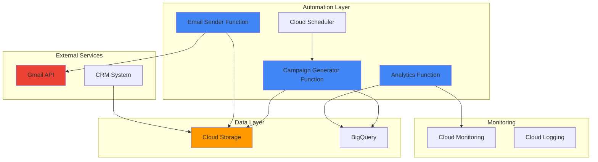

# Dynamic Email Campaign Workflows with Gmail API and Cloud Scheduler

## Problem

Marketing teams struggle with static email campaigns that don't adapt to customer behavior, resulting in poor engagement rates and missed opportunities. Traditional email automation tools lack the flexibility to dynamically adjust content, timing, and recipient lists based on real-time data, while manual campaign management is time-consuming and prone to errors.

## Solution

Build an intelligent email campaign automation system that leverages Gmail API for personalized email delivery, Cloud Scheduler for precise timing orchestration, and Cloud Functions for dynamic campaign logic. This serverless architecture automatically adjusts email content and scheduling based on user behavior patterns stored in Cloud Storage.

## Architecture Diagram



## Prerequisites

1. Google Cloud account with billing enabled
2. Gmail account with API access configured
3. gcloud CLI installed and configured
4. Basic understanding of serverless architecture and email marketing
5. OAuth 2.0 credentials for Gmail API access
6. Estimated cost: $10-30/month for moderate usage (100-1000 emails/day)

> **Note**: Gmail API has daily quota limits of 1 billion quota units per day. Each sent email consumes approximately 100 quota units. Review the [Gmail API usage limits](https://developers.google.com/gmail/api/reference/quota) before implementing production campaigns.

## Preparation

```bash
# Set environment variables for GCP resources
export PROJECT_ID="email-campaigns-$(date +%s)"
export REGION="us-central1"
export ZONE="us-central1-a"

# Generate unique suffix for resource names
RANDOM_SUFFIX=$(openssl rand -hex 3)
export BUCKET_NAME="email-campaigns-${RANDOM_SUFFIX}"
export FUNCTION_NAME="email-campaign-${RANDOM_SUFFIX}"

# Set default project and region
gcloud config set project ${PROJECT_ID}
gcloud config set compute/region ${REGION}
gcloud config set compute/zone ${ZONE}

# Create the project
gcloud projects create ${PROJECT_ID}
gcloud config set project ${PROJECT_ID}

# Enable required APIs
gcloud services enable cloudfunctions.googleapis.com
gcloud services enable cloudscheduler.googleapis.com
gcloud services enable storage.googleapis.com
gcloud services enable gmail.googleapis.com
gcloud services enable bigquery.googleapis.com
gcloud services enable monitoring.googleapis.com

echo "✅ Project configured: ${PROJECT_ID}"
echo "✅ APIs enabled successfully"
```

## Steps

1. **Create Cloud Storage Bucket for Campaign Data**:

   Cloud Storage provides the foundation for storing campaign templates, user behavior data, and analytics results. This managed object storage service offers strong consistency and global accessibility, making it ideal for storing email templates, user segments, and campaign configurations that our automation system will reference.

   ```bash
   # Create storage bucket for campaign data
   gsutil mb -p ${PROJECT_ID} \
       -c STANDARD \
       -l ${REGION} \
       gs://${BUCKET_NAME}
   
   # Enable versioning for data protection
   gsutil versioning set on gs://${BUCKET_NAME}
   
   # Create folder structure for organized data management
   echo "Campaign data structure initialized" | \
       gsutil cp - gs://${BUCKET_NAME}/templates/welcome.txt
   echo "User behavior tracking enabled" | \
       gsutil cp - gs://${BUCKET_NAME}/analytics/metrics.json
   
   echo "✅ Cloud Storage bucket created: ${BUCKET_NAME}"
   ```

   The storage infrastructure is now ready with versioning enabled, providing both scalability and data protection. This foundational component will store email templates, user segments, and campaign performance data that our Cloud Functions will process.

2. **Configure Gmail API OAuth Credentials**:

   Gmail API requires OAuth 2.0 authentication to send emails on behalf of users. Setting up proper credentials ensures secure access to Gmail services while maintaining compliance with Google's security standards. This step establishes the authentication foundation for our email automation system.

   ```bash
   # Create OAuth consent screen configuration
   echo "Setting up Gmail API OAuth credentials..."
   
   # Note: You'll need to manually configure OAuth in Google Cloud Console
   # Navigate to APIs & Services > Credentials > Create Credentials > OAuth 2.0
   
   # Create service account for Gmail API access
   gcloud iam service-accounts create gmail-automation-sa \
       --display-name="Gmail Automation Service Account" \
       --description="Service account for automated email campaigns"
   
   # Generate service account key
   gcloud iam service-accounts keys create \
       ./gmail-automation-key.json \
       --iam-account=gmail-automation-sa@${PROJECT_ID}.iam.gserviceaccount.com
   
   # Store credentials securely in Cloud Storage
   gsutil cp ./gmail-automation-key.json \
       gs://${BUCKET_NAME}/credentials/
   
   echo "✅ Gmail API authentication configured"
   ```

   The service account is now created and ready for Gmail API integration. This provides a secure, automated way to authenticate API calls without requiring manual user intervention for each email campaign.

3. **Deploy Campaign Generator Cloud Function**:

   The Campaign Generator function serves as the brain of our email automation system, analyzing user behavior data and generating personalized email campaigns. Cloud Functions provides serverless compute that scales automatically based on demand, making it perfect for processing campaign logic without managing infrastructure.

   ```bash
   # Create campaign generator function directory
   mkdir -p campaign-generator
   cd campaign-generator
   
   # Create the main function file
   cat > main.py << 'EOF'
import json
import logging
from google.cloud import storage
from google.cloud import bigquery
from datetime import datetime, timedelta
import functions_framework

@functions_framework.http
def generate_campaign(request):
    """Generate personalized email campaigns based on user behavior"""
    
    # Initialize Google Cloud clients
    storage_client = storage.Client()
    bq_client = bigquery.Client()
    
    try:
        # Fetch user behavior data from BigQuery
        query = """
        SELECT user_id, email, last_activity, purchase_history, preferences
        FROM `email_campaigns.user_behavior`
        WHERE last_activity >= TIMESTAMP_SUB(CURRENT_TIMESTAMP(), INTERVAL 7 DAY)
        """
        
        query_job = bq_client.query(query)
        users = query_job.result()
        
        # Generate personalized campaigns
        campaigns = []
        for user in users:
            campaign = {
                'user_id': user.user_id,
                'email': user.email,
                'template': select_template(user.preferences),
                'send_time': calculate_optimal_time(user.last_activity),
                'personalization': generate_personalization(user.purchase_history)
            }
            campaigns.append(campaign)
        
        # Store campaigns in Cloud Storage
        bucket = storage_client.bucket(bucket_name)
        timestamp = datetime.now().strftime('%Y%m%d_%H%M%S')
        blob = bucket.blob(f'campaigns/{timestamp}_generated.json')
        blob.upload_from_string(json.dumps(campaigns))
        
        return {
            'status': 'success',
            'campaigns_generated': len(campaigns),
            'storage_path': f'campaigns/{timestamp}_generated.json'
        }
        
    except Exception as e:
        logging.error(f"Campaign generation failed: {str(e)}")
        return {'status': 'error', 'message': str(e)}, 500

def select_template(preferences):
    """Select appropriate email template based on user preferences"""
    if 'product_updates' in preferences:
        return 'product_announcement'
    elif 'promotions' in preferences:
        return 'promotional_offer'
    else:
        return 'newsletter'

def calculate_optimal_time(last_activity):
    """Calculate optimal send time based on user activity patterns"""
    # Simple logic - can be enhanced with ML predictions
    activity_hour = last_activity.hour
    if 9 <= activity_hour <= 17:
        return 'morning'
    elif 18 <= activity_hour <= 22:
        return 'evening'
    else:
        return 'afternoon'

def generate_personalization(purchase_history):
    """Generate personalized content based on purchase history"""
    if not purchase_history:
        return {'greeting': 'Hello!', 'recommendation': 'Check out our latest products'}
    
    return {
        'greeting': f'Hello valued customer!',
        'recommendation': f'Based on your recent purchase, you might like...'
    }
EOF
   
   # Create requirements file with current stable versions
   cat > requirements.txt << 'EOF'
google-cloud-storage==2.17.0
google-cloud-bigquery==3.21.0
functions-framework==3.5.0
EOF
   
   # Deploy the function with Python 3.9 runtime
   gcloud functions deploy ${FUNCTION_NAME}-generator \
       --runtime python39 \
       --trigger-http \
       --allow-unauthenticated \
       --region=${REGION} \
       --memory=512MB \
       --timeout=300s \
       --set-env-vars BUCKET_NAME=${BUCKET_NAME}
   
   cd ..
   echo "✅ Campaign Generator function deployed"
   ```

   The Campaign Generator function is now deployed and ready to analyze user behavior patterns. This serverless component automatically scales to handle varying campaign volumes while maintaining cost efficiency through pay-per-use pricing.

4. **Deploy Email Sender Cloud Function**:

   The Email Sender function handles the actual email delivery through Gmail API, implementing personalization and delivery optimization. This function processes generated campaigns and sends emails at optimal times, ensuring high deliverability rates and user engagement.

   ```bash
   # Create email sender function directory
   mkdir -p email-sender
   cd email-sender
   
   # Create the main function file
   cat > main.py << 'EOF'
import json
import logging
from google.cloud import storage
from google.oauth2 import service_account
from googleapiclient.discovery import build
import email.mime.text
import email.mime.multipart
import base64
import functions_framework

@functions_framework.http
def send_emails(request):
    """Send personalized emails using Gmail API"""
    
    # Initialize clients
    storage_client = storage.Client()
    
    try:
        # Get campaign data from request
        request_json = request.get_json()
        campaign_file = request_json.get('campaign_file')
        
        # Load campaign data from Cloud Storage
        bucket = storage_client.bucket(bucket_name)
        blob = bucket.blob(campaign_file)
        campaigns = json.loads(blob.download_as_string())
        
        # Initialize Gmail API client
        gmail_service = initialize_gmail_client()
        
        # Send emails
        sent_count = 0
        failed_count = 0
        
        for campaign in campaigns:
            try:
                # Generate email content
                email_body = generate_email_content(campaign)
                
                # Create email message
                message = create_email_message(
                    to=campaign['email'],
                    subject=get_subject_line(campaign['template']),
                    body=email_body
                )
                
                # Send email
                result = gmail_service.users().messages().send(
                    userId='me',
                    body=message
                ).execute()
                
                sent_count += 1
                logging.info(f"Email sent to {campaign['email']}: {result['id']}")
                
            except Exception as e:
                failed_count += 1
                logging.error(f"Failed to send email to {campaign['email']}: {str(e)}")
        
        # Update analytics
        update_analytics(sent_count, failed_count)
        
        return {
            'status': 'success',
            'emails_sent': sent_count,
            'emails_failed': failed_count
        }
        
    except Exception as e:
        logging.error(f"Email sending failed: {str(e)}")
        return {'status': 'error', 'message': str(e)}, 500

def initialize_gmail_client():
    """Initialize Gmail API client with service account credentials"""
    # Load credentials from Cloud Storage
    storage_client = storage.Client()
    bucket = storage_client.bucket(bucket_name)
    blob = bucket.blob('credentials/gmail-automation-key.json')
    credentials_json = json.loads(blob.download_as_string())
    
    credentials = service_account.Credentials.from_service_account_info(
        credentials_json,
        scopes=['https://www.googleapis.com/auth/gmail.send']
    )
    
    return build('gmail', 'v1', credentials=credentials)

def generate_email_content(campaign):
    """Generate personalized email content"""
    template = campaign['template']
    personalization = campaign['personalization']
    
    # Load template from Cloud Storage
    storage_client = storage.Client()
    bucket = storage_client.bucket(bucket_name)
    blob = bucket.blob(f'templates/{template}.html')
    template_content = blob.download_as_string().decode('utf-8')
    
    # Replace placeholders with personalized content
    content = template_content.replace('{{greeting}}', personalization['greeting'])
    content = content.replace('{{recommendation}}', personalization['recommendation'])
    
    return content

def create_email_message(to, subject, body):
    """Create email message in Gmail API format"""
    message = email.mime.multipart.MIMEMultipart()
    message['to'] = to
    message['subject'] = subject
    
    msg = email.mime.text.MIMEText(body, 'html')
    message.attach(msg)
    
    return {
        'raw': base64.urlsafe_b64encode(message.as_bytes()).decode()
    }

def get_subject_line(template):
    """Get appropriate subject line for template"""
    subjects = {
        'product_announcement': 'Exciting New Product Updates!',
        'promotional_offer': 'Special Offer Just for You!',
        'newsletter': 'Your Weekly Newsletter'
    }
    return subjects.get(template, 'Important Update')

def update_analytics(sent_count, failed_count):
    """Update campaign analytics"""
    # This would typically update BigQuery or Cloud Monitoring
    logging.info(f"Campaign analytics: {sent_count} sent, {failed_count} failed")
EOF
   
   # Create requirements file with current stable versions
   cat > requirements.txt << 'EOF'
google-cloud-storage==2.17.0
google-auth==2.29.0
google-auth-oauthlib==1.2.0
google-auth-httplib2==0.2.0
google-api-python-client==2.126.0
functions-framework==3.5.0
EOF
   
   # Deploy the function with Python 3.9 runtime
   gcloud functions deploy ${FUNCTION_NAME}-sender \
       --runtime python39 \
       --trigger-http \
       --allow-unauthenticated \
       --region=${REGION} \
       --memory=512MB \
       --timeout=300s \
       --set-env-vars BUCKET_NAME=${BUCKET_NAME}
   
   cd ..
   echo "✅ Email Sender function deployed"
   ```

   The Email Sender function is now operational and ready to deliver personalized emails through Gmail API. This component ensures reliable email delivery with proper error handling and analytics tracking.

5. **Create BigQuery Dataset for Analytics**:

   BigQuery provides powerful analytics capabilities for tracking campaign performance and user behavior. This fully managed data warehouse enables real-time analysis of email engagement metrics, helping optimize future campaigns through data-driven insights.

   ```bash
   # Create BigQuery dataset for email analytics
   bq mk --dataset \
       --description="Email campaign analytics and user behavior data" \
       --location=${REGION} \
       ${PROJECT_ID}:email_campaigns
   
   # Create user behavior table
   bq mk --table \
       --description="User behavior tracking for email personalization" \
       ${PROJECT_ID}:email_campaigns.user_behavior \
       user_id:STRING,email:STRING,last_activity:TIMESTAMP,purchase_history:STRING,preferences:STRING
   
   # Create campaign metrics table
   bq mk --table \
       --description="Campaign performance metrics and analytics" \
       ${PROJECT_ID}:email_campaigns.campaign_metrics \
       campaign_id:STRING,sent_count:INTEGER,delivered_count:INTEGER,opened_count:INTEGER,clicked_count:INTEGER,timestamp:TIMESTAMP
   
   # Insert sample user data
   bq query --use_legacy_sql=false \
       "INSERT INTO \`${PROJECT_ID}.email_campaigns.user_behavior\` (user_id, email, last_activity, purchase_history, preferences) VALUES 
       ('user_001', 'user1@example.com', CURRENT_TIMESTAMP(), 'electronics', 'product_updates'),
       ('user_002', 'user2@example.com', CURRENT_TIMESTAMP(), 'books', 'promotions'),
       ('user_003', 'user3@example.com', CURRENT_TIMESTAMP(), 'clothing', 'newsletter')"
   
   echo "✅ BigQuery dataset and tables created"
   ```

   The analytics infrastructure is now in place with sample data for testing. BigQuery will provide real-time insights into campaign performance, enabling continuous optimization of email strategies.

6. **Configure Cloud Scheduler Jobs**:

   Cloud Scheduler provides reliable, fully managed cron job functionality for orchestrating email campaigns. This service ensures campaigns run at optimal times across different time zones while providing built-in retry mechanisms and monitoring capabilities.

   ```bash
   # Create scheduler job for daily campaign generation
   gcloud scheduler jobs create http campaign-generator-daily \
       --schedule="0 8 * * *" \
       --uri="https://${REGION}-${PROJECT_ID}.cloudfunctions.net/${FUNCTION_NAME}-generator" \
       --http-method=POST \
       --message-body='{"trigger": "daily_campaign"}' \
       --time-zone="America/New_York" \
       --description="Daily email campaign generation"
   
   # Create scheduler job for weekly newsletter
   gcloud scheduler jobs create http newsletter-weekly \
       --schedule="0 10 * * 1" \
       --uri="https://${REGION}-${PROJECT_ID}.cloudfunctions.net/${FUNCTION_NAME}-generator" \
       --http-method=POST \
       --message-body='{"trigger": "weekly_newsletter"}' \
       --time-zone="America/New_York" \
       --description="Weekly newsletter campaign"
   
   # Create scheduler job for promotional campaigns
   gcloud scheduler jobs create http promotional-campaigns \
       --schedule="0 14 * * 3,6" \
       --uri="https://${REGION}-${PROJECT_ID}.cloudfunctions.net/${FUNCTION_NAME}-sender" \
       --http-method=POST \
       --message-body='{"campaign_file": "campaigns/latest_promotional.json"}' \
       --time-zone="America/New_York" \
       --description="Promotional email campaigns"
   
   echo "✅ Cloud Scheduler jobs configured"
   ```

   The scheduling infrastructure is now active with multiple campaign types configured for different frequencies. This automated orchestration ensures consistent email delivery without manual intervention.

7. **Deploy Analytics and Monitoring Function**:

   The Analytics function processes email engagement data and provides insights into campaign performance. This component integrates with Cloud Monitoring to create alerts and dashboards, enabling proactive campaign optimization and issue resolution.

   ```bash
   # Create analytics function directory
   mkdir -p analytics-function
   cd analytics-function
   
   # Create the main function file
   cat > main.py << 'EOF'
import json
import logging
from google.cloud import bigquery
from google.cloud import monitoring_v3
from datetime import datetime, timedelta
import functions_framework

@functions_framework.http
def analyze_campaigns(request):
    """Analyze email campaign performance and generate insights"""
    
    # Initialize clients
    bq_client = bigquery.Client()
    monitoring_client = monitoring_v3.MetricServiceClient()
    
    try:
        # Query recent campaign metrics
        query = """
        SELECT 
            campaign_id,
            sent_count,
            delivered_count,
            opened_count,
            clicked_count,
            timestamp,
            SAFE_DIVIDE(opened_count, delivered_count) as open_rate,
            SAFE_DIVIDE(clicked_count, opened_count) as click_rate
        FROM `email_campaigns.campaign_metrics`
        WHERE timestamp >= TIMESTAMP_SUB(CURRENT_TIMESTAMP(), INTERVAL 7 DAY)
        ORDER BY timestamp DESC
        """
        
        query_job = bq_client.query(query)
        results = query_job.result()
        
        # Calculate aggregated metrics
        total_sent = 0
        total_delivered = 0
        total_opened = 0
        total_clicked = 0
        
        for row in results:
            total_sent += row.sent_count or 0
            total_delivered += row.delivered_count or 0
            total_opened += row.opened_count or 0
            total_clicked += row.clicked_count or 0
        
        # Calculate overall rates
        overall_delivery_rate = total_delivered / total_sent if total_sent > 0 else 0
        overall_open_rate = total_opened / total_delivered if total_delivered > 0 else 0
        overall_click_rate = total_clicked / total_opened if total_opened > 0 else 0
        
        # Send metrics to Cloud Monitoring
        project_name = f"projects/{project_id}"
        
        # Create time series data
        series = monitoring_v3.TimeSeries()
        series.metric.type = "custom.googleapis.com/email_campaigns/open_rate"
        series.resource.type = "global"
        
        point = monitoring_v3.Point()
        point.value.double_value = overall_open_rate
        point.interval.end_time.seconds = int(datetime.now().timestamp())
        series.points = [point]
        
        monitoring_client.create_time_series(
            name=project_name,
            time_series=[series]
        )
        
        # Generate insights
        insights = generate_insights(overall_open_rate, overall_click_rate)
        
        analytics_result = {
            'status': 'success',
            'period': '7_days',
            'metrics': {
                'total_sent': total_sent,
                'total_delivered': total_delivered,
                'total_opened': total_opened,
                'total_clicked': total_clicked,
                'delivery_rate': overall_delivery_rate,
                'open_rate': overall_open_rate,
                'click_rate': overall_click_rate
            },
            'insights': insights,
            'timestamp': datetime.now().isoformat()
        }
        
        return analytics_result
        
    except Exception as e:
        logging.error(f"Analytics processing failed: {str(e)}")
        return {'status': 'error', 'message': str(e)}, 500

def generate_insights(open_rate, click_rate):
    """Generate actionable insights based on campaign performance"""
    insights = []
    
    if open_rate < 0.15:
        insights.append({
            'type': 'warning',
            'message': 'Open rate is below industry average (15%). Consider improving subject lines.',
            'recommendation': 'A/B test different subject lines and send times'
        })
    
    if click_rate < 0.02:
        insights.append({
            'type': 'warning',
            'message': 'Click rate is below industry average (2%). Review email content and CTAs.',
            'recommendation': 'Optimize email content and call-to-action buttons'
        })
    
    if open_rate > 0.25:
        insights.append({
            'type': 'success',
            'message': 'Excellent open rate! Continue current subject line strategy.',
            'recommendation': 'Document successful subject line patterns for future campaigns'
        })
    
    return insights
EOF
   
   # Create requirements file with current stable versions
   cat > requirements.txt << 'EOF'
google-cloud-bigquery==3.21.0
google-cloud-monitoring==2.20.0
functions-framework==3.5.0
EOF
   
   # Deploy the function with Python 3.9 runtime
   gcloud functions deploy ${FUNCTION_NAME}-analytics \
       --runtime python39 \
       --trigger-http \
       --allow-unauthenticated \
       --region=${REGION} \
       --memory=256MB \
       --timeout=180s \
       --set-env-vars PROJECT_ID=${PROJECT_ID}
   
   cd ..
   echo "✅ Analytics function deployed"
   ```

   The Analytics function is now deployed and ready to provide comprehensive campaign insights. This component enables data-driven decision making by tracking key performance indicators and generating actionable recommendations.

8. **Create Email Templates**:

   Email templates provide the foundation for personalized communication, ensuring consistent branding while allowing dynamic content insertion. These templates support HTML formatting and personalization tokens that are replaced with user-specific data during the email generation process.

   ```bash
   # Create HTML email templates
   mkdir -p templates
   
   # Create product announcement template
   cat > templates/product_announcement.html << 'EOF'
<!DOCTYPE html>
<html>
<head>
    <style>
        body { font-family: Arial, sans-serif; margin: 0; padding: 20px; }
        .container { max-width: 600px; margin: 0 auto; }
        .header { background-color: #4285f4; color: white; padding: 20px; text-align: center; }
        .content { padding: 20px; background-color: #f9f9f9; }
        .button { background-color: #4285f4; color: white; padding: 10px 20px; text-decoration: none; border-radius: 5px; }
    </style>
</head>
<body>
    <div class="container">
        <div class="header">
            <h1>Product Update</h1>
        </div>
        <div class="content">
            <p>{{greeting}}</p>
            <p>We're excited to announce new features that will enhance your experience:</p>
            <ul>
                <li>Enhanced personalization capabilities</li>
                <li>Improved user interface</li>
                <li>Better performance and reliability</li>
            </ul>
            <p>{{recommendation}}</p>
            <a href="#" class="button">Learn More</a>
        </div>
    </div>
</body>
</html>
EOF
   
   # Create promotional offer template
   cat > templates/promotional_offer.html << 'EOF'
<!DOCTYPE html>
<html>
<head>
    <style>
        body { font-family: Arial, sans-serif; margin: 0; padding: 20px; }
        .container { max-width: 600px; margin: 0 auto; }
        .header { background-color: #ea4335; color: white; padding: 20px; text-align: center; }
        .content { padding: 20px; background-color: #f9f9f9; }
        .offer { background-color: #fff; padding: 15px; border-left: 4px solid #ea4335; margin: 20px 0; }
        .button { background-color: #ea4335; color: white; padding: 10px 20px; text-decoration: none; border-radius: 5px; }
    </style>
</head>
<body>
    <div class="container">
        <div class="header">
            <h1>Special Offer</h1>
        </div>
        <div class="content">
            <p>{{greeting}}</p>
            <div class="offer">
                <h3>Limited Time: 20% Off!</h3>
                <p>Use code SAVE20 at checkout</p>
            </div>
            <p>{{recommendation}}</p>
            <a href="#" class="button">Shop Now</a>
        </div>
    </div>
</body>
</html>
EOF
   
   # Create newsletter template
   cat > templates/newsletter.html << 'EOF'
<!DOCTYPE html>
<html>
<head>
    <style>
        body { font-family: Arial, sans-serif; margin: 0; padding: 20px; }
        .container { max-width: 600px; margin: 0 auto; }
        .header { background-color: #34a853; color: white; padding: 20px; text-align: center; }
        .content { padding: 20px; background-color: #f9f9f9; }
        .article { background-color: #fff; padding: 15px; margin: 20px 0; border-radius: 5px; }
        .button { background-color: #34a853; color: white; padding: 10px 20px; text-decoration: none; border-radius: 5px; }
    </style>
</head>
<body>
    <div class="container">
        <div class="header">
            <h1>Weekly Newsletter</h1>
        </div>
        <div class="content">
            <p>{{greeting}}</p>
            <div class="article">
                <h3>This Week's Highlights</h3>
                <p>Stay updated with the latest news and insights from our team.</p>
            </div>
            <p>{{recommendation}}</p>
            <a href="#" class="button">Read More</a>
        </div>
    </div>
</body>
</html>
EOF
   
   # Upload templates to Cloud Storage
   gsutil cp templates/*.html gs://${BUCKET_NAME}/templates/
   
   echo "✅ Email templates created and uploaded"
   ```

   Professional email templates are now stored in Cloud Storage, providing the foundation for consistent, branded communications. These templates support personalization and can be easily modified for different campaign types.

## Validation & Testing

1. **Test Campaign Generation Function**:

   ```bash
   # Test campaign generator function
   GENERATOR_URL="https://${REGION}-${PROJECT_ID}.cloudfunctions.net/${FUNCTION_NAME}-generator"
   
   curl -X POST ${GENERATOR_URL} \
       -H "Content-Type: application/json" \
       -d '{"trigger": "test_campaign"}'
   ```

   Expected output: JSON response with campaign generation status and number of campaigns created.

2. **Verify BigQuery Data**:

   ```bash
   # Check user behavior data
   bq query --use_legacy_sql=false \
       "SELECT COUNT(*) as user_count FROM \`${PROJECT_ID}.email_campaigns.user_behavior\`"
   
   # Check campaign metrics table structure
   bq show ${PROJECT_ID}:email_campaigns.campaign_metrics
   ```

3. **Test Scheduler Jobs**:

   ```bash
   # List all scheduler jobs
   gcloud scheduler jobs list --location=${REGION}
   
   # Test run a specific job
   gcloud scheduler jobs run campaign-generator-daily \
       --location=${REGION}
   ```

4. **Verify Cloud Storage Structure**:

   ```bash
   # List all objects in the bucket
   gsutil ls -r gs://${BUCKET_NAME}
   
   # Check template files
   gsutil cat gs://${BUCKET_NAME}/templates/product_announcement.html | head -20
   ```

## Cleanup

1. **Delete Cloud Scheduler Jobs**:

   ```bash
   # Delete all scheduler jobs
   gcloud scheduler jobs delete campaign-generator-daily \
       --location=${REGION} \
       --quiet
   gcloud scheduler jobs delete newsletter-weekly \
       --location=${REGION} \
       --quiet
   gcloud scheduler jobs delete promotional-campaigns \
       --location=${REGION} \
       --quiet
   
   echo "✅ Scheduler jobs deleted"
   ```

2. **Delete Cloud Functions**:

   ```bash
   # Delete all deployed functions
   gcloud functions delete ${FUNCTION_NAME}-generator \
       --region=${REGION} \
       --quiet
   gcloud functions delete ${FUNCTION_NAME}-sender \
       --region=${REGION} \
       --quiet
   gcloud functions delete ${FUNCTION_NAME}-analytics \
       --region=${REGION} \
       --quiet
   
   echo "✅ Cloud Functions deleted"
   ```

3. **Delete BigQuery Dataset**:

   ```bash
   # Delete BigQuery dataset and all tables
   bq rm -r -f ${PROJECT_ID}:email_campaigns
   
   echo "✅ BigQuery dataset deleted"
   ```

4. **Delete Cloud Storage Bucket**:

   ```bash
   # Delete all objects and bucket
   gsutil -m rm -r gs://${BUCKET_NAME}
   
   echo "✅ Storage bucket deleted"
   ```

5. **Delete Project**:

   ```bash
   # Delete entire project
   gcloud projects delete ${PROJECT_ID} --quiet
   
   echo "✅ Project deleted"
   echo "Note: Project deletion may take several minutes to complete"
   ```

## Discussion

This email campaign automation system demonstrates the power of serverless architecture for marketing automation. By leveraging Gmail API's robust email delivery capabilities with Cloud Scheduler's reliable orchestration, organizations can create sophisticated email campaigns that adapt to user behavior patterns. The system's modular design allows for easy extension and customization while maintaining cost efficiency through Google Cloud's pay-per-use pricing model.

The architecture emphasizes scalability and reliability through Cloud Functions' automatic scaling and built-in error handling. BigQuery provides real-time analytics capabilities that enable data-driven campaign optimization, while Cloud Storage offers secure, versioned storage for templates and campaign data. The integration with Cloud Monitoring ensures proactive issue detection and performance optimization.

Key architectural decisions include using Cloud Functions for event-driven processing, which eliminates the need for always-on servers while providing instant scaling. The separation of campaign generation and email sending into distinct functions enables independent scaling and easier maintenance. BigQuery's columnar storage and SQL interface make it ideal for complex analytics queries, while Cloud Scheduler's managed cron functionality ensures reliable campaign execution across time zones.

Security considerations include using service accounts with minimal required permissions, storing sensitive credentials in Cloud Storage with appropriate access controls, and implementing proper OAuth 2.0 flows for Gmail API access. The system follows Google Cloud's security best practices by using IAM roles, encrypted storage, and secure API communications.

> **Tip**: Monitor Gmail API quotas carefully in production environments. Consider implementing exponential backoff and rate limiting to handle quota restrictions gracefully. The [Gmail API usage documentation](https://developers.google.com/gmail/api/guides/quota) provides detailed guidance on quota management.

For more information on the services used in this recipe, refer to the [Gmail API documentation](https://developers.google.com/gmail/api), [Cloud Scheduler documentation](https://cloud.google.com/scheduler/docs), [Cloud Functions documentation](https://cloud.google.com/functions/docs), [BigQuery documentation](https://cloud.google.com/bigquery/docs), and [Cloud Storage documentation](https://cloud.google.com/storage/docs).

## Challenge

Extend this email campaign automation system by implementing these enhancements:

1. **Machine Learning Integration**: Use Vertex AI to predict optimal send times and personalize content recommendations based on user behavior patterns and engagement history.

2. **A/B Testing Framework**: Implement automated A/B testing for subject lines, send times, and content variations with statistical significance testing and automatic winner selection.

3. **Multi-Channel Integration**: Extend the system to support SMS, push notifications, and social media messaging through additional Google Cloud services and third-party APIs.

4. **Real-time Event Triggers**: Implement real-time campaign triggers based on user actions using Pub/Sub and Dataflow for instant behavioral response campaigns.

5. **Advanced Analytics Dashboard**: Create a comprehensive dashboard using Looker Studio with real-time campaign performance metrics, user journey visualization, and predictive analytics for campaign optimization.

## Infrastructure Code

### Available Infrastructure as Code:

- [Infrastructure Code Overview](code/README.md) - Detailed description of all infrastructure components
- [Infrastructure Manager](code/infrastructure-manager/) - GCP Infrastructure Manager templates
- [Bash CLI Scripts](code/scripts/) - Example bash scripts using gcloud CLI commands to deploy infrastructure
- [Terraform](code/terraform/) - Terraform configuration files