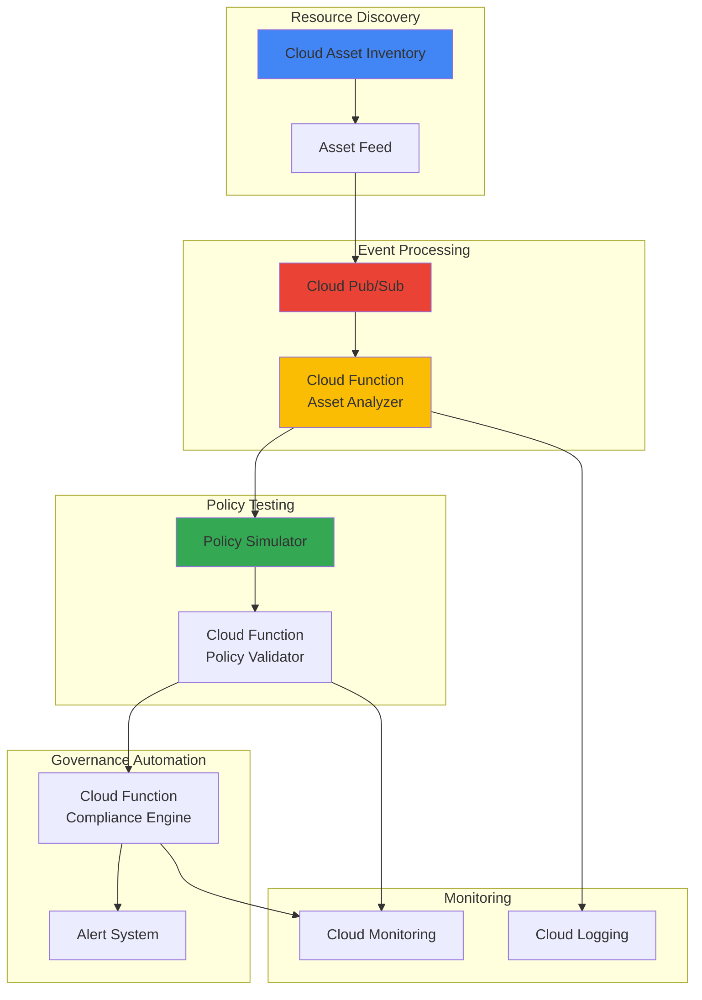

# Dynamic Resource Governance with Cloud Asset Inventory and Policy Simulator

## Problem

Enterprise organizations struggle with maintaining consistent governance and compliance across their rapidly expanding Google Cloud environments. Security teams face challenges in discovering policy violations, lack visibility into resource changes in real-time, and cannot predict the impact of policy modifications before implementation, leading to potential security gaps and compliance violations.

## Solution

Build an intelligent resource governance system that leverages Cloud Asset Inventory for comprehensive resource discovery and monitoring, integrates Policy Simulator for risk-free policy testing, and uses Cloud Functions with Pub/Sub to automate compliance checks and violation responses, creating a proactive governance framework that scales with enterprise needs.

## Architecture Diagram



## Prerequisites

1. Google Cloud project with billing enabled and appropriate IAM permissions
2. Google Cloud CLI (gcloud) installed and configured (version 400.0.0 or later)
3. Basic understanding of Google Cloud IAM, resource management, and serverless architectures
4. Access to organization-level resources for comprehensive governance implementation
5. Estimated cost: $15-25 per month for moderate enterprise usage (primarily Cloud Functions execution and Pub/Sub messaging)

> **Note**: This recipe requires organization-level permissions to fully implement resource governance across all projects and folders in your Google Cloud organization.

## Preparation

```bash
# Set environment variables for GCP resources
export PROJECT_ID="governance-demo-$(date +%s)"
export REGION="us-central1"
export ZONE="us-central1-a"

# Generate unique suffix for resource names
RANDOM_SUFFIX=$(openssl rand -hex 3)

# Set resource names
export ASSET_FEED_NAME="governance-feed-${RANDOM_SUFFIX}"
export TOPIC_NAME="asset-changes-${RANDOM_SUFFIX}"
export FUNCTION_ANALYZER="asset-analyzer-${RANDOM_SUFFIX}"
export FUNCTION_VALIDATOR="policy-validator-${RANDOM_SUFFIX}"
export FUNCTION_ENGINE="compliance-engine-${RANDOM_SUFFIX}"

# Set default project and region
gcloud config set project ${PROJECT_ID}
gcloud config set compute/region ${REGION}
gcloud config set compute/zone ${ZONE}

# Enable required APIs
gcloud services enable cloudasset.googleapis.com
gcloud services enable pubsub.googleapis.com
gcloud services enable cloudfunctions.googleapis.com
gcloud services enable policysimulator.googleapis.com
gcloud services enable cloudbuild.googleapis.com
gcloud services enable logging.googleapis.com
gcloud services enable monitoring.googleapis.com

echo "✅ Project configured: ${PROJECT_ID}"
echo "✅ APIs enabled for governance system"
```

## Steps

1. **Create Pub/Sub Topic for Asset Change Notifications**:

   Google Cloud Pub/Sub provides reliable, scalable messaging for event-driven architectures. Creating a dedicated topic for asset changes establishes the foundation for real-time governance automation. This messaging backbone ensures that all resource modifications trigger appropriate compliance checks and policy validations across your organization.

   ```bash
   # Create Pub/Sub topic for asset change events
   gcloud pubsub topics create ${TOPIC_NAME}
   
   # Create subscription for the compliance engine
   gcloud pubsub subscriptions create compliance-subscription \
       --topic=${TOPIC_NAME} \
       --ack-deadline=300
   
   echo "✅ Pub/Sub topic created: ${TOPIC_NAME}"
   ```

   The Pub/Sub topic is now ready to receive asset change notifications with a 5-minute acknowledgment deadline, providing sufficient time for complex governance operations. This messaging infrastructure supports the entire governance workflow, from detection through automated remediation.

2. **Configure Cloud Asset Inventory Feed**:

   Cloud Asset Inventory provides comprehensive visibility into your Google Cloud resources, policies, and configurations with up to 35 days of historical data. Setting up an asset feed enables real-time monitoring of resource changes across your entire organization, ensuring no governance violations go undetected.

   ```bash
   # Create asset feed to monitor all resource changes
   gcloud asset feeds create ${ASSET_FEED_NAME} \
       --pubsub-topic=projects/${PROJECT_ID}/topics/${TOPIC_NAME} \
       --asset-types="*" \
       --content-type=RESOURCE
   
   # Verify feed creation
   gcloud asset feeds list
   
   echo "✅ Asset feed configured: ${ASSET_FEED_NAME}"
   ```

   The asset feed is now monitoring all resource types across your organization and publishing change events to Pub/Sub. This comprehensive monitoring capability captures resource creations, modifications, and deletions, providing complete visibility for governance enforcement.

3. **Create Asset Analyzer Cloud Function**:

   Cloud Functions provides serverless compute for event-driven governance automation. The asset analyzer function processes incoming asset change events, extracts relevant governance information, and triggers appropriate compliance workflows based on predefined governance policies and organizational requirements.

   ```bash
   # Create directory for Cloud Function source code
   mkdir -p governance-functions/asset-analyzer
   cd governance-functions/asset-analyzer
   
   # Create requirements.txt file
   cat > requirements.txt << 'EOF'
google-cloud-asset==3.30.0
google-cloud-pubsub==2.23.1
google-cloud-logging==3.11.0
google-cloud-policy-intelligence==1.7.0
functions-framework==3.8.0
   EOF
   
   # Create the asset analyzer function
   cat > main.py << 'EOF'
import json
import base64
import logging
from google.cloud import asset_v1
from google.cloud import pubsub_v1
from google.cloud import logging as cloud_logging

# Configure logging
cloud_logging.Client().setup_logging()
logger = logging.getLogger(__name__)

def analyze_asset_change(cloud_event):
    """Analyze asset changes and trigger governance workflows."""
    try:
        # Decode Pub/Sub message
        if 'data' in cloud_event and 'message' in cloud_event['data']:
            pubsub_message = base64.b64decode(
                cloud_event['data']['message']['data']
            ).decode('utf-8')
        else:
            logger.error("Invalid cloud event format")
            return {'status': 'error', 'message': 'Invalid event format'}
        
        asset_data = json.loads(pubsub_message)
        
        # Extract asset information
        asset_name = asset_data.get('name', '')
        asset_type = asset_data.get('assetType', '')
        operation = asset_data.get('deleted', False)
        
        logger.info(f"Processing asset change: {asset_name} ({asset_type})")
        
        # Check for high-risk resources
        risk_level = assess_risk_level(asset_type, asset_data)
        
        if risk_level == 'HIGH':
            logger.warning(f"High-risk asset detected: {asset_name}")
            trigger_policy_validation(asset_data)
        
        # Log compliance event
        log_compliance_event(asset_name, asset_type, risk_level)
        
        return {'status': 'success', 'risk_level': risk_level}
        
    except Exception as e:
        logger.error(f"Error analyzing asset change: {str(e)}")
        return {'status': 'error', 'message': str(e)}

def assess_risk_level(asset_type, asset_data):
    """Assess risk level based on asset type and configuration."""
    high_risk_types = [
        'compute.googleapis.com/Instance',
        'storage.googleapis.com/Bucket',
        'iam.googleapis.com/ServiceAccount',
        'container.googleapis.com/Cluster'
    ]
    
    if asset_type in high_risk_types:
        return 'HIGH'
    elif 'compute' in asset_type or 'storage' in asset_type:
        return 'MEDIUM'
    else:
        return 'LOW'

def trigger_policy_validation(asset_data):
    """Trigger policy validation for high-risk assets."""
    # This would integrate with Policy Simulator
    logger.info("Triggering policy validation workflow")

def log_compliance_event(asset_name, asset_type, risk_level):
    """Log compliance events for audit trail."""
    logger.info(f"Compliance event logged: {asset_name} - Risk: {risk_level}")
   EOF
   
   # Deploy the asset analyzer function
   gcloud functions deploy ${FUNCTION_ANALYZER} \
       --gen2 \
       --region=${REGION} \
       --runtime=python311 \
       --source=. \
       --entry-point=analyze_asset_change \
       --trigger-topic=${TOPIC_NAME} \
       --memory=512MB \
       --timeout=300s
   
   cd ../..
   echo "✅ Asset analyzer function deployed: ${FUNCTION_ANALYZER}"
   ```

   The asset analyzer function is now deployed and automatically triggered by asset change events. This serverless component provides intelligent risk assessment and initiates appropriate governance workflows based on asset types and organizational policies.

4. **Create Policy Validator Function**:

   Policy Simulator enables safe testing of IAM policy changes before implementation, preventing accidental access disruptions. The policy validator function leverages this capability to automatically assess proposed policy modifications and ensure they align with organizational security and compliance requirements.

   ```bash
   # Create directory for policy validator function
   mkdir -p governance-functions/policy-validator
   cd governance-functions/policy-validator
   
   # Create requirements.txt file
   cat > requirements.txt << 'EOF'
google-cloud-policy-intelligence==1.7.0
google-cloud-asset==3.30.0
google-cloud-logging==3.11.0
functions-framework==3.8.0
   EOF
   
   # Create the policy validator function
   cat > main.py << 'EOF'
import json
import logging
from google.cloud import policy_intelligence_v1
from google.cloud import asset_v1
from google.cloud import logging as cloud_logging

# Configure logging
cloud_logging.Client().setup_logging()
logger = logging.getLogger(__name__)

def validate_policy_changes(request):
    """Validate policy changes using Policy Simulator."""
    try:
        request_json = request.get_json(silent=True)
        if not request_json:
            return {'status': 'error', 'message': 'No JSON body provided'}
        
        resource_name = request_json.get('resource_name')
        proposed_policy = request_json.get('proposed_policy')
        
        logger.info(f"Validating policy changes for: {resource_name}")
        
        # Initialize Policy Simulator client
        client = policy_intelligence_v1.PolicySimulatorClient()
        
        # Create simulation request
        simulation_request = create_simulation_request(resource_name, proposed_policy)
        
        # Run policy simulation
        results = run_policy_simulation(client, simulation_request)
        
        # Analyze simulation results
        validation_results = analyze_simulation_results(results)
        
        return {
            'status': 'success',
            'validation_results': validation_results,
            'risk_assessment': assess_policy_risk(validation_results)
        }
        
    except Exception as e:
        logger.error(f"Error validating policy changes: {str(e)}")
        return {'status': 'error', 'message': str(e)}

def create_simulation_request(resource_name, proposed_policy):
    """Create policy simulation request."""
    # Implementation would create proper simulation request
    logger.info("Creating policy simulation request")
    return {}

def run_policy_simulation(client, simulation_request):
    """Execute policy simulation."""
    # Implementation would run actual simulation
    logger.info("Running policy simulation")
    return []

def analyze_simulation_results(results):
    """Analyze simulation results for governance compliance."""
    # Implementation would analyze results
    logger.info("Analyzing simulation results")
    return {'access_changes': [], 'risk_level': 'LOW'}

def assess_policy_risk(validation_results):
    """Assess risk level of proposed policy changes."""
    access_changes = validation_results.get('access_changes', [])
    
    if len(access_changes) > 10:
        return 'HIGH'
    elif len(access_changes) > 5:
        return 'MEDIUM'
    else:
        return 'LOW'
   EOF
   
   # Deploy the policy validator function
   gcloud functions deploy ${FUNCTION_VALIDATOR} \
       --gen2 \
       --region=${REGION} \
       --runtime=python311 \
       --source=. \
       --entry-point=validate_policy_changes \
       --trigger-http \
       --allow-unauthenticated \
       --memory=1GB \
       --timeout=540s
   
   cd ../..
   echo "✅ Policy validator function deployed: ${FUNCTION_VALIDATOR}"
   ```

   The policy validator function is now ready to simulate policy changes and assess their impact on organizational access patterns. This component ensures that all policy modifications are tested and validated before implementation, preventing unintended access disruptions.

5. **Deploy Compliance Engine Function**:

   The compliance engine serves as the central orchestrator for governance automation, processing asset changes, coordinating policy validations, and triggering automated remediation actions. This component implements organizational governance policies and ensures consistent compliance across all Google Cloud resources.

   ```bash
   # Create directory for compliance engine function
   mkdir -p governance-functions/compliance-engine
   cd governance-functions/compliance-engine
   
   # Create requirements.txt file
   cat > requirements.txt << 'EOF'
google-cloud-pubsub==2.23.1
google-cloud-logging==3.11.0
google-cloud-monitoring==2.20.0
google-cloud-asset==3.30.0
requests==2.31.0
functions-framework==3.8.0
   EOF
   
   # Create the compliance engine function
   cat > main.py << 'EOF'
import json
import base64
import logging
import requests
from google.cloud import pubsub_v1
from google.cloud import logging as cloud_logging
from google.cloud import monitoring_v3

# Configure logging
cloud_logging.Client().setup_logging()
logger = logging.getLogger(__name__)

def enforce_compliance(cloud_event):
    """Main compliance enforcement function."""
    try:
        # Decode Pub/Sub message
        if 'data' in cloud_event and 'message' in cloud_event['data']:
            pubsub_message = base64.b64decode(
                cloud_event['data']['message']['data']
            ).decode('utf-8')
        else:
            logger.error("Invalid cloud event format")
            return {'status': 'error', 'message': 'Invalid event format'}
        
        compliance_data = json.loads(pubsub_message)
        
        logger.info("Processing compliance enforcement request")
        
        # Extract compliance requirements
        asset_name = compliance_data.get('asset_name', '')
        risk_level = compliance_data.get('risk_level', 'LOW')
        violation_type = compliance_data.get('violation_type', '')
        
        # Apply governance policies
        enforcement_actions = determine_enforcement_actions(risk_level, violation_type)
        
        # Execute enforcement actions
        results = execute_enforcement_actions(asset_name, enforcement_actions)
        
        # Record compliance metrics
        record_compliance_metrics(asset_name, risk_level, results)
        
        return {'status': 'success', 'actions_taken': results}
        
    except Exception as e:
        logger.error(f"Error in compliance enforcement: {str(e)}")
        return {'status': 'error', 'message': str(e)}

def determine_enforcement_actions(risk_level, violation_type):
    """Determine appropriate enforcement actions based on risk and violation type."""
    actions = []
    
    if risk_level == 'HIGH':
        actions.extend(['alert_security_team', 'create_ticket', 'restrict_access'])
    elif risk_level == 'MEDIUM':
        actions.extend(['alert_team_lead', 'create_ticket'])
    else:
        actions.append('log_violation')
    
    return actions

def execute_enforcement_actions(asset_name, actions):
    """Execute the determined enforcement actions."""
    results = []
    
    for action in actions:
        try:
            if action == 'alert_security_team':
                send_security_alert(asset_name)
                results.append(f"Security alert sent for {asset_name}")
            elif action == 'create_ticket':
                create_compliance_ticket(asset_name)
                results.append(f"Compliance ticket created for {asset_name}")
            elif action == 'restrict_access':
                # Implementation would restrict access
                logger.info(f"Access restriction applied to {asset_name}")
                results.append(f"Access restricted for {asset_name}")
            elif action == 'log_violation':
                log_compliance_violation(asset_name)
                results.append(f"Violation logged for {asset_name}")
                
        except Exception as e:
            logger.error(f"Error executing action {action}: {str(e)}")
            results.append(f"Failed to execute {action}: {str(e)}")
    
    return results

def send_security_alert(asset_name):
    """Send alert to security team."""
    logger.warning(f"SECURITY ALERT: High-risk compliance violation detected for {asset_name}")

def create_compliance_ticket(asset_name):
    """Create compliance ticket in ticketing system."""
    logger.info(f"Creating compliance ticket for {asset_name}")

def log_compliance_violation(asset_name):
    """Log compliance violation for audit trail."""
    logger.info(f"Compliance violation logged: {asset_name}")

def record_compliance_metrics(asset_name, risk_level, results):
    """Record compliance metrics in Cloud Monitoring."""
    try:
        client = monitoring_v3.MetricServiceClient()
        
        # Implementation would record actual metrics
        logger.info(f"Recording compliance metrics for {asset_name}")
        
    except Exception as e:
        logger.error(f"Error recording metrics: {str(e)}")
   EOF
   
   # Deploy the compliance engine function
   gcloud functions deploy ${FUNCTION_ENGINE} \
       --gen2 \
       --region=${REGION} \
       --runtime=python311 \
       --source=. \
       --entry-point=enforce_compliance \
       --trigger-topic=${TOPIC_NAME} \
       --memory=1GB \
       --timeout=540s
   
   cd ../..
   echo "✅ Compliance engine function deployed: ${FUNCTION_ENGINE}"
   ```

   The compliance engine is now operational and will automatically process governance events, apply organizational policies, and execute appropriate enforcement actions. This central component ensures consistent compliance across your entire Google Cloud environment.

6. **Configure IAM Permissions for Governance System**:

   Proper IAM configuration is essential for governance system security and functionality. Creating dedicated service accounts with least-privilege access ensures that governance automation operates securely while maintaining appropriate permissions for resource monitoring, policy simulation, and compliance enforcement across your organization.

   ```bash
   # Create service account for governance system
   gcloud iam service-accounts create governance-automation \
       --display-name="Governance Automation Service Account" \
       --description="Service account for automated governance and compliance"
   
   export GOVERNANCE_SA="governance-automation@${PROJECT_ID}.iam.gserviceaccount.com"
   
   # Assign necessary permissions for asset inventory access
   gcloud projects add-iam-policy-binding ${PROJECT_ID} \
       --member="serviceAccount:${GOVERNANCE_SA}" \
       --role="roles/cloudasset.viewer"
   
   # Assign permissions for policy simulation
   gcloud projects add-iam-policy-binding ${PROJECT_ID} \
       --member="serviceAccount:${GOVERNANCE_SA}" \
       --role="roles/iam.securityReviewer"
   
   # Assign monitoring permissions
   gcloud projects add-iam-policy-binding ${PROJECT_ID} \
       --member="serviceAccount:${GOVERNANCE_SA}" \
       --role="roles/monitoring.metricWriter"
   
   # Assign logging permissions
   gcloud projects add-iam-policy-binding ${PROJECT_ID} \
       --member="serviceAccount:${GOVERNANCE_SA}" \
       --role="roles/logging.logWriter"
   
   echo "✅ IAM permissions configured for governance system"
   ```

   The governance system now has appropriate permissions to access asset inventory data, perform policy simulations, and record compliance metrics. These role assignments follow the principle of least privilege while enabling comprehensive governance automation.

## Validation & Testing

1. **Verify Asset Feed Configuration**:

   ```bash
   # Check asset feed status
   gcloud asset feeds list \
       --format="table(name,feedOutputConfig.pubsubDestination.topic)"
   
   # Test asset discovery
   gcloud asset search-all-resources \
       --scope=projects/${PROJECT_ID} \
       --asset-types="compute.googleapis.com/Instance" \
       --format="table(name,assetType,displayName)"
   ```

   Expected output: Asset feed should be listed with correct Pub/Sub topic configuration.

2. **Test Pub/Sub Message Flow**:

   ```bash
   # Create a test Compute Engine instance to trigger asset changes
   gcloud compute instances create test-governance-vm \
       --zone=${ZONE} \
       --machine-type=e2-micro \
       --image-family=debian-11 \
       --image-project=debian-cloud \
       --labels=governance-test=true
   
   # Check Pub/Sub subscription for messages
   gcloud pubsub subscriptions pull compliance-subscription \
       --limit=5 \
       --auto-ack \
       --format="table(message.data.decode('base64'))"
   ```

   Expected output: Asset change messages should appear in the Pub/Sub subscription.

3. **Validate Cloud Functions Deployment**:

   ```bash
   # List deployed functions
   gcloud functions list --regions=${REGION} \
       --format="table(name,status,trigger.eventTrigger.eventType)"
   
   # Check function logs
   gcloud functions logs read ${FUNCTION_ANALYZER} \
       --region=${REGION} \
       --limit=10
   ```

   Expected output: All three governance functions should be deployed and active.

## Cleanup

1. **Remove Cloud Functions**:

   ```bash
   # Delete governance functions
   gcloud functions delete ${FUNCTION_ANALYZER} \
       --region=${REGION} \
       --quiet
   
   gcloud functions delete ${FUNCTION_VALIDATOR} \
       --region=${REGION} \
       --quiet
   
   gcloud functions delete ${FUNCTION_ENGINE} \
       --region=${REGION} \
       --quiet
   
   echo "✅ Cloud Functions deleted"
   ```

2. **Remove Asset Feed and Pub/Sub Resources**:

   ```bash
   # Delete asset feed
   gcloud asset feeds delete ${ASSET_FEED_NAME} --quiet
   
   # Delete Pub/Sub subscription
   gcloud pubsub subscriptions delete compliance-subscription --quiet
   
   # Delete Pub/Sub topic
   gcloud pubsub topics delete ${TOPIC_NAME} --quiet
   
   echo "✅ Asset feed and Pub/Sub resources deleted"
   ```

3. **Clean Up Test Resources and Project**:

   ```bash
   # Delete test VM if created
   gcloud compute instances delete test-governance-vm \
       --zone=${ZONE} \
       --quiet
   
   # Remove service account
   gcloud iam service-accounts delete ${GOVERNANCE_SA} --quiet
   
   # Remove function source directories
   rm -rf governance-functions/
   
   echo "✅ Test resources and service account deleted"
   echo "Note: Consider disabling APIs to avoid future charges"
   ```

## Discussion

This governance solution demonstrates how Google Cloud's native services can be orchestrated to create a comprehensive, automated compliance framework. [Cloud Asset Inventory](https://cloud.google.com/asset-inventory/docs) serves as the foundation by providing real-time visibility into all Google Cloud resources, policies, and configurations across your organization. The service maintains up to 35 days of historical data, enabling both proactive monitoring and retrospective compliance analysis.

The integration with [Policy Simulator](https://cloud.google.com/policy-intelligence/docs/iam-simulator-overview) represents a significant advancement in governance automation. Rather than implementing policy changes blindly, organizations can now simulate proposed modifications against historical access patterns from the last 90 days. This capability prevents accidental access disruptions and ensures that security policies align with operational requirements. The simulator evaluates not just the direct policy changes but also considers inherited policies and organizational constraints, providing a comprehensive impact assessment.

The serverless architecture using [Cloud Functions](https://cloud.google.com/functions/docs) and [Pub/Sub](https://cloud.google.com/pubsub/docs) ensures that the governance system scales automatically with your organization's growth. As resource creation accelerates, the system maintains consistent response times and processing capabilities without manual intervention. This event-driven approach also minimizes costs by executing governance logic only when actual changes occur, rather than running continuous monitoring processes.

The solution's emphasis on automated enforcement distinguishes it from traditional governance approaches that rely heavily on manual oversight. By implementing intelligent risk assessment and automated remediation workflows, organizations can respond to compliance violations within minutes rather than days or weeks. This rapid response capability is particularly crucial for maintaining security postures in dynamic cloud environments where resources are created and modified frequently.

> **Tip**: Extend this governance framework by integrating with your existing ITSM tools for ticket creation and with security orchestration platforms for advanced threat response. Consider implementing custom organization policies to prevent non-compliant resource configurations at creation time.

## Challenge

Extend this governance solution by implementing these advanced capabilities:

1. **Multi-Cloud Governance Integration**: Develop Cloud Functions that aggregate governance data from AWS and Azure using their respective APIs, creating a unified compliance dashboard across all cloud providers in your organization.

2. **Machine Learning-Based Risk Scoring**: Implement Vertex AI models to analyze historical compliance patterns and predict high-risk resource configurations before they cause violations, enabling proactive governance interventions.

3. **Custom Organization Policy Enforcement**: Create dynamic organization policies that automatically adjust based on risk assessments and compliance requirements, preventing non-compliant resources from being created in the first place.

4. **Cost Governance Integration**: Extend the system to monitor resource costs in real-time using the [Cloud Billing API](https://cloud.google.com/billing/docs/reference/rest) and automatically flag or remediate resources that exceed budget thresholds or cost governance policies.

5. **Advanced Remediation Workflows**: Implement sophisticated remediation logic using [Cloud Workflows](https://cloud.google.com/workflows/docs) to orchestrate complex multi-step compliance corrections that may involve multiple Google Cloud services and external systems.

## Infrastructure Code

*Infrastructure code will be generated after recipe approval.*