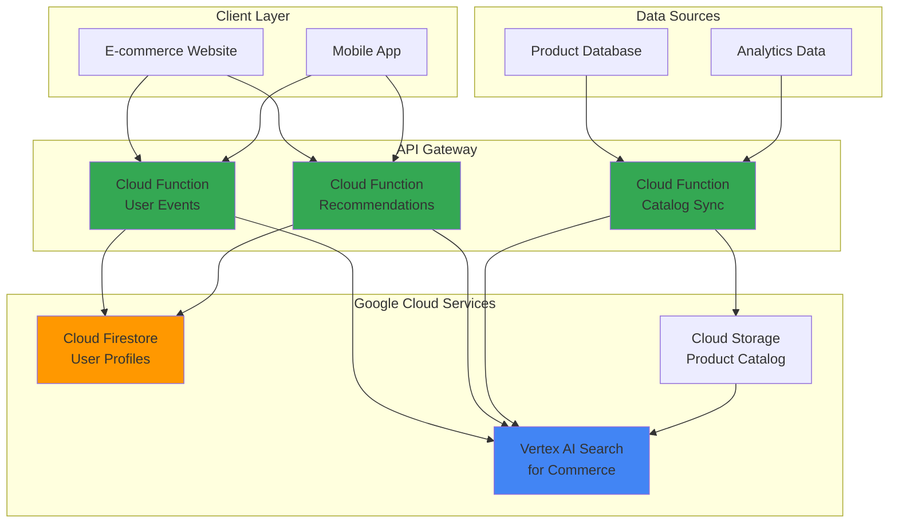

# E-commerce Personalization with Vertex AI Search for Commerce and Cloud Functions

## Problem

E-commerce platforms struggle to deliver personalized shopping experiences that increase customer engagement and conversion rates. Traditional recommendation systems lack real-time responsiveness and fail to adapt to changing customer preferences and inventory levels. Without sophisticated machine learning capabilities, businesses miss opportunities to cross-sell, reduce cart abandonment, and provide contextually relevant product suggestions that drive revenue growth.

## Solution

This solution leverages Google Cloud's Vertex AI Search for Commerce combined with Cloud Functions to create an intelligent personalization engine that analyzes customer behavior, manages product catalogs, and delivers real-time recommendations. The serverless architecture automatically scales based on traffic while machine learning models continuously improve recommendation quality through user interactions and feedback loops.

## Architecture Diagram



## Prerequisites

1. Google Cloud project with billing enabled and appropriate permissions for Vertex AI Search for Commerce, Cloud Functions, Firestore, and Cloud Storage
2. Google Cloud CLI (gcloud) installed and configured, or access to Cloud Shell
3. Basic understanding of e-commerce concepts, recommendation systems, and serverless architecture
4. Node.js development experience for Cloud Functions implementation
5. Estimated cost: $50-100 for initial setup and testing (varies based on data volume and API usage)

> **Note**: Vertex AI Search for Commerce includes machine learning capabilities that automatically improve recommendation quality over time. See [Google Cloud Vertex AI Search for Commerce documentation](https://cloud.google.com/retail/docs) for detailed service information.

## Preparation

```bash
# Set environment variables for GCP resources
export PROJECT_ID="ecommerce-personalization-$(date +%s)"
export REGION="us-central1"
export ZONE="us-central1-a"

# Generate unique suffix for resource names
RANDOM_SUFFIX=$(openssl rand -hex 3)

# Set default project and region
gcloud config set project ${PROJECT_ID}
gcloud config set compute/region ${REGION}
gcloud config set compute/zone ${ZONE}

# Enable required APIs
gcloud services enable retail.googleapis.com
gcloud services enable cloudfunctions.googleapis.com
gcloud services enable firestore.googleapis.com
gcloud services enable storage.googleapis.com
gcloud services enable cloudbuild.googleapis.com

# Create Cloud Storage bucket for product catalog
export BUCKET_NAME="product-catalog-${RANDOM_SUFFIX}"
gsutil mb -p ${PROJECT_ID} -c STANDARD -l ${REGION} gs://${BUCKET_NAME}

# Initialize Firestore in native mode
gcloud firestore databases create --region=${REGION}

echo "✅ Project configured: ${PROJECT_ID}"
echo "✅ Bucket created: ${BUCKET_NAME}"
```

## Steps

1. **Set up Vertex AI Search for Commerce Configuration**:

   Vertex AI Search for Commerce provides machine learning-powered search and recommendation capabilities that learn from user behavior patterns. This managed service eliminates the complexity of building and maintaining recommendation algorithms while providing enterprise-grade scalability and real-time inference capabilities.

   ```bash
   # Create default catalog for the retail API
   # Note: The default catalog is automatically created when you first use the API
   # We'll verify it exists and get catalog information
   export CATALOG_NAME="projects/${PROJECT_ID}/locations/global/catalogs/default_catalog"
   
   # Create a branch for serving recommendations
   export BRANCH_NAME="projects/${PROJECT_ID}/locations/global/catalogs/default_catalog/branches/default_branch"
   
   echo "✅ Retail API catalog configured: ${CATALOG_NAME}"
   echo "✅ Default branch available: ${BRANCH_NAME}"
   ```

   The Vertex AI Search for Commerce API uses a hierarchical structure where catalogs contain product data and branches represent different environments (e.g., staging, production). This separation enables safe testing of recommendation models while maintaining production stability.

2. **Create Cloud Function for Product Catalog Management**:

   This serverless function handles product catalog synchronization, ensuring that inventory changes and new products are immediately available for recommendations. Cloud Functions provide automatic scaling and cost-effective execution for event-driven processing.

   ```bash
   # Create directory for catalog function
   mkdir -p catalog-sync-function
   cd catalog-sync-function
   
   # Create package.json for dependencies
   cat > package.json << 'EOF'
   {
     "name": "catalog-sync-function",
     "version": "1.0.0",
     "dependencies": {
       "@google-cloud/retail": "^4.0.0",
       "@google-cloud/storage": "^7.0.0",
       "@google-cloud/functions-framework": "^3.0.0"
     }
   }
   EOF
   
   # Create the catalog sync function
   cat > index.js << 'EOF'
   const {ProductServiceClient} = require('@google-cloud/retail');
   const {Storage} = require('@google-cloud/storage');
   const functions = require('@google-cloud/functions-framework');
   
   const productClient = new ProductServiceClient();
   const storage = new Storage();
   
   functions.http('syncCatalog', async (req, res) => {
     try {
       const {products} = req.body;
       const parent = `projects/${process.env.PROJECT_ID}/locations/global/catalogs/default_catalog/branches/default_branch`;
       
       for (const product of products) {
         const request = {
           parent: parent,
           product: {
             title: product.title,
             id: product.id,
             categories: product.categories || [],
             priceInfo: {
               price: product.price,
               originalPrice: product.originalPrice || product.price,
               currencyCode: product.currencyCode || 'USD'
             },
             availability: product.availability || 'IN_STOCK',
             attributes: product.attributes || {}
           }
         };
         
         await productClient.createProduct(request);
         console.log(`Product ${product.id} synced successfully`);
       }
       
       res.json({success: true, message: `${products.length} products synced`});
     } catch (error) {
       console.error('Catalog sync error:', error);
       res.status(500).json({error: error.message});
     }
   });
   EOF
   
   # Deploy the catalog sync function
   gcloud functions deploy catalog-sync \
     --gen2 \
     --runtime=nodejs20 \
     --region=${REGION} \
     --source=. \
     --entry-point=syncCatalog \
     --trigger=http \
     --allow-unauthenticated \
     --set-env-vars="PROJECT_ID=${PROJECT_ID}"
   
   cd ..
   echo "✅ Catalog sync function deployed successfully"
   ```

   The catalog sync function processes product data and maintains consistency between your inventory system and the Vertex AI Search for Commerce API. This enables real-time availability updates and ensures recommendations reflect current product status and pricing.

3. **Create Cloud Function for User Event Tracking**:

   User event tracking captures customer interactions across your e-commerce platform, feeding machine learning models that power personalization. These events include page views, clicks, cart additions, and purchases that train the recommendation algorithms.

   ```bash
   # Create directory for user events function
   mkdir -p user-events-function
   cd user-events-function
   
   # Create package.json
   cat > package.json << 'EOF'
   {
     "name": "user-events-function",
     "version": "1.0.0",
     "dependencies": {
       "@google-cloud/retail": "^4.0.0",
       "@google-cloud/firestore": "^7.0.0",
       "@google-cloud/functions-framework": "^3.0.0"
     }
   }
   EOF
   
   # Create the user events function
   cat > index.js << 'EOF'
   const {UserEventServiceClient} = require('@google-cloud/retail');
   const {Firestore} = require('@google-cloud/firestore');
   const functions = require('@google-cloud/functions-framework');
   
   const userEventClient = new UserEventServiceClient();
   const firestore = new Firestore();
   
   functions.http('trackEvent', async (req, res) => {
     try {
       const {userId, eventType, productId, searchQuery, pageInfo} = req.body;
       const parent = `projects/${process.env.PROJECT_ID}/locations/global/catalogs/default_catalog`;
       
       // Create user event for Retail API
       const userEvent = {
         eventType: eventType,
         visitorId: userId,
         eventTime: {
           seconds: Math.floor(Date.now() / 1000)
         }
       };
       
       // Add product details for product-related events
       if (productId && ['detail-page-view', 'add-to-cart', 'purchase'].includes(eventType)) {
         userEvent.productDetails = [{
           product: {
             id: productId
           },
           quantity: req.body.quantity || 1
         }];
       }
       
       // Add search query for search events
       if (searchQuery && eventType === 'search') {
         userEvent.searchQuery = searchQuery;
       }
       
       // Add page info
       if (pageInfo) {
         userEvent.pageInfo = pageInfo;
       }
       
       // Send event to Retail API
       await userEventClient.writeUserEvent({
         parent: parent,
         userEvent: userEvent
       });
       
       // Store user profile data in Firestore
       const userRef = firestore.collection('user_profiles').doc(userId);
       await userRef.set({
         lastActivity: new Date(),
         totalEvents: firestore.FieldValue.increment(1),
         eventHistory: firestore.FieldValue.arrayUnion({
           eventType,
           productId,
           timestamp: new Date()
         })
       }, {merge: true});
       
       res.json({success: true, message: 'Event tracked successfully'});
     } catch (error) {
       console.error('Event tracking error:', error);
       res.status(500).json({error: error.message});
     }
   });
   EOF
   
   # Deploy the user events function
   gcloud functions deploy track-user-events \
     --gen2 \
     --runtime=nodejs20 \
     --region=${REGION} \
     --source=. \
     --entry-point=trackEvent \
     --trigger=http \
     --allow-unauthenticated \
     --set-env-vars="PROJECT_ID=${PROJECT_ID}"
   
   cd ..
   echo "✅ User events tracking function deployed successfully"
   ```

   This function creates a dual-track system: events are sent to the Vertex AI Search for Commerce API for machine learning training while user profiles are maintained in Firestore for additional personalization features. This hybrid approach enables both algorithmic and rule-based personalization strategies.

4. **Create Cloud Function for Recommendation Serving**:

   The recommendation function provides real-time personalized product suggestions based on user behavior, current context, and machine learning model predictions. This serverless endpoint can handle high-frequency requests with automatic scaling.

   ```bash
   # Create directory for recommendations function
   mkdir -p recommendations-function
   cd recommendations-function
   
   # Create package.json
   cat > package.json << 'EOF'
   {
     "name": "recommendations-function",
     "version": "1.0.0",
     "dependencies": {
       "@google-cloud/retail": "^4.0.0",
       "@google-cloud/firestore": "^7.0.0",
       "@google-cloud/functions-framework": "^3.0.0"
     }
   }
   EOF
   
   # Create the recommendations function
   cat > index.js << 'EOF'
   const {PredictionServiceClient} = require('@google-cloud/retail');
   const {Firestore} = require('@google-cloud/firestore');
   const functions = require('@google-cloud/functions-framework');
   
   const predictionClient = new PredictionServiceClient();
   const firestore = new Firestore();
   
   functions.http('getRecommendations', async (req, res) => {
     try {
       const {userId, pageType, productId, filter} = req.body;
       const placement = `projects/${process.env.PROJECT_ID}/locations/global/catalogs/default_catalog/placements/${pageType || 'recently_viewed_default'}`;
       
       // Get user profile from Firestore for additional context
       const userRef = firestore.collection('user_profiles').doc(userId);
       const userDoc = await userRef.get();
       const userProfile = userDoc.exists ? userDoc.data() : {};
       
       // Prepare prediction request
       const request = {
         placement: placement,
         userEvent: {
           eventType: 'detail-page-view',
           visitorId: userId,
           eventTime: {
             seconds: Math.floor(Date.now() / 1000)
           }
         },
         pageSize: 10
       };
       
       // Add product context if provided
       if (productId) {
         request.userEvent.productDetails = [{
           product: {id: productId}
         }];
       }
       
       // Add filter if provided
       if (filter) {
         request.filter = filter;
       }
       
       // Get recommendations from Retail API
       const [response] = await predictionClient.predict(request);
       
       // Enhance recommendations with user profile data
       const recommendations = response.results.map(result => ({
         productId: result.id,
         title: result.product.title,
         price: result.product.priceInfo?.price,
         imageUri: result.product.images?.[0]?.uri,
         categories: result.product.categories,
         score: result.attributionToken,
         personalizedReason: getPersonalizationReason(result, userProfile)
       }));
       
       res.json({
         recommendations,
         attributionToken: response.attributionToken,
         nextPageToken: response.nextPageToken
       });
     } catch (error) {
       console.error('Recommendation error:', error);
       res.status(500).json({error: error.message});
     }
   });
   
   function getPersonalizationReason(result, userProfile) {
     // Simple logic to provide explanation for recommendations
     if (userProfile.eventHistory) {
       const recentCategories = userProfile.eventHistory
         .slice(-5)
         .map(event => event.productId)
         .filter(Boolean);
       
       if (result.product.categories.some(cat => 
         userProfile.eventHistory.some(event => 
           event.productId && event.productId.includes(cat)))) {
         return "Based on your recent browsing";
       }
     }
     return "Recommended for you";
   }
   EOF
   
   # Deploy the recommendations function
   gcloud functions deploy get-recommendations \
     --gen2 \
     --runtime=nodejs20 \
     --region=${REGION} \
     --source=. \
     --entry-point=getRecommendations \
     --trigger=http \
     --allow-unauthenticated \
     --set-env-vars="PROJECT_ID=${PROJECT_ID}"
   
   cd ..
   echo "✅ Recommendations function deployed successfully"
   ```

   This function combines machine learning predictions from the Vertex AI Search for Commerce API with user profile data from Firestore to provide contextually relevant recommendations. The hybrid approach enables both behavioral and collaborative filtering strategies.

5. **Create Sample Product Data and Test Catalog Sync**:

   Loading sample product data demonstrates the complete catalog management workflow and provides test data for recommendation model training. This step simulates real-world e-commerce inventory management processes.

   ```bash
   # Create sample product data
   cat > sample_products.json << 'EOF'
   {
     "products": [
       {
         "id": "product_001",
         "title": "Wireless Bluetooth Headphones",
         "categories": ["Electronics", "Audio", "Headphones"],
         "price": 99.99,
         "originalPrice": 129.99,
         "currencyCode": "USD",
         "availability": "IN_STOCK",
         "attributes": {
           "brand": "TechAudio",
           "color": "Black",
           "wireless": "true"
         }
       },
       {
         "id": "product_002",
         "title": "Smart Fitness Watch",
         "categories": ["Electronics", "Wearables", "Fitness"],
         "price": 199.99,
         "currencyCode": "USD",
         "availability": "IN_STOCK",
         "attributes": {
           "brand": "FitTech",
           "waterproof": "true",
           "battery_life": "7 days"
         }
       },
       {
         "id": "product_003",
         "title": "Organic Cotton T-Shirt",
         "categories": ["Clothing", "Men", "T-Shirts"],
         "price": 29.99,
         "currencyCode": "USD",
         "availability": "IN_STOCK",
         "attributes": {
           "material": "Organic Cotton",
           "size": "Medium",
           "color": "Navy Blue"
         }
       }
     ]
   }
   EOF
   
   # Get the catalog sync function URL
   CATALOG_FUNCTION_URL=$(gcloud functions describe catalog-sync \
     --region=${REGION} \
     --format="value(serviceConfig.uri)")
   
   # Test catalog sync with sample data
   curl -X POST ${CATALOG_FUNCTION_URL} \
     -H "Content-Type: application/json" \
     -d @sample_products.json
   
   echo "✅ Sample products loaded into catalog"
   echo "Function URL: ${CATALOG_FUNCTION_URL}"
   ```

   The sample product data includes essential fields required for effective recommendations: categories for content-based filtering, pricing for value-based suggestions, and attributes for detailed matching. This structure supports various recommendation strategies.

6. **Test User Event Tracking**:

   Simulating user interactions demonstrates how customer behavior data flows through the system and begins training the recommendation models. Real-world implementations would integrate these calls into web and mobile applications.

   ```bash
   # Get the user events function URL
   EVENTS_FUNCTION_URL=$(gcloud functions describe track-user-events \
     --region=${REGION} \
     --format="value(serviceConfig.uri)")
   
   # Simulate user browsing behavior
   curl -X POST ${EVENTS_FUNCTION_URL} \
     -H "Content-Type: application/json" \
     -d '{
       "userId": "user_123",
       "eventType": "detail-page-view",
       "productId": "product_001",
       "pageInfo": {
         "pageCategory": "product_detail"
       }
     }'
   
   # Simulate add to cart event
   curl -X POST ${EVENTS_FUNCTION_URL} \
     -H "Content-Type: application/json" \
     -d '{
       "userId": "user_123",
       "eventType": "add-to-cart",
       "productId": "product_001",
       "quantity": 1
     }'
   
   # Simulate search event
   curl -X POST ${EVENTS_FUNCTION_URL} \
     -H "Content-Type: application/json" \
     -d '{
       "userId": "user_123",
       "eventType": "search",
       "searchQuery": "wireless headphones"
     }'
   
   echo "✅ User events tracked successfully"
   echo "Events Function URL: ${EVENTS_FUNCTION_URL}"
   ```

   These test events demonstrate the variety of user interactions that feed into the recommendation system. The Vertex AI Search for Commerce API uses this behavioral data to understand user preferences and improve recommendation quality over time.

7. **Test Recommendation Generation**:

   Retrieving personalized recommendations demonstrates the complete end-to-end functionality and validates that the machine learning models are processing user behavior data effectively.

   ```bash
   # Get the recommendations function URL
   RECOMMENDATIONS_FUNCTION_URL=$(gcloud functions describe get-recommendations \
     --region=${REGION} \
     --format="value(serviceConfig.uri)")
   
   # Wait a moment for events to be processed
   sleep 30
   
   # Get personalized recommendations
   curl -X POST ${RECOMMENDATIONS_FUNCTION_URL} \
     -H "Content-Type: application/json" \
     -d '{
       "userId": "user_123",
       "pageType": "home-page",
       "filter": "availability: \"IN_STOCK\""
     }' | jq '.'
   
   echo "✅ Recommendations generated successfully"
   echo "Recommendations Function URL: ${RECOMMENDATIONS_FUNCTION_URL}"
   ```

   The recommendation response includes product suggestions, relevance scores, and attribution tokens for tracking recommendation effectiveness. This enables A/B testing and continuous optimization of the personalization strategy.

## Validation & Testing

1. Verify Cloud Functions deployment status:

   ```bash
   # Check all deployed functions
   gcloud functions list --regions=${REGION} \
     --format="table(name,status,trigger)"
   ```

   Expected output: Three functions (catalog-sync, track-user-events, get-recommendations) with ACTIVE status and HTTP triggers.

2. Test Firestore user profile storage:

   ```bash
   # Check if user profiles are being created
   gcloud firestore export gs://${BUCKET_NAME}/firestore-export \
     --collection-ids=user_profiles
   
   # Verify the export was created
   gsutil ls gs://${BUCKET_NAME}/firestore-export/
   ```

3. Validate product catalog in Vertex AI Search for Commerce:

   ```bash
   # List products in the catalog using gcloud
   gcloud retail products list \
     --catalog="projects/${PROJECT_ID}/locations/global/catalogs/default_catalog" \
     --branch="default_branch" \
     --limit=10
   ```

4. Test recommendation quality with different user scenarios:

   ```bash
   # Test recommendations for a new user (should get popular items)
   curl -X POST ${RECOMMENDATIONS_FUNCTION_URL} \
     -H "Content-Type: application/json" \
     -d '{
       "userId": "new_user_456",
       "pageType": "home-page"
     }' | jq '.recommendations | length'
   
   # Test category-filtered recommendations
   curl -X POST ${RECOMMENDATIONS_FUNCTION_URL} \
     -H "Content-Type: application/json" \
     -d '{
       "userId": "user_123",
       "pageType": "category-page",
       "filter": "categories: ANY(\"Electronics\")"
     }' | jq '.recommendations[].categories'
   ```

## Cleanup

1. Delete Cloud Functions:

   ```bash
   # Remove all deployed functions
   gcloud functions delete catalog-sync --region=${REGION} --quiet
   gcloud functions delete track-user-events --region=${REGION} --quiet
   gcloud functions delete get-recommendations --region=${REGION} --quiet
   
   echo "✅ Cloud Functions deleted"
   ```

2. Clean up Cloud Storage:

   ```bash
   # Remove all objects and bucket
   gsutil -m rm -r gs://${BUCKET_NAME}
   
   echo "✅ Storage bucket deleted"
   ```

3. Remove Firestore data:

   ```bash
   # Delete user profiles collection
   gcloud firestore collections delete user_profiles --quiet
   
   echo "✅ Firestore data cleared"
   ```

4. Delete the entire project (if created specifically for this recipe):

   ```bash
   # Delete project and all resources
   gcloud projects delete ${PROJECT_ID} --quiet
   
   echo "✅ Project deleted: ${PROJECT_ID}"
   echo "Note: Project deletion may take several minutes to complete"
   ```

## Discussion

This intelligent e-commerce personalization solution demonstrates the power of combining Google Cloud's managed machine learning services with serverless computing to create scalable, cost-effective recommendation systems. The Vertex AI Search for Commerce service eliminates the complexity of building and maintaining recommendation algorithms while providing enterprise-grade performance and accuracy. By leveraging Cloud Functions for event processing and Firestore for user profile management, the architecture automatically scales to handle varying traffic loads while maintaining low latency for real-time recommendations.

The hybrid approach of using both machine learning predictions and rule-based personalization provides flexibility to address different business requirements. The Vertex AI Search for Commerce API's machine learning models improve over time as they process more user interaction data, while the Firestore-based user profiles enable immediate personalization based on explicit user preferences and demographic information. This combination ensures that both new and returning customers receive relevant product suggestions that drive engagement and conversion.

The serverless architecture provides significant operational benefits including automatic scaling, reduced infrastructure management overhead, and pay-per-use pricing that aligns costs with business value. Cloud Functions handle traffic spikes gracefully while the managed services (Vertex AI Search for Commerce, Firestore) provide high availability and global distribution. This approach enables businesses to focus on developing personalization strategies rather than managing infrastructure, accelerating time-to-market for new features and improvements.

Security and privacy considerations are built into the Google Cloud platform, with IAM controls, data encryption, and compliance certifications that meet enterprise requirements. The event tracking system can be configured to respect user privacy preferences and comply with regulations like GDPR, while still providing valuable insights for personalization algorithms. For more information on Google Cloud security best practices, see the [Google Cloud Security documentation](https://cloud.google.com/security/best-practices).

> **Tip**: Monitor recommendation click-through rates and conversion metrics to continuously optimize the personalization strategy. Use A/B testing with different recommendation models and fallback strategies to maximize business impact.

## Challenge

Extend this solution by implementing these enhancements:

1. **Real-time Inventory Integration**: Connect the catalog sync function to your inventory management system using Pub/Sub to automatically update product availability and pricing in real-time, ensuring recommendations never include out-of-stock items.

2. **Advanced User Segmentation**: Implement customer lifecycle segmentation in Firestore using Cloud Functions triggers to automatically categorize users based on purchase history, browse patterns, and engagement levels, enabling targeted recommendation strategies for different user segments.

3. **Multi-channel Personalization**: Expand the system to support email marketing and push notification personalization by creating additional Cloud Functions that generate product recommendations for marketing campaigns based on user preferences and behavior patterns.

4. **A/B Testing Framework**: Build an experimentation platform using Cloud Functions and Firestore to automatically split traffic between different recommendation algorithms, track performance metrics, and optimize conversion rates through systematic testing.

5. **Cross-platform Analytics Dashboard**: Create a real-time analytics dashboard using Cloud Run and BigQuery to visualize recommendation performance, user engagement metrics, and business impact across web and mobile channels, enabling data-driven optimization of the personalization strategy.

## Infrastructure Code

### Available Infrastructure as Code:

- [Infrastructure Code Overview](code/README.md) - Detailed description of all infrastructure components
- [Infrastructure Manager](code/infrastructure-manager/) - GCP Infrastructure Manager templates
- [Bash CLI Scripts](code/scripts/) - Example bash scripts using gcloud CLI commands to deploy infrastructure
- [Terraform](code/terraform/) - Terraform configuration files