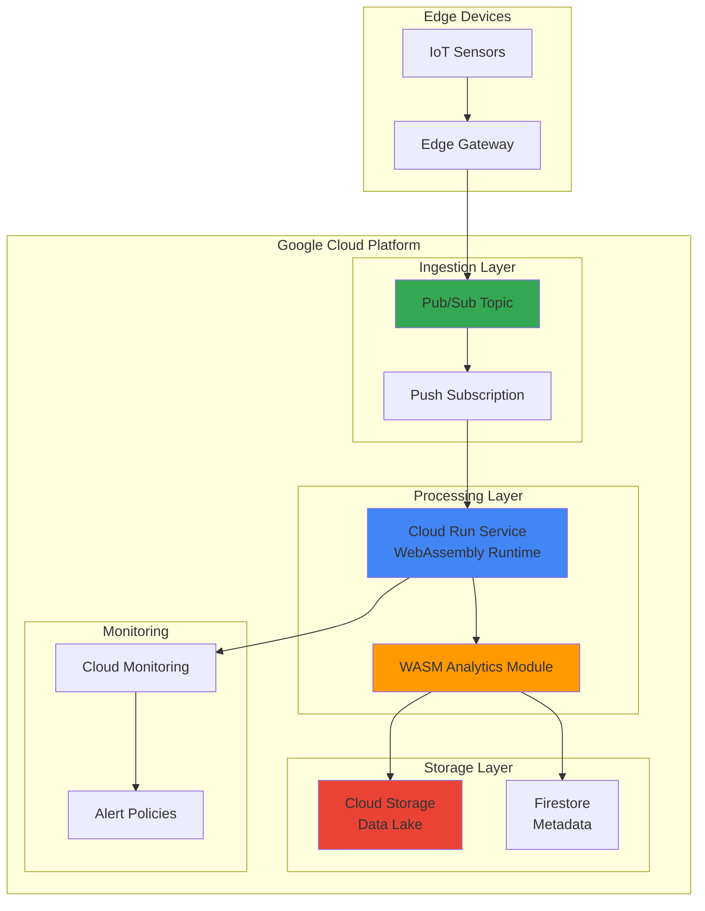

# Edge Analytics with Cloud Run WebAssembly and Pub/Sub

## Problem

Manufacturing companies need to process high-volume IoT sensor data streams from industrial equipment in real-time at the edge to detect anomalies, prevent equipment failures, and optimize operational efficiency. Traditional cloud-only processing introduces latency that can delay critical maintenance decisions, while existing edge solutions lack the computational power and intelligence needed for complex analytics on resource-constrained devices.

## Solution

Build a high-performance edge analytics platform using WebAssembly modules deployed on Cloud Run to process streaming IoT data through Pub/Sub. This serverless architecture combines the computational efficiency of WebAssembly with Google Cloud's managed services to deliver real-time analytics, intelligent alerting, and seamless scalability while maintaining low latency for critical edge workloads.

## Architecture Diagram



## Prerequisites

1. Google Cloud account with billing enabled and appropriate IAM permissions for Cloud Run, Pub/Sub, Cloud Storage, and Cloud Monitoring
2. Google Cloud CLI (gcloud) installed and configured, or access to Cloud Shell
3. Basic understanding of WebAssembly, serverless architectures, and IoT data processing concepts
4. Docker installed locally for building container images with WebAssembly runtime
5. Rust toolchain installed for compiling WebAssembly modules (rustc 1.70+)
6. Estimated cost: $5-15 per day for moderate IoT data volumes (1000 messages/hour)

> **Note**: This recipe uses Cloud Run's newest container runtime features to support WebAssembly workloads. Ensure your project has the latest Cloud Run APIs enabled.

## Preparation

```bash
# Set environment variables for GCP resources
export PROJECT_ID="edge-analytics-$(date +%s)"
export REGION="us-central1"
export ZONE="us-central1-a"

# Generate unique suffix for resource names
RANDOM_SUFFIX=$(openssl rand -hex 3)
export TOPIC_NAME="iot-sensor-data-${RANDOM_SUFFIX}"
export SUBSCRIPTION_NAME="analytics-subscription-${RANDOM_SUFFIX}"
export SERVICE_NAME="edge-analytics-${RANDOM_SUFFIX}"
export BUCKET_NAME="edge-analytics-data-${RANDOM_SUFFIX}"

# Set default project and region
gcloud config set project ${PROJECT_ID}
gcloud config set compute/region ${REGION}
gcloud config set compute/zone ${ZONE}

# Enable required APIs
gcloud services enable run.googleapis.com
gcloud services enable pubsub.googleapis.com
gcloud services enable storage.googleapis.com
gcloud services enable monitoring.googleapis.com
gcloud services enable cloudbuild.googleapis.com

echo "✅ Project configured: ${PROJECT_ID}"
echo "✅ Required APIs enabled"
```

## Steps

1. **Create Cloud Storage Bucket for Analytics Data Lake**:

   Cloud Storage provides unified object storage with global edge caching and strong consistency guarantees. Creating a bucket with appropriate location and storage class settings establishes the foundation for a data lake architecture that can scale from gigabytes to exabytes while maintaining high performance for analytics workloads.

   ```bash
   # Create storage bucket for processed analytics data
   gsutil mb -p ${PROJECT_ID} \
       -c STANDARD \
       -l ${REGION} \
       gs://${BUCKET_NAME}
   
   # Enable versioning for data protection
   gsutil versioning set on gs://${BUCKET_NAME}
   
   # Set lifecycle policy to optimize costs
   cat > lifecycle.json << EOF
   {
     "lifecycle": {
       "rule": [
         {
           "action": {"type": "SetStorageClass", "storageClass": "NEARLINE"},
           "condition": {"age": 30}
         },
         {
           "action": {"type": "SetStorageClass", "storageClass": "COLDLINE"},
           "condition": {"age": 90}
         }
       ]
     }
   }
   EOF
   
   gsutil lifecycle set lifecycle.json gs://${BUCKET_NAME}
   
   echo "✅ Cloud Storage bucket created with lifecycle management"
   ```

   The storage bucket is now configured with intelligent lifecycle management that automatically transitions data to cost-effective storage classes as it ages, providing both performance and economic efficiency for long-term analytics data retention.

2. **Create Pub/Sub Topic and Subscription for IoT Data Ingestion**:

   Pub/Sub provides a fully managed, real-time messaging service that decouples IoT devices from analytics processing. This asynchronous communication pattern enables elastic scaling and fault tolerance while ensuring no data loss during processing spikes or system maintenance.

   ```bash
   # Create Pub/Sub topic for IoT sensor data
   gcloud pubsub topics create ${TOPIC_NAME} \
       --message-retention-duration=7d
   
   # Create push subscription that will trigger Cloud Run
   gcloud pubsub subscriptions create ${SUBSCRIPTION_NAME} \
       --topic=${TOPIC_NAME} \
       --push-endpoint=https://${SERVICE_NAME}-${PROJECT_ID}.a.run.app/process \
       --ack-deadline=60 \
       --message-retention-duration=7d \
       --max-retry-delay=600s \
       --min-retry-delay=10s
   
   echo "✅ Pub/Sub topic and subscription configured"
   ```

   The Pub/Sub infrastructure now provides guaranteed message delivery with automatic retry logic, ensuring that IoT sensor data reliably reaches the analytics processing pipeline even during temporary outages or capacity constraints.

3. **Develop WebAssembly Analytics Module**:

   WebAssembly enables near-native performance for computationally intensive analytics while maintaining portability and security. This module will process IoT sensor data, detect anomalies, and generate insights using efficient algorithms optimized for edge computing scenarios.

   ```bash
   # Create Rust project for WebAssembly analytics module
   mkdir -p wasm-analytics && cd wasm-analytics
   
   # Initialize Rust project with WebAssembly target
   cargo init --name analytics_engine
   
   # Configure Cargo.toml for WebAssembly compilation
   cat > Cargo.toml << 'EOF'
   [package]
   name = "analytics_engine"
   version = "0.1.0"
   edition = "2021"
   
   [lib]
   crate-type = ["cdylib"]
   
   [dependencies]
   wasm-bindgen = "0.2"
   serde = { version = "1.0", features = ["derive"] }
   serde_json = "1.0"
   js-sys = "0.3"
   
   [dependencies.web-sys]
   version = "0.3"
   features = [
     "console",
   ]
   EOF
   
   # Create analytics module with anomaly detection
   cat > src/lib.rs << 'EOF'
   use wasm_bindgen::prelude::*;
   use serde::{Deserialize, Serialize};
   
   #[derive(Deserialize, Serialize)]
   pub struct SensorData {
       sensor_id: String,
       temperature: f64,
       pressure: f64,
       vibration: f64,
       timestamp: u64,
   }
   
   #[derive(Serialize)]
   pub struct AnalyticsResult {
       sensor_id: String,
       anomaly_score: f64,
       is_anomaly: bool,
       recommendations: Vec<String>,
       timestamp: u64,
   }
   
   #[wasm_bindgen]
   pub fn process_sensor_data(data_json: &str) -> String {
       let sensor_data: SensorData = serde_json::from_str(data_json).unwrap();
       
       // Perform anomaly detection using statistical analysis
       let anomaly_score = calculate_anomaly_score(&sensor_data);
       let is_anomaly = anomaly_score > 0.7;
       
       let mut recommendations = Vec::new();
       if is_anomaly {
           recommendations.push("Schedule immediate maintenance check".to_string());
           if sensor_data.temperature > 80.0 {
               recommendations.push("Check cooling system".to_string());
           }
           if sensor_data.vibration > 5.0 {
               recommendations.push("Inspect bearing alignment".to_string());
           }
       }
       
       let result = AnalyticsResult {
           sensor_id: sensor_data.sensor_id,
           anomaly_score,
           is_anomaly,
           recommendations,
           timestamp: sensor_data.timestamp,
       };
       
       serde_json::to_string(&result).unwrap()
   }
   
   fn calculate_anomaly_score(data: &SensorData) -> f64 {
       // Simple anomaly detection using threshold-based scoring
       let temp_score = if data.temperature > 75.0 { 0.3 } else { 0.0 };
       let pressure_score = if data.pressure > 2.5 { 0.2 } else { 0.0 };
       let vibration_score = if data.vibration > 4.0 { 0.5 } else { 0.0 };
       
       (temp_score + pressure_score + vibration_score).min(1.0)
   }
   EOF
   
   # Install wasm-pack for building WebAssembly modules
   curl https://rustwasm.github.io/wasm-pack/installer/init.sh -sSf | sh
   
   # Build WebAssembly module
   wasm-pack build --target nodejs --scope analytics
   
   cd ..
   echo "✅ WebAssembly analytics module compiled"
   ```

   The WebAssembly module now provides high-performance anomaly detection capabilities that can process sensor data with minimal computational overhead, making it ideal for edge deployment scenarios where resources are constrained.

4. **Create Cloud Run Service with WebAssembly Runtime**:

   Cloud Run's containerized environment supports WebAssembly runtimes, enabling deployment of high-performance analytics modules with automatic scaling and managed infrastructure. This serverless approach eliminates operational overhead while providing enterprise-grade reliability.

   ```bash
   # Create Cloud Run service directory
   mkdir -p cloud-run-service && cd cloud-run-service
   
   # Create Node.js application to host WebAssembly module
   cat > package.json << 'EOF'
   {
     "name": "edge-analytics-service",
     "version": "1.0.0",
     "main": "server.js",
     "dependencies": {
       "express": "^4.18.0",
       "@google-cloud/storage": "^7.0.0",
       "@google-cloud/firestore": "^7.0.0",
       "@google-cloud/monitoring": "^4.0.0"
     }
   }
   EOF
   
   # Create Express server with WebAssembly integration
   cat > server.js << 'EOF'
   const express = require('express');
   const { Storage } = require('@google-cloud/storage');
   const { Firestore } = require('@google-cloud/firestore');
   const { MetricServiceClient } = require('@google-cloud/monitoring');
   
   // Load WebAssembly module
   const wasm = require('../wasm-analytics/pkg/analytics_engine');
   
   const app = express();
   const port = process.env.PORT || 8080;
   
   // Initialize Google Cloud clients
   const storage = new Storage();
   const firestore = new Firestore();
   const monitoring = new MetricServiceClient();
   
   const bucketName = process.env.BUCKET_NAME;
   
   app.use(express.json());
   
   app.post('/process', async (req, res) => {
     try {
       const pubsubMessage = req.body;
       const sensorData = JSON.parse(
         Buffer.from(pubsubMessage.message.data, 'base64').toString()
       );
       
       // Process data using WebAssembly module
       const result = wasm.process_sensor_data(JSON.stringify(sensorData));
       const analyticsResult = JSON.parse(result);
       
       // Store results in Cloud Storage
       const fileName = `analytics/${analyticsResult.sensor_id}/${Date.now()}.json`;
       await storage.bucket(bucketName).file(fileName).save(result);
       
       // Store metadata in Firestore
       await firestore.collection('sensor_analytics').add({
         ...analyticsResult,
         processed_at: new Date(),
         storage_path: fileName
       });
       
       // Send custom metrics to Cloud Monitoring
       if (analyticsResult.is_anomaly) {
         await sendCustomMetric('anomaly_detected', 1, analyticsResult.sensor_id);
       }
       
       await sendCustomMetric('data_processed', 1, analyticsResult.sensor_id);
       
       console.log(`Processed data for sensor ${analyticsResult.sensor_id}`);
       res.status(200).send('OK');
       
     } catch (error) {
       console.error('Error processing data:', error);
       res.status(500).send('Error processing data');
     }
   });
   
   async function sendCustomMetric(metricType, value, sensorId) {
     const projectId = process.env.GOOGLE_CLOUD_PROJECT;
     const request = {
       name: monitoring.projectPath(projectId),
       timeSeries: [{
         metric: {
           type: `custom.googleapis.com/iot/${metricType}`,
           labels: { sensor_id: sensorId }
         },
         resource: {
           type: 'generic_node',
           labels: {
             project_id: projectId,
             location: 'us-central1',
             namespace: 'edge-analytics',
             node_id: sensorId
           }
         },
         points: [{
           interval: { endTime: { seconds: Math.floor(Date.now() / 1000) } },
           value: { doubleValue: value }
         }]
       }]
     };
     
     await monitoring.createTimeSeries(request);
   }
   
   app.listen(port, () => {
     console.log(`Edge analytics service listening on port ${port}`);
   });
   EOF
   
   # Copy WebAssembly module to service directory
   cp -r ../wasm-analytics/pkg .
   
   # Create Dockerfile for Cloud Run
   cat > Dockerfile << 'EOF'
   FROM node:18-alpine
   
   WORKDIR /app
   
   # Copy package files
   COPY package*.json ./
   
   # Install dependencies
   RUN npm install
   
   # Copy WebAssembly module and application code
   COPY pkg/ ./pkg/
   COPY server.js ./
   
   # Expose port
   EXPOSE 8080
   
   # Start the service
   CMD ["node", "server.js"]
   EOF
   
   echo "✅ Cloud Run service application created"
   ```

   The Cloud Run service integrates WebAssembly processing with Google Cloud's managed services, providing automatic scaling, load balancing, and integration with Cloud Storage, Firestore, and Cloud Monitoring for comprehensive data lifecycle management.

5. **Build and Deploy Container to Cloud Run**:

   Cloud Build provides secure, scalable container building capabilities integrated with Google Cloud services. Deploying the WebAssembly-enabled container to Cloud Run enables automatic scaling based on demand while maintaining consistent performance for analytics workloads.

   ```bash
   # Build container image using Cloud Build
   gcloud builds submit --tag gcr.io/${PROJECT_ID}/${SERVICE_NAME} .
   
   # Deploy to Cloud Run with appropriate configuration
   gcloud run deploy ${SERVICE_NAME} \
       --image gcr.io/${PROJECT_ID}/${SERVICE_NAME} \
       --platform managed \
       --region ${REGION} \
       --allow-unauthenticated \
       --memory 1Gi \
       --cpu 2 \
       --concurrency 80 \
       --max-instances 100 \
       --set-env-vars="BUCKET_NAME=${BUCKET_NAME}" \
       --set-env-vars="GOOGLE_CLOUD_PROJECT=${PROJECT_ID}"
   
   # Get the service URL
   SERVICE_URL=$(gcloud run services describe ${SERVICE_NAME} \
       --platform managed \
       --region ${REGION} \
       --format 'value(status.url)')
   
   echo "✅ Cloud Run service deployed at: ${SERVICE_URL}"
   
   cd ..
   ```

   The Cloud Run service is now deployed with optimized resource allocation for WebAssembly workloads, providing automatic scaling from zero to handle varying IoT data volumes while maintaining sub-second response times for real-time analytics.

6. **Update Pub/Sub Subscription with Service Endpoint**:

   Configuring the Pub/Sub push subscription to target the deployed Cloud Run service establishes the event-driven architecture that automatically processes IoT data as it arrives, ensuring real-time analytics without manual intervention or complex orchestration.

   ```bash
   # Update subscription with actual Cloud Run service URL
   gcloud pubsub subscriptions modify-push-config ${SUBSCRIPTION_NAME} \
       --push-endpoint="${SERVICE_URL}/process"
   
   # Grant Pub/Sub permission to invoke Cloud Run service
   gcloud run services add-iam-policy-binding ${SERVICE_NAME} \
       --member="serviceAccount:service-${PROJECT_NUMBER}@gcp-sa-pubsub.iam.gserviceaccount.com" \
       --role="roles/run.invoker" \
       --region=${REGION}
   
   # Get project number for service account
   PROJECT_NUMBER=$(gcloud projects describe ${PROJECT_ID} \
       --format="value(projectNumber)")
   
   echo "✅ Pub/Sub subscription configured to trigger Cloud Run service"
   ```

   The event-driven pipeline is now fully configured, enabling automatic processing of IoT sensor data through the WebAssembly analytics engine with guaranteed delivery and retry mechanisms for fault tolerance.

7. **Configure Cloud Monitoring and Alerting**:

   Cloud Monitoring provides comprehensive observability for the edge analytics platform, enabling proactive monitoring of system health, performance metrics, and business KPIs. Alert policies ensure immediate notification of anomalies or system issues.

   ```bash
   # Create alert policy for anomaly detection
   cat > anomaly-alert-policy.json << EOF
   {
     "displayName": "IoT Anomaly Detection Alert",
     "conditions": [
       {
         "displayName": "Anomaly Rate High",
         "conditionThreshold": {
           "filter": "metric.type=\"custom.googleapis.com/iot/anomaly_detected\"",
           "comparison": "COMPARISON_GREATER_THAN",
           "thresholdValue": 5,
           "duration": "300s",
           "aggregations": [
             {
               "alignmentPeriod": "300s",
               "perSeriesAligner": "ALIGN_RATE"
             }
           ]
         }
       }
     ],
     "combiner": "OR",
     "enabled": true,
     "notificationChannels": []
   }
   EOF
   
   # Create the alert policy
   gcloud alpha monitoring policies create --policy-from-file=anomaly-alert-policy.json
   
   # Create dashboard for monitoring edge analytics
   cat > dashboard-config.json << EOF
   {
     "displayName": "Edge Analytics Dashboard",
     "mosaicLayout": {
       "tiles": [
         {
           "width": 6,
           "height": 4,
           "widget": {
             "title": "Data Processing Rate",
             "xyChart": {
               "dataSets": [
                 {
                   "timeSeriesQuery": {
                     "timeSeriesFilter": {
                       "filter": "metric.type=\"custom.googleapis.com/iot/data_processed\"",
                       "aggregation": {
                         "alignmentPeriod": "300s",
                         "perSeriesAligner": "ALIGN_RATE"
                       }
                     }
                   }
                 }
               ]
             }
           }
         }
       ]
     }
   }
   EOF
   
   gcloud monitoring dashboards create --config-from-file=dashboard-config.json
   
   echo "✅ Cloud Monitoring alerts and dashboard configured"
   ```

   Comprehensive monitoring is now in place to track analytics performance, detect system issues, and provide visibility into IoT data processing patterns, enabling proactive maintenance and optimization of the edge analytics platform.

8. **Create Sample IoT Data Generator and Test the Pipeline**:

   Testing the complete pipeline with realistic IoT sensor data validates system functionality and performance characteristics. This simulation helps identify potential bottlenecks and ensures the analytics processing meets real-world requirements.

   ```bash
   # Create IoT data simulator
   cat > iot-simulator.py << 'EOF'
   #!/usr/bin/env python3
   import json
   import time
   import random
   from google.cloud import pubsub_v1
   import os
   
   # Initialize Pub/Sub publisher
   project_id = os.environ['PROJECT_ID']
   topic_name = os.environ['TOPIC_NAME']
   
   publisher = pubsub_v1.PublisherClient()
   topic_path = publisher.topic_path(project_id, topic_name)
   
   def generate_sensor_data(sensor_id):
       """Generate realistic IoT sensor data with occasional anomalies"""
       base_temp = 65.0
       base_pressure = 2.0
       base_vibration = 2.5
       
       # Introduce anomalies 10% of the time
       if random.random() < 0.1:
           # Generate anomalous data
           temperature = base_temp + random.uniform(15, 25)
           pressure = base_pressure + random.uniform(1, 2)
           vibration = base_vibration + random.uniform(3, 5)
       else:
           # Generate normal data with small variations
           temperature = base_temp + random.uniform(-5, 5)
           pressure = base_pressure + random.uniform(-0.3, 0.3)
           vibration = base_vibration + random.uniform(-1, 1)
       
       return {
           'sensor_id': sensor_id,
           'temperature': round(temperature, 2),
           'pressure': round(pressure, 2),
           'vibration': round(vibration, 2),
           'timestamp': int(time.time() * 1000)
       }
   
   def publish_sensor_data():
       """Simulate multiple IoT sensors sending data"""
       sensors = ['pump-001', 'pump-002', 'compressor-001', 'motor-001', 'motor-002']
       
       for sensor_id in sensors:
           data = generate_sensor_data(sensor_id)
           message_json = json.dumps(data)
           message_bytes = message_json.encode('utf-8')
           
           # Publish to Pub/Sub
           future = publisher.publish(topic_path, message_bytes)
           print(f"Published data for {sensor_id}: {data}")
       
       print(f"Published {len(sensors)} sensor readings")
   
   if __name__ == '__main__':
       print("Starting IoT data simulation...")
       try:
           while True:
               publish_sensor_data()
               time.sleep(10)  # Send data every 10 seconds
       except KeyboardInterrupt:
           print("\nStopping IoT simulation")
   EOF
   
   # Install required Python dependencies
   pip3 install google-cloud-pubsub
   
   # Make simulator executable
   chmod +x iot-simulator.py
   
   echo "✅ IoT data simulator created and ready to test"
   ```

   The IoT simulator generates realistic sensor data with controlled anomaly injection, providing a comprehensive test environment to validate the edge analytics pipeline's ability to process data streams and detect anomalous conditions in real-time.

## Validation & Testing

1. **Verify Cloud Run Service Health**:

   ```bash
   # Check Cloud Run service status
   gcloud run services describe ${SERVICE_NAME} \
       --platform managed \
       --region ${REGION} \
       --format="table(status.conditions[].type,status.conditions[].status)"
   
   # Test service endpoint directly
   curl -X POST "${SERVICE_URL}/process" \
       -H "Content-Type: application/json" \
       -d '{
         "message": {
           "data": "'$(echo '{"sensor_id":"test-001","temperature":85.5,"pressure":3.2,"vibration":6.1,"timestamp":1640995200000}' | base64)'"
         }
       }'
   ```

   Expected output: HTTP 200 status and "OK" response indicating successful processing.

2. **Test IoT Data Pipeline with Simulator**:

   ```bash
   # Start IoT data simulation
   export PROJECT_ID=${PROJECT_ID}
   export TOPIC_NAME=${TOPIC_NAME}
   python3 iot-simulator.py &
   SIMULATOR_PID=$!
   
   # Let it run for 2 minutes to generate test data
   sleep 120
   
   # Stop the simulator
   kill $SIMULATOR_PID
   
   echo "✅ IoT simulation completed"
   ```

3. **Verify Data Processing and Storage**:

   ```bash
   # Check processed data in Cloud Storage
   gsutil ls -r gs://${BUCKET_NAME}/analytics/
   
   # Verify Firestore documents
   gcloud firestore databases list
   
   # Check Cloud Monitoring metrics
   gcloud logging read "resource.type=cloud_run_revision AND resource.labels.service_name=${SERVICE_NAME}" \
       --limit=10 --format="table(timestamp,severity,textPayload)"
   ```

   Expected output: Files in Cloud Storage, Firestore documents with analytics results, and log entries showing successful data processing.

## Cleanup

1. **Remove Cloud Run service and container images**:

   ```bash
   # Delete Cloud Run service
   gcloud run services delete ${SERVICE_NAME} \
       --platform managed \
       --region ${REGION} \
       --quiet
   
   # Delete container images
   gcloud container images delete gcr.io/${PROJECT_ID}/${SERVICE_NAME} --quiet
   
   echo "✅ Deleted Cloud Run service and images"
   ```

2. **Remove Pub/Sub resources**:

   ```bash
   # Delete Pub/Sub subscription
   gcloud pubsub subscriptions delete ${SUBSCRIPTION_NAME}
   
   # Delete Pub/Sub topic
   gcloud pubsub topics delete ${TOPIC_NAME}
   
   echo "✅ Deleted Pub/Sub topic and subscription"
   ```

3. **Remove storage and database resources**:

   ```bash
   # Delete Cloud Storage bucket and contents
   gsutil -m rm -r gs://${BUCKET_NAME}
   
   # Delete Firestore data (optional - comment out if you want to preserve)
   # gcloud firestore databases delete --database="(default)" --quiet
   
   echo "✅ Deleted storage resources"
   ```

4. **Remove monitoring resources**:

   ```bash
   # Clean up alert policies and dashboards
   gcloud alpha monitoring policies list --format="value(name)" | \
       grep "IoT Anomaly" | xargs gcloud alpha monitoring policies delete --quiet
   
   # Remove custom metrics (they will expire automatically)
   
   echo "✅ Cleaned up monitoring resources"
   ```

## Discussion

This edge analytics platform demonstrates the powerful combination of WebAssembly and Google Cloud's serverless infrastructure to solve complex IoT processing challenges. WebAssembly provides near-native performance for computationally intensive analytics while maintaining the security and portability benefits of containerized deployment. The choice of WebAssembly over traditional compiled languages enables rapid iteration and deployment cycles while ensuring consistent performance across different hardware architectures.

The serverless architecture built on Cloud Run eliminates the operational overhead of managing infrastructure while providing automatic scaling capabilities that can handle variable IoT data volumes. Pub/Sub acts as the critical decoupling layer that enables fault-tolerant, asynchronous processing, ensuring that temporary service outages don't result in data loss. The push subscription model provides immediate processing latency, crucial for real-time anomaly detection scenarios where delayed responses can have significant business impact.

Cloud Storage integration with intelligent lifecycle management optimizes costs by automatically transitioning older analytics data to cost-effective storage tiers while maintaining immediate access to recent data. Firestore provides low-latency metadata storage for operational queries and dashboard visualization, complementing the high-volume data lake storage. Cloud Monitoring integration enables comprehensive observability, from infrastructure metrics to custom business KPIs, ensuring proactive management of the analytics platform.

The WebAssembly module's design demonstrates efficient anomaly detection using statistical analysis that can be easily extended with machine learning models or more sophisticated algorithms. The modular architecture supports hot-swapping of analytics logic without infrastructure changes, enabling continuous improvement of detection accuracy and the addition of new analytical capabilities as business requirements evolve.

> **Tip**: Consider implementing model versioning and A/B testing capabilities within the WebAssembly modules to safely deploy improved analytics algorithms while maintaining service reliability.

**Documentation References:**
- [Cloud Run WebAssembly Support](https://cloud.google.com/run/docs/tutorials)
- [Pub/Sub Push Subscriptions](https://cloud.google.com/pubsub/docs/push)
- [Cloud Storage Lifecycle Management](https://cloud.google.com/storage/docs/lifecycle)
- [Cloud Monitoring Custom Metrics](https://cloud.google.com/monitoring/custom-metrics)
- [WebAssembly System Interface (WASI)](https://wasi.dev/)

## Challenge

Extend this solution by implementing these advanced capabilities:

1. **Machine Learning Integration**: Replace the statistical anomaly detection with a TensorFlow Lite model compiled to WebAssembly, enabling more sophisticated pattern recognition and predictive maintenance capabilities.

2. **Multi-Region Deployment**: Deploy the analytics service across multiple Google Cloud regions with intelligent data routing based on sensor location, reducing latency and improving reliability for global IoT deployments.

3. **Real-time Streaming Analytics**: Integrate with Dataflow and BigQuery to provide continuous aggregation and real-time dashboards for operational monitoring and business intelligence reporting.

4. **Edge Device Deployment**: Package the WebAssembly analytics module for deployment directly on edge devices using WasmEdge or similar runtimes, enabling local processing with cloud synchronization for hybrid architectures.

5. **Advanced Security Integration**: Implement end-to-end encryption with Cloud KMS integration, device authentication using Certificate Authority Service, and zero-trust security policies for enterprise IoT deployments.

## Infrastructure Code

*Infrastructure code will be generated after recipe approval.*