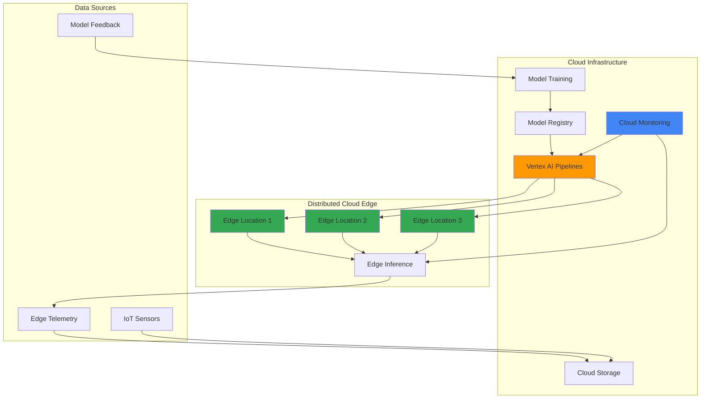

# Edge-to-Cloud MLOps Pipelines with Distributed Cloud Edge and Vertex AI Pipelines

## Problem

Modern AI-driven enterprises need to deploy machine learning models at edge locations while maintaining centralized model governance and monitoring. Organizations struggle with fragmented ML workflows that lack seamless integration between edge devices and cloud infrastructure, resulting in inconsistent model performance, poor visibility into edge model health, and difficulty maintaining model versioning across distributed environments. This disconnect creates operational complexity and prevents organizations from realizing the full potential of their AI investments across edge and cloud environments.

## Solution

Build automated MLOps pipelines that seamlessly orchestrate model training, deployment, and monitoring across Google Distributed Cloud Edge and centralized cloud infrastructure using Vertex AI Pipelines. This solution enables continuous model improvement through edge telemetry feedback, automated model deployment to edge locations, and centralized governance through Cloud Monitoring, creating a unified MLOps workflow that spans from cloud to edge.

## Architecture Diagram



## Prerequisites

1. Google Cloud account with appropriate permissions for Vertex AI, Distributed Cloud Edge, Cloud Storage, and Cloud Monitoring
2. gcloud CLI installed and configured (version 400.0.0 or later)
3. Advanced knowledge of machine learning workflows and containerization
4. Understanding of edge computing concepts and hybrid cloud architectures
5. Estimated cost: $200-500 for resources created during this recipe

> **Note**: This advanced recipe requires careful resource management to avoid significant costs. Distributed Cloud Edge involves substantial infrastructure components.

## Preparation

```bash
# Set environment variables for GCP resources
export PROJECT_ID="mlops-edge-$(date +%s)"
export REGION="us-central1"
export ZONE="us-central1-a"

# Generate unique suffix for resource names
RANDOM_SUFFIX=$(openssl rand -hex 3)

# Set default project and region
gcloud config set project ${PROJECT_ID}
gcloud config set compute/region ${REGION}
gcloud config set compute/zone ${ZONE}

# Enable required APIs
gcloud services enable compute.googleapis.com
gcloud services enable aiplatform.googleapis.com
gcloud services enable storage.googleapis.com
gcloud services enable monitoring.googleapis.com
gcloud services enable container.googleapis.com
gcloud services enable cloudfunctions.googleapis.com

# Create service account for MLOps pipeline
gcloud iam service-accounts create mlops-pipeline-sa \
    --display-name="MLOps Pipeline Service Account"

# Grant necessary permissions
PROJECT_NUMBER=$(gcloud projects describe ${PROJECT_ID} \
    --format="value(projectNumber)")

gcloud projects add-iam-policy-binding ${PROJECT_ID} \
    --member="serviceAccount:mlops-pipeline-sa@${PROJECT_ID}.iam.gserviceaccount.com" \
    --role="roles/aiplatform.user"

gcloud projects add-iam-policy-binding ${PROJECT_ID} \
    --member="serviceAccount:mlops-pipeline-sa@${PROJECT_ID}.iam.gserviceaccount.com" \
    --role="roles/storage.admin"

echo "✅ Project configured: ${PROJECT_ID}"
```

## Steps

1. **Create Cloud Storage Buckets for MLOps Pipeline**:

   Google Cloud Storage provides the foundational data layer for our MLOps pipeline, serving as both the training data repository and model artifact store. Creating specialized buckets with appropriate lifecycle policies ensures efficient data management and cost optimization while maintaining the data lineage critical for production ML workflows.

   ```bash
   # Create bucket for training data and model artifacts
   export MLOPS_BUCKET="mlops-artifacts-${RANDOM_SUFFIX}"
   export EDGE_MODELS_BUCKET="edge-models-${RANDOM_SUFFIX}"
   
   gsutil mb -p ${PROJECT_ID} \
       -c STANDARD \
       -l ${REGION} \
       gs://${MLOPS_BUCKET}
   
   gsutil mb -p ${PROJECT_ID} \
       -c STANDARD \
       -l ${REGION} \
       gs://${EDGE_MODELS_BUCKET}
   
   # Enable versioning for model artifacts
   gsutil versioning set on gs://${MLOPS_BUCKET}
   gsutil versioning set on gs://${EDGE_MODELS_BUCKET}
   
   # Create directory structure for organized data management
   echo "Training data placeholder" | \
       gsutil cp - gs://${MLOPS_BUCKET}/training-data/placeholder.txt
   echo "Model artifacts placeholder" | \
       gsutil cp - gs://${MLOPS_BUCKET}/models/placeholder.txt
   echo "Edge telemetry placeholder" | \
       gsutil cp - gs://${MLOPS_BUCKET}/telemetry/placeholder.txt
   
   echo "✅ MLOps storage buckets created successfully"
   ```

   The storage infrastructure now supports version-controlled model artifacts and organized data flows, enabling reliable MLOps practices across cloud and edge environments.

2. **Set Up Vertex AI Workspace and Model Registry**:

   Vertex AI provides the centralized MLOps platform that orchestrates our entire machine learning lifecycle. The Model Registry serves as the single source of truth for model versions, metadata, and deployment configurations, ensuring consistent model governance across all edge locations.

   ```bash
   # Initialize Vertex AI
   gcloud ai-platform regions set us-central1
   
   # Create Vertex AI Pipeline workspace
   export PIPELINE_ROOT="gs://${MLOPS_BUCKET}/pipeline-root"
   
   # Initialize pipeline workspace structure
   echo "Pipeline metadata" | \
       gsutil cp - ${PIPELINE_ROOT}/metadata/init.txt
   echo "Pipeline templates" | \
       gsutil cp - ${PIPELINE_ROOT}/templates/init.txt
   
   # Create experiment for tracking pipeline runs
   gcloud ai experiments create edge-mlops-experiment \
       --region=${REGION} \
       --display-name="Edge MLOps Pipeline Experiment"
   
   echo "✅ Vertex AI workspace configured for MLOps"
   ```

   The Vertex AI workspace now provides centralized experiment tracking and model versioning, essential for maintaining consistency across distributed edge deployments.

3. **Create GKE Cluster for Edge Simulation**:

   Google Kubernetes Engine provides the container orchestration platform that simulates distributed edge environments in our development setup. This cluster will demonstrate the edge deployment patterns that would be replicated across actual Google Distributed Cloud Edge locations in production.

   ```bash
   # Create GKE cluster to simulate edge environments
   export CLUSTER_NAME="edge-simulation-cluster"
   
   gcloud container clusters create ${CLUSTER_NAME} \
       --region=${REGION} \
       --num-nodes=3 \
       --machine-type=e2-standard-4 \
       --enable-autoscaling \
       --min-nodes=1 \
       --max-nodes=5 \
       --enable-autorepair \
       --enable-autoupgrade \
       --disk-size=50GB \
       --disk-type=pd-ssd \
       --scopes="https://www.googleapis.com/auth/cloud-platform"
   
   # Get cluster credentials
   gcloud container clusters get-credentials ${CLUSTER_NAME} \
       --region=${REGION}
   
   # Create namespace for edge workloads
   kubectl create namespace edge-inference
   
   # Label namespace for monitoring
   kubectl label namespace edge-inference \
       app=edge-inference \
       environment=simulation
   
   echo "✅ GKE cluster created for edge simulation"
   ```

   The Kubernetes cluster now provides a scalable platform for deploying and managing edge inference workloads with built-in autoscaling and monitoring capabilities.

4. **Deploy Sample ML Training Pipeline**:

   Vertex AI Pipelines enables the creation of reproducible, scalable ML workflows that can automatically retrain models based on new data from edge locations. This pipeline demonstrates the continuous learning loop that keeps edge models accurate and relevant.

   ```bash
   # Create training pipeline definition
   cat > training_pipeline.py << 'EOF'
from kfp import dsl
from kfp.dsl import component, pipeline, Input, Output, Dataset, Model
from google.cloud import aiplatform

@component(
    base_image="python:3.9",
    packages_to_install=["google-cloud-aiplatform", "scikit-learn", \
                        "pandas", "joblib"]
)
def train_model(
    model: Output[Model],
    model_name: str = "edge-inference-model"
):
    import pandas as pd
    from sklearn.ensemble import RandomForestClassifier
    from sklearn.model_selection import train_test_split
    import joblib
    import os
    
    # Simulate training data creation for demonstration
    data = pd.DataFrame({
        'feature1': range(100),
        'feature2': range(100, 200),
        'target': [i % 2 for i in range(100)]
    })
    
    X = data[['feature1', 'feature2']]
    y = data['target']
    
    X_train, X_test, y_train, y_test = train_test_split(X, y, \
                                                       test_size=0.2, \
                                                       random_state=42)
    
    # Train model
    clf = RandomForestClassifier(n_estimators=100, random_state=42)
    clf.fit(X_train, y_train)
    
    # Save model
    model_path = f"{model.path}/model.joblib"
    os.makedirs(os.path.dirname(model_path), exist_ok=True)
    joblib.dump(clf, model_path)
    
    print(f"Model trained and saved to {model_path}")

@component(
    base_image="python:3.9",
    packages_to_install=["google-cloud-storage"]
)
def prepare_edge_deployment(
    model: Input[Model],
    edge_bucket: str,
    model_version: str = "v1"
):
    from google.cloud import storage
    import os
    
    # Initialize storage client
    client = storage.Client()
    bucket = client.bucket(edge_bucket.replace("gs://", ""))
    
    # Copy model to edge deployment bucket
    model_blob = bucket.blob(f"models/{model_version}/model.joblib")
    
    # Upload model file
    model_path = f"{model.path}/model.joblib"
    if os.path.exists(model_path):
        model_blob.upload_from_filename(model_path)
        print(f"Model uploaded to edge bucket: " \
              f"{edge_bucket}/models/{model_version}/")
    else:
        print("Model file not found")

@pipeline(
    name="edge-mlops-training-pipeline",
    description="MLOps pipeline for edge model training and deployment"
)
def edge_training_pipeline(
    edge_bucket: str,
    model_version: str = "v1"
):
    # Train model
    training_task = train_model()
    
    # Prepare for edge deployment
    deployment_task = prepare_edge_deployment(
        model=training_task.outputs["model"],
        edge_bucket=edge_bucket,
        model_version=model_version
    )
EOF
   
   # Compile and run pipeline
   python3 -c "
import os
exec(open('training_pipeline.py').read())
from kfp import compiler
from google.cloud import aiplatform

# Initialize Vertex AI
aiplatform.init(project='${PROJECT_ID}', location='${REGION}')

# Compile pipeline
compiler.Compiler().compile(
    pipeline_func=edge_training_pipeline,
    package_path='edge_training_pipeline.json'
)

# Create and run pipeline job
job = aiplatform.PipelineJob(
    display_name='edge-mlops-training',
    template_path='edge_training_pipeline.json',
    pipeline_root='${PIPELINE_ROOT}',
    parameter_values={
        'edge_bucket': '${EDGE_MODELS_BUCKET}',
        'model_version': 'v1'
    }
)

# Submit pipeline
job.submit()
print('Pipeline submitted successfully')
"
   
   echo "✅ ML training pipeline deployed to Vertex AI"
   ```

   The training pipeline now enables automated model development with seamless integration to edge deployment workflows, supporting continuous model improvement through production feedback loops.

5. **Create Edge Inference Deployment**:

   The edge inference service demonstrates how trained models are deployed and managed at distributed edge locations. This containerized approach ensures consistent model serving across different edge environments while maintaining connection to centralized monitoring and management systems.

   ```bash
   # Create edge inference service deployment
   cat > edge-inference-service.yaml << EOF
apiVersion: apps/v1
kind: Deployment
metadata:
  name: edge-inference-service
  namespace: edge-inference
  labels:
    app: edge-inference
    version: v1
spec:
  replicas: 2
  selector:
    matchLabels:
      app: edge-inference
  template:
    metadata:
      labels:
        app: edge-inference
        version: v1
    spec:
      serviceAccountName: default
      containers:
      - name: inference-server
        image: python:3.9-slim
        ports:
        - containerPort: 8080
        env:
        - name: MODEL_BUCKET
          value: "${EDGE_MODELS_BUCKET}"
        - name: PROJECT_ID
          value: "${PROJECT_ID}"
        command: ["/bin/bash"]
        args:
        - -c
        - |
          pip install google-cloud-storage==2.10.0 scikit-learn joblib flask
          cat > app.py << 'PYEOF'
          from flask import Flask, request, jsonify
          from google.cloud import storage
          import joblib
          import os
          import logging
          
          app = Flask(__name__)
          logging.basicConfig(level=logging.INFO)
          
          # Download model on startup
          def download_model():
              try:
                  client = storage.Client()
                  bucket_name = os.environ.get('MODEL_BUCKET', '')
                  bucket = client.bucket(bucket_name)
                  blob = bucket.blob('models/v1/model.joblib')
                  blob.download_to_filename('/tmp/model.joblib')
                  return joblib.load('/tmp/model.joblib')
              except Exception as e:
                  logging.error(f"Error downloading model: {e}")
                  return None
          
          model = download_model()
          
          @app.route('/health', methods=['GET'])
          def health():
              return jsonify({'status': 'healthy', \
                             'model_loaded': model is not None})
          
          @app.route('/predict', methods=['POST'])
          def predict():
              if model is None:
                  return jsonify({'error': 'Model not loaded'}), 500
              
              try:
                  data = request.json
                  features = [[data.get('feature1', 0), \
                              data.get('feature2', 0)]]
                  prediction = model.predict(features)[0]
                  return jsonify({'prediction': int(prediction)})
              except Exception as e:
                  return jsonify({'error': str(e)}), 500
          
          if __name__ == '__main__':
              app.run(host='0.0.0.0', port=8080)
          PYEOF
          python app.py
        resources:
          limits:
            memory: "512Mi"
            cpu: "500m"
          requests:
            memory: "256Mi"
            cpu: "250m"
        livenessProbe:
          httpGet:
            path: /health
            port: 8080
          initialDelaySeconds: 30
          periodSeconds: 10
        readinessProbe:
          httpGet:
            path: /health
            port: 8080
          initialDelaySeconds: 10
          periodSeconds: 5
---
apiVersion: v1
kind: Service
metadata:
  name: edge-inference-service
  namespace: edge-inference
spec:
  selector:
    app: edge-inference
  ports:
  - port: 80
    targetPort: 8080
  type: LoadBalancer
EOF
   
   # Deploy edge inference service
   kubectl apply -f edge-inference-service.yaml
   
   # Wait for deployment to be ready
   kubectl wait --for=condition=available --timeout=300s \
       deployment/edge-inference-service -n edge-inference
   
   echo "✅ Edge inference service deployed to Kubernetes"
   ```

   The edge inference service now provides scalable, monitored ML model serving with automatic health checks and load balancing, simulating production edge deployment patterns.

6. **Configure Cloud Monitoring for MLOps Observability**:

   Cloud Monitoring provides comprehensive observability across the entire MLOps pipeline, from cloud training jobs to edge inference services. This monitoring setup enables proactive detection of model performance degradation and infrastructure issues across distributed environments.

   ```bash
   # Create monitoring dashboard for MLOps pipeline
   cat > mlops-dashboard.json << EOF
{
  "displayName": "Edge MLOps Pipeline Dashboard",
  "gridLayout": {
    "widgets": [
      {
        "title": "Edge Inference Request Rate",
        "xyChart": {
          "dataSets": [
            {
              "timeSeriesQuery": {
                "timeSeriesFilter": {
                  "filter": "resource.type=\"k8s_container\" AND resource.labels.container_name=\"inference-server\"",
                  "aggregation": {
                    "alignmentPeriod": "60s",
                    "perSeriesAligner": "ALIGN_RATE"
                  }
                }
              }
            }
          ]
        }
      },
      {
        "title": "Model Prediction Latency",
        "xyChart": {
          "dataSets": [
            {
              "timeSeriesQuery": {
                "timeSeriesFilter": {
                  "filter": "resource.type=\"k8s_container\" AND metric.type=\"custom.googleapis.com/inference/latency\"",
                  "aggregation": {
                    "alignmentPeriod": "60s",
                    "perSeriesAligner": "ALIGN_MEAN"
                  }
                }
              }
            }
          ]
        }
      }
    ]
  }
}
EOF
   
   # Create monitoring dashboard
   gcloud monitoring dashboards create \
       --config-from-file=mlops-dashboard.json
   
   # Create alerting policy for edge service health
   cat > edge-alert-policy.yaml << EOF
displayName: "Edge Inference Service Down"
documentation:
  content: "Edge inference service is not responding to health checks"
conditions:
- displayName: "Edge service health check failure"
  conditionThreshold:
    filter: 'resource.type="k8s_container" AND resource.labels.container_name="inference-server"'
    comparison: COMPARISON_LESS_THAN
    thresholdValue: 1
    duration: 300s
    aggregations:
    - alignmentPeriod: 60s
      perSeriesAligner: ALIGN_RATE
notificationChannels: []
alertStrategy:
  autoClose: 1800s
enabled: true
EOF
   
   # Create alert policy
   gcloud alpha monitoring policies create \
       --policy-from-file=edge-alert-policy.yaml
   
   echo "✅ Cloud Monitoring configured for MLOps observability"
   ```

   The monitoring infrastructure now provides real-time visibility into model performance and system health across cloud and edge environments, enabling proactive MLOps management.

7. **Implement Automated Model Update Pipeline**:

   The automated update pipeline demonstrates how models can be continuously improved and deployed across edge locations based on production feedback and new training data. This GitOps-style approach ensures consistent, reliable model deployments while maintaining audit trails and rollback capabilities.

   ```bash
   # Create Cloud Function for automated model updates
   mkdir -p edge-model-updater
   cd edge-model-updater
   
   cat > main.py << 'EOF'
import functions_framework
from google.cloud import storage
from google.cloud import aiplatform
import json
import logging
import datetime

logging.basicConfig(level=logging.INFO)

@functions_framework.http
def update_edge_models(request):
    """Update edge models when new versions are available"""
    
    try:
        # Parse request
        request_json = request.get_json(silent=True) or {}
        model_version = request_json.get('model_version', 'latest')
        edge_locations = request_json.get('edge_locations', ['default'])
        
        # Initialize clients
        storage_client = storage.Client()
        
        # Update model in edge buckets
        results = []
        for location in edge_locations:
            try:
                bucket_name = f"edge-models-{location}"
                bucket = storage_client.bucket(bucket_name)
                
                # Create deployment manifest
                manifest = {
                    'model_version': model_version,
                    'timestamp': datetime.datetime.utcnow().isoformat(),
                    'deployment_status': 'pending'
                }
                
                blob = bucket.blob(f'deployments/{model_version}/manifest.json')
                blob.upload_from_string(json.dumps(manifest))
                
                results.append({
                    'location': location,
                    'status': 'updated',
                    'version': model_version
                })
                
            except Exception as e:
                logging.error(f"Error updating {location}: {e}")
                results.append({
                    'location': location,
                    'status': 'error',
                    'error': str(e)
                })
        
        return {
            'message': 'Model update initiated',
            'results': results
        }
        
    except Exception as e:
        logging.error(f"Update function error: {e}")
        return {'error': str(e)}, 500
EOF
   
   cat > requirements.txt << EOF
google-cloud-storage==2.10.0
google-cloud-aiplatform==1.38.0
functions-framework==3.4.0
EOF
   
   # Deploy Cloud Function
   gcloud functions deploy edge-model-updater \
       --runtime=python39 \
       --trigger=http \
       --entry-point=update_edge_models \
       --source=. \
       --timeout=300s \
       --memory=512MB \
       --allow-unauthenticated
   
   cd ..
   
   echo "✅ Automated model update pipeline deployed"
   ```

   The automated update system now enables seamless model deployments across edge locations with proper versioning, rollback capabilities, and audit trails for production MLOps workflows.

8. **Create Edge Telemetry Collection System**:

   Edge telemetry collection provides the feedback loop essential for continuous model improvement. This system demonstrates how inference results, model performance metrics, and edge device status are collected and fed back into the training pipeline for automated model enhancement.

   ```bash
   # Create telemetry collection service
   cat > telemetry-collector.yaml << EOF
apiVersion: apps/v1
kind: Deployment
metadata:
  name: telemetry-collector
  namespace: edge-inference
spec:
  replicas: 1
  selector:
    matchLabels:
      app: telemetry-collector
  template:
    metadata:
      labels:
        app: telemetry-collector
    spec:
      containers:
      - name: collector
        image: python:3.9-slim
        env:
        - name: MLOPS_BUCKET
          value: "${MLOPS_BUCKET}"
        - name: PROJECT_ID
          value: "${PROJECT_ID}"
        command: ["/bin/bash"]
        args:
        - -c
        - |
          pip install google-cloud-storage==2.10.0 flask
          cat > collector.py << 'PYEOF'
          from flask import Flask, request, jsonify
          from google.cloud import storage
          import json
          import datetime
          import logging
          
          app = Flask(__name__)
          logging.basicConfig(level=logging.INFO)
          
          storage_client = storage.Client()
          
          @app.route('/telemetry', methods=['POST'])
          def collect_telemetry():
              try:
                  data = request.json
                  timestamp = datetime.datetime.utcnow().isoformat()
                  
                  # Add metadata
                  telemetry_record = {
                      'timestamp': timestamp,
                      'edge_location': data.get('edge_location', 'unknown'),
                      'model_version': data.get('model_version', 'v1'),
                      'prediction': data.get('prediction'),
                      'confidence': data.get('confidence', 0.0),
                      'latency_ms': data.get('latency_ms', 0),
                      'input_features': data.get('input_features', {}),
                      'feedback_score': data.get('feedback_score')
                  }
                  
                  # Store in Cloud Storage
                  bucket_name = '${MLOPS_BUCKET}'
                  bucket = storage_client.bucket(bucket_name)
                  
                  blob_path = f"telemetry/{timestamp[:10]}/{timestamp}.json"
                  blob = bucket.blob(blob_path)
                  blob.upload_from_string(json.dumps(telemetry_record))
                  
                  logging.info(f"Telemetry stored: {blob_path}")
                  return jsonify({'status': 'success', 'stored': blob_path})
                  
              except Exception as e:
                  logging.error(f"Telemetry collection error: {e}")
                  return jsonify({'error': str(e)}), 500
          
          @app.route('/health', methods=['GET'])
          def health():
              return jsonify({'status': 'healthy'})
          
          if __name__ == '__main__':
              app.run(host='0.0.0.0', port=8080)
          PYEOF
          python collector.py
        ports:
        - containerPort: 8080
---
apiVersion: v1
kind: Service
metadata:
  name: telemetry-collector
  namespace: edge-inference
spec:
  selector:
    app: telemetry-collector
  ports:
  - port: 80
    targetPort: 8080
  type: ClusterIP
EOF
   
   kubectl apply -f telemetry-collector.yaml
   
   # Wait for deployment
   kubectl wait --for=condition=available --timeout=300s \
       deployment/telemetry-collector -n edge-inference
   
   echo "✅ Edge telemetry collection system deployed"
   ```

   The telemetry collection system now enables comprehensive data gathering from edge deployments, providing the foundation for continuous model improvement and performance monitoring.

## Validation & Testing

1. Verify MLOps pipeline infrastructure:

   ```bash
   # Check Vertex AI components
   gcloud ai experiments list --region=${REGION}
   
   # Verify storage buckets
   gsutil ls -p ${PROJECT_ID}
   ```

   Expected output: Experiment entries and configured storage buckets

2. Test edge inference service:

   ```bash
   # Get service endpoint
   INFERENCE_ENDPOINT=$(kubectl get service edge-inference-service \
       -n edge-inference -o jsonpath='{.status.loadBalancer.ingress[0].ip}')
   
   # Test inference endpoint
   curl -X POST http://${INFERENCE_ENDPOINT}/predict \
       -H "Content-Type: application/json" \
       -d '{"feature1": 42, "feature2": 84}'
   
   # Test health endpoint
   curl http://${INFERENCE_ENDPOINT}/health
   ```

   Expected output: Successful prediction response and healthy status

3. Validate telemetry collection:

   ```bash
   # Test telemetry endpoint
   TELEMETRY_ENDPOINT=$(kubectl get service telemetry-collector \
       -n edge-inference -o jsonpath='{.spec.clusterIP}')
   
   kubectl run curl-test --rm -i --tty --image=curlimages/curl -- \
       curl -X POST http://${TELEMETRY_ENDPOINT}/telemetry \
       -H "Content-Type: application/json" \
       -d '{
         "edge_location": "test-location",
         "model_version": "v1",
         "prediction": 1,
         "confidence": 0.95,
         "latency_ms": 150
       }'
   ```

   Expected output: Successful telemetry collection confirmation

4. Verify monitoring dashboard:

   ```bash
   # List monitoring dashboards
   gcloud monitoring dashboards list \
       --filter="displayName:Edge MLOps"
   ```

   Expected output: MLOps monitoring dashboard configuration

## Cleanup

1. Remove Kubernetes deployments:

   ```bash
   # Delete edge inference namespace and all resources
   kubectl delete namespace edge-inference
   
   echo "✅ Deleted edge inference deployments"
   ```

2. Remove GKE cluster:

   ```bash
   # Delete GKE cluster
   gcloud container clusters delete ${CLUSTER_NAME} \
       --region=${REGION} \
       --quiet
   
   echo "✅ Deleted GKE cluster"
   ```

3. Remove Cloud Functions:

   ```bash
   # Delete Cloud Function
   gcloud functions delete edge-model-updater \
       --region=${REGION} \
       --quiet
   
   echo "✅ Deleted Cloud Functions"
   ```

4. Remove monitoring resources:

   ```bash
   # Delete monitoring policies and dashboards
   gcloud monitoring dashboards list \
       --filter="displayName:Edge MLOps" \
       --format="value(name)" | \
       xargs -I {} gcloud monitoring dashboards delete {} --quiet
   
   echo "✅ Deleted monitoring resources"
   ```

5. Remove storage buckets:

   ```bash
   # Remove all bucket contents and buckets
   gsutil -m rm -r gs://${MLOPS_BUCKET}
   gsutil -m rm -r gs://${EDGE_MODELS_BUCKET}
   
   echo "✅ Deleted storage buckets"
   ```

6. Remove Vertex AI resources:

   ```bash
   # Delete Vertex AI experiments
   gcloud ai experiments delete edge-mlops-experiment \
       --region=${REGION} \
       --quiet
   
   echo "✅ Deleted Vertex AI resources"
   ```

## Discussion

This recipe demonstrates the sophisticated orchestration required for production-grade MLOps across edge and cloud environments. The implementation showcases several critical architectural patterns that are essential for successful edge AI deployments.

**Edge-Cloud Integration Patterns**: The solution implements a hub-and-spoke model where centralized cloud resources manage model training, versioning, and governance while edge locations handle real-time inference. This pattern, demonstrated through Google Distributed Cloud Edge integration with Vertex AI Pipelines, ensures consistent model behavior across distributed environments while maintaining the low-latency benefits of edge computing. The automated model deployment pipeline exemplifies how GitOps principles can be applied to ML model management, providing version control, rollback capabilities, and audit trails essential for production systems.

**Continuous Learning Architecture**: The telemetry collection system creates a feedback loop that enables continuous model improvement based on real-world edge performance. This approach addresses one of the most significant challenges in edge AI - model drift and performance degradation over time. By systematically collecting inference results, performance metrics, and edge-specific context, organizations can identify when models need retraining or when edge-specific optimizations are required. The integration with Vertex AI Pipelines enables automated retraining workflows triggered by performance thresholds or data distribution changes detected through monitoring.

**Operational Excellence Through Observability**: Cloud Monitoring integration provides comprehensive visibility across the entire MLOps pipeline, from cloud training jobs to distributed edge inference services. This observability layer is crucial for maintaining service level objectives (SLOs) in production edge AI systems. The monitoring configuration demonstrates how to track model performance metrics, system health, and operational efficiency across hybrid environments. Organizations implementing this pattern should establish clear SLIs (Service Level Indicators) for model accuracy, inference latency, and system availability to enable proactive management of edge AI deployments.

**Security and Governance Considerations**: The recipe implements several security best practices including service account-based authentication, IAM role separation, and encrypted data storage. For production deployments, organizations should extend these patterns to include model encryption at rest and in transit, secure model signing and verification, and comprehensive audit logging. The integration with Google Cloud's identity and access management systems provides the foundation for implementing zero-trust security models essential for distributed edge AI systems.

This architecture enables organizations to realize the full potential of edge AI while maintaining the governance, security, and operational excellence required for production systems. For more detailed implementation guidance, see the [Vertex AI MLOps documentation](https://cloud.google.com/vertex-ai/docs/start/introduction-mlops), [Google Distributed Cloud Edge overview](https://cloud.google.com/distributed-cloud/edge/latest/docs), [Kubeflow Pipelines on Vertex AI](https://cloud.google.com/vertex-ai/docs/pipelines/introduction), [Cloud Monitoring best practices](https://cloud.google.com/monitoring/best-practices), and [Google Cloud Architecture Framework for MLOps](https://cloud.google.com/architecture/mlops-continuous-delivery-and-automation-pipelines-in-machine-learning).

> **Tip**: Use Cloud Monitoring custom metrics to track model-specific performance indicators like prediction confidence distributions and edge-specific latency patterns for proactive model management.

## Challenge

Extend this solution by implementing these advanced MLOps capabilities:

1. **Federated Learning Integration**: Implement federated learning workflows where edge devices contribute to model training without centralizing raw data, using Vertex AI Federated Learning APIs and TensorFlow Federated frameworks.

2. **Multi-Model A/B Testing**: Deploy multiple model versions simultaneously across different edge locations and implement automated A/B testing with traffic splitting and performance comparison using Google Cloud Load Balancing and custom metrics.

3. **Edge Model Optimization**: Integrate TensorFlow Lite or ONNX model optimization pipelines that automatically generate edge-optimized model versions with quantization and pruning for specific hardware targets.

4. **Cross-Cloud Replication**: Extend the pipeline to support model deployment across multiple cloud providers using Anthos and implement disaster recovery workflows for critical edge AI services.

5. **Advanced Anomaly Detection**: Build ML-powered anomaly detection systems that monitor edge model behavior and automatically trigger retraining or model rollback when performance degrades below acceptable thresholds.

## Infrastructure Code

*Infrastructure code will be generated after recipe approval.*