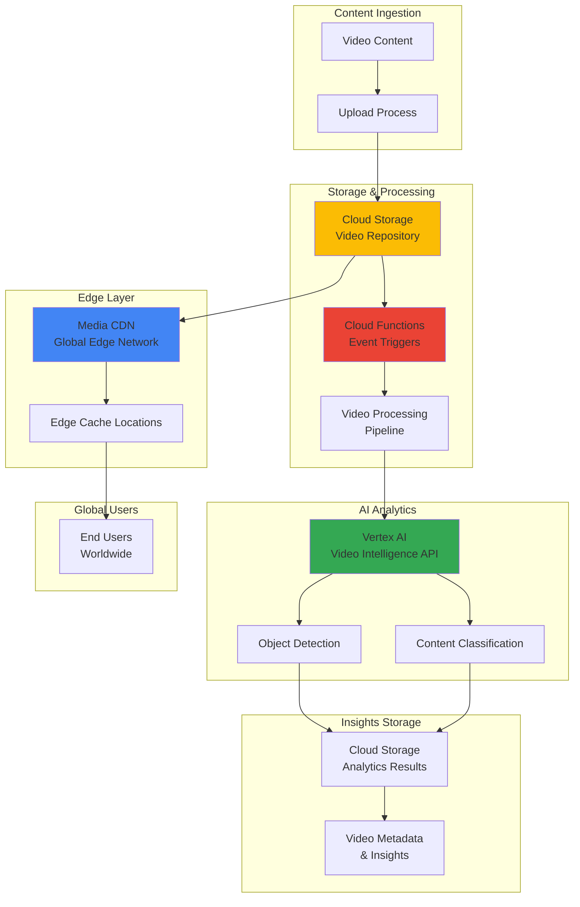

# Edge-to-Cloud Video Analytics with Media CDN and Vertex AI

## Problem

Media companies and content creators face the challenge of efficiently processing and analyzing massive volumes of streaming video content while delivering high-quality experiences to global audiences. Traditional video processing workflows often create bottlenecks between content ingestion, AI-powered analysis, and content delivery, resulting in delayed insights, increased latency for end users, and inefficient resource utilization. Without automated edge-to-cloud analytics pipelines, organizations struggle to extract real-time value from their video content while maintaining optimal performance for viewers worldwide.

## Solution

This solution leverages Google Cloud's Media CDN for global edge distribution combined with Vertex AI's powerful video analytics capabilities to create an intelligent, automated video processing pipeline. The architecture uses Cloud Storage as the central repository, Cloud Functions for event-driven processing triggers, and Vertex AI Video Intelligence API for sophisticated object detection and content classification. This integrated approach enables real-time video analysis at scale while ensuring optimal content delivery performance through Google's global edge network infrastructure.

## Architecture Diagram



## Prerequisites

1. Google Cloud Project with billing enabled and appropriate IAM permissions for Media CDN, Vertex AI, Cloud Functions, and Cloud Storage
2. Google Cloud CLI (gcloud) installed and configured or Cloud Shell access
3. Basic knowledge of video processing concepts and AI/ML workflows
4. Understanding of serverless functions and event-driven architectures
5. Estimated cost: $50-200 for testing (varies by video processing volume and CDN usage)

> **Note**: Media CDN requires approval from Google Cloud sales. Contact your account team to request access before starting this recipe.

## Preparation

```bash
# Set environment variables for GCP resources
export PROJECT_ID="video-analytics-$(date +%s)"
export REGION="us-central1"
export ZONE="us-central1-a"

# Generate unique suffix for resource names
RANDOM_SUFFIX=$(openssl rand -hex 3)

# Set default project and region
gcloud config set project ${PROJECT_ID}
gcloud config set compute/region ${REGION}
gcloud config set compute/zone ${ZONE}

# Enable required APIs
gcloud services enable storage.googleapis.com
gcloud services enable cloudfunctions.googleapis.com
gcloud services enable aiplatform.googleapis.com
gcloud services enable videointelligence.googleapis.com
gcloud services enable networkservices.googleapis.com
gcloud services enable certificatemanager.googleapis.com
gcloud services enable eventarc.googleapis.com

echo "✅ Project configured: ${PROJECT_ID}"

# Create resource names with unique suffixes
export BUCKET_NAME="video-content-${RANDOM_SUFFIX}"
export RESULTS_BUCKET="analytics-results-${RANDOM_SUFFIX}"
export FUNCTION_NAME="video-processor-${RANDOM_SUFFIX}"
export CDN_SERVICE_NAME="media-cdn-${RANDOM_SUFFIX}"

echo "✅ Resource names generated with suffix: ${RANDOM_SUFFIX}"
```

## Steps

1. **Create Cloud Storage Buckets for Video Content and Analytics Results**:

   Google Cloud Storage provides the foundational infrastructure for storing video content and analytics results. The primary bucket serves as both the origin for Media CDN distribution and the trigger point for automated processing. Creating separate buckets for raw content and processed results enables better organization and access control while supporting both high-throughput streaming and analytical workloads.

   ```bash
   # Create primary video content bucket
   gsutil mb -p ${PROJECT_ID} \
       -c STANDARD \
       -l ${REGION} \
       gs://${BUCKET_NAME}
   
   # Create analytics results bucket
   gsutil mb -p ${PROJECT_ID} \
       -c STANDARD \
       -l ${REGION} \
       gs://${RESULTS_BUCKET}
   
   # Enable versioning for data protection
   gsutil versioning set on gs://${BUCKET_NAME}
   gsutil versioning set on gs://${RESULTS_BUCKET}
   
   echo "✅ Storage buckets created successfully"
   echo "Video Content Bucket: gs://${BUCKET_NAME}"
   echo "Analytics Results Bucket: gs://${RESULTS_BUCKET}"
   ```

   The storage buckets now provide scalable, durable storage with automatic encryption and versioning enabled. This foundation supports both the real-time streaming requirements of Media CDN and the batch processing needs of Vertex AI analytics workflows.

2. **Deploy Cloud Function for Automated Video Processing Triggers**:

   Cloud Functions provides event-driven processing that automatically responds to new video uploads in Cloud Storage. The function serves as the orchestration layer, triggering Vertex AI Video Intelligence API workflows whenever new content is available. This serverless approach ensures scalable, cost-effective processing that only consumes resources when videos require analysis.

   ```bash
   # Create function source directory
   mkdir -p video-processor-function
   cd video-processor-function
   
   # Create main function code
   cat > main.py << 'EOF'
import os
import json
from google.cloud import videointelligence
from google.cloud import storage
import logging

def process_video(cloud_event):
    """Triggered by Cloud Storage object upload."""
    
    # Parse the Cloud Storage event
    file_name = cloud_event.data["name"]
    bucket_name = cloud_event.data["bucket"]
    
    # Skip if not a video file
    video_extensions = ('.mp4', '.mov', '.avi', '.mkv', '.webm')
    if not file_name.lower().endswith(video_extensions):
        print(f"Skipping non-video file: {file_name}")
        return {"status": "skipped", "reason": "not a video file"}
    
    print(f"Processing video: {file_name} from bucket: {bucket_name}")
    
    # Initialize Video Intelligence client
    video_client = videointelligence.VideoIntelligenceServiceClient()
    video_uri = f"gs://{bucket_name}/{file_name}"
    
    # Configure analysis features
    features = [
        videointelligence.Feature.OBJECT_TRACKING,
        videointelligence.Feature.LABEL_DETECTION,
        videointelligence.Feature.SHOT_CHANGE_DETECTION,
        videointelligence.Feature.TEXT_DETECTION
    ]
    
    # Configure analysis settings
    config = videointelligence.VideoContext(
        object_tracking_config=videointelligence.ObjectTrackingConfig(
            model="builtin/latest"
        ),
        label_detection_config=videointelligence.LabelDetectionConfig(
            model="builtin/latest",
            label_detection_mode=videointelligence.LabelDetectionMode.SHOT_AND_FRAME_MODE
        )
    )
    
    # Start video analysis operation
    operation = video_client.annotate_video(
        request={
            "features": features,
            "input_uri": video_uri,
            "video_context": config,
            "output_uri": f"gs://{os.environ.get('RESULTS_BUCKET')}/analysis/{file_name}_analysis.json"
        }
    )
    
    # Store analysis metadata
    storage_client = storage.Client()
    results_bucket = storage_client.bucket(os.environ.get('RESULTS_BUCKET'))
    
    analysis_metadata = {
        "video_uri": video_uri,
        "file_name": file_name,
        "operation_name": operation.operation.name,
        "features_analyzed": [feature.name for feature in features],
        "status": "processing",
        "timestamp": cloud_event.time
    }
    
    metadata_blob = results_bucket.blob(f"operations/{file_name}_metadata.json")
    metadata_blob.upload_from_string(json.dumps(analysis_metadata, indent=2))
    
    print(f"✅ Video processing initiated for: {file_name}")
    
    return {
        "status": "analysis_started",
        "operation_name": operation.operation.name,
        "video_uri": video_uri
    }
EOF
   
   # Create requirements.txt with updated versions
   cat > requirements.txt << 'EOF'
google-cloud-videointelligence==2.13.5
google-cloud-storage==2.17.0
functions-framework==3.8.1
EOF
   
   # Deploy the Cloud Function with Gen 2
   gcloud functions deploy ${FUNCTION_NAME} \
       --gen2 \
       --runtime python311 \
       --trigger-bucket ${BUCKET_NAME} \
       --entry-point process_video \
       --memory 1024MB \
       --timeout 540s \
       --region ${REGION} \
       --set-env-vars PROJECT_ID=${PROJECT_ID},REGION=${REGION},RESULTS_BUCKET=${RESULTS_BUCKET}
   
   cd ..
   
   echo "✅ Cloud Function deployed with Cloud Storage trigger"
   echo "Function Name: ${FUNCTION_NAME}"
   ```

   The Cloud Function now automatically processes new video uploads with built-in error handling and metadata tracking. This serverless architecture provides reliable, scalable event processing while maintaining cost efficiency through pay-per-invocation pricing.

3. **Create EdgeCacheOrigin for Media CDN Configuration**:

   Media CDN leverages Google's global edge network with over 100Tbps of capacity to deliver video content with minimal latency. The EdgeCacheOrigin configuration defines how content is cached, routed, and delivered from edge locations worldwide. This setup enables cache hit ratios of 98.5-99% for video-on-demand content while providing origin protection and advanced routing capabilities.

   ```bash
   # Create EdgeCacheOrigin for Cloud Storage
   gcloud network-services edge-cache-origins create ${CDN_SERVICE_NAME}-origin \
       --origin-address="storage.googleapis.com" \
       --description="Origin for video content storage bucket" \
       --region=${REGION}
   
   # Create EdgeCacheService
   gcloud network-services edge-cache-services create ${CDN_SERVICE_NAME} \
       --description="Edge cache service for video analytics pipeline" \
       --region=${REGION}
   
   echo "✅ Media CDN EdgeCacheOrigin created"
   echo "Origin: ${CDN_SERVICE_NAME}-origin"
   echo "Service: ${CDN_SERVICE_NAME}"
   
   # Note: Complete Media CDN configuration requires additional
   # setup through Google Cloud Console or REST API
   # for advanced routing and caching policies
   echo ""
   echo "⚠️  Complete Media CDN setup in Google Cloud Console:"
   echo "   1. Navigate to Network Services > Media CDN"
   echo "   2. Configure EdgeCacheService with routing rules"
   echo "   3. Set up custom domain and SSL certificates"
   echo "   4. Configure cache policies for optimal performance"
   ```

   The Media CDN configuration establishes the foundation for global content delivery with intelligent caching and routing. This infrastructure reduces origin load while ensuring optimal performance for users accessing video content from any geographic location.

4. **Configure Automated Analytics Results Processing**:

   This step creates a comprehensive results processing pipeline that monitors Vertex AI analysis operations and processes completed analytics results. The system automatically organizes insights, generates summaries, and creates searchable metadata for video content analytics.

   ```bash
   # Create results processing function
   mkdir -p results-processor
   cd results-processor
   
   cat > main.py << 'EOF'
import json
import os
from google.cloud import storage
import logging

def process_analytics_results(cloud_event):
    """Process completed video analytics results."""
    
    file_name = cloud_event.data["name"]
    bucket_name = cloud_event.data["bucket"]
    
    # Only process analysis result files
    if not file_name.endswith('_analysis.json'):
        return {"status": "skipped", "reason": "not an analysis result"}
    
    logging.info(f"Processing analytics results: {file_name}")
    
    # Download and parse analysis results
    storage_client = storage.Client()
    bucket = storage_client.bucket(bucket_name)
    blob = bucket.blob(file_name)
    
    try:
        analysis_data = json.loads(blob.download_as_text())
        
        # Extract key insights
        insights = {
            "video_file": file_name.replace('_analysis.json', ''),
            "processing_timestamp": cloud_event.time,
            "objects_detected": [],
            "labels_detected": [],
            "text_detected": [],
            "shots_detected": 0
        }
        
        # Process object tracking results
        if 'object_annotations' in analysis_data:
            for obj in analysis_data['object_annotations']:
                insights['objects_detected'].append({
                    "entity": obj.get('entity', {}).get('description', 'Unknown'),
                    "confidence": obj.get('confidence', 0),
                    "track_count": len(obj.get('frames', []))
                })
        
        # Process label detection results
        if 'label_annotations' in analysis_data:
            for label in analysis_data['label_annotations']:
                insights['labels_detected'].append({
                    "description": label.get('entity', {}).get('description', 'Unknown'),
                    "confidence": label.get('category_entities', [{}])[0].get('description', 'N/A') if label.get('category_entities') else 'N/A'
                })
        
        # Process shot detection
        if 'shot_annotations' in analysis_data:
            insights['shots_detected'] = len(analysis_data['shot_annotations'])
        
        # Store processed insights
        insights_blob = bucket.blob(f"insights/{insights['video_file']}_insights.json")
        insights_blob.upload_from_string(json.dumps(insights, indent=2))
        
        # Create summary report
        summary = {
            "total_objects": len(insights['objects_detected']),
            "total_labels": len(insights['labels_detected']),
            "total_shots": insights['shots_detected'],
            "top_objects": sorted(insights['objects_detected'], 
                                key=lambda x: x['confidence'], reverse=True)[:5],
            "top_labels": sorted(insights['labels_detected'], 
                               key=lambda x: len(x['description']), reverse=True)[:5]
        }
        
        summary_blob = bucket.blob(f"summaries/{insights['video_file']}_summary.json")
        summary_blob.upload_from_string(json.dumps(summary, indent=2))
        
        print(f"✅ Processed analytics for: {insights['video_file']}")
        print(f"   Objects detected: {summary['total_objects']}")
        print(f"   Labels detected: {summary['total_labels']}")
        print(f"   Shots detected: {summary['total_shots']}")
        
        return {"status": "success", "insights": summary}
        
    except Exception as e:
        logging.error(f"Error processing analytics results: {str(e)}")
        return {"status": "error", "error": str(e)}
EOF
   
   cat > requirements.txt << 'EOF'
google-cloud-storage==2.17.0
functions-framework==3.8.1
EOF
   
   # Deploy results processing function
   gcloud functions deploy results-processor-${RANDOM_SUFFIX} \
       --gen2 \
       --runtime python311 \
       --trigger-bucket ${RESULTS_BUCKET} \
       --entry-point process_analytics_results \
       --memory 512MB \
       --timeout 300s \
       --region ${REGION} \
       --set-env-vars PROJECT_ID=${PROJECT_ID},REGION=${REGION}
   
   cd ..
   
   echo "✅ Analytics results processing function deployed"
   ```

   The results processing pipeline now automatically organizes and summarizes video analytics insights, creating searchable metadata and summary reports. This automation ensures that analytics results are immediately available for further analysis and decision-making.

## Validation & Testing

1. **Upload a test video and verify end-to-end processing**:

   ```bash
   # Create a small test video file or download a sample
   echo "Uploading test video to trigger the analytics pipeline..."
   
   # Upload test video (replace with actual video file)
   # Note: Use a real video file for actual testing
   echo "Please upload a video file to test the pipeline:"
   echo "gsutil cp your-test-video.mp4 gs://${BUCKET_NAME}/test-videos/"
   
   echo "✅ Upload command provided for test video"
   ```

   Expected output: Video upload triggers Cloud Function processing and initiates Vertex AI analysis.

2. **Monitor Cloud Function execution and analytics processing**:

   ```bash
   # Check Cloud Function logs
   gcloud functions logs read ${FUNCTION_NAME} \
       --gen2 \
       --region ${REGION} \
       --limit 50 \
       --format="table(timestamp,severity,textPayload)"
   
   # Check results processing function logs
   gcloud functions logs read results-processor-${RANDOM_SUFFIX} \
       --gen2 \
       --region ${REGION} \
       --limit 50 \
       --format="table(timestamp,severity,textPayload)"
   ```

   Expected output: Function execution logs showing successful video processing initiation.

3. **Verify analytics results and insights generation**:

   ```bash
   # List generated analytics results
   gsutil ls gs://${RESULTS_BUCKET}/analysis/
   gsutil ls gs://${RESULTS_BUCKET}/insights/
   gsutil ls gs://${RESULTS_BUCKET}/summaries/
   
   # View sample insights (if available)
   echo "Sample insights files:"
   gsutil ls gs://${RESULTS_BUCKET}/insights/*.json | head -1 | \
       xargs gsutil cat 2>/dev/null || echo "No insights files found yet"
   ```

   Expected output: JSON files containing video analytics results, insights, and summaries.

4. **Test Media CDN configuration status**:

   ```bash
   # Check EdgeCacheOrigin and EdgeCacheService status
   gcloud network-services edge-cache-origins list \
       --region=${REGION}
   
   gcloud network-services edge-cache-services list \
       --region=${REGION}
   
   # Test video accessibility through storage
   gsutil ls -l gs://${BUCKET_NAME}/
   
   echo "📊 Media CDN Performance Test:"
   echo "Configure routing rules in Cloud Console to complete CDN setup"
   echo "Monitor cache hit ratios in Cloud Console > Network Services > Media CDN"
   ```

## Cleanup

1. **Delete Cloud Functions and remove triggers**:

   ```bash
   # Delete all created Cloud Functions
   gcloud functions delete ${FUNCTION_NAME} \
       --gen2 \
       --region ${REGION} \
       --quiet
   
   gcloud functions delete results-processor-${RANDOM_SUFFIX} \
       --gen2 \
       --region ${REGION} \
       --quiet
   
   echo "✅ Cloud Functions deleted"
   ```

2. **Remove Media CDN configuration**:

   ```bash
   # Remove Media CDN edge cache service and origin
   gcloud network-services edge-cache-services delete ${CDN_SERVICE_NAME} \
       --region=${REGION} \
       --quiet
   
   gcloud network-services edge-cache-origins delete ${CDN_SERVICE_NAME}-origin \
       --region=${REGION} \
       --quiet
   
   echo "✅ Media CDN resources cleaned up"
   ```

3. **Remove Cloud Storage buckets and all content**:

   ```bash
   # Remove all bucket contents and buckets
   gsutil -m rm -r gs://${BUCKET_NAME}
   gsutil -m rm -r gs://${RESULTS_BUCKET}
   
   echo "✅ Storage buckets and content deleted"
   ```

4. **Clean up environment variables**:

   ```bash
   # Unset environment variables
   unset PROJECT_ID REGION ZONE RANDOM_SUFFIX
   unset BUCKET_NAME RESULTS_BUCKET FUNCTION_NAME CDN_SERVICE_NAME
   
   echo "✅ Environment variables cleaned up"
   ```

## Discussion

This recipe demonstrates how to orchestrate an intelligent edge-to-cloud video analytics pipeline that combines Google Cloud's Media CDN global distribution capabilities with Vertex AI's Video Intelligence API for advanced video analysis. The architecture leverages Cloud Storage as the central data repository, Cloud Functions for event-driven automation, and the Video Intelligence API for sophisticated content analysis including object detection, label detection, and content classification.

The solution addresses the growing need for automated video content analysis at scale while maintaining optimal delivery performance for global audiences. Media CDN's edge caching capabilities, with over 100Tbps of global capacity and cache hit ratios averaging 98.5-99% for video-on-demand content, ensure that video content is delivered with minimal latency worldwide. Meanwhile, Vertex AI's Video Intelligence API provides accurate object detection, activity recognition, and content classification without requiring custom model development.

The event-driven architecture using Cloud Functions creates a seamless automation pipeline that processes videos as soon as they're uploaded to Cloud Storage. This serverless approach ensures cost-effective scaling, as resources are only consumed during actual processing operations. The integration with Video Intelligence API enables sophisticated analysis capabilities including object tracking, label detection, shot change detection, and text recognition, providing comprehensive insights into video content.

One of the key architectural decisions involves separating content storage from analytics results storage, which enables different access patterns and security policies for each data type. The pipeline also implements comprehensive metadata tracking and results processing, creating searchable insights and summary reports that make analytics results immediately actionable for content creators and media organizations. The use of Cloud Functions Gen 2 provides improved performance, better scaling characteristics, and enhanced event handling for the video processing workflow.

> **Note**: This architecture follows Google Cloud's Well-Architected Framework principles, emphasizing operational excellence, security, reliability, and cost optimization. For production deployments, consider implementing additional monitoring, alerting, and security controls. See the [Google Cloud Architecture Center](https://cloud.google.com/architecture) for advanced patterns and best practices.

## Challenge

Extend this intelligent video analytics solution by implementing these enhancements:

1. **Real-time Live Stream Analytics**: Integrate the Video Intelligence Streaming API to analyze live video streams in real-time, enabling immediate content moderation and dynamic ad insertion based on detected content.

2. **Custom ML Model Integration**: Develop and deploy custom Vertex AI models trained on domain-specific video content, such as sports highlight detection or brand logo recognition, using AutoML Video or custom training pipelines.

3. **Multi-modal Content Analysis**: Enhance the pipeline to include audio analysis using Speech-to-Text API and Natural Language AI for transcript analysis, creating comprehensive multimedia content insights.

4. **Intelligent Content Recommendations**: Build a recommendation engine using the analytics results and Vertex AI Matching Engine to suggest related content based on detected objects, activities, and themes.

5. **Advanced Security and Compliance**: Implement Cloud DLP (Data Loss Prevention) for sensitive content detection, add digital watermarking for content protection, and integrate with Cloud Security Command Center for comprehensive security monitoring.

## Infrastructure Code

*Infrastructure code will be generated after recipe approval.*