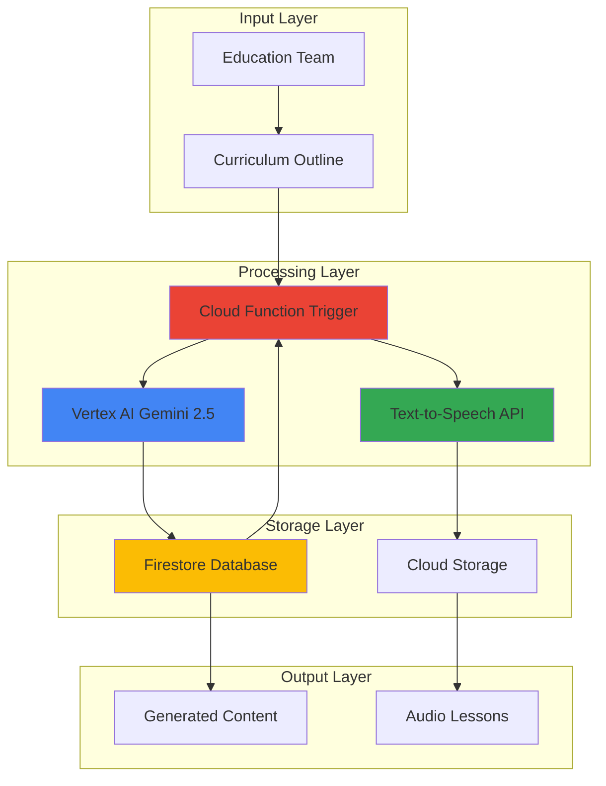

# Educational Content Generation with Gemini and Text-to-Speech

## Problem

Educational institutions and e-learning platforms struggle to create comprehensive, accessible content at scale from curriculum outlines. Manual content creation is time-consuming, expensive, and often lacks consistency in quality and audio accessibility features. Traditional approaches fail to provide both engaging text materials and natural-sounding audio lessons that accommodate different learning styles and accessibility needs.

## Solution

Leverage Vertex AI's Gemini 2.5 Flash model to automatically generate detailed educational content from curriculum outlines, convert the generated text to natural-sounding audio using Google's Text-to-Speech API with high-quality voices, and orchestrate the entire workflow using Cloud Functions with Firestore for content lifecycle management. This serverless architecture scales automatically while maintaining cost efficiency.

## Architecture Diagram



## Prerequisites

1. Google Cloud account with billing enabled and necessary API permissions
2. Google Cloud SDK installed and configured (or access to Cloud Shell)
3. Basic understanding of serverless architecture and NoSQL databases
4. Familiarity with JSON data structures and API concepts
5. Estimated cost: $5-15 for testing (based on content generation volume and audio synthesis)

> **Note**: Gemini 2.5 Flash offers the best price-performance ratio for content generation with dynamic reasoning capabilities, while Google's Text-to-Speech API provides broadcast-quality audio output with over 380 voices across 50+ languages.

## Preparation

```bash
# Set environment variables for GCP resources
export PROJECT_ID="edu-content-gen-$(date +%s)"
export REGION="us-central1"
export ZONE="us-central1-a"

# Generate unique suffix for resource names
RANDOM_SUFFIX=$(openssl rand -hex 3)
export FUNCTION_NAME="content-generator-${RANDOM_SUFFIX}"
export BUCKET_NAME="edu-audio-content-${RANDOM_SUFFIX}"
export FIRESTORE_COLLECTION="educational_content"

# Set default project and region
gcloud config set project ${PROJECT_ID}
gcloud config set compute/region ${REGION}
gcloud config set functions/region ${REGION}

# Enable required APIs
gcloud services enable cloudfunctions.googleapis.com
gcloud services enable aiplatform.googleapis.com
gcloud services enable texttospeech.googleapis.com
gcloud services enable firestore.googleapis.com
gcloud services enable storage-api.googleapis.com

echo "✅ Project configured: ${PROJECT_ID}"
echo "✅ APIs enabled for content generation pipeline"
```

## Steps

1. **Create Firestore Database for Content Management**:

   Firestore provides a serverless, NoSQL document database that automatically scales with real-time synchronization capabilities. Setting up Firestore in Native mode enables advanced querying features and seamless integration with Cloud Functions for event-driven content processing workflows.

   ```bash
   # Create Firestore database in Native mode
   gcloud firestore databases create \
       --location=${REGION} \
       --type=firestore-native
   
   echo "✅ Firestore database created successfully"
   ```

   The Firestore database is now ready to store curriculum outlines, generated content, and processing metadata with automatic scaling and real-time synchronization across all connected services.

2. **Create Cloud Storage Bucket for Audio Files**:

   Cloud Storage provides unified object storage with global edge caching for audio file distribution. Configuring the bucket with appropriate location and access controls ensures optimal performance for serving educational audio content worldwide.

   ```bash
   # Create Cloud Storage bucket for audio files
   gsutil mb -p ${PROJECT_ID} \
       -c STANDARD \
       -l ${REGION} \
       gs://${BUCKET_NAME}
   
   # Configure bucket for public read access (for educational content distribution)
   gsutil iam ch allUsers:objectViewer gs://${BUCKET_NAME}
   
   echo "✅ Storage bucket created: ${BUCKET_NAME}"
   ```

   The storage bucket now provides scalable, cost-effective storage for generated audio files with global distribution capabilities through Google's edge network.

3. **Create Python Function for Content Generation**:

   Cloud Functions provides serverless compute that automatically scales based on request volume. Creating the function code that integrates Vertex AI Gemini for content generation and Text-to-Speech for audio synthesis enables automated processing without infrastructure management.

   ```bash
   # Create function directory and main Python file
   mkdir -p ${FUNCTION_NAME}
   cd ${FUNCTION_NAME}
   
   cat > main.py << 'EOF'
import functions_framework
import json
import os
from google.cloud import aiplatform
from google.cloud import texttospeech
from google.cloud import firestore
from google.cloud import storage
import vertexai
from vertexai.generative_models import GenerativeModel

# Initialize clients
db = firestore.Client()
tts_client = texttospeech.TextToSpeechClient()
storage_client = storage.Client()

@functions_framework.http
def generate_content(request):
    """Generate educational content from curriculum outline."""
    
    # Parse request
    request_json = request.get_json()
    outline = request_json.get('outline', '')
    topic = request_json.get('topic', 'Educational Content')
    voice_name = request_json.get('voice_name', 'en-US-Studio-M')
    
    if not outline:
        return {'error': 'Curriculum outline is required'}, 400
    
    try:
        # Initialize Vertex AI
        vertexai.init(project=os.environ.get('GCP_PROJECT'))
        model = GenerativeModel('gemini-2.5-flash')
        
        # Generate educational content using Gemini
        prompt = f"""
        Create comprehensive educational content based on this curriculum outline:
        
        {outline}
        
        Generate:
        1. A detailed lesson plan (200-300 words)
        2. Key learning objectives (3-5 bullet points)
        3. Explanatory content suitable for audio narration (400-500 words)
        4. Practice questions (3-5 questions)
        
        Format the response as structured, educational content that flows naturally when read aloud.
        Focus on clarity, engagement, and pedagogical best practices.
        """
        
        response = model.generate_content(prompt)
        generated_content = response.text
        
        # Store content in Firestore
        doc_ref = db.collection('educational_content').add({
            'topic': topic,
            'outline': outline,
            'generated_content': generated_content,
            'timestamp': firestore.SERVER_TIMESTAMP,
            'status': 'content_generated'
        })[1]
        
        # Generate audio using Text-to-Speech
        synthesis_input = texttospeech.SynthesisInput(text=generated_content)
        voice = texttospeech.VoiceSelectionParams(
            language_code='en-US',
            name=voice_name
        )
        audio_config = texttospeech.AudioConfig(
            audio_encoding=texttospeech.AudioEncoding.MP3,
            speaking_rate=0.9,
            pitch=0.0
        )
        
        tts_response = tts_client.synthesize_speech(
            input=synthesis_input,
            voice=voice,
            audio_config=audio_config
        )
        
        # Upload audio to Cloud Storage
        bucket_name = os.environ.get('BUCKET_NAME')
        bucket = storage_client.bucket(bucket_name)
        audio_filename = f"lessons/{doc_ref.id}.mp3"
        blob = bucket.blob(audio_filename)
        blob.upload_from_string(tts_response.audio_content, content_type='audio/mpeg')
        
        # Update Firestore with audio URL
        doc_ref.update({
            'audio_url': f"gs://{bucket_name}/{audio_filename}",
            'status': 'completed'
        })
        
        return {
            'status': 'success',
            'document_id': doc_ref.id,
            'content_preview': generated_content[:200] + '...',
            'audio_url': f"gs://{bucket_name}/{audio_filename}"
        }
        
    except Exception as e:
        return {'error': str(e)}, 500
EOF
   
   echo "✅ Function code created successfully"
   ```

   The function integrates multiple Google Cloud AI services to create a complete content generation pipeline with automatic error handling and status tracking.

4. **Create Requirements File for Dependencies**:

   Python dependencies define the required libraries for AI model interaction, cloud service integration, and serverless function execution. Managing dependencies properly ensures consistent behavior and optimal cold start performance.

   ```bash
   cat > requirements.txt << 'EOF'
functions-framework==3.9.1
google-cloud-aiplatform==1.105.0
google-cloud-texttospeech==2.27.0
google-cloud-firestore==2.18.0
google-cloud-storage==2.18.2
EOF
   
   echo "✅ Requirements file created"
   ```

   The dependencies are optimized for serverless execution with the latest stable versions of Google Cloud client libraries.

5. **Deploy Cloud Function with Environment Variables**:

   Deploying the Cloud Function with proper environment variables and resource allocation ensures optimal performance for AI workloads. The function automatically scales based on request volume while maintaining cost efficiency through pay-per-invocation pricing.

   ```bash
   # Deploy Cloud Function with required environment variables
   gcloud functions deploy ${FUNCTION_NAME} \
       --runtime python311 \
       --trigger-http \
       --source . \
       --entry-point generate_content \
       --memory 1024MB \
       --timeout 540s \
       --set-env-vars GCP_PROJECT=${PROJECT_ID},BUCKET_NAME=${BUCKET_NAME} \
       --allow-unauthenticated
   
   # Get function URL
   FUNCTION_URL=$(gcloud functions describe ${FUNCTION_NAME} \
       --format="value(httpsTrigger.url)")
   
   echo "✅ Cloud Function deployed successfully"
   echo "Function URL: ${FUNCTION_URL}"
   ```

   The Cloud Function is now deployed with sufficient memory and timeout for AI model inference and audio synthesis, enabling automated content generation at scale.

6. **Create Sample Educational Content Request**:

   Testing the content generation pipeline with realistic curriculum data validates the integration between Gemini AI, Text-to-Speech, and Firestore. This demonstrates the complete workflow from curriculum outline to generated audio lessons.

   ```bash
   # Create sample curriculum outline
   cat > sample_request.json << 'EOF'
{
  "topic": "Introduction to Climate Science",
  "outline": "1. What is climate vs weather? 2. Greenhouse effect basics 3. Human impact on climate 4. Climate change evidence 5. Mitigation strategies",
  "voice_name": "en-US-Studio-M"
}
EOF
   
   # Test content generation
   curl -X POST "${FUNCTION_URL}" \
       -H "Content-Type: application/json" \
       -d @sample_request.json \
       | jq '.'
   
   echo "✅ Sample content generation request sent"
   ```

   The request demonstrates how educational teams can submit curriculum outlines and receive comprehensive, audio-enabled learning materials automatically.

## Validation & Testing

1. **Verify Firestore Document Creation**:

   ```bash
   # Check Firestore for generated content
   gcloud firestore query \
       --collection-group=educational_content \
       --filter="status==completed" \
       --limit=5
   ```

   Expected output: JSON documents showing generated educational content with timestamps and status information.

2. **Test Audio File Generation**:

   ```bash
   # List generated audio files
   gsutil ls gs://${BUCKET_NAME}/lessons/
   
   # Download and verify audio file (optional)
   AUDIO_FILE=$(gsutil ls gs://${BUCKET_NAME}/lessons/ | head -1)
   echo "Generated audio file: ${AUDIO_FILE}"
   ```

3. **Validate Content Quality**:

   ```bash
   # Test with different curriculum topics
   cat > advanced_request.json << 'EOF'
{
  "topic": "Advanced Mathematics: Calculus Fundamentals",
  "outline": "1. Limits and continuity 2. Derivatives and applications 3. Integration techniques 4. Fundamental theorem of calculus 5. Real-world applications",
  "voice_name": "en-US-Studio-F"
}
EOF
   
   curl -X POST "${FUNCTION_URL}" \
       -H "Content-Type: application/json" \
       -d @advanced_request.json \
       | jq '.content_preview'
   ```

## Cleanup

1. **Remove Cloud Function**:

   ```bash
   # Delete Cloud Function
   gcloud functions delete ${FUNCTION_NAME} \
       --region=${REGION} \
       --quiet
   
   echo "✅ Cloud Function deleted"
   ```

2. **Remove Storage Bucket and Contents**:

   ```bash
   # Remove storage bucket and all contents
   gsutil -m rm -r gs://${BUCKET_NAME}
   
   echo "✅ Storage bucket deleted"
   ```

3. **Clean Up Firestore Data**:

   ```bash
   # Note: Firestore deletion requires manual cleanup via console
   # or programmatic deletion of individual documents
   echo "⚠️  Manually delete Firestore documents via Google Cloud Console"
   echo "Navigate to Firestore > Data > educational_content collection"
   ```

4. **Remove Project Resources**:

   ```bash
   # Clean up environment variables
   unset PROJECT_ID REGION FUNCTION_NAME BUCKET_NAME FIRESTORE_COLLECTION
   
   echo "✅ Environment variables cleaned up"
   echo "Note: Consider deleting the entire project if created specifically for this recipe"
   ```

## Discussion

This solution demonstrates the power of combining Google Cloud's AI and serverless technologies to automate educational content creation at scale. Vertex AI's Gemini 2.5 Flash model provides state-of-the-art natural language generation capabilities with dynamic reasoning features that automatically adjust processing time based on query complexity, while maintaining superior price-performance efficiency. The model's enhanced thinking capabilities and improved multimodal understanding make it particularly well-suited for creating structured, pedagogically sound educational materials that engage students effectively.

The Text-to-Speech integration using Google's advanced neural voices represents a significant advancement in audio quality for educational applications. With 380+ voices across 50+ languages and enhanced SSML support, the system can create natural-sounding audio lessons that accommodate diverse learning preferences and accessibility requirements. The Studio voices are specifically designed for broadcast-quality content, making them ideal for professional educational audio production with subtle nuances like emotional expression and natural speech patterns.

Cloud Functions provides the serverless orchestration layer that eliminates infrastructure management while automatically scaling based on content generation demand. The event-driven architecture ensures cost optimization by only consuming resources during active content generation, making it suitable for educational institutions with varying workload patterns. Firestore's real-time synchronization capabilities enable collaborative content development workflows where multiple educators can track content generation progress in real-time, facilitating team-based educational content development.

The architectural pattern established here follows Google Cloud's Well-Architected Framework principles, particularly around operational excellence and cost optimization. The serverless approach reduces operational overhead while the pay-per-use pricing model aligns costs directly with educational content production needs. Additionally, the system's modular design allows for easy integration with existing learning management systems and content delivery networks, ensuring seamless adoption in diverse educational environments.

> **Tip**: Consider implementing content caching strategies using Cloud CDN for globally distributed educational content delivery, and explore Firestore's vector search capabilities for building intelligent content recommendation systems based on student learning patterns.

**Documentation Sources:**
- [Vertex AI Gemini 2.5 Flash Documentation](https://cloud.google.com/vertex-ai/generative-ai/docs/models/gemini/2-5-flash)
- [Cloud Text-to-Speech API Features](https://cloud.google.com/text-to-speech/docs/ssml)
- [Cloud Functions Best Practices](https://cloud.google.com/functions/docs/bestpractices/tips)
- [Firestore Real-time Database Documentation](https://cloud.google.com/firestore/docs/overview)
- [Google Cloud Architecture Framework](https://cloud.google.com/architecture/framework)

## Challenge

Extend this educational content generation solution by implementing these enhancements:

1. **Multi-language Content Generation**: Integrate Cloud Translation API to automatically generate content in multiple languages with corresponding localized Text-to-Speech voices, supporting global educational initiatives and diverse student populations.

2. **Interactive Assessment Integration**: Use Vertex AI to generate adaptive quizzes and assessments based on the curriculum content, with automatic grading and personalized feedback mechanisms that adjust difficulty based on student performance.

3. **Content Personalization Engine**: Implement learning analytics using BigQuery and Vertex AI to analyze student engagement patterns and automatically adjust content complexity and presentation style based on individual learning preferences and performance data.

4. **Video Content Generation**: Integrate with Vertex AI's multimodal capabilities to generate educational video scripts and combine with automated video creation services for comprehensive multimedia learning experiences.

5. **Intelligent Content Optimization**: Build feedback loops using Cloud Monitoring and Vertex AI to analyze content effectiveness metrics and automatically refine generation prompts for improved educational outcomes based on student engagement and comprehension data.

## Infrastructure Code

*Infrastructure code will be generated after recipe approval.*