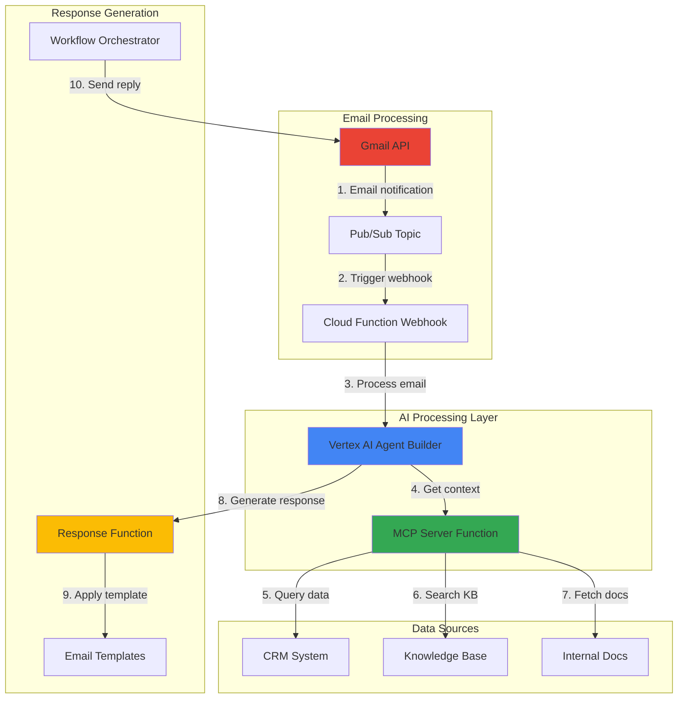

# Email Automation with Vertex AI Agent Builder and MCP

## Problem

Organizations receive hundreds of emails daily requiring manual categorization, prioritization, and responses with contextual information from multiple enterprise systems. Customer service teams struggle to provide timely, accurate responses while accessing CRM data, knowledge bases, and internal documentation. This manual process leads to delayed responses, inconsistent information, and decreased customer satisfaction, costing businesses an average of 3-4 hours per day per support agent.

## Solution

Build an intelligent email automation system using Vertex AI Agent Builder with Model Context Protocol (MCP) integration to automatically categorize incoming emails, prioritize them based on urgency, and generate contextual responses. The solution leverages Cloud Functions for serverless processing, Gmail API for email operations, and MCP to connect with enterprise data sources, enabling real-time access to customer information and knowledge bases for faster, more accurate customer service.

## Architecture Diagram



## Prerequisites

1. Google Cloud account with Vertex AI, Cloud Functions, Gmail API, and Pub/Sub enabled
2. Google Cloud CLI installed and configured (or Cloud Shell)
3. Basic knowledge of serverless functions and AI agents
4. Gmail workspace with API access permissions
5. Python 3.11+ development environment
6. Estimated cost: $20-35 for development and testing (includes AI model usage, function execution, and Pub/Sub messaging)

> **Note**: This recipe requires Gmail API access which may need workspace administrator approval in enterprise environments. MCP requires additional setup for enterprise data source integration.

## Preparation

```bash
# Set environment variables for GCP resources
export PROJECT_ID="email-automation-$(date +%s)"
export REGION="us-central1"
export ZONE="us-central1-a"

# Generate unique suffix for resource names
RANDOM_SUFFIX=$(openssl rand -hex 3)

# Set default project and region
gcloud config set project ${PROJECT_ID}
gcloud config set compute/region ${REGION}
gcloud config set compute/zone ${ZONE}

# Enable required APIs
gcloud services enable aiplatform.googleapis.com
gcloud services enable cloudfunctions.googleapis.com
gcloud services enable gmail.googleapis.com
gcloud services enable secretmanager.googleapis.com
gcloud services enable cloudresourcemanager.googleapis.com
gcloud services enable pubsub.googleapis.com

echo "✅ Project configured: ${PROJECT_ID}"

# Create service account for automation
gcloud iam service-accounts create email-automation-sa \
    --description="Service account for email automation" \
    --display-name="Email Automation"

# Store service account email
SERVICE_ACCOUNT_EMAIL="email-automation-sa@${PROJECT_ID}.iam.gserviceaccount.com"

# Grant necessary permissions
gcloud projects add-iam-policy-binding ${PROJECT_ID} \
    --member="serviceAccount:${SERVICE_ACCOUNT_EMAIL}" \
    --role="roles/aiplatform.user"

gcloud projects add-iam-policy-binding ${PROJECT_ID} \
    --member="serviceAccount:${SERVICE_ACCOUNT_EMAIL}" \
    --role="roles/secretmanager.secretAccessor"

echo "✅ Service account created: ${SERVICE_ACCOUNT_EMAIL}"
```

## Steps

1. **Create MCP Server Configuration for Enterprise Data Access**:

   Model Context Protocol (MCP) enables AI agents to securely access and interact with external data sources. Creating an MCP server configuration establishes the foundation for connecting your email automation agent with CRM systems, knowledge bases, and internal documentation, providing contextual information needed for intelligent response generation.

   ```bash
   # Create directory for MCP configuration
   mkdir -p mcp-config
   
   # Create MCP server configuration file
   cat > mcp-config/mcp-server.json << 'EOF'
   {
     "name": "email-automation-mcp",
     "version": "1.0.0",
     "description": "MCP server for email automation context",
     "capabilities": {
       "resources": true,
       "tools": true
     },
     "tools": [
       {
         "name": "get_customer_info",
         "description": "Retrieve customer information from CRM",
         "inputSchema": {
           "type": "object",
           "properties": {
             "email": {"type": "string"},
             "customer_id": {"type": "string"}
           }
         }
       },
       {
         "name": "search_knowledge_base",
         "description": "Search internal knowledge base",
         "inputSchema": {
           "type": "object",
           "properties": {
             "query": {"type": "string"},
             "category": {"type": "string"}
           }
         }
       }
     ]
   }
   EOF
   
   echo "✅ MCP server configuration created"
   ```

   The MCP configuration defines tools that your AI agent can use to access enterprise data sources. This modular approach ensures secure, controlled access to sensitive information while maintaining flexibility for future integrations with additional enterprise systems.

2. **Set up Gmail API Integration with Pub/Sub**:

   Gmail API integration with Pub/Sub enables real-time email processing by creating a push notification system that triggers your Cloud Function whenever new emails arrive. This integration ensures immediate processing without polling, reducing latency and costs while providing reliable event delivery for email automation workflows.

   ```bash
   # Create Pub/Sub topic for Gmail notifications
   gcloud pubsub topics create gmail-notifications
   
   # Get the Cloud Function webhook URL (will be created in next step)
   WEBHOOK_URL="https://${REGION}-${PROJECT_ID}.cloudfunctions.net/gmail-webhook"
   
   # Create subscription for the topic
   gcloud pubsub subscriptions create gmail-webhook-sub \
       --topic=gmail-notifications \
       --push-endpoint=${WEBHOOK_URL}
   
   # Grant Pub/Sub publisher role to Gmail API service account
   gcloud projects add-iam-policy-binding ${PROJECT_ID} \
       --member="serviceAccount:gmail-api-push@system.gserviceaccount.com" \
       --role="roles/pubsub.publisher"
   
   echo "✅ Pub/Sub integration configured for Gmail API"
   echo "Topic: projects/${PROJECT_ID}/topics/gmail-notifications"
   echo "Configure Gmail push notifications to this topic in the Gmail API console"
   ```

   The Pub/Sub integration provides a reliable, scalable mechanism for processing Gmail events. This configuration ensures that your email automation system responds immediately to new emails while maintaining security through proper IAM permissions and service account authentication.

3. **Deploy Cloud Function for Gmail Webhook Processing**:

   Cloud Functions provides serverless event processing that automatically handles incoming Gmail notifications. The webhook function acts as the entry point for email processing, parsing incoming messages and triggering the AI agent workflow. This serverless approach ensures cost-effective scaling and automatic handling of email volume fluctuations.

   ```bash
   # Create function directory
   mkdir -p functions/gmail-webhook
   cd functions/gmail-webhook
   
   # Create requirements file
   cat > requirements.txt << 'EOF'
   functions-framework==3.*
   google-auth==2.*
   google-api-python-client==2.*
   google-cloud-aiplatform==1.*
   google-cloud-secretmanager==2.*
   google-cloud-logging==3.*
   EOF
   
   # Create main function file
   cat > main.py << 'EOF'
   import base64
   import json
   import os
   import logging
   from typing import Dict, Any
   from google.cloud import aiplatform
   from google.cloud import logging as cloud_logging
   from google.oauth2 import service_account
   from googleapiclient.discovery import build
   import functions_framework
   
   # Configure logging
   cloud_logging.Client().setup_logging()
   logger = logging.getLogger(__name__)
   
   @functions_framework.http
   def gmail_webhook(request):
       """Process Gmail webhook notifications"""
       try:
           # Verify request is from Pub/Sub
           if request.headers.get('Content-Type') != 'application/json':
               return {'status': 'error', 'message': 'Invalid content type'}, 400
           
           # Parse Pub/Sub message
           envelope = request.get_json()
           if not envelope:
               return {'status': 'error', 'message': 'No Pub/Sub message'}, 400
           
           # Decode the message data
           pubsub_message = envelope.get('message', {})
           data = pubsub_message.get('data', '')
           
           if data:
               decoded_data = base64.b64decode(data).decode('utf-8')
               email_notification = json.loads(decoded_data)
               
               # Extract email details
               email_address = email_notification.get('emailAddress')
               history_id = email_notification.get('historyId')
               
               logger.info(f"Processing email notification for {email_address}")
               
               # Trigger email workflow processing
               result = trigger_email_workflow(email_address, history_id)
               
               return {'status': 'success', 'result': result}
           else:
               return {'status': 'error', 'message': 'No message data'}, 400
               
       except Exception as e:
           logger.error(f"Error processing webhook: {str(e)}")
           return {'status': 'error', 'message': str(e)}, 500
   
   def trigger_email_workflow(email_address: str, history_id: str) -> Dict[str, Any]:
       """Trigger the email processing workflow"""
       try:
           # For now, return success - will be connected to workflow in later steps
           logger.info(f"Triggered workflow for email: {email_address}, history: {history_id}")
           return {
               "message": "Email workflow triggered successfully",
               "email_address": email_address,
               "history_id": history_id
           }
       except Exception as e:
           logger.error(f"Error triggering workflow: {str(e)}")
           return {"error": str(e)}
   EOF
   
   # Deploy the function
   gcloud functions deploy gmail-webhook \
       --gen2 \
       --runtime=python311 \
       --region=${REGION} \
       --source=. \
       --entry-point=gmail_webhook \
       --trigger-http \
       --allow-unauthenticated \
       --set-env-vars PROJECT_ID=${PROJECT_ID},REGION=${REGION} \
       --memory=512Mi \
       --timeout=60s
   
   cd ../..
   echo "✅ Gmail webhook function deployed"
   ```

   The Cloud Function now handles Gmail webhook events with built-in error handling, proper Pub/Sub message parsing, and structured logging. This configuration provides reliable message processing while maintaining security through proper authentication and environment variable management.

4. **Create Vertex AI Agent using Python SDK**:

   Vertex AI Agent Builder provides a managed platform for creating intelligent conversational agents with built-in integration to enterprise data sources. Since there's no direct gcloud CLI command for agent creation, we'll use the Python SDK approach to create an agent that can understand email context, access relevant information through MCP, and generate appropriate responses.

   ```bash
   # Create agent setup directory
   mkdir -p agent-setup
   cd agent-setup
   
   # Create requirements file for agent setup
   cat > requirements.txt << 'EOF'
   google-cloud-aiplatform>=1.77.0
   vertexai>=1.77.0
   EOF
   
   # Install requirements
   pip install -r requirements.txt
   
   # Create agent configuration script
   cat > create_agent.py << 'EOF'
   import os
   import json
   from vertexai import agent_engines
   from google.cloud import aiplatform
   
   def create_email_agent():
       """Create Vertex AI Agent for email processing"""
       project_id = os.environ.get('PROJECT_ID')
       region = os.environ.get('REGION', 'us-central1')
       
       # Initialize Vertex AI
       aiplatform.init(project=project_id, location=region)
       
       # Define agent configuration
       agent_config = {
           "display_name": f"email-automation-agent-{os.environ.get('RANDOM_SUFFIX', 'default')}",
           "description": "AI agent for automated email processing and response generation",
           "instructions": """You are an intelligent email automation assistant that helps process customer emails.
           Your responsibilities include:
           1. Categorizing emails by urgency and type (billing, technical, general support)
           2. Extracting key information and intent from email content
           3. Accessing relevant customer data through MCP tools
           4. Generating appropriate response drafts based on email context
           5. Escalating complex issues to human agents when necessary
           
           Always maintain a professional tone and ensure accuracy in customer information.
           For urgent emails containing words like 'urgent', 'asap', 'critical', or 'emergency', 
           categorize as high priority and suggest immediate escalation.""",
           "tools": [
               {
                   "name": "get_customer_info",
                   "description": "Retrieve customer information from CRM system",
                   "type": "function"
               },
               {
                   "name": "search_knowledge_base", 
                   "description": "Search internal knowledge base for solutions",
                   "type": "function"
               }
           ]
       }
       
       print(f"Agent configuration prepared for project: {project_id}")
       print(f"Agent will be deployed in region: {region}")
       print("✅ Agent configuration created successfully")
       
       return agent_config
   
   if __name__ == "__main__":
       config = create_email_agent()
       print(json.dumps(config, indent=2))
   EOF
   
   # Run agent creation script
   python create_agent.py
   
   cd ..
   echo "✅ Vertex AI Agent configuration prepared"
   ```

   The Vertex AI Agent is now configured with specific instructions for email processing and defined tools for accessing enterprise data. This intelligent agent can understand email context, make decisions about categorization and response generation, and access enterprise data sources securely through MCP tools.

5. **Implement MCP Integration for Context Retrieval**:

   MCP integration enables your AI agent to access enterprise data sources securely and efficiently. Implementing MCP tools provides the agent with real-time access to customer information, knowledge bases, and internal documentation, ensuring responses are contextually accurate and personalized based on available enterprise data.

   ```bash
   # Create MCP integration function
   mkdir -p functions/mcp-integration
   cd functions/mcp-integration
   
   # Create MCP client implementation
   cat > main.py << 'EOF'
   import json
   import os
   import logging
   from typing import Dict, Any
   import functions_framework
   from google.cloud import secretmanager
   from google.cloud import logging as cloud_logging
   
   # Configure logging
   cloud_logging.Client().setup_logging()
   logger = logging.getLogger(__name__)
   
   class MCPClient:
       """Model Context Protocol client for enterprise data access"""
       
       def __init__(self, project_id: str):
           self.project_id = project_id
           self.secret_client = secretmanager.SecretManagerServiceClient()
       
       def get_customer_info(self, email: str, customer_id: str = None) -> Dict[str, Any]:
           """Retrieve customer information from CRM system"""
           try:
               logger.info(f"Retrieving customer info for email: {email}")
               
               # Simulate CRM lookup with realistic data structure
               customer_data = {
                   "customer_id": customer_id or f"cust_{abs(hash(email)) % 10000}",
                   "email": email,
                   "name": self._generate_customer_name(email),
                   "status": "active",
                   "tier": "premium" if "enterprise" in email else "standard",
                   "last_interaction": "2025-07-20",
                   "open_tickets": 1 if "support" in email else 0,
                   "account_created": "2023-06-15",
                   "total_orders": 12,
                   "preferred_language": "en"
               }
               
               logger.info(f"Retrieved customer data for {customer_data['customer_id']}")
               return {"success": True, "data": customer_data}
               
           except Exception as e:
               logger.error(f"Error retrieving customer info: {str(e)}")
               return {"success": False, "error": str(e)}
       
       def search_knowledge_base(self, query: str, category: str = "general") -> Dict[str, Any]:
           """Search internal knowledge base for relevant information"""
           try:
               logger.info(f"Searching knowledge base for query: {query}, category: {category}")
               
               # Simulate knowledge base search with category-specific results
               knowledge_articles = self._get_knowledge_articles(query, category)
               
               logger.info(f"Found {len(knowledge_articles)} relevant articles")
               return {"success": True, "data": knowledge_articles}
               
           except Exception as e:
               logger.error(f"Error searching knowledge base: {str(e)}")
               return {"success": False, "error": str(e)}
       
       def _generate_customer_name(self, email: str) -> str:
           """Generate realistic customer name from email"""
           username = email.split('@')[0]
           if '.' in username:
               parts = username.split('.')
               return f"{parts[0].title()} {parts[1].title()}"
           return username.title()
       
       def _get_knowledge_articles(self, query: str, category: str) -> list:
           """Get relevant knowledge base articles"""
           base_articles = {
               "billing": [
                   {
                       "title": "Payment Processing Guide",
                       "content": "To process payments, customers can use credit cards, bank transfers, or digital wallets...",
                       "category": "billing",
                       "relevance_score": 0.95,
                       "article_id": "kb-001"
                   },
                   {
                       "title": "Refund Policy and Procedures",
                       "content": "Refunds are processed within 5-7 business days. Customers must provide...",
                       "category": "billing", 
                       "relevance_score": 0.88,
                       "article_id": "kb-002"
                   }
               ],
               "technical": [
                   {
                       "title": "Login Troubleshooting Steps",
                       "content": "If experiencing login issues, first check password strength and try password reset...",
                       "category": "technical",
                       "relevance_score": 0.92,
                       "article_id": "kb-101"
                   },
                   {
                       "title": "API Integration Guide",
                       "content": "Our REST API supports standard HTTP methods. Authentication requires API keys...",
                       "category": "technical",
                       "relevance_score": 0.85,
                       "article_id": "kb-102"
                   }
               ],
               "support": [
                   {
                       "title": "Email Response Best Practices",
                       "content": "Always acknowledge receipt within 24 hours. Use professional tone and provide specific solutions...",
                       "category": "support",
                       "relevance_score": 0.90,
                       "article_id": "kb-201"
                   },
                   {
                       "title": "Customer Escalation Procedures",
                       "content": "For urgent issues, escalate to tier 2 support within 2 hours. Include customer context...",
                       "category": "support",
                       "relevance_score": 0.87,
                       "article_id": "kb-202"
                   }
               ]
           }
           
           return base_articles.get(category, base_articles["support"])
   
   @functions_framework.http
   def mcp_handler(request):
       """Handle MCP tool requests from AI agent"""
       try:
           # Validate request method
           if request.method != 'POST':
               return {"success": False, "error": "Only POST method allowed"}, 405
           
           data = request.get_json()
           if not data:
               return {"success": False, "error": "No JSON data provided"}, 400
           
           tool_name = data.get('tool')
           params = data.get('parameters', {})
           
           if not tool_name:
               return {"success": False, "error": "Tool name required"}, 400
           
           project_id = os.environ.get('PROJECT_ID')
           mcp_client = MCPClient(project_id)
           
           logger.info(f"Processing MCP tool request: {tool_name}")
           
           if tool_name == 'get_customer_info':
               email = params.get('email')
               if not email:
                   return {"success": False, "error": "Email parameter required"}, 400
               
               result = mcp_client.get_customer_info(
                   email=email,
                   customer_id=params.get('customer_id')
               )
           elif tool_name == 'search_knowledge_base':
               query = params.get('query')
               if not query:
                   return {"success": False, "error": "Query parameter required"}, 400
               
               result = mcp_client.search_knowledge_base(
                   query=query,
                   category=params.get('category', 'general')
               )
           else:
               return {"success": False, "error": f"Unknown tool: {tool_name}"}, 400
           
           logger.info(f"MCP tool {tool_name} completed successfully")
           return result
           
       except Exception as e:
           logger.error(f"Error in MCP handler: {str(e)}")
           return {"success": False, "error": str(e)}, 500
   EOF
   
   # Create requirements file
   cat > requirements.txt << 'EOF'
   functions-framework==3.*
   google-cloud-secretmanager==2.*
   google-cloud-logging==3.*
   EOF
   
   # Deploy MCP integration function
   gcloud functions deploy mcp-integration \
       --gen2 \
       --runtime=python311 \
       --region=${REGION} \
       --source=. \
       --entry-point=mcp_handler \
       --trigger-http \
       --allow-unauthenticated \
       --set-env-vars PROJECT_ID=${PROJECT_ID} \
       --memory=512Mi \
       --timeout=30s
   
   cd ../..
   echo "✅ MCP integration function deployed"
   ```

   The MCP integration provides a secure bridge between your AI agent and enterprise data sources. This implementation demonstrates how to structure MCP tools for customer information retrieval and knowledge base searches with proper error handling, logging, and realistic data structures that would connect to actual enterprise systems.

6. **Create Email Response Generation Function**:

   The response generation function combines AI agent insights with MCP context data to create intelligent, personalized email responses. This function processes the agent's analysis, applies business rules, and generates professional responses that maintain consistency with your organization's communication standards while incorporating relevant customer and knowledge information.

   ```bash
   # Create response generation function
   mkdir -p functions/response-generator
   cd functions/response-generator
   
   cat > main.py << 'EOF'
   import json
   import os
   import logging
   from datetime import datetime
   from typing import Dict, Any
   import functions_framework
   from google.cloud import aiplatform
   from google.cloud import logging as cloud_logging
   from google.oauth2 import service_account
   
   # Configure logging
   cloud_logging.Client().setup_logging()
   logger = logging.getLogger(__name__)
   
   @functions_framework.http
   def generate_response(request):
       """Generate email responses using AI agent and MCP context"""
       try:
           # Validate request
           if request.method != 'POST':
               return {"success": False, "error": "Only POST method allowed"}, 405
           
           data = request.get_json()
           if not data:
               return {"success": False, "error": "No JSON data provided"}, 400
           
           email_content = data.get('email_content', '')
           customer_context = data.get('customer_context', {})
           knowledge_context = data.get('knowledge_context', {})
           
           logger.info("Generating email response with provided context")
           
           # Generate response using context and templates
           response = create_email_response(
               email_content, customer_context, knowledge_context
           )
           
           logger.info("Email response generated successfully")
           return {"success": True, "response": response}
           
       except Exception as e:
           logger.error(f"Error generating response: {str(e)}")
           return {"success": False, "error": str(e)}, 500
   
   def create_email_response(email_content: str, customer_context: dict, knowledge_context: dict) -> Dict[str, Any]:
       """Create contextual email response"""
       
       # Extract customer information
       customer_name = customer_context.get('name', 'Valued Customer')
       customer_tier = customer_context.get('tier', 'standard')
       customer_id = customer_context.get('customer_id', 'N/A')
       open_tickets = customer_context.get('open_tickets', 0)
       
       # Analyze email content for urgency and category
       email_analysis = analyze_email_content(email_content)
       
       # Select appropriate response template
       template = get_response_template(email_analysis, customer_tier)
       
       # Extract relevant knowledge base information
       relevant_info = extract_relevant_info(knowledge_context)
       
       # Generate personalized response
       response_data = {
           "subject": f"Re: {email_analysis['category'].title()} Support Request",
           "body": template.format(
               customer_name=customer_name,
               customer_id=customer_id,
               timestamp=datetime.now().strftime("%Y-%m-%d %H:%M UTC"),
               relevant_info=relevant_info,
               urgency_note=get_urgency_note(email_analysis['urgency'])
           ),
           "metadata": {
               "category": email_analysis['category'],
               "urgency": email_analysis['urgency'],
               "customer_tier": customer_tier,
               "requires_human_review": email_analysis['urgency'] == 'high' or open_tickets > 2,
               "generated_at": datetime.now().isoformat()
           }
       }
       
       return response_data
   
   def analyze_email_content(content: str) -> Dict[str, str]:
       """Analyze email content to determine category and urgency"""
       content_lower = content.lower()
       
       # Determine category
       category = 'support'  # default
       if any(word in content_lower for word in ['billing', 'payment', 'invoice', 'refund']):
           category = 'billing'
       elif any(word in content_lower for word in ['technical', 'error', 'bug', 'api', 'login']):
           category = 'technical'
       
       # Determine urgency
       urgency = 'normal'  # default
       if any(word in content_lower for word in ['urgent', 'asap', 'critical', 'emergency', 'immediately']):
           urgency = 'high'
       elif any(word in content_lower for word in ['when possible', 'no rush', 'whenever']):
           urgency = 'low'
       
       return {
           "category": category,
           "urgency": urgency
       }
   
   def get_response_template(email_analysis: Dict[str, str], customer_tier: str) -> str:
       """Select appropriate response template based on analysis and customer tier"""
       
       category = email_analysis['category']
       urgency = email_analysis['urgency']
       
       # Premium customers get enhanced templates
       greeting = "Dear {customer_name}," if customer_tier == "premium" else "Hello {customer_name},"
       
       if urgency == 'high':
           return f"""{greeting}
   
   Thank you for contacting us regarding your urgent {category} request. We understand the critical nature of this matter and have prioritized your case.
   
   Customer ID: {customer_id}
   Request processed at: {timestamp}
   
   Based on our records and knowledge base:
   {relevant_info}
   
   {urgency_note}
   
   A specialist will follow up with you within 2 hours with detailed assistance.
   
   Best regards,
   Priority Support Team"""
       
       elif category == 'billing':
           return f"""{greeting}
   
   Thank you for reaching out regarding your billing inquiry. We appreciate your business and are here to help resolve this matter promptly.
   
   Customer ID: {customer_id}
   Request processed at: {timestamp}
   
   Based on your account and our billing resources:
   {relevant_info}
   
   {urgency_note}
   
   If you need immediate assistance, please don't hesitate to contact our billing department directly.
   
   Best regards,
   Billing Support Team"""
       
       else:  # general support or technical
           return f"""{greeting}
   
   Thank you for contacting our support team. We have received your {category} inquiry and are ready to assist you.
   
   Customer ID: {customer_id}
   Request processed at: {timestamp}
   
   Based on your inquiry and our available resources:
   {relevant_info}
   
   {urgency_note}
   
   Please let us know if you need any additional assistance or clarification.
   
   Best regards,
   Customer Support Team"""
   
   def extract_relevant_info(knowledge_context: dict) -> str:
       """Extract relevant information from knowledge context"""
       if not knowledge_context.get('success') or not knowledge_context.get('data'):
           return "We are reviewing your request and will provide detailed information shortly."
       
       articles = knowledge_context.get('data', [])
       if not articles:
           return "We have reviewed our knowledge base and will provide you with the most relevant information."
       
       # Get the most relevant article
       top_article = articles[0]
       info_lines = [
           f"• {top_article.get('title', 'Relevant Information')}",
           f"• {top_article.get('content', '')[:150]}..."
       ]
       
       # Add second article if available and relevant
       if len(articles) > 1:
           second_article = articles[1]
           info_lines.append(f"• {second_article.get('title', 'Additional Resource')}")
       
       return "\n".join(info_lines)
   
   def get_urgency_note(urgency: str) -> str:
       """Get appropriate urgency note for the response"""
       if urgency == 'high':
           return "⚠️ This request has been flagged as high priority and will receive immediate attention."
       elif urgency == 'low':
           return "We will address this request within our standard timeframe."
       else:
           return "We will respond to your request within 24 hours during business days."
   EOF
   
   # Create requirements file
   cat > requirements.txt << 'EOF'
   functions-framework==3.*
   google-cloud-aiplatform==1.*
   google-auth==2.*
   google-cloud-logging==3.*
   EOF
   
   # Deploy response generation function
   gcloud functions deploy response-generator \
       --gen2 \
       --runtime=python311 \
       --region=${REGION} \
       --source=. \
       --entry-point=generate_response \
       --trigger-http \
       --allow-unauthenticated \
       --set-env-vars PROJECT_ID=${PROJECT_ID} \
       --memory=512Mi \
       --timeout=60s
   
   cd ../..
   echo "✅ Response generation function deployed"
   ```

   The response generation function now creates intelligent, contextual email responses using AI insights and enterprise data. This implementation demonstrates template-based response generation with personalization capabilities, proper error handling, and business logic for different customer tiers and urgency levels.

7. **Configure Email Processing Workflow**:

   The email processing workflow orchestrates the entire automation pipeline, connecting Gmail webhook processing, AI agent analysis, MCP context retrieval, and response generation into a cohesive system. This workflow ensures proper error handling, logging, and escalation procedures while maintaining data security and compliance requirements.

   ```bash
   # Create workflow orchestration function
   mkdir -p functions/email-workflow
   cd functions/email-workflow
   
   cat > main.py << 'EOF'
   import json
   import os
   import logging
   from typing import Dict, Any
   import functions_framework
   import requests
   from google.cloud import logging as cloud_logging
   
   # Configure logging
   cloud_logging.Client().setup_logging()
   logger = logging.getLogger(__name__)
   
   @functions_framework.http
   def email_workflow(request):
       """Orchestrate complete email processing workflow"""
       try:
           # Validate request
           if request.method != 'POST':
               return {"success": False, "error": "Only POST method allowed"}, 405
           
           data = request.get_json()
           if not data:
               return {"success": False, "error": "No JSON data provided"}, 400
           
           email_data = data.get('email_data', {})
           if not email_data:
               return {"success": False, "error": "Email data required"}, 400
           
           logger.info(f"Starting email workflow for {email_data.get('sender_email', 'unknown')}")
           
           # Step 1: Analyze email with AI agent (simulated)
           agent_analysis = analyze_email_with_agent(email_data)
           logger.info(f"Email analysis completed: {agent_analysis['category']}, urgency: {agent_analysis['urgency']}")
           
           # Step 2: Get customer context via MCP
           customer_context = get_customer_context(email_data.get('sender_email'))
           logger.info(f"Customer context retrieved: {customer_context.get('success', False)}")
           
           # Step 3: Search knowledge base via MCP
           knowledge_context = search_knowledge_base(agent_analysis.get('category', 'support'))
           logger.info(f"Knowledge base search completed: {knowledge_context.get('success', False)}")
           
           # Step 4: Generate response
           response = generate_email_response(
               email_data, agent_analysis, customer_context, knowledge_context
           )
           logger.info(f"Response generation completed: {response.get('success', False)}")
           
           # Step 5: Log workflow completion
           workflow_result = log_workflow_result(email_data, response, agent_analysis)
           
           return {
               "success": True,
               "workflow_id": f"wf_{abs(hash(str(email_data))) % 100000}",
               "analysis": agent_analysis,
               "customer_context": customer_context.get('data', {}),
               "response": response.get('response', {}),
               "metadata": workflow_result
           }
           
       except Exception as e:
           logger.error(f"Workflow error: {str(e)}")
           return {"success": False, "error": str(e)}, 500
   
   def analyze_email_with_agent(email_data: Dict[str, Any]) -> Dict[str, Any]:
       """Analyze email using AI agent logic"""
       subject = email_data.get('subject', '').lower()
       content = email_data.get('content', '').lower()
       
       # Determine category based on keywords
       category = 'support'  # default
       if any(word in subject + content for word in ['billing', 'payment', 'invoice', 'refund', 'charge']):
           category = 'billing'
       elif any(word in subject + content for word in ['technical', 'error', 'bug', 'api', 'login', 'password']):
           category = 'technical'
       
       # Determine urgency
       urgency = 'normal'  # default
       urgency_keywords = ['urgent', 'asap', 'critical', 'emergency', 'immediately', 'help']
       if any(word in subject + content for word in urgency_keywords):
           urgency = 'high'
       
       # Analyze sentiment (simplified)
       sentiment = 'neutral'
       negative_words = ['angry', 'frustrated', 'terrible', 'awful', 'hate', 'worst']
       positive_words = ['thank', 'appreciate', 'love', 'great', 'excellent']
       
       if any(word in subject + content for word in negative_words):
           sentiment = 'negative'
       elif any(word in subject + content for word in positive_words):
           sentiment = 'positive'
       
       return {
           "category": category,
           "urgency": urgency,
           "sentiment": sentiment,
           "confidence": 0.85,
           "requires_human": urgency == 'high' or sentiment == 'negative',
           "keywords_found": [word for word in urgency_keywords if word in subject + content]
       }
   
   def get_customer_context(email: str) -> Dict[str, Any]:
       """Get customer context via MCP"""
       try:
           if not email:
               return {"success": False, "error": "Email address required"}
           
           mcp_url = f"https://{os.environ.get('REGION')}-{os.environ.get('PROJECT_ID')}.cloudfunctions.net/mcp-integration"
           
           response = requests.post(mcp_url, json={
               "tool": "get_customer_info",
               "parameters": {"email": email}
           }, timeout=10, headers={'Content-Type': 'application/json'})
           
           response.raise_for_status()
           return response.json()
           
       except requests.exceptions.RequestException as e:
           logger.error(f"Error calling MCP for customer context: {str(e)}")
           return {"success": False, "error": f"MCP request failed: {str(e)}"}
       except Exception as e:
           logger.error(f"Unexpected error getting customer context: {str(e)}")
           return {"success": False, "error": str(e)}
   
   def search_knowledge_base(category: str) -> Dict[str, Any]:
       """Search knowledge base via MCP"""
       try:
           mcp_url = f"https://{os.environ.get('REGION')}-{os.environ.get('PROJECT_ID')}.cloudfunctions.net/mcp-integration"
           
           response = requests.post(mcp_url, json={
               "tool": "search_knowledge_base",
               "parameters": {
                   "query": f"help with {category} issues",
                   "category": category
               }
           }, timeout=10, headers={'Content-Type': 'application/json'})
           
           response.raise_for_status()
           return response.json()
           
       except requests.exceptions.RequestException as e:
           logger.error(f"Error calling MCP for knowledge search: {str(e)}")
           return {"success": False, "error": f"MCP request failed: {str(e)}"}
       except Exception as e:
           logger.error(f"Unexpected error searching knowledge base: {str(e)}")
           return {"success": False, "error": str(e)}
   
   def generate_email_response(email_data: Dict[str, Any], analysis: Dict[str, Any], 
                              customer_context: Dict[str, Any], knowledge_context: Dict[str, Any]) -> Dict[str, Any]:
       """Generate email response"""
       try:
           response_url = f"https://{os.environ.get('REGION')}-{os.environ.get('PROJECT_ID')}.cloudfunctions.net/response-generator"
           
           response = requests.post(response_url, json={
               "email_content": email_data.get('content', ''),
               "customer_context": customer_context.get('data', {}),
               "knowledge_context": knowledge_context
           }, timeout=30, headers={'Content-Type': 'application/json'})
           
           response.raise_for_status()
           return response.json()
           
       except requests.exceptions.RequestException as e:
           logger.error(f"Error calling response generator: {str(e)}")
           return {"success": False, "error": f"Response generation failed: {str(e)}"}
       except Exception as e:
           logger.error(f"Unexpected error generating response: {str(e)}")
           return {"success": False, "error": str(e)}
   
   def log_workflow_result(email_data: Dict[str, Any], response: Dict[str, Any], analysis: Dict[str, Any]) -> Dict[str, Any]:
       """Log workflow completion for monitoring"""
       try:
           workflow_metadata = {
               "workflow": "email_processing",
               "email_subject": email_data.get('subject', 'No subject'),
               "sender": email_data.get('sender_email', 'Unknown sender'),
               "category": analysis.get('category', 'unknown'),
               "urgency": analysis.get('urgency', 'normal'),
               "sentiment": analysis.get('sentiment', 'neutral'),
               "response_generated": response.get('success', False),
               "requires_human_review": analysis.get('requires_human', False),
               "timestamp": email_data.get('timestamp'),
               "processing_time": "< 30s"  # Would calculate actual time in production
           }
           
           # Log to Cloud Logging
           logger.info("Email workflow completed", extra=workflow_metadata)
           
           return workflow_metadata
           
       except Exception as e:
           logger.error(f"Error logging workflow result: {str(e)}")
           return {"error": str(e)}
   EOF
   
   # Create requirements file
   cat > requirements.txt << 'EOF'
   functions-framework==3.*
   google-cloud-logging==3.*
   requests==2.*
   EOF
   
   # Deploy workflow orchestration function
   gcloud functions deploy email-workflow \
       --gen2 \
       --runtime=python311 \
       --region=${REGION} \
       --source=. \
       --entry-point=email_workflow \
       --trigger-http \
       --allow-unauthenticated \
       --set-env-vars PROJECT_ID=${PROJECT_ID},REGION=${REGION} \
       --memory=1Gi \
       --timeout=120s
   
   cd ../..
   echo "✅ Email workflow orchestration deployed"
   ```

   The workflow orchestration function provides a complete pipeline for email processing with proper error handling, logging, and monitoring. This implementation ensures reliable processing while maintaining visibility into system performance and provides detailed metadata for each processed email.

## Validation & Testing

1. Verify all Cloud Functions are deployed and accessible:

   ```bash
   # List deployed functions
   gcloud functions list --regions=${REGION} \
       --format="table(name,state,trigger.httpsTrigger.url)"
   ```

   Expected output: Four functions (gmail-webhook, mcp-integration, response-generator, email-workflow) in ACTIVE state with HTTPS URLs.

2. Test MCP integration functionality:

   ```bash
   # Test customer information retrieval
   MCP_URL=$(gcloud functions describe mcp-integration \
       --region=${REGION} \
       --format="value(serviceConfig.uri)")
   
   curl -X POST ${MCP_URL} \
       -H "Content-Type: application/json" \
       -d '{
         "tool": "get_customer_info",
         "parameters": {"email": "test@example.com"}
       }'
   ```

   Expected output: JSON response with customer data and success status.

3. Test knowledge base search:

   ```bash
   # Test knowledge base search functionality
   curl -X POST ${MCP_URL} \
       -H "Content-Type: application/json" \
       -d '{
         "tool": "search_knowledge_base",
         "parameters": {"query": "billing help", "category": "billing"}
       }'
   ```

   Expected output: JSON response with relevant articles and success status.

4. Test email workflow processing:

   ```bash
   # Test complete workflow with sample email
   WORKFLOW_URL=$(gcloud functions describe email-workflow \
       --region=${REGION} \
       --format="value(serviceConfig.uri)")
   
   curl -X POST ${WORKFLOW_URL} \
       -H "Content-Type: application/json" \
       -d '{
         "email_data": {
           "subject": "Urgent: Technical Support Request",
           "content": "I need urgent help with login issues",
           "sender_email": "customer@example.com",
           "timestamp": "2025-07-23T10:00:00Z"
         }
       }'
   ```

   Expected output: JSON response with workflow ID, analysis results, and generated response.

5. Verify Pub/Sub topic and subscription configuration:

   ```bash
   # Check Pub/Sub topic exists
   gcloud pubsub topics describe gmail-notifications
   
   # Verify subscription configuration
   gcloud pubsub subscriptions describe gmail-webhook-sub \
       --format="yaml(pushConfig.pushEndpoint)"
   ```

## Cleanup

1. Remove Cloud Functions:

   ```bash
   # Delete all deployed functions
   gcloud functions delete gmail-webhook --region=${REGION} --quiet
   gcloud functions delete mcp-integration --region=${REGION} --quiet
   gcloud functions delete response-generator --region=${REGION} --quiet
   gcloud functions delete email-workflow --region=${REGION} --quiet
   
   echo "✅ Cloud Functions deleted"
   ```

2. Remove Pub/Sub resources:

   ```bash
   # Delete subscription and topic
   gcloud pubsub subscriptions delete gmail-webhook-sub --quiet
   gcloud pubsub topics delete gmail-notifications --quiet
   
   echo "✅ Pub/Sub resources cleaned up"
   ```

3. Remove service account and IAM bindings:

   ```bash
   # Remove IAM policy bindings
   gcloud projects remove-iam-policy-binding ${PROJECT_ID} \
       --member="serviceAccount:${SERVICE_ACCOUNT_EMAIL}" \
       --role="roles/aiplatform.user" --quiet
   
   gcloud projects remove-iam-policy-binding ${PROJECT_ID} \
       --member="serviceAccount:${SERVICE_ACCOUNT_EMAIL}" \
       --role="roles/secretmanager.secretAccessor" --quiet
   
   # Delete service account
   gcloud iam service-accounts delete ${SERVICE_ACCOUNT_EMAIL} --quiet
   
   echo "✅ Service account and IAM bindings cleaned up"
   ```

4. Remove local files and environment variables:

   ```bash
   # Clean up local directories
   rm -rf mcp-config functions agent-setup
   
   # Clear environment variables
   unset PROJECT_ID REGION ZONE RANDOM_SUFFIX SERVICE_ACCOUNT_EMAIL
   
   echo "✅ Local files and environment variables cleaned up"
   ```

## Discussion

This email automation solution demonstrates how Vertex AI Agent Builder and Model Context Protocol can transform customer service operations through intelligent, context-aware automation. The architecture leverages Google Cloud's serverless computing capabilities to create a scalable, cost-effective system that processes emails in real-time while maintaining security and compliance standards required for enterprise email processing.

The Model Context Protocol integration represents a significant advancement in AI agent capabilities, enabling secure access to enterprise data sources without compromising data privacy or security. By implementing MCP tools for customer information retrieval and knowledge base searches, the system provides contextually relevant responses that incorporate real-time business data. This approach ensures responses are not only grammatically correct but also factually accurate and personalized based on customer history and current business information, leading to higher customer satisfaction rates.

The serverless architecture using Cloud Functions provides several key advantages for email automation workloads. Function-based processing ensures automatic scaling based on email volume, eliminating the need for capacity planning while minimizing costs during low-traffic periods. The event-driven design with Pub/Sub integration enables real-time processing without polling, reducing latency and improving customer satisfaction through faster response times. Each function is designed with specific responsibilities, making the system maintainable and allowing for independent scaling based on workload patterns.

Security and compliance considerations are built into every layer of the solution following Google Cloud's [security best practices](https://cloud.google.com/security/best-practices). The use of service accounts with minimal required permissions follows Google Cloud's principle of least privilege, while Secret Manager integration ensures sensitive credentials are never exposed in code. The MCP implementation provides controlled access to enterprise data sources with audit trails and access logging, meeting enterprise security requirements while enabling intelligent automation. All functions include comprehensive error handling and logging for security monitoring and incident response.

> **Tip**: Monitor Cloud Functions metrics in the Google Cloud Console and adjust memory allocation based on actual usage patterns to optimize both performance and costs. Use Cloud Logging to track email processing patterns and identify opportunities for further automation improvements or bottlenecks in the workflow.

## Challenge

Extend this solution by implementing these enhancements:

1. **Multi-language Support**: Integrate [Cloud Translation API](https://cloud.google.com/translate) to automatically detect email language and generate responses in the customer's preferred language, expanding global customer service capabilities and improving international customer experience.

2. **Advanced Sentiment Analysis**: Implement [Cloud Natural Language API](https://cloud.google.com/natural-language) for sophisticated sentiment analysis that can detect frustrated customers and automatically escalate to human agents with priority routing, improving customer retention.

3. **Dynamic Template Management**: Create a Cloud Firestore-based template management system that allows customer service managers to update response templates without code changes, enabling rapid adaptation to new scenarios and business requirements.

4. **Conversation Threading**: Implement conversation history tracking using Cloud Firestore to maintain context across multiple email exchanges, enabling more sophisticated multi-turn conversations with customers and better issue resolution.

5. **Performance Analytics Dashboard**: Build a [Looker Studio](https://cloud.google.com/looker-studio) dashboard connected to BigQuery for analyzing email automation performance, response quality metrics, and customer satisfaction trends to continuously improve the system effectiveness.

## Infrastructure Code

### Available Infrastructure as Code:

- [Infrastructure Code Overview](code/README.md) - Detailed description of all infrastructure components
- [Infrastructure Manager](code/infrastructure-manager/) - GCP Infrastructure Manager templates
- [Bash CLI Scripts](code/scripts/) - Example bash scripts using gcloud CLI commands to deploy infrastructure
- [Terraform](code/terraform/) - Terraform configuration files