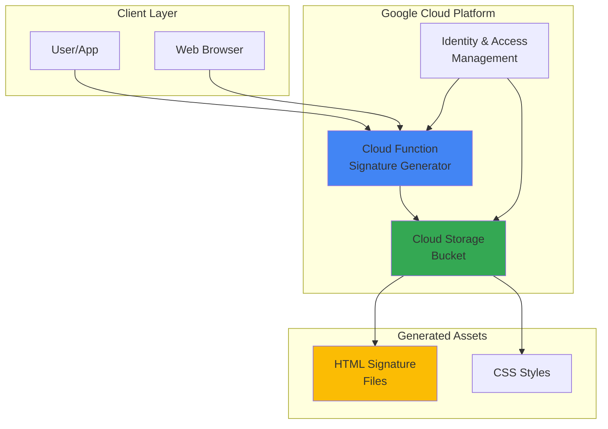

# Email Signature Generator with Cloud Functions and Storage

## Problem

Organizations struggle with maintaining consistent, professional email signatures across teams and departments, often resulting in outdated contact information, inconsistent branding, and poor visual presentation. Manual HTML creation requires technical expertise and time-consuming updates when company information changes, leading to fragmented brand representation in external communications.

## Solution

Create a serverless API using Cloud Functions that generates professional HTML email signatures with company branding and automatically stores them in Cloud Storage for easy access and sharing. This solution provides a scalable, cost-effective way to maintain consistent email signatures across the organization while enabling quick updates and professional presentation.

## Architecture Diagram



## Prerequisites

1. Google Cloud Project with billing enabled and Cloud Functions/Cloud Storage APIs enabled
2. Google Cloud CLI (gcloud) installed and configured
3. Basic understanding of HTTP APIs and HTML/CSS
4. Text editor or IDE for code development
5. Estimated cost: $0.01-$0.50 per month for typical usage (free tier eligible)

> **Note**: This recipe uses Google Cloud's free tier resources for Cloud Functions and Cloud Storage, making it cost-effective for small to medium organizations.

## Preparation

```bash
# Set environment variables for GCP resources
export PROJECT_ID="email-sig-$(date +%s)"
export REGION="us-central1"
export ZONE="us-central1-a"

# Generate unique suffix for resource names
RANDOM_SUFFIX=$(openssl rand -hex 3)
export BUCKET_NAME="email-signatures-${RANDOM_SUFFIX}"
export FUNCTION_NAME="generate-signature"

# Set default project and region
gcloud config set project ${PROJECT_ID}
gcloud config set compute/region ${REGION}
gcloud config set functions/region ${REGION}

# Enable required APIs
gcloud services enable cloudfunctions.googleapis.com
gcloud services enable storage.googleapis.com
gcloud services enable cloudbuild.googleapis.com

echo "✅ Project configured: ${PROJECT_ID}"
echo "✅ Bucket name: ${BUCKET_NAME}"
```

## Steps

1. **Create Cloud Storage Bucket for Signature Storage**:

   Cloud Storage provides globally accessible object storage with strong consistency and automatic scaling. Creating a bucket with appropriate permissions establishes a centralized repository for generated email signatures that can be accessed by users across the organization while maintaining security and version control.

   ```bash
   # Create Cloud Storage bucket for storing signatures
   gsutil mb -p ${PROJECT_ID} \
       -c STANDARD \
       -l ${REGION} \
       gs://${BUCKET_NAME}
   
   # Enable public read access for generated signatures
   gsutil iam ch allUsers:objectViewer gs://${BUCKET_NAME}
   
   echo "✅ Cloud Storage bucket created: gs://${BUCKET_NAME}"
   ```

   The storage bucket is now configured for public read access, allowing generated email signatures to be directly accessible via HTTPS URLs while maintaining security through Google Cloud's infrastructure.

2. **Create Cloud Function Source Code**:

   Cloud Functions provides serverless compute that automatically scales based on demand, making it ideal for API endpoints that generate HTML content. The function will accept user parameters and generate professional HTML signatures with consistent styling and branding elements.

   ```bash
   # Create function directory and source files
   mkdir -p signature-generator
   cd signature-generator
   
   # Create main.py with signature generation logic
   cat > main.py << 'EOF'
import json
import os
from datetime import datetime
from google.cloud import storage

def generate_signature(request):
    """HTTP Cloud Function to generate HTML email signatures."""
    
    # Handle CORS preflight requests
    if request.method == 'OPTIONS':
        headers = {
            'Access-Control-Allow-Origin': '*',
            'Access-Control-Allow-Methods': 'GET, POST',
            'Access-Control-Allow-Headers': 'Content-Type',
            'Access-Control-Max-Age': '3600'
        }
        return ('', 204, headers)
    
    # Set CORS headers for actual request
    headers = {'Access-Control-Allow-Origin': '*'}
    
    try:
        # Parse request data
        request_json = request.get_json(silent=True)
        request_args = request.args
        
        # Extract signature parameters with defaults
        name = request_json.get('name') if request_json else request_args.get('name', 'John Doe')
        title = request_json.get('title') if request_json else request_args.get('title', 'Software Engineer')
        company = request_json.get('company') if request_json else request_args.get('company', 'Your Company')
        email = request_json.get('email') if request_json else request_args.get('email', 'john@company.com')
        phone = request_json.get('phone') if request_json else request_args.get('phone', '+1 (555) 123-4567')
        website = request_json.get('website') if request_json else request_args.get('website', 'https://company.com')
        
        # Generate professional HTML signature
        html_signature = f'''
        <!DOCTYPE html>
        <html>
        <head>
            <meta charset="UTF-8">
            <style>
                .signature-container {{
                    font-family: Arial, Helvetica, sans-serif;
                    font-size: 14px;
                    line-height: 1.4;
                    color: #333333;
                    max-width: 500px;
                }}
                .name {{
                    font-size: 18px;
                    font-weight: bold;
                    color: #2E7EBF;
                    margin-bottom: 5px;
                }}
                .title {{
                    font-size: 14px;
                    color: #666666;
                    margin-bottom: 10px;
                }}
                .company {{
                    font-size: 16px;
                    font-weight: bold;
                    color: #333333;
                    margin-bottom: 10px;
                }}
                .contact-info {{
                    border-top: 2px solid #2E7EBF;
                    padding-top: 10px;
                }}
                .contact-item {{
                    margin-bottom: 5px;
                }}
                .contact-item a {{
                    color: #2E7EBF;
                    text-decoration: none;
                }}
                .contact-item a:hover {{
                    text-decoration: underline;
                }}
            </style>
        </head>
        <body>
            <div class="signature-container">
                <div class="name">{name}</div>
                <div class="title">{title}</div>
                <div class="company">{company}</div>
                <div class="contact-info">
                    <div class="contact-item">Email: <a href="mailto:{email}">{email}</a></div>
                    <div class="contact-item">Phone: <a href="tel:{phone}">{phone}</a></div>
                    <div class="contact-item">Website: <a href="{website}">{website}</a></div>
                </div>
            </div>
        </body>
        </html>
        '''
        
        # Store signature in Cloud Storage
        bucket_name = os.environ.get('BUCKET_NAME')
        if bucket_name:
            storage_client = storage.Client()
            bucket = storage_client.bucket(bucket_name)
            
            # Create filename from name and timestamp
            timestamp = datetime.now().strftime("%Y%m%d_%H%M%S")
            safe_name = name.lower().replace(' ', '_').replace('-', '_')
            filename = f"signatures/{safe_name}_{timestamp}.html"
            
            # Upload HTML signature to bucket
            blob = bucket.blob(filename)
            blob.upload_from_string(html_signature, content_type='text/html')
            
            # Make blob publicly readable
            blob.make_public()
            
            signature_url = f"https://storage.googleapis.com/{bucket_name}/{filename}"
        else:
            signature_url = "Storage not configured"
        
        # Return response with signature and URL
        response_data = {
            'success': True,
            'signature_html': html_signature,
            'storage_url': signature_url,
            'generated_at': datetime.now().isoformat()
        }
        
        return (json.dumps(response_data), 200, headers)
        
    except Exception as e:
        error_response = {
            'success': False,
            'error': str(e),
            'generated_at': datetime.now().isoformat()
        }
        return (json.dumps(error_response), 500, headers)
EOF
   
   echo "✅ Cloud Function source code created"
   ```

   This function generates professional HTML email signatures with responsive design and stores them in Cloud Storage for persistent access, enabling consistent branding across the organization.

3. **Create Function Requirements File**:

   The requirements.txt file specifies the Google Cloud Storage client library, enabling the function to interact with Cloud Storage for persistent signature storage and management.

   ```bash
   # Create requirements.txt for Cloud Function dependencies
   cat > requirements.txt << 'EOF'
google-cloud-storage==2.18.0
EOF
   
   echo "✅ Function requirements file created"
   ```

4. **Deploy Cloud Function with Environment Variables**:

   Deploying the Cloud Function creates a serverless HTTP endpoint that automatically scales based on demand. The function deployment includes environment variables for Cloud Storage integration and configures memory and timeout settings optimized for HTML generation workloads.

   ```bash
   # Deploy Cloud Function with HTTP trigger
   gcloud functions deploy ${FUNCTION_NAME} \
       --gen2 \
       --runtime python312 \
       --trigger-http \
       --allow-unauthenticated \
       --source . \
       --entry-point generate_signature \
       --memory 256Mi \
       --timeout 60s \
       --set-env-vars BUCKET_NAME=${BUCKET_NAME}
   
   # Get function URL
   FUNCTION_URL=$(gcloud functions describe ${FUNCTION_NAME} \
       --gen2 \
       --region=${REGION} \
       --format="value(serviceConfig.uri)")
   
   echo "✅ Cloud Function deployed successfully"
   echo "Function URL: ${FUNCTION_URL}"
   ```

   The Cloud Function is now deployed with HTTP triggers enabled, providing a REST API endpoint for generating email signatures that automatically scales from zero to handle varying request volumes.

5. **Test Signature Generation API**:

   Testing the deployed function verifies that the API correctly generates HTML signatures and stores them in Cloud Storage. This validation ensures the complete workflow from API request to signature generation and storage operates correctly.

   ```bash
   # Test signature generation with sample data
   curl -X POST "${FUNCTION_URL}" \
       -H "Content-Type: application/json" \
       -d '{
           "name": "Jane Smith",
           "title": "Senior Developer",
           "company": "Tech Solutions Inc",
           "email": "jane.smith@techsolutions.com",
           "phone": "+1 (555) 987-6543",
           "website": "https://techsolutions.com"
       }' | jq .
   
   echo "✅ Signature generation test completed"
   ```

## Validation & Testing

1. **Verify Cloud Function Status**:

   ```bash
   # Check function deployment status
   gcloud functions describe ${FUNCTION_NAME} \
       --gen2 \
       --region=${REGION} \
       --format="table(name,state,serviceConfig.uri)"
   ```

   Expected output: Function state should show "ACTIVE" with the service URI displayed.

2. **Test API with Different Parameters**:

   ```bash
   # Test with query parameters
   curl "${FUNCTION_URL}?name=John%20Doe&title=Manager&company=Example%20Corp&email=john@example.com"
   
   # Verify response contains HTML signature
   echo "✅ API responds to query parameters"
   ```

3. **Verify Cloud Storage Integration**:

   ```bash
   # List generated signatures in bucket
   gsutil ls gs://${BUCKET_NAME}/signatures/
   
   # Check public access to stored signatures
   echo "✅ Signatures stored and publicly accessible"
   ```

## Cleanup

1. **Delete Cloud Function**:

   ```bash
   # Remove Cloud Function
   gcloud functions delete ${FUNCTION_NAME} \
       --gen2 \
       --region=${REGION} \
       --quiet
   
   echo "✅ Cloud Function deleted"
   ```

2. **Remove Cloud Storage Bucket**:

   ```bash
   # Delete all objects and bucket
   gsutil -m rm -r gs://${BUCKET_NAME}
   
   echo "✅ Cloud Storage bucket and contents deleted"
   ```

3. **Clean Up Environment Variables**:

   ```bash
   # Remove local environment variables
   unset PROJECT_ID REGION BUCKET_NAME FUNCTION_NAME
   
   echo "✅ Environment variables cleaned up"
   ```

## Discussion

This serverless email signature generator demonstrates the power of Google Cloud's managed services for creating scalable, cost-effective business solutions. Cloud Functions provides automatic scaling and pay-per-use pricing, making it ideal for applications with variable usage patterns like signature generation. The function's stateless design ensures consistent performance regardless of concurrent requests, while Google's global infrastructure provides low-latency access worldwide.

The integration between Cloud Functions and Cloud Storage creates a complete workflow where generated signatures are automatically stored and made publicly accessible via HTTPS URLs. This approach eliminates the need for complex file management systems while providing reliable, scalable storage with Google's 99.999% availability SLA. The public access configuration enables direct embedding of signature URLs in email clients without additional authentication complexity.

Security considerations include the function's unauthenticated access model, which is appropriate for generating non-sensitive HTML content but should be enhanced with authentication for production environments handling sensitive company information. The solution follows Google Cloud security best practices by using IAM service accounts and avoiding hardcoded credentials in the function code. Consider implementing input validation and rate limiting for production deployments.

From a cost perspective, this solution leverages Google Cloud's generous free tiers for both Cloud Functions (2 million invocations per month) and Cloud Storage (5GB storage), making it extremely cost-effective for small to medium organizations. The serverless architecture eliminates infrastructure management overhead while providing enterprise-grade reliability and performance. The Generation 2 Cloud Functions used in this recipe provide improved performance and cold start times compared to previous versions.

> **Tip**: Consider implementing caching mechanisms and signature templates to optimize performance for high-volume usage scenarios. Use Cloud Storage lifecycle policies to automatically manage older signature versions and control storage costs over time.

**Documentation Sources:**
- [Google Cloud Functions Documentation](https://cloud.google.com/functions/docs)
- [Cloud Storage Documentation](https://cloud.google.com/storage/docs)
- [Google Cloud Security Best Practices](https://cloud.google.com/security/best-practices)
- [Cloud Functions Pricing](https://cloud.google.com/functions/pricing)
- [Cloud Storage Access Control](https://cloud.google.com/storage/docs/access-control)
- [Cloud Functions Generation 2](https://cloud.google.com/functions/docs/2nd-gen/overview)

## Challenge

Extend this solution by implementing these enhancements:

1. **Add signature templates and themes** - Create multiple HTML templates with different styles and color schemes, allowing users to select from predefined professional designs stored in Cloud Storage.

2. **Implement user authentication** - Add Firebase Authentication or Google Identity to restrict access and enable user-specific signature management and storage with proper access controls.

3. **Create a web interface** - Build a simple web application using Cloud Run or App Engine that provides a user-friendly form for signature generation and preview with real-time HTML rendering.

4. **Add image and logo support** - Extend the function to handle company logos and profile images, integrating with Cloud Storage for image hosting and automatic optimization using Cloud Functions.

5. **Implement signature analytics** - Use Cloud Monitoring and BigQuery to track signature generation patterns, popular templates, and usage analytics for organizational insights and optimization.

## Infrastructure Code

*Infrastructure code will be generated after recipe approval.*