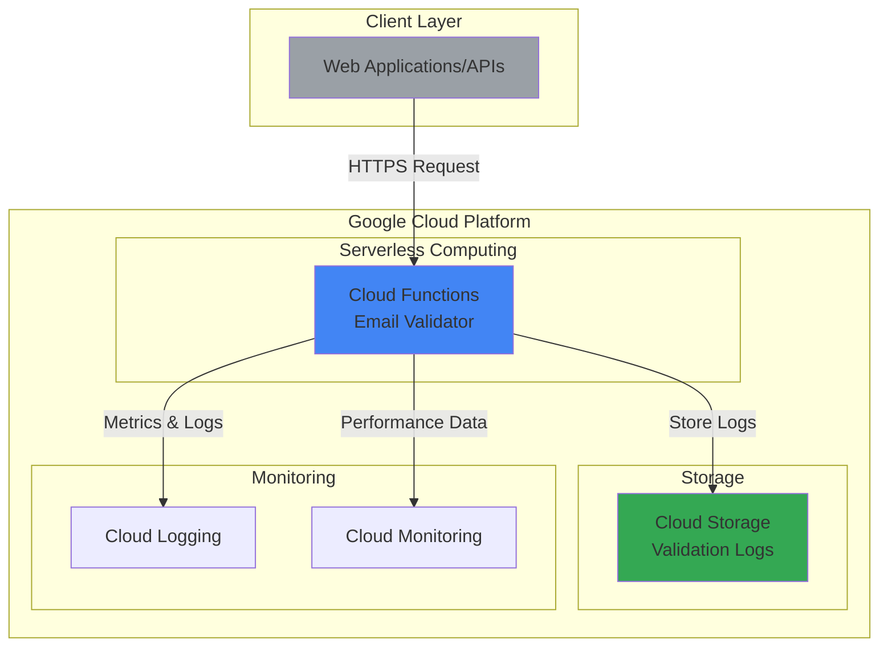

# Email Validation with Cloud Functions

## Problem

Organizations frequently collect email addresses through various forms and APIs, but invalid or malformed email addresses lead to failed communications, bounce rates, and poor data quality. Manual validation is time-consuming and inconsistent, while building custom validation infrastructure requires significant development effort and ongoing maintenance. Companies need a scalable, automated solution that can validate email addresses in real-time while capturing analytics data for continuous improvement.

## Solution

Build a serverless email validation API using Cloud Functions that performs comprehensive email validation using regex patterns and domain verification. The solution stores validation logs in Cloud Storage for analytics and reporting, providing both immediate validation results and historical data insights. This approach eliminates infrastructure management while ensuring high availability and automatic scaling based on demand.

## Architecture Diagram



## Prerequisites

1. Google Cloud account with billing enabled and appropriate permissions (Cloud Functions Developer, Storage Admin roles)
2. Google Cloud CLI installed and configured, or access to Cloud Shell
3. Basic understanding of Python programming and HTTP APIs
4. Familiarity with serverless computing concepts
5. Estimated cost: $0.01-$0.50 for testing (Cloud Functions free tier: 2M invocations/month, Cloud Storage: $0.020/GB/month)

> **Note**: This recipe uses Google Cloud's generous free tier limits, making it cost-effective for learning and small-scale production use.

## Preparation

```bash
# Set environment variables for GCP resources
export PROJECT_ID="email-validation-$(date +%s)"
export REGION="us-central1"
export ZONE="us-central1-a"

# Generate unique suffix for resource names
RANDOM_SUFFIX=$(openssl rand -hex 3)
export BUCKET_NAME="email-validation-logs-${RANDOM_SUFFIX}"
export FUNCTION_NAME="email-validator"

# Create and configure new project
gcloud projects create ${PROJECT_ID}
gcloud config set project ${PROJECT_ID}
gcloud config set compute/region ${REGION}
gcloud config set compute/zone ${ZONE}

# Enable required APIs
gcloud services enable cloudfunctions.googleapis.com
gcloud services enable cloudbuild.googleapis.com
gcloud services enable storage.googleapis.com
gcloud services enable logging.googleapis.com

echo "✅ Project configured: ${PROJECT_ID}"
echo "✅ Bucket name: ${BUCKET_NAME}"
echo "✅ Function name: ${FUNCTION_NAME}"
```

## Steps

1. **Create Cloud Storage Bucket for Validation Logs**:

   Cloud Storage provides unified object storage with global accessibility and strong consistency guarantees. Creating a bucket with appropriate location and storage class settings establishes a durable repository for validation logs that supports analytics workflows and compliance requirements.

   ```bash
   # Create Cloud Storage bucket for log storage
   gsutil mb -p ${PROJECT_ID} \
       -c STANDARD \
       -l ${REGION} \
       gs://${BUCKET_NAME}
   
   # Enable versioning for data protection
   gsutil versioning set on gs://${BUCKET_NAME}
   
   # Set up lifecycle policy to manage storage costs
   cat > lifecycle.json << EOF
   {
     "rule": [
       {
         "action": {"type": "SetStorageClass", "storageClass": "NEARLINE"},
         "condition": {"age": 30}
       },
       {
         "action": {"type": "Delete"},
         "condition": {"age": 365}
       }
     ]
   }
   EOF
   
   gsutil lifecycle set lifecycle.json gs://${BUCKET_NAME}
   
   echo "✅ Cloud Storage bucket created with lifecycle management"
   ```

   The storage bucket is now configured with automatic lifecycle management that moves older logs to cost-effective storage classes and removes very old data. This setup balances accessibility with cost optimization while ensuring compliance with data retention policies.

2. **Create Email Validation Function Code**:

   Cloud Functions provides event-driven serverless execution with automatic scaling and built-in security. The email validation logic combines regex pattern matching with domain verification to ensure comprehensive validation while maintaining fast response times.

   ```bash
   # Create function directory and dependencies
   mkdir -p email-validator
   cd email-validator
   
   # Create requirements.txt for Python dependencies
   cat > requirements.txt << EOF
   functions-framework==3.*
   google-cloud-storage==2.*
   dnspython==2.*
   EOF
   
   # Create main function file
   cat > main.py << 'EOF'
   import functions_framework
   import json
   import re
   import socket
   from datetime import datetime
   from google.cloud import storage
   import os
   
   # Initialize Cloud Storage client
   storage_client = storage.Client()
   BUCKET_NAME = os.environ.get('BUCKET_NAME')
   
   def validate_email_format(email):
       """Validate email format using regex pattern"""
       pattern = r'^[a-zA-Z0-9._%+-]+@[a-zA-Z0-9.-]+\.[a-zA-Z]{2,}$'
       return bool(re.match(pattern, email))
   
   def validate_domain(domain):
       """Validate domain exists using DNS lookup"""
       try:
           socket.gethostbyname(domain)
           return True
       except socket.gaierror:
           return False
   
   def log_validation(email, is_valid, validation_details):
       """Store validation results in Cloud Storage"""
       try:
           bucket = storage_client.bucket(BUCKET_NAME)
           timestamp = datetime.utcnow()
           filename = f"validations/{timestamp.strftime('%Y/%m/%d')}/{timestamp.isoformat()}.json"
           
           log_data = {
               'timestamp': timestamp.isoformat(),
               'email': email,
               'is_valid': is_valid,
               'validation_details': validation_details
           }
           
           blob = bucket.blob(filename)
           blob.upload_from_string(json.dumps(log_data))
           return True
       except Exception as e:
           print(f"Logging error: {e}")
           return False
   
   @functions_framework.http
   def validate_email(request):
       """Main email validation function"""
       # Handle CORS for web requests
       if request.method == 'OPTIONS':
           headers = {
               'Access-Control-Allow-Origin': '*',
               'Access-Control-Allow-Methods': 'POST',
               'Access-Control-Allow-Headers': 'Content-Type',
               'Access-Control-Max-Age': '3600'
           }
           return ('', 204, headers)
       
       headers = {'Access-Control-Allow-Origin': '*'}
       
       try:
           # Parse request data
           request_json = request.get_json(silent=True)
           if not request_json or 'email' not in request_json:
               return json.dumps({'error': 'Email parameter required'}), 400, headers
           
           email = request_json['email'].strip().lower()
           validation_details = {}
           
           # Format validation
           format_valid = validate_email_format(email)
           validation_details['format_valid'] = format_valid
           
           # Domain validation
           domain_valid = False
           if format_valid:
               domain = email.split('@')[1]
               domain_valid = validate_domain(domain)
               validation_details['domain_valid'] = domain_valid
           
           # Overall validation result
           is_valid = format_valid and domain_valid
           validation_details['overall_valid'] = is_valid
           
           # Log validation attempt
           log_validation(email, is_valid, validation_details)
           
           # Return result
           response = {
               'email': email,
               'is_valid': is_valid,
               'validation_details': validation_details
           }
           
           return json.dumps(response), 200, headers
           
       except Exception as e:
           error_response = {'error': f'Validation failed: {str(e)}'}
           return json.dumps(error_response), 500, headers
   EOF
   
   echo "✅ Email validation function code created"
   ```

   The function implements comprehensive email validation with both syntactic and semantic checks. The modular design allows for easy testing and maintenance, while the logging mechanism provides valuable analytics data for monitoring validation patterns and improving the service.

3. **Deploy Cloud Function with Environment Variables**:

   Cloud Functions deployment creates a managed serverless environment that automatically handles scaling, load balancing, and security. The deployment process includes dependency resolution, container building, and service configuration with minimal operational overhead.

   ```bash
   # Deploy Cloud Function with environment variables using Gen 2
   gcloud functions deploy ${FUNCTION_NAME} \
       --gen2 \
       --runtime python311 \
       --source . \
       --entry-point validate_email \
       --trigger-http \
       --allow-unauthenticated \
       --memory 256MiB \
       --timeout 60s \
       --set-env-vars BUCKET_NAME=${BUCKET_NAME} \
       --region ${REGION}
   
   # Get function URL for testing
   FUNCTION_URL=$(gcloud functions describe ${FUNCTION_NAME} \
       --gen2 \
       --region ${REGION} \
       --format="value(serviceConfig.uri)")
   
   echo "✅ Cloud Function deployed successfully"
   echo "Function URL: ${FUNCTION_URL}"
   ```

   The function is now deployed with HTTP trigger access and configured environment variables. Google Cloud automatically provisions the necessary infrastructure, implements security controls, and provides monitoring capabilities without requiring server management.

4. **Configure IAM Permissions for Cloud Storage Access**:

   Identity and Access Management (IAM) ensures secure access to Google Cloud resources using the principle of least privilege. Configuring appropriate permissions allows the Cloud Function to write logs to Cloud Storage while maintaining security boundaries.

   ```bash
   # Get Cloud Function service account for Gen 2
   FUNCTION_SA=$(gcloud functions describe ${FUNCTION_NAME} \
       --gen2 \
       --region ${REGION} \
       --format="value(serviceConfig.serviceAccountEmail)")
   
   # Grant Cloud Storage permissions to function service account
   gsutil iam ch serviceAccount:${FUNCTION_SA}:objectCreator \
       gs://${BUCKET_NAME}
   
   echo "✅ IAM permissions configured for Cloud Storage access"
   echo "Service Account: ${FUNCTION_SA}"
   ```

   The Cloud Function service account now has the minimum necessary permissions to create objects in the specified storage bucket. This configuration follows Google Cloud security best practices by granting only the specific permissions required for the application to function.

5. **Create Test Data and Validation Script**:

   Comprehensive testing ensures the email validation service works correctly across various input scenarios. Creating structured test cases helps verify both positive and negative validation scenarios while demonstrating the function's capabilities.

   ```bash
   # Create test script for email validation
   cat > test_validation.sh << 'EOF'
   #!/bin/bash
   
   FUNCTION_URL=$1
   
   if [ -z "$FUNCTION_URL" ]; then
       echo "Usage: $0 <function_url>"
       exit 1
   fi
   
   echo "Testing Email Validation API..."
   echo "================================="
   
   # Test cases with various email formats
   test_cases=(
       '{"email":"valid@example.com"}'
       '{"email":"user.name+tag@domain.co.uk"}'
       '{"email":"invalid-email"}'
       '{"email":"missing@"}'
       '{"email":"@missing-local.com"}'
       '{"email":"test@nonexistent-domain-12345.com"}'
   )
   
   for i in "${!test_cases[@]}"; do
       echo "Test $((i+1)): ${test_cases[i]}"
       curl -X POST \
           -H "Content-Type: application/json" \
           -d "${test_cases[i]}" \
           "${FUNCTION_URL}" \
           2>/dev/null | jq '.'
       echo "---"
   done
   EOF
   
   chmod +x test_validation.sh
   
   echo "✅ Test script created: test_validation.sh"
   ```

   The test script provides automated validation testing across different email formats and edge cases. This approach ensures consistent testing and helps identify potential issues with various input patterns while demonstrating the API's response format.

## Validation & Testing

1. **Verify Cloud Function deployment and accessibility**:

   ```bash
   # Check function deployment status
   gcloud functions describe ${FUNCTION_NAME} \
       --gen2 \
       --region ${REGION} \
       --format="table(name,state,serviceConfig.uri)"
   
   # Test basic function connectivity
   curl -X OPTIONS ${FUNCTION_URL} -v
   ```

   Expected output: HTTP 204 response with CORS headers, indicating successful deployment and proper CORS configuration.

2. **Test email validation functionality**:

   ```bash
   # Test valid email validation
   curl -X POST \
       -H "Content-Type: application/json" \
       -d '{"email":"test@gmail.com"}' \
       ${FUNCTION_URL} | jq '.'
   
   # Test invalid email validation
   curl -X POST \
       -H "Content-Type: application/json" \
       -d '{"email":"invalid-email"}' \
       ${FUNCTION_URL} | jq '.'
   ```

   Expected output: JSON responses with validation results and detailed validation information for both valid and invalid email scenarios.

3. **Verify Cloud Storage logging functionality**:

   ```bash
   # Check if validation logs are being created
   gsutil ls -r gs://${BUCKET_NAME}/validations/ | head -10
   
   # View recent validation log
   LATEST_LOG=$(gsutil ls gs://${BUCKET_NAME}/validations/**/*.json | tail -1)
   gsutil cat ${LATEST_LOG} | jq '.'
   ```

   Expected output: List of log files organized by date hierarchy and JSON log content showing validation details.

4. **Run comprehensive test suite**:

   ```bash
   # Execute full test suite
   ./test_validation.sh ${FUNCTION_URL}
   ```

   Expected output: Multiple test results showing various email validation scenarios with appropriate success/failure responses.

## Cleanup

1. **Remove Cloud Function**:

   ```bash
   # Delete Cloud Function
   gcloud functions delete ${FUNCTION_NAME} \
       --gen2 \
       --region ${REGION} \
       --quiet
   
   echo "✅ Cloud Function deleted"
   ```

2. **Remove Cloud Storage bucket and contents**:

   ```bash
   # Delete all objects and bucket
   gsutil -m rm -r gs://${BUCKET_NAME}
   
   echo "✅ Cloud Storage bucket and contents deleted"
   ```

3. **Clean up local files**:

   ```bash
   # Remove local function code and test files
   cd ..
   rm -rf email-validator
   rm -f lifecycle.json
   
   echo "✅ Local files cleaned up"
   ```

4. **Delete project (optional)**:

   ```bash
   # Delete entire project if created specifically for this recipe
   gcloud projects delete ${PROJECT_ID} --quiet
   
   echo "✅ Project deletion initiated"
   echo "Note: Project deletion may take several minutes to complete"
   ```

## Discussion

This email validation solution demonstrates the power of serverless architecture for building scalable, cost-effective APIs. Cloud Functions provides automatic scaling from zero to handle traffic spikes while maintaining cost efficiency through pay-per-invocation pricing. The combination of syntactic validation using regular expressions and semantic validation through DNS lookups ensures comprehensive email verification that goes beyond simple format checking.

The integration with Cloud Storage for logging provides valuable analytics capabilities that can inform business decisions about data quality and user behavior patterns. The structured logging approach, with date-based partitioning and lifecycle management, balances accessibility with cost optimization. Organizations can analyze validation patterns, identify common validation failures, and optimize their data collection processes based on these insights.

Security considerations are addressed through IAM best practices, with the Cloud Function service account granted minimal necessary permissions. The serverless architecture inherently provides security benefits including automatic security updates, network isolation, and DDoS protection. For production deployments, consider adding authentication mechanisms, rate limiting, and additional monitoring to enhance security and operational visibility.

The modernized solution uses 2nd generation Cloud Functions with Python 3.11 runtime, providing improved performance, better scaling characteristics, and enhanced observability features. The dnspython library replaces the deprecated dns package, ensuring compatibility with current Python environments and improved DNS resolution capabilities.

> **Tip**: Monitor Cloud Functions execution metrics in Cloud Monitoring to optimize memory allocation and timeout settings based on actual usage patterns, which can reduce costs and improve performance.

For more information, refer to the [Cloud Functions documentation](https://cloud.google.com/functions/docs), [Cloud Storage best practices](https://cloud.google.com/storage/docs/best-practices), [IAM security guidelines](https://cloud.google.com/iam/docs/using-iam-securely), [serverless architecture patterns](https://cloud.google.com/architecture/serverless-webapp), and [Google Cloud cost optimization guide](https://cloud.google.com/cost-management/docs/best-practices).

## Challenge

Extend this solution by implementing these enhancements:

1. **Add advanced email validation**: Integrate with external email verification services like Mailgun or SendGrid to check for disposable email domains, role-based accounts, and mailbox accessibility.

2. **Implement real-time analytics dashboard**: Use BigQuery and Looker to create live dashboards showing validation success rates, common failure patterns, and geographical distribution of validation requests.

3. **Create batch validation processing**: Build a Cloud Run service that processes large CSV files of email addresses using the validation function, with results stored in BigQuery for analysis.

4. **Add machine learning enhancement**: Use Vertex AI to train a model on validation patterns to predict email validity based on domain reputation, format patterns, and historical validation data.

5. **Implement enterprise features**: Add rate limiting with Memorystore for Redis, API key authentication, webhook notifications for validation results, and integration with customer data platforms for automated data cleansing workflows.

## Infrastructure Code

*Infrastructure code will be generated after recipe approval.*