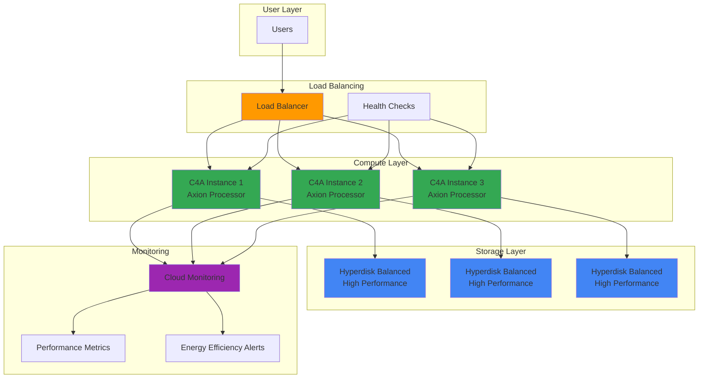

# Energy-Efficient Web Hosting with C4A and Hyperdisk

## Problem

Organizations face mounting pressure to reduce their carbon footprint while maintaining high-performance web applications, but traditional x86-based cloud infrastructure consumes excessive energy and generates higher operational costs. Many companies struggle to balance environmental sustainability goals with performance requirements, especially when hosting content-heavy websites that demand both computational power and fast storage. Without energy-efficient infrastructure, businesses miss opportunities for significant cost savings and fail to meet increasingly important environmental, social, and governance (ESG) objectives that impact their competitive positioning and regulatory compliance.

## Solution

Deploy ARM-based C4A instances powered by Google's custom Axion processors combined with high-performance Hyperdisk storage to achieve up to 60% better energy efficiency compared to traditional x86 instances. This solution leverages Google Cloud's sustainable infrastructure with load balancing for high availability and Cloud Monitoring for comprehensive observability, enabling organizations to reduce both their environmental impact and operational costs while maintaining superior application performance and reliability.

## Architecture Diagram



## Prerequisites

1. Google Cloud Project with billing enabled and Compute Engine API access
2. Google Cloud CLI (gcloud) installed and authenticated
3. Basic understanding of web server deployment and load balancing concepts
4. Knowledge of Linux command line operations and web application architecture
5. Estimated cost: $45-75 per month for 3 C4A instances with Hyperdisk storage and load balancing

> **Note**: C4A instances with Axion processors are available in select regions: us-central1, us-east4, us-east1, eu-west1, eu-west4, eu-west3, and asia-southeast1. Verify regional availability before proceeding with deployment.

## Preparation

```bash
# Set environment variables for GCP resources
export PROJECT_ID="energy-efficient-web-$(date +%s)"
export REGION="us-central1"
export ZONE="us-central1-a"

# Generate unique suffix for resource names
RANDOM_SUFFIX=$(openssl rand -hex 3)

# Set project and region configuration
gcloud config set project ${PROJECT_ID}
gcloud config set compute/region ${REGION}
gcloud config set compute/zone ${ZONE}

# Enable required APIs for compute, monitoring, and networking
gcloud services enable compute.googleapis.com
gcloud services enable monitoring.googleapis.com
gcloud services enable logging.googleapis.com

# Create VPC network for secure communication
gcloud compute networks create energy-web-vpc-${RANDOM_SUFFIX} \
    --subnet-mode regional \
    --description "VPC for energy-efficient web hosting"

# Create subnet for the web application
gcloud compute networks subnets create energy-web-subnet-${RANDOM_SUFFIX} \
    --network energy-web-vpc-${RANDOM_SUFFIX} \
    --range 10.0.0.0/24 \
    --region ${REGION}

echo "✅ Project configured: ${PROJECT_ID}"
echo "✅ Network infrastructure created with suffix: ${RANDOM_SUFFIX}"
```

## Steps

1. **Create Firewall Rules for Web Traffic**:

   Establishing proper firewall rules is essential for web hosting security while allowing necessary HTTP and HTTPS traffic. Google Cloud's VPC firewall provides granular control over network access, enabling you to follow security best practices by allowing only required protocols and ports while maintaining protection against unauthorized access.

   ```bash
   # Allow HTTP traffic on port 80
   gcloud compute firewall-rules create allow-http-${RANDOM_SUFFIX} \
       --network energy-web-vpc-${RANDOM_SUFFIX} \
       --action allow \
       --direction ingress \
       --source-ranges 0.0.0.0/0 \
       --rules tcp:80 \
       --target-tags web-server
   
   # Allow HTTPS traffic on port 443
   gcloud compute firewall-rules create allow-https-${RANDOM_SUFFIX} \
       --network energy-web-vpc-${RANDOM_SUFFIX} \
       --action allow \
       --direction ingress \
       --source-ranges 0.0.0.0/0 \
       --rules tcp:443 \
       --target-tags web-server
   
   # Allow health check traffic from Google Cloud Load Balancer
   gcloud compute firewall-rules create allow-health-checks-${RANDOM_SUFFIX} \
       --network energy-web-vpc-${RANDOM_SUFFIX} \
       --action allow \
       --direction ingress \
       --source-ranges 130.211.0.0/22,35.191.0.0/16 \
       --rules tcp:80 \
       --target-tags web-server
   
   echo "✅ Firewall rules configured for web traffic and health checks"
   ```

2. **Create Hyperdisk Volumes for High-Performance Storage**:

   Hyperdisk Balanced provides superior performance and energy efficiency compared to traditional persistent disks by leveraging Google's Titanium storage offload technology. Creating dedicated storage volumes allows for independent scaling of performance and capacity while ensuring data durability and fast access for web applications that require quick content delivery.

   ```bash
   # Create Hyperdisk Balanced volumes for each instance
   for i in {1..3}; do
       gcloud compute disks create web-data-disk-${i}-${RANDOM_SUFFIX} \
           --type hyperdisk-balanced \
           --size 50GB \
           --zone ${ZONE} \
           --provisioned-iops 3000 \
           --provisioned-throughput 140
       
       echo "✅ Created Hyperdisk volume ${i} with optimized performance"
   done
   
   # Verify disk creation and configuration
   gcloud compute disks list --filter="zone:(${ZONE})" \
       --format="table(name,sizeGb,type,provisionedIops)"
   ```

3. **Deploy C4A Instances with Axion Processors**:

   C4A instances utilize Google's custom Axion ARM processors based on Neoverse V2 architecture, delivering up to 60% better energy efficiency than comparable x86 instances. The ARM architecture's reduced instruction set and optimized power consumption make these instances ideal for sustainable web hosting while maintaining high performance through advanced features like SVE2 and enhanced security capabilities.

   ```bash
   # Create startup script for web server installation
   cat > startup-script.sh << 'EOF'
   #!/bin/bash
   apt-get update
   apt-get install -y nginx htop fio
   
   # Create a simple energy-efficient web page
   cat > /var/www/html/index.html << 'HTML'
   <!DOCTYPE html>
   <html>
   <head>
       <title>Energy-Efficient Web Hosting</title>
       <meta charset="UTF-8">
       <style>
           body { font-family: Arial, sans-serif; margin: 40px; background: #f5f5f5; }
           .container { max-width: 800px; margin: 0 auto; background: white; padding: 30px; border-radius: 8px; }
           .eco-badge { background: #34A853; color: white; padding: 5px 10px; border-radius: 20px; font-size: 12px; }
       </style>
   </head>
   <body>
       <div class="container">
           <h1>🌱 Energy-Efficient Web Hosting</h1>
           <p><span class="eco-badge">60% More Energy Efficient</span></p>
           <p>This website is powered by Google Cloud C4A instances with Axion processors and Hyperdisk storage.</p>
           <p>Server: <strong>$(hostname)</strong></p>
           <p>Architecture: <strong>ARM64 (Axion)</strong></p>
           <p>Timestamp: <strong>$(date)</strong></p>
       </div>
   </body>
   </html>
HTML
   
   systemctl enable nginx
   systemctl start nginx
   EOF
   
   # Create C4A instances with Axion processors
   for i in {1..3}; do
       gcloud compute instances create web-server-${i}-${RANDOM_SUFFIX} \
           --machine-type c4a-standard-4 \
           --zone ${ZONE} \
           --network energy-web-vpc-${RANDOM_SUFFIX} \
           --subnet energy-web-subnet-${RANDOM_SUFFIX} \
           --disk name=web-data-disk-${i}-${RANDOM_SUFFIX},device-name=data-disk \
           --image-family ubuntu-2004-lts \
           --image-project ubuntu-os-cloud \
           --tags web-server \
           --metadata-from-file startup-script=startup-script.sh \
           --maintenance-policy MIGRATE \
           --scopes "https://www.googleapis.com/auth/monitoring.write"
       
       echo "✅ Created C4A instance ${i} with Axion processor"
   done
   ```

4. **Configure Load Balancer for High Availability**:

   Google Cloud Load Balancing distributes traffic across multiple C4A instances to ensure high availability and optimal resource utilization. The load balancer integrates with health checks to automatically route traffic away from unhealthy instances, maintaining service reliability while maximizing the energy efficiency benefits of the ARM-based infrastructure through intelligent traffic distribution.

   ```bash
   # Create instance group for load balancing
   gcloud compute instance-groups unmanaged create web-instance-group-${RANDOM_SUFFIX} \
       --zone ${ZONE} \
       --description "Instance group for energy-efficient web servers"
   
   # Add instances to the group
   for i in {1..3}; do
       gcloud compute instance-groups unmanaged add-instances web-instance-group-${RANDOM_SUFFIX} \
           --zone ${ZONE} \
           --instances web-server-${i}-${RANDOM_SUFFIX}
   done
   
   # Create health check for the load balancer
   gcloud compute health-checks create http web-health-check-${RANDOM_SUFFIX} \
       --port 80 \
       --check-interval 30s \
       --timeout 10s \
       --healthy-threshold 2 \
       --unhealthy-threshold 3 \
       --request-path "/"
   
   # Create backend service
   gcloud compute backend-services create web-backend-service-${RANDOM_SUFFIX} \
       --protocol HTTP \
       --health-checks web-health-check-${RANDOM_SUFFIX} \
       --global
   
   # Add instance group to backend service
   gcloud compute backend-services add-backend web-backend-service-${RANDOM_SUFFIX} \
       --instance-group web-instance-group-${RANDOM_SUFFIX} \
       --instance-group-zone ${ZONE} \
       --global
   
   echo "✅ Load balancer backend configured with health checks"
   ```

5. **Create URL Map and HTTP Load Balancer**:

   The URL map defines how incoming requests are routed to backend services, enabling sophisticated traffic management and content delivery optimization. Google Cloud's global load balancing infrastructure ensures low latency worldwide while the C4A instances' energy efficiency reduces the overall carbon footprint of content delivery at scale.

   ```bash
   # Create URL map for routing
   gcloud compute url-maps create web-url-map-${RANDOM_SUFFIX} \
       --default-service web-backend-service-${RANDOM_SUFFIX} \
       --description "URL map for energy-efficient web hosting"
   
   # Create HTTP proxy
   gcloud compute target-http-proxies create web-http-proxy-${RANDOM_SUFFIX} \
       --url-map web-url-map-${RANDOM_SUFFIX}
   
   # Create global forwarding rule (load balancer frontend)
   gcloud compute forwarding-rules create web-forwarding-rule-${RANDOM_SUFFIX} \
       --global \
       --target-http-proxy web-http-proxy-${RANDOM_SUFFIX} \
       --ports 80
   
   # Get the load balancer IP address
   LB_IP=$(gcloud compute forwarding-rules describe web-forwarding-rule-${RANDOM_SUFFIX} \
       --global \
       --format="value(IPAddress)")
   
   echo "✅ HTTP Load Balancer created successfully"
   echo "✅ Load Balancer IP: ${LB_IP}"
   ```

6. **Configure Cloud Monitoring for Energy Efficiency Tracking**:

   Cloud Monitoring provides comprehensive observability for tracking both performance metrics and energy efficiency indicators. Setting up custom dashboards and alerts enables proactive monitoring of resource utilization, helping optimize the energy efficiency benefits of C4A instances while ensuring optimal application performance and identifying opportunities for further sustainability improvements.

   ```bash
   # Create monitoring dashboard configuration
   cat > dashboard-config.json << 'EOF'
   {
     "displayName": "Energy-Efficient Web Hosting Dashboard",
     "mosaicLayout": {
       "tiles": [
         {
           "width": 6,
           "height": 4,
           "widget": {
             "title": "C4A Instance CPU Utilization",
             "xyChart": {
               "dataSets": [
                 {
                   "timeSeriesQuery": {
                     "timeSeriesFilter": {
                       "filter": "resource.type=\"gce_instance\" AND metric.type=\"compute.googleapis.com/instance/cpu/utilization\"",
                       "aggregation": {
                         "alignmentPeriod": "60s",
                         "perSeriesAligner": "ALIGN_MEAN"
                       }
                     }
                   }
                 }
               ]
             }
           }
         },
         {
           "width": 6,
           "height": 4,
           "xPos": 6,
           "widget": {
             "title": "Hyperdisk Performance Metrics",
             "xyChart": {
               "dataSets": [
                 {
                   "timeSeriesQuery": {
                     "timeSeriesFilter": {
                       "filter": "resource.type=\"gce_disk\" AND metric.type=\"compute.googleapis.com/instance/disk/read_ops_count\"",
                       "aggregation": {
                         "alignmentPeriod": "60s",
                         "perSeriesAligner": "ALIGN_RATE"
                       }
                     }
                   }
                 }
               ]
             }
           }
         }
       ]
     }
   }
   EOF
   
   # Create the monitoring dashboard
   gcloud monitoring dashboards create --config-from-file=dashboard-config.json
   
   echo "✅ Cloud Monitoring dashboard created for energy efficiency tracking"
   ```

## Validation & Testing

1. **Verify C4A Instance Deployment and ARM Architecture**:

   ```bash
   # Check instance status and machine type
   gcloud compute instances list --filter="name~web-server.*${RANDOM_SUFFIX}" \
       --format="table(name,status,machineType.scope(),zone.scope())"
   
   # Verify ARM architecture on instances
   for i in {1..3}; do
       echo "Checking architecture for instance ${i}:"
       gcloud compute ssh web-server-${i}-${RANDOM_SUFFIX} \
           --zone=${ZONE} \
           --command="uname -m && lscpu | grep 'Architecture'"
   done
   ```

   Expected output: Architecture should show `aarch64` confirming ARM-based Axion processors.

2. **Test Load Balancer Functionality and Performance**:

   ```bash
   # Wait for load balancer to become ready
   echo "Waiting for load balancer to become ready..."
   sleep 60
   
   # Test load balancer response
   echo "Testing load balancer at IP: ${LB_IP}"
   curl -s http://${LB_IP} | grep "Server:"
   
   # Perform load testing to verify distribution
   for i in {1..10}; do
       curl -s http://${LB_IP} | grep "Server:" | sed 's/.*<strong>//' | sed 's/<\/strong>.*//'
   done | sort | uniq -c
   
   # Check load balancer health
   gcloud compute backend-services get-health web-backend-service-${RANDOM_SUFFIX} \
       --global \
       --format="table(status,instance.scope())"
   ```

3. **Validate Hyperdisk Performance and Configuration**:

   ```bash
   # Check disk performance metrics
   gcloud compute disks list --filter="name~web-data-disk.*${RANDOM_SUFFIX}" \
       --format="table(name,sizeGb,type,provisionedIops,provisionedThroughput)"
   
   # Test disk I/O performance on one instance (optional)
   echo "Testing Hyperdisk I/O performance..."
   gcloud compute ssh web-server-1-${RANDOM_SUFFIX} \
       --zone=${ZONE} \
       --command="sudo apt-get update && sudo apt-get install -y fio && sudo fio --name=test --ioengine=libaio --rw=randread --bs=4k --numjobs=1 --size=100M --runtime=10 --time_based --filename=/tmp/testfile --output-format=json | jq '.jobs[0].read.iops'"
   ```

4. **Monitor Energy Efficiency Metrics**:

   ```bash
   # View monitoring dashboard URL
   echo "View your energy efficiency dashboard at:"
   echo "https://console.cloud.google.com/monitoring/dashboards"
   
   # Check CPU utilization across instances
   gcloud compute instances list --filter="name~web-server.*${RANDOM_SUFFIX}" \
       --format="table(name,status,cpuPlatform)"
   ```

## Cleanup

1. **Remove Load Balancer Components**:

   ```bash
   # Delete forwarding rule
   gcloud compute forwarding-rules delete web-forwarding-rule-${RANDOM_SUFFIX} \
       --global \
       --quiet
   
   # Delete HTTP proxy
   gcloud compute target-http-proxies delete web-http-proxy-${RANDOM_SUFFIX} \
       --quiet
   
   # Delete URL map
   gcloud compute url-maps delete web-url-map-${RANDOM_SUFFIX} \
       --quiet
   
   # Delete backend service
   gcloud compute backend-services delete web-backend-service-${RANDOM_SUFFIX} \
       --global \
       --quiet
   
   echo "✅ Load balancer components removed"
   ```

2. **Remove Compute Resources**:

   ```bash
   # Delete instance group
   gcloud compute instance-groups unmanaged delete web-instance-group-${RANDOM_SUFFIX} \
       --zone ${ZONE} \
       --quiet
   
   # Delete instances
   for i in {1..3}; do
       gcloud compute instances delete web-server-${i}-${RANDOM_SUFFIX} \
           --zone ${ZONE} \
           --quiet
   done
   
   # Delete Hyperdisk volumes
   for i in {1..3}; do
       gcloud compute disks delete web-data-disk-${i}-${RANDOM_SUFFIX} \
           --zone ${ZONE} \
           --quiet
   done
   
   echo "✅ Compute resources and storage volumes removed"
   ```

3. **Remove Network and Security Resources**:

   ```bash
   # Delete health check
   gcloud compute health-checks delete web-health-check-${RANDOM_SUFFIX} \
       --quiet
   
   # Delete firewall rules
   gcloud compute firewall-rules delete allow-http-${RANDOM_SUFFIX} \
       --quiet
   gcloud compute firewall-rules delete allow-https-${RANDOM_SUFFIX} \
       --quiet
   gcloud compute firewall-rules delete allow-health-checks-${RANDOM_SUFFIX} \
       --quiet
   
   # Delete network infrastructure
   gcloud compute networks subnets delete energy-web-subnet-${RANDOM_SUFFIX} \
       --region ${REGION} \
       --quiet
   gcloud compute networks delete energy-web-vpc-${RANDOM_SUFFIX} \
       --quiet
   
   # Clean up local files
   rm -f startup-script.sh dashboard-config.json
   
   echo "✅ Network infrastructure and security rules removed"
   ```

## Discussion

Google Cloud's C4A instances represent a significant advancement in energy-efficient cloud computing through the integration of custom Axion ARM processors. These processors, based on ARM's Neoverse V2 architecture, deliver up to 60% better energy efficiency compared to traditional x86 instances while maintaining comparable or superior performance characteristics. The ARM architecture's reduced instruction set computing (RISC) design inherently consumes less power per operation, making it ideal for organizations prioritizing environmental sustainability without compromising application performance. This energy efficiency translates directly into cost savings and reduced carbon footprint, aligning with corporate ESG objectives and regulatory requirements for environmental responsibility. According to [Google's official announcement](https://cloud.google.com/blog/products/compute/try-c4a-the-first-google-axion-processor), C4A instances offer up to 65% better price-performance and up to 60% better energy efficiency than comparable current-generation x86-based instances.

The integration of Hyperdisk storage with C4A instances creates a compelling combination for sustainable web hosting. Hyperdisk leverages Google's Titanium storage offload technology to deliver superior I/O performance while reducing the computational overhead on the main processors. This architectural approach not only improves application responsiveness but also contributes to overall energy efficiency by optimizing resource utilization across the compute and storage layers. The ability to independently scale performance and capacity in Hyperdisk volumes ensures that resources are precisely matched to workload requirements, avoiding overprovisioning and unnecessary energy consumption. Additionally, the multi-writer capabilities and high availability features of Hyperdisk support resilient architectures that maintain efficiency even during fault conditions, as detailed in the [official Hyperdisk documentation](https://cloud.google.com/compute/docs/disks/add-hyperdisk).

Load balancing across multiple C4A instances maximizes both availability and energy efficiency through intelligent traffic distribution. Google Cloud's global load balancing infrastructure automatically routes requests to the most appropriate instance based on factors including geographic proximity, instance health, and current load. This intelligent routing reduces unnecessary network hops and computational overhead while ensuring optimal utilization of the energy-efficient ARM processors. The health check integration ensures that traffic is always directed to healthy instances, preventing wasted resources and maintaining consistent performance. Cloud Monitoring integration provides visibility into both performance metrics and energy efficiency indicators, enabling data-driven optimization of the infrastructure for maximum sustainability benefits.

The combination of these technologies addresses the growing need for sustainable cloud infrastructure without sacrificing performance or reliability. Organizations can achieve significant cost reductions through both lower energy consumption and improved price-performance ratios, while also meeting increasingly important environmental compliance requirements. This approach represents a practical path toward carbon-neutral cloud operations, demonstrating that environmental responsibility and business performance can be mutually reinforcing rather than competing objectives. Real-world implementations have shown substantial benefits, with companies like Spotify reporting roughly 250% better performance using Axion-based C4A VMs compared to previous generation instances.

> **Tip**: Monitor your energy efficiency metrics through Cloud Monitoring dashboards to identify optimization opportunities and track your sustainability improvements over time. Consider implementing automated scaling policies to ensure instances are sized appropriately for current demand, maximizing the energy efficiency benefits of C4A instances.

## Challenge

Extend this energy-efficient web hosting solution by implementing these enhancements:

1. **SSL/TLS Termination**: Configure HTTPS load balancing with managed SSL certificates to secure communications while maintaining energy efficiency through hardware-accelerated cryptographic operations on C4A instances.

2. **Auto Scaling Integration**: Implement managed instance groups with auto-scaling policies that respond to CPU utilization and load balancer metrics, ensuring optimal resource utilization and energy efficiency during varying traffic patterns.

3. **CDN Integration**: Deploy Cloud CDN to cache static content globally, reducing origin server load on C4A instances and improving global performance while minimizing energy consumption through reduced backend requests.

4. **Container Workloads**: Migrate the web application to Google Kubernetes Engine (GKE) with C4A node pools to leverage container orchestration benefits while maintaining ARM-based energy efficiency for microservices architectures.

5. **Multi-Region Deployment**: Expand the architecture to multiple regions with global load balancing and regional C4A clusters, implementing disaster recovery while optimizing energy efficiency through geographic distribution and reduced latency.

## Infrastructure Code

### Available Infrastructure as Code:

- [Infrastructure Code Overview](code/README.md) - Detailed description of all infrastructure components
- [Infrastructure Manager](code/infrastructure-manager/) - GCP Infrastructure Manager templates
- [Bash CLI Scripts](code/scripts/) - Example bash scripts using gcloud CLI commands to deploy infrastructure
- [Terraform](code/terraform/) - Terraform configuration files