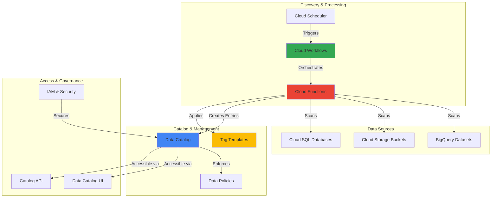

# Enterprise Data Discovery with Data Catalog and Cloud Workflows

## Problem

Enterprise organizations struggle with data sprawl across multiple cloud storage systems, databases, and analytics platforms, making it nearly impossible for data teams to discover, understand, and govern their data assets effectively. Manual cataloging processes are time-consuming, error-prone, and fail to keep pace with rapidly changing data landscapes, leading to duplicated efforts, compliance risks, and missed business opportunities due to undiscovered valuable datasets.

## Solution

Implement an automated data discovery and cataloging system using Google Cloud Data Catalog as the centralized metadata repository, Cloud Workflows for orchestrating the discovery process, and Cloud Functions for intelligent metadata extraction. This solution continuously scans multiple data sources, automatically extracts schema and business metadata, applies AI-powered tagging, and maintains an up-to-date enterprise data catalog that enables self-service data discovery.

## Architecture Diagram



## Prerequisites

1. Google Cloud project with Data Catalog, Cloud Workflows, Cloud Functions, and BigQuery APIs enabled
2. Google Cloud CLI (gcloud) installed and configured with appropriate permissions
3. Understanding of metadata management and data governance concepts
4. Basic knowledge of YAML for workflow definitions and JSON for data structures
5. Estimated cost: $50-100/month for moderate enterprise usage (varies by data volume and scan frequency)

> **Note**: Data Catalog provides powerful search capabilities powered by the same Google search technology used in Gmail and Drive, enabling intuitive data discovery across your entire organization.

## Preparation

```bash
# Set environment variables for the project
export PROJECT_ID="data-discovery-$(date +%s)"
export REGION="us-central1"
export ZONE="us-central1-a"

# Generate unique suffix for resource names
RANDOM_SUFFIX=$(openssl rand -hex 3)
export WORKFLOW_NAME="data-discovery-workflow-${RANDOM_SUFFIX}"
export FUNCTION_NAME="metadata-extractor-${RANDOM_SUFFIX}"
export SCHEDULER_JOB="discovery-scheduler-${RANDOM_SUFFIX}"
export BUCKET_NAME="data-catalog-staging-${RANDOM_SUFFIX}"

# Set default project and region
gcloud config set project ${PROJECT_ID}
gcloud config set compute/region ${REGION}
gcloud config set functions/region ${REGION}

# Enable required APIs
gcloud services enable datacatalog.googleapis.com
gcloud services enable workflows.googleapis.com
gcloud services enable cloudfunctions.googleapis.com
gcloud services enable cloudscheduler.googleapis.com
gcloud services enable bigquery.googleapis.com
gcloud services enable cloudbuild.googleapis.com

# Create Cloud Storage bucket for staging
gsutil mb -p ${PROJECT_ID} -c STANDARD -l ${REGION} gs://${BUCKET_NAME}

echo "✅ Project configured: ${PROJECT_ID}"
echo "✅ Resources will use suffix: ${RANDOM_SUFFIX}"
```

## Steps

1. **Create Data Catalog Tag Templates for Metadata Classification**:

   Data Catalog tag templates define the structure and schema for metadata tags that will be applied to discovered data assets. These templates enable consistent classification of data sensitivity, quality metrics, business ownership, and compliance requirements across your enterprise data landscape.

   ```bash
   # Create a tag template for data classification
   gcloud data-catalog tag-templates create data_classification \
       --location=${REGION} \
       --display-name="Data Classification Template" \
       --field=id=sensitivity,display-name="Data Sensitivity",type=enum,enum-values="PUBLIC|INTERNAL|CONFIDENTIAL|RESTRICTED" \
       --field=id=owner,display-name="Data Owner",type=string \
       --field=id=department,display-name="Department",type=string \
       --field=id=last_updated,display-name="Last Updated",type=datetime
   
   # Create tag template for data quality metrics
   gcloud data-catalog tag-templates create data_quality \
       --location=${REGION} \
       --display-name="Data Quality Metrics" \
       --field=id=completeness_score,display-name="Completeness Score",type=double \
       --field=id=accuracy_score,display-name="Accuracy Score",type=double \
       --field=id=freshness_days,display-name="Data Freshness (Days)",type=double \
       --field=id=validation_date,display-name="Last Validation",type=datetime
   
   echo "✅ Data Catalog tag templates created successfully"
   ```

   These tag templates establish the foundation for consistent metadata management, enabling automated classification and manual enrichment of data assets. The templates support both automated discovery processes and manual curation by data stewards.

2. **Deploy Cloud Function for Intelligent Metadata Extraction**:

   The Cloud Function serves as the core metadata extraction engine, analyzing data sources to automatically discover schema information, infer data types, calculate quality metrics, and apply intelligent tagging based on content analysis and naming patterns.

   ```bash
   # Create the Cloud Function source code directory
   mkdir -p cloud-function-source
   cd cloud-function-source
   
   # Create the main function file
   cat > main.py << 'EOF'
import json
import logging
from datetime import datetime
from google.cloud import datacatalog_v1
from google.cloud import bigquery
from google.cloud import storage
import functions_framework

# Initialize clients
datacatalog_client = datacatalog_v1.DataCatalogClient()
bigquery_client = bigquery.Client()
storage_client = storage.Client()

@functions_framework.http
def discover_and_catalog(request):
    """Main function to discover and catalog data assets"""
    
    request_json = request.get_json(silent=True)
    project_id = request_json.get('project_id')
    location = request_json.get('location', 'us-central1')
    
    results = {
        'bigquery_datasets': [],
        'storage_buckets': [],
        'total_assets_cataloged': 0
    }
    
    try:
        # Discover BigQuery datasets
        bq_results = discover_bigquery_assets(project_id, location)
        results['bigquery_datasets'] = bq_results
        
        # Discover Cloud Storage buckets
        storage_results = discover_storage_assets(project_id, location)
        results['storage_buckets'] = storage_results
        
        results['total_assets_cataloged'] = len(bq_results) + len(storage_results)
        
        logging.info(f"Discovery completed: {results['total_assets_cataloged']} assets cataloged")
        
    except Exception as e:
        logging.error(f"Error during discovery: {str(e)}")
        return {'error': str(e)}, 500
    
    return results

def discover_bigquery_assets(project_id, location):
    """Discover and catalog BigQuery datasets and tables"""
    
    cataloged_assets = []
    
    # List all datasets
    datasets = list(bigquery_client.list_datasets(project=project_id))
    
    for dataset in datasets:
        dataset_id = dataset.dataset_id
        
        # Get dataset metadata
        dataset_ref = bigquery_client.get_dataset(dataset.reference)
        
        # Create Data Catalog entry for dataset
        entry_group_id = f"bigquery_datasets_{location}"
        entry_id = f"{project_id}_{dataset_id}"
        
        try:
            create_bigquery_entry(project_id, location, entry_group_id, 
                                entry_id, dataset_ref)
            cataloged_assets.append({
                'type': 'bigquery_dataset',
                'id': dataset_id,
                'tables': discover_bigquery_tables(dataset_ref, project_id, location)
            })
        except Exception as e:
            logging.warning(f"Failed to catalog dataset {dataset_id}: {str(e)}")
    
    return cataloged_assets

def discover_bigquery_tables(dataset_ref, project_id, location):
    """Discover and catalog tables within a BigQuery dataset"""
    
    cataloged_tables = []
    tables = list(bigquery_client.list_tables(dataset_ref))
    
    for table in tables:
        table_ref = bigquery_client.get_table(table.reference)
        
        # Calculate data quality metrics
        quality_metrics = calculate_table_quality_metrics(table_ref)
        
        # Apply tags based on schema and content analysis
        sensitivity_level = infer_data_sensitivity(table_ref)
        
        cataloged_tables.append({
            'table_id': table_ref.table_id,
            'row_count': table_ref.num_rows,
            'size_bytes': table_ref.num_bytes,
            'quality_metrics': quality_metrics,
            'sensitivity': sensitivity_level
        })
    
    return cataloged_tables

def discover_storage_assets(project_id, location):
    """Discover and catalog Cloud Storage buckets"""
    
    cataloged_buckets = []
    
    for bucket in storage_client.list_buckets(project=project_id):
        bucket_info = {
            'bucket_name': bucket.name,
            'location': bucket.location,
            'storage_class': bucket.storage_class,
            'file_count': 0,
            'total_size': 0
        }
        
        # Sample bucket contents for metadata
        try:
            blobs = list(bucket.list_blobs(max_results=100))
            bucket_info['file_count'] = len(blobs)
            bucket_info['total_size'] = sum(blob.size or 0 for blob in blobs)
            
            cataloged_buckets.append(bucket_info)
        except Exception as e:
            logging.warning(f"Failed to analyze bucket {bucket.name}: {str(e)}")
    
    return cataloged_buckets

def create_bigquery_entry(project_id, location, entry_group_id, entry_id, dataset_ref):
    """Create Data Catalog entry for BigQuery dataset"""
    
    # Define the parent and entry group
    parent = f"projects/{project_id}/locations/{location}"
    
    # Create entry group if it doesn't exist
    try:
        entry_group = datacatalog_v1.EntryGroup()
        entry_group.display_name = "BigQuery Datasets"
        entry_group.description = "Automatically discovered BigQuery datasets"
        
        datacatalog_client.create_entry_group(
            parent=parent,
            entry_group_id=entry_group_id,
            entry_group=entry_group
        )
    except Exception:
        # Entry group already exists
        pass
    
    # Create the entry
    entry = datacatalog_v1.Entry()
    entry.display_name = dataset_ref.friendly_name or dataset_ref.dataset_id
    entry.description = dataset_ref.description or "Automatically discovered BigQuery dataset"
    entry.type_ = datacatalog_v1.EntryType.TABLE
    
    # Set BigQuery-specific information
    entry.bigquery_table_spec.table_source_type = \
        datacatalog_v1.TableSourceType.BIGQUERY_TABLE
    
    entry_group_path = f"{parent}/entryGroups/{entry_group_id}"
    
    try:
        created_entry = datacatalog_client.create_entry(
            parent=entry_group_path,
            entry_id=entry_id,
            entry=entry
        )
        
        # Apply classification tags
        apply_classification_tags(created_entry.name, dataset_ref)
        
        logging.info(f"Created Data Catalog entry: {created_entry.name}")
        
    except Exception as e:
        logging.error(f"Failed to create entry for {dataset_ref.dataset_id}: {str(e)}")

def apply_classification_tags(entry_name, dataset_ref):
    """Apply classification tags to cataloged entries"""
    
    # Create classification tag
    tag_template_name = f"projects/{dataset_ref.project}/locations/us-central1/tagTemplates/data_classification"
    
    tag = datacatalog_v1.Tag()
    tag.template = tag_template_name
    
    # Set tag fields based on analysis
    tag.fields["sensitivity"] = datacatalog_v1.TagField()
    tag.fields["sensitivity"].enum_value.display_name = infer_data_sensitivity(dataset_ref)
    
    tag.fields["owner"] = datacatalog_v1.TagField()
    tag.fields["owner"].string_value = "auto-discovery@company.com"
    
    tag.fields["department"] = datacatalog_v1.TagField()
    tag.fields["department"].string_value = "Data Engineering"
    
    tag.fields["last_updated"] = datacatalog_v1.TagField()
    tag.fields["last_updated"].timestamp_value.GetCurrentTime()
    
    try:
        datacatalog_client.create_tag(parent=entry_name, tag=tag)
        logging.info(f"Applied classification tag to {entry_name}")
    except Exception as e:
        logging.warning(f"Failed to apply tag to {entry_name}: {str(e)}")

def calculate_table_quality_metrics(table_ref):
    """Calculate data quality metrics for BigQuery tables"""
    
    metrics = {
        'completeness_score': 0.0,
        'accuracy_score': 0.0,
        'freshness_days': 0.0
    }
    
    try:
        # Calculate completeness by checking for null values
        if table_ref.num_rows > 0:
            null_query = f"""
            SELECT 
                COUNT(*) as total_nulls
            FROM `{table_ref.project}.{table_ref.dataset_id}.{table_ref.table_id}`
            WHERE {' IS NULL OR '.join([f'`{field.name}`' for field in table_ref.schema[:5]])} IS NULL
            LIMIT 1000
            """
            
            try:
                query_job = bigquery_client.query(null_query)
                results = list(query_job.result())
                if results:
                    null_count = results[0].total_nulls
                    metrics['completeness_score'] = max(0, 1 - (null_count / min(1000, table_ref.num_rows)))
            except Exception:
                metrics['completeness_score'] = 0.8  # Default estimate
        
        # Calculate freshness based on modification time
        if hasattr(table_ref, 'modified') and table_ref.modified:
            days_since_modified = (datetime.now().replace(tzinfo=None) - 
                                 table_ref.modified.replace(tzinfo=None)).days
            metrics['freshness_days'] = days_since_modified
        
        # Set accuracy score based on table size and structure
        metrics['accuracy_score'] = min(1.0, table_ref.num_rows / 10000) if table_ref.num_rows else 0
        
    except Exception as e:
        logging.warning(f"Failed to calculate quality metrics: {str(e)}")
    
    return metrics

def infer_data_sensitivity(data_ref):
    """Infer data sensitivity level based on naming patterns and schema"""
    
    # Check for sensitive keywords in table/dataset names
    sensitive_keywords = ['pii', 'personal', 'credit', 'ssn', 'financial', 'medical']
    confidential_keywords = ['internal', 'employee', 'salary', 'revenue']
    
    name_lower = (getattr(data_ref, 'table_id', '') or 
                  getattr(data_ref, 'dataset_id', '')).lower()
    
    if any(keyword in name_lower for keyword in sensitive_keywords):
        return "RESTRICTED"
    elif any(keyword in name_lower for keyword in confidential_keywords):
        return "CONFIDENTIAL"
    elif 'test' in name_lower or 'dev' in name_lower:
        return "INTERNAL"
    else:
        return "PUBLIC"
EOF
   
   # Create requirements.txt
   cat > requirements.txt << 'EOF'
google-cloud-datacatalog==3.20.0
google-cloud-bigquery==3.25.0
google-cloud-storage==2.18.0
functions-framework==3.7.0
EOF
   
   # Deploy the Cloud Function
   gcloud functions deploy ${FUNCTION_NAME} \
       --gen2 \
       --runtime=python311 \
       --source=. \
       --entry-point=discover_and_catalog \
       --trigger=http \
       --memory=1Gi \
       --timeout=540s \
       --max-instances=10 \
       --allow-unauthenticated
   
   cd ..
   
   echo "✅ Cloud Function deployed successfully"
   ```

   The Cloud Function implements intelligent metadata extraction using schema analysis, content sampling, and pattern recognition to automatically classify data sensitivity levels and calculate quality metrics. This automation reduces manual effort while ensuring consistent metadata standards across the enterprise.

3. **Create Cloud Workflows for Discovery Orchestration**:

   Cloud Workflows orchestrates the entire data discovery process, coordinating between multiple data sources, managing parallel scanning operations, and ensuring proper error handling and retry logic for enterprise-scale data discovery operations.

   ```bash
   # Create the workflow definition file
   cat > discovery-workflow.yaml << 'EOF'
main:
  params: [input]
  steps:
    - initialize:
        assign:
          - project_id: ${sys.get_env("GOOGLE_CLOUD_PROJECT_ID")}
          - location: "us-central1"
          - function_url: ""
          - discovery_results: {}
          
    - get_function_url:
        call: googleapis.cloudfunctions.v2.projects.locations.functions.get
        args:
          name: ${"projects/" + project_id + "/locations/" + location + "/functions/" + input.function_name}
        result: function_info
        
    - extract_function_url:
        assign:
          - function_url: ${function_info.serviceConfig.uri}
          
    - log_start:
        call: sys.log
        args:
          text: ${"Starting data discovery for project: " + project_id}
          severity: INFO
          
    - parallel_discovery:
        parallel:
          shared: [discovery_results]
          branches:
            - bigquery_discovery:
                steps:
                  - discover_bigquery:
                      try:
                        call: http.post
                        args:
                          url: ${function_url}
                          headers:
                            Content-Type: "application/json"
                          body:
                            project_id: ${project_id}
                            location: ${location}
                            source_type: "bigquery"
                        result: bq_result
                      retry:
                        predicate: ${http.default_retry_predicate}
                        max_retries: 3
                        backoff:
                          initial_delay: 2
                          max_delay: 60
                          multiplier: 2
                      except:
                        as: e
                        steps:
                          - log_bq_error:
                              call: sys.log
                              args:
                                text: ${"BigQuery discovery failed: " + e.message}
                                severity: ERROR
                          - set_bq_error:
                              assign:
                                - bq_result: {"error": e.message}
                                
                  - store_bq_results:
                      assign:
                        - discovery_results.bigquery: ${bq_result}
                        
            - storage_discovery:
                steps:
                  - discover_storage:
                      try:
                        call: http.post
                        args:
                          url: ${function_url}
                          headers:
                            Content-Type: "application/json"
                          body:
                            project_id: ${project_id}
                            location: ${location}
                            source_type: "storage"
                        result: storage_result
                      retry:
                        predicate: ${http.default_retry_predicate}
                        max_retries: 3
                        backoff:
                          initial_delay: 2
                          max_delay: 60
                          multiplier: 2
                      except:
                        as: e
                        steps:
                          - log_storage_error:
                              call: sys.log
                              args:
                                text: ${"Storage discovery failed: " + e.message}
                                severity: ERROR
                          - set_storage_error:
                              assign:
                                - storage_result: {"error": e.message}
                                
                  - store_storage_results:
                      assign:
                        - discovery_results.storage: ${storage_result}
                        
    - generate_summary:
        assign:
          - total_assets: 0
          - successful_sources: 0
          - failed_sources: 0
          
    - count_bigquery_assets:
        switch:
          - condition: ${"error" in discovery_results.bigquery}
            assign:
              - failed_sources: ${failed_sources + 1}
          - condition: true
            assign:
              - total_assets: ${total_assets + len(discovery_results.bigquery.get("bigquery_datasets", []))}
              - successful_sources: ${successful_sources + 1}
              
    - count_storage_assets:
        switch:
          - condition: ${"error" in discovery_results.storage}
            assign:
              - failed_sources: ${failed_sources + 1}
          - condition: true
            assign:
              - total_assets: ${total_assets + len(discovery_results.storage.get("storage_buckets", []))}
              - successful_sources: ${successful_sources + 1}
              
    - log_completion:
        call: sys.log
        args:
          text: ${"Discovery completed. Assets cataloged: " + string(total_assets) + ", Successful sources: " + string(successful_sources) + ", Failed sources: " + string(failed_sources)}
          severity: INFO
          
    - return_results:
        return:
          summary:
            total_assets_cataloged: ${total_assets}
            successful_sources: ${successful_sources}
            failed_sources: ${failed_sources}
            timestamp: ${time.format(sys.now())}
          details: ${discovery_results}
EOF
   
   # Deploy the workflow
   gcloud workflows deploy ${WORKFLOW_NAME} \
       --source=discovery-workflow.yaml \
       --location=${REGION}
   
   echo "✅ Cloud Workflows deployed successfully"
   ```

   The workflow implements parallel processing capabilities to scan multiple data sources simultaneously, improving discovery performance for large enterprise environments. Built-in retry logic and error handling ensure reliable operation even when dealing with temporary service interruptions or rate limits.

4. **Set Up Automated Scheduling with Cloud Scheduler**:

   Cloud Scheduler enables regular, automated execution of the data discovery workflow, ensuring that the enterprise data catalog remains current with minimal manual intervention while providing flexibility for both scheduled and on-demand discovery operations.

   ```bash
   # Create Cloud Scheduler job for daily discovery
   gcloud scheduler jobs create http ${SCHEDULER_JOB} \
       --location=${REGION} \
       --schedule="0 2 * * *" \
       --uri="https://workflowexecutions.googleapis.com/v1/projects/${PROJECT_ID}/locations/${REGION}/workflows/${WORKFLOW_NAME}/executions" \
       --http-method=POST \
       --headers="Content-Type=application/json" \
       --message-body="{\"argument\": \"{\\\"function_name\\\": \\\"${FUNCTION_NAME}\\\"}\"}" \
       --oauth-service-account-email="${PROJECT_ID}@appspot.gserviceaccount.com"
   
   # Create additional job for weekly comprehensive discovery
   gcloud scheduler jobs create http ${SCHEDULER_JOB}-weekly \
       --location=${REGION} \
       --schedule="0 1 * * 0" \
       --uri="https://workflowexecutions.googleapis.com/v1/projects/${PROJECT_ID}/locations/${REGION}/workflows/${WORKFLOW_NAME}/executions" \
       --http-method=POST \
       --headers="Content-Type=application/json" \
       --message-body="{\"argument\": \"{\\\"function_name\\\": \\\"${FUNCTION_NAME}\\\", \\\"comprehensive\\\": true}\"}" \
       --oauth-service-account-email="${PROJECT_ID}@appspot.gserviceaccount.com"
   
   echo "✅ Cloud Scheduler jobs created successfully"
   echo "Daily discovery: 2:00 AM daily"
   echo "Weekly comprehensive: 1:00 AM Sunday"
   ```

   The scheduling system provides both daily incremental discovery for rapid detection of new data assets and weekly comprehensive scans for thorough metadata refresh, balancing discovery freshness with computational efficiency and cost optimization.

5. **Create Sample Data Assets for Testing**:

   Creating representative test data assets allows validation of the automated discovery system and demonstrates the catalog's capabilities with realistic enterprise data scenarios including multiple data types, sensitivity levels, and quality characteristics.

   ```bash
   # Create sample BigQuery datasets and tables
   bq mk --dataset \
       --description="Sample customer data for discovery testing" \
       ${PROJECT_ID}:customer_analytics
   
   bq mk --dataset \
       --description="Internal employee data for testing" \
       ${PROJECT_ID}:hr_internal
   
   # Create sample tables with different schemas
   bq mk --table \
       --description="Customer transaction history" \
       ${PROJECT_ID}:customer_analytics.transactions \
       customer_id:STRING,transaction_date:TIMESTAMP,amount:FLOAT,product_category:STRING,payment_method:STRING
   
   bq mk --table \
       --description="Employee personal information" \
       ${PROJECT_ID}:hr_internal.employees \
       employee_id:STRING,first_name:STRING,last_name:STRING,email:STRING,department:STRING,salary:INTEGER,hire_date:DATE
   
   # Create sample Cloud Storage buckets with different purposes
   gsutil mb -p ${PROJECT_ID} -c STANDARD gs://${PROJECT_ID}-public-datasets
   gsutil mb -p ${PROJECT_ID} -c STANDARD gs://${PROJECT_ID}-confidential-reports
   
   # Upload sample files to demonstrate content discovery
   echo "Sample public dataset content" | gsutil cp - gs://${PROJECT_ID}-public-datasets/sample-public-data.txt
   echo "Confidential financial report data" | gsutil cp - gs://${PROJECT_ID}-confidential-reports/financial-report-q4.txt
   
   echo "✅ Sample data assets created for testing"
   ```

   These sample assets represent typical enterprise data patterns with varying sensitivity levels, enabling comprehensive testing of the automated classification and quality assessment capabilities of the discovery system.

6. **Execute Manual Discovery and Verify Results**:

   Manual execution of the discovery workflow validates the end-to-end automation functionality and provides immediate feedback on the system's ability to discover, classify, and catalog enterprise data assets according to defined governance policies.

   ```bash
   # Execute the workflow manually for immediate testing
   gcloud workflows run ${WORKFLOW_NAME} \
       --location=${REGION} \
       --data="{\"function_name\": \"${FUNCTION_NAME}\"}"
   
   # Get execution results
   EXECUTION_ID=$(gcloud workflows executions list \
       --workflow=${WORKFLOW_NAME} \
       --location=${REGION} \
       --limit=1 \
       --format="value(name.basename())")
   
   # Wait for completion and check results
   echo "Waiting for workflow execution to complete..."
   sleep 30
   
   gcloud workflows executions describe ${EXECUTION_ID} \
       --workflow=${WORKFLOW_NAME} \
       --location=${REGION} \
       --format="json" > workflow-results.json
   
   echo "✅ Manual discovery workflow executed"
   echo "Results saved to workflow-results.json"
   ```

   Manual execution provides immediate validation of the discovery system's functionality while generating detailed execution logs that help identify any configuration issues or optimization opportunities before enabling automated scheduling.

## Validation & Testing

1. **Verify Data Catalog Entries Creation**:

   ```bash
   # List all entry groups in Data Catalog
   gcloud data-catalog entry-groups list \
       --location=${REGION} \
       --format="table(name,displayName,description)"
   
   # Check for automatically created entries
   gcloud data-catalog entries search \
       --location=${REGION} \
       --query="type=table" \
       --format="table(name,displayName,type)"
   ```

   Expected output: Multiple entries showing discovered BigQuery datasets and tables with automatically generated metadata.

2. **Test Tag Template Application**:

   ```bash
   # Verify tag templates were created
   gcloud data-catalog tag-templates list \
       --location=${REGION} \
       --format="table(name,displayName)"
   
   # Check applied tags on catalog entries
   gcloud data-catalog tags list \
       --location=${REGION} \
       --format="table(name,template,fields)"
   ```

   Expected output: Tag templates for data classification and quality metrics, with tags applied to discovered assets.

3. **Validate Cloud Function Performance**:

   ```bash
   # Check function execution logs
   gcloud functions logs read ${FUNCTION_NAME} \
       --gen2 \
       --region=${REGION} \
       --limit=50
   
   # Test function directly
   FUNCTION_URL=$(gcloud functions describe ${FUNCTION_NAME} \
       --region=${REGION} \
       --gen2 \
       --format="value(serviceConfig.uri)")
   
   curl -X POST ${FUNCTION_URL} \
       -H "Content-Type: application/json" \
       -d "{\"project_id\": \"${PROJECT_ID}\", \"location\": \"${REGION}\"}"
   ```

   Expected output: Successful function execution with discovery results and no error messages.

## Cleanup

1. **Remove Cloud Scheduler Jobs**:

   ```bash
   # Delete scheduler jobs
   gcloud scheduler jobs delete ${SCHEDULER_JOB} \
       --location=${REGION} \
       --quiet
   
   gcloud scheduler jobs delete ${SCHEDULER_JOB}-weekly \
       --location=${REGION} \
       --quiet
   
   echo "✅ Scheduler jobs deleted"
   ```

2. **Delete Cloud Workflows and Functions**:

   ```bash
   # Delete workflow
   gcloud workflows delete ${WORKFLOW_NAME} \
       --location=${REGION} \
       --quiet
   
   # Delete Cloud Function
   gcloud functions delete ${FUNCTION_NAME} \
       --gen2 \
       --region=${REGION} \
       --quiet
   
   echo "✅ Workflows and functions deleted"
   ```

3. **Clean Up Data Catalog Resources**:

   ```bash
   # Delete tag templates (this will also delete associated tags)
   gcloud data-catalog tag-templates delete data_classification \
       --location=${REGION} \
       --quiet
   
   gcloud data-catalog tag-templates delete data_quality \
       --location=${REGION} \
       --quiet
   
   # Note: Entry groups and entries are automatically cleaned up
   # when the underlying data sources are deleted
   
   echo "✅ Data Catalog resources cleaned up"
   ```

4. **Remove Sample Data and Storage**:

   ```bash
   # Delete BigQuery datasets
   bq rm -r -f ${PROJECT_ID}:customer_analytics
   bq rm -r -f ${PROJECT_ID}:hr_internal
   
   # Delete Cloud Storage buckets
   gsutil rm -r gs://${PROJECT_ID}-public-datasets
   gsutil rm -r gs://${PROJECT_ID}-confidential-reports
   gsutil rm -r gs://${BUCKET_NAME}
   
   echo "✅ Sample data and storage resources removed"
   ```

## Discussion

This automated data discovery solution addresses the critical challenge of enterprise data governance by implementing a scalable, intelligent cataloging system that reduces manual effort while improving data discoverability and compliance. The architecture leverages Google Cloud's native integration between Data Catalog, Cloud Workflows, and Cloud Functions to create a comprehensive metadata management platform that follows Google Cloud best practices and the Well-Architected Framework.

The solution's core strength lies in its automated metadata extraction capabilities, which go beyond simple schema discovery to include intelligent content analysis, sensitivity classification, and data quality assessment. By using Data Catalog's powerful search functionality powered by Google's search technology, organizations can achieve the same intuitive discovery experience users expect from consumer applications while maintaining enterprise-grade security and governance controls through IAM policies and organization constraints.

The orchestration layer built with Cloud Workflows provides essential enterprise features including parallel processing, error handling, and retry logic, ensuring reliable operation at scale. The scheduling component enables both regular maintenance of the catalog and on-demand discovery for rapidly changing data landscapes, providing flexibility for different organizational needs and data governance requirements while optimizing costs through intelligent scheduling patterns.

Cost optimization is achieved through intelligent scheduling patterns, serverless architecture, and incremental discovery capabilities that focus computational resources on changed or new data assets. The solution scales automatically with data volume while maintaining predictable operating costs through Google Cloud's consumption-based pricing model and built-in resource quotas.

> **Tip**: Implement custom tag templates for industry-specific metadata requirements, such as GDPR compliance fields for European operations or HIPAA classifications for healthcare data, to extend the solution's governance capabilities.

For more information on Data Catalog capabilities, see the [Data Catalog documentation](https://cloud.google.com/data-catalog/docs). Learn about advanced workflow patterns in the [Cloud Workflows documentation](https://cloud.google.com/workflows/docs). Explore serverless function best practices in the [Cloud Functions documentation](https://cloud.google.com/functions/docs). Review enterprise data governance frameworks in the [Google Cloud security documentation](https://cloud.google.com/security/best-practices) and understand automated metadata management in the [Google Cloud Architecture Center](https://cloud.google.com/architecture/data-governance).

## Challenge

Extend this automated data discovery solution by implementing these advanced capabilities:

1. **Multi-Cloud Discovery Integration**: Develop connectors for AWS S3 and Azure Blob Storage to create a unified catalog across cloud providers, implementing cross-cloud metadata synchronization and governance policies.

2. **AI-Powered Data Lineage Tracking**: Integrate with BigQuery audit logs and Cloud Functions to automatically track data lineage and dependencies, building a comprehensive understanding of data flow and transformation relationships.

3. **Advanced Data Quality Monitoring**: Implement continuous data quality monitoring with Cloud Monitoring alerting, automated anomaly detection, and integration with data pipeline orchestration tools for proactive quality management.

4. **Intelligent Data Classification with Vertex AI**: Enhance the content analysis capabilities using Vertex AI to automatically classify data based on actual content patterns, personally identifiable information (PII) detection, and business context understanding.

5. **Self-Service Data Marketplace**: Build a web application using App Engine that provides a user-friendly interface for data discovery, access request workflows, and automated provisioning of data access permissions based on catalog metadata and organizational policies.

## Infrastructure Code

*Infrastructure code will be generated after recipe approval.*