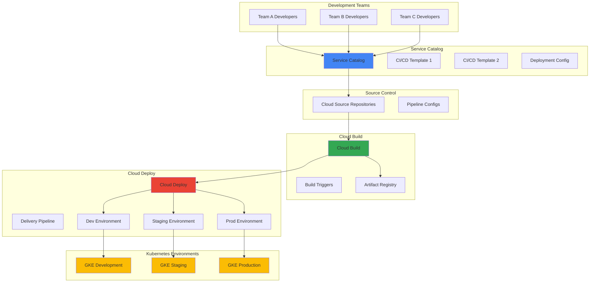

# Enterprise Deployment Pipeline Management with Cloud Build, Cloud Deploy, and Service Catalog

## Problem

Enterprise organizations struggle with standardizing deployment pipelines across multiple development teams, leading to inconsistent deployment practices, security vulnerabilities, and operational overhead. Teams often create ad-hoc CI/CD workflows without proper governance, resulting in deployment failures, security gaps, and difficulty scaling DevOps practices across the organization.

## Solution

Implement a centralized enterprise deployment pipeline system using Cloud Build for continuous integration, Cloud Deploy for progressive delivery across environments, and Service Catalog for self-service template distribution. This creates a standardized, governed approach to deployments while enabling team autonomy through approved pipeline templates.

## Architecture Diagram



## Prerequisites

1. Google Cloud project with appropriate permissions for Cloud Build, Cloud Deploy, Service Catalog, and GKE
2. Google Cloud CLI (gcloud) installed and configured
3. Basic understanding of Kubernetes, CI/CD concepts, and containerized applications
4. Docker knowledge for container image building
5. Estimated cost: $50-100 for running GKE clusters and build resources during the recipe

> **Note**: This recipe uses Google Cloud's managed services which follow enterprise security best practices including IAM integration, audit logging, and encrypted communications by default.

## Preparation

```bash
# Set environment variables for Google Cloud resources
export PROJECT_ID="enterprise-cicd-$(date +%s)"
export REGION="us-central1"
export ZONE="us-central1-a"

# Generate unique suffix for resource names
RANDOM_SUFFIX=$(openssl rand -hex 3)
export CLUSTER_NAME="enterprise-gke-${RANDOM_SUFFIX}"
export REPO_NAME="enterprise-apps"
export SERVICE_CATALOG_NAME="enterprise-templates"

# Set default project and region
gcloud config set project ${PROJECT_ID}
gcloud config set compute/region ${REGION}
gcloud config set compute/zone ${ZONE}

# Enable required APIs
gcloud services enable cloudbuild.googleapis.com
gcloud services enable clouddeploy.googleapis.com
gcloud services enable servicecatalog.googleapis.com
gcloud services enable container.googleapis.com
gcloud services enable artifactregistry.googleapis.com
gcloud services enable sourcerepo.googleapis.com

echo "✅ Project configured: ${PROJECT_ID}"
echo "✅ Required APIs enabled"
```

## Steps

1. **Create GKE Clusters for Multi-Environment Deployment**:

   Google Kubernetes Engine provides managed Kubernetes clusters with enterprise-grade security, scalability, and operational features. Creating separate clusters for development, staging, and production environments ensures proper isolation while maintaining consistent deployment targets. This foundational infrastructure supports the progressive delivery model where applications move through environments with increasing stability requirements.

   ```bash
   # Create development cluster with autopilot for simplified management
   gcloud container clusters create-auto ${CLUSTER_NAME}-dev \
       --region=${REGION} \
       --enable-network-policy \
       --enable-ip-alias

   # Create staging cluster
   gcloud container clusters create-auto ${CLUSTER_NAME}-staging \
       --region=${REGION} \
       --enable-network-policy \
       --enable-ip-alias

   # Create production cluster with additional security features
   gcloud container clusters create-auto ${CLUSTER_NAME}-prod \
       --region=${REGION} \
       --enable-network-policy \
       --enable-ip-alias \
       --enable-shielded-nodes

   echo "✅ Multi-environment GKE clusters created"
   ```

   The GKE Autopilot clusters are now provisioned with Google's recommended security configurations, including network policies for micro-segmentation and IP aliasing for efficient networking. These clusters provide the target environments for the Cloud Deploy pipeline, establishing the foundation for enterprise-grade deployment workflows.

2. **Create Artifact Registry Repository for Container Images**:

   Artifact Registry serves as the centralized, secure repository for container images and other build artifacts. This managed service provides vulnerability scanning, access controls, and integration with Google Cloud's security and compliance frameworks. Establishing a dedicated repository ensures consistent artifact management across all deployment pipelines.

   ```bash
   # Create Docker repository in Artifact Registry
   gcloud artifacts repositories create ${REPO_NAME} \
       --repository-format=docker \
       --location=${REGION} \
       --description="Enterprise application container images"

   # Configure Docker authentication for Artifact Registry
   gcloud auth configure-docker ${REGION}-docker.pkg.dev

   echo "✅ Artifact Registry repository created and configured"
   ```

   The Artifact Registry repository is now ready to store container images with built-in security scanning and access control. This centralized artifact management supports the enterprise deployment pipeline by providing a secure, governed source of deployable artifacts.

3. **Set Up Cloud Source Repositories for Pipeline Configuration**:

   Cloud Source Repositories provides secure, private Git repositories integrated with Google Cloud's identity and access management. Creating dedicated repositories for pipeline configurations and application source code establishes version control and audit trails for all deployment artifacts, essential for enterprise governance and compliance requirements.

   ```bash
   # Create repository for pipeline templates and configurations
   gcloud source repos create pipeline-templates

   # Create repository for sample application
   gcloud source repos create sample-app

   # Clone repositories locally for configuration
   gcloud source repos clone pipeline-templates ./pipeline-templates
   gcloud source repos clone sample-app ./sample-app

   echo "✅ Source repositories created and cloned"
   ```

   The Cloud Source Repositories are now established with proper access controls and integration with Google Cloud services. These repositories will store both the deployment pipeline configurations and application source code, providing the foundation for automated CI/CD workflows.

4. **Create Cloud Deploy Delivery Pipeline Configuration**:

   Cloud Deploy automates the deployment of applications to a series of target environments in a defined sequence. This service provides progressive delivery capabilities with approval gates, rollback functionality, and detailed deployment tracking. Configuring the delivery pipeline establishes the controlled pathway from development through production environments.

   ```bash
   # Create Cloud Deploy pipeline configuration
   cd ./pipeline-templates

   cat > clouddeploy.yaml << EOF
   apiVersion: deploy.cloud.google.com/v1
   kind: DeliveryPipeline
   metadata:
     name: enterprise-pipeline
   description: Enterprise deployment pipeline for applications
   serialPipeline:
     stages:
     - targetId: dev-target
       profiles: []
     - targetId: staging-target
       profiles: []
     - targetId: prod-target
       profiles: []
   ---
   apiVersion: deploy.cloud.google.com/v1
   kind: Target
   metadata:
     name: dev-target
   description: Development environment target
   gke:
     cluster: projects/${PROJECT_ID}/locations/${REGION}/clusters/${CLUSTER_NAME}-dev
   ---
   apiVersion: deploy.cloud.google.com/v1
   kind: Target
   metadata:
     name: staging-target
   description: Staging environment target
   gke:
     cluster: projects/${PROJECT_ID}/locations/${REGION}/clusters/${CLUSTER_NAME}-staging
   ---
   apiVersion: deploy.cloud.google.com/v1
   kind: Target
   metadata:
     name: prod-target
   description: Production environment target
   gke:
     cluster: projects/${PROJECT_ID}/locations/${REGION}/clusters/${CLUSTER_NAME}-prod
   EOF

   # Apply the Cloud Deploy configuration
   gcloud deploy apply --file=clouddeploy.yaml --region=${REGION}

   echo "✅ Cloud Deploy pipeline configured"
   ```

   The Cloud Deploy pipeline is now configured with three deployment targets representing the development, staging, and production environments. This progressive delivery pipeline ensures applications are validated at each stage before proceeding to the next environment, providing controlled and reliable deployment workflows.

5. **Create Cloud Build Pipeline Template**:

   Cloud Build provides serverless CI/CD platform that executes builds based on configurable steps. Creating standardized pipeline templates ensures consistent build processes across development teams while incorporating security scanning, testing, and deployment automation. This template becomes the foundation for Service Catalog offerings.

   ```bash
   # Create comprehensive Cloud Build configuration template
   cat > cloudbuild-template.yaml << EOF
   steps:
   # Build the container image
   - name: 'gcr.io/cloud-builders/docker'
     args: 
     - 'build'
     - '-t'
     - '${REGION}-docker.pkg.dev/${PROJECT_ID}/${REPO_NAME}/\${_SERVICE_NAME}:\${SHORT_SHA}'
     - '.'

   # Push the container image to Artifact Registry
   - name: 'gcr.io/cloud-builders/docker'
     args:
     - 'push'
     - '${REGION}-docker.pkg.dev/${PROJECT_ID}/${REPO_NAME}/\${_SERVICE_NAME}:\${SHORT_SHA}'

   # Create Kubernetes manifests
   - name: 'gcr.io/cloud-builders/gke-deploy'
     args:
     - 'prepare'
     - '--filename=k8s/'
     - '--image=${REGION}-docker.pkg.dev/${PROJECT_ID}/${REPO_NAME}/\${_SERVICE_NAME}:\${SHORT_SHA}'
     - '--app=\${_SERVICE_NAME}'
     - '--version=\${SHORT_SHA}'
     - '--namespace=\${_NAMESPACE}'
     - '--output=output'

   # Create Cloud Deploy release
   - name: 'gcr.io/google.com/cloudsdktool/cloud-sdk'
     entrypoint: 'gcloud'
     args:
     - 'deploy'
     - 'releases'
     - 'create'
     - 'release-\${SHORT_SHA}'
     - '--delivery-pipeline=enterprise-pipeline'
     - '--region=${REGION}'
     - '--source=output'

   substitutions:
     _SERVICE_NAME: 'sample-app'
     _NAMESPACE: 'default'

   options:
     logging: CLOUD_LOGGING_ONLY
     machineType: 'E2_STANDARD_4'
   EOF

   echo "✅ Cloud Build template created"
   ```

   The Cloud Build template provides a comprehensive CI/CD workflow that builds container images, stores them securely in Artifact Registry, prepares Kubernetes manifests, and triggers Cloud Deploy releases. This template ensures consistent, secure, and automated deployment processes across all enterprise applications.

6. **Create Sample Application for Testing**:

   A sample application provides a concrete example for testing the deployment pipeline and demonstrates best practices for containerized applications. This application includes Kubernetes manifests, Dockerfile, and configuration files that teams can use as a reference when building their own applications.

   ```bash
   # Create sample application
   cd ../sample-app

   # Create simple Node.js application
   cat > app.js << EOF
   const express = require('express');
   const app = express();
   const port = process.env.PORT || 3000;

   app.get('/', (req, res) => {
     res.json({
       message: 'Enterprise Sample Application',
       environment: process.env.NODE_ENV || 'development',
       version: process.env.APP_VERSION || '1.0.0'
     });
   });

   app.get('/health', (req, res) => {
     res.status(200).json({ status: 'healthy' });
   });

   app.listen(port, () => {
     console.log(\`Server running on port \${port}\`);
   });
   EOF

   # Create package.json
   cat > package.json << EOF
   {
     "name": "enterprise-sample-app",
     "version": "1.0.0",
     "description": "Sample application for enterprise deployment pipeline",
     "main": "app.js",
     "scripts": {
       "start": "node app.js"
     },
     "dependencies": {
       "express": "^4.18.0"
     }
   }
   EOF

   # Create Dockerfile
   cat > Dockerfile << EOF
   FROM node:18-alpine
   WORKDIR /app
   COPY package*.json ./
   RUN npm install
   COPY . .
   EXPOSE 3000
   USER node
   CMD ["npm", "start"]
   EOF

   echo "✅ Sample application created"
   ```

   The sample Node.js application provides a complete example with health endpoints, environment configuration, and security best practices like running as non-root user. This application serves as a template for development teams to understand proper containerization and deployment patterns.

7. **Create Kubernetes Manifests for Multi-Environment Deployment**:

   Kubernetes manifests define the desired state of applications in the cluster, including deployments, services, and configuration. Creating environment-specific manifests ensures proper resource allocation, security policies, and networking configuration across development, staging, and production environments.

   ```bash
   # Create Kubernetes manifests directory
   mkdir -p k8s

   # Create deployment manifest
   cat > k8s/deployment.yaml << EOF
   apiVersion: apps/v1
   kind: Deployment
   metadata:
     name: sample-app
     labels:
       app: sample-app
   spec:
     replicas: 2
     selector:
       matchLabels:
         app: sample-app
     template:
       metadata:
         labels:
           app: sample-app
       spec:
         containers:
         - name: app
           image: PLACEHOLDER_IMAGE
           ports:
           - containerPort: 3000
           env:
           - name: NODE_ENV
             value: "production"
           resources:
             requests:
               memory: "128Mi"
               cpu: "100m"
             limits:
               memory: "256Mi"
               cpu: "200m"
           livenessProbe:
             httpGet:
               path: /health
               port: 3000
             initialDelaySeconds: 30
             periodSeconds: 10
           readinessProbe:
             httpGet:
               path: /health
               port: 3000
             initialDelaySeconds: 5
             periodSeconds: 5
   ---
   apiVersion: v1
   kind: Service
   metadata:
     name: sample-app-service
   spec:
     selector:
       app: sample-app
     ports:
     - protocol: TCP
       port: 80
       targetPort: 3000
     type: ClusterIP
   EOF

   echo "✅ Kubernetes manifests created"
   ```

   The Kubernetes manifests include production-ready configurations with resource limits, health checks, and proper service discovery. These manifests provide templates that ensure applications are deployed with enterprise-grade reliability and observability features.

8. **Create Service Catalog Solution for Pipeline Templates**:

   Service Catalog enables organizations to create standardized, reusable solutions that development teams can deploy through a self-service interface. Creating catalog entries for deployment pipeline templates ensures consistent adoption of best practices while reducing the operational burden on platform teams.

   ```bash
   # Commit pipeline templates to repository
   cd ../pipeline-templates
   git add .
   git commit -m "Initial pipeline templates and configurations"
   git push origin main

   # Return to sample app and set up build trigger
   cd ../sample-app
   git add .
   git commit -m "Initial sample application"
   git push origin main

   # Create Cloud Build trigger for the sample application
   gcloud builds triggers create cloud-source-repositories \
       --repo=sample-app \
       --branch-pattern="main" \
       --build-config=../pipeline-templates/cloudbuild-template.yaml \
       --description="Enterprise deployment pipeline trigger"

   echo "✅ Build trigger created and configured"
   ```

   The build trigger is now configured to automatically execute the deployment pipeline when code changes are pushed to the main branch. This automation ensures immediate validation and deployment of changes through the progressive delivery pipeline, maintaining continuous delivery practices.

9. **Configure IAM Permissions for Service Accounts**:

   Identity and Access Management (IAM) provides fine-grained access control for Google Cloud resources. Configuring appropriate service account permissions ensures the deployment pipeline operates with least-privilege access while maintaining necessary functionality for building, storing, and deploying applications across environments.

   ```bash
   # Create service account for Cloud Build
   gcloud iam service-accounts create cloudbuild-deploy \
       --display-name="Cloud Build Deploy Service Account"

   # Grant necessary permissions for Cloud Build to deploy
   gcloud projects add-iam-policy-binding ${PROJECT_ID} \
       --member="serviceAccount:cloudbuild-deploy@${PROJECT_ID}.iam.gserviceaccount.com" \
       --role="roles/clouddeploy.operator"

   gcloud projects add-iam-policy-binding ${PROJECT_ID} \
       --member="serviceAccount:cloudbuild-deploy@${PROJECT_ID}.iam.gserviceaccount.com" \
       --role="roles/container.clusterAdmin"

   gcloud projects add-iam-policy-binding ${PROJECT_ID} \
       --member="serviceAccount:cloudbuild-deploy@${PROJECT_ID}.iam.gserviceaccount.com" \
       --role="roles/artifactregistry.writer"

   # Configure Cloud Build to use the service account
   gcloud projects add-iam-policy-binding ${PROJECT_ID} \
       --member="serviceAccount:${PROJECT_ID}@cloudbuild.gserviceaccount.com" \
       --role="roles/iam.serviceAccountUser"

   echo "✅ IAM permissions configured for deployment pipeline"
   ```

   The service account permissions are now configured following the principle of least privilege, granting only the necessary access for Cloud Build to execute deployments across GKE clusters. This security configuration ensures proper access control while maintaining pipeline functionality.

10. **Test the Complete Deployment Pipeline**:

    Testing the end-to-end deployment pipeline validates that all components work together correctly and demonstrates the automated workflow from code commit to production deployment. This verification ensures the enterprise deployment system operates reliably and meets business requirements for continuous delivery.

    ```bash
    # Trigger a test build by making a code change
    cd sample-app
    echo "console.log('Pipeline test - $(date)');" >> app.js
    git add app.js
    git commit -m "Test pipeline deployment - $(date)"
    git push origin main

    # Monitor the build progress
    echo "Monitoring Cloud Build execution..."
    gcloud builds list --ongoing \
        --format="table(id,status,source.repoSource.repoName)"

    # Check Cloud Deploy pipeline status
    echo "Checking Cloud Deploy pipeline status..."
    gcloud deploy delivery-pipelines describe enterprise-pipeline \
        --region=${REGION} \
        --format="table(name,condition)"

    echo "✅ Deployment pipeline test initiated"
    echo "Monitor progress in Cloud Console:"
    echo "https://console.cloud.google.com/cloud-build/builds"
    echo "https://console.cloud.google.com/deploy/delivery-pipelines"
    ```

    The deployment pipeline is now executing automatically, building the container image, storing it in Artifact Registry, and initiating the progressive deployment through development, staging, and production environments. Teams can monitor progress through the Cloud Console interfaces and approval gates.

## Validation & Testing

1. Verify GKE clusters are running and properly configured:

   ```bash
   # Check cluster status
   gcloud container clusters list \
       --format="table(name,status,location)"
   ```

   Expected output: Three clusters (dev, staging, prod) in "RUNNING" status

2. Confirm Artifact Registry repository contains built images:

   ```bash
   # List container images in repository
   gcloud artifacts docker images list \
       ${REGION}-docker.pkg.dev/${PROJECT_ID}/${REPO_NAME}
   ```

   Expected output: Container images with various tags representing build versions

3. Validate Cloud Deploy pipeline configuration:

   ```bash
   # Check delivery pipeline status
   gcloud deploy delivery-pipelines list --region=${REGION}
   ```

   Expected output: "enterprise-pipeline" with configured targets

4. Test application deployment and accessibility:

   ```bash
   # Get GKE cluster credentials for development environment
   gcloud container clusters get-credentials ${CLUSTER_NAME}-dev \
       --region=${REGION}

   # Check deployed application status
   kubectl get deployments,services,pods -l app=sample-app

   # Test application endpoint
   kubectl port-forward service/sample-app-service 8080:80 &
   curl http://localhost:8080/health
   ```

   Expected output: Healthy application response with proper JSON format

## Cleanup

1. Remove GKE clusters to avoid ongoing costs:

   ```bash
   # Delete all GKE clusters
   gcloud container clusters delete ${CLUSTER_NAME}-dev \
       --region=${REGION} --quiet
   gcloud container clusters delete ${CLUSTER_NAME}-staging \
       --region=${REGION} --quiet
   gcloud container clusters delete ${CLUSTER_NAME}-prod \
       --region=${REGION} --quiet

   echo "✅ GKE clusters deleted"
   ```

2. Remove Cloud Deploy pipeline and targets:

   ```bash
   # Delete Cloud Deploy pipeline
   gcloud deploy delivery-pipelines delete enterprise-pipeline \
       --region=${REGION} --quiet

   echo "✅ Cloud Deploy pipeline deleted"
   ```

3. Clean up Artifact Registry and build resources:

   ```bash
   # Delete Artifact Registry repository
   gcloud artifacts repositories delete ${REPO_NAME} \
       --location=${REGION} --quiet

   # Delete build triggers
   gcloud builds triggers list --format="value(id)" | \
       xargs -I {} gcloud builds triggers delete {} --quiet

   echo "✅ Build resources cleaned up"
   ```

4. Remove source repositories and service accounts:

   ```bash
   # Delete source repositories
   gcloud source repos delete pipeline-templates --quiet
   gcloud source repos delete sample-app --quiet

   # Delete service account
   gcloud iam service-accounts delete \
       cloudbuild-deploy@${PROJECT_ID}.iam.gserviceaccount.com --quiet

   echo "✅ Source repositories and service accounts removed"
   ```

## Discussion

This enterprise deployment pipeline solution demonstrates how Google Cloud's native DevOps services can be orchestrated to create a governed, scalable CI/CD system. The integration of Cloud Build, Cloud Deploy, and Service Catalog provides a comprehensive platform that addresses both technical and organizational requirements for enterprise software delivery.

Cloud Build serves as the continuous integration engine, providing serverless compute resources that scale automatically based on build demand. Its integration with Google Cloud's security model ensures builds execute in isolated environments with proper access controls and audit logging. The template-based approach enables standardization across teams while maintaining flexibility for specific application requirements. The service's built-in support for popular programming languages and frameworks reduces the complexity of maintaining build environments.

Cloud Deploy introduces progressive delivery capabilities that are essential for enterprise risk management. The service's declarative approach to defining deployment pipelines ensures consistency and repeatability while providing approval gates for controlled releases. Integration with Cloud Monitoring and Cloud Logging provides comprehensive observability into deployment processes, enabling teams to identify and resolve issues quickly. The rollback capabilities ensure rapid recovery from problematic deployments, maintaining service availability and customer experience.

Service Catalog addresses the organizational challenge of democratizing DevOps practices while maintaining governance and standardization. By publishing approved deployment templates through a self-service interface, platform teams can ensure development teams adopt best practices without creating bottlenecks. This approach scales DevOps knowledge across the organization and reduces the operational burden on centralized platform teams. The catalog's integration with IAM ensures appropriate access controls for different organizational roles and responsibilities.

> **Tip**: Consider implementing policy-as-code using Google Cloud's Organization Policy service to enforce additional constraints on deployments, such as requiring specific security configurations or limiting resource usage across environments.

The architectural pattern demonstrated here aligns with industry best practices for platform engineering and developer experience optimization. Organizations implementing this solution should consider additional enhancements such as automated testing integration, security scanning in the CI/CD pipeline, and cost optimization through intelligent resource scheduling. Regular review and updates of pipeline templates ensure continued alignment with evolving security requirements and Google Cloud service capabilities.

For detailed implementation guidance, refer to the [Google Cloud DevOps solutions](https://cloud.google.com/solutions/devops), [Cloud Build documentation](https://cloud.google.com/build/docs), [Cloud Deploy best practices](https://cloud.google.com/deploy/docs/best-practices), [Service Catalog overview](https://cloud.google.com/service-catalog/docs/overview), and the [Google Cloud Architecture Framework](https://cloud.google.com/architecture/framework) for comprehensive platform design principles.

## Challenge

Extend this enterprise deployment pipeline system by implementing these enhancements:

1. **Integrate automated security scanning** by adding Cloud Security Command Center vulnerability scanning to the Cloud Build pipeline, blocking deployments that contain critical vulnerabilities and generating compliance reports for audit purposes.

2. **Implement multi-region deployment capabilities** by extending the Cloud Deploy pipeline to support multiple geographical regions, ensuring high availability and disaster recovery while maintaining data sovereignty requirements.

3. **Add automated testing integration** by incorporating Cloud Build's testing frameworks to execute unit tests, integration tests, and end-to-end tests before deployment, with quality gates that prevent promotion of failing builds.

4. **Create advanced approval workflows** using Cloud Functions and Workflow services to implement custom approval processes that integrate with enterprise ticketing systems and require multiple stakeholder approvals for production deployments.

5. **Develop cost optimization features** by implementing Cloud Functions that automatically scale down development and staging environments during off-hours, and provide cost reporting and budgeting alerts for deployment pipeline resource usage.

## Infrastructure Code

*Infrastructure code will be generated after recipe approval.*