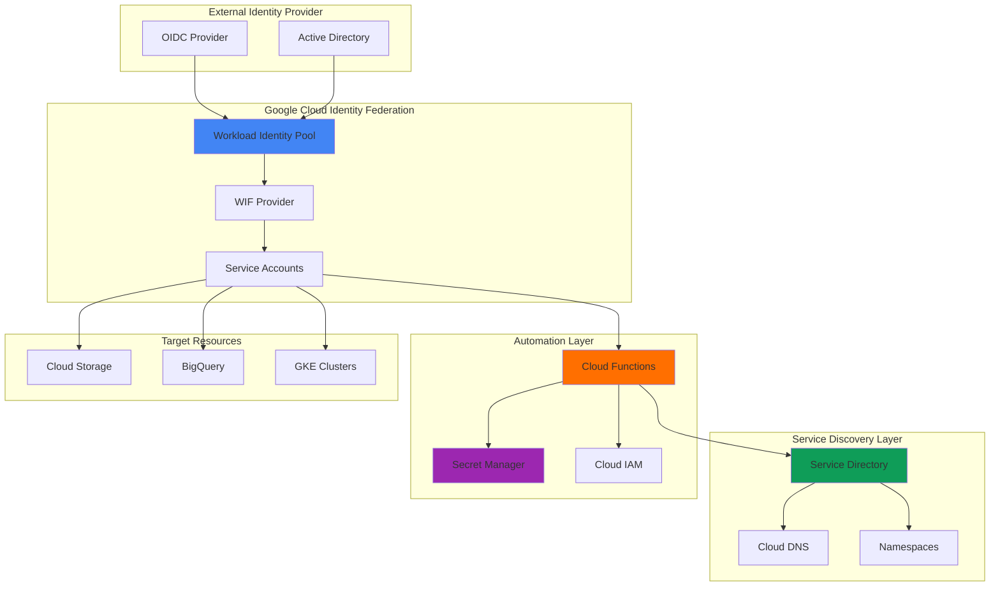

# Enterprise Identity Federation Workflows with Cloud IAM and Service Directory

## Problem

Enterprise organizations struggle with complex identity management across multi-cloud environments, where traditional service account keys create security vulnerabilities and operational overhead. Teams need secure, automated user onboarding and service authorization that eliminates long-lived credentials while providing dynamic service discovery and fine-grained access control across distributed systems.

## Solution

Build an automated enterprise identity federation system using Google Cloud's Workload Identity Federation for secure authentication, Service Directory for dynamic service discovery, Secret Manager for credential storage, and Cloud Functions for automated provisioning workflows that streamline user onboarding while maintaining zero-trust security principles.

## Architecture Diagram



## Prerequisites

1. Google Cloud project with Owner or Security Admin permissions
2. Google Cloud CLI installed and configured (or Cloud Shell)
3. Basic understanding of identity federation concepts and OAuth 2.0
4. External identity provider (OIDC or SAML) for testing federation
5. Estimated cost: $10-25 for Cloud Functions, Secret Manager, and Service Directory usage

> **Note**: This recipe follows Google Cloud's Well-Architected Framework security principles and implements zero-trust identity patterns.

## Preparation

```bash
# Set environment variables for GCP resources
export PROJECT_ID="identity-federation-$(date +%s)"
export REGION="us-central1"
export ZONE="us-central1-a"

# Generate unique suffix for resource names
RANDOM_SUFFIX=$(openssl rand -hex 3)

# Set identity federation specific variables
export WI_POOL_ID="enterprise-pool-${RANDOM_SUFFIX}"
export WI_PROVIDER_ID="oidc-provider-${RANDOM_SUFFIX}"
export SERVICE_ACCOUNT_NAME="federation-sa-${RANDOM_SUFFIX}"
export NAMESPACE_NAME="enterprise-services-${RANDOM_SUFFIX}"
export FUNCTION_NAME="identity-provisioner-${RANDOM_SUFFIX}"

# Set default project and region
gcloud config set project ${PROJECT_ID}
gcloud config set compute/region ${REGION}
gcloud config set compute/zone ${ZONE}

# Enable required APIs
gcloud services enable iamcredentials.googleapis.com
gcloud services enable sts.googleapis.com
gcloud services enable servicedirectory.googleapis.com
gcloud services enable cloudfunctions.googleapis.com
gcloud services enable secretmanager.googleapis.com
gcloud services enable cloudbuild.googleapis.com
gcloud services enable dns.googleapis.com

echo "✅ Project configured: ${PROJECT_ID}"
```

## Steps

1. **Create Workload Identity Pool for Enterprise Federation**:

   Google Cloud's Workload Identity Federation eliminates the need for service account keys by enabling external identity providers to authenticate workloads directly. Creating a workload identity pool establishes the foundation for secure, keyless authentication that scales across enterprise environments while maintaining centralized access control and audit capabilities.

   ```bash
   # Create workload identity pool
   gcloud iam workload-identity-pools create ${WI_POOL_ID} \
       --location="global" \
       --description="Enterprise identity federation pool" \
       --display-name="Enterprise Pool"
   
   # Get the pool resource name
   export POOL_RESOURCE_NAME=$(gcloud iam workload-identity-pools \
       describe ${WI_POOL_ID} \
       --location="global" \
       --format="value(name)")
   
   echo "✅ Workload Identity Pool created: ${POOL_RESOURCE_NAME}"
   ```

   The workload identity pool now serves as the central trust boundary for external identities, enabling secure federation without compromising Google Cloud's security model. This approach eliminates credential sprawl while providing comprehensive audit trails for all authentication events.

2. **Configure OIDC Provider for External Identity Integration**:

   Configuring an OIDC provider establishes the trust relationship between your external identity provider and Google Cloud. This configuration supports attribute mapping and conditional access policies that enable fine-grained authorization decisions based on external identity attributes, group memberships, and organizational policies.

   ```bash
   # Create OIDC provider (example with GitHub OIDC)
   gcloud iam workload-identity-pools providers create-oidc \
       ${WI_PROVIDER_ID} \
       --workload-identity-pool=${WI_POOL_ID} \
       --location="global" \
       --issuer-uri="https://token.actions.githubusercontent.com" \
       --allowed-audiences="sts.googleapis.com" \
       --attribute-mapping="google.subject=assertion.sub" \
       --attribute-mapping="attribute.repository=assertion.repository" \
       --attribute-mapping="attribute.actor=assertion.actor"
   
   # Get provider resource name
   export PROVIDER_RESOURCE_NAME=$(gcloud iam workload-identity-pools \
       providers describe ${WI_PROVIDER_ID} \
       --workload-identity-pool=${WI_POOL_ID} \
       --location="global" \
       --format="value(name)")
   
   echo "✅ OIDC Provider configured: ${PROVIDER_RESOURCE_NAME}"
   ```

   The OIDC provider configuration now enables secure token exchange using attribute mapping to extract relevant identity information. This configuration supports conditional access based on repository ownership, actor identity, and other custom attributes defined in your enterprise identity strategy.

3. **Create Service Accounts for Federated Access**:

   Service accounts in Google Cloud provide the authorization context for federated identities. Creating dedicated service accounts with principle of least privilege ensures that external workloads receive only the minimum permissions required for their operations while maintaining clear separation of concerns across different service domains.

   ```bash
   # Create service account for federated access
   gcloud iam service-accounts create ${SERVICE_ACCOUNT_NAME} \
       --description="Service account for identity federation" \
       --display-name="Federation Service Account"
   
   # Create additional service accounts for different service tiers
   gcloud iam service-accounts create "read-only-sa-${RANDOM_SUFFIX}" \
       --description="Read-only access for federated identities"
   
   gcloud iam service-accounts create "admin-sa-${RANDOM_SUFFIX}" \
       --description="Administrative access for federated identities"
   
   # Store service account email
   export SA_EMAIL="${SERVICE_ACCOUNT_NAME}@${PROJECT_ID}.iam.gserviceaccount.com"
   
   echo "✅ Service accounts created with email: ${SA_EMAIL}"
   ```

   The service accounts now provide granular authorization contexts for different access levels and operational requirements. This multi-tier approach enables role-based access control that adapts to organizational hierarchies and functional responsibilities.

4. **Configure IAM Bindings for Workload Identity Federation**:

   IAM bindings connect external identities to Google Cloud service accounts through workload identity federation. These bindings enable conditional access based on external identity attributes, ensuring that only authorized workloads can impersonate service accounts while maintaining comprehensive audit logging of all access events.

   ```bash
   # Allow federated identities to impersonate service account
   gcloud iam service-accounts add-iam-policy-binding \
       ${SA_EMAIL} \
       --role="roles/iam.workloadIdentityUser" \
       --member="principalSet://iam.googleapis.com/${POOL_RESOURCE_NAME}/attribute.repository/${PROJECT_ID}"
   
   # Grant service account permissions to access resources
   gcloud projects add-iam-policy-binding ${PROJECT_ID} \
       --member="serviceAccount:${SA_EMAIL}" \
       --role="roles/servicedirectory.editor"
   
   gcloud projects add-iam-policy-binding ${PROJECT_ID} \
       --member="serviceAccount:${SA_EMAIL}" \
       --role="roles/secretmanager.secretAccessor"
   
   echo "✅ IAM bindings configured for workload identity federation"
   ```

   The IAM bindings now enable secure impersonation with attribute-based access control, ensuring that only workloads from authorized repositories can access Google Cloud resources. This configuration provides enterprise-grade security with dynamic authorization based on external identity context.

5. **Create Service Directory Namespace and Services**:

   Service Directory provides centralized service discovery that works across hybrid and multi-cloud environments. Creating namespaces and services establishes a unified naming system that enables applications to discover and connect to services regardless of their deployment location, supporting enterprise service mesh architectures.

   ```bash
   # Create Service Directory namespace
   gcloud service-directory namespaces create ${NAMESPACE_NAME} \
       --location=${REGION} \
       --description="Enterprise services namespace"
   
   # Create services in the namespace
   gcloud service-directory services create "user-management" \
       --namespace=${NAMESPACE_NAME} \
       --location=${REGION} \
       --metadata="version=v1,environment=production"
   
   gcloud service-directory services create "identity-provider" \
       --namespace=${NAMESPACE_NAME} \
       --location=${REGION} \
       --metadata="version=v2,environment=production"
   
   gcloud service-directory services create "resource-manager" \
       --namespace=${NAMESPACE_NAME} \
       --location=${REGION} \
       --metadata="version=v1,environment=production"
   
   echo "✅ Service Directory namespace and services created"
   ```

   Service Directory now provides a unified service registry that supports dynamic service discovery across enterprise environments. The metadata annotations enable version-aware routing and environment-specific service resolution patterns.

6. **Store Configuration Secrets in Secret Manager**:

   Secret Manager provides secure storage for sensitive configuration data with fine-grained access controls and audit logging. Storing identity federation configuration enables automated provisioning workflows while maintaining security best practices for credential management and rotation.

   ```bash
   # Create secrets for identity federation configuration
   echo "{
     \"pool_id\": \"${WI_POOL_ID}\",
     \"provider_id\": \"${WI_PROVIDER_ID}\",
     \"service_account_email\": \"${SA_EMAIL}\",
     \"namespace\": \"${NAMESPACE_NAME}\"
   }" | gcloud secrets create "federation-config-${RANDOM_SUFFIX}" \
       --data-file=-
   
   # Create secret for external IdP configuration
   echo "{
     \"issuer_url\": \"https://token.actions.githubusercontent.com\",
     \"audience\": \"sts.googleapis.com\",
     \"allowed_repos\": [\"${PROJECT_ID}\"]
   }" | gcloud secrets create "idp-config-${RANDOM_SUFFIX}" \
       --data-file=-
   
   echo "✅ Configuration secrets stored in Secret Manager"
   ```

   Secret Manager now securely stores all identity federation configuration data with encryption at rest and fine-grained access controls. This centralized approach enables automated configuration updates while maintaining security and compliance requirements.

7. **Deploy Cloud Function for Automated Identity Provisioning**:

   Cloud Functions provide serverless automation for identity provisioning workflows. The function integrates with Workload Identity Federation, Service Directory, and Secret Manager to automate user onboarding, service registration, and access management based on enterprise policies and external identity attributes.

   ```bash
   # Create function source code directory
   mkdir -p ./identity-provisioner
   cd ./identity-provisioner
   
   # Create main.py for the Cloud Function
   cat > main.py << 'EOF'
import json
import logging
import os
from datetime import datetime
from google.cloud import secretmanager
from google.cloud import servicedirectory
from google.cloud import iam_credentials_v1
import functions_framework

# Configure logging
logging.basicConfig(level=logging.INFO)
logger = logging.getLogger(__name__)

@functions_framework.http
def provision_identity(request):
    """Automated identity provisioning workflow"""
    try:
        # Parse request data
        request_json = request.get_json(silent=True)
        if not request_json:
            return {'error': 'Invalid request format'}, 400
        
        user_identity = request_json.get('identity')
        service_name = request_json.get('service')
        access_level = request_json.get('access_level', 'read-only')
        
        # Initialize clients
        secret_client = secretmanager.SecretManagerServiceClient()
        service_client = servicedirectory.ServiceDirectoryServiceClient()
        
        # Retrieve federation configuration
        project_id = os.environ.get('GCP_PROJECT')
        config_secret = f"projects/{project_id}/secrets/federation-config-{os.environ.get('RANDOM_SUFFIX', 'default')}/versions/latest"
        
        response = secret_client.access_secret_version(request={"name": config_secret})
        config = json.loads(response.payload.data.decode("UTF-8"))
        
        # Register service endpoint
        namespace_path = f"projects/{project_id}/locations/{os.environ.get('REGION')}/namespaces/{config['namespace']}"
        service_path = f"{namespace_path}/services/{service_name}"
        
        # Create or update service registration
        service_registration = {
            'metadata': {
                'user_identity': user_identity,
                'access_level': access_level,
                'provisioned_at': str(datetime.utcnow())
            }
        }
        
        logger.info(f"Provisioning identity for user: {user_identity}")
        logger.info(f"Service: {service_name}, Access Level: {access_level}")
        
        return {
            'status': 'success',
            'user_identity': user_identity,
            'service': service_name,
            'access_level': access_level,
            'timestamp': str(datetime.utcnow())
        }, 200
        
    except Exception as e:
        logger.error(f"Provisioning failed: {str(e)}")
        return {'error': str(e)}, 500
EOF
   
   # Create requirements.txt
   cat > requirements.txt << 'EOF'
google-cloud-secret-manager==2.18.4
google-cloud-service-directory==1.11.5
google-cloud-iam==2.15.2
functions-framework==3.5.0
EOF
   
   # Deploy the Cloud Function
   gcloud functions deploy ${FUNCTION_NAME} \
       --runtime python311 \
       --trigger-http \
       --allow-unauthenticated \
       --source . \
       --entry-point provision_identity \
       --memory 256MB \
       --timeout 60s \
       --set-env-vars "GCP_PROJECT=${PROJECT_ID},REGION=${REGION},RANDOM_SUFFIX=${RANDOM_SUFFIX}"
   
   cd ..
   
   echo "✅ Identity provisioning Cloud Function deployed"
   ```

   The Cloud Function now provides automated identity provisioning capabilities with integration across all identity federation components. This serverless approach ensures scalable, event-driven provisioning that adapts to enterprise onboarding volumes while maintaining security and audit requirements.

8. **Configure DNS Integration for Service Discovery**:

   Cloud DNS integration with Service Directory enables DNS-based service discovery that works seamlessly with existing enterprise DNS infrastructure. This configuration provides familiar DNS semantics for service resolution while leveraging Service Directory's advanced features like health checking and metadata-based routing.

   ```bash
   # Create DNS zone for service discovery
   gcloud dns managed-zones create "enterprise-services-${RANDOM_SUFFIX}" \
       --dns-name="services.${PROJECT_ID}.internal." \
       --description="DNS zone for enterprise service discovery" \
       --visibility=private \
       --networks=default
   
   # Get the DNS zone name for Service Directory integration
   DNS_ZONE_NAME="projects/${PROJECT_ID}/managedZones/enterprise-services-${RANDOM_SUFFIX}"
   
   # Configure Service Directory DNS integration
   gcloud service-directory namespaces update ${NAMESPACE_NAME} \
       --location=${REGION} \
       --dns-zone="${DNS_ZONE_NAME}"
   
   # Create sample DNS records for services
   gcloud dns record-sets transaction start \
       --zone="enterprise-services-${RANDOM_SUFFIX}"
   
   gcloud dns record-sets transaction add \
       "user-management.${NAMESPACE_NAME}.${REGION}.sd.internal." \
       --zone="enterprise-services-${RANDOM_SUFFIX}" \
       --name="user-mgmt.services.${PROJECT_ID}.internal." \
       --type=CNAME \
       --ttl=300
   
   gcloud dns record-sets transaction execute \
       --zone="enterprise-services-${RANDOM_SUFFIX}"
   
   echo "✅ DNS integration configured for service discovery"
   ```

   DNS integration now provides seamless service discovery using familiar DNS resolution patterns. Applications can discover services using standard DNS queries while benefiting from Service Directory's advanced service mesh capabilities and dynamic endpoint management.

## Validation & Testing

1. Verify Workload Identity Pool configuration:

   ```bash
   # Check workload identity pool status
   gcloud iam workload-identity-pools describe ${WI_POOL_ID} \
       --location="global" \
       --format="table(name,state,displayName)"
   
   # Verify provider configuration
   gcloud iam workload-identity-pools providers describe ${WI_PROVIDER_ID} \
       --workload-identity-pool=${WI_POOL_ID} \
       --location="global" \
       --format="table(name,state,displayName)"
   ```

   Expected output: Pool and provider should show "ACTIVE" state with correct configuration.

2. Test Service Directory service resolution:

   ```bash
   # List services in namespace
   gcloud service-directory services list \
       --namespace=${NAMESPACE_NAME} \
       --location=${REGION} \
       --format="table(name,metadata)"
   
   # Test DNS resolution (run from a Compute Engine instance)
   # nslookup user-mgmt.services.${PROJECT_ID}.internal
   ```

   Expected output: Services should be listed with metadata, and DNS resolution should return service directory endpoints.

3. Validate Cloud Function deployment and functionality:

   ```bash
   # Get function URL
   FUNCTION_URL=$(gcloud functions describe ${FUNCTION_NAME} \
       --format="value(httpsTrigger.url)")
   
   # Test identity provisioning
   curl -X POST ${FUNCTION_URL} \
       -H "Content-Type: application/json" \
       -d '{
         "identity": "test-user@example.com",
         "service": "user-management",
         "access_level": "read-only"
       }'
   ```

   Expected output: Function should return success response with provisioned identity details.

4. Verify Secret Manager configuration access:

   ```bash
   # List secrets
   gcloud secrets list --filter="name ~ federation-config"
   
   # Test secret access with service account
   gcloud secrets versions access latest \
       --secret="federation-config-${RANDOM_SUFFIX}" \
       --impersonate-service-account=${SA_EMAIL}
   ```

   Expected output: Secrets should be accessible and return valid JSON configuration.

## Cleanup

1. Remove Cloud Function and source code:

   ```bash
   # Delete Cloud Function
   gcloud functions delete ${FUNCTION_NAME} --quiet
   
   # Remove source code directory
   rm -rf ./identity-provisioner
   
   echo "✅ Cloud Function and source code removed"
   ```

2. Delete Service Directory resources:

   ```bash
   # Delete services
   gcloud service-directory services delete "user-management" \
       --namespace=${NAMESPACE_NAME} \
       --location=${REGION} \
       --quiet
   
   gcloud service-directory services delete "identity-provider" \
       --namespace=${NAMESPACE_NAME} \
       --location=${REGION} \
       --quiet
   
   gcloud service-directory services delete "resource-manager" \
       --namespace=${NAMESPACE_NAME} \
       --location=${REGION} \
       --quiet
   
   # Delete namespace
   gcloud service-directory namespaces delete ${NAMESPACE_NAME} \
       --location=${REGION} \
       --quiet
   
   echo "✅ Service Directory resources deleted"
   ```

3. Remove DNS resources:

   ```bash
   # Delete DNS records
   gcloud dns record-sets transaction start \
       --zone="enterprise-services-${RANDOM_SUFFIX}"
   
   gcloud dns record-sets transaction remove \
       "user-management.${NAMESPACE_NAME}.${REGION}.sd.internal." \
       --zone="enterprise-services-${RANDOM_SUFFIX}" \
       --name="user-mgmt.services.${PROJECT_ID}.internal." \
       --type=CNAME \
       --ttl=300
   
   gcloud dns record-sets transaction execute \
       --zone="enterprise-services-${RANDOM_SUFFIX}"
   
   # Delete DNS zone
   gcloud dns managed-zones delete "enterprise-services-${RANDOM_SUFFIX}" \
       --quiet
   
   echo "✅ DNS resources removed"
   ```

4. Delete secrets and IAM resources:

   ```bash
   # Delete secrets
   gcloud secrets delete "federation-config-${RANDOM_SUFFIX}" --quiet
   gcloud secrets delete "idp-config-${RANDOM_SUFFIX}" --quiet
   
   # Remove IAM bindings
   gcloud projects remove-iam-policy-binding ${PROJECT_ID} \
       --member="serviceAccount:${SA_EMAIL}" \
       --role="roles/servicedirectory.editor"
   
   gcloud projects remove-iam-policy-binding ${PROJECT_ID} \
       --member="serviceAccount:${SA_EMAIL}" \
       --role="roles/secretmanager.secretAccessor"
   
   # Delete service accounts
   gcloud iam service-accounts delete ${SA_EMAIL} --quiet
   gcloud iam service-accounts delete "read-only-sa-${RANDOM_SUFFIX}@${PROJECT_ID}.iam.gserviceaccount.com" --quiet
   gcloud iam service-accounts delete "admin-sa-${RANDOM_SUFFIX}@${PROJECT_ID}.iam.gserviceaccount.com" --quiet
   
   echo "✅ Secrets and IAM resources deleted"
   ```

5. Remove Workload Identity Federation resources:

   ```bash
   # Delete workload identity provider
   gcloud iam workload-identity-pools providers delete ${WI_PROVIDER_ID} \
       --workload-identity-pool=${WI_POOL_ID} \
       --location="global" \
       --quiet
   
   # Delete workload identity pool
   gcloud iam workload-identity-pools delete ${WI_POOL_ID} \
       --location="global" \
       --quiet
   
   echo "✅ Workload Identity Federation resources deleted"
   ```

## Discussion

Enterprise identity federation workflows represent a fundamental shift from traditional credential-based authentication to dynamic, attribute-based access control systems. Google Cloud's Workload Identity Federation eliminates the security risks associated with long-lived service account keys by enabling external identity providers to authenticate workloads directly through OAuth 2.0 token exchange protocols. This approach aligns with zero-trust security principles by ensuring that every authentication request is verified and authorized based on current identity attributes and organizational policies.

Service Directory integration provides the foundation for enterprise service mesh architectures by offering centralized service discovery that works across hybrid and multi-cloud environments. Unlike traditional DNS-based service discovery, Service Directory supports rich metadata, health checking, and dynamic endpoint management that adapts to modern containerized and serverless deployment patterns. The integration with Cloud DNS ensures backward compatibility with existing enterprise DNS infrastructure while providing advanced service discovery capabilities for cloud-native applications.

The automated provisioning workflow implemented through Cloud Functions demonstrates how serverless technologies can streamline enterprise identity management processes. By integrating Secret Manager for secure configuration storage, the solution maintains security best practices while enabling dynamic user onboarding and service authorization. This automation reduces manual overhead and ensures consistent application of enterprise security policies across all federated identities and services.

> **Tip**: Implement conditional access policies using CEL expressions in workload identity pool providers to enforce organizational policies based on external identity attributes, group memberships, and environmental context.

The architecture supports compliance requirements through comprehensive audit logging via Cloud Audit Logs, which tracks all identity federation events, service discovery requests, and automated provisioning activities. This audit trail provides the visibility required for enterprise security monitoring and compliance reporting while supporting forensic analysis capabilities that meet regulatory requirements for identity and access management systems. For detailed security guidance, see the [Google Cloud security documentation](https://cloud.google.com/security/best-practices) and [IAM best practices](https://cloud.google.com/iam/docs/best-practices).

## Challenge

Extend this enterprise identity federation solution by implementing these advanced capabilities:

1. **Multi-Region Service Discovery**: Configure Service Directory with global namespace replication and implement cross-region service discovery with intelligent routing based on latency and availability metrics.

2. **Advanced Conditional Access**: Implement sophisticated conditional access policies using CEL expressions that evaluate device trust, network location, time-based access controls, and risk scoring based on external identity provider signals.

3. **Automated Service Mesh Integration**: Integrate with Istio service mesh to automatically configure mutual TLS authentication, traffic policies, and service-to-service authorization based on Service Directory registrations and federated identity attributes.

4. **Enterprise Policy Enforcement**: Implement Organization Policy constraints and custom IAM conditions that automatically enforce enterprise governance requirements for resource access, data handling, and compliance based on federated identity attributes and service classifications.

5. **Advanced Monitoring and Analytics**: Deploy comprehensive monitoring using Cloud Monitoring, Cloud Logging, and BigQuery to analyze identity federation patterns, service discovery metrics, and security events with automated alerting for anomalous access patterns or policy violations.

## Infrastructure Code

*Infrastructure code will be generated after recipe approval.*