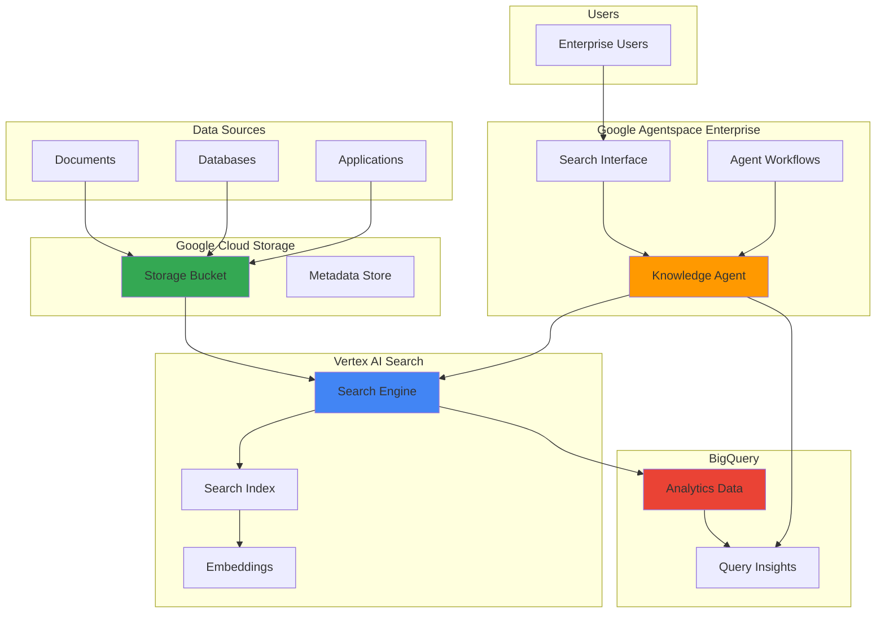

# Enterprise Knowledge Discovery with Google Agentspace and Vertex AI Search

## Problem

Organizations struggle with information silos across departments, making it difficult for employees to find relevant knowledge from documents, databases, and systems spread throughout the enterprise. Traditional search tools lack semantic understanding and context, forcing workers to search multiple systems manually while missing critical insights that could drive better decision-making and innovation.

## Solution

This recipe demonstrates how to build an intelligent enterprise knowledge discovery system using Google Agentspace Enterprise and Vertex AI Search. We'll create a unified search interface that combines semantic document retrieval with AI-powered insights, allowing employees to query organizational data using natural language while receiving contextual answers grounded in enterprise content.

## Architecture Diagram



## Prerequisites

1. Google Cloud project with billing enabled and appropriate permissions
2. Google Cloud CLI installed and configured (or use Cloud Shell)
3. Basic understanding of Google Cloud IAM and storage concepts
4. Familiarity with enterprise search and AI concepts
5. Sample enterprise documents and data sources for testing
6. Estimated cost: $50-100 USD for initial setup and testing (varies by data volume)

> **Note**: Google Agentspace Enterprise is generally available but may require enterprise licensing. Some features may have regional availability limitations.

## Preparation

```bash
# Set environment variables for the project
export PROJECT_ID="enterprise-knowledge-$(date +%s)"
export REGION="us-central1"
export ZONE="us-central1-a"

# Generate unique suffix for resource names
RANDOM_SUFFIX=$(openssl rand -hex 3)
export BUCKET_NAME="enterprise-docs-${RANDOM_SUFFIX}"
export DATASET_NAME="knowledge_analytics_${RANDOM_SUFFIX}"
export SEARCH_APP_ID="enterprise-search-${RANDOM_SUFFIX}"

# Set default project and region
gcloud config set project ${PROJECT_ID}
gcloud config set compute/region ${REGION}
gcloud config set compute/zone ${ZONE}

# Enable required APIs
gcloud services enable discoveryengine.googleapis.com
gcloud services enable storage.googleapis.com
gcloud services enable bigquery.googleapis.com
gcloud services enable aiplatform.googleapis.com

echo "✅ Project configured: ${PROJECT_ID}"
echo "✅ Required APIs enabled"
```

## Steps

1. **Create Cloud Storage Bucket for Document Repository**:

   Google Cloud Storage provides unified object storage with global edge caching and strong consistency guarantees. Creating a bucket with appropriate location and storage class settings establishes the foundation for a document repository that can scale from gigabytes to exabytes while maintaining high performance and cost efficiency for enterprise knowledge systems.

   ```bash
   # Create storage bucket for enterprise documents
   gsutil mb -p ${PROJECT_ID} \
       -c STANDARD \
       -l ${REGION} \
       gs://${BUCKET_NAME}
   
   # Enable versioning for document protection
   gsutil versioning set on gs://${BUCKET_NAME}
   
   # Set up lifecycle policy for cost optimization
   cat > lifecycle.json << 'EOF'
   {
     "rule": [
       {
         "action": {"type": "SetStorageClass", "storageClass": "NEARLINE"},
         "condition": {"age": 30}
       },
       {
         "action": {"type": "SetStorageClass", "storageClass": "COLDLINE"},
         "condition": {"age": 90}
       }
     ]
   }
   EOF
   
   gsutil lifecycle set lifecycle.json gs://${BUCKET_NAME}
   
   echo "✅ Storage bucket created: gs://${BUCKET_NAME}"
   ```

   The storage bucket is now ready with versioning enabled and automated lifecycle management, providing both data protection and cost optimization. This foundational component supports the entire knowledge discovery pipeline, from document ingestion through search and analytics.

2. **Upload Sample Enterprise Documents**:

   Document ingestion is the first step in creating a comprehensive knowledge base. By uploading diverse document types with proper metadata and organization, we establish a structured repository that Vertex AI Search can efficiently index and semantic search capabilities can leverage for accurate retrieval.

   ```bash
   # Create sample enterprise documents
   mkdir -p sample_docs
   
   # Generate HR policy document
   cat > sample_docs/hr_policy.txt << 'EOF'
   Employee Handbook - Remote Work Policy
   
   Effective Date: January 2024
   
   Remote Work Guidelines:
   - Employees may work remotely up to 3 days per week
   - Home office setup must meet security requirements
   - Daily check-ins required with immediate supervisor
   - Collaboration tools: Google Meet, Slack, Asana
   
   Equipment Policy:
   - Company provides laptop, monitor, and chair
   - IT support available 24/7 for remote workers
   - VPN access mandatory for all remote connections
   EOF
   
   # Generate technical documentation
   cat > sample_docs/api_documentation.txt << 'EOF'
   API Documentation - Customer Service Platform
   
   Version: 2.1.0
   Last Updated: March 2024
   
   Authentication:
   - OAuth 2.0 with JWT tokens
   - API key required for all requests
   - Rate limiting: 1000 requests per hour
   
   Endpoints:
   - GET /customers - Retrieve customer list
   - POST /customers - Create new customer
   - PUT /customers/{id} - Update customer information
   - DELETE /customers/{id} - Remove customer
   
   Error Handling:
   - 400: Bad Request - Invalid parameters
   - 401: Unauthorized - Invalid credentials
   - 429: Too Many Requests - Rate limit exceeded
   EOF
   
   # Generate financial report
   cat > sample_docs/financial_report.txt << 'EOF'
   Quarterly Financial Report - Q1 2024
   
   Revenue Summary:
   - Total Revenue: $2.5M (up 15% YoY)
   - Subscription Revenue: $1.8M (72% of total)
   - Professional Services: $700K (28% of total)
   
   Expenses:
   - Personnel: $1.2M (48% of revenue)
   - Technology: $400K (16% of revenue)
   - Marketing: $300K (12% of revenue)
   - Operations: $200K (8% of revenue)
   
   Key Metrics:
   - Monthly Recurring Revenue (MRR): $600K
   - Customer Acquisition Cost (CAC): $150
   - Customer Lifetime Value (CLV): $2,400
   EOF
   
   # Upload documents to Cloud Storage
   gsutil -m cp sample_docs/*.txt gs://${BUCKET_NAME}/documents/
   
   echo "✅ Sample documents uploaded to storage bucket"
   ```

   The enterprise document repository is now populated with representative content spanning HR policies, technical documentation, and financial reports. This diverse content provides the foundation for testing semantic search capabilities and knowledge discovery workflows.

3. **Create BigQuery Dataset for Analytics**:

   BigQuery serves as the analytical backbone for enterprise knowledge discovery, providing serverless data warehousing capabilities that can process petabytes of data with sub-second query performance. Creating a dedicated dataset enables tracking of search patterns, user behaviors, and content effectiveness metrics.

   ```bash
   # Create BigQuery dataset for search analytics
   bq mk --dataset \
       --description "Enterprise knowledge discovery analytics" \
       --location=${REGION} \
       ${PROJECT_ID}:${DATASET_NAME}
   
   # Create table for search queries and results
   bq mk --table \
       ${PROJECT_ID}:${DATASET_NAME}.search_queries \
       query_id:STRING,user_id:STRING,query_text:STRING,timestamp:TIMESTAMP,results_count:INTEGER,click_through_rate:FLOAT
   
   # Create table for document usage analytics
   bq mk --table \
       ${PROJECT_ID}:${DATASET_NAME}.document_analytics \
       document_id:STRING,document_name:STRING,view_count:INTEGER,last_accessed:TIMESTAMP,relevance_score:FLOAT
   
   echo "✅ BigQuery dataset created: ${DATASET_NAME}"
   ```

   The analytics infrastructure is now ready to capture and analyze search patterns, enabling continuous improvement of the knowledge discovery system through data-driven insights and performance optimization.

4. **Create Vertex AI Search Application**:

   Vertex AI Search leverages Google's semantic search technologies to provide enterprise-grade search capabilities with automatic content understanding, relevance ranking, and personalization. The search application serves as the core retrieval engine that powers intelligent knowledge discovery.

   ```bash
   # Create Vertex AI Search data store
   gcloud alpha discovery-engine data-stores create \
       --data-store-id=${SEARCH_APP_ID} \
       --display-name="Enterprise Knowledge Search" \
       --industry-vertical=GENERIC \
       --solution-type=SOLUTION_TYPE_SEARCH \
       --content-config=CONTENT_REQUIRED \
       --location=global
   
   # Import documents from Cloud Storage
   gcloud alpha discovery-engine documents import \
       --data-store=${SEARCH_APP_ID} \
       --location=global \
       --gcs-uri=gs://${BUCKET_NAME}/documents/* \
       --id-field=uri
   
   # Create search engine
   gcloud alpha discovery-engine engines create \
       --engine-id=${SEARCH_APP_ID}-engine \
       --display-name="Enterprise Knowledge Engine" \
       --data-store-ids=${SEARCH_APP_ID} \
       --location=global \
       --industry-vertical=GENERIC \
       --solution-type=SOLUTION_TYPE_SEARCH
   
   echo "✅ Vertex AI Search application created"
   echo "✅ Document import initiated (may take 10-15 minutes)"
   ```

   The Vertex AI Search application is now configured and beginning document ingestion. The system will automatically extract text, generate embeddings, and create searchable indices that enable semantic matching beyond simple keyword searches.

5. **Configure Search Index and Embeddings**:

   Search index configuration and embeddings generation are critical for semantic understanding of enterprise content. This step optimizes the search system for domain-specific terminology, document relationships, and contextual relevance that drives accurate knowledge discovery.

   ```bash
   # Wait for document import to complete
   echo "Waiting for document import to complete..."
   sleep 180
   
   # Check import status
   gcloud alpha discovery-engine operations list \
       --location=global \
       --filter="metadata.type:IMPORT_DOCUMENTS"
   
   # Configure search settings for better relevance
   cat > search_config.json << 'EOF'
   {
     "searchTier": "SEARCH_TIER_STANDARD",
     "searchAddOns": ["SEARCH_ADD_ON_LLM"],
     "enableAutoLanguageDetection": true,
     "enablePersonalization": true,
     "enableSearchResultsOrdering": true
   }
   EOF
   
   # Apply search configuration
   gcloud alpha discovery-engine engines patch \
       ${SEARCH_APP_ID}-engine \
       --location=global \
       --update-mask=searchEngineConfig \
       --search-engine-config-from-file=search_config.json
   
   echo "✅ Search index configured with enhanced features"
   ```

   The search index is now optimized for enterprise knowledge discovery with advanced features including language detection, personalization, and LLM-powered result enhancement. These capabilities enable more accurate and contextually relevant search results.

6. **Set up Google Agentspace Enterprise Integration**:

   Google Agentspace Enterprise provides the intelligent agent layer that orchestrates search capabilities, synthesizes results, and delivers personalized knowledge discovery experiences. This integration works through the Google Cloud Console and Agentspace Enterprise web interface.

   ```bash
   # Note: Agentspace Enterprise is primarily configured through 
   # the Google Cloud Console web interface
   echo "Setting up Agentspace Enterprise configuration..."
   
   # Create configuration template for Agentspace
   cat > agentspace_setup.md << 'EOF'
   # Agentspace Enterprise Setup Instructions
   
   ## Steps to configure in Google Cloud Console:
   1. Navigate to Agentspace Enterprise in Google Cloud Console
   2. Create a new Agentspace Enterprise app
   3. Connect the Vertex AI Search engine created in previous steps
   4. Configure search settings and personalization
   5. Set up user access and permissions
   
   ## Key Configuration Values:
   - Search Engine ID: ${SEARCH_APP_ID}-engine
   - Data Store ID: ${SEARCH_APP_ID}
   - Project ID: ${PROJECT_ID}
   - Region: global
   
   ## Required URLs for setup:
   - Agentspace Console: https://console.cloud.google.com/agentspace
   - Search Engine: projects/${PROJECT_ID}/locations/global/engines/${SEARCH_APP_ID}-engine
   EOF
   
   # Create IAM service account for Agentspace integration
   gcloud iam service-accounts create agentspace-service \
       --description="Service account for Agentspace Enterprise" \
       --display-name="Agentspace Service Account"
   
   # Grant necessary permissions
   gcloud projects add-iam-policy-binding ${PROJECT_ID} \
       --member="serviceAccount:agentspace-service@${PROJECT_ID}.iam.gserviceaccount.com" \
       --role="roles/discoveryengine.editor"
   
   echo "✅ Agentspace Enterprise setup template created"
   echo "Please follow instructions in agentspace_setup.md to complete setup"
   ```

   The Agentspace integration setup is now prepared with the necessary service account and permissions. The actual Agentspace Enterprise configuration must be completed through the Google Cloud Console web interface for security and compliance reasons.

7. **Configure IAM and Access Controls**:

   Enterprise knowledge discovery requires robust access controls to ensure sensitive information is only accessible to authorized users. This step implements role-based access control (RBAC) and integrates with existing enterprise identity systems.

   ```bash
   # Create custom IAM roles for knowledge discovery
   cat > knowledge_reader_role.yaml << 'EOF'
   title: "Knowledge Discovery Reader"
   description: "Can search and read enterprise knowledge"
   stage: "GA"
   includedPermissions:
     - discoveryengine.engines.search
     - discoveryengine.dataStores.get
     - storage.objects.get
     - bigquery.tables.get
     - bigquery.tables.getData
   EOF
   
   # Create knowledge administrator role
   cat > knowledge_admin_role.yaml << 'EOF'
   title: "Knowledge Discovery Administrator"
   description: "Can manage enterprise knowledge systems"
   stage: "GA"
   includedPermissions:
     - discoveryengine.*
     - storage.objects.*
     - bigquery.datasets.*
     - bigquery.tables.*
   EOF
   
   # Create IAM roles
   gcloud iam roles create knowledgeDiscoveryReader \
       --project=${PROJECT_ID} \
       --file=knowledge_reader_role.yaml
   
   gcloud iam roles create knowledgeDiscoveryAdmin \
       --project=${PROJECT_ID} \
       --file=knowledge_admin_role.yaml
   
   # Create service account for application access
   gcloud iam service-accounts create knowledge-discovery-sa \
       --description="Service account for knowledge discovery system" \
       --display-name="Knowledge Discovery Service Account"
   
   # Grant necessary permissions
   gcloud projects add-iam-policy-binding ${PROJECT_ID} \
       --member="serviceAccount:knowledge-discovery-sa@${PROJECT_ID}.iam.gserviceaccount.com" \
       --role="projects/${PROJECT_ID}/roles/knowledgeDiscoveryReader"
   
   echo "✅ IAM roles and access controls configured"
   ```

   The security framework is now established with granular access controls and service account authentication. This ensures that knowledge discovery capabilities are properly secured while maintaining ease of use for authorized personnel.

8. **Create Analytics Dashboard and Monitoring**:

   Monitoring and analytics provide visibility into system performance, user behavior, and content effectiveness. This enables continuous optimization of the knowledge discovery system and demonstrates business value through measurable insights.

   ```bash
   # Create sample search analytics data
   bq query --use_legacy_sql=false \
   "INSERT INTO \`${PROJECT_ID}.${DATASET_NAME}.search_queries\` VALUES
   ('q1', 'user1', 'remote work policy', CURRENT_TIMESTAMP(), 5, 0.8),
   ('q2', 'user2', 'API documentation customer service', CURRENT_TIMESTAMP(), 3, 0.6),
   ('q3', 'user3', 'quarterly financial results', CURRENT_TIMESTAMP(), 2, 1.0),
   ('q4', 'user1', 'employee handbook security', CURRENT_TIMESTAMP(), 4, 0.5)"
   
   # Create document analytics data
   bq query --use_legacy_sql=false \
   "INSERT INTO \`${PROJECT_ID}.${DATASET_NAME}.document_analytics\` VALUES
   ('doc1', 'hr_policy.txt', 25, CURRENT_TIMESTAMP(), 0.85),
   ('doc2', 'api_documentation.txt', 18, CURRENT_TIMESTAMP(), 0.92),
   ('doc3', 'financial_report.txt', 12, CURRENT_TIMESTAMP(), 0.78)"
   
   # Create monitoring dashboard configuration
   cat > monitoring_config.json << 'EOF'
   {
     "displayName": "Enterprise Knowledge Discovery Dashboard",
     "mosaicLayout": {
       "tiles": [
         {
           "width": 6,
           "height": 4,
           "widget": {
             "title": "Search Query Volume",
             "xyChart": {
               "dataSets": [{
                 "timeSeriesQuery": {
                   "unitOverride": "1",
                   "outputFullResourceType": false
                 }
               }]
             }
           }
         },
         {
           "width": 6,
           "height": 4,
           "widget": {
             "title": "Document Access Patterns",
             "xyChart": {
               "dataSets": [{
                 "timeSeriesQuery": {
                   "unitOverride": "1",
                   "outputFullResourceType": false
                 }
               }]
             }
           }
         }
       ]
     }
   }
   EOF
   
   # Create Cloud Monitoring dashboard
   gcloud monitoring dashboards create \
       --config-from-file=monitoring_config.json
   
   echo "✅ Analytics dashboard and monitoring configured"
   ```

   The monitoring infrastructure is now active, providing real-time visibility into system performance and usage patterns. This enables data-driven optimization and demonstrates the business impact of the knowledge discovery system.

## Validation & Testing

1. **Test Vertex AI Search Functionality**:

   ```bash
   # Test search query using REST API
   curl -X POST \
     -H "Authorization: Bearer $(gcloud auth print-access-token)" \
     -H "Content-Type: application/json" \
     -d '{
       "query": "remote work policy",
       "pageSize": 5,
       "offset": 0
     }' \
     "https://discoveryengine.googleapis.com/v1/projects/${PROJECT_ID}/locations/global/engines/${SEARCH_APP_ID}-engine:search"
   ```

   Expected output: JSON response with search results, including document titles, snippets, and relevance scores.

2. **Verify Document Indexing Status**:

   ```bash
   # Check document import status
   gcloud alpha discovery-engine operations list \
       --location=global \
       --filter="metadata.type:IMPORT_DOCUMENTS"
   
   # List indexed documents
   gcloud alpha discovery-engine documents list \
       --data-store=${SEARCH_APP_ID} \
       --location=global
   ```

3. **Test Analytics Data Collection**:

   ```bash
   # Query search analytics
   bq query --use_legacy_sql=false \
   "SELECT query_text, results_count, click_through_rate 
    FROM \`${PROJECT_ID}.${DATASET_NAME}.search_queries\` 
    ORDER BY timestamp DESC LIMIT 10"
   
   # Query document analytics
   bq query --use_legacy_sql=false \
   "SELECT document_name, view_count, relevance_score 
    FROM \`${PROJECT_ID}.${DATASET_NAME}.document_analytics\` 
    ORDER BY view_count DESC"
   ```

4. **Validate Agentspace Enterprise Integration**:

   ```bash
   # Test service account access
   gcloud auth activate-service-account \
       agentspace-service@${PROJECT_ID}.iam.gserviceaccount.com \
       --key-file=agentspace-service-key.json
   
   # Verify search engine access
   gcloud alpha discovery-engine engines describe \
       ${SEARCH_APP_ID}-engine \
       --location=global
   ```

## Cleanup

1. **Remove Vertex AI Search Resources**:

   ```bash
   # Delete search engine
   gcloud alpha discovery-engine engines delete \
       ${SEARCH_APP_ID}-engine \
       --location=global \
       --quiet
   
   # Delete data store
   gcloud alpha discovery-engine data-stores delete \
       ${SEARCH_APP_ID} \
       --location=global \
       --quiet
   
   echo "✅ Vertex AI Search resources deleted"
   ```

2. **Remove BigQuery Resources**:

   ```bash
   # Delete BigQuery dataset
   bq rm -r -f ${PROJECT_ID}:${DATASET_NAME}
   
   echo "✅ BigQuery dataset deleted"
   ```

3. **Remove Cloud Storage Resources**:

   ```bash
   # Delete storage bucket and contents
   gsutil -m rm -r gs://${BUCKET_NAME}
   
   echo "✅ Storage bucket deleted"
   ```

4. **Remove IAM Resources**:

   ```bash
   # Delete service accounts
   gcloud iam service-accounts delete \
       knowledge-discovery-sa@${PROJECT_ID}.iam.gserviceaccount.com \
       --quiet
   
   gcloud iam service-accounts delete \
       agentspace-service@${PROJECT_ID}.iam.gserviceaccount.com \
       --quiet
   
   # Delete custom IAM roles
   gcloud iam roles delete knowledgeDiscoveryReader \
       --project=${PROJECT_ID} \
       --quiet
   
   gcloud iam roles delete knowledgeDiscoveryAdmin \
       --project=${PROJECT_ID} \
       --quiet
   
   echo "✅ IAM resources cleaned up"
   ```

5. **Clean up local files**:

   ```bash
   # Remove temporary files
   rm -f lifecycle.json search_config.json monitoring_config.json
   rm -f knowledge_reader_role.yaml knowledge_admin_role.yaml
   rm -f agentspace_setup.md
   rm -rf sample_docs/
   
   echo "✅ Local files cleaned up"
   ```

## Discussion

This recipe demonstrates the power of combining Google Agentspace Enterprise with Vertex AI Search to create an intelligent enterprise knowledge discovery system. The solution leverages Google's advanced semantic search capabilities, built on decades of search expertise, to provide contextually relevant results from enterprise content repositories.

The integration of Agentspace Enterprise adds conversational AI capabilities that transform traditional search into an interactive knowledge discovery experience. Users can ask complex questions in natural language and receive synthesized answers that draw from multiple sources, complete with proper citations and confidence scores. This approach significantly reduces the time employees spend searching for information and increases the likelihood of discovering relevant insights.

The architecture provides several key advantages for enterprise deployments. First, the serverless nature of Vertex AI Search eliminates the need for complex infrastructure management while automatically scaling to handle varying query loads. Second, the integration with BigQuery enables sophisticated analytics and reporting capabilities that help organizations understand how knowledge is being accessed and utilized. Third, the robust IAM integration ensures that sensitive information remains protected while providing seamless access to authorized users.

From a cost optimization perspective, the solution uses Google Cloud's pay-as-you-go model, where organizations only pay for actual usage rather than maintaining expensive always-on infrastructure. The Cloud Storage lifecycle policies automatically optimize storage costs by moving infrequently accessed documents to cheaper storage tiers.

> **Tip**: For production deployments, consider implementing automated content ingestion pipelines using Cloud Functions or Cloud Run to keep the knowledge base current as new documents are created or updated across your enterprise systems.

The system's effectiveness depends heavily on the quality and organization of the source content. Organizations should establish clear content governance policies, implement consistent metadata standards, and regularly audit the knowledge base to ensure accuracy and relevance. Additionally, monitoring user search patterns and feedback helps identify gaps in the knowledge base and opportunities for improvement.

For more information on implementing enterprise search solutions, see the [Vertex AI Search Documentation](https://cloud.google.com/generative-ai-app-builder/docs), [Agentspace Enterprise Guide](https://cloud.google.com/agentspace/docs), [BigQuery Analytics Patterns](https://cloud.google.com/bigquery/docs/best-practices-performance-overview), and [Google Cloud Architecture Framework](https://cloud.google.com/architecture/framework).

## Challenge

Extend this solution by implementing these enhancements:

1. **Multi-language Support**: Configure automatic language detection and translation capabilities to support global enterprises with content in multiple languages, using Cloud Translation API integration.

2. **Advanced Analytics**: Implement machine learning models using Vertex AI to predict user intent, recommend relevant content, and identify knowledge gaps in the enterprise repository.

3. **Real-time Collaboration**: Integrate with Google Workspace APIs to enable real-time document collaboration and annotation directly from search results, creating a seamless knowledge-sharing workflow.

4. **Automated Content Curation**: Build automated workflows using Cloud Functions that continuously crawl enterprise systems, extract new content, and update the knowledge base while maintaining quality standards.

5. **Enterprise Integration**: Connect the system with popular enterprise tools like Salesforce, ServiceNow, and Confluence using Cloud Run services and Pub/Sub for real-time data synchronization.

## Infrastructure Code

### Available Infrastructure as Code:

- [Infrastructure Code Overview](code/README.md) - Detailed description of all infrastructure components
- [Infrastructure Manager](code/infrastructure-manager/) - GCP Infrastructure Manager templates
- [Bash CLI Scripts](code/scripts/) - Example bash scripts using gcloud CLI commands to deploy infrastructure
- [Terraform](code/terraform/) - Terraform configuration files