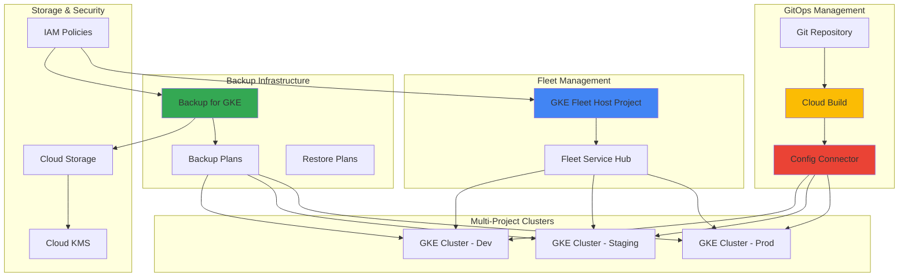

# Enterprise Kubernetes Fleet Management with GKE Fleet and Backup for GKE

## Problem

Enterprise organizations often struggle with managing multiple Kubernetes clusters across different environments, projects, and regions while maintaining consistent security policies, backup strategies, and configuration drift. Managing individual clusters independently leads to operational overhead, inconsistent governance, and potential data loss without proper backup orchestration across the fleet.

## Solution

Build a comprehensive fleet management solution using GKE Fleet to centrally manage multiple Kubernetes clusters, Backup for GKE for automated disaster recovery, and Config Connector for GitOps-driven configuration management. This approach provides unified cluster governance, automated backup policies, and infrastructure-as-code workflows across your entire Kubernetes ecosystem.

## Architecture Diagram



## Prerequisites

1. Google Cloud account with billing enabled and appropriate permissions
2. gcloud CLI v2 or later installed and configured (or Cloud Shell)
3. kubectl command-line tool installed
4. Basic understanding of Kubernetes concepts and fleet management
5. Knowledge of GitOps workflows and infrastructure-as-code principles
6. Estimated cost: $50-100/month for development clusters and backup storage

> **Note**: This recipe requires Organization-level IAM permissions for fleet management and cross-project resource access. Review [GKE Fleet requirements](https://cloud.google.com/kubernetes-engine/fleet-management/docs/fleet-concepts/best-practices) for detailed permission requirements.

## Preparation

```bash
# Set environment variables for multi-project fleet setup
export FLEET_HOST_PROJECT_ID="fleet-host-$(date +%s)"
export WORKLOAD_PROJECT_1="workload-prod-$(date +%s)"
export WORKLOAD_PROJECT_2="workload-staging-$(date +%s)"
export REGION="us-central1"
export ZONE="us-central1-a"

# Generate unique suffix for resource names
RANDOM_SUFFIX=$(openssl rand -hex 3)
export FLEET_NAME="enterprise-fleet-${RANDOM_SUFFIX}"
export BACKUP_PLAN_NAME="fleet-backup-plan-${RANDOM_SUFFIX}"

# Authenticate and set up gcloud configuration
gcloud auth login
gcloud config set compute/region ${REGION}
gcloud config set compute/zone ${ZONE}

# Create fleet host project
gcloud projects create ${FLEET_HOST_PROJECT_ID} \
    --name="Fleet Host Project"

# Create workload projects
gcloud projects create ${WORKLOAD_PROJECT_1} \
    --name="Production Workload Project"

gcloud projects create ${WORKLOAD_PROJECT_2} \
    --name="Staging Workload Project"

# Set billing account for projects (replace with your billing account)
BILLING_ACCOUNT=$(gcloud billing accounts list --format="value(name)" --limit=1)
gcloud billing projects link ${FLEET_HOST_PROJECT_ID} \
    --billing-account=${BILLING_ACCOUNT}
gcloud billing projects link ${WORKLOAD_PROJECT_1} \
    --billing-account=${BILLING_ACCOUNT}
gcloud billing projects link ${WORKLOAD_PROJECT_2} \
    --billing-account=${BILLING_ACCOUNT}

echo "✅ Projects created and configured"
echo "Fleet Host Project: ${FLEET_HOST_PROJECT_ID}"
echo "Production Project: ${WORKLOAD_PROJECT_1}"
echo "Staging Project: ${WORKLOAD_PROJECT_2}"
```

## Steps

1. **Enable Required APIs and Set Up Fleet Host Project**:

   The fleet host project serves as the central control plane for managing multiple GKE clusters across different projects. Google Cloud Fleet provides unified management capabilities including security posture monitoring, configuration management, and service mesh orchestration. By centralizing fleet operations, organizations can enforce consistent policies and observe cluster health across their entire Kubernetes infrastructure.

   ```bash
   # Set the fleet host project as active
   gcloud config set project ${FLEET_HOST_PROJECT_ID}
   
   # Enable essential APIs for fleet management
   gcloud services enable container.googleapis.com \
       gkehub.googleapis.com \
       gkebackup.googleapis.com \
       cloudresourcemanager.googleapis.com \
       krmapihosting.googleapis.com \
       anthosconfigmanagement.googleapis.com
   
   # Enable APIs for workload projects
   for PROJECT in ${WORKLOAD_PROJECT_1} ${WORKLOAD_PROJECT_2}; do
       gcloud services enable container.googleapis.com \
           gkehub.googleapis.com \
           gkebackup.googleapis.com \
           --project=${PROJECT}
   done
   
   echo "✅ APIs enabled across all projects"
   ```

   The APIs are now enabled, providing access to GKE cluster management, fleet hub services, and backup capabilities. This foundation enables advanced fleet features like multi-cluster service discovery, unified logging, and centralized security policy enforcement across your Kubernetes infrastructure.

2. **Create GKE Clusters in Workload Projects**:

   GKE clusters will be deployed across different projects to simulate a realistic enterprise environment with separation of concerns. Each cluster represents a different environment tier (production, staging) with appropriate resource allocations and security configurations. The clusters will be configured for fleet registration with Workload Identity enabled for secure service-to-service communication.

   ```bash
   # Create production GKE cluster
   gcloud container clusters create "prod-cluster-${RANDOM_SUFFIX}" \
       --project=${WORKLOAD_PROJECT_1} \
       --region=${REGION} \
       --num-nodes=2 \
       --machine-type=e2-standard-4 \
       --enable-autoscaling \
       --min-nodes=1 \
       --max-nodes=5 \
       --enable-autorepair \
       --enable-autoupgrade \
       --workload-pool=${WORKLOAD_PROJECT_1}.svc.id.goog \
       --enable-shielded-nodes \
       --disk-size=50GB
   
   # Create staging GKE cluster  
   gcloud container clusters create "staging-cluster-${RANDOM_SUFFIX}" \
       --project=${WORKLOAD_PROJECT_2} \
       --region=${REGION} \
       --num-nodes=1 \
       --machine-type=e2-standard-2 \
       --enable-autoscaling \
       --min-nodes=1 \
       --max-nodes=3 \
       --enable-autorepair \
       --enable-autoupgrade \
       --workload-pool=${WORKLOAD_PROJECT_2}.svc.id.goog \
       --enable-shielded-nodes \
       --disk-size=50GB
   
   echo "✅ GKE clusters created successfully"
   ```

   The clusters are now operational with enterprise-grade security features including Workload Identity, Shielded GKE nodes, and automatic node management. These configurations ensure clusters meet compliance requirements while providing scalable compute resources for containerized workloads across different environment tiers.

3. **Register Clusters to Fleet**:

   Fleet registration enables centralized management of multiple clusters through a single control plane. The fleet service provides capabilities for policy enforcement, configuration synchronization, and observability across all registered clusters. This creates a logical grouping that abstracts away individual cluster boundaries for streamlined operations.

   ```bash
   # Set fleet host project context
   gcloud config set project ${FLEET_HOST_PROJECT_ID}
   
   # Register production cluster to fleet
   gcloud container fleet memberships register "prod-cluster-${RANDOM_SUFFIX}" \
       --gke-cluster=${WORKLOAD_PROJECT_1}/${REGION}/prod-cluster-${RANDOM_SUFFIX} \
       --enable-workload-identity
   
   # Register staging cluster to fleet
   gcloud container fleet memberships register "staging-cluster-${RANDOM_SUFFIX}" \
       --gke-cluster=${WORKLOAD_PROJECT_2}/${REGION}/staging-cluster-${RANDOM_SUFFIX} \
       --enable-workload-identity
   
   # Verify fleet memberships
   gcloud container fleet memberships list
   
   echo "✅ Clusters registered to fleet successfully"
   ```

   Fleet registration is complete, establishing centralized control over multiple Kubernetes clusters. The fleet now provides unified access to cluster resources, enabling administrators to apply configurations, monitor health, and enforce policies across the entire infrastructure from a single management plane.

4. **Configure Config Connector for GitOps**:

   Config Connector transforms Kubernetes into a unified API for managing Google Cloud resources through GitOps workflows. By installing Config Connector in the fleet, infrastructure changes can be managed through declarative YAML manifests stored in version control, enabling audit trails, rollback capabilities, and collaborative infrastructure management across teams.

   ```bash
   # Install Config Connector in production cluster
   gcloud config set project ${WORKLOAD_PROJECT_1}
   gcloud container clusters get-credentials \
       "prod-cluster-${RANDOM_SUFFIX}" --region=${REGION}
   
   # Enable Config Connector
   gcloud container fleet config-management enable
   
   # Configure Config Connector for the cluster
   cat <<EOF > config-connector-setup.yaml
   apiVersion: core.cnrm.cloud.google.com/v1beta1
   kind: ConfigConnector
   metadata:
     name: configconnector.core.cnrm.cloud.google.com
   spec:
     mode: cluster
     googleServiceAccount: "cnrm-system@${WORKLOAD_PROJECT_1}.iam.gserviceaccount.com"
   EOF
   
   # Create Config Connector namespace and configuration
   kubectl create namespace cnrm-system
   kubectl apply -f config-connector-setup.yaml
   
   echo "✅ Config Connector configured for GitOps workflows"
   ```

   Config Connector is now operational, providing Kubernetes-native resource management for Google Cloud infrastructure. This enables teams to manage cloud resources using familiar kubectl commands and GitOps practices, ensuring infrastructure changes follow the same review and deployment processes as application code.

5. **Set Up Backup for GKE with Automated Policies**:

   Backup for GKE provides enterprise-grade backup and disaster recovery capabilities for Kubernetes workloads and persistent volumes. Creating automated backup plans ensures business continuity by protecting critical application data and configurations with scheduled backups, retention policies, and cross-project restore capabilities for comprehensive disaster recovery strategies.

   ```bash
   # Switch to fleet host project for centralized backup management
   gcloud config set project ${FLEET_HOST_PROJECT_ID}
   
   # Create backup plan for production cluster
   gcloud backup-dr backup-plans create ${BACKUP_PLAN_NAME}-prod \
       --location=${REGION} \
       --cluster=projects/${WORKLOAD_PROJECT_1}/locations/${REGION}/clusters/prod-cluster-${RANDOM_SUFFIX} \
       --include-volume-data \
       --include-secrets \
       --backup-schedule="0 2 * * *" \
       --backup-retain-days=30 \
       --description="Daily backup for production workloads"
   
   # Create backup plan for staging cluster
   gcloud backup-dr backup-plans create ${BACKUP_PLAN_NAME}-staging \
       --location=${REGION} \
       --cluster=projects/${WORKLOAD_PROJECT_2}/locations/${REGION}/clusters/staging-cluster-${RANDOM_SUFFIX} \
       --include-volume-data \
       --include-secrets \
       --backup-schedule="0 3 * * 0" \
       --backup-retain-days=14 \
       --description="Weekly backup for staging workloads"
   
   # List backup plans to verify creation
   gcloud backup-dr backup-plans list --location=${REGION}
   
   echo "✅ Backup plans configured with automated scheduling"
   ```

   Automated backup policies are now active, providing scheduled protection for all cluster workloads including persistent volumes and Kubernetes secrets. The differentiated backup frequency and retention periods reflect production versus staging environment requirements, ensuring optimal recovery capabilities while managing storage costs effectively.

6. **Deploy Sample Applications with Persistent Storage**:

   Sample applications with persistent storage demonstrate the full lifecycle of fleet-managed workloads including data persistence, backup capture, and restore scenarios. These applications simulate real-world stateful workloads and provide test subjects for validating backup and recovery procedures across the fleet infrastructure.

   ```bash
   # Deploy to production cluster
   gcloud config set project ${WORKLOAD_PROJECT_1}
   gcloud container clusters get-credentials \
       "prod-cluster-${RANDOM_SUFFIX}" --region=${REGION}
   
   # Create production namespace and application
   kubectl create namespace production
   
   cat <<EOF | kubectl apply -f -
   apiVersion: apps/v1
   kind: Deployment
   metadata:
     name: web-app
     namespace: production
   spec:
     replicas: 2
     selector:
       matchLabels:
         app: web-app
     template:
       metadata:
         labels:
           app: web-app
       spec:
         containers:
         - name: web-app
           image: nginx:1.21
           ports:
           - containerPort: 80
           volumeMounts:
           - name: data
             mountPath: /usr/share/nginx/html
         volumes:
         - name: data
           persistentVolumeClaim:
             claimName: web-app-pvc
   ---
   apiVersion: v1
   kind: PersistentVolumeClaim
   metadata:
     name: web-app-pvc
     namespace: production
   spec:
     accessModes:
     - ReadWriteOnce
     resources:
       requests:
         storage: 10Gi
   EOF
   
   # Deploy to staging cluster
   gcloud config set project ${WORKLOAD_PROJECT_2}
   gcloud container clusters get-credentials \
       "staging-cluster-${RANDOM_SUFFIX}" --region=${REGION}
   
   kubectl create namespace staging
   kubectl apply -f - <<EOF
   apiVersion: apps/v1
   kind: Deployment
   metadata:
     name: test-app
     namespace: staging
   spec:
     replicas: 1
     selector:
       matchLabels:
         app: test-app
     template:
       metadata:
         labels:
           app: test-app
       spec:
         containers:
         - name: test-app
           image: nginx:1.21
           ports:
           - containerPort: 80
   EOF
   
   echo "✅ Sample applications deployed across fleet clusters"
   ```

   Sample applications are now running across the fleet with persistent storage volumes in production. These workloads provide realistic test cases for backup operations and demonstrate how fleet management simplifies application deployment and monitoring across multiple clusters and projects.

7. **Create Fleet-Wide Configuration Management**:

   Fleet-wide configuration management enables consistent policy enforcement and configuration drift prevention across all clusters. Using Anthos Config Management, administrators can define security policies, resource quotas, and operational configurations in Git repositories and automatically synchronize them across the entire fleet, ensuring compliance and operational consistency.

   ```bash
   # Enable Anthos Config Management for fleet
   gcloud config set project ${FLEET_HOST_PROJECT_ID}
   
   # Configure Config Management for all fleet members
   cat <<EOF > fleet-config-management.yaml
   apiVersion: configmanagement.gke.io/v1
   kind: ConfigManagement
   metadata:
     name: config-management
   spec:
     enableMultiRepo: true
     policyController:
       enabled: true
       referentialRulesEnabled: true
       logDeniesEnabled: true
       mutationEnabled: true
   EOF
   
   # Apply configuration to fleet
   gcloud container fleet config-management apply \
       --membership=prod-cluster-${RANDOM_SUFFIX} \
       --config=fleet-config-management.yaml
   
   gcloud container fleet config-management apply \
       --membership=staging-cluster-${RANDOM_SUFFIX} \
       --config=fleet-config-management.yaml
   
   # Verify configuration status
   gcloud container fleet config-management status
   
   echo "✅ Fleet-wide configuration management enabled"
   ```

   Fleet-wide configuration management is now operational, providing centralized policy control and compliance monitoring across all clusters. Policy Controller enforces security constraints, while Config Sync ensures configuration consistency, creating a robust governance framework for enterprise Kubernetes operations.

8. **Set Up Cross-Project IAM for Fleet Operations**:

   Cross-project IAM configurations enable secure, least-privilege access patterns for fleet operations while maintaining project boundaries. Service accounts and IAM bindings allow the fleet host project to manage resources across workload projects, backup operations to access cluster data, and Config Connector to provision infrastructure resources with appropriate permissions.

   ```bash
   # Create service account for fleet operations
   gcloud config set project ${FLEET_HOST_PROJECT_1}
   
   gcloud iam service-accounts create fleet-manager \
       --display-name="Fleet Manager Service Account" \
       --description="Service account for managing fleet operations"
   
   # Grant necessary permissions for cross-project access
   for PROJECT in ${WORKLOAD_PROJECT_1} ${WORKLOAD_PROJECT_2}; do
       gcloud projects add-iam-policy-binding ${PROJECT} \
           --member="serviceAccount:fleet-manager@${FLEET_HOST_PROJECT_ID}.iam.gserviceaccount.com" \
           --role="roles/container.clusterViewer"
       
       gcloud projects add-iam-policy-binding ${PROJECT} \
           --member="serviceAccount:fleet-manager@${FLEET_HOST_PROJECT_ID}.iam.gserviceaccount.com" \
           --role="roles/gkebackup.admin"
   done
   
   # Create service account for Config Connector
   gcloud iam service-accounts create cnrm-system \
       --project=${WORKLOAD_PROJECT_1} \
       --display-name="Config Connector Service Account"
   
   gcloud projects add-iam-policy-binding ${WORKLOAD_PROJECT_1} \
       --member="serviceAccount:cnrm-system@${WORKLOAD_PROJECT_1}.iam.gserviceaccount.com" \
       --role="roles/editor"
   
   echo "✅ Cross-project IAM configured for fleet operations"
   ```

   IAM permissions are now configured to support secure fleet operations across project boundaries. The fleet manager service account can monitor clusters and manage backups, while Config Connector can provision infrastructure resources, all following Google Cloud's principle of least privilege access control.

## Validation & Testing

1. **Verify Fleet Registration and Status**:

   ```bash
   # Check fleet membership status
   gcloud config set project ${FLEET_HOST_PROJECT_ID}
   gcloud container fleet memberships list
   
   # Verify cluster connectivity through fleet
   gcloud container fleet memberships describe "prod-cluster-${RANDOM_SUFFIX}"
   gcloud container fleet memberships describe "staging-cluster-${RANDOM_SUFFIX}"
   ```

   Expected output: Both clusters should show "READY" status with fleet connectivity established.

2. **Test Backup Plan Execution**:

   ```bash
   # Trigger manual backup for testing
   gcloud backup-dr backups create test-backup-${RANDOM_SUFFIX} \
       --location=${REGION} \
       --backup-plan=${BACKUP_PLAN_NAME}-prod \
       --description="Manual test backup"
   
   # Monitor backup progress
   gcloud backup-dr backups list --location=${REGION}
   ```

   Expected output: Backup should initiate and show "CREATING" status, progressing to "SUCCEEDED".

3. **Validate Config Connector Functionality**:

   ```bash
   # Test Config Connector by creating a storage bucket
   gcloud config set project ${WORKLOAD_PROJECT_1}
   gcloud container clusters get-credentials \
       "prod-cluster-${RANDOM_SUFFIX}" --region=${REGION}
   
   cat <<EOF | kubectl apply -f -
   apiVersion: storage.cnrm.cloud.google.com/v1beta1
   kind: StorageBucket
   metadata:
     name: test-bucket-${RANDOM_SUFFIX}
     namespace: cnrm-system
   spec:
     location: US
   EOF
   
   # Verify bucket creation
   kubectl get storagebucket -n cnrm-system
   gsutil ls gs://test-bucket-${RANDOM_SUFFIX}
   ```

   Expected output: Storage bucket should be created successfully through Kubernetes API.

4. **Test Cross-Cluster Fleet Management**:

   ```bash
   # View fleet-wide cluster information
   gcloud config set project ${FLEET_HOST_PROJECT_ID}
   gcloud container fleet memberships list --format="table(name,location,status)"
   
   # Test fleet-wide policy enforcement
   gcloud container fleet config-management status
   ```

   Expected output: All clusters should show healthy status with config management active.

## Cleanup

1. **Remove Sample Applications and Resources**:

   ```bash
   # Clean up production cluster resources
   gcloud config set project ${WORKLOAD_PROJECT_1}
   gcloud container clusters get-credentials \
       "prod-cluster-${RANDOM_SUFFIX}" --region=${REGION}
   
   kubectl delete namespace production
   kubectl delete -f - <<EOF
   apiVersion: storage.cnrm.cloud.google.com/v1beta1
   kind: StorageBucket
   metadata:
     name: test-bucket-${RANDOM_SUFFIX}
     namespace: cnrm-system
   EOF
   
   # Clean up staging cluster resources
   gcloud config set project ${WORKLOAD_PROJECT_2}
   gcloud container clusters get-credentials \
       "staging-cluster-${RANDOM_SUFFIX}" --region=${REGION}
   
   kubectl delete namespace staging
   
   echo "✅ Application resources cleaned up"
   ```

2. **Remove Backup Plans**:

   ```bash
   # Delete backup plans
   gcloud config set project ${FLEET_HOST_PROJECT_ID}
   gcloud backup-dr backup-plans delete ${BACKUP_PLAN_NAME}-prod \
       --location=${REGION} \
       --quiet
   
   gcloud backup-dr backup-plans delete ${BACKUP_PLAN_NAME}-staging \
       --location=${REGION} \
       --quiet
   
   echo "✅ Backup plans removed"
   ```

3. **Unregister Clusters from Fleet**:

   ```bash
   # Unregister clusters from fleet
   gcloud container fleet memberships unregister "prod-cluster-${RANDOM_SUFFIX}" \
       --quiet
   
   gcloud container fleet memberships unregister "staging-cluster-${RANDOM_SUFFIX}" \
       --quiet
   
   echo "✅ Clusters unregistered from fleet"
   ```

4. **Delete GKE Clusters**:

   ```bash
   # Delete production cluster
   gcloud container clusters delete "prod-cluster-${RANDOM_SUFFIX}" \
       --project=${WORKLOAD_PROJECT_1} \
       --region=${REGION} \
       --quiet
   
   # Delete staging cluster
   gcloud container clusters delete "staging-cluster-${RANDOM_SUFFIX}" \
       --project=${WORKLOAD_PROJECT_2} \
       --region=${REGION} \
       --quiet
   
   echo "✅ GKE clusters deleted"
   ```

5. **Remove Projects**:

   ```bash
   # Delete all projects created for this recipe
   gcloud projects delete ${FLEET_HOST_PROJECT_ID} --quiet
   gcloud projects delete ${WORKLOAD_PROJECT_1} --quiet
   gcloud projects delete ${WORKLOAD_PROJECT_2} --quiet
   
   # Clean up local configuration
   unset FLEET_HOST_PROJECT_ID WORKLOAD_PROJECT_1 WORKLOAD_PROJECT_2
   unset REGION ZONE FLEET_NAME BACKUP_PLAN_NAME RANDOM_SUFFIX
   
   echo "✅ All resources cleaned up successfully"
   ```

## Discussion

Enterprise Kubernetes fleet management addresses the complexity of operating multiple clusters at scale by providing centralized governance, automated backup strategies, and GitOps-driven configuration management. **GKE Fleet** serves as the foundation for this approach, enabling organizations to manage clusters as logical groups rather than individual entities, which significantly reduces operational overhead and improves consistency across environments.

The integration of **Backup for GKE** provides enterprise-grade disaster recovery capabilities that are essential for production workloads. Unlike traditional backup solutions that operate at the infrastructure level, Backup for GKE understands Kubernetes-native resources and provides application-consistent backups that include both persistent volume data and cluster configurations. This enables granular restore operations and cross-cluster migration scenarios that are critical for disaster recovery and testing workflows.

**Config Connector** transforms infrastructure management by bringing Google Cloud resource provisioning into the Kubernetes API model, enabling true GitOps workflows where infrastructure changes follow the same development lifecycle as application code. This approach ensures that infrastructure modifications are version-controlled, peer-reviewed, and auditable, which meets compliance requirements while reducing configuration drift across the fleet. The declarative nature of Config Connector also enables infrastructure templates that can be consistently applied across multiple clusters and environments.

The multi-project architecture demonstrated in this recipe reflects real-world enterprise requirements where different teams, environments, or compliance zones require project-level isolation while still benefiting from centralized management. Fleet management bridges these boundaries by providing unified observability and policy enforcement without compromising security or access control principles. This pattern is particularly valuable for organizations with complex governance requirements or multi-tenant Kubernetes platforms.

For more detailed information on advanced fleet management patterns, refer to the [GKE Fleet Management Best Practices](https://cloud.google.com/kubernetes-engine/fleet-management/docs/fleet-concepts/best-practices) guide. The [Backup for GKE documentation](https://cloud.google.com/kubernetes-engine/docs/add-on/backup-for-gke) provides comprehensive guidance on backup strategy design and disaster recovery planning. To explore advanced GitOps patterns with Config Connector, see the [Config Connector overview](https://cloud.google.com/config-connector/docs/overview) and the [Google Cloud Architecture Center](https://cloud.google.com/architecture) for enterprise Kubernetes patterns.

> **Tip**: Consider implementing [Binary Authorization](https://cloud.google.com/binary-authorization/docs) across your fleet to ensure only verified container images are deployed, and use [Policy Controller](https://cloud.google.com/anthos-config-management/docs/concepts/policy-controller) for runtime security policy enforcement across all clusters.

## Challenge

Extend this fleet management solution by implementing these enterprise enhancements:

1. **Implement Multi-Region Fleet Deployment** - Deploy clusters across multiple Google Cloud regions with cross-region backup replication and disaster recovery automation using [Multi-cluster Ingress](https://cloud.google.com/kubernetes-engine/docs/concepts/multi-cluster-ingress) for global load balancing.

2. **Add Advanced Security Policies** - Integrate [Binary Authorization](https://cloud.google.com/binary-authorization/docs) for container image verification, implement Pod Security Standards across the fleet, and configure [Workload Identity Federation](https://cloud.google.com/iam/docs/workload-identity-federation) for secure cloud resource access.

3. **Create Automated Compliance Reporting** - Build Cloud Functions that query fleet status, backup compliance, and security posture data to generate automated compliance reports for SOC 2, ISO 27001, or other regulatory frameworks.

4. **Implement Progressive Deployment Strategies** - Use [Anthos Service Mesh](https://cloud.google.com/service-mesh/docs) to implement canary deployments and traffic splitting across fleet clusters, with automated rollback based on SLI thresholds.

5. **Add Cost Optimization Automation** - Integrate [Recommender API](https://cloud.google.com/recommender/docs) to automatically apply right-sizing recommendations across the fleet and implement cluster auto-scaling policies based on workload patterns and cost constraints.

## Infrastructure Code

*Infrastructure code will be generated after recipe approval.*