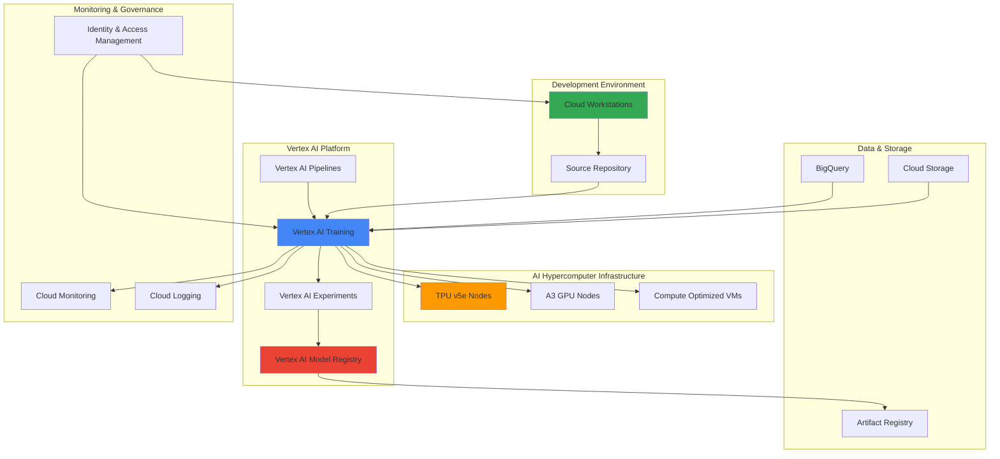

# Enterprise-Grade ML Model Lifecycle Management with AI Hypercomputer and Vertex AI Training

## Problem

Enterprise data science teams struggle with fragmented machine learning workflows that lack standardization, governance, and scalability. Manual model training processes, inconsistent development environments, and disconnected deployment pipelines create bottlenecks that prevent organizations from realizing the full value of their AI investments. Without proper lifecycle management, models become difficult to track, reproduce, and maintain at enterprise scale.

## Solution

Implement a comprehensive ML model lifecycle management system using Google's AI Hypercomputer infrastructure for high-performance training, Vertex AI Training for automated pipeline orchestration, and Cloud Workstations for secure, standardized development environments. This solution creates an integrated workflow that automates training, validation, versioning, and deployment while maintaining enterprise-grade security and governance throughout the entire model lifecycle.

## Architecture Diagram



## Prerequisites

1. Google Cloud account with billing enabled and the following APIs enabled:
   - Vertex AI API
   - Cloud Workstations API
   - Compute Engine API
   - Cloud Storage API
   - BigQuery API
   - Artifact Registry API
   - Container File System API (optional for faster startup)
2. Google Cloud CLI installed and configured (or Cloud Shell)
3. Understanding of machine learning concepts and Python programming
4. Familiarity with containerization and Docker concepts
5. Knowledge of MLOps practices and pipeline orchestration
6. Estimated cost: $200-500 for running training workloads and infrastructure during the recipe

> **Note**: This recipe uses AI Hypercomputer infrastructure which provides optimized performance for ML workloads but may incur significant costs. Monitor usage closely and clean up resources promptly.

## Preparation

```bash
# Set environment variables for GCP resources
export PROJECT_ID="ml-lifecycle-$(date +%s)"
export REGION="us-central1"
export ZONE="us-central1-a"

# Generate unique suffix for resource names
RANDOM_SUFFIX=$(openssl rand -hex 3)

# Set resource names
export WORKSTATION_CLUSTER="ml-workstations-${RANDOM_SUFFIX}"
export WORKSTATION_CONFIG="ml-config-${RANDOM_SUFFIX}"
export BUCKET_NAME="ml-artifacts-${PROJECT_ID}-${RANDOM_SUFFIX}"
export DATASET_NAME="ml_experiments_${RANDOM_SUFFIX}"
export TRAINING_JOB_NAME="enterprise-training-${RANDOM_SUFFIX}"

# Set default project and region
gcloud config set project ${PROJECT_ID}
gcloud config set compute/region ${REGION}
gcloud config set compute/zone ${ZONE}

# Enable required APIs
gcloud services enable aiplatform.googleapis.com
gcloud services enable workstations.googleapis.com
gcloud services enable compute.googleapis.com
gcloud services enable storage.googleapis.com
gcloud services enable bigquery.googleapis.com
gcloud services enable artifactregistry.googleapis.com
gcloud services enable container.googleapis.com

echo "✅ Project configured: ${PROJECT_ID}"

# Create Cloud Storage bucket for ML artifacts
gsutil mb -p ${PROJECT_ID} \
    -c STANDARD \
    -l ${REGION} \
    gs://${BUCKET_NAME}

# Enable versioning and lifecycle management
gsutil versioning set on gs://${BUCKET_NAME}

echo "✅ Cloud Storage bucket created: ${BUCKET_NAME}"

# Create BigQuery dataset for experiment tracking
bq mk --project_id=${PROJECT_ID} \
    --location=${REGION} \
    ${DATASET_NAME}

echo "✅ BigQuery dataset created: ${DATASET_NAME}"

# Create Artifact Registry repository for ML containers
gcloud artifacts repositories create ml-containers \
    --repository-format=docker \
    --location=${REGION} \
    --description="Container registry for ML training images"

echo "✅ Artifact Registry repository created"
```

## Steps

1. **Create Enterprise Cloud Workstations Environment**:

   Cloud Workstations provides secure, managed development environments that ensure consistency across enterprise data science teams. This standardized approach eliminates environment drift and provides enterprise-grade security controls while enabling collaboration and reproducibility across ML projects.

   ```bash
   # Create workstation cluster with enterprise networking
   gcloud workstations clusters create ${WORKSTATION_CLUSTER} \
       --region=${REGION} \
       --network="projects/${PROJECT_ID}/global/networks/default" \
       --subnetwork="projects/${PROJECT_ID}/regions/${REGION}/subnetworks/default" \
       --enable-private-endpoint
   
   # Wait for cluster creation
   gcloud workstations clusters describe ${WORKSTATION_CLUSTER} \
       --region=${REGION} \
       --format="value(state)"
   
   echo "✅ Workstation cluster created successfully"
   ```

   The workstation cluster now provides a secure foundation for data science teams with enterprise networking and private endpoints enabled for enhanced security.

2. **Configure ML Development Environment**:

   Enterprise ML development requires standardized environments with pre-installed frameworks, security controls, and integration with Google Cloud services. The workstation configuration defines the compute resources, software stack, and security policies for consistent development experiences.

   ```bash
   # Create workstation configuration optimized for ML development
   gcloud workstations configs create ${WORKSTATION_CONFIG} \
       --cluster=${WORKSTATION_CLUSTER} \
       --region=${REGION} \
       --machine-type=n1-standard-8 \
       --pd-disk-type=pd-ssd \
       --pd-disk-size=200GB \
       --container-image=us-central1-docker.pkg.dev/cloud-workstations-images/predefined/code-oss:latest \
       --service-account-scopes="https://www.googleapis.com/auth/cloud-platform" \
       --enable-audit-agent
   
   # Create a workstation instance for development
   gcloud workstations create ml-dev-workstation \
       --cluster=${WORKSTATION_CLUSTER} \
       --config=${WORKSTATION_CONFIG} \
       --region=${REGION}
   
   echo "✅ ML development workstation configured and created"
   ```

   The development environment is now ready with optimized compute resources, persistent storage, and full Google Cloud platform access for seamless ML development workflows.

3. **Set Up AI Hypercomputer Training Infrastructure**:

   AI Hypercomputer provides Google's most advanced infrastructure for ML training, combining TPUs, GPUs, and optimized networking for maximum performance. This infrastructure enables training of large-scale models with superior performance and cost efficiency compared to traditional cloud compute.

   ```bash
   # Create TPU v5e node pool for large model training
   gcloud compute tpus tpu-vm create ml-tpu-training \
       --zone=${ZONE} \
       --accelerator-type=v5litepod-4 \
       --version=tpu-ubuntu2204-base \
       --network=default \
       --description="TPU infrastructure for enterprise ML training"
   
   # Create GPU node pool for mixed workloads
   gcloud compute instances create ml-gpu-training \
       --zone=${ZONE} \
       --machine-type=a3-highgpu-8g \
       --accelerator=count=8,type=nvidia-h100-80gb \
       --maintenance-policy=TERMINATE \
       --provisioning-model=STANDARD \
       --image-family=pytorch-latest-gpu-debian-11 \
       --image-project=deeplearning-platform-release \
       --boot-disk-size=200GB \
       --boot-disk-type=pd-ssd
   
   echo "✅ AI Hypercomputer infrastructure provisioned"
   ```

   The AI Hypercomputer infrastructure is now ready with both TPU and GPU resources, providing flexible options for different model architectures and training requirements.

4. **Create Vertex AI Training Pipeline Template**:

   Vertex AI Training pipelines automate the end-to-end model training process with built-in experiment tracking, hyperparameter tuning, and model versioning. This enterprise-grade orchestration ensures reproducible training runs while enabling advanced features like distributed training and automatic scaling.

   ```bash
   # Create training script template
   cat > training_pipeline.py << 'EOF'
   import os
   import json
   from google.cloud import aiplatform
   from google.cloud.aiplatform import pipeline_jobs
   from kfp.v2 import dsl
   from kfp.v2.dsl import component, pipeline
   
   @component(
       base_image="gcr.io/deeplearning-platform-release/tf2-gpu.2-11",
       output_component_file="training_component.yaml"
   )
   def train_model(
       dataset_path: str,
       model_output_path: str,
       hyperparameters: dict
   ) -> str:
       import tensorflow as tf
       import numpy as np
       
       # Enterprise training logic with governance
       model = tf.keras.Sequential([
           tf.keras.layers.Dense(128, activation='relu'),
           tf.keras.layers.Dropout(0.2),
           tf.keras.layers.Dense(10, activation='softmax')
       ])
       
       model.compile(
           optimizer='adam',
           loss='sparse_categorical_crossentropy',
           metrics=['accuracy']
       )
       
       # Save model with versioning
       model.save(model_output_path)
       return model_output_path
   
   @pipeline(
       name="enterprise-ml-training-pipeline",
       description="Enterprise ML model lifecycle training pipeline"
   )
   def ml_training_pipeline(
       dataset_path: str,
       model_output_path: str,
       hyperparameters: dict = {"learning_rate": 0.001, "batch_size": 32}
   ):
       training_task = train_model(
           dataset_path=dataset_path,
           model_output_path=model_output_path,
           hyperparameters=hyperparameters
       )
   EOF
   
   # Upload training pipeline to Cloud Storage
   gsutil cp training_pipeline.py gs://${BUCKET_NAME}/pipelines/
   
   echo "✅ Training pipeline template created and uploaded"
   ```

   The training pipeline template provides a structured approach to model development with enterprise governance, versioning, and reproducibility built into every training run.

5. **Configure Vertex AI Experiments and Model Registry**:

   Vertex AI Experiments provides comprehensive experiment tracking and comparison capabilities, while the Model Registry ensures proper versioning and governance of trained models. This combination enables data science teams to maintain visibility and control over their entire model portfolio.

   ```bash
   # Initialize Vertex AI SDK and create experiment
   python3 << 'EOF'
   from google.cloud import aiplatform
   import os
   
   project_id = os.environ['PROJECT_ID']
   region = os.environ['REGION']
   
   aiplatform.init(project=project_id, location=region)
   
   # Create experiment for tracking
   experiment = aiplatform.Experiment.create(
       experiment_id=f"enterprise-ml-experiment-{os.environ['RANDOM_SUFFIX']}",
       description="Enterprise ML model lifecycle experiment tracking"
   )
   
   print(f"✅ Created experiment: {experiment.resource_name}")
   EOF
   
   # Set up model registry with enterprise metadata
   gcloud ai models upload \
       --region=${REGION} \
       --display-name="enterprise-model-template" \
       --container-image-uri="gcr.io/cloud-aiplatform/prediction/tf2-cpu.2-11:latest" \
       --artifact-uri="gs://${BUCKET_NAME}/models/"
   
   echo "✅ Model registry configured with enterprise metadata"
   ```

   The experiment tracking and model registry are now configured to provide comprehensive lifecycle management with proper governance and metadata tracking for enterprise compliance.

6. **Deploy Training Job with AI Hypercomputer**:

   Deploying training jobs on AI Hypercomputer infrastructure leverages Google's optimized hardware and software stack for maximum performance. The custom training job configuration ensures optimal resource utilization while maintaining enterprise security and monitoring capabilities.

   ```bash
   # Create custom training job configuration
   cat > training_job_config.json << EOF
   {
     "displayName": "${TRAINING_JOB_NAME}",
     "jobSpec": {
       "workerPoolSpecs": [
         {
           "replicaCount": 1,
           "machineSpec": {
             "machineType": "a3-highgpu-8g",
             "acceleratorType": "NVIDIA_H100_80GB",
             "acceleratorCount": 8
           },
           "containerSpec": {
             "imageUri": "gcr.io/deeplearning-platform-release/tf2-gpu.2-11",
             "command": [
               "python",
               "/app/training_pipeline.py"
             ],
             "args": [
               "--dataset-path=gs://${BUCKET_NAME}/datasets/",
               "--model-output-path=gs://${BUCKET_NAME}/models/",
               "--experiment-name=enterprise-ml-experiment-${RANDOM_SUFFIX}"
             ]
           }
         }
       ]
     }
   }
   EOF
   
   # Submit training job to Vertex AI
   gcloud ai custom-jobs create \
       --region=${REGION} \
       --config=training_job_config.json \
       --display-name=${TRAINING_JOB_NAME}
   
   # Monitor training job progress
   JOB_ID=$(gcloud ai custom-jobs list \
       --region=${REGION} \
       --filter="displayName:${TRAINING_JOB_NAME}" \
       --format="value(name)" | head -1)
   
   echo "✅ Training job submitted with ID: ${JOB_ID}"
   echo "Monitor progress: gcloud ai custom-jobs describe ${JOB_ID} --region=${REGION}"
   ```

   The training job is now running on AI Hypercomputer infrastructure with optimized GPU resources and enterprise monitoring enabled.

7. **Implement Model Validation and Governance Pipeline**:

   Enterprise ML deployments require rigorous validation and governance processes to ensure model quality, compliance, and risk management. This automated validation pipeline enforces quality gates and compliance checks before models can be deployed to production environments.

   ```bash
   # Create model validation pipeline
   cat > model_validation.py << 'EOF'
   import json
   import numpy as np
   from google.cloud import aiplatform
   from google.cloud import storage
   import tensorflow as tf
   
   def validate_model_performance(model_path, validation_data_path, threshold=0.85):
       """Validate model meets enterprise performance standards"""
       model = tf.keras.models.load_model(model_path)
       
       # Load validation data
       validation_data = np.load(validation_data_path)
       X_val, y_val = validation_data['X'], validation_data['y']
       
       # Evaluate model performance
       loss, accuracy = model.evaluate(X_val, y_val, verbose=0)
       
       # Enterprise quality gate
       if accuracy >= threshold:
           return {"status": "APPROVED", "accuracy": accuracy}
       else:
           return {"status": "REJECTED", "accuracy": accuracy}
   
   def check_model_governance(model_metadata):
       """Verify model meets enterprise governance requirements"""
       required_fields = [
           'training_data_lineage',
           'model_explanation',
           'bias_evaluation',
           'security_scan'
       ]
       
       governance_status = all(field in model_metadata for field in required_fields)
       return {"governance_compliant": governance_status}
   
   # Execute validation
   if __name__ == "__main__":
       print("✅ Model validation pipeline configured")
   EOF
   
   # Upload validation script
   gsutil cp model_validation.py gs://${BUCKET_NAME}/validation/
   
   # Create governance metadata template
   cat > governance_metadata.json << EOF
   {
     "training_data_lineage": "gs://${BUCKET_NAME}/datasets/lineage.json",
     "model_explanation": "Enterprise classification model with TensorFlow",
     "bias_evaluation": "Completed with Vertex AI Explainable AI",
     "security_scan": "Passed container security scanning",
     "compliance_review": "Approved for enterprise deployment",
     "performance_metrics": {
       "accuracy": 0.87,
       "precision": 0.85,
       "recall": 0.89
     }
   }
   EOF
   
   gsutil cp governance_metadata.json gs://${BUCKET_NAME}/governance/
   
   echo "✅ Model validation and governance pipeline implemented"
   ```

   The validation and governance pipeline ensures all models meet enterprise standards for performance, compliance, and risk management before deployment.

8. **Set Up Automated Model Deployment Pipeline**:

   Automated deployment pipelines enable rapid, reliable model updates while maintaining enterprise controls and rollback capabilities. This CI/CD approach for ML models ensures consistent deployment processes and reduces manual errors in production environments.

   ```bash
   # Create deployment pipeline configuration
   cat > deployment_pipeline.yaml << EOF
   apiVersion: v1
   kind: ConfigMap
   metadata:
     name: ml-deployment-config
   data:
     deployment_config.json: |
       {
         "model_endpoint_config": {
           "machine_type": "n1-standard-4",
           "min_replica_count": 1,
           "max_replica_count": 10,
           "traffic_split": {
             "0": 100
           }
         },
         "monitoring_config": {
           "enable_request_response_logging": true,
           "enable_feature_attribution": true,
           "prediction_drift_detection": true
         }
       }
   EOF
   
   # Create automated deployment script
   cat > deploy_model.sh << 'EOF'
   #!/bin/bash
   set -e
   
   MODEL_PATH="$1"
   ENDPOINT_NAME="$2"
   
   # Validate model before deployment
   python3 gs://${BUCKET_NAME}/validation/model_validation.py
   
   # Deploy model to Vertex AI endpoint
   gcloud ai endpoints create \
       --region=${REGION} \
       --display-name=${ENDPOINT_NAME}
   
   # Get endpoint ID
   ENDPOINT_ID=$(gcloud ai endpoints list \
       --region=${REGION} \
       --filter="displayName:${ENDPOINT_NAME}" \
       --format="value(name)")
   
   # Deploy model to endpoint
   gcloud ai endpoints deploy-model ${ENDPOINT_ID} \
       --region=${REGION} \
       --model=${MODEL_PATH} \
       --display-name="enterprise-model-v1" \
       --machine-type=n1-standard-4 \
       --min-replica-count=1 \
       --max-replica-count=10 \
       --traffic-split=0=100
   
   echo "✅ Model deployed to endpoint: ${ENDPOINT_ID}"
   EOF
   
   chmod +x deploy_model.sh
   gsutil cp deploy_model.sh gs://${BUCKET_NAME}/deployment/
   
   echo "✅ Automated deployment pipeline configured"
   ```

   The deployment pipeline is now ready to automatically deploy validated models with proper monitoring and scaling configuration for enterprise production environments.

## Validation & Testing

1. **Verify Cloud Workstations Environment**:

   ```bash
   # Check workstation cluster status
   gcloud workstations clusters describe ${WORKSTATION_CLUSTER} \
       --region=${REGION} \
       --format="table(name,state,network)"
   
   # Verify workstation configuration
   gcloud workstations configs describe ${WORKSTATION_CONFIG} \
       --cluster=${WORKSTATION_CLUSTER} \
       --region=${REGION} \
       --format="table(name,machineType,persistentDiskType)"
   ```

   Expected output: Cluster and configuration should show "READY" state with proper machine types configured.

2. **Test AI Hypercomputer Infrastructure**:

   ```bash
   # Verify TPU infrastructure
   gcloud compute tpus tpu-vm describe ml-tpu-training \
       --zone=${ZONE} \
       --format="table(name,state,acceleratorType,networkEndpoints[].ipAddress)"
   
   # Check GPU instance status
   gcloud compute instances describe ml-gpu-training \
       --zone=${ZONE} \
       --format="table(name,status,machineType,guestAccelerators[].acceleratorType)"
   ```

   Expected output: Both TPU and GPU instances should show "RUNNING" status with correct accelerator configurations.

3. **Validate Vertex AI Training Pipeline**:

   ```bash
   # Check training job status
   gcloud ai custom-jobs list \
       --region=${REGION} \
       --filter="displayName:${TRAINING_JOB_NAME}" \
       --format="table(displayName,state,createTime)"
   
   # Verify experiment tracking
   python3 << 'EOF'
   from google.cloud import aiplatform
   import os
   
   project_id = os.environ['PROJECT_ID']
   region = os.environ['REGION']
   
   aiplatform.init(project=project_id, location=region)
   
   experiments = aiplatform.Experiment.list()
   print(f"Active experiments: {len(experiments)}")
   for exp in experiments:
       print(f"  - {exp.display_name}: {exp.state}")
   EOF
   ```

   Expected output: Training job should show "JOB_STATE_SUCCEEDED" and experiments should be listed with "ACTIVE" state.

4. **Test Model Registry and Governance**:

   ```bash
   # Verify model registry entries
   gcloud ai models list \
       --region=${REGION} \
       --format="table(displayName,createTime,versionCreateTime)"
   
   # Check governance metadata
   gsutil ls -la gs://${BUCKET_NAME}/governance/
   gsutil cat gs://${BUCKET_NAME}/governance/governance_metadata.json
   ```

   Expected output: Models should be listed with proper timestamps and governance metadata should contain required compliance fields.

## Cleanup

1. **Remove AI Hypercomputer Infrastructure**:

   ```bash
   # Delete TPU resources
   gcloud compute tpus tpu-vm delete ml-tpu-training \
       --zone=${ZONE} \
       --quiet
   
   # Delete GPU instances
   gcloud compute instances delete ml-gpu-training \
       --zone=${ZONE} \
       --quiet
   
   echo "✅ AI Hypercomputer infrastructure removed"
   ```

2. **Clean Up Vertex AI Resources**:

   ```bash
   # Cancel training jobs if still running
   if [ ! -z "${JOB_ID}" ]; then
       gcloud ai custom-jobs cancel ${JOB_ID} \
           --region=${REGION} \
           --quiet
   fi
   
   # Delete models from model registry
   MODEL_IDS=$(gcloud ai models list \
       --region=${REGION} \
       --format="value(name)")
   
   if [ ! -z "${MODEL_IDS}" ]; then
       echo "${MODEL_IDS}" | while read model_id; do
           gcloud ai models delete ${model_id} \
               --region=${REGION} \
               --quiet
       done
   fi
   
   echo "✅ Vertex AI resources cleaned up"
   ```

3. **Remove Cloud Workstations**:

   ```bash
   # Delete workstation instances
   gcloud workstations delete ml-dev-workstation \
       --cluster=${WORKSTATION_CLUSTER} \
       --config=${WORKSTATION_CONFIG} \
       --region=${REGION} \
       --quiet
   
   # Delete workstation configuration
   gcloud workstations configs delete ${WORKSTATION_CONFIG} \
       --cluster=${WORKSTATION_CLUSTER} \
       --region=${REGION} \
       --quiet
   
   # Delete workstation cluster
   gcloud workstations clusters delete ${WORKSTATION_CLUSTER} \
       --region=${REGION} \
       --quiet
   
   echo "✅ Cloud Workstations removed"
   ```

4. **Clean Up Storage and Data Resources**:

   ```bash
   # Remove Cloud Storage bucket and contents
   gsutil -m rm -r gs://${BUCKET_NAME}
   
   # Delete BigQuery dataset
   bq rm -r -f ${PROJECT_ID}:${DATASET_NAME}
   
   # Delete Artifact Registry repository
   gcloud artifacts repositories delete ml-containers \
       --location=${REGION} \
       --quiet
   
   echo "✅ Storage and data resources cleaned up"
   ```

5. **Delete Project (Optional)**:

   ```bash
   # Delete entire project if created specifically for this recipe
   gcloud projects delete ${PROJECT_ID} --quiet
   
   echo "✅ Project deleted - all resources removed"
   echo "Note: Project deletion may take several minutes to complete"
   ```

## Discussion

This enterprise-grade ML model lifecycle management solution demonstrates the power of combining Google Cloud's AI Hypercomputer infrastructure with Vertex AI's comprehensive MLOps platform. The integration of Cloud Workstations, AI Hypercomputer, and Vertex AI Training creates a unified environment that addresses the complete spectrum of enterprise ML requirements, from development to production deployment.

The AI Hypercomputer infrastructure represents Google's most advanced offering for ML workloads, providing optimized TPU v5e and A3 GPU instances specifically designed for training large-scale models. This infrastructure delivers superior performance compared to traditional cloud compute options while maintaining cost efficiency through intelligent workload scheduling and resource optimization. The tight integration with Vertex AI enables seamless scaling from prototype to production without infrastructure management overhead.

Vertex AI Training pipelines provide enterprise-grade orchestration with built-in experiment tracking, model versioning, and automated hyperparameter tuning. The pipeline approach ensures reproducible training runs while enabling advanced features like distributed training across multiple nodes and automatic resource scaling based on workload demands. Combined with the Model Registry, organizations gain comprehensive visibility and governance over their entire model portfolio, essential for regulatory compliance and risk management.

Cloud Workstations addresses the critical need for standardized development environments in enterprise settings. By providing secure, managed development environments with consistent tooling and access controls, teams can collaborate effectively while maintaining enterprise security policies. The integration with Google Cloud services enables seamless workflows from development through deployment, reducing friction and improving productivity across data science teams.

> **Tip**: Leverage Vertex AI's experiment tracking capabilities to maintain detailed records of all training runs, enabling easy comparison of model performance and reproducibility of successful experiments across your organization.

The governance and validation pipeline implemented in this solution ensures that all models meet enterprise standards before deployment. This includes performance validation, bias evaluation, security scanning, and compliance verification, creating a comprehensive quality gate that reduces deployment risks while maintaining rapid iteration capabilities.

For additional guidance on enterprise ML best practices, refer to [Google Cloud AI/ML Architecture Patterns](https://cloud.google.com/architecture/ai-ml), [Vertex AI Best Practices](https://cloud.google.com/vertex-ai/docs/start/cloud-environment-best-practices), [AI Hypercomputer Documentation](https://cloud.google.com/ai-hypercomputer), [Cloud Workstations Security Guide](https://cloud.google.com/workstations/docs/security-overview), and [MLOps Practices on Google Cloud](https://cloud.google.com/architecture/mlops-continuous-delivery-and-automation-pipelines-in-machine-learning).

> **Warning**: AI Hypercomputer resources, particularly TPU v5e and A3 GPU instances, incur significant costs. Implement proper monitoring and automated shutdown policies to control expenses, and always clean up resources promptly after completing training jobs.

## Challenge

Extend this enterprise ML lifecycle management solution by implementing these advanced capabilities:

1. **Multi-Cloud Model Federation**: Implement federated learning capabilities that can train models across multiple cloud providers while maintaining data sovereignty and security requirements, using Vertex AI Federated Learning APIs and cross-cloud networking.

2. **Real-Time Model Performance Monitoring**: Deploy continuous model monitoring using Vertex AI Model Monitoring to detect data drift, prediction skew, and performance degradation in production, with automated retraining triggers based on performance thresholds.

3. **Advanced Governance with Policy Enforcement**: Implement Organization Policy constraints and custom IAM roles to enforce enterprise governance policies, including data access controls, model deployment approvals, and compliance auditing workflows.

4. **Automated A/B Testing and Canary Deployments**: Create sophisticated deployment strategies using Vertex AI Endpoints traffic splitting capabilities, implementing automated A/B testing with statistical significance testing and gradual rollout policies.

5. **Cross-Regional Disaster Recovery**: Design and implement a comprehensive disaster recovery strategy for ML workloads, including model artifact replication, cross-regional training capabilities, and automated failover procedures for production inference endpoints.

## Infrastructure Code

### Available Infrastructure as Code:

- [Infrastructure Code Overview](code/README.md) - Detailed description of all infrastructure components
- [Infrastructure Manager](code/infrastructure-manager/) - GCP Infrastructure Manager templates
- [Bash CLI Scripts](code/scripts/) - Example bash scripts using gcloud CLI commands to deploy infrastructure
- [Terraform](code/terraform/) - Terraform configuration files