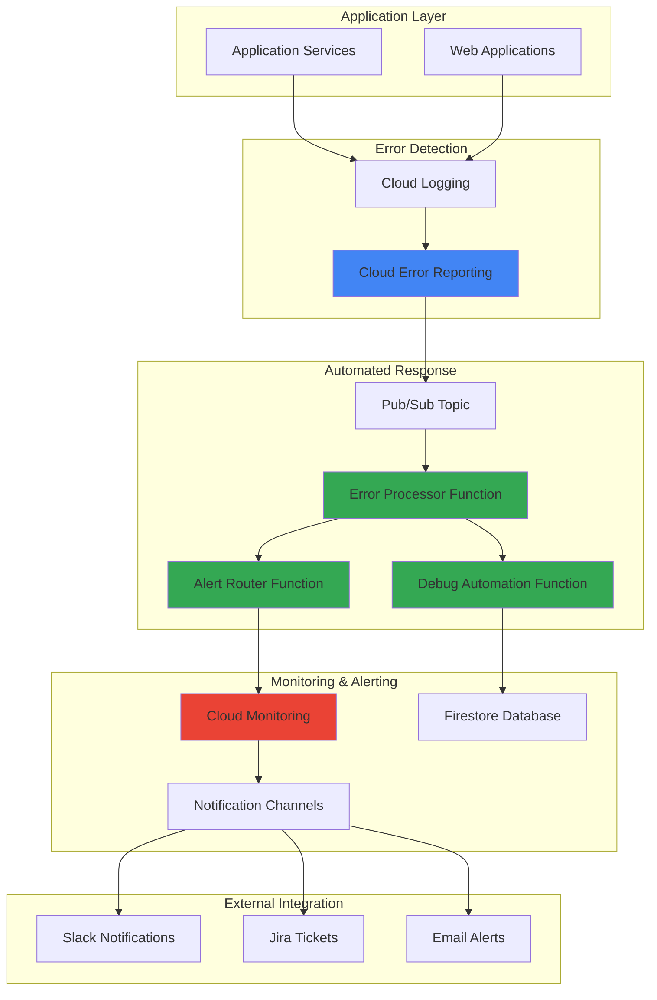

# Error Monitoring and Debugging with Cloud Error Reporting and Cloud Functions

## Problem

Modern applications generate thousands of errors daily across distributed systems, making it challenging for development teams to quickly identify, categorize, and respond to critical issues. Manual error monitoring leads to delayed incident response, increased mean time to recovery (MTTR), and potential service degradation as teams struggle to prioritize which errors require immediate attention versus those that can be addressed during regular maintenance windows.

## Solution

Build an intelligent error monitoring system that automatically detects, categorizes, and responds to application errors using Cloud Error Reporting integrated with Cloud Functions for automated debugging workflows. This solution provides intelligent alert routing, automated issue creation, and proactive error pattern analysis to reduce manual intervention and accelerate incident resolution.

## Architecture Diagram



## Prerequisites

1. Google Cloud project with billing enabled and appropriate permissions for Error Reporting, Cloud Functions, and Cloud Monitoring
2. Google Cloud CLI installed and configured (or access to Cloud Shell)
3. Basic understanding of serverless computing concepts and error handling patterns
4. Familiarity with Google Cloud monitoring and logging services
5. Access to external notification services (Slack, email) for testing
6. Estimated cost: $5-15 per month for small to medium applications (depends on error volume and function invocations)

> **Note**: Cloud Error Reporting automatically aggregates errors from applications running on Google Cloud, requiring minimal configuration for basic functionality.

## Preparation

```bash
# Set environment variables for GCP resources
export PROJECT_ID="error-monitoring-$(date +%s)"
export REGION="us-central1"
export ZONE="us-central1-a"

# Generate unique suffix for resource names
RANDOM_SUFFIX=$(openssl rand -hex 3)
export FUNCTION_NAME="error-processor-${RANDOM_SUFFIX}"
export PUBSUB_TOPIC="error-notifications-${RANDOM_SUFFIX}"
export STORAGE_BUCKET="error-debug-data-${RANDOM_SUFFIX}"

# Set default project and region
gcloud config set project ${PROJECT_ID}
gcloud config set compute/region ${REGION}
gcloud config set compute/zone ${ZONE}

# Enable required APIs for error monitoring and automation
gcloud services enable clouderrorreporting.googleapis.com
gcloud services enable cloudfunctions.googleapis.com
gcloud services enable cloudmonitoring.googleapis.com
gcloud services enable logging.googleapis.com
gcloud services enable pubsub.googleapis.com
gcloud services enable storage.googleapis.com
gcloud services enable firestore.googleapis.com

# Create Pub/Sub topic for error notifications
gcloud pubsub topics create ${PUBSUB_TOPIC}

# Create Cloud Storage bucket for storing debug data
gsutil mb -p ${PROJECT_ID} \
    -c STANDARD \
    -l ${REGION} \
    gs://${STORAGE_BUCKET}

# Initialize Firestore for error tracking
gcloud firestore databases create --region=${REGION}

echo "✅ Project configured: ${PROJECT_ID}"
echo "✅ Pub/Sub topic created: ${PUBSUB_TOPIC}"
echo "✅ Storage bucket created: ${STORAGE_BUCKET}"
```

## Steps

1. **Create Error Processing Cloud Function**:

   Cloud Functions provide serverless compute that scales automatically based on error volume, making them ideal for processing error events as they occur. The error processor function will receive error notifications, enrich them with context, and route them to appropriate handlers based on severity and patterns.

   ```bash
   # Create the main error processor function
   cat > main.py << 'EOF'
   import json
   import logging
   import os
   from datetime import datetime, timedelta
   from google.cloud import error_reporting
   from google.cloud import monitoring_v3
   from google.cloud import firestore
   from google.cloud import pubsub_v1
   import base64
   import functions_framework
   
   # Initialize clients
   error_client = error_reporting.Client()
   monitoring_client = monitoring_v3.MetricServiceClient()
   firestore_client = firestore.Client()
   publisher = pubsub_v1.PublisherClient()
   
   PROJECT_ID = os.environ.get('GCP_PROJECT')
   ALERT_TOPIC = os.environ.get('ALERT_TOPIC')
   
   @functions_framework.cloud_event
   def process_error(cloud_event):
       """Process error events from Cloud Error Reporting"""
       try:
           # Decode the Pub/Sub message
           message_data = base64.b64decode(cloud_event.data['message']['data'])
           error_data = json.loads(message_data.decode('utf-8'))
           
           # Extract error details
           error_info = {
               'timestamp': datetime.now().isoformat(),
               'service': error_data.get('serviceContext', {}).get('service', 'unknown'),
               'version': error_data.get('serviceContext', {}).get('version', 'unknown'),
               'message': error_data.get('message', ''),
               'location': error_data.get('sourceLocation', {}),
               'user': error_data.get('context', {}).get('user', 'anonymous'),
               'severity': classify_error_severity(error_data)
           }
           
           # Store error in Firestore for tracking
           store_error_record(error_info)
           
           # Check for error patterns
           pattern_detected = analyze_error_patterns(error_info)
           
           # Route based on severity and patterns
           if error_info['severity'] == 'CRITICAL' or pattern_detected:
               send_immediate_alert(error_info, pattern_detected)
           else:
               aggregate_for_batch_processing(error_info)
               
           logging.info(f"Processed error: {error_info['message'][:100]}")
           
       except Exception as e:
           logging.error(f"Error processing event: {str(e)}")
           raise
   
   def classify_error_severity(error_data):
       """Classify error severity based on content and context"""
       message = error_data.get('message', '').lower()
       
       # Critical patterns
       critical_patterns = [
           'outofmemoryerror', 'database connection failed', 
           'payment processing error', 'authentication failed',
           'security violation', 'data corruption'
       ]
       
       # High severity patterns
       high_patterns = [
           'timeout', 'nullpointerexception', 'http 500',
           'service unavailable', 'connection refused'
       ]
       
       if any(pattern in message for pattern in critical_patterns):
           return 'CRITICAL'
       elif any(pattern in message for pattern in high_patterns):
           return 'HIGH'
       else:
           return 'MEDIUM'
   
   def store_error_record(error_info):
       """Store error information in Firestore"""
       doc_ref = firestore_client.collection('errors').document()
       doc_ref.set({
           **error_info,
           'processed_at': datetime.now(),
           'acknowledged': False
       })
   
   def analyze_error_patterns(error_info):
       """Analyze recent errors for patterns"""
       # Query recent errors from the same service
       recent_errors = firestore_client.collection('errors')\
           .where('service', '==', error_info['service'])\
           .where('timestamp', '>', (datetime.now() - timedelta(minutes=15)).isoformat())\
           .limit(10)\
           .stream()
       
       error_count = len(list(recent_errors))
       return error_count >= 5  # Pattern detected if 5+ errors in 15 minutes
   
   def send_immediate_alert(error_info, pattern_detected):
       """Send immediate alert for critical errors"""
       alert_message = {
           'type': 'IMMEDIATE_ALERT',
           'error_info': error_info,
           'pattern_detected': pattern_detected,
           'timestamp': datetime.now().isoformat()
       }
       
       # Publish to alert topic
       future = publisher.publish(
           f"projects/{PROJECT_ID}/topics/{ALERT_TOPIC}",
           json.dumps(alert_message).encode('utf-8')
       )
       future.result()
   
   def aggregate_for_batch_processing(error_info):
       """Aggregate errors for batch processing"""
       # Update aggregation counters
       doc_ref = firestore_client.collection('error_aggregates')\
           .document(f"{error_info['service']}-{datetime.now().strftime('%Y%m%d%H')}")
       
       doc_ref.set({
           'service': error_info['service'],
           'hour': datetime.now().strftime('%Y%m%d%H'),
           'count': firestore.Increment(1),
           'last_updated': datetime.now()
       }, merge=True)
   EOF
   
   # Create requirements.txt
   cat > requirements.txt << 'EOF'
   google-cloud-error-reporting>=1.11.0
   google-cloud-monitoring>=2.21.0
   google-cloud-firestore>=2.16.0
   google-cloud-pubsub>=2.23.0
   functions-framework>=3.5.0
   EOF
   
   # Deploy the error processor function using 2nd generation
   gcloud functions deploy ${FUNCTION_NAME} \
       --gen2 \
       --runtime=python312 \
       --trigger-topic=${PUBSUB_TOPIC} \
       --source=. \
       --entry-point=process_error \
       --set-env-vars="ALERT_TOPIC=${PUBSUB_TOPIC}-alerts" \
       --memory=256Mi \
       --timeout=60s \
       --region=${REGION}
   
   echo "✅ Error processor function deployed successfully"
   ```

   The error processor function now serves as the central hub for error intelligence, automatically classifying errors by severity and detecting patterns that might indicate system-wide issues. This foundation enables intelligent routing and automated response based on error characteristics.

2. **Create Alert Router Function**:

   The alert router function implements intelligent notification distribution, ensuring that critical errors reach the right teams through appropriate channels while preventing alert fatigue through smart filtering and aggregation.

   ```bash
   # Create Pub/Sub topic for alerts
   gcloud pubsub topics create ${PUBSUB_TOPIC}-alerts
   
   # Create the alert router function
   cat > alert_router.py << 'EOF'
   import json
   import logging
   import os
   from datetime import datetime
   from google.cloud import monitoring_v3
   from google.cloud import firestore
   import functions_framework
   import requests
   import base64
   
   # Initialize clients
   monitoring_client = monitoring_v3.MetricServiceClient()
   firestore_client = firestore.Client()
   
   PROJECT_ID = os.environ.get('GCP_PROJECT')
   SLACK_WEBHOOK = os.environ.get('SLACK_WEBHOOK', '')
   
   @functions_framework.cloud_event
   def route_alerts(cloud_event):
       """Route alerts to appropriate channels"""
       try:
           # Decode alert message
           message_data = base64.b64decode(cloud_event.data['message']['data'])
           alert_data = json.loads(message_data.decode('utf-8'))
           
           error_info = alert_data['error_info']
           pattern_detected = alert_data.get('pattern_detected', False)
           
           # Create monitoring alert policy
           create_monitoring_alert(error_info)
           
           # Send notifications based on severity
           if error_info['severity'] == 'CRITICAL':
               send_critical_notifications(error_info, pattern_detected)
           elif error_info['severity'] == 'HIGH':
               send_high_priority_notifications(error_info)
           
           # Log routing decision
           log_alert_routing(error_info, pattern_detected)
           
       except Exception as e:
           logging.error(f"Error routing alert: {str(e)}")
           raise
   
   def create_monitoring_alert(error_info):
       """Create Cloud Monitoring alert policy"""
       alert_policy = {
           "display_name": f"Error Alert - {error_info['service']}",
           "conditions": [{
               "display_name": "Error rate condition",
               "condition_threshold": {
                   "filter": f'resource.type="cloud_function" AND resource.label.function_name="{error_info["service"]}"',
                   "comparison": "COMPARISON_GREATER_THAN",
                   "threshold_value": 5,
                   "duration": "300s"
               }
           }],
           "enabled": True,
           "alert_strategy": {
               "auto_close": "1800s"
           }
       }
       
       # Create the alert policy
       project_name = f"projects/{PROJECT_ID}"
       try:
           policy = monitoring_client.create_alert_policy(
               name=project_name,
               alert_policy=alert_policy
           )
           logging.info(f"Created alert policy: {policy.name}")
       except Exception as e:
           logging.warning(f"Failed to create alert policy: {str(e)}")
   
   def send_critical_notifications(error_info, pattern_detected):
       """Send critical error notifications"""
       # Prepare notification message
       message = format_critical_message(error_info, pattern_detected)
       
       # Send to Slack if webhook configured
       if SLACK_WEBHOOK:
           send_slack_notification(message, '#critical-alerts')
       
       # Send email notification (placeholder)
       send_email_notification(message, 'critical')
       
       # Create incident record
       create_incident_record(error_info)
   
   def send_high_priority_notifications(error_info):
       """Send high priority error notifications"""
       message = format_high_priority_message(error_info)
       
       if SLACK_WEBHOOK:
           send_slack_notification(message, '#error-alerts')
       
       send_email_notification(message, 'high')
   
   def format_critical_message(error_info, pattern_detected):
       """Format critical error message"""
       pattern_text = " 🔄 PATTERN DETECTED" if pattern_detected else ""
       
       return {
           "text": f"🚨 CRITICAL ERROR{pattern_text}",
           "attachments": [{
               "color": "danger",
               "fields": [
                   {"title": "Service", "value": error_info['service'], "short": True},
                   {"title": "Severity", "value": error_info['severity'], "short": True},
                   {"title": "Message", "value": error_info['message'][:500], "short": False},
                   {"title": "User", "value": error_info['user'], "short": True},
                   {"title": "Timestamp", "value": error_info['timestamp'], "short": True}
               ]
           }]
       }
   
   def format_high_priority_message(error_info):
       """Format high priority error message"""
       return {
           "text": f"⚠️ High Priority Error in {error_info['service']}",
           "attachments": [{
               "color": "warning",
               "fields": [
                   {"title": "Message", "value": error_info['message'][:300], "short": False},
                   {"title": "Timestamp", "value": error_info['timestamp'], "short": True}
               ]
           }]
       }
   
   def send_slack_notification(message, channel):
       """Send notification to Slack"""
       if not SLACK_WEBHOOK:
           return
           
       payload = {
           **message,
           "channel": channel,
           "username": "Error Monitor Bot",
           "icon_emoji": ":warning:"
       }
       
       try:
           response = requests.post(SLACK_WEBHOOK, json=payload)
           response.raise_for_status()
           logging.info(f"Slack notification sent to {channel}")
       except Exception as e:
           logging.error(f"Failed to send Slack notification: {str(e)}")
   
   def send_email_notification(message, priority):
       """Send email notification (placeholder)"""
       # In production, integrate with SendGrid, SES, or Gmail API
       logging.info(f"Email notification would be sent for {priority} priority")
   
   def create_incident_record(error_info):
       """Create incident record in Firestore"""
       incident_ref = firestore_client.collection('incidents').document()
       incident_ref.set({
           'error_info': error_info,
           'status': 'OPEN',
           'created_at': datetime.now(),
           'assigned_to': None,
           'escalation_level': 1
       })
   
   def log_alert_routing(error_info, pattern_detected):
       """Log alert routing decision"""
       routing_log = {
           'service': error_info['service'],
           'severity': error_info['severity'],
           'pattern_detected': pattern_detected,
           'routed_at': datetime.now(),
           'channels': ['slack', 'email', 'monitoring']
       }
       
       firestore_client.collection('alert_routing_log').add(routing_log)
   EOF
   
   # Create requirements for alert router
   cat > requirements_alert.txt << 'EOF'
   google-cloud-monitoring>=2.21.0
   google-cloud-firestore>=2.16.0
   functions-framework>=3.5.0
   requests>=2.31.0
   EOF
   
   # Deploy the alert router function using 2nd generation
   gcloud functions deploy ${FUNCTION_NAME}-router \
       --gen2 \
       --runtime=python312 \
       --trigger-topic=${PUBSUB_TOPIC}-alerts \
       --source=. \
       --entry-point=route_alerts \
       --requirements-file=requirements_alert.txt \
       --memory=256Mi \
       --timeout=60s \
       --region=${REGION}
   
   echo "✅ Alert router function deployed successfully"
   ```

   The alert router function creates a sophisticated notification system that prevents alert fatigue while ensuring critical issues receive immediate attention. It integrates with Cloud Monitoring to create dynamic alert policies and routes notifications through multiple channels based on error severity.

3. **Create Debug Automation Function**:

   The debug automation function provides intelligent debugging assistance by automatically collecting relevant context, analyzing error patterns, and generating actionable insights for developers.

   ```bash
   # Create debug automation function
   cat > debug_automation.py << 'EOF'
   import json
   import logging
   import os
   from datetime import datetime, timedelta
   from google.cloud import logging as cloud_logging
   from google.cloud import monitoring_v3
   from google.cloud import firestore
   from google.cloud import storage
   import functions_framework
   import base64
   
   # Initialize clients
   logging_client = cloud_logging.Client()
   monitoring_client = monitoring_v3.MetricServiceClient()
   firestore_client = firestore.Client()
   storage_client = storage.Client()
   
   PROJECT_ID = os.environ.get('GCP_PROJECT')
   DEBUG_BUCKET = os.environ.get('DEBUG_BUCKET')
   
   @functions_framework.cloud_event
   def automate_debugging(cloud_event):
       """Automate debugging process for errors"""
       try:
           # Decode the message
           message_data = base64.b64decode(cloud_event.data['message']['data'])
           error_data = json.loads(message_data.decode('utf-8'))
           
           error_info = error_data['error_info']
           
           # Collect debugging context
           debug_context = collect_debug_context(error_info)
           
           # Analyze error patterns
           pattern_analysis = analyze_error_patterns_detailed(error_info)
           
           # Generate debugging report
           debug_report = generate_debug_report(error_info, debug_context, pattern_analysis)
           
           # Store debug report
           store_debug_report(debug_report)
           
           # Generate recommendations
           recommendations = generate_recommendations(error_info, pattern_analysis)
           
           # Update error record with debug info
           update_error_with_debug_info(error_info, debug_report, recommendations)
           
           logging.info(f"Debug automation completed for {error_info['service']}")
           
       except Exception as e:
           logging.error(f"Error in debug automation: {str(e)}")
           raise
   
   def collect_debug_context(error_info):
       """Collect relevant debugging context"""
       service = error_info['service']
       timestamp = datetime.fromisoformat(error_info['timestamp'])
       
       # Collect logs around the error time
       logs = collect_related_logs(service, timestamp)
       
       # Collect metrics
       metrics = collect_service_metrics(service, timestamp)
       
       # Collect system information
       system_info = collect_system_info(service, timestamp)
       
       return {
           'logs': logs,
           'metrics': metrics,
           'system_info': system_info,
           'collected_at': datetime.now().isoformat()
       }
   
   def collect_related_logs(service, timestamp):
       """Collect logs related to the error"""
       try:
           # Query logs around the error time
           start_time = timestamp - timedelta(minutes=5)
           end_time = timestamp + timedelta(minutes=5)
           
           filter_str = f"""
           resource.type="cloud_function"
           resource.labels.function_name="{service}"
           timestamp>="{start_time.isoformat()}Z"
           timestamp<="{end_time.isoformat()}Z"
           """
           
           entries = logging_client.list_entries(
               filter_=filter_str,
               order_by=cloud_logging.ASCENDING,
               max_results=100
           )
           
           logs = []
           for entry in entries:
               logs.append({
                   'timestamp': entry.timestamp.isoformat(),
                   'severity': entry.severity,
                   'message': str(entry.payload)[:500],
                   'labels': dict(entry.labels) if entry.labels else {}
               })
           
           return logs[:50]  # Limit to 50 entries
           
       except Exception as e:
           logging.error(f"Error collecting logs: {str(e)}")
           return []
   
   def collect_service_metrics(service, timestamp):
       """Collect service metrics around error time"""
       try:
           project_name = f"projects/{PROJECT_ID}"
           
           # Define time interval
           interval = monitoring_v3.TimeInterval()
           interval.end_time.seconds = int(timestamp.timestamp())
           interval.start_time.seconds = int((timestamp - timedelta(minutes=10)).timestamp())
           
           # Request metrics
           filter_str = f'resource.type="cloud_function" AND resource.label.function_name="{service}"'
           
           request = monitoring_v3.ListTimeSeriesRequest()
           request.name = project_name
           request.filter = filter_str
           request.interval = interval
           request.view = monitoring_v3.ListTimeSeriesRequest.TimeSeriesView.FULL
           
           results = monitoring_client.list_time_series(request=request)
           
           metrics_data = []
           for result in results:
               metrics_data.append({
                   'metric_type': result.metric.type,
                   'points': len(result.points),
                   'latest_value': result.points[0].value if result.points else None
               })
           
           return metrics_data[:20]  # Limit to 20 metrics
           
       except Exception as e:
           logging.error(f"Error collecting metrics: {str(e)}")
           return []
   
   def collect_system_info(service, timestamp):
       """Collect system information"""
       return {
           'service': service,
           'timestamp': timestamp.isoformat(),
           'environment': 'production',  # This could be dynamic
           'region': os.environ.get('FUNCTION_REGION', 'us-central1')
       }
   
   def analyze_error_patterns_detailed(error_info):
       """Perform detailed error pattern analysis"""
       service = error_info['service']
       
       # Query similar errors from the past week
       week_ago = datetime.now() - timedelta(days=7)
       
       similar_errors = firestore_client.collection('errors')\
           .where('service', '==', service)\
           .where('timestamp', '>', week_ago.isoformat())\
           .limit(100)\
           .stream()
       
       error_patterns = []
       message_patterns = {}
       
       for error in similar_errors:
           error_data = error.to_dict()
           message = error_data.get('message', '')
           
           # Count message patterns
           if message in message_patterns:
               message_patterns[message] += 1
           else:
               message_patterns[message] = 1
       
       # Identify frequent patterns
       for message, count in message_patterns.items():
           if count > 3:  # Appears more than 3 times
               error_patterns.append({
                   'pattern': message[:200],
                   'frequency': count,
                   'type': 'recurring_message'
               })
       
       return {
           'patterns': error_patterns,
           'total_similar_errors': len(list(similar_errors)),
           'analyzed_at': datetime.now().isoformat()
       }
   
   def generate_debug_report(error_info, debug_context, pattern_analysis):
       """Generate comprehensive debug report"""
       report = {
           'error_info': error_info,
           'debug_context': debug_context,
           'pattern_analysis': pattern_analysis,
           'generated_at': datetime.now().isoformat(),
           'report_id': f"debug_{datetime.now().strftime('%Y%m%d_%H%M%S')}"
       }
       
       return report
   
   def store_debug_report(debug_report):
       """Store debug report in Cloud Storage"""
       try:
           bucket = storage_client.bucket(DEBUG_BUCKET)
           blob_name = f"debug_reports/{debug_report['report_id']}.json"
           blob = bucket.blob(blob_name)
           
           blob.upload_from_string(
               json.dumps(debug_report, indent=2),
               content_type='application/json'
           )
           
           logging.info(f"Debug report stored: {blob_name}")
           
       except Exception as e:
           logging.error(f"Error storing debug report: {str(e)}")
   
   def generate_recommendations(error_info, pattern_analysis):
       """Generate debugging recommendations"""
       recommendations = []
       
       # Check for common patterns
       if pattern_analysis['patterns']:
           recommendations.append({
               'type': 'pattern_detected',
               'message': f"Found {len(pattern_analysis['patterns'])} recurring error patterns",
               'action': 'Review error patterns and implement fixes for recurring issues'
           })
       
       # Severity-based recommendations
       if error_info['severity'] == 'CRITICAL':
           recommendations.append({
               'type': 'critical_error',
               'message': 'Critical error requires immediate attention',
               'action': 'Escalate to on-call engineer and investigate immediately'
           })
       
       # Service-specific recommendations
       if error_info['service'] == 'payment-service':
           recommendations.append({
               'type': 'service_specific',
               'message': 'Payment service error detected',
               'action': 'Check payment gateway status and database connections'
           })
       
       return recommendations
   
   def update_error_with_debug_info(error_info, debug_report, recommendations):
       """Update error record with debug information"""
       # Find the error record
       errors_ref = firestore_client.collection('errors')
       query = errors_ref.where('service', '==', error_info['service'])\
                        .where('timestamp', '==', error_info['timestamp'])\
                        .limit(1)
       
       docs = query.stream()
       for doc in docs:
           doc.reference.update({
               'debug_report_id': debug_report['report_id'],
               'recommendations': recommendations,
               'debug_processed': True,
               'debug_processed_at': datetime.now()
           })
           break
   EOF
   
   # Create requirements for debug automation
   cat > requirements_debug.txt << 'EOF'
   google-cloud-logging>=3.10.0
   google-cloud-monitoring>=2.21.0
   google-cloud-firestore>=2.16.0
   google-cloud-storage>=2.17.0
   functions-framework>=3.5.0
   EOF
   
   # Create another Pub/Sub topic for debug automation
   gcloud pubsub topics create ${PUBSUB_TOPIC}-debug
   
   # Deploy the debug automation function using 2nd generation
   gcloud functions deploy ${FUNCTION_NAME}-debug \
       --gen2 \
       --runtime=python312 \
       --trigger-topic=${PUBSUB_TOPIC}-debug \
       --source=. \
       --entry-point=automate_debugging \
       --requirements-file=requirements_debug.txt \
       --set-env-vars="DEBUG_BUCKET=${STORAGE_BUCKET}" \
       --memory=512Mi \
       --timeout=120s \
       --region=${REGION}
   
   echo "✅ Debug automation function deployed successfully"
   ```

   The debug automation function creates a comprehensive debugging assistant that automatically gathers relevant context, analyzes error patterns, and provides actionable recommendations. This reduces the time developers spend on manual debugging and provides consistent diagnostic information.

4. **Create Sample Application with Error Reporting**:

   To demonstrate the error monitoring system, we'll create a sample application that generates various types of errors and integrates with Cloud Error Reporting.

   ```bash
   # Create sample application that generates errors
   cat > sample_app.py << 'EOF'
   import json
   import random
   import time
   from datetime import datetime
   from google.cloud import error_reporting
   from google.cloud import logging as cloud_logging
   from flask import Flask, request, jsonify
   import functions_framework
   
   # Initialize error reporting client
   error_client = error_reporting.Client()
   logging_client = cloud_logging.Client()
   
   app = Flask(__name__)
   
   @functions_framework.http
   def sample_app(request):
       """Sample application that generates various errors"""
       try:
           # Parse request
           request_json = request.get_json(silent=True)
           error_type = request_json.get('error_type', 'none') if request_json else 'none'
           
           # Generate different types of errors based on request
           if error_type == 'critical':
               simulate_critical_error()
           elif error_type == 'database':
               simulate_database_error()
           elif error_type == 'timeout':
               simulate_timeout_error()
           elif error_type == 'null_pointer':
               simulate_null_pointer_error()
           elif error_type == 'memory':
               simulate_memory_error()
           elif error_type == 'random':
               simulate_random_error()
           else:
               return jsonify({'status': 'success', 'message': 'No error generated'})
               
       except Exception as e:
           # Report error to Cloud Error Reporting
           error_client.report_exception()
           return jsonify({'status': 'error', 'message': str(e)}), 500
   
   def simulate_critical_error():
       """Simulate a critical system error"""
       error_client.report(
           "CRITICAL: Payment processing system failure - Unable to process transactions",
           service="payment-service",
           version="1.2.0",
           user="user123"
       )
       raise Exception("Payment processing system failure")
   
   def simulate_database_error():
       """Simulate a database connection error"""
       error_client.report(
           "Database connection failed: Connection timeout to primary database",
           service="user-service",
           version="2.1.0",
           user="system"
       )
       raise Exception("Database connection failed")
   
   def simulate_timeout_error():
       """Simulate a timeout error"""
       error_client.report(
           "Request timeout: External API call exceeded 30 second timeout",
           service="api-gateway",
           version="1.0.5",
           user="anonymous"
       )
       raise Exception("Request timeout")
   
   def simulate_null_pointer_error():
       """Simulate a null pointer error"""
       error_client.report(
           "NullPointerException: User object is null in session management",
           service="session-service",
           version="3.0.1",
           user="user456"
       )
       raise Exception("NullPointerException")
   
   def simulate_memory_error():
       """Simulate a memory error"""
       error_client.report(
           "OutOfMemoryError: Java heap space exceeded during data processing",
           service="data-processor",
           version="2.3.0",
           user="system"
       )
       raise Exception("OutOfMemoryError")
   
   def simulate_random_error():
       """Simulate a random error"""
       error_types = [
           ("Service temporarily unavailable", "load-balancer"),
           ("Invalid input format", "validation-service"),
           ("Authentication token expired", "auth-service"),
           ("File not found", "file-service"),
           ("Network connection lost", "network-service")
       ]
       
       error_msg, service = random.choice(error_types)
       error_client.report(
           error_msg,
           service=service,
           version="1.0.0",
           user=f"user{random.randint(100, 999)}"
       )
       raise Exception(error_msg)
   EOF
   
   # Create requirements for sample app
   cat > requirements_sample.txt << 'EOF'
   google-cloud-error-reporting>=1.11.0
   google-cloud-logging>=3.10.0
   flask>=3.0.0
   functions-framework>=3.5.0
   EOF
   
   # Deploy the sample application using 2nd generation
   gcloud functions deploy sample-error-app \
       --gen2 \
       --runtime=python312 \
       --trigger-http \
       --source=. \
       --entry-point=sample_app \
       --requirements-file=requirements_sample.txt \
       --memory=128Mi \
       --timeout=60s \
       --region=${REGION} \
       --allow-unauthenticated
   
   echo "✅ Sample application deployed successfully"
   ```

   The sample application demonstrates integration with Cloud Error Reporting and provides a controlled way to test the error monitoring system with various types of errors that represent real-world scenarios.

5. **Configure Cloud Monitoring Dashboard**:

   Create a comprehensive monitoring dashboard that provides visibility into error patterns, system health, and the effectiveness of the automated debugging system.

   ```bash
   # Create monitoring dashboard configuration
   cat > dashboard_config.json << 'EOF'
   {
     "displayName": "Error Monitoring Dashboard",
     "mosaicLayout": {
       "tiles": [
         {
           "width": 6,
           "height": 4,
           "widget": {
             "title": "Error Rate by Service",
             "xyChart": {
               "dataSets": [
                 {
                   "timeSeriesQuery": {
                     "timeSeriesFilter": {
                       "filter": "resource.type=\"cloud_function\"",
                       "aggregation": {
                         "alignmentPeriod": "60s",
                         "perSeriesAligner": "ALIGN_RATE",
                         "crossSeriesReducer": "REDUCE_SUM",
                         "groupByFields": ["resource.label.function_name"]
                       }
                     }
                   }
                 }
               ],
               "timeshiftDuration": "0s",
               "yAxis": {
                 "label": "Errors per minute",
                 "scale": "LINEAR"
               }
             }
           }
         },
         {
           "width": 6,
           "height": 4,
           "xPos": 6,
           "widget": {
             "title": "Error Processing Functions",
             "xyChart": {
               "dataSets": [
                 {
                   "timeSeriesQuery": {
                     "timeSeriesFilter": {
                       "filter": "resource.type=\"cloud_function\"",
                       "aggregation": {
                         "alignmentPeriod": "60s",
                         "perSeriesAligner": "ALIGN_RATE",
                         "crossSeriesReducer": "REDUCE_SUM",
                         "groupByFields": ["resource.label.function_name"]
                       }
                     }
                   }
                 }
               ],
               "yAxis": {
                 "label": "Executions per minute",
                 "scale": "LINEAR"
               }
             }
           }
         },
         {
           "width": 12,
           "height": 4,
           "yPos": 4,
           "widget": {
             "title": "Critical Error Alerts",
             "scorecard": {
               "timeSeriesQuery": {
                 "timeSeriesFilter": {
                   "filter": "resource.type=\"global\"",
                   "aggregation": {
                     "alignmentPeriod": "300s",
                     "perSeriesAligner": "ALIGN_SUM",
                     "crossSeriesReducer": "REDUCE_SUM"
                   }
                 }
               },
               "sparkChartView": {
                 "sparkChartType": "SPARK_LINE"
               }
             }
           }
         }
       ]
     }
   }
   EOF
   
   # Create the monitoring dashboard
   gcloud monitoring dashboards create \
       --config-from-file=dashboard_config.json
   
   echo "✅ Monitoring dashboard created successfully"
   ```

   The monitoring dashboard provides real-time visibility into error patterns, system health, and the performance of the automated debugging system, enabling proactive monitoring and rapid response to emerging issues.

6. **Set Up Error Notification Log Sink**:

   Configure a log sink to automatically forward error events to the Pub/Sub topic, enabling real-time error processing and automated response.

   ```bash
   # Create log sink for error events
   gcloud logging sinks create error-notification-sink \
       pubsub.googleapis.com/projects/${PROJECT_ID}/topics/${PUBSUB_TOPIC} \
       --log-filter='protoPayload.serviceName="clouderrorreporting.googleapis.com"'
   
   # Grant the sink permission to publish to Pub/Sub
   SINK_SERVICE_ACCOUNT=$(gcloud logging sinks describe error-notification-sink \
       --format="value(writerIdentity)")
   
   gcloud pubsub topics add-iam-policy-binding ${PUBSUB_TOPIC} \
       --member="${SINK_SERVICE_ACCOUNT}" \
       --role="roles/pubsub.publisher"
   
   echo "✅ Log sink configured for error notifications"
   ```

   The log sink creates an automated pipeline that captures error events from Cloud Error Reporting and routes them to the processing functions, enabling real-time error response without manual intervention.

## Validation & Testing

1. **Test Error Generation and Processing**:

   ```bash
   # Get the sample app URL
   SAMPLE_APP_URL=$(gcloud functions describe sample-error-app \
       --region=${REGION} --format="value(serviceConfig.uri)")
   
   # Test critical error generation
   curl -X POST "${SAMPLE_APP_URL}" \
       -H "Content-Type: application/json" \
       -d '{"error_type": "critical"}'
   
   # Test database error
   curl -X POST "${SAMPLE_APP_URL}" \
       -H "Content-Type: application/json" \
       -d '{"error_type": "database"}'
   
   # Generate multiple random errors to test pattern detection
   for i in {1..6}; do
       curl -X POST "${SAMPLE_APP_URL}" \
           -H "Content-Type: application/json" \
           -d '{"error_type": "random"}'
       sleep 2
   done
   ```

   Expected output: HTTP 500 responses indicating errors were generated and reported

2. **Verify Error Reporting Integration**:

   ```bash
   # Check Cloud Error Reporting for new errors
   echo "Check the Cloud Error Reporting console at:"
   echo "https://console.cloud.google.com/errors?project=${PROJECT_ID}"
   
   # Check function logs for processing
   gcloud functions logs read ${FUNCTION_NAME} \
       --region=${REGION} \
       --limit=10
   ```

3. **Validate Firestore Data Storage**:

   ```bash
   # Check Firestore for error records
   gcloud firestore export gs://${STORAGE_BUCKET}/firestore-backup/ \
       --collection-ids=errors
   
   # List the export to verify data
   gsutil ls gs://${STORAGE_BUCKET}/firestore-backup/
   
   # Check debug reports in Cloud Storage
   gsutil ls gs://${STORAGE_BUCKET}/debug_reports/
   ```

4. **Test Alert Routing**:

   ```bash
   # Check alert router function logs
   gcloud functions logs read ${FUNCTION_NAME}-router \
       --region=${REGION} \
       --limit=5
   
   # Verify monitoring alert policies were created
   gcloud alpha monitoring policies list \
       --format="table(displayName,enabled)" \
       --filter="displayName:Error Alert"
   ```

## Cleanup

1. **Delete Cloud Functions**:

   ```bash
   # Delete all deployed functions
   gcloud functions delete ${FUNCTION_NAME} \
       --region=${REGION} \
       --quiet
   
   gcloud functions delete ${FUNCTION_NAME}-router \
       --region=${REGION} \
       --quiet
   
   gcloud functions delete ${FUNCTION_NAME}-debug \
       --region=${REGION} \
       --quiet
   
   gcloud functions delete sample-error-app \
       --region=${REGION} \
       --quiet
   
   echo "✅ Cloud Functions deleted"
   ```

2. **Remove Pub/Sub Topics**:

   ```bash
   # Delete Pub/Sub topics
   gcloud pubsub topics delete ${PUBSUB_TOPIC} --quiet
   gcloud pubsub topics delete ${PUBSUB_TOPIC}-alerts --quiet
   gcloud pubsub topics delete ${PUBSUB_TOPIC}-debug --quiet
   
   echo "✅ Pub/Sub topics deleted"
   ```

3. **Delete Storage and Firestore Data**:

   ```bash
   # Delete Cloud Storage bucket
   gsutil -m rm -r gs://${STORAGE_BUCKET}
   
   # Delete Firestore database
   gcloud firestore databases delete --database="(default)" \
       --quiet
   
   echo "✅ Storage and Firestore data deleted"
   ```

4. **Remove Log Sink and Monitoring Resources**:

   ```bash
   # Delete log sink
   gcloud logging sinks delete error-notification-sink --quiet
   
   # Delete monitoring dashboard
   DASHBOARD_ID=$(gcloud monitoring dashboards list \
       --filter="displayName:'Error Monitoring Dashboard'" \
       --format="value(name)" | head -1)
   
   if [ ! -z "$DASHBOARD_ID" ]; then
       gcloud monitoring dashboards delete $DASHBOARD_ID --quiet
   fi
   
   # Delete alert policies
   gcloud alpha monitoring policies list \
       --filter="displayName:Error Alert" \
       --format="value(name)" | \
       xargs -I {} gcloud alpha monitoring policies delete {} --quiet
   
   echo "✅ Monitoring resources deleted"
   ```

## Discussion

This intelligent error monitoring solution demonstrates the power of combining Google Cloud's native observability services with serverless automation to create a comprehensive error management system. The architecture leverages [Cloud Error Reporting](https://cloud.google.com/error-reporting/docs) for automatic error aggregation, [Cloud Functions](https://cloud.google.com/functions/docs) (2nd generation) for serverless processing, and [Cloud Monitoring](https://cloud.google.com/monitoring/docs) for alerting and dashboards.

The system's intelligence lies in its ability to automatically classify errors by severity, detect patterns that might indicate systemic issues, and route notifications through appropriate channels. By using [Firestore](https://cloud.google.com/firestore/docs) for error tracking and pattern analysis, the solution builds historical context that improves over time. The debug automation function demonstrates how to automatically collect relevant context around errors, reducing the manual effort required for troubleshooting.

The integration with [Cloud Logging](https://cloud.google.com/logging/docs) through log sinks creates a real-time pipeline that triggers automated responses as errors occur, rather than requiring manual monitoring. This proactive approach significantly reduces mean time to detection (MTTD) and mean time to recovery (MTTR) for critical issues.

The solution follows Google Cloud best practices for [observability](https://cloud.google.com/architecture/framework/operational-excellence/monitoring-alerting-observability) and demonstrates how to build resilient systems that can automatically respond to failures. The use of Pub/Sub for event routing ensures loose coupling between components and enables the system to scale with error volume.

> **Tip**: Consider implementing rate limiting in the alert router function to prevent alert storms during system-wide outages. Use exponential backoff for retries and implement circuit breaker patterns for external service integrations.

## Challenge

Extend this intelligent error monitoring system with these advanced capabilities:

1. **Implement Machine Learning-Based Error Classification**: Use Vertex AI to train a model that can automatically categorize errors by root cause, predict impact severity, and suggest remediation steps based on historical data and resolution patterns.

2. **Create Auto-Remediation Workflows**: Build Cloud Functions that can automatically execute common fixes for known error patterns, such as restarting services, scaling resources, or clearing caches, with proper safety checks and rollback mechanisms.

3. **Develop Intelligent Alert Escalation**: Implement a smart escalation system that considers team member availability, expertise areas, and workload to automatically assign critical errors to the most appropriate responder.

4. **Add Multi-Cloud Error Aggregation**: Extend the system to collect and correlate errors from multiple cloud providers and on-premises systems, providing unified visibility across hybrid and multi-cloud environments.

5. **Build Predictive Error Analytics**: Create a system that analyzes error trends, resource utilization patterns, and deployment history to predict potential issues before they occur, enabling proactive maintenance and capacity planning.

## Infrastructure Code

### Available Infrastructure as Code:

- [Infrastructure Code Overview](code/README.md) - Detailed description of all infrastructure components
- [Infrastructure Manager](code/infrastructure-manager/) - GCP Infrastructure Manager templates
- [Bash CLI Scripts](code/scripts/) - Example bash scripts using gcloud CLI commands to deploy infrastructure
- [Terraform](code/terraform/) - Terraform configuration files