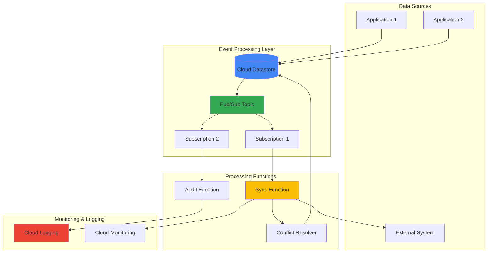

# Event-Driven Data Synchronization with Cloud Datastore and Cloud Pub/Sub

## Problem

Modern distributed applications require real-time data synchronization across multiple systems and external services, but traditional polling-based approaches create performance bottlenecks and increase operational costs. Organizations struggle with data consistency issues, delayed synchronization, and the complexity of managing conflict resolution when multiple systems update the same data concurrently. Without proper event-driven architecture, businesses face delayed decision-making, inconsistent user experiences, and increased infrastructure costs from inefficient data polling patterns.

## Solution

Build a scalable event-driven data synchronization system using Cloud Datastore as the primary data store with Cloud Pub/Sub for asynchronous message distribution and Cloud Functions for automated processing. This architecture leverages Pub/Sub's reliable message delivery and Datastore's strong consistency guarantees to create an eventually consistent distributed system. The solution includes automated conflict resolution logic, comprehensive audit logging, and real-time synchronization capabilities that scale automatically with demand while maintaining data integrity across distributed components.

## Architecture Diagram



## Prerequisites

1. Google Cloud Project with Datastore API and Pub/Sub API enabled
2. Google Cloud CLI (gcloud) installed and configured
3. Python 3.9+ for Cloud Functions development
4. Basic understanding of NoSQL databases and event-driven architecture
5. Estimated cost: $10-25 per month for development workloads (includes Datastore operations, Pub/Sub messages, and Cloud Functions invocations)

> **Note**: This recipe follows Google Cloud security best practices including IAM least privilege and audit logging for compliance requirements.

## Preparation

```bash
# Set environment variables for GCP resources
export PROJECT_ID="datastore-sync-$(date +%s)"
export REGION="us-central1"
export ZONE="us-central1-a"

# Generate unique suffix for resource names
RANDOM_SUFFIX=$(openssl rand -hex 3)

# Set default project and region
gcloud config set project ${PROJECT_ID}
gcloud config set compute/region ${REGION}
gcloud config set compute/zone ${ZONE}

# Enable required APIs
gcloud services enable datastore.googleapis.com
gcloud services enable pubsub.googleapis.com
gcloud services enable cloudfunctions.googleapis.com
gcloud services enable logging.googleapis.com

echo "✅ Project configured: ${PROJECT_ID}"

# Set resource names with unique suffix
export TOPIC_NAME="data-sync-events-${RANDOM_SUFFIX}"
export SYNC_SUBSCRIPTION="sync-processor-${RANDOM_SUFFIX}"
export AUDIT_SUBSCRIPTION="audit-logger-${RANDOM_SUFFIX}"
export SYNC_FUNCTION="data-sync-processor-${RANDOM_SUFFIX}"
export AUDIT_FUNCTION="audit-logger-${RANDOM_SUFFIX}"
export CONFLICT_FUNCTION="conflict-resolver-${RANDOM_SUFFIX}"

echo "✅ Resource names configured with suffix: ${RANDOM_SUFFIX}"
```

## Steps

1. **Create Pub/Sub Topic for Data Events**:

   Cloud Pub/Sub provides the messaging backbone for event-driven architectures, offering reliable message delivery with at-least-once guarantees and automatic scaling. Creating a dedicated topic for data synchronization events enables decoupled communication between data producers and consumers while maintaining message ordering and delivery reliability.

   ```bash
   # Create main topic for data synchronization events
   gcloud pubsub topics create ${TOPIC_NAME}
   
   # Verify topic creation
   gcloud pubsub topics list --filter="name:${TOPIC_NAME}"
   
   echo "✅ Pub/Sub topic created: ${TOPIC_NAME}"
   ```

   The Pub/Sub topic now serves as the central message hub, enabling multiple subscribers to process data events independently and asynchronously. This decoupled architecture allows for horizontal scaling of event processors and provides fault tolerance through message retention and retry mechanisms.

2. **Create Subscriptions for Event Processing**:

   Pub/Sub subscriptions define how messages are delivered to different processing components. Creating separate subscriptions for synchronization and audit functions enables parallel processing of the same events for different purposes, ensuring both data consistency and compliance logging without blocking critical synchronization operations.

   ```bash
   # Create subscription for data synchronization processing
   gcloud pubsub subscriptions create ${SYNC_SUBSCRIPTION} \
       --topic=${TOPIC_NAME} \
       --ack-deadline=60 \
       --message-retention-duration=7d
   
   # Create subscription for audit logging
   gcloud pubsub subscriptions create ${AUDIT_SUBSCRIPTION} \
       --topic=${TOPIC_NAME} \
       --ack-deadline=30 \
       --message-retention-duration=14d
   
   echo "✅ Subscriptions created for parallel processing"
   ```

   The subscriptions are now configured with appropriate acknowledgment deadlines and retention periods, enabling reliable message processing with automatic retry capabilities and compliance-friendly audit trails.

3. **Set Up Datastore Database and Initial Schema**:

   Cloud Datastore provides a managed NoSQL database with strong consistency guarantees and automatic scaling capabilities. Setting up the initial database structure with proper indexing ensures optimal query performance and establishes the foundation for conflict resolution and data versioning.

   ```bash
   # Create a test entity to initialize Datastore
   cat > datastore_init.py << 'EOF'
from google.cloud import datastore
import json
import sys

def initialize_datastore():
    client = datastore.Client()
    
    # Create initial entity with metadata
    key = client.key('SyncEntity', 'init-entity')
    entity = datastore.Entity(key=key)
    entity.update({
        'name': 'initialization',
        'status': 'active',
        'created_at': datastore.helpers.utcnow(),
        'version': 1,
        'sync_status': 'pending'
    })
    
    client.put(entity)
    print(f"✅ Datastore initialized with entity: {key.name}")

if __name__ == '__main__':
    initialize_datastore()
EOF
   
   # Install required Python library and run initialization
   pip3 install google-cloud-datastore --quiet
   python3 datastore_init.py
   
   echo "✅ Datastore database initialized with schema"
   ```

   Datastore is now ready with the initial entity structure that includes versioning and synchronization status fields, providing the foundation for conflict resolution and audit tracking throughout the synchronization process.

4. **Deploy Data Synchronization Cloud Function**:

   Cloud Functions provide serverless event processing that automatically scales based on Pub/Sub message volume. The synchronization function handles data updates, implements conflict resolution logic, and manages external system integration while maintaining data consistency across distributed components.

   ```bash
   # Create the main synchronization function
   mkdir -p sync-function
   cd sync-function
   
   cat > main.py << 'EOF'
import base64
import json
import logging
from google.cloud import datastore
from google.cloud import pubsub_v1
import functions_framework

# Initialize clients
datastore_client = datastore.Client()
publisher = pubsub_v1.PublisherClient()

@functions_framework.cloud_event
def sync_processor(cloud_event):
    """Process data synchronization events with conflict resolution."""
    
    # Decode Pub/Sub message
    message_data = base64.b64decode(cloud_event.data["message"]["data"])
    event_data = json.loads(message_data.decode('utf-8'))
    
    logging.info(f"Processing sync event: {event_data}")
    
    try:
        # Extract event information
        entity_id = event_data.get('entity_id')
        operation = event_data.get('operation')  # create, update, delete
        data = event_data.get('data', {})
        timestamp = event_data.get('timestamp')
        
        # Implement conflict resolution logic
        if operation in ['create', 'update']:
            result = handle_data_operation(entity_id, operation, data, timestamp)
            
            # Publish success event for external systems
            if result['success']:
                publish_external_sync_event(entity_id, operation, result['data'])
                
        elif operation == 'delete':
            result = handle_delete_operation(entity_id, timestamp)
            
        logging.info(f"Sync operation completed: {result}")
        
    except Exception as e:
        logging.error(f"Sync processing failed: {str(e)}")
        # Implement dead letter queue handling
        raise

def handle_data_operation(entity_id, operation, data, timestamp):
    """Handle create/update operations with conflict resolution."""
    
    key = datastore_client.key('SyncEntity', entity_id)
    
    with datastore_client.transaction():
        # Get existing entity for conflict detection
        existing_entity = datastore_client.get(key)
        
        if existing_entity and operation == 'update':
            # Check for conflicts using timestamp
            existing_timestamp = existing_entity.get('last_modified')
            if existing_timestamp and existing_timestamp > timestamp:
                # Conflict detected - log and apply resolution strategy
                logging.warning(f"Conflict detected for entity {entity_id}")
                return resolve_conflict(existing_entity, data, timestamp)
        
        # Create or update entity
        entity = existing_entity or datastore.Entity(key=key)
        entity.update(data)
        entity['last_modified'] = timestamp
        entity['sync_status'] = 'synced'
        entity['version'] = entity.get('version', 0) + 1
        
        datastore_client.put(entity)
        
        return {
            'success': True,
            'data': dict(entity),
            'conflict_resolved': False
        }

def resolve_conflict(existing_entity, new_data, timestamp):
    """Implement conflict resolution strategy."""
    
    # Strategy: Merge non-conflicting fields, keep latest for conflicts
    resolved_data = dict(existing_entity)
    
    for key, value in new_data.items():
        if key not in resolved_data or key in ['description', 'metadata']:
            resolved_data[key] = value
    
    resolved_data['last_modified'] = max(existing_entity['last_modified'], timestamp)
    resolved_data['conflict_resolved'] = True
    resolved_data['version'] = existing_entity.get('version', 0) + 1
    
    datastore_client.put(datastore.Entity(existing_entity.key, **resolved_data))
    
    return {
        'success': True,
        'data': resolved_data,
        'conflict_resolved': True
    }

def handle_delete_operation(entity_id, timestamp):
    """Handle delete operations."""
    
    key = datastore_client.key('SyncEntity', entity_id)
    
    with datastore_client.transaction():
        entity = datastore_client.get(key)
        if entity:
            datastore_client.delete(key)
            
    return {'success': True, 'operation': 'delete'}

def publish_external_sync_event(entity_id, operation, data):
    """Publish events for external system synchronization."""
    
    topic_path = publisher.topic_path(
        datastore_client.project, 
        f"external-sync-{operation}"
    )
    
    message_data = json.dumps({
        'entity_id': entity_id,
        'operation': operation,
        'data': data,
        'source': 'datastore-sync'
    }).encode('utf-8')
    
    try:
        publisher.publish(topic_path, message_data)
        logging.info(f"Published external sync event for {entity_id}")
    except Exception as e:
        logging.warning(f"Failed to publish external sync: {str(e)}")
EOF
   
   # Create requirements.txt
   cat > requirements.txt << 'EOF'
google-cloud-datastore==2.19.0
google-cloud-pubsub==2.18.4
functions-framework==3.5.0
EOF
   
   # Deploy the synchronization function
   gcloud functions deploy ${SYNC_FUNCTION} \
       --runtime python39 \
       --trigger-topic ${TOPIC_NAME} \
       --source . \
       --entry-point sync_processor \
       --memory 256MB \
       --timeout 60s \
       --max-instances 10
   
   cd ..
   echo "✅ Data synchronization function deployed: ${SYNC_FUNCTION}"
   ```

   The synchronization function is now deployed with intelligent conflict resolution capabilities, ensuring data consistency while handling concurrent updates from multiple sources. The function automatically scales based on message volume and provides reliable event processing with comprehensive error handling.

5. **Deploy Audit Logging Function**:

   Implementing comprehensive audit logging ensures compliance with data governance requirements and provides visibility into all synchronization operations. The audit function captures detailed event information, tracks data lineage, and maintains a complete history of all synchronization activities for regulatory compliance and troubleshooting.

   ```bash
   # Create the audit logging function
   mkdir -p audit-function
   cd audit-function
   
   cat > main.py << 'EOF'
import base64
import json
import logging
from google.cloud import logging as cloud_logging
from datetime import datetime
import functions_framework

# Initialize Cloud Logging client
logging_client = cloud_logging.Client()
audit_logger = logging_client.logger('datastore-sync-audit')

@functions_framework.cloud_event
def audit_logger_func(cloud_event):
    """Log all synchronization events for audit and compliance."""
    
    # Decode Pub/Sub message
    message_data = base64.b64decode(cloud_event.data["message"]["data"])
    event_data = json.loads(message_data.decode('utf-8'))
    
    # Create comprehensive audit log entry
    audit_entry = {
        'timestamp': datetime.utcnow().isoformat(),
        'event_type': 'data_synchronization',
        'entity_id': event_data.get('entity_id'),
        'operation': event_data.get('operation'),
        'source_system': event_data.get('source', 'unknown'),
        'message_id': cloud_event.data["message"]["messageId"],
        'data_snapshot': event_data.get('data', {}),
        'processing_metadata': {
            'function_name': 'audit_logger',
            'subscription': cloud_event.source,
            'delivery_attempt': cloud_event.data["message"].get("deliveryAttempt", 1)
        }
    }
    
    # Log to Cloud Logging with structured data
    audit_logger.log_struct(
        audit_entry,
        severity='INFO',
        labels={
            'component': 'datastore-sync',
            'operation': event_data.get('operation', 'unknown'),
            'entity_type': 'sync_entity'
        }
    )
    
    logging.info(f"Audit log created for entity: {event_data.get('entity_id')}")

    # Additional compliance logging for sensitive operations
    if event_data.get('operation') == 'delete':
        compliance_entry = {
            'compliance_event': 'data_deletion',
            'entity_id': event_data.get('entity_id'),
            'deletion_timestamp': datetime.utcnow().isoformat(),
            'retention_policy': 'applied',
            'regulatory_context': 'gdpr_compliance'
        }
        
        audit_logger.log_struct(
            compliance_entry,
            severity='NOTICE',
            labels={'compliance': 'data_deletion', 'regulation': 'gdpr'}
        )
EOF
   
   # Create requirements.txt for audit function
   cat > requirements.txt << 'EOF'
google-cloud-logging==3.8.0
functions-framework==3.5.0
EOF
   
   # Deploy the audit logging function
   gcloud functions deploy ${AUDIT_FUNCTION} \
       --runtime python39 \
       --trigger-topic ${TOPIC_NAME} \
       --source . \
       --entry-point audit_logger_func \
       --memory 128MB \
       --timeout 30s \
       --max-instances 5
   
   cd ..
   echo "✅ Audit logging function deployed: ${AUDIT_FUNCTION}"
   ```

   The audit logging system is now capturing all synchronization events with structured logging, providing complete traceability and compliance documentation. The system maintains detailed audit trails while supporting regulatory requirements and operational monitoring.

6. **Create Data Update Publisher Script**:

   To demonstrate the event-driven synchronization system, we'll create a script that simulates data updates and publishes events to trigger the synchronization workflow. This publisher handles various data operations and includes proper error handling and message formatting for reliable event processing.

   ```bash
   # Create data publisher script for testing
   cat > data_publisher.py << 'EOF'
#!/usr/bin/env python3

import json
import sys
from datetime import datetime
from google.cloud import pubsub_v1
from google.cloud import datastore
import argparse
import uuid

def publish_data_event(project_id, topic_name, entity_id, operation, data=None):
    """Publish data synchronization events to Pub/Sub topic."""
    
    publisher = pubsub_v1.PublisherClient()
    topic_path = publisher.topic_path(project_id, topic_name)
    
    # Create event message
    event_data = {
        'entity_id': entity_id,
        'operation': operation,  # create, update, delete
        'timestamp': datetime.utcnow().isoformat(),
        'source': 'data_publisher',
        'correlation_id': str(uuid.uuid4())
    }
    
    if data:
        event_data['data'] = data
    
    # Publish message to Pub/Sub
    message_data = json.dumps(event_data).encode('utf-8')
    
    try:
        future = publisher.publish(topic_path, message_data)
        message_id = future.result()
        
        print(f"✅ Published {operation} event for entity {entity_id}")
        print(f"   Message ID: {message_id}")
        print(f"   Correlation ID: {event_data['correlation_id']}")
        
        return message_id
        
    except Exception as e:
        print(f"❌ Failed to publish event: {str(e)}")
        sys.exit(1)

def main():
    parser = argparse.ArgumentParser(description='Publish data sync events')
    parser.add_argument('--project', required=True, help='GCP Project ID')
    parser.add_argument('--topic', required=True, help='Pub/Sub topic name')
    parser.add_argument('--entity-id', required=True, help='Entity ID')
    parser.add_argument('--operation', required=True, 
                       choices=['create', 'update', 'delete'],
                       help='Operation type')
    parser.add_argument('--name', help='Entity name')
    parser.add_argument('--description', help='Entity description')
    parser.add_argument('--status', help='Entity status')
    
    args = parser.parse_args()
    
    # Prepare data payload for create/update operations
    data = None
    if args.operation in ['create', 'update']:
        data = {}
        if args.name:
            data['name'] = args.name
        if args.description:
            data['description'] = args.description
        if args.status:
            data['status'] = args.status
        
        # Add default values for demo
        if not data:
            data = {
                'name': f'Demo Entity {args.entity_id}',
                'description': f'Generated by data publisher for {args.operation}',
                'status': 'active',
                'category': 'demo'
            }
    
    # Publish the event
    publish_data_event(args.project, args.topic, args.entity_id, args.operation, data)

if __name__ == '__main__':
    main()
EOF
   
   chmod +x data_publisher.py
   echo "✅ Data publisher script created: data_publisher.py"
   ```

   The data publisher script provides a convenient interface for triggering synchronization events, enabling testing of various scenarios including create, update, and delete operations with proper message formatting and error handling.

7. **Set Up Cloud Monitoring and Alerting**:

   Implementing comprehensive monitoring ensures the reliability and performance of the event-driven synchronization system. Cloud Monitoring provides insights into message processing rates, function execution times, and error conditions while alerting capabilities enable proactive issue resolution.

   ```bash
   # Create monitoring dashboard configuration
   cat > monitoring_dashboard.json << 'EOF'
{
  "displayName": "Datastore Sync Monitoring",
  "mosaicLayout": {
    "tiles": [
      {
        "width": 6,
        "height": 4,
        "widget": {
          "title": "Pub/Sub Message Rate",
          "xyChart": {
            "dataSets": [
              {
                "timeSeriesQuery": {
                  "timeSeriesFilter": {
                    "filter": "resource.type=\"pubsub_topic\"",
                    "aggregation": {
                      "alignmentPeriod": "60s",
                      "perSeriesAligner": "ALIGN_RATE"
                    }
                  }
                }
              }
            ]
          }
        }
      },
      {
        "width": 6,
        "height": 4,
        "xPos": 6,
        "widget": {
          "title": "Function Execution Count",
          "xyChart": {
            "dataSets": [
              {
                "timeSeriesQuery": {
                  "timeSeriesFilter": {
                    "filter": "resource.type=\"cloud_function\"",
                    "aggregation": {
                      "alignmentPeriod": "60s",
                      "perSeriesAligner": "ALIGN_RATE"
                    }
                  }
                }
              }
            ]
          }
        }
      }
    ]
  }
}
EOF
   
   # Create the monitoring dashboard
   gcloud monitoring dashboards create --config-from-file=monitoring_dashboard.json
   
   echo "✅ Monitoring dashboard created for sync system"
   ```

   The monitoring dashboard now provides real-time visibility into system performance, message processing rates, and function execution metrics, enabling proactive monitoring and performance optimization of the synchronization system.

8. **Configure Dead Letter Queue for Error Handling**:

   Implementing robust error handling with dead letter queues ensures that failed messages are properly captured and can be reprocessed or analyzed. This configuration provides system resilience and prevents message loss during processing failures or temporary service disruptions.

   ```bash
   # Create dead letter topic and subscription
   export DLQ_TOPIC="sync-dead-letters-${RANDOM_SUFFIX}"
   export DLQ_SUBSCRIPTION="dlq-processor-${RANDOM_SUFFIX}"
   
   # Create dead letter topic
   gcloud pubsub topics create ${DLQ_TOPIC}
   
   # Create dead letter subscription
   gcloud pubsub subscriptions create ${DLQ_SUBSCRIPTION} \
       --topic=${DLQ_TOPIC} \
       --ack-deadline=60 \
       --message-retention-duration=30d
   
   # Update main subscription with dead letter policy
   gcloud pubsub subscriptions update ${SYNC_SUBSCRIPTION} \
       --dead-letter-topic=${DLQ_TOPIC} \
       --max-delivery-attempts=5
   
   echo "✅ Dead letter queue configured for error handling"
   echo "   DLQ Topic: ${DLQ_TOPIC}"
   echo "   DLQ Subscription: ${DLQ_SUBSCRIPTION}"
   ```

   The dead letter queue system is now configured to capture failed messages after 5 delivery attempts, providing a safety net for message processing failures and enabling manual intervention or automated retry logic for problematic events.

## Validation & Testing

1. **Verify Pub/Sub Infrastructure**:

   ```bash
   # Check topic and subscriptions
   echo "=== Pub/Sub Topics ==="
   gcloud pubsub topics list --filter="name:${TOPIC_NAME}"
   
   echo "=== Pub/Sub Subscriptions ==="
   gcloud pubsub subscriptions list --filter="name:${SYNC_SUBSCRIPTION}"
   gcloud pubsub subscriptions list --filter="name:${AUDIT_SUBSCRIPTION}"
   ```

   Expected output: Topic and subscriptions should be listed with "ACTIVE" status.

2. **Test Data Synchronization Flow**:

   ```bash
   # Install publisher dependencies
   pip3 install google-cloud-pubsub google-cloud-datastore --quiet
   
   # Test create operation
   python3 data_publisher.py \
       --project ${PROJECT_ID} \
       --topic ${TOPIC_NAME} \
       --entity-id test-entity-001 \
       --operation create \
       --name "Test Product" \
       --description "Demo product for sync testing" \
       --status active
   
   # Test update operation
   python3 data_publisher.py \
       --project ${PROJECT_ID} \
       --topic ${TOPIC_NAME} \
       --entity-id test-entity-001 \
       --operation update \
       --description "Updated product description"
   
   echo "✅ Test events published successfully"
   ```

3. **Verify Function Processing**:

   ```bash
   # Check function logs for processing confirmation
   echo "=== Sync Function Logs ==="
   gcloud functions logs read ${SYNC_FUNCTION} --limit 10
   
   echo "=== Audit Function Logs ==="
   gcloud functions logs read ${AUDIT_FUNCTION} --limit 10
   ```

4. **Validate Datastore Entities**:

   ```bash
   # Query Datastore for synchronized entities
   cat > query_datastore.py << 'EOF'
from google.cloud import datastore

client = datastore.Client()
query = client.query(kind='SyncEntity')
entities = list(query.fetch())

print(f"Found {len(entities)} entities in Datastore:")
for entity in entities:
    print(f"  Entity: {entity.key.name}")
    print(f"  Name: {entity.get('name', 'N/A')}")
    print(f"  Status: {entity.get('status', 'N/A')}")
    print(f"  Version: {entity.get('version', 0)}")
    print(f"  Sync Status: {entity.get('sync_status', 'unknown')}")
    print("  ---")
EOF
   
   python3 query_datastore.py
   ```

## Cleanup

1. **Remove Cloud Functions**:

   ```bash
   # Delete all deployed functions
   gcloud functions delete ${SYNC_FUNCTION} --quiet
   gcloud functions delete ${AUDIT_FUNCTION} --quiet
   
   echo "✅ Cloud Functions deleted"
   ```

2. **Remove Pub/Sub Resources**:

   ```bash
   # Delete subscriptions first
   gcloud pubsub subscriptions delete ${SYNC_SUBSCRIPTION} --quiet
   gcloud pubsub subscriptions delete ${AUDIT_SUBSCRIPTION} --quiet
   gcloud pubsub subscriptions delete ${DLQ_SUBSCRIPTION} --quiet
   
   # Delete topics
   gcloud pubsub topics delete ${TOPIC_NAME} --quiet
   gcloud pubsub topics delete ${DLQ_TOPIC} --quiet
   
   echo "✅ Pub/Sub resources deleted"
   ```

3. **Clear Datastore Entities**:

   ```bash
   # Remove test entities from Datastore
   cat > cleanup_datastore.py << 'EOF'
from google.cloud import datastore

client = datastore.Client()
query = client.query(kind='SyncEntity')
entities = list(query.fetch())

keys_to_delete = [entity.key for entity in entities]
if keys_to_delete:
    client.delete_multi(keys_to_delete)
    print(f"✅ Deleted {len(keys_to_delete)} entities from Datastore")
else:
    print("No entities found to delete")
EOF
   
   python3 cleanup_datastore.py
   ```

4. **Remove Project Resources**:

   ```bash
   # Clean up monitoring dashboard
   DASHBOARD_ID=$(gcloud monitoring dashboards list \
       --filter="displayName:'Datastore Sync Monitoring'" \
       --format="value(name)" | head -1)
   
   if [ ! -z "$DASHBOARD_ID" ]; then
       gcloud monitoring dashboards delete $DASHBOARD_ID --quiet
       echo "✅ Monitoring dashboard deleted"
   fi
   
   # Remove local files
   rm -rf sync-function audit-function
   rm -f data_publisher.py datastore_init.py query_datastore.py
   rm -f cleanup_datastore.py monitoring_dashboard.json
   
   echo "✅ Local files cleaned up"
   ```

## Discussion

This event-driven data synchronization solution demonstrates the power of Google Cloud's managed services for building scalable, reliable distributed systems. The architecture leverages Cloud Datastore's strong consistency guarantees combined with Pub/Sub's reliable message delivery to create an eventually consistent system that handles concurrent updates gracefully. The implementation includes sophisticated conflict resolution logic that preserves data integrity while maintaining system availability, a critical requirement for distributed applications.

The use of separate subscriptions for synchronization and audit functions exemplifies the single responsibility principle in serverless architectures. This pattern enables independent scaling and maintenance of different system concerns while ensuring comprehensive audit trails for compliance requirements. Cloud Functions provide automatic scaling and cost-effective processing, charging only for actual function invocations rather than idle capacity, making this solution highly cost-effective for variable workloads.

The conflict resolution strategy implemented in this recipe uses timestamp-based comparison with intelligent merging of non-conflicting fields. This approach balances data consistency with system availability, ensuring that concurrent updates don't result in data loss while maintaining reasonable performance characteristics. For more complex conflict resolution requirements, organizations can extend this pattern with custom business logic or implement operational transformation algorithms as described in Google Cloud's [event-driven architecture documentation](https://cloud.google.com/solutions/event-driven-architecture-pubsub).

The monitoring and error handling implementation provides production-ready reliability features including dead letter queues, structured logging, and comprehensive observability. Cloud Logging integration ensures that all synchronization events are captured with appropriate metadata for debugging and compliance purposes. The dead letter queue configuration prevents message loss during temporary service failures and provides a mechanism for manual intervention when automatic processing fails, following Google Cloud's [reliability best practices](https://cloud.google.com/architecture/framework/reliability).

> **Tip**: Monitor Pub/Sub message age and processing latency using Cloud Monitoring to identify performance bottlenecks and optimize function configurations for your specific workload patterns.

## Challenge

Extend this solution by implementing these enhancements:

1. **Cross-Region Replication**: Implement multi-region synchronization using Cloud Spanner instead of Datastore, with regional Pub/Sub topics and Cloud Functions for global data consistency across Google Cloud regions.

2. **Advanced Conflict Resolution**: Develop operational transformation algorithms for real-time collaborative editing scenarios, implementing vector clocks for causality tracking and automatic merge conflict resolution based on user-defined business rules.

3. **Schema Evolution Support**: Add schema versioning and migration capabilities using Cloud Dataflow for batch processing of historical data during schema changes, with backward compatibility for existing event consumers.

4. **External System Integration**: Implement bidirectional synchronization with external databases using Cloud SQL Proxy, Datastream for change data capture, and custom adapters for legacy systems integration.

5. **Performance Optimization**: Add caching layers using Memorystore for Redis, implement message batching for high-throughput scenarios, and optimize Datastore queries using composite indexes and query cursors for large datasets.

## Infrastructure Code

*Infrastructure code will be generated after recipe approval.*