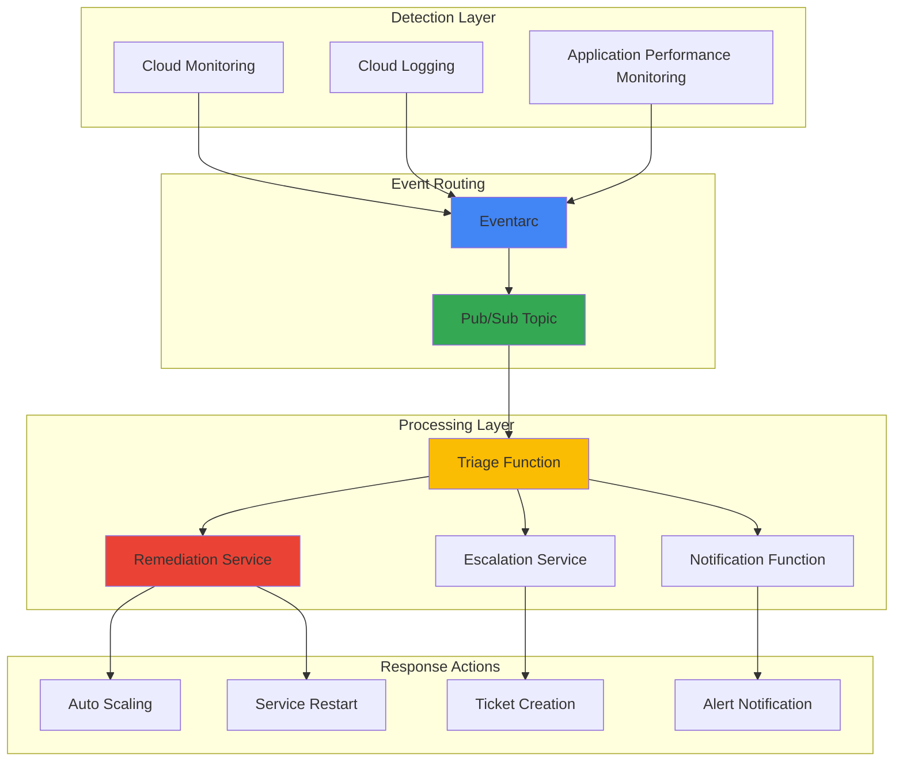

# Event-Driven Incident Response with Eventarc and Cloud Operations Suite

## Problem

Modern cloud environments generate thousands of infrastructure and application events daily, making manual incident response inefficient and prone to human error. Organizations struggle with delayed response times, inconsistent remediation procedures, and the inability to automatically correlate events across multiple systems, resulting in prolonged outages and increased business impact.

## Solution

Build an automated incident response system using Eventarc to route Cloud Operations Suite monitoring alerts through event-driven workflows. This solution leverages Cloud Functions for lightweight automation tasks and Cloud Run services for complex remediation workflows, providing centralized event management with automated triage, escalation, and remediation capabilities.

## Architecture Diagram



## Prerequisites

1. Google Cloud project with appropriate permissions (Project Editor or custom role with Eventarc, Cloud Functions, Cloud Run, and Cloud Monitoring permissions)
2. Google Cloud CLI (gcloud) installed and configured version 400.0.0 or later
3. Docker installed locally for containerized service development
4. Basic understanding of event-driven architectures and incident response procedures
5. Knowledge of Cloud Operations Suite monitoring and alerting concepts
6. Estimated cost: $50-100/month for moderate workloads (depending on event volume and function executions)

> **Note**: This recipe creates resources in multiple Google Cloud services. Monitor your billing dashboard to track costs and set up budget alerts to avoid unexpected charges.

## Preparation

```bash
# Set environment variables for GCP resources
export PROJECT_ID="incident-response-$(date +%s)"
export REGION="us-central1"
export ZONE="us-central1-a"

# Generate unique suffix for resource names
RANDOM_SUFFIX=$(openssl rand -hex 3)
export INCIDENT_TOPIC="incident-alerts-${RANDOM_SUFFIX}"
export TRIAGE_FUNCTION="incident-triage-${RANDOM_SUFFIX}"
export NOTIFICATION_FUNCTION="incident-notify-${RANDOM_SUFFIX}"
export REMEDIATION_SERVICE="incident-remediate-${RANDOM_SUFFIX}"
export ESCALATION_SERVICE="incident-escalate-${RANDOM_SUFFIX}"

# Set default project and region
gcloud config set project ${PROJECT_ID}
gcloud config set compute/region ${REGION}
gcloud config set compute/zone ${ZONE}

# Enable required APIs
gcloud services enable eventarc.googleapis.com \
    cloudfunctions.googleapis.com \
    run.googleapis.com \
    monitoring.googleapis.com \
    logging.googleapis.com \
    pubsub.googleapis.com \
    cloudbuild.googleapis.com

# Create Pub/Sub topic for incident events
gcloud pubsub topics create ${INCIDENT_TOPIC}

echo "✅ Project configured: ${PROJECT_ID}"
echo "✅ Required APIs enabled and Pub/Sub topic created"
```

## Steps

1. **Create Service Account for Incident Response System**:

   Google Cloud's Identity and Access Management (IAM) provides granular security controls for automated systems. Creating a dedicated service account with minimal required permissions follows the principle of least privilege, ensuring the incident response system can perform necessary operations while maintaining security boundaries. This approach enables audit trails and simplified permission management across the entire response workflow.

   ```bash
   # Create service account for incident response automation
   gcloud iam service-accounts create incident-response-sa \
       --display-name="Incident Response Service Account" \
       --description="Service account for automated incident response"
   
   # Grant necessary permissions for monitoring and compute operations
   gcloud projects add-iam-policy-binding ${PROJECT_ID} \
       --member="serviceAccount:incident-response-sa@${PROJECT_ID}.iam.gserviceaccount.com" \
       --role="roles/monitoring.viewer"
   
   gcloud projects add-iam-policy-binding ${PROJECT_ID} \
       --member="serviceAccount:incident-response-sa@${PROJECT_ID}.iam.gserviceaccount.com" \
       --role="roles/compute.instanceAdmin"
   
   gcloud projects add-iam-policy-binding ${PROJECT_ID} \
       --member="serviceAccount:incident-response-sa@${PROJECT_ID}.iam.gserviceaccount.com" \
       --role="roles/pubsub.publisher"
   
   echo "✅ Service account created with appropriate IAM permissions"
   ```

   The service account now has the minimum permissions required to read monitoring data, manage compute instances for auto-remediation, and publish events to Pub/Sub topics. This foundation ensures secure automation while enabling comprehensive incident response capabilities.

2. **Deploy Incident Triage Cloud Function**:

   Cloud Functions provides serverless execution for lightweight event processing tasks. The triage function acts as the central decision engine, analyzing incoming alerts to determine severity, categorize incident types, and route events to appropriate response mechanisms. This serverless approach ensures automatic scaling during high-volume incident periods while maintaining cost efficiency through pay-per-execution pricing.

   ```bash
   # Create function source directory
   mkdir -p functions/triage
   cd functions/triage
   
   # Create the triage function code
   cat > main.py << 'EOF'
import json
import base64
from google.cloud import pubsub_v1
from google.cloud import monitoring_v3
import functions_framework
import os
import logging
   
logging.basicConfig(level=logging.INFO)
logger = logging.getLogger(__name__)
   
PROJECT_ID = os.environ.get('GCP_PROJECT')
publisher = pubsub_v1.PublisherClient()
   
@functions_framework.cloud_event
def triage_incident(cloud_event):
    """Analyze and triage incoming monitoring alerts"""
    try:
        # Decode Pub/Sub message
        if 'data' in cloud_event.data:
            message_data = base64.b64decode(cloud_event.data['data']).decode('utf-8')
            alert_data = json.loads(message_data)
        else:
            alert_data = cloud_event.data
        
        # Extract alert metadata
        incident_type = alert_data.get('incident', {}).get('condition_name', 'unknown')
        severity = determine_severity(alert_data)
        resource_type = alert_data.get('incident', {}).get('resource_name', '')
        
        # Create triage decision
        triage_result = {
            'incident_id': alert_data.get('incident', {}).get('incident_id'),
            'severity': severity,
            'incident_type': incident_type,
            'resource_type': resource_type,
            'automated_response': determine_response_action(severity, incident_type),
            'requires_escalation': severity in ['CRITICAL', 'HIGH'],
            'timestamp': cloud_event.get('time'),
            'original_alert': alert_data
        }
        
        # Route to appropriate response services
        route_incident(triage_result)
        
        logger.info(f"Successfully triaged incident: {triage_result['incident_id']}")
        return 'Incident triaged successfully'
        
    except Exception as e:
        logger.error(f"Error triaging incident: {str(e)}")
        raise
   
def determine_severity(alert_data):
    """Determine incident severity based on alert conditions"""
    condition = alert_data.get('incident', {}).get('condition_name', '').lower()
    
    if any(keyword in condition for keyword in ['down', 'failure', 'error_rate_high']):
        return 'CRITICAL'
    elif any(keyword in condition for keyword in ['latency_high', 'cpu_high', 'memory_high']):
        return 'HIGH'
    elif any(keyword in condition for keyword in ['warning', 'threshold']):
        return 'MEDIUM'
    else:
        return 'LOW'
   
def determine_response_action(severity, incident_type):
    """Determine automated response based on severity and type"""
    if severity == 'CRITICAL':
        return 'immediate_remediation'
    elif severity == 'HIGH':
        return 'auto_scale_and_notify'
    elif severity == 'MEDIUM':
        return 'notify_only'
    else:
        return 'log_only'
   
def route_incident(triage_result):
    """Route incident to appropriate response services"""
    response_action = triage_result['automated_response']
    
    if response_action == 'immediate_remediation':
        publish_to_topic('remediation-topic', triage_result)
    elif response_action == 'auto_scale_and_notify':
        publish_to_topic('remediation-topic', triage_result)
        publish_to_topic('notification-topic', triage_result)
    elif response_action == 'notify_only':
        publish_to_topic('notification-topic', triage_result)
    
    if triage_result['requires_escalation']:
        publish_to_topic('escalation-topic', triage_result)
   
def publish_to_topic(topic_name, data):
    """Publish data to specified Pub/Sub topic"""
    try:
        topic_path = publisher.topic_path(PROJECT_ID, topic_name)
        message_data = json.dumps(data).encode('utf-8')
        future = publisher.publish(topic_path, message_data)
        logger.info(f"Published to {topic_name}: {future.result()}")
    except Exception as e:
        logger.error(f"Failed to publish to {topic_name}: {str(e)}")
EOF
   
   # Create requirements file
   cat > requirements.txt << 'EOF'
functions-framework==3.4.0
google-cloud-pubsub==2.18.0
google-cloud-monitoring==2.15.0
EOF
   
   # Deploy the triage function
   gcloud functions deploy ${TRIAGE_FUNCTION} \
       --runtime=python311 \
       --source=. \
       --entry-point=triage_incident \
       --trigger-topic=${INCIDENT_TOPIC} \
       --service-account=incident-response-sa@${PROJECT_ID}.iam.gserviceaccount.com \
       --memory=512MB \
       --timeout=540s \
       --set-env-vars=GCP_PROJECT=${PROJECT_ID}
   
   cd ../..
   echo "✅ Incident triage function deployed successfully"
   ```

   The triage function is now operational and will automatically analyze incoming monitoring alerts, categorize them by severity, and route them to appropriate response mechanisms. This intelligent routing reduces alert fatigue and ensures critical incidents receive immediate attention while lower-priority events are handled appropriately.

3. **Create Notification Cloud Function**:

   Effective incident response requires immediate stakeholder notification through multiple channels. This Cloud Function integrates with various communication platforms to ensure the right people are notified based on incident severity and type. The function supports multiple notification channels and can be easily extended to integrate with additional systems like Slack, PagerDuty, or custom notification services.

   ```bash
   # Create notification function directory
   mkdir -p functions/notification
   cd functions/notification
   
   # Create notification function code
   cat > main.py << 'EOF'
import json
import base64
import smtplib
from email.mime.text import MIMEText
from email.mime.multipart import MIMEMultipart
import functions_framework
import logging
import os
from google.cloud import secretmanager
   
logging.basicConfig(level=logging.INFO)
logger = logging.getLogger(__name__)
   
PROJECT_ID = os.environ.get('GCP_PROJECT')
   
@functions_framework.cloud_event
def send_notifications(cloud_event):
    """Send incident notifications to appropriate channels"""
    try:
        # Decode Pub/Sub message
        if 'data' in cloud_event.data:
            message_data = base64.b64decode(cloud_event.data['data']).decode('utf-8')
            incident_data = json.loads(message_data)
        else:
            incident_data = cloud_event.data
        
        severity = incident_data.get('severity', 'UNKNOWN')
        incident_id = incident_data.get('incident_id', 'N/A')
        incident_type = incident_data.get('incident_type', 'Unknown')
        
        # Determine notification channels based on severity
        channels = get_notification_channels(severity)
        
        # Create notification content
        notification_content = create_notification_content(incident_data)
        
        # Send notifications through each channel
        for channel in channels:
            send_channel_notification(channel, notification_content, incident_data)
        
        logger.info(f"Notifications sent for incident: {incident_id}")
        return 'Notifications sent successfully'
        
    except Exception as e:
        logger.error(f"Error sending notifications: {str(e)}")
        raise
   
def get_notification_channels(severity):
    """Get notification channels based on incident severity"""
    channels = ['email']  # Always send email
    
    if severity in ['CRITICAL', 'HIGH']:
        channels.extend(['slack', 'sms'])  # Add urgent channels for high severity
    
    return channels
   
def create_notification_content(incident_data):
    """Create formatted notification content"""
    severity = incident_data.get('severity', 'UNKNOWN')
    incident_id = incident_data.get('incident_id', 'N/A')
    incident_type = incident_data.get('incident_type', 'Unknown')
    resource_type = incident_data.get('resource_type', 'Unknown')
    automated_response = incident_data.get('automated_response', 'None')
    
    subject = f"🚨 {severity} Incident Alert: {incident_type}"
    
    body = f"""
Incident Alert Summary
=====================
Incident ID: {incident_id}
Severity: {severity}
Type: {incident_type}
Affected Resource: {resource_type}
Automated Response: {automated_response}
Timestamp: {incident_data.get('timestamp', 'N/A')}

This incident has been automatically triaged and appropriate response actions have been initiated.
Monitor the incident response dashboard for real-time updates.

Google Cloud Incident Response System
"""
    
    return {'subject': subject, 'body': body}
   
def send_channel_notification(channel, content, incident_data):
    """Send notification through specified channel"""
    try:
        if channel == 'email':
            send_email_notification(content, incident_data)
        elif channel == 'slack':
            send_slack_notification(content, incident_data)
        elif channel == 'sms':
            send_sms_notification(content, incident_data)
        
        logger.info(f"Notification sent via {channel}")
        
    except Exception as e:
        logger.error(f"Failed to send {channel} notification: {str(e)}")
   
def send_email_notification(content, incident_data):
    """Send email notification (placeholder implementation)"""
    # In production, integrate with SendGrid, Gmail API, or SMTP server
    logger.info(f"Email notification: {content['subject']}")
   
def send_slack_notification(content, incident_data):
    """Send Slack notification (placeholder implementation)"""
    # In production, integrate with Slack webhook or API
    logger.info(f"Slack notification: {content['subject']}")
   
def send_sms_notification(content, incident_data):
    """Send SMS notification (placeholder implementation)"""
    # In production, integrate with Twilio or Google Cloud SMS API
    logger.info(f"SMS notification: {content['subject']}")
EOF
   
   # Create requirements file
   cat > requirements.txt << 'EOF'
functions-framework==3.4.0
google-cloud-secret-manager==2.16.0
EOF
   
   # Deploy notification function
   gcloud functions deploy ${NOTIFICATION_FUNCTION} \
       --runtime=python311 \
       --source=. \
       --entry-point=send_notifications \
       --trigger-topic=notification-topic \
       --service-account=incident-response-sa@${PROJECT_ID}.iam.gserviceaccount.com \
       --memory=256MB \
       --timeout=300s \
       --set-env-vars=GCP_PROJECT=${PROJECT_ID}
   
   cd ../..
   echo "✅ Notification function deployed successfully"
   ```

   The notification system is now configured to send multi-channel alerts based on incident severity. This ensures stakeholders receive timely notifications through appropriate channels, enabling faster response times and improved incident resolution.

4. **Deploy Remediation Cloud Run Service**:

   Cloud Run provides containerized compute for complex remediation workflows that require more resources and flexibility than Cloud Functions. This service implements intelligent auto-remediation procedures such as restarting failed services, scaling resources, and applying configuration fixes. The containerized approach enables sophisticated remediation logic while maintaining serverless scalability and cost efficiency.

   ```bash
   # Create remediation service directory
   mkdir -p services/remediation
   cd services/remediation
   
   # Create remediation service code
   cat > main.py << 'EOF'
import json
import logging
from flask import Flask, request
from google.cloud import compute_v1
from google.cloud import monitoring_v3
import os
import time
   
app = Flask(__name__)
logging.basicConfig(level=logging.INFO)
logger = logging.getLogger(__name__)
   
PROJECT_ID = os.environ.get('GCP_PROJECT')
ZONE = os.environ.get('GCP_ZONE', 'us-central1-a')
   
compute_client = compute_v1.InstancesClient()
monitoring_client = monitoring_v3.MetricServiceClient()
   
@app.route('/', methods=['POST'])
def handle_remediation():
    """Handle incoming remediation requests"""
    try:
        # Parse incident data from request
        incident_data = request.get_json()
        
        if not incident_data:
            return 'No incident data provided', 400
        
        incident_type = incident_data.get('incident_type', '').lower()
        severity = incident_data.get('severity', 'UNKNOWN')
        resource_type = incident_data.get('resource_type', '')
        
        logger.info(f"Processing remediation for incident: {incident_data.get('incident_id')}")
        
        # Execute appropriate remediation based on incident type
        remediation_result = execute_remediation(incident_type, resource_type, incident_data)
        
        # Log remediation actions
        log_remediation_action(incident_data, remediation_result)
        
        return json.dumps({
            'status': 'success',
            'incident_id': incident_data.get('incident_id'),
            'remediation_actions': remediation_result
        })
        
    except Exception as e:
        logger.error(f"Remediation failed: {str(e)}")
        return json.dumps({'status': 'error', 'message': str(e)}), 500
   
def execute_remediation(incident_type, resource_type, incident_data):
    """Execute specific remediation actions based on incident type"""
    actions_taken = []
    
    if 'cpu_high' in incident_type:
        actions_taken.extend(handle_high_cpu(resource_type, incident_data))
    elif 'memory_high' in incident_type:
        actions_taken.extend(handle_high_memory(resource_type, incident_data))
    elif 'service_down' in incident_type:
        actions_taken.extend(handle_service_down(resource_type, incident_data))
    elif 'error_rate_high' in incident_type:
        actions_taken.extend(handle_high_error_rate(resource_type, incident_data))
    else:
        actions_taken.append(f"No automated remediation available for: {incident_type}")
    
    return actions_taken
   
def handle_high_cpu(resource_type, incident_data):
    """Handle high CPU utilization incidents"""
    actions = []
    
    if 'compute' in resource_type.lower():
        # Scale up compute instances
        actions.append("Initiated auto-scaling for compute instances")
        # In production, implement actual scaling logic
        logger.info("Would scale up compute instances for high CPU")
    
    return actions
   
def handle_high_memory(resource_type, incident_data):
    """Handle high memory utilization incidents"""
    actions = []
    
    if 'compute' in resource_type.lower():
        # Restart services to clear memory leaks
        actions.append("Restarted services to clear potential memory leaks")
        # In production, implement actual restart logic
        logger.info("Would restart services for high memory usage")
    
    return actions
   
def handle_service_down(resource_type, incident_data):
    """Handle service downtime incidents"""
    actions = []
    
    # Attempt service restart
    actions.append("Attempted automatic service restart")
    
    # Check health endpoints
    actions.append("Verified health endpoint status")
    
    # In production, implement actual service restart logic
    logger.info("Would restart failed services")
    
    return actions
   
def handle_high_error_rate(resource_type, incident_data):
    """Handle high error rate incidents"""
    actions = []
    
    # Roll back to previous version if recent deployment
    actions.append("Checked for recent deployments - rollback candidate identified")
    
    # Scale up resources to handle load
    actions.append("Scaled up resources to handle increased load")
    
    # In production, implement actual rollback and scaling logic
    logger.info("Would execute rollback and scaling for high error rates")
    
    return actions
   
def log_remediation_action(incident_data, actions):
    """Log remediation actions for audit trail"""
    logger.info(f"Remediation completed for incident {incident_data.get('incident_id')}")
    for action in actions:
        logger.info(f"Action taken: {action}")
   
if __name__ == '__main__':
    port = int(os.environ.get('PORT', 8080))
    app.run(host='0.0.0.0', port=port)
EOF
   
   # Create Dockerfile
   cat > Dockerfile << 'EOF'
FROM python:3.11-slim
   
WORKDIR /app
   
COPY requirements.txt .
RUN pip install --no-cache-dir -r requirements.txt
   
COPY . .
   
EXPOSE 8080
   
CMD ["python", "main.py"]
EOF
   
   # Create requirements file
   cat > requirements.txt << 'EOF'
Flask==2.3.3
google-cloud-compute==1.14.0
google-cloud-monitoring==2.15.0
gunicorn==21.2.0
EOF
   
   # Deploy to Cloud Run
   gcloud run deploy ${REMEDIATION_SERVICE} \
       --source=. \
       --platform=managed \
       --region=${REGION} \
       --allow-unauthenticated \
       --service-account=incident-response-sa@${PROJECT_ID}.iam.gserviceaccount.com \
       --memory=1Gi \
       --cpu=1 \
       --timeout=900 \
       --set-env-vars=GCP_PROJECT=${PROJECT_ID},GCP_ZONE=${ZONE}
   
   cd ../..
   echo "✅ Remediation service deployed to Cloud Run"
   ```

   The remediation service is now deployed and ready to execute automated response actions for different types of incidents. This intelligent remediation capability reduces manual intervention requirements and enables faster resolution of common infrastructure issues.

5. **Create Escalation Cloud Run Service**:

   Complex incidents often require human intervention and sophisticated workflow management. The escalation service manages incident lifecycle from initial triage through resolution, integrating with ticketing systems, updating stakeholders, and coordinating response efforts. This service provides the orchestration layer for incidents that cannot be automatically resolved.

   ```bash
   # Create escalation service directory
   mkdir -p services/escalation
   cd services/escalation
   
   # Create escalation service code
   cat > main.py << 'EOF'
import json
import logging
from flask import Flask, request
from datetime import datetime, timedelta
import os
   
app = Flask(__name__)
logging.basicConfig(level=logging.INFO)
logger = logging.getLogger(__name__)
   
PROJECT_ID = os.environ.get('GCP_PROJECT')
   
@app.route('/', methods=['POST'])
def handle_escalation():
    """Handle incident escalation workflow"""
    try:
        # Parse incident data
        incident_data = request.get_json()
        
        if not incident_data:
            return 'No incident data provided', 400
        
        incident_id = incident_data.get('incident_id')
        severity = incident_data.get('severity')
        
        logger.info(f"Processing escalation for incident: {incident_id}")
        
        # Determine escalation path based on severity
        escalation_plan = create_escalation_plan(severity, incident_data)
        
        # Execute escalation steps
        escalation_result = execute_escalation(escalation_plan, incident_data)
        
        return json.dumps({
            'status': 'success',
            'incident_id': incident_id,
            'escalation_plan': escalation_plan,
            'actions_taken': escalation_result
        })
        
    except Exception as e:
        logger.error(f"Escalation failed: {str(e)}")
        return json.dumps({'status': 'error', 'message': str(e)}), 500
   
def create_escalation_plan(severity, incident_data):
    """Create escalation plan based on severity and incident type"""
    plan = {
        'immediate_actions': [],
        'escalation_timeline': [],
        'stakeholders': []
    }
    
    if severity == 'CRITICAL':
        plan['immediate_actions'] = [
            'Create P1 incident ticket',
            'Page on-call engineer',
            'Notify incident commander',
            'Start war room'
        ]
        plan['escalation_timeline'] = [
            {'time': '0 minutes', 'action': 'Initial response team notified'},
            {'time': '15 minutes', 'action': 'Engineering manager notified'},
            {'time': '30 minutes', 'action': 'Director notified'},
            {'time': '60 minutes', 'action': 'Executive team notified'}
        ]
        plan['stakeholders'] = ['on-call-engineer', 'incident-commander', 'engineering-manager']
    
    elif severity == 'HIGH':
        plan['immediate_actions'] = [
            'Create P2 incident ticket',
            'Notify on-call engineer',
            'Update status page'
        ]
        plan['escalation_timeline'] = [
            {'time': '0 minutes', 'action': 'On-call engineer notified'},
            {'time': '30 minutes', 'action': 'Engineering manager notified'},
            {'time': '2 hours', 'action': 'Director notified if unresolved'}
        ]
        plan['stakeholders'] = ['on-call-engineer', 'engineering-manager']
    
    else:
        plan['immediate_actions'] = [
            'Create incident ticket',
            'Assign to appropriate team'
        ]
        plan['escalation_timeline'] = [
            {'time': '0 minutes', 'action': 'Ticket created and assigned'},
            {'time': '4 hours', 'action': 'Team lead notified if unresolved'}
        ]
        plan['stakeholders'] = ['assigned-team']
    
    return plan
   
def execute_escalation(plan, incident_data):
    """Execute escalation plan actions"""
    actions_taken = []
    
    # Execute immediate actions
    for action in plan['immediate_actions']:
        result = execute_action(action, incident_data)
        actions_taken.append(f"Executed: {action} - {result}")
    
    # Schedule future escalation actions
    for timeline_item in plan['escalation_timeline']:
        schedule_action(timeline_item, incident_data)
        actions_taken.append(f"Scheduled: {timeline_item['action']} at {timeline_item['time']}")
    
    # Notify stakeholders
    for stakeholder in plan['stakeholders']:
        notify_stakeholder(stakeholder, incident_data)
        actions_taken.append(f"Notified: {stakeholder}")
    
    return actions_taken
   
def execute_action(action, incident_data):
    """Execute specific escalation action"""
    if 'ticket' in action.lower():
        return create_incident_ticket(incident_data)
    elif 'page' in action.lower():
        return page_on_call(incident_data)
    elif 'notify' in action.lower():
        return send_notification(action, incident_data)
    elif 'war room' in action.lower():
        return start_war_room(incident_data)
    else:
        return f"Action '{action}' logged for manual execution"
   
def create_incident_ticket(incident_data):
    """Create incident ticket in ticketing system"""
    # In production, integrate with Jira, ServiceNow, or similar
    ticket_id = f"INC-{datetime.now().strftime('%Y%m%d')}-{incident_data.get('incident_id', 'UNKNOWN')[-6:]}"
    logger.info(f"Created incident ticket: {ticket_id}")
    return f"Ticket {ticket_id} created"
   
def page_on_call(incident_data):
    """Page on-call engineer"""
    # In production, integrate with PagerDuty, OpsGenie, or similar
    logger.info("Paging on-call engineer via escalation system")
    return "On-call engineer paged successfully"
   
def send_notification(action, incident_data):
    """Send notification to specified recipient"""
    logger.info(f"Sending notification: {action}")
    return f"Notification sent: {action}"
   
def start_war_room(incident_data):
    """Start incident war room"""
    # In production, integrate with Slack, Teams, or similar
    logger.info("Starting incident war room")
    return "War room started with key stakeholders"
   
def schedule_action(timeline_item, incident_data):
    """Schedule future escalation action"""
    # In production, use Cloud Scheduler or similar
    logger.info(f"Scheduled: {timeline_item['action']} for {timeline_item['time']}")
   
def notify_stakeholder(stakeholder, incident_data):
    """Notify specific stakeholder"""
    logger.info(f"Notifying stakeholder: {stakeholder}")
   
if __name__ == '__main__':
    port = int(os.environ.get('PORT', 8080))
    app.run(host='0.0.0.0', port=port)
EOF
   
   # Create Dockerfile
   cat > Dockerfile << 'EOF'
FROM python:3.11-slim
   
WORKDIR /app
   
COPY requirements.txt .
RUN pip install --no-cache-dir -r requirements.txt
   
COPY . .
   
EXPOSE 8080
   
CMD ["python", "main.py"]
EOF
   
   # Create requirements file
   cat > requirements.txt << 'EOF'
Flask==2.3.3
gunicorn==21.2.0
EOF
   
   # Deploy escalation service
   gcloud run deploy ${ESCALATION_SERVICE} \
       --source=. \
       --platform=managed \
       --region=${REGION} \
       --allow-unauthenticated \
       --service-account=incident-response-sa@${PROJECT_ID}.iam.gserviceaccount.com \
       --memory=512Mi \
       --cpu=1 \
       --timeout=600 \
       --set-env-vars=GCP_PROJECT=${PROJECT_ID}
   
   cd ../..
   echo "✅ Escalation service deployed to Cloud Run"
   ```

   The escalation service is now configured to manage complex incident workflows, coordinate stakeholder notifications, and ensure appropriate escalation paths based on incident severity and organizational policies.

6. **Configure Eventarc Triggers for Event Routing**:

   Eventarc provides the event routing infrastructure that connects Cloud Operations Suite monitoring alerts with the incident response services. Creating multiple triggers enables sophisticated event filtering and routing based on alert characteristics, ensuring each incident type is handled by the most appropriate response mechanism while maintaining loose coupling between system components.

   ```bash
   # Create additional Pub/Sub topics for service-specific routing
   gcloud pubsub topics create remediation-topic
   gcloud pubsub topics create escalation-topic
   
   # Create Eventarc trigger for Cloud Monitoring alerts
   gcloud eventarc triggers create monitoring-alert-trigger \
       --location=${REGION} \
       --destination-run-service=${TRIAGE_FUNCTION} \
       --destination-run-region=${REGION} \
       --event-filters="type=google.cloud.monitoring.alert.v1.closed" \
       --event-filters="type=google.cloud.monitoring.alert.v1.opened" \
       --service-account=incident-response-sa@${PROJECT_ID}.iam.gserviceaccount.com
   
   # Create trigger for routing to remediation service
   gcloud eventarc triggers create remediation-trigger \
       --location=${REGION} \
       --destination-run-service=${REMEDIATION_SERVICE} \
       --destination-run-region=${REGION} \
       --transport-topic=projects/${PROJECT_ID}/topics/remediation-topic \
       --service-account=incident-response-sa@${PROJECT_ID}.iam.gserviceaccount.com
   
   # Create trigger for routing to escalation service
   gcloud eventarc triggers create escalation-trigger \
       --location=${REGION} \
       --destination-run-service=${ESCALATION_SERVICE} \
       --destination-run-region=${REGION} \
       --transport-topic=projects/${PROJECT_ID}/topics/escalation-topic \
       --service-account=incident-response-sa@${PROJECT_ID}.iam.gserviceaccount.com
   
   echo "✅ Eventarc triggers configured for event routing"
   ```

   The event routing infrastructure is now established, enabling automatic delivery of monitoring alerts to the triage function and subsequent routing to appropriate response services based on incident characteristics and business rules.

7. **Create Sample Monitoring Alerts for Testing**:

   Effective incident response systems require comprehensive monitoring coverage across infrastructure and application layers. Creating representative monitoring alerts enables testing of the complete incident response workflow while establishing patterns for production monitoring configurations. These alerts simulate common failure scenarios and validate end-to-end automation capabilities.

   ```bash
   # Create alerting policy for high CPU utilization
   cat > cpu-alert-policy.json << 'EOF'
{
  "displayName": "High CPU Utilization Alert",
  "documentation": {
    "content": "This alert fires when CPU utilization exceeds 80% for 5 minutes",
    "mimeType": "text/markdown"
  },
  "conditions": [
    {
      "displayName": "CPU utilization is high",
      "conditionThreshold": {
        "filter": "resource.type=\"gce_instance\"",
        "comparison": "COMPARISON_GREATER_THAN",
        "thresholdValue": 0.8,
        "duration": "300s",
        "aggregations": [
          {
            "alignmentPeriod": "60s",
            "perSeriesAligner": "ALIGN_MEAN",
            "crossSeriesReducer": "REDUCE_MEAN",
            "groupByFields": [
              "project",
              "resource.label.instance_id"
            ]
          }
        ]
      }
    }
  ],
  "combiner": "OR",
  "enabled": true,
  "notificationChannels": [],
  "alertStrategy": {
    "autoClose": "1800s"
  }
}
EOF
   
   # Create the alert policy
   gcloud alpha monitoring policies create --policy-from-file=cpu-alert-policy.json
   
   # Create alerting policy for service error rate
   cat > error-rate-policy.json << 'EOF'
{
  "displayName": "High Error Rate Alert",
  "documentation": {
    "content": "This alert fires when error rate exceeds 5% for 10 minutes",
    "mimeType": "text/markdown"
  },
  "conditions": [
    {
      "displayName": "Error rate is high",
      "conditionThreshold": {
        "filter": "resource.type=\"cloud_run_revision\"",
        "comparison": "COMPARISON_GREATER_THAN",
        "thresholdValue": 0.05,
        "duration": "600s",
        "aggregations": [
          {
            "alignmentPeriod": "300s",
            "perSeriesAligner": "ALIGN_RATE",
            "crossSeriesReducer": "REDUCE_MEAN",
            "groupByFields": [
              "resource.label.service_name"
            ]
          }
        ]
      }
    }
  ],
  "combiner": "OR",
  "enabled": true,
  "alertStrategy": {
    "autoClose": "3600s"
  }
}
EOF
   
   # Create the error rate alert policy
   gcloud alpha monitoring policies create --policy-from-file=error-rate-policy.json
   
   # Clean up temporary files
   rm cpu-alert-policy.json error-rate-policy.json
   
   echo "✅ Sample monitoring alerts created for testing"
   ```

   The monitoring alerts are now configured to detect common infrastructure and application issues. These alerts will trigger the incident response workflow when thresholds are exceeded, demonstrating the complete automation from detection through remediation and escalation.

## Validation & Testing

1. **Verify Eventarc trigger configuration**:

   ```bash
   # List all Eventarc triggers
   gcloud eventarc triggers list --location=${REGION}
   
   # Check trigger status and configuration
   gcloud eventarc triggers describe monitoring-alert-trigger \
       --location=${REGION} --format="yaml"
   ```

   Expected output: Active triggers showing proper destination services and event filters.

2. **Test incident response workflow**:

   ```bash
   # Simulate a monitoring alert by publishing test message
   gcloud pubsub topics publish ${INCIDENT_TOPIC} \
       --message='{"incident": {"incident_id": "test-001", "condition_name": "high_cpu_utilization", "resource_name": "test-vm"}, "timestamp": "2025-07-12T10:00:00Z"}'
   
   # Check Cloud Functions logs for triage processing
   gcloud functions logs read ${TRIAGE_FUNCTION} --limit=10
   
   # Check Cloud Run service logs for remediation actions
   gcloud logs read "resource.type=cloud_run_revision AND resource.labels.service_name=${REMEDIATION_SERVICE}" \
       --limit=10 --format="value(textPayload)"
   ```

3. **Verify notification and escalation workflows**:

   ```bash
   # Check notification function execution
   gcloud functions logs read ${NOTIFICATION_FUNCTION} --limit=5
   
   # Verify escalation service responses
   gcloud logs read "resource.type=cloud_run_revision AND resource.labels.service_name=${ESCALATION_SERVICE}" \
       --limit=5 --format="value(textPayload)"
   ```

4. **Test monitoring alert integration**:

   ```bash
   # List created alerting policies
   gcloud alpha monitoring policies list --format="table(displayName,enabled,conditions[0].displayName)"
   
   # Check alert policy configuration
   gcloud alpha monitoring policies list --filter="displayName:High CPU" --format="yaml"
   ```

## Cleanup

1. **Remove Eventarc triggers**:

   ```bash
   # Delete all created triggers
   gcloud eventarc triggers delete monitoring-alert-trigger \
       --location=${REGION} --quiet
   
   gcloud eventarc triggers delete remediation-trigger \
       --location=${REGION} --quiet
   
   gcloud eventarc triggers delete escalation-trigger \
       --location=${REGION} --quiet
   
   echo "✅ Eventarc triggers deleted"
   ```

2. **Remove Cloud Functions**:

   ```bash
   # Delete triage and notification functions
   gcloud functions delete ${TRIAGE_FUNCTION} --region=${REGION} --quiet
   gcloud functions delete ${NOTIFICATION_FUNCTION} --region=${REGION} --quiet
   
   echo "✅ Cloud Functions deleted"
   ```

3. **Remove Cloud Run services**:

   ```bash
   # Delete remediation and escalation services
   gcloud run services delete ${REMEDIATION_SERVICE} \
       --region=${REGION} --quiet
   
   gcloud run services delete ${ESCALATION_SERVICE} \
       --region=${REGION} --quiet
   
   echo "✅ Cloud Run services deleted"
   ```

4. **Remove monitoring policies and Pub/Sub topics**:

   ```bash
   # Delete monitoring alert policies
   gcloud alpha monitoring policies list --format="value(name)" | \
       grep -E "(High CPU|High Error)" | \
       xargs -I {} gcloud alpha monitoring policies delete {} --quiet
   
   # Delete Pub/Sub topics
   gcloud pubsub topics delete ${INCIDENT_TOPIC} --quiet
   gcloud pubsub topics delete remediation-topic --quiet
   gcloud pubsub topics delete escalation-topic --quiet
   gcloud pubsub topics delete notification-topic --quiet
   
   echo "✅ Monitoring policies and Pub/Sub topics deleted"
   ```

5. **Remove IAM service account**:

   ```bash
   # Delete service account
   gcloud iam service-accounts delete \
       incident-response-sa@${PROJECT_ID}.iam.gserviceaccount.com --quiet
   
   echo "✅ Service account deleted"
   echo "All resources cleaned up successfully"
   ```

## Discussion

Event-driven incident response systems represent a fundamental shift from reactive to proactive infrastructure management. This architecture leverages Google Cloud's native event routing capabilities through Eventarc to create a comprehensive automation platform that reduces mean time to resolution (MTTR) and minimizes human error during high-stress incident scenarios.

The solution demonstrates several key architectural patterns that are essential for modern DevOps practices. The use of Eventarc as the central event bus creates loose coupling between monitoring systems and response mechanisms, enabling independent scaling and evolution of each component. This pattern is particularly valuable in organizations with complex microservices architectures where events can originate from multiple sources and require routing to different response systems based on context and severity.

Cloud Functions and Cloud Run services work together to provide a scalable execution environment for incident response logic. Cloud Functions excel at lightweight, stateless processing tasks like event triage and notifications, while Cloud Run handles more complex workflows that require persistent connections, longer execution times, and sophisticated business logic. This hybrid approach optimizes both cost and performance while maintaining the flexibility to handle diverse incident types.

The implementation showcases Google Cloud's comprehensive observability suite, integrating Cloud Monitoring, Cloud Logging, and custom metrics to provide complete visibility into both the infrastructure being monitored and the incident response system itself. This meta-monitoring capability is crucial for maintaining confidence in automated systems and enables continuous improvement of response procedures through data-driven insights.

> **Tip**: Implement gradual rollout strategies for automated remediation actions, starting with non-critical environments and low-risk operations before expanding to production systems. Use Cloud Operations Suite's SLI/SLO framework to measure the effectiveness of automated responses.

For additional guidance on implementing robust incident response systems, refer to the [Google Cloud Architecture Framework](https://cloud.google.com/architecture/framework), [Cloud Operations Suite best practices](https://cloud.google.com/monitoring/docs/best-practices), [Eventarc event-driven architectures](https://cloud.google.com/eventarc/docs/event-driven-architectures), [Cloud Functions design patterns](https://cloud.google.com/functions/docs/concepts/overview), and the [Site Reliability Engineering handbook](https://sre.google/books/) for foundational incident response principles.

## Challenge

Extend this incident response system by implementing these advanced capabilities:

1. **Machine Learning-Enhanced Triage**: Integrate Vertex AI to analyze historical incident patterns and predict severity levels based on event characteristics, resource types, and temporal patterns.

2. **Multi-Cloud Event Correlation**: Extend the system to consume events from AWS CloudWatch and Azure Monitor, creating a unified incident response platform for hybrid cloud environments.

3. **Intelligent Runbook Automation**: Implement Cloud Workflows to execute complex, multi-step remediation procedures with conditional logic, human approval gates, and rollback capabilities.

4. **Real-time Dashboard and War Room**: Create a live incident response dashboard using Cloud Monitoring dashboards and integrate with Google Meet or Slack for automated war room creation during critical incidents.

5. **Compliance and Audit Integration**: Add automated compliance checking using Security Command Center and Cloud Asset Inventory to ensure all remediation actions meet regulatory requirements and generate audit trails.

## Infrastructure Code

*Infrastructure code will be generated after recipe approval.*