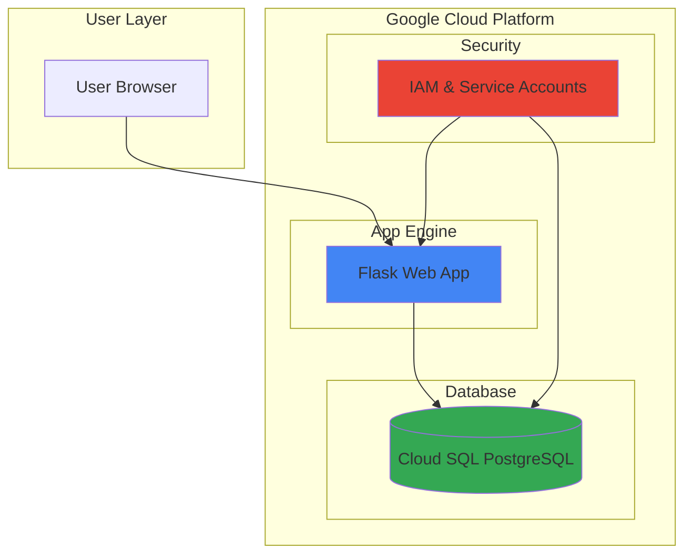

# Personal Expense Tracker with App Engine and Cloud SQL

## Problem

Managing personal finances often requires tracking daily expenses across multiple categories, but traditional spreadsheet solutions lack accessibility and real-time updates. Many individuals struggle with maintaining consistent expense logging due to the friction of manual data entry and the inability to access their financial data from anywhere. Without a centralized, always-available system, expense tracking becomes inconsistent, leading to poor financial visibility and decision-making.

## Solution

Build a simple yet effective web-based expense tracker using Google App Engine for serverless hosting and Cloud SQL for reliable data persistence. App Engine provides automatic scaling and zero-maintenance deployment, while Cloud SQL offers fully-managed PostgreSQL database services with built-in security and backup features. This combination creates a cost-effective solution that scales with usage and requires minimal operational overhead.

## Architecture Diagram



## Prerequisites

1. Google Cloud account with billing enabled and App Engine API access
2. Google Cloud CLI installed and configured (or Cloud Shell access)
3. Basic knowledge of Python and web development concepts
4. Understanding of relational database principles
5. Estimated cost: $1.00-$3.00 per month for light usage (App Engine F1 instance + Cloud SQL db-f1-micro instance)

> **Note**: This configuration follows Google Cloud best practices for beginner web applications. New Google Cloud users receive $300 in free credits to explore services.

## Preparation

```bash
# Set environment variables for GCP resources
export PROJECT_ID="expense-tracker-$(date +%s)"
export REGION="us-central1"
export ZONE="us-central1-a"

# Generate unique suffix for resource names
RANDOM_SUFFIX=$(openssl rand -hex 3)
export INSTANCE_NAME="expense-db-${RANDOM_SUFFIX}"
export DB_NAME="expenses"
export DB_USER="expense_user"
export DB_PASSWORD=$(openssl rand -base64 32)

# Create new project for this tutorial
gcloud projects create ${PROJECT_ID} \
    --name="Expense Tracker"

# Set default project and region
gcloud config set project ${PROJECT_ID}
gcloud config set compute/region ${REGION}
gcloud config set compute/zone ${ZONE}

# Enable required APIs
gcloud services enable appengine.googleapis.com
gcloud services enable sql.googleapis.com

echo "✅ Project configured: ${PROJECT_ID}"
echo "✅ Database password stored: ${DB_PASSWORD}"
```

## Steps

1. **Initialize App Engine Application**:

   App Engine provides a fully managed serverless platform that automatically handles scaling, load balancing, and infrastructure management. Initializing an App Engine application creates the foundational runtime environment where your Flask web application will execute, eliminating the need to manage servers or configure deployment infrastructure.

   ```bash
   # Initialize App Engine in the current project
   gcloud app create --region=${REGION}
   
   # Verify App Engine application creation
   gcloud app describe --format="value(defaultHostname)"
   
   echo "✅ App Engine application initialized in ${REGION}"
   ```

   The App Engine application is now ready to host your web application with automatic scaling capabilities and integrated monitoring through Google Cloud's operations suite.

2. **Create Cloud SQL PostgreSQL Instance**:

   Cloud SQL provides a fully managed PostgreSQL database service with automated backups, patch management, and high availability. Creating a database instance establishes the persistent storage layer for your expense data, with built-in security features and seamless integration with App Engine applications.

   ```bash
   # Create Cloud SQL PostgreSQL instance with latest version
   gcloud sql instances create ${INSTANCE_NAME} \
       --database-version=POSTGRES_17 \
       --tier=db-f1-micro \
       --region=${REGION} \
       --root-password=${DB_PASSWORD} \
       --storage-type=SSD \
       --storage-size=10GB \
       --authorized-networks=0.0.0.0/0
   
   # Wait for instance to be ready
   echo "⏳ Waiting for Cloud SQL instance to be ready..."
   gcloud sql instances describe ${INSTANCE_NAME} \
       --format="value(state)"
   
   echo "✅ Cloud SQL instance created: ${INSTANCE_NAME}"
   ```

   The PostgreSQL instance is now operational with enterprise-grade security, automatic backups, and monitoring capabilities integrated into the Google Cloud ecosystem.

3. **Configure Database and User**:

   Proper database security requires creating dedicated database users with limited privileges rather than using the root account. This step establishes the application database and a specialized user account that follows the principle of least privilege for enhanced security posture.

   ```bash
   # Create application database
   gcloud sql databases create ${DB_NAME} \
       --instance=${INSTANCE_NAME}
   
   # Create dedicated database user
   gcloud sql users create ${DB_USER} \
       --instance=${INSTANCE_NAME} \
       --password=${DB_PASSWORD}
   
   # Verify database creation
   gcloud sql databases list --instance=${INSTANCE_NAME} \
       --format="table(name)"
   
   echo "✅ Database and user configured successfully"
   ```

   The database infrastructure is now secured with appropriate user permissions and ready for application data storage.

4. **Create Flask Application Structure**:

   Flask provides a lightweight and flexible web framework that integrates seamlessly with Google Cloud services. Creating the application structure establishes the foundation for handling HTTP requests, rendering templates, and managing database connections in a maintainable and scalable architecture.

   ```bash
   # Create project directory structure
   mkdir -p expense-tracker-app/{templates,static/css}
   cd expense-tracker-app
   
   # Create main application file
   cat > main.py << 'EOF'
import os
from flask import Flask, render_template, request, redirect, url_for, flash
import sqlalchemy
from sqlalchemy import create_engine, text
from datetime import datetime

app = Flask(__name__)
app.secret_key = os.environ.get('SECRET_KEY', 'dev-secret-key')

# Database configuration
def get_db_connection():
    if os.environ.get('GAE_ENV', '').startswith('standard'):
        # Production environment - use Unix socket
        db_socket_dir = "/cloudsql"
        cloud_sql_connection_name = os.environ.get('CLOUD_SQL_CONNECTION_NAME')
        db_url = f"postgresql://{os.environ.get('DB_USER')}:{os.environ.get('DB_PASSWORD')}@/{os.environ.get('DB_NAME')}?host={db_socket_dir}/{cloud_sql_connection_name}"
    else:
        # Development environment - use TCP connection
        db_host = os.environ.get('DB_HOST', 'localhost')
        db_url = f"postgresql://{os.environ.get('DB_USER')}:{os.environ.get('DB_PASSWORD')}@{db_host}/{os.environ.get('DB_NAME')}"
    
    return create_engine(db_url, echo=True)

@app.route('/')
def index():
    try:
        engine = get_db_connection()
        with engine.connect() as conn:
            result = conn.execute(text("""
                SELECT id, description, amount, category, date_created 
                FROM expenses 
                ORDER BY date_created DESC 
                LIMIT 10
            """))
            expenses = [dict(row._mapping) for row in result]
            
            # Calculate total expenses
            total_result = conn.execute(text(
                "SELECT COALESCE(SUM(amount), 0) as total FROM expenses"
            ))
            total = total_result.fetchone()[0]
        
        return render_template('index.html', expenses=expenses, total=float(total))
    except Exception as e:
        app.logger.error(f"Database error: {e}")
        return render_template('index.html', expenses=[], total=0, error=str(e))

@app.route('/add', methods=['POST'])
def add_expense():
    description = request.form.get('description', '').strip()
    amount_str = request.form.get('amount', '0')
    category = request.form.get('category', '').strip()
    
    try:
        amount = float(amount_str)
        if not description or amount <= 0 or not category:
            flash('Please provide valid expense details.', 'error')
            return redirect(url_for('index'))
        
        engine = get_db_connection()
        with engine.connect() as conn:
            conn.execute(text("""
                INSERT INTO expenses (description, amount, category, date_created)
                VALUES (:description, :amount, :category, :date_created)
            """), {
                'description': description,
                'amount': amount,
                'category': category,
                'date_created': datetime.now()
            })
            conn.commit()
        
        flash('Expense added successfully!', 'success')
    except ValueError:
        flash('Please enter a valid amount.', 'error')
    except Exception as e:
        app.logger.error(f"Error adding expense: {e}")
        flash('Failed to add expense. Please try again.', 'error')
    
    return redirect(url_for('index'))

@app.route('/delete/<int:expense_id>')
def delete_expense(expense_id):
    try:
        engine = get_db_connection()
        with engine.connect() as conn:
            result = conn.execute(text(
                "DELETE FROM expenses WHERE id = :id"
            ), {'id': expense_id})
            conn.commit()
            
            if result.rowcount == 0:
                flash('Expense not found.', 'error')
            else:
                flash('Expense deleted successfully!', 'success')
    except Exception as e:
        app.logger.error(f"Error deleting expense: {e}")
        flash('Failed to delete expense. Please try again.', 'error')
    
    return redirect(url_for('index'))

if __name__ == '__main__':
    app.run(debug=True, host='0.0.0.0', port=8080)
EOF
   
   echo "✅ Flask application created with error handling"
   ```

   The Flask application now provides a complete web interface for expense management with proper database integration, error handling, and improved user feedback.

5. **Create HTML Template**:

   User interface design directly impacts application usability and adoption. Creating a clean, responsive HTML template ensures that users can efficiently interact with the expense tracking functionality across different devices while maintaining accessibility standards.

   ```bash
   # Create HTML template for the web interface
   cat > templates/index.html << 'EOF'
<!DOCTYPE html>
<html lang="en">
<head>
    <meta charset="UTF-8">
    <meta name="viewport" content="width=device-width, initial-scale=1.0">
    <title>Personal Expense Tracker</title>
    <link href="https://cdn.jsdelivr.net/npm/bootstrap@5.3.2/dist/css/bootstrap.min.css" rel="stylesheet">
    <link href="https://cdn.jsdelivr.net/npm/bootstrap-icons@1.11.1/font/bootstrap-icons.css" rel="stylesheet">
</head>
<body class="bg-light">
    <div class="container mt-4">
        <div class="row justify-content-center">
            <div class="col-md-10">
                <h1 class="text-center mb-4 text-primary">
                    <i class="bi bi-wallet2"></i> Personal Expense Tracker
                </h1>
                
                <!-- Flash messages -->
                
                    
                        
                            <div class="alert alert-{{ 'danger' if category == 'error' else 'success' }} alert-dismissible fade show" role="alert">
                                <i class="bi bi-{{ 'exclamation-triangle' if category == 'error' else 'check-circle' }}"></i>
                                {{ message }}
                                <button type="button" class="btn-close" data-bs-dismiss="alert"></button>
                            </div>
                        
                    
                
                
                <!-- Add expense form -->
                <div class="card shadow-sm mb-4">
                    <div class="card-header bg-primary text-white">
                        <h3 class="mb-0"><i class="bi bi-plus-circle"></i> Add New Expense</h3>
                    </div>
                    <div class="card-body">
                        <form method="POST" action="/add" class="needs-validation" novalidate>
                            <div class="row">
                                <div class="col-md-6">
                                    <div class="mb-3">
                                        <label for="description" class="form-label">Description</label>
                                        <input type="text" class="form-control" id="description" name="description" 
                                               placeholder="Enter expense description" maxlength="255" required>
                                        <div class="invalid-feedback">
                                            Please provide a valid description.
                                        </div>
                                    </div>
                                </div>
                                <div class="col-md-3">
                                    <div class="mb-3">
                                        <label for="amount" class="form-label">Amount ($)</label>
                                        <input type="number" step="0.01" min="0.01" class="form-control" 
                                               id="amount" name="amount" placeholder="0.00" required>
                                        <div class="invalid-feedback">
                                            Please enter a valid amount.
                                        </div>
                                    </div>
                                </div>
                                <div class="col-md-3">
                                    <div class="mb-3">
                                        <label for="category" class="form-label">Category</label>
                                        <select class="form-select" id="category" name="category" required>
                                            <option value="">Select Category</option>
                                            <option value="Food & Dining">Food & Dining</option>
                                            <option value="Transportation">Transportation</option>
                                            <option value="Entertainment">Entertainment</option>
                                            <option value="Shopping">Shopping</option>
                                            <option value="Bills & Utilities">Bills & Utilities</option>
                                            <option value="Healthcare">Healthcare</option>
                                            <option value="Education">Education</option>
                                            <option value="Other">Other</option>
                                        </select>
                                        <div class="invalid-feedback">
                                            Please select a category.
                                        </div>
                                    </div>
                                </div>
                            </div>
                            <button type="submit" class="btn btn-primary">
                                <i class="bi bi-plus-lg"></i> Add Expense
                            </button>
                        </form>
                    </div>
                </div>
                
                <!-- Expenses summary -->
                <div class="card shadow-sm mb-4">
                    <div class="card-header bg-success text-white">
                        <h3 class="mb-0">
                            <i class="bi bi-graph-up"></i> Total Expenses: ${{ "%.2f"|format(total) }}
                        </h3>
                    </div>
                </div>
                
                <!-- Recent expenses -->
                <div class="card shadow-sm">
                    <div class="card-header bg-info text-white">
                        <h3 class="mb-0"><i class="bi bi-list-ul"></i> Recent Expenses</h3>
                    </div>
                    <div class="card-body">
                        
                            <div class="table-responsive">
                                <table class="table table-striped table-hover">
                                    <thead class="table-dark">
                                        <tr>
                                            <th><i class="bi bi-calendar"></i> Date</th>
                                            <th><i class="bi bi-file-text"></i> Description</th>
                                            <th><i class="bi bi-tag"></i> Category</th>
                                            <th><i class="bi bi-currency-dollar"></i> Amount</th>
                                            <th><i class="bi bi-gear"></i> Actions</th>
                                        </tr>
                                    </thead>
                                    <tbody>
                                        
                                        <tr>
                                            <td>{{ expense.date_created.strftime('%Y-%m-%d %H:%M') }}</td>
                                            <td>{{ expense.description }}</td>
                                            <td>
                                                <span class="badge bg-secondary">{{ expense.category }}</span>
                                            </td>
                                            <td class="text-end fw-bold">${{ "%.2f"|format(expense.amount) }}</td>
                                            <td>
                                                <a href="/delete/{{ expense.id }}" class="btn btn-sm btn-outline-danger" 
                                                   onclick="return confirm('Are you sure you want to delete this expense?')">
                                                    <i class="bi bi-trash"></i> Delete
                                                </a>
                                            </td>
                                        </tr>
                                        
                                    </tbody>
                                </table>
                            </div>
                        
                            <div class="text-center py-5">
                                <i class="bi bi-inbox display-1 text-muted"></i>
                                <p class="text-muted mt-3">No expenses recorded yet. Add your first expense above!</p>
                            </div>
                        
                    </div>
                </div>
            </div>
        </div>
    </div>
    
    <script src="https://cdn.jsdelivr.net/npm/bootstrap@5.3.2/dist/js/bootstrap.bundle.min.js"></script>
    <script>
        // Form validation
        (function() {
            'use strict';
            window.addEventListener('load', function() {
                var forms = document.getElementsByClassName('needs-validation');
                Array.prototype.filter.call(forms, function(form) {
                    form.addEventListener('submit', function(event) {
                        if (form.checkValidity() === false) {
                            event.preventDefault();
                            event.stopPropagation();
                        }
                        form.classList.add('was-validated');
                    }, false);
                });
            }, false);
        })();
    </script>
</body>
</html>
EOF
   
   echo "✅ Enhanced HTML template created with validation"
   ```

   The user interface now provides an intuitive experience for expense management with responsive design, form validation, and improved visual feedback using Bootstrap icons and styling.

6. **Configure Application Dependencies**:

   Python applications require explicit dependency management to ensure consistent behavior across development and production environments. Creating requirements.txt establishes reproducible deployments and enables App Engine to automatically install necessary packages during the build process.

   ```bash
   # Create requirements.txt with updated package versions
   cat > requirements.txt << 'EOF'
Flask==3.0.0
SQLAlchemy==2.0.25
psycopg2-binary==2.9.9
Werkzeug==3.0.1
EOF
   
   # Create App Engine configuration
   cat > app.yaml << 'EOF'
runtime: python39

env_variables:
  SECRET_KEY: "your-production-secret-key-here"
  DB_NAME: "expenses"
  DB_USER: "expense_user"
  DB_PASSWORD: "REPLACE_WITH_ACTUAL_PASSWORD"
  CLOUD_SQL_CONNECTION_NAME: "REPLACE_WITH_CONNECTION_NAME"

automatic_scaling:
  min_instances: 0
  max_instances: 2
  target_cpu_utilization: 0.6

handlers:
- url: /static
  static_dir: static
- url: /.*
  script: auto
EOF
   
   echo "✅ Application configuration created with updated dependencies"
   ```

   The application dependencies and runtime configuration are now defined with the latest stable versions for consistent deployment across environments.

7. **Initialize Database Schema**:

   Database schema creation establishes the data structure required for application functionality. Proper schema design with appropriate data types, constraints, and indexes ensures data integrity and optimal query performance as the expense data grows over time.

   ```bash
   # Get Cloud SQL connection name
   CONNECTION_NAME=$(gcloud sql instances describe ${INSTANCE_NAME} \
       --format="value(connectionName)")
   
   # Get the public IP address for connection
   DB_HOST=$(gcloud sql instances describe ${INSTANCE_NAME} \
       --format="value(ipAddresses[0].ipAddress)")
   
   # Create database schema using SQL commands
   gcloud sql connect ${INSTANCE_NAME} --user=postgres << EOF
\c ${DB_NAME}

CREATE TABLE IF NOT EXISTS expenses (
    id SERIAL PRIMARY KEY,
    description VARCHAR(255) NOT NULL,
    amount DECIMAL(10,2) NOT NULL CHECK (amount > 0),
    category VARCHAR(100) NOT NULL,
    date_created TIMESTAMP DEFAULT CURRENT_TIMESTAMP,
    INDEX idx_date_created (date_created DESC),
    INDEX idx_category (category)
);

-- Grant privileges to application user
GRANT SELECT, INSERT, UPDATE, DELETE ON TABLE expenses TO ${DB_USER};
GRANT USAGE, SELECT ON SEQUENCE expenses_id_seq TO ${DB_USER};

-- Insert sample data for testing
INSERT INTO expenses (description, amount, category) VALUES 
    ('Coffee at local cafe', 4.50, 'Food & Dining'),
    ('Bus fare to work', 2.25, 'Transportation'),
    ('Monthly Netflix subscription', 15.99, 'Entertainment');

\q
EOF
   
   # Update app.yaml with actual values
   sed -i "s/REPLACE_WITH_ACTUAL_PASSWORD/${DB_PASSWORD}/g" app.yaml
   sed -i "s/REPLACE_WITH_CONNECTION_NAME/${CONNECTION_NAME}/g" app.yaml
   
   echo "✅ Database schema created with sample data"
   echo "✅ Connection name: ${CONNECTION_NAME}"
   echo "✅ Database host: ${DB_HOST}"
   ```

   The database schema is now established with proper security constraints, performance indexes, and sample data for immediate testing.

8. **Deploy Application to App Engine**:

   App Engine deployment transforms your local Flask application into a globally accessible web service with automatic scaling and integrated monitoring. The deployment process handles containerization, load balancing, and SSL certificate provisioning without requiring infrastructure management expertise.

   ```bash
   # Deploy application to App Engine
   gcloud app deploy app.yaml --quiet
   
   # Get application URL
   APP_URL=$(gcloud app describe --format="value(defaultHostname)")
   
   echo "✅ Application deployed successfully"
   echo "✅ Application URL: https://${APP_URL}"
   echo "✅ Visit your expense tracker at: https://${APP_URL}"
   ```

   Your expense tracker application is now live and accessible globally through Google's edge network with enterprise-grade security and reliability.

## Validation & Testing

1. Verify App Engine deployment status:

   ```bash
   # Check App Engine service status
   gcloud app services list --format="table(id,versions)"
   ```

   Expected output: Service should show as "default" with version information and traffic allocation.

2. Test Cloud SQL instance connectivity:

   ```bash
   # Verify Cloud SQL instance is running
   gcloud sql instances describe ${INSTANCE_NAME} \
       --format="value(state,connectionName)"
   ```

   Expected output: Instance state should be "RUNNABLE" with connection name displayed.

3. Test application functionality:

   ```bash
   # Open application in browser
   gcloud app browse
   
   # Test application response
   curl -I https://${APP_URL}
   ```

   Expected output: HTTP 200 status code indicating successful application response.

4. Verify database operations:

   ```bash
   # Test database connection and view sample data
   gcloud sql connect ${INSTANCE_NAME} \
       --user=${DB_USER} --database=${DB_NAME} << 'EOF'
SELECT COUNT(*) as expense_count, 
       SUM(amount) as total_amount 
FROM expenses;
\q
EOF
   ```

   Expected output: Query should execute successfully, showing expense count and total amount from sample data.

## Cleanup

1. Remove App Engine application versions:

   ```bash
   # List and delete App Engine versions
   gcloud app versions list --format="value(id,service)" | \
   while read version service; do
       if [ "$version" != "default" ]; then
           gcloud app versions delete $version \
               --service=$service --quiet
       fi
   done
   
   echo "✅ App Engine versions cleaned up"
   ```

2. Remove Cloud SQL instance:

   ```bash
   # Delete Cloud SQL instance
   gcloud sql instances delete ${INSTANCE_NAME} --quiet
   
   echo "✅ Cloud SQL instance deleted: ${INSTANCE_NAME}"
   ```

3. Remove project (optional):

   ```bash
   # Delete entire project (removes all resources)
   gcloud projects delete ${PROJECT_ID} --quiet
   
   echo "✅ Project deletion initiated: ${PROJECT_ID}"
   echo "Note: Project deletion may take several minutes to complete"
   ```

4. Clean up local files:

   ```bash
   # Remove local application files
   cd ..
   rm -rf expense-tracker-app
   
   echo "✅ Local files cleaned up"
   ```

## Discussion

This recipe demonstrates the fundamental principles of building serverless web applications on Google Cloud Platform. App Engine's automatic scaling capabilities eliminate the need for capacity planning while providing built-in security features like DDoS protection and SSL termination. The platform's pay-per-use pricing model makes it particularly cost-effective for personal applications with variable traffic patterns, following Google Cloud's [App Engine best practices](https://cloud.google.com/appengine/docs/standard/python3/building-app).

Cloud SQL provides enterprise-grade database services without the operational complexity of managing PostgreSQL installations. The service includes automated backups, patch management, and high availability features that would require significant expertise to implement independently. The integration between App Engine and Cloud SQL through Unix domain sockets ensures secure, low-latency database connections without exposing credentials in network traffic, as detailed in the [Cloud SQL security documentation](https://cloud.google.com/sql/docs/postgres/security).

The Flask framework's simplicity makes it ideal for rapid prototyping while remaining powerful enough for production applications. Its integration with SQLAlchemy 2.0 provides robust database abstraction with modern async support and connection pooling, essential for handling concurrent users efficiently. The template-based approach separates presentation logic from business logic, facilitating maintenance and future enhancements while following established MVC patterns.

This architecture pattern scales effectively from personal projects to small business applications. App Engine can handle thousands of concurrent users with automatic instance creation, while Cloud SQL supports read replicas and connection pooling for database scaling. For production deployments, consider implementing user authentication with Google Identity Platform and database connection pooling as described in the [Cloud SQL performance guide](https://cloud.google.com/sql/docs/postgres/best-practices).

> **Tip**: Monitor your application costs using Google Cloud's built-in billing alerts and set up budget notifications to avoid unexpected charges during development and testing phases.

## Challenge

Extend this solution by implementing these enhancements:

1. **User Authentication**: Integrate Google Identity Platform to support multiple users with personalized expense tracking and secure session management using OAuth 2.0 flows.

2. **Data Analytics**: Add expense categorization charts using Chart.js and implement monthly spending reports with Cloud Functions for automated email delivery via SendGrid API.

3. **Mobile Optimization**: Enhance the responsive design with Progressive Web App (PWA) features including offline data caching using Service Workers and push notifications for budget alerts.

4. **Advanced Features**: Implement expense receipt image upload using Cloud Storage, with Cloud Vision API for automatic amount and vendor extraction from receipt images.

5. **Multi-tenant Architecture**: Refactor the application to support multiple organizations with role-based access control using Cloud IAM and shared expense tracking capabilities with data isolation.

## Infrastructure Code

*Infrastructure code will be generated after recipe approval.*