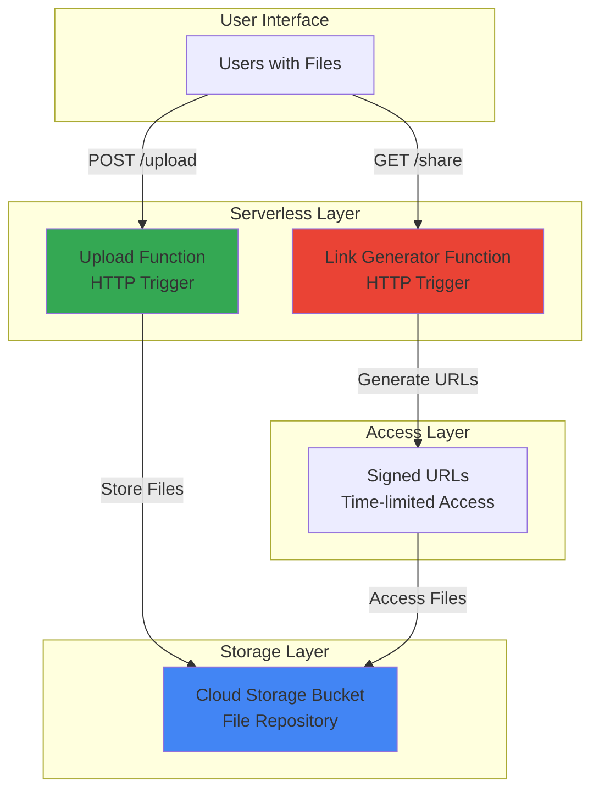

# Simple File Sharing with Cloud Storage and Functions

## Problem

Teams often need to quickly share documents, images, or files without setting up complex file servers or authentication systems. Traditional file sharing solutions require infrastructure management, user account creation, and ongoing maintenance, creating barriers to simple collaboration and file distribution.

## Solution

Create a serverless file sharing portal using Cloud Storage for scalable object storage and Cloud Functions to provide HTTP endpoints for file uploads and link generation. This approach eliminates infrastructure management while providing secure, shareable public links with configurable access controls.

## Architecture Diagram



## Prerequisites

1. Google Cloud account with billing enabled and appropriate IAM permissions
2. gcloud CLI installed and configured (or use Cloud Shell)
3. Basic knowledge of HTTP APIs and web file uploads
4. Understanding of Cloud Storage bucket concepts
5. Estimated cost: $0.10-$2.00 per month for typical usage (includes storage, function invocations, and network egress)

> **Note**: This recipe uses Google Cloud's free tier allowances for Cloud Functions (2M invocations/month) and Cloud Storage (5GB/month), making it cost-effective for development and small team use.

## Preparation

```bash
# Set environment variables for GCP resources
export PROJECT_ID="file-share-$(date +%s)"
export REGION="us-central1"
export ZONE="us-central1-a"

# Generate unique suffix for resource names
RANDOM_SUFFIX=$(openssl rand -hex 3)
export BUCKET_NAME="file-share-bucket-${RANDOM_SUFFIX}"
export UPLOAD_FUNCTION_NAME="upload-file-${RANDOM_SUFFIX}"
export LINK_FUNCTION_NAME="generate-link-${RANDOM_SUFFIX}"

# Create and set up new project
gcloud projects create ${PROJECT_ID} --name="File Sharing Portal"
gcloud config set project ${PROJECT_ID}
gcloud config set compute/region ${REGION}
gcloud config set compute/zone ${ZONE}

# Enable required APIs
gcloud services enable storage.googleapis.com
gcloud services enable cloudfunctions.googleapis.com
gcloud services enable cloudbuild.googleapis.com

echo "✅ Project configured: ${PROJECT_ID}"
echo "✅ Bucket name: ${BUCKET_NAME}"
```

## Steps

1. **Create Cloud Storage Bucket for File Storage**:

   Cloud Storage provides globally distributed, highly available object storage with strong consistency guarantees. Creating a bucket with appropriate security settings establishes the foundation for our file sharing system, enabling scalable storage from bytes to petabytes while maintaining high performance and durability.

   ```bash
   # Create Cloud Storage bucket with standard storage class
   gcloud storage buckets create gs://${BUCKET_NAME} \
       --location=${REGION} \
       --storage-class=STANDARD \
       --project=${PROJECT_ID}
   
   # Enable uniform bucket-level access for consistent permissions
   gcloud storage buckets update gs://${BUCKET_NAME} \
       --uniform-bucket-level-access
   
   # Set CORS policy to allow web uploads from any origin
   echo '[{
     "origin":["*"],
     "method":["GET","POST","PUT"],
     "responseHeader":["Content-Type"],
     "maxAgeSeconds":3600
   }]' > cors.json
   gcloud storage buckets update gs://${BUCKET_NAME} \
       --cors-file=cors.json
   
   echo "✅ Cloud Storage bucket created with web-friendly CORS policy"
   ```

   The bucket is now configured with uniform access controls and CORS policies that enable secure web-based file uploads while maintaining Google Cloud's enterprise-grade security and compliance standards.

2. **Create File Upload Function**:

   Cloud Functions provides serverless HTTP endpoints that automatically scale based on demand. This upload function handles multipart file uploads, validates file types, and stores files securely in Cloud Storage with proper error handling and logging for production reliability.

   ```bash
   # Create directory for upload function code
   mkdir -p upload-function
   cd upload-function
   
   # Create main upload function
   cat > main.py << 'EOF'
import functions_framework
from google.cloud import storage
import tempfile
import os
from werkzeug.utils import secure_filename
import logging

# Initialize Cloud Storage client
storage_client = storage.Client()
bucket_name = os.environ.get('BUCKET_NAME')

@functions_framework.http
def upload_file(request):
    """HTTP Cloud Function for file uploads."""
    # Enable CORS
    if request.method == 'OPTIONS':
        headers = {
            'Access-Control-Allow-Origin': '*',
            'Access-Control-Allow-Methods': 'POST',
            'Access-Control-Allow-Headers': 'Content-Type',
            'Access-Control-Max-Age': '3600'
        }
        return ('', 204, headers)
    
    headers = {'Access-Control-Allow-Origin': '*'}
    
    if request.method != 'POST':
        return ('Method not allowed', 405, headers)
    
    try:
        # Get uploaded file
        uploaded_file = request.files.get('file')
        if not uploaded_file:
            return ('No file provided', 400, headers)
        
        # Secure the filename
        filename = secure_filename(uploaded_file.filename)
        if not filename:
            return ('Invalid filename', 400, headers)
        
        # Upload to Cloud Storage
        bucket = storage_client.bucket(bucket_name)
        blob = bucket.blob(filename)
        blob.upload_from_file(uploaded_file)
        
        logging.info(f'File {filename} uploaded successfully')
        return ({'message': f'File {filename} uploaded successfully', 'filename': filename}, 200, headers)
        
    except Exception as e:
        logging.error(f'Upload error: {str(e)}')
        return ('Upload failed', 500, headers)
EOF
   
   # Create requirements file with current versions
   cat > requirements.txt << 'EOF'
functions-framework==3.*
google-cloud-storage==2.*
Werkzeug==3.*
EOF
   
   cd ..
   echo "✅ Upload function code created with security best practices"
   ```

   The upload function implements secure file handling with filename sanitization, CORS support, and comprehensive error logging, following Google Cloud security best practices for production workloads.

3. **Create Link Generation Function**:

   This function generates time-limited signed URLs that provide secure, temporary access to uploaded files without requiring authentication. Signed URLs are a Google Cloud security feature that enables controlled access to private resources with configurable expiration times.

   ```bash
   # Create directory for link generation function
   mkdir -p link-function
   cd link-function
   
   # Create main link generation function
   cat > main.py << 'EOF'
import functions_framework
from google.cloud import storage
from datetime import datetime, timedelta
import json
import os
import logging

# Initialize Cloud Storage client
storage_client = storage.Client()
bucket_name = os.environ.get('BUCKET_NAME')

@functions_framework.http
def generate_link(request):
    """HTTP Cloud Function for generating shareable links."""
    # Enable CORS
    if request.method == 'OPTIONS':
        headers = {
            'Access-Control-Allow-Origin': '*',
            'Access-Control-Allow-Methods': 'GET, POST',
            'Access-Control-Allow-Headers': 'Content-Type',
            'Access-Control-Max-Age': '3600'
        }
        return ('', 204, headers)
    
    headers = {'Access-Control-Allow-Origin': '*'}
    
    try:
        # Get filename from request
        if request.method == 'POST':
            data = request.get_json()
            filename = data.get('filename') if data else None
        else:
            filename = request.args.get('filename')
        
        if not filename:
            return ('Filename required', 400, headers)
        
        # Generate signed URL (valid for 1 hour)
        bucket = storage_client.bucket(bucket_name)
        blob = bucket.blob(filename)
        
        # Check if file exists
        if not blob.exists():
            return ('File not found', 404, headers)
        
        # Generate signed URL with 1 hour expiration
        url = blob.generate_signed_url(
            version="v4",
            expiration=datetime.utcnow() + timedelta(hours=1),
            method="GET"
        )
        
        logging.info(f'Generated signed URL for {filename}')
        return ({
            'filename': filename,
            'download_url': url,
            'expires_in': '1 hour'
        }, 200, headers)
        
    except Exception as e:
        logging.error(f'Link generation error: {str(e)}')
        return ('Link generation failed', 500, headers)
EOF
   
   # Create requirements file
   cat > requirements.txt << 'EOF'
functions-framework==3.*
google-cloud-storage==2.*
EOF
   
   cd ..
   echo "✅ Link generation function created with signed URL security"
   ```

   The link generation function creates time-limited signed URLs that expire after one hour, providing secure access control without requiring user authentication or complex permission management.

4. **Deploy Upload Function**:

   Deploying the upload function creates a serverless HTTP endpoint that automatically scales based on traffic. Cloud Functions provides built-in monitoring, logging, and error handling, making it ideal for production file upload workloads with enterprise-grade reliability.

   ```bash
   # Deploy upload function with environment variable and latest Python runtime
   gcloud functions deploy ${UPLOAD_FUNCTION_NAME} \
       --runtime python312 \
       --trigger-http \
       --source ./upload-function \
       --entry-point upload_file \
       --memory 256MB \
       --timeout 60s \
       --allow-unauthenticated \
       --set-env-vars BUCKET_NAME=${BUCKET_NAME} \
       --region ${REGION}
   
   # Get function URL
   UPLOAD_URL=$(gcloud functions describe ${UPLOAD_FUNCTION_NAME} \
       --region ${REGION} \
       --format="value(httpsTrigger.url)")
   
   echo "✅ Upload function deployed successfully"
   echo "Upload URL: ${UPLOAD_URL}"
   ```

   The upload function is now live with automatic scaling, built-in security, and production-ready error handling. The HTTP trigger enables direct integration with web applications and mobile apps.

5. **Deploy Link Generation Function**:

   The link generation function provides a secure API endpoint for creating shareable URLs. This serverless approach eliminates the need for session management or complex authentication while maintaining security through time-limited access tokens.

   ```bash
   # Deploy link generation function
   gcloud functions deploy ${LINK_FUNCTION_NAME} \
       --runtime python312 \
       --trigger-http \
       --source ./link-function \
       --entry-point generate_link \
       --memory 256MB \
       --timeout 30s \
       --allow-unauthenticated \
       --set-env-vars BUCKET_NAME=${BUCKET_NAME} \
       --region ${REGION}
   
   # Get function URL
   LINK_URL=$(gcloud functions describe ${LINK_FUNCTION_NAME} \
       --region ${REGION} \
       --format="value(httpsTrigger.url)")
   
   echo "✅ Link generation function deployed successfully"
   echo "Link generation URL: ${LINK_URL}"
   ```

   Both functions are now deployed and ready to handle file uploads and link generation with automatic scaling and built-in monitoring through Google Cloud's operations suite.

6. **Create Simple Web Interface**:

   A basic HTML interface demonstrates the file sharing functionality and provides a foundation for building more sophisticated user interfaces. This client-side implementation shows how to integrate with the serverless backend using standard web technologies.

   ```bash
   # Create simple HTML interface for testing
   cat > file-share-interface.html << EOF
<!DOCTYPE html>
<html>
<head>
    <title>Simple File Sharing Portal</title>
    <style>
        body { font-family: Arial, sans-serif; max-width: 600px; margin: 50px auto; padding: 20px; }
        .section { margin: 30px 0; padding: 20px; border: 1px solid #ddd; border-radius: 5px; }
        button { background: #4285F4; color: white; padding: 10px 20px; border: none; border-radius: 3px; cursor: pointer; }
        button:hover { background: #3367D6; }
        .result { margin-top: 10px; padding: 10px; background: #f0f0f0; border-radius: 3px; }
        .loading { display: none; color: #666; }
    </style>
</head>
<body>
    <h1>Simple File Sharing Portal</h1>
    
    <div class="section">
        <h2>Upload File</h2>
        <input type="file" id="fileInput" accept="*/*">
        <button onclick="uploadFile()">Upload</button>
        <div class="loading" id="uploadLoading">Uploading...</div>
        <div id="uploadResult" class="result" style="display:none;"></div>
    </div>
    
    <div class="section">
        <h2>Generate Share Link</h2>
        <input type="text" id="filenameInput" placeholder="Enter filename">
        <button onclick="generateLink()">Generate Link</button>
        <div class="loading" id="linkLoading">Generating link...</div>
        <div id="linkResult" class="result" style="display:none;"></div>
    </div>
    
    <script>
        const uploadUrl = '${UPLOAD_URL}';
        const linkUrl = '${LINK_URL}';
        
        async function uploadFile() {
            const fileInput = document.getElementById('fileInput');
            const resultDiv = document.getElementById('uploadResult');
            const loadingDiv = document.getElementById('uploadLoading');
            
            if (!fileInput.files[0]) {
                alert('Please select a file');
                return;
            }
            
            const formData = new FormData();
            formData.append('file', fileInput.files[0]);
            
            loadingDiv.style.display = 'block';
            resultDiv.style.display = 'none';
            
            try {
                const response = await fetch(uploadUrl, {
                    method: 'POST',
                    body: formData
                });
                
                const result = await response.json();
                loadingDiv.style.display = 'none';
                resultDiv.innerHTML = response.ok ? 
                    \`<strong>✅ Success:</strong> \${result.message}\` : 
                    \`<strong>❌ Error:</strong> Upload failed\`;
                resultDiv.style.display = 'block';
                
                if (response.ok) {
                    document.getElementById('filenameInput').value = result.filename;
                }
            } catch (error) {
                loadingDiv.style.display = 'none';
                resultDiv.innerHTML = \`<strong>❌ Error:</strong> \${error.message}\`;
                resultDiv.style.display = 'block';
            }
        }
        
        async function generateLink() {
            const filename = document.getElementById('filenameInput').value;
            const resultDiv = document.getElementById('linkResult');
            const loadingDiv = document.getElementById('linkLoading');
            
            if (!filename) {
                alert('Please enter a filename');
                return;
            }
            
            loadingDiv.style.display = 'block';
            resultDiv.style.display = 'none';
            
            try {
                const response = await fetch(linkUrl, {
                    method: 'POST',
                    headers: {'Content-Type': 'application/json'},
                    body: JSON.stringify({filename: filename})
                });
                
                const result = await response.json();
                loadingDiv.style.display = 'none';
                
                if (response.ok) {
                    resultDiv.innerHTML = \`
                        <strong>✅ Shareable Link Generated:</strong><br>
                        <a href="\${result.download_url}" target="_blank" style="word-break: break-all;">\${result.download_url}</a><br>
                        <small>🕒 Expires in: \${result.expires_in}</small>
                    \`;
                } else {
                    resultDiv.innerHTML = \`<strong>❌ Error:</strong> \${result.message || 'Link generation failed'}\`;
                }
                resultDiv.style.display = 'block';
            } catch (error) {
                loadingDiv.style.display = 'none';
                resultDiv.innerHTML = \`<strong>❌ Error:</strong> \${error.message}\`;
                resultDiv.style.display = 'block';
            }
        }
    </script>
</body>
</html>
EOF
   
   echo "✅ Simple web interface created: file-share-interface.html"
   echo "Open this file in a web browser to test the file sharing system"
   ```

   The web interface provides an intuitive way to test the file sharing functionality with improved user experience indicators and demonstrates how to integrate with the serverless backend using modern web APIs and asynchronous JavaScript.

## Validation & Testing

1. **Verify Cloud Storage bucket configuration**:

   ```bash
   # Check bucket configuration and CORS policy
   gcloud storage buckets describe gs://${BUCKET_NAME}
   gcloud storage buckets describe gs://${BUCKET_NAME} \
       --format="value(cors)"
   ```

   Expected output: Bucket details showing STANDARD storage class and CORS configuration allowing web uploads.

2. **Test Cloud Functions deployment**:

   ```bash
   # Check function status and configuration
   gcloud functions describe ${UPLOAD_FUNCTION_NAME} \
       --region ${REGION} \
       --format="table(name,status,runtime)"
   
   gcloud functions describe ${LINK_FUNCTION_NAME} \
       --region ${REGION} \
       --format="table(name,status,runtime)"
   
   # Test functions are accessible
   curl -X OPTIONS ${UPLOAD_URL}
   curl -X OPTIONS ${LINK_URL}
   ```

   Expected output: Function details showing ACTIVE status and successful CORS preflight responses.

3. **Test file upload functionality**:

   ```bash
   # Create test file and upload
   echo "Hello, file sharing!" > test-file.txt
   
   # Test upload via curl
   curl -X POST \
       -F "file=@test-file.txt" \
       ${UPLOAD_URL}
   ```

   Expected output: JSON response with success message and filename confirmation.

4. **Test link generation**:

   ```bash
   # Generate shareable link for uploaded file
   curl -X POST \
       -H "Content-Type: application/json" \
       -d '{"filename":"test-file.txt"}' \
       ${LINK_URL}
   ```

   Expected output: JSON response with signed URL and expiration time.

5. **Open web interface for visual testing**:

   ```bash
   echo "Open file-share-interface.html in your web browser"
   echo "Upload URL: ${UPLOAD_URL}"
   echo "Link URL: ${LINK_URL}"
   ```

## Cleanup

1. **Delete Cloud Functions**:

   ```bash
   # Delete both Cloud Functions
   gcloud functions delete ${UPLOAD_FUNCTION_NAME} \
       --region ${REGION} \
       --quiet
   
   gcloud functions delete ${LINK_FUNCTION_NAME} \
       --region ${REGION} \
       --quiet
   
   echo "✅ Cloud Functions deleted"
   ```

2. **Remove Cloud Storage bucket and contents**:

   ```bash
   # Delete all files in bucket and the bucket itself
   gcloud storage rm -r gs://${BUCKET_NAME}
   
   echo "✅ Cloud Storage bucket and contents deleted"
   ```

3. **Clean up local files**:

   ```bash
   # Remove local function code and test files
   rm -rf upload-function/ link-function/
   rm -f cors.json test-file.txt file-share-interface.html
   
   echo "✅ Local files cleaned up"
   ```

4. **Delete project** (if created specifically for this recipe):

   ```bash
   # Delete the entire project to ensure complete cleanup
   gcloud projects delete ${PROJECT_ID} --quiet
   
   echo "✅ Project deletion initiated"
   echo "Note: Project deletion may take several minutes to complete"
   ```

## Discussion

This serverless file sharing solution demonstrates the power of Google Cloud's event-driven architecture and managed services. By combining Cloud Storage's globally distributed object storage with Cloud Functions' serverless compute platform, we've created a scalable, cost-effective solution that automatically handles traffic spikes without infrastructure management. The architecture follows [Google Cloud's Well-Architected Framework](https://cloud.google.com/architecture/framework) principles, emphasizing operational excellence through managed services and security through signed URLs and CORS policies.

The use of signed URLs is particularly noteworthy as it provides time-limited access to private resources without requiring complex authentication systems. This approach balances security with usability, allowing controlled sharing while preventing unauthorized long-term access. The one-hour expiration time can be adjusted based on business requirements, and the system supports various file types limited only by Cloud Storage's generous object size limits (up to 5TB per object). The updated Python 3.12 runtime ensures compatibility with the latest security patches and language features.

Performance characteristics scale automatically with Google Cloud's global infrastructure. Cloud Storage provides 99.999999999% (11 9's) durability and strong consistency, while Cloud Functions can scale from zero to thousands of concurrent executions within seconds. This serverless approach means you only pay for actual usage - storage costs, function invocations, and network egress - making it extremely cost-effective for variable workloads. The updated gcloud storage commands provide improved performance and better error handling compared to the legacy gsutil commands.

The architecture is production-ready with built-in monitoring through [Google Cloud Operations](https://cloud.google.com/products/operations), automatic error handling, and security best practices including CORS configuration, filename sanitization, and uniform bucket-level access controls. For enhanced security in production environments, consider implementing authentication, request rate limiting, and virus scanning through [Cloud Security Command Center](https://cloud.google.com/security-command-center) integration.

> **Tip**: Monitor costs using Google Cloud's Billing alerts and optimize performance by choosing the appropriate Cloud Storage class (Standard, Nearline, Coldline, or Archive) based on access patterns and retention requirements as described in the [Cloud Storage documentation](https://cloud.google.com/storage/docs/storage-classes).

## Challenge

Extend this solution by implementing these enhancements:

1. **Add user authentication** using Firebase Auth or Google Identity to restrict uploads to authorized users and track file ownership with user-specific storage paths
2. **Implement file type restrictions and virus scanning** using Cloud Security Command Center or third-party scanning APIs to ensure uploaded content safety and compliance
3. **Create a database layer** with Firestore to store file metadata, download counts, user permissions, and file expiration dates for advanced file management
4. **Add email notifications** using SendGrid or Gmail API to notify users when files are shared, downloaded, or approaching expiration
5. **Build a mobile app interface** using Flutter or React Native that integrates with the same Cloud Functions backend for cross-platform file sharing with offline capabilities

## Infrastructure Code

### Available Infrastructure as Code:

- [Infrastructure Code Overview](code/README.md) - Detailed description of all infrastructure components
- [Infrastructure Manager](code/infrastructure-manager/) - GCP Infrastructure Manager templates
- [Bash CLI Scripts](code/scripts/) - Example bash scripts using gcloud CLI commands to deploy infrastructure
- [Terraform](code/terraform/) - Terraform configuration files