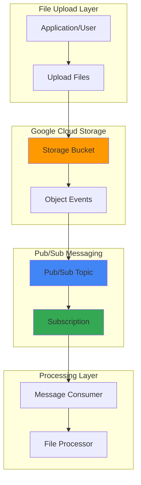

# File Upload Notifications with Cloud Storage and Pub/Sub

## Problem

Organizations need to process files immediately upon upload to cloud storage, but lack real-time visibility into file arrival events. Manual polling of storage buckets introduces delays and inefficient resource usage, while critical business processes dependent on timely file processing suffer from unpredictable latency. Without automated notification systems, teams struggle to build reactive workflows that respond instantly to new data uploads.

## Solution

Implement automated file upload notifications using Cloud Storage's native Pub/Sub integration to create event-driven processing workflows. This solution leverages Cloud Storage's ability to publish object change events directly to Pub/Sub topics, enabling downstream systems to receive instant notifications when files are uploaded, modified, or deleted. The approach provides reliable, scalable messaging with built-in retry logic and dead letter queue capabilities.

## Architecture Diagram



## Prerequisites

1. Google Cloud project with billing enabled and appropriate permissions:
   - Storage Admin (`roles/storage.admin`) on the bucket
   - Pub/Sub Admin (`roles/pubsub.admin`) on the project
2. Google Cloud CLI installed and configured (or Cloud Shell access)
3. Basic understanding of event-driven architectures and messaging patterns
4. Familiarity with Cloud Storage bucket operations
5. Estimated cost: $0.10-$0.50 for resources created during this tutorial

> **Note**: This recipe demonstrates core notification concepts. Production implementations should include proper error handling, monitoring, and security controls.

## Preparation

```bash
# Set environment variables for GCP resources
export PROJECT_ID="file-notifications-$(date +%s)"
export REGION="us-central1"
export ZONE="us-central1-a"

# Generate unique suffix for resource names
RANDOM_SUFFIX=$(openssl rand -hex 3)

# Set default project and region
gcloud config set project ${PROJECT_ID}
gcloud config set compute/region ${REGION}
gcloud config set compute/zone ${ZONE}

# Enable required APIs
gcloud services enable storage.googleapis.com
gcloud services enable pubsub.googleapis.com

# Create resource names with unique suffixes
export TOPIC_NAME="file-upload-notifications-${RANDOM_SUFFIX}"
export SUBSCRIPTION_NAME="file-processor-${RANDOM_SUFFIX}"
export BUCKET_NAME="${PROJECT_ID}-uploads-${RANDOM_SUFFIX}"

echo "✅ Project configured: ${PROJECT_ID}"
echo "✅ Topic name: ${TOPIC_NAME}"
echo "✅ Bucket name: ${BUCKET_NAME}"
```

## Steps

1. **Create Pub/Sub Topic for Notifications**:

   Pub/Sub topics serve as the central messaging hub for Cloud Storage events, providing reliable message delivery with automatic scaling and built-in retry mechanisms. The topic acts as a buffer between storage events and consuming applications, ensuring no notifications are lost even during consumer downtime.

   ```bash
   # Create the Pub/Sub topic for file notifications
   gcloud pubsub topics create ${TOPIC_NAME}
   
   # Verify topic creation
   gcloud pubsub topics list --filter="name:${TOPIC_NAME}"
   
   echo "✅ Pub/Sub topic created: ${TOPIC_NAME}"
   ```

   The Pub/Sub topic is now ready to receive messages from Cloud Storage, providing the foundation for event-driven file processing workflows.

2. **Create Pub/Sub Subscription**:

   Subscriptions enable applications to consume messages from the topic with configurable delivery guarantees and acknowledgment requirements. This pull-based subscription model allows consumers to process messages at their own pace while maintaining message durability.

   ```bash
   # Create a pull subscription for the topic
   gcloud pubsub subscriptions create ${SUBSCRIPTION_NAME} \
       --topic=${TOPIC_NAME} \
       --ack-deadline=60 \
       --message-retention-duration=7d
   
   # Verify subscription creation
   gcloud pubsub subscriptions list \
       --filter="name:${SUBSCRIPTION_NAME}"
   
   echo "✅ Pub/Sub subscription created: ${SUBSCRIPTION_NAME}"
   ```

   The subscription is configured with a 60-second acknowledgment deadline and 7-day message retention, providing sufficient time for processing while preventing message accumulation.

3. **Create Cloud Storage Bucket**:

   Cloud Storage buckets provide the foundation for file-based workflows, offering global accessibility with strong consistency guarantees. Configuring the bucket with appropriate access controls and storage class ensures optimal performance and cost efficiency.

   ```bash
   # Create the Cloud Storage bucket using the modern gcloud storage CLI
   gcloud storage buckets create gs://${BUCKET_NAME} \
       --project=${PROJECT_ID} \
       --default-storage-class=STANDARD \
       --location=${REGION}
   
   # Enable uniform bucket-level access for simplified permissions
   gcloud storage buckets update gs://${BUCKET_NAME} \
       --uniform-bucket-level-access
   
   # Verify bucket creation
   gcloud storage buckets list --filter="name:${BUCKET_NAME}"
   
   echo "✅ Cloud Storage bucket created: ${BUCKET_NAME}"
   ```

   The bucket is now ready with uniform bucket-level access enabled, simplifying IAM management and providing consistent security policies across all objects.

4. **Configure Bucket Notification to Pub/Sub**:

   Cloud Storage notifications automatically publish object change events to Pub/Sub topics, enabling real-time processing of file operations. The notification configuration specifies which events trigger messages and includes comprehensive object metadata.

   ```bash
   # Create notification configuration for object events
   gcloud storage buckets notifications create \
       gs://${BUCKET_NAME} \
       --topic=${TOPIC_NAME} \
       --event-types=OBJECT_FINALIZE,OBJECT_DELETE \
       --payload-format=JSON_API_V1
   
   # List active notification configurations
   gcloud storage buckets notifications list gs://${BUCKET_NAME}
   
   echo "✅ Storage notification configured for bucket: ${BUCKET_NAME}"
   ```

   The notification configuration now monitors file creation and deletion events, automatically publishing detailed metadata to the Pub/Sub topic for downstream processing.

5. **Test File Upload Notification**:

   Testing the complete notification workflow validates the integration between Cloud Storage and Pub/Sub, ensuring messages are properly formatted and delivered. This verification step confirms the system's readiness for production workloads.

   ```bash
   # Create a test file
   echo "Test file content $(date)" > test-upload.txt
   
   # Upload the test file to trigger notification
   gcloud storage cp test-upload.txt gs://${BUCKET_NAME}/
   
   # Wait briefly for notification propagation
   sleep 5
   
   # Check for messages in the subscription
   gcloud pubsub subscriptions pull ${SUBSCRIPTION_NAME} \
       --limit=1 \
       --format="value(message.data)" | base64 -d
   
   echo "✅ Test file uploaded and notification triggered"
   ```

   The successful message retrieval confirms that file upload events are properly flowing through the notification system to consuming applications.

## Validation & Testing

1. **Verify notification configuration is active**:

   ```bash
   # List all notification configurations for the bucket
   gcloud storage buckets notifications list gs://${BUCKET_NAME}
   ```

   Expected output: Shows notification configuration with topic name and event types.

2. **Test multiple file operations**:

   ```bash
   # Upload multiple test files to generate events
   for i in {1..3}; do
       echo "Test content ${i} $(date)" > test-file-${i}.txt
       gcloud storage cp test-file-${i}.txt gs://${BUCKET_NAME}/
   done
   
   # Wait for notification processing
   sleep 10
   
   # Pull all available messages
   gcloud pubsub subscriptions pull ${SUBSCRIPTION_NAME} \
       --limit=10 \
       --auto-ack
   ```

   Expected output: Shows JSON messages with object metadata including bucket name, object name, and event type.

3. **Verify message format and content**:

   ```bash
   # Pull one message without auto-ack to examine structure
   gcloud pubsub subscriptions pull ${SUBSCRIPTION_NAME} \
       --limit=1 \
       --format="yaml(message)"
   ```

   Expected output: Displays complete message structure with attributes (eventType, bucketId, objectId) and JSON payload containing object metadata.

## Cleanup

1. **Remove notification configuration**:

   ```bash
   # List notification configurations to get ID
   NOTIFICATION_ID=$(gcloud storage buckets notifications list \
       gs://${BUCKET_NAME} --format="value(id)" | head -n1)
   
   # Delete the notification configuration
   gcloud storage buckets notifications delete ${NOTIFICATION_ID} \
       gs://${BUCKET_NAME}
   
   echo "✅ Notification configuration removed"
   ```

2. **Delete Pub/Sub resources**:

   ```bash
   # Delete the subscription
   gcloud pubsub subscriptions delete ${SUBSCRIPTION_NAME}
   
   # Delete the topic
   gcloud pubsub topics delete ${TOPIC_NAME}
   
   echo "✅ Pub/Sub resources deleted"
   ```

3. **Remove Cloud Storage bucket and contents**:

   ```bash
   # Remove all objects from bucket and delete bucket
   gcloud storage rm --recursive gs://${BUCKET_NAME}
   
   echo "✅ Storage bucket and contents removed"
   ```

4. **Clean up local files**:

   ```bash
   # Remove test files
   rm -f test-upload.txt test-file-*.txt
   
   echo "✅ Local test files cleaned up"
   ```

## Discussion

File upload notifications with Cloud Storage and Pub/Sub create a foundation for event-driven architectures that automatically respond to data changes. This pattern eliminates the need for polling-based file detection, reducing latency and improving resource efficiency while providing reliable message delivery guarantees.

The integration between Cloud Storage and Pub/Sub leverages Google Cloud's native event publishing capabilities, ensuring messages are delivered even during consumer downtime through Pub/Sub's message retention and retry mechanisms. The JSON payload format includes comprehensive object metadata, enabling downstream processors to make informed decisions about file handling without additional API calls.

Notification configurations support filtering by event types (OBJECT_FINALIZE, OBJECT_DELETE, OBJECT_METADATA_UPDATE, OBJECT_ARCHIVE) and can include custom attributes for enhanced message routing. Production implementations should consider implementing dead letter queues for failed message processing and monitoring subscription backlog to ensure timely processing.

The architectural pattern demonstrated here scales automatically with file upload volume, as both Cloud Storage and Pub/Sub handle traffic spikes without manual intervention. Cost optimization can be achieved through appropriate message retention policies and subscription configurations that match processing requirements. For more information, refer to the [Cloud Storage Pub/Sub notifications documentation](https://cloud.google.com/storage/docs/pubsub-notifications), [Pub/Sub best practices guide](https://cloud.google.com/pubsub/docs/best-practices), and [Google Cloud Architecture Framework](https://cloud.google.com/architecture/framework).

> **Tip**: Use Pub/Sub message filtering and custom attributes to route different file types to specialized processing workflows, enabling sophisticated content-based routing patterns.

## Challenge

Extend this solution by implementing these enhancements:

1. **Content-Based Message Routing**: Add custom attributes to notifications based on file type or size, then create multiple subscriptions with message filters to route different content types to specialized processors.

2. **Error Handling and Dead Letter Queues**: Configure dead letter topics for failed message processing and implement exponential backoff retry logic in your message consumers.

3. **Multi-Region Notification Replication**: Set up notification configurations across multiple regions with topic replication to ensure notification availability during regional outages.

4. **Integration with Cloud Functions**: Deploy Cloud Functions triggered by Pub/Sub messages to automatically process uploaded files, such as image resizing, document conversion, or data validation.

5. **Monitoring and Alerting**: Implement Cloud Monitoring dashboards to track notification delivery rates, subscription lag, and processing times, with automated alerts for system health issues.

## Infrastructure Code

*Infrastructure code will be generated after recipe approval.*