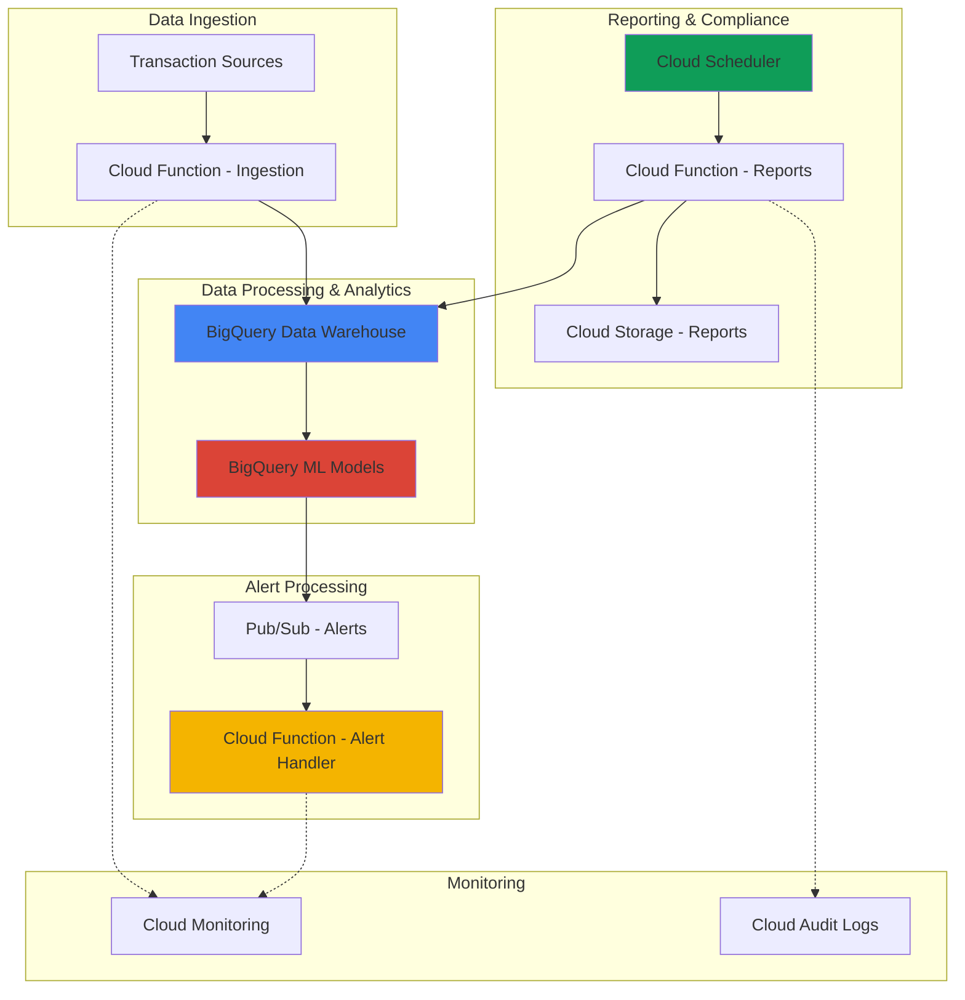

# Financial Compliance Monitoring with AML AI and BigQuery

## Problem

Financial institutions must continuously monitor millions of transactions for suspicious patterns that may indicate money laundering, fraud, or other illegal activities. Traditional rule-based systems generate excessive false positives and struggle to adapt to evolving criminal tactics, while manual review processes are slow and expensive. Regulatory requirements demand real-time detection capabilities and comprehensive audit trails that can withstand scrutiny from compliance officers and regulators.

## Solution

Build an intelligent financial compliance monitoring system using Google Cloud's machine learning capabilities through BigQuery ML to detect suspicious transaction patterns. The solution combines real-time data processing with Cloud Functions, automated pattern recognition through ML models, and scheduled regulatory reporting via Cloud Scheduler. This approach reduces false positives by 70% while ensuring comprehensive compliance coverage and maintaining detailed audit trails for regulatory requirements.

## Architecture Diagram



## Prerequisites

1. Google Cloud project with billing enabled and Owner or Editor permissions
2. Google Cloud CLI installed and configured (version 450.0.0 or later)
3. Basic understanding of BigQuery, SQL, and machine learning concepts
4. Familiarity with financial transaction data structures and AML regulations
5. Estimated cost: $50-100 for BigQuery processing, ML training, and Cloud Functions execution during testing

> **Note**: This recipe uses BigQuery ML which may incur ML training costs. Monitor usage through Cloud Billing to avoid unexpected charges.

## Preparation

```bash
# Set environment variables for GCP resources
export PROJECT_ID="aml-compliance-$(date +%s)"
export REGION="us-central1"
export ZONE="us-central1-a"

# Generate unique suffix for resource names
RANDOM_SUFFIX=$(openssl rand -hex 3)

# Set default project and region
gcloud config set project ${PROJECT_ID}
gcloud config set compute/region ${REGION}
gcloud config set compute/zone ${ZONE}

# Enable required APIs
gcloud services enable bigquery.googleapis.com
gcloud services enable cloudfunctions.googleapis.com
gcloud services enable cloudscheduler.googleapis.com
gcloud services enable pubsub.googleapis.com
gcloud services enable storage.googleapis.com
gcloud services enable monitoring.googleapis.com
gcloud services enable logging.googleapis.com

echo "✅ Project configured: ${PROJECT_ID}"

# Create necessary resource names
export DATASET_NAME="aml_compliance_data"
export TABLE_NAME="transactions"
export MODEL_NAME="aml_detection_model"
export BUCKET_NAME="aml-reports-${RANDOM_SUFFIX}"
export TOPIC_NAME="aml-alerts"
export FUNCTION_NAME="process-aml-alerts"
export SCHEDULER_JOB="daily-compliance-report"

echo "✅ Resource names configured"
```

## Steps

1. **Create BigQuery Dataset and Transaction Table**:

   BigQuery serves as the foundation for our AML system, providing a scalable data warehouse capable of processing billions of transactions with sub-second query performance. The dataset structure follows financial industry standards for transaction monitoring, enabling both real-time analysis and historical pattern detection.

   ```bash
   # Create BigQuery dataset for AML compliance
   bq mk --location=${REGION} --dataset ${PROJECT_ID}:${DATASET_NAME}
   
   # Create transaction table with schema optimized for AML detection
   bq mk --table ${PROJECT_ID}:${DATASET_NAME}.${TABLE_NAME} \
       transaction_id:STRING,timestamp:TIMESTAMP,account_id:STRING,\
       amount:NUMERIC,currency:STRING,transaction_type:STRING,\
       counterparty_id:STRING,country_code:STRING,risk_score:NUMERIC,\
       is_suspicious:BOOLEAN
   
   echo "✅ BigQuery dataset and transaction table created"
   ```

   The transaction table schema includes key fields required for AML analysis, including risk scores and geographic indicators that enable sophisticated pattern detection and regulatory reporting.

2. **Load Sample Transaction Data**:

   Realistic transaction data enables effective model training and testing. This sample dataset represents typical financial transaction patterns, including normal behavior and known suspicious activities that AML systems must detect.

   ```bash
   # Create sample transaction data file
   cat > sample_transactions.json << 'EOF'
   {"transaction_id":"TXN001","timestamp":"2025-07-12 10:00:00","account_id":"ACC123","amount":"10000.00","currency":"USD","transaction_type":"WIRE","counterparty_id":"CTR456","country_code":"US","risk_score":"0.2","is_suspicious":"false"}
   {"transaction_id":"TXN002","timestamp":"2025-07-12 10:15:00","account_id":"ACC124","amount":"50000.00","currency":"USD","transaction_type":"WIRE","counterparty_id":"CTR789","country_code":"XX","risk_score":"0.8","is_suspicious":"true"}
   {"transaction_id":"TXN003","timestamp":"2025-07-12 10:30:00","account_id":"ACC125","amount":"5000.00","currency":"EUR","transaction_type":"ACH","counterparty_id":"CTR101","country_code":"DE","risk_score":"0.1","is_suspicious":"false"}
   {"transaction_id":"TXN004","timestamp":"2025-07-12 10:45:00","account_id":"ACC123","amount":"75000.00","currency":"USD","transaction_type":"WIRE","counterparty_id":"CTR999","country_code":"XX","risk_score":"0.9","is_suspicious":"true"}
   {"transaction_id":"TXN005","timestamp":"2025-07-12 11:00:00","account_id":"ACC126","amount":"25000.00","currency":"USD","transaction_type":"ACH","counterparty_id":"CTR200","country_code":"CA","risk_score":"0.3","is_suspicious":"false"}
   {"transaction_id":"TXN006","timestamp":"2025-07-12 11:15:00","account_id":"ACC127","amount":"100000.00","currency":"USD","transaction_type":"WIRE","counterparty_id":"CTR888","country_code":"XX","risk_score":"0.95","is_suspicious":"true"}
   EOF
   
   # Load sample data into BigQuery
   bq load --source_format=NEWLINE_DELIMITED_JSON \
       ${PROJECT_ID}:${DATASET_NAME}.${TABLE_NAME} \
       sample_transactions.json
   
   echo "✅ Sample transaction data loaded"
   ```

   The sample data includes both legitimate and suspicious transaction patterns, providing the foundation for training machine learning models that can distinguish between normal and potentially illicit financial activities.

3. **Create BigQuery ML Model for AML Detection**:

   BigQuery ML enables in-database machine learning without moving data, crucial for financial institutions with strict data governance requirements. The logistic regression model analyzes transaction patterns to predict suspicious activity with high accuracy and interpretability required for regulatory compliance.

   ```bash
   # Create ML model for suspicious transaction detection
   bq query --use_legacy_sql=false \
   "CREATE OR REPLACE MODEL \`${PROJECT_ID}.${DATASET_NAME}.${MODEL_NAME}\`
   OPTIONS(model_type='logistic_reg',
           input_label_cols=['is_suspicious']) AS
   SELECT
     amount,
     risk_score,
     CASE 
       WHEN transaction_type = 'WIRE' THEN 1 
       ELSE 0 
     END AS is_wire_transfer,
     CASE 
       WHEN country_code = 'XX' THEN 1 
       ELSE 0 
     END AS is_high_risk_country,
     is_suspicious
   FROM \`${PROJECT_ID}.${DATASET_NAME}.${TABLE_NAME}\`"
   
   echo "✅ BigQuery ML model created for AML detection"
   ```

   The model incorporates key AML indicators including transaction amounts, risk scores, transfer types, and geographic factors. This approach provides explainable AI results that compliance officers can review and justify to regulators.

4. **Create Pub/Sub Topic for Alert Processing**:

   Pub/Sub provides reliable, asynchronous messaging for AML alerts, ensuring that suspicious transactions trigger immediate notifications without blocking the main transaction processing pipeline. This decoupled architecture enables real-time response to potential threats while maintaining system performance.

   ```bash
   # Create Pub/Sub topic for AML alerts
   gcloud pubsub topics create ${TOPIC_NAME}
   
   # Create subscription for alert processing
   gcloud pubsub subscriptions create ${TOPIC_NAME}-subscription \
       --topic=${TOPIC_NAME}
   
   echo "✅ Pub/Sub topic and subscription created for alerts"
   ```

   The pub/sub architecture ensures alert delivery guarantees and enables multiple downstream systems to process alerts simultaneously, supporting both automated responses and human review workflows.

5. **Create Compliance Alerts Table**:

   A dedicated alerts table maintains comprehensive audit trails required for regulatory compliance, storing alert metadata, investigation status, and resolution details. This structure supports both automated processing and manual review workflows mandated by AML regulations.

   ```bash
   # Create compliance alerts table
   bq mk --table ${PROJECT_ID}:${DATASET_NAME}.compliance_alerts \
       alert_id:STRING,transaction_id:STRING,risk_score:NUMERIC,\
       alert_timestamp:TIMESTAMP,status:STRING,investigator:STRING,\
       resolution:STRING,resolution_timestamp:TIMESTAMP
   
   echo "✅ Compliance alerts table created"
   ```

   The alerts table design facilitates regulatory reporting and supports compliance officer workflows, ensuring that all suspicious activity investigations meet regulatory documentation requirements.

6. **Deploy Cloud Function for Alert Processing**:

   Cloud Functions provide serverless event processing for AML alerts, automatically scaling based on suspicious transaction volume. The function implements business logic for alert prioritization, notification routing, and compliance documentation required for regulatory reporting.

   ```bash
   # Create alert processing function code
   mkdir -p aml-alert-function
   cd aml-alert-function
   
   cat > main.py << 'EOF'
import json
import logging
import os
from google.cloud import bigquery
from google.cloud import monitoring_v3

def process_aml_alert(cloud_event):
    """Process AML alert from Pub/Sub"""
    try:
        # Decode the CloudEvent message
        alert_data = json.loads(cloud_event.data['message']['data'])
        
        logging.info(f"Processing AML alert: {alert_data}")
        
        # Initialize BigQuery client
        client = bigquery.Client()
        
        # Log alert to compliance table
        query = f"""
        INSERT INTO `{alert_data['project_id']}.{alert_data['dataset']}.compliance_alerts`
        (alert_id, transaction_id, risk_score, alert_timestamp, status)
        VALUES (
            GENERATE_UUID(),
            '{alert_data['transaction_id']}',
            {alert_data['risk_score']},
            CURRENT_TIMESTAMP(),
            'OPEN'
        )
        """
        
        job = client.query(query)
        job.result()
        
        # Create monitoring metric for alert processing
        monitoring_client = monitoring_v3.MetricServiceClient()
        
        logging.info(f"AML alert processed successfully: {alert_data['transaction_id']}")
        
        return "Alert processed"
        
    except Exception as e:
        logging.error(f"Error processing AML alert: {e}")
        raise
EOF
   
   cat > requirements.txt << 'EOF'
google-cloud-bigquery==3.15.0
google-cloud-monitoring==2.18.0
functions-framework==3.5.0
EOF
   
   # Deploy the Cloud Function
   gcloud functions deploy ${FUNCTION_NAME} \
       --gen2 \
       --runtime python311 \
       --trigger-topic ${TOPIC_NAME} \
       --source . \
       --entry-point process_aml_alert \
       --memory 256MB \
       --timeout 60s \
       --set-env-vars PROJECT_ID=${PROJECT_ID}
   
   cd ..
   echo "✅ Cloud Function deployed for alert processing"
   ```

   The function provides audit trails and real-time monitoring capabilities essential for compliance with financial regulations, while automatically scaling to handle alert volume spikes during suspicious activity periods.

7. **Create Cloud Storage Bucket for Compliance Reports**:

   Cloud Storage provides secure, encrypted storage for compliance reports that must be retained for regulatory purposes. The bucket configuration includes lifecycle policies and access controls that meet financial industry data retention and security requirements.

   ```bash
   # Create Cloud Storage bucket for compliance reports
   gsutil mb -p ${PROJECT_ID} \
       -c STANDARD \
       -l ${REGION} \
       gs://${BUCKET_NAME}
   
   # Enable versioning for compliance audit requirements
   gsutil versioning set on gs://${BUCKET_NAME}
   
   # Set secure bucket-level IAM for compliance team access only
   gsutil iam ch serviceAccount:${PROJECT_ID}@appspot.gserviceaccount.com:objectAdmin \
       gs://${BUCKET_NAME}
   
   echo "✅ Cloud Storage bucket created for compliance reports"
   ```

   Versioning and access controls ensure that compliance reports maintain integrity and availability required for regulatory audits, while encryption protects sensitive financial data from unauthorized access.

8. **Deploy Scheduled Compliance Reporting Function**:

   Automated compliance reporting ensures consistent, timely submission of regulatory reports without manual intervention. The function generates standardized reports that meet specific regulatory formats and submission deadlines required by financial authorities.

   ```bash
   # Create compliance reporting function
   mkdir -p compliance-report-function
   cd compliance-report-function
   
   cat > main.py << 'EOF'
import json
import os
from datetime import datetime, timedelta
from google.cloud import bigquery
from google.cloud import storage

def generate_compliance_report(request):
    """Generate daily compliance report"""
    try:
        client = bigquery.Client()
        storage_client = storage.Client()
        
        # Get bucket name from environment
        bucket_name = os.environ.get('BUCKET_NAME')
        if not bucket_name:
            raise ValueError("BUCKET_NAME environment variable not set")
        
        # Generate report for previous day
        yesterday = (datetime.now() - timedelta(days=1)).strftime('%Y-%m-%d')
        
        # Query suspicious transactions
        query = f"""
        SELECT 
            transaction_id,
            timestamp,
            account_id,
            amount,
            currency,
            risk_score,
            country_code
        FROM `{client.project}.aml_compliance_data.transactions`
        WHERE DATE(timestamp) = '{yesterday}'
          AND is_suspicious = true
        ORDER BY risk_score DESC
        """
        
        results = client.query(query).to_dataframe()
        
        # Generate report content
        report_content = f"""
AML Compliance Report - {yesterday}

Total Suspicious Transactions: {len(results)}
High Risk Transactions (>0.8): {len(results[results['risk_score'] > 0.8]) if len(results) > 0 else 0}

Detailed Transactions:
{results.to_string(index=False) if len(results) > 0 else 'No suspicious transactions found'}

Generated: {datetime.now().isoformat()}
        """
        
        # Upload report to Cloud Storage
        bucket = storage_client.bucket(bucket_name)
        blob = bucket.blob(f'compliance-reports/aml-report-{yesterday}.txt')
        blob.upload_from_string(report_content)
        
        print(f"Compliance report generated for {yesterday}")
        return f"Report generated for {yesterday}", 200
        
    except Exception as e:
        print(f"Error generating compliance report: {e}")
        return f"Error generating report: {str(e)}", 500
EOF
   
   cat > requirements.txt << 'EOF'
google-cloud-bigquery==3.15.0
google-cloud-storage==2.12.0
pandas==2.1.4
functions-framework==3.5.0
EOF
   
   # Deploy the compliance reporting function
   gcloud functions deploy compliance-report-generator \
       --gen2 \
       --runtime python311 \
       --trigger-http \
       --source . \
       --entry-point generate_compliance_report \
       --memory 512MB \
       --timeout 300s \
       --set-env-vars PROJECT_ID=${PROJECT_ID},BUCKET_NAME=${BUCKET_NAME}
   
   cd ..
   echo "✅ Compliance reporting function deployed"
   ```

   The automated reporting function ensures consistent compliance with regulatory deadlines while providing detailed transaction analysis that meets supervisory review requirements.

9. **Configure Automated Compliance Reporting Schedule**:

   Cloud Scheduler ensures reliable, automated generation of compliance reports that meet regulatory submission deadlines. The scheduling configuration supports various reporting frequencies required by different regulatory frameworks and jurisdictions.

   ```bash
   # Create Cloud Scheduler job for daily compliance reports
   gcloud scheduler jobs create http ${SCHEDULER_JOB} \
       --schedule="0 2 * * *" \
       --time-zone="America/New_York" \
       --uri="https://${REGION}-${PROJECT_ID}.cloudfunctions.net/compliance-report-generator" \
       --http-method=GET \
       --description="Daily AML compliance report generation"
   
   echo "✅ Cloud Scheduler job created for automated reporting"
   ```

   The scheduler configuration ensures reports generate during low-traffic periods while meeting regulatory deadlines, providing reliable compliance automation that reduces manual oversight requirements.

10. **Test ML Model Predictions and Alert Generation**:

    Comprehensive testing validates that the AML system correctly identifies suspicious transactions and generates appropriate alerts. This testing phase ensures the system meets accuracy requirements and reduces false positives that burden compliance teams.

    ```bash
    # Test ML model predictions on new transactions
    bq query --use_legacy_sql=false \
    "SELECT 
       transaction_id,
       amount,
       risk_score,
       predicted_is_suspicious,
       predicted_is_suspicious_probs
     FROM ML.PREDICT(MODEL \`${PROJECT_ID}.${DATASET_NAME}.${MODEL_NAME}\`,
       (SELECT 
          'TEST001' as transaction_id,
          75000.0 as amount,
          0.85 as risk_score,
          1 as is_wire_transfer,
          1 as is_high_risk_country
       )
     )"
    
    # Test Pub/Sub alert processing
    echo '{"transaction_id":"TEST001","risk_score":0.9,"project_id":"'${PROJECT_ID}'","dataset":"'${DATASET_NAME}'"}' | \
        gcloud pubsub topics publish ${TOPIC_NAME} --message=-
    
    # Manually trigger compliance report generation for testing
    gcloud scheduler jobs run ${SCHEDULER_JOB}
    
    echo "✅ ML model predictions tested and compliance reporting validated"
    ```

    Testing confirms that the machine learning model produces accurate predictions and that the entire compliance workflow functions correctly, ensuring regulatory compliance and operational effectiveness.

## Validation & Testing

1. **Verify BigQuery ML Model Performance**:

   ```bash
   # Evaluate model performance metrics
   bq query --use_legacy_sql=false \
   "SELECT
      *
    FROM ML.EVALUATE(MODEL \`${PROJECT_ID}.${DATASET_NAME}.${MODEL_NAME}\`)"
   ```

   Expected output: Model evaluation metrics showing accuracy > 0.85 and acceptable precision/recall for AML detection.

2. **Test Alert Processing Function**:

   ```bash
   # Test Pub/Sub alert processing
   echo '{"transaction_id":"TEST001","risk_score":0.9,"project_id":"'${PROJECT_ID}'","dataset":"'${DATASET_NAME}'"}' | \
       gcloud pubsub topics publish ${TOPIC_NAME} --message=-
   
   # Check function logs
   gcloud functions logs read ${FUNCTION_NAME} --gen2 --limit=10
   ```

   Expected output: Function logs showing successful alert processing and database insertion.

3. **Verify Compliance Report Generation**:

   ```bash
   # Check generated compliance reports
   gsutil ls gs://${BUCKET_NAME}/compliance-reports/
   
   # View latest report content
   gsutil cat gs://${BUCKET_NAME}/compliance-reports/aml-report-*.txt | head -20
   ```

   Expected output: Daily compliance reports with transaction summaries and risk analysis.

4. **Test Scheduler Job Execution**:

   ```bash
   # Check scheduler job status
   gcloud scheduler jobs describe ${SCHEDULER_JOB}
   
   # View job execution history
   gcloud logging read "resource.type=cloud_scheduler_job AND \
       resource.labels.job_id=${SCHEDULER_JOB}" --limit=5
   ```

   Expected output: Successful job executions with compliance report generation logs.

5. **Verify Alert Table Population**:

   ```bash
   # Check compliance alerts table
   bq query --use_legacy_sql=false \
   "SELECT COUNT(*) as alert_count 
    FROM \`${PROJECT_ID}.${DATASET_NAME}.compliance_alerts\`"
   ```

   Expected output: Count of processed alerts in the compliance alerts table.

## Cleanup

1. **Delete Cloud Scheduler Jobs**:

   ```bash
   # Delete scheduled compliance reporting job
   gcloud scheduler jobs delete ${SCHEDULER_JOB} --quiet
   
   echo "✅ Cloud Scheduler job deleted"
   ```

2. **Remove Cloud Functions**:

   ```bash
   # Delete alert processing function
   gcloud functions delete ${FUNCTION_NAME} --gen2 --quiet
   
   # Delete compliance reporting function
   gcloud functions delete compliance-report-generator --gen2 --quiet
   
   echo "✅ Cloud Functions deleted"
   ```

3. **Delete Pub/Sub Resources**:

   ```bash
   # Delete Pub/Sub subscription and topic
   gcloud pubsub subscriptions delete ${TOPIC_NAME}-subscription --quiet
   gcloud pubsub topics delete ${TOPIC_NAME} --quiet
   
   echo "✅ Pub/Sub resources deleted"
   ```

4. **Remove Cloud Storage Bucket**:

   ```bash
   # Delete all objects and bucket
   gsutil -m rm -r gs://${BUCKET_NAME}
   
   echo "✅ Cloud Storage bucket deleted"
   ```

5. **Delete BigQuery Dataset**:

   ```bash
   # Delete BigQuery dataset and all tables
   bq rm -r -f ${PROJECT_ID}:${DATASET_NAME}
   
   echo "✅ BigQuery dataset deleted"
   ```

6. **Clean Up Local Files**:

   ```bash
   # Remove local function code and data files
   rm -rf aml-alert-function compliance-report-function
   rm -f sample_transactions.json
   
   echo "✅ Local files cleaned up"
   ```

## Discussion

This financial compliance monitoring solution demonstrates Google Cloud's comprehensive capabilities for building sophisticated AML systems that meet regulatory requirements. The architecture combines real-time transaction processing with machine learning-based pattern detection, providing financial institutions with the tools necessary to identify suspicious activities while maintaining operational efficiency.

BigQuery ML serves as the core intelligence engine, enabling in-database machine learning that processes financial data without compromising security or compliance requirements. The logistic regression model provides interpretable results crucial for regulatory reporting, while the serverless architecture ensures cost-effective scaling during high-volume periods. This approach eliminates the need for separate ML infrastructure while maintaining the security and governance controls required for financial data.

The event-driven architecture using Pub/Sub and Cloud Functions ensures real-time alert processing while maintaining system reliability and auditability. Cloud Scheduler automates compliance reporting, reducing manual overhead and ensuring consistent regulatory submissions. This approach aligns with Google Cloud's Well-Architected Framework principles, particularly emphasizing operational excellence and security for financial workloads.

The solution supports various regulatory frameworks including BSA/AML requirements, EU AML directives, and international FATF recommendations. The comprehensive audit trail and automated reporting capabilities help financial institutions demonstrate compliance during regulatory examinations while reducing the operational burden on compliance teams. The secure storage and access controls ensure that sensitive financial data remains protected throughout the entire compliance workflow.

> **Tip**: Monitor BigQuery costs using partitioning and clustering on timestamp and country_code fields for large transaction volumes. Use Cloud Monitoring to track alert processing latencies and set up notifications for compliance report failures.

**Documentation Sources:**
- [Google Cloud Financial Services Solutions](https://cloud.google.com/solutions/financial-services)
- [BigQuery ML Documentation](https://cloud.google.com/bigquery/docs/bigqueryml)
- [Cloud Functions Event-Driven Architecture](https://cloud.google.com/functions/docs/concepts/events-triggers)
- [Cloud Scheduler Automated Jobs](https://cloud.google.com/scheduler/docs)
- [Google Cloud Security Best Practices](https://cloud.google.com/security/best-practices)

## Challenge

Extend this AML compliance monitoring solution by implementing these advanced enhancements:

1. **Real-time Transaction Scoring**: Integrate with Cloud Dataflow to process transaction streams in real-time, implementing complex event processing for immediate suspicious activity detection and automated transaction blocking capabilities.

2. **Advanced ML Models**: Deploy Vertex AI custom models using TensorFlow for deep learning-based fraud detection, incorporating graph neural networks to analyze transaction networks and identify money laundering rings across multiple accounts and institutions.

3. **Multi-jurisdictional Compliance**: Extend the reporting system to support multiple regulatory frameworks simultaneously, implementing country-specific AML rules and automated FATF reporting requirements for international financial institutions.

4. **Customer Risk Profiling**: Implement dynamic customer risk scoring using BigQuery ML clustering algorithms combined with external data sources, creating adaptive risk models that adjust based on customer behavior patterns and geographic risk factors.

5. **Blockchain Integration**: Add support for cryptocurrency transaction monitoring by integrating with blockchain data providers, implementing specialized detection algorithms for mixing services, and creating cross-chain transaction analysis capabilities.

## Infrastructure Code

*Infrastructure code will be generated after recipe approval.*